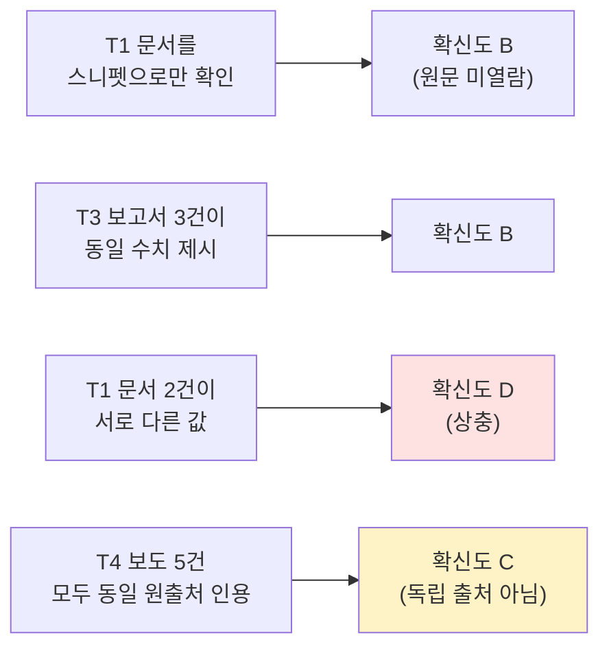
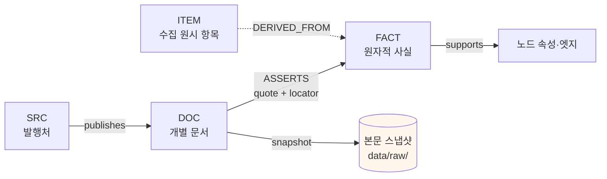
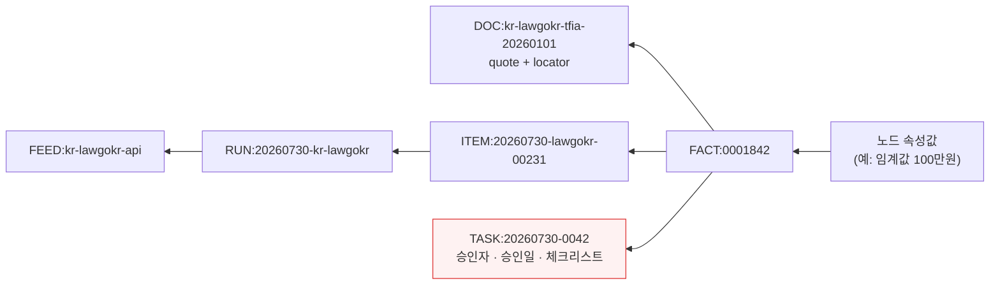

# 출처·확신도·계보 (Provenance, Confidence, Lineage)

> **원칙**: 증거 없는 노드 금지 · 출처 등급과 확신도는 분리한다

---

## 1. 출처 등급 (Source Tier)

**출처의 권위**를 나타낸다. 문서 자체의 성격으로 결정되며, 우리가 그것을 얼마나 믿는지와는 별개다.

| 등급 | 정의 | 예 | 인용 시 |
|---|---|---|---|
| **T1** | 법령·규정 원문, 관보, 감독기관 공식 발간물·가이던스 | 국가법령정보센터, EUR-Lex, eCFR, FATF Recommendations 본문 | 조문·페이지 명시 |
| **T2** | 감독기관 보도자료·연설·FAQ, 국제기구 보고서 | 감독기관 press release, 국제기구 평가보고서 | 발표일 명시 |
| **T3** | 주요 분석업체 연례보고서, 대형 로펌 정식 브리핑, 동료심사 논문 | 산업 연례보고서, 학술지 논문 | 방법론 함께 기록 |
| **T4** | 전문 매체 보도 | 업계 전문지 | 복수 출처 확인 권장 |
| **T5** | 블로그·SNS·미확인 | 개인 분석, 소셜 게시물 | **단독 근거 사용 금지** |

### 1.1 등급 판정의 함정

| 함정 | 처리 |
|---|---|
| 감독기관 사이트에 실린 제3자 문서 | 원저자 기준으로 등급 판정 |
| 법령 해설서·요약본 | T1 아님. T2/T3. **원문을 별도로 확보** |
| 벤더 보고서의 규제 요약 | T3. 규제 사실은 반드시 T1 로 교차 확인 |
| 언론이 인용한 관계자 발언 | T4. "누가 말했는가"를 기록 |
| 번역본 | 원문 등급 유지하되 `translation: true` 표기, 원문 병기 |

---

## 2. 확신도 (Confidence)

**우리가 그 주장을 얼마나 신뢰하는가**. 출처 등급의 함수이지만 동일하지 않다.

| 값 | 기준 | 산문 인용 시 |
|---|---|---|
| **A** | T1/T2 원문을 직접 열어 확인 | 단정 서술 가능 |
| **B** | T3 복수 출처 일치, 또는 T2 간접 확인 | 단정 가능하되 출처 명시 |
| **C** | T4 단일 출처 | "~로 보도되었다" 형태로만 |
| **D** | T5 또는 상충 정보 존재 | **경고 표시 필수**, 단정 금지 |

### 2.1 등급 ≠ 확신도인 경우



**마지막 사례가 중요하다** — 매체 5곳이 같은 내용을 보도해도 원출처가 하나면 독립 확인이 아니다. 확신도를 올리려면 **독립적 출처**여야 한다.

---

## 3. 증거 결속 구조



모든 지식은 이 사슬을 완주해야 한다. 어느 한 마디라도 끊기면 `추적성` 위반으로 검출된다.

### 3.1 DOC 레코드 필수 필드

```yaml
id: "DOC:kr-lawgokr-tfia-20260101"
type: "DOC"
src: "SRC:kr-lawgokr"
url: "https://..."
published: "2026-01-01"
accessed: "2026-07-30"
doc_kind: "statute-text"
content_hash: "sha256:..."
snapshot_path: "data/raw/2026/07/30/kr-lawgokr-tfia-20260101.html"
language: "ko"
translation: false
```

`content_hash` 로 **원문이 조용히 바뀌었는지** 탐지한다. 감독기관 문서는 공지 없이 수정되는 일이 흔하다. 해시 변경은 `SIGNAL` 을 발생시킨다.

---

## 4. 계보 (Lineage)

PROV-O 표준에 정렬한다. "이 지식이 어디서 왔는가"를 끝까지 되짚을 수 있어야 한다.



**검사 대응 시나리오**: "이 판단의 근거는?" → 노드 → FACT → DOC(원문 인용) + TASK(누가 언제 무슨 근거로 승인) → ITEM/RUN(언제 어디서 수집). 전 구간이 기록으로 남는다.

---

## 5. 상충 관리 (Contradiction Registry)

출처가 엇갈릴 때 **어느 쪽도 삭제하지 않는다**. 삭제는 정보 손실이고, 나중에 같은 상충을 다시 발견하게 된다.

```yaml
# kb/facts/contradictions.jsonl
{
  "id": "CTR:00031",
  "facts": ["FACT:0002010", "FACT:0002011"],
  "issue": "동일 기간 추정치 불일치",
  "analysis": "산정 범위 상이 — A는 거래소 침해만, B는 DeFi 프로토콜 포함",
  "resolution": "both_valid_different_scope",
  "action": "두 수치를 함께 인용하고 범위를 명시",
  "resolved_by": "curator",
  "resolved_at": "2026-07-30"
}
```

### 5.1 판정 유형

| `resolution` | 의미 | 후속 |
|---|---|---|
| `a_correct` / `b_correct` | 한쪽이 오류 | 오류 측 `retracted_at` 설정 |
| `both_valid_different_scope` | 정의·범위 차이 | 양쪽 유지, 범위 명시 |
| `both_valid_different_time` | 시점 차이 | 양쪽 유지, 유효기간 분리 |
| `superseded` | 후속 개정치가 존재 | 구 값에 `superseded_by` |
| `unresolved` | 판정 불가 | 미해결 목록 유지, 인용 시 경고 |

`unresolved` 는 실패가 아니다. **모른다는 것을 아는 상태**가 잘못 아는 상태보다 낫다.

---

## 6. 확신도 승격·강등

| 사건 | 처리 |
|---|---|
| 원문 확보 | C/D → A/B 승격, `TASK` 로 기록 |
| 독립 출처 추가 확인 | C → B |
| 상충 발생 | 현 등급 무관하게 D 로 강등 후 판정 |
| 출처 URL 사망 + 스냅샷 없음 | 한 단계 강등, 재확인 과제 생성 |
| 원문 해시 변경 감지 | 재확인 전까지 한 단계 강등 |
| SLA 초과 | 강등하지 않되 `stale: true` 표시 |

**강등은 자동, 승격은 사람.** 이 비대칭이 지식 인플레이션을 막는다.
