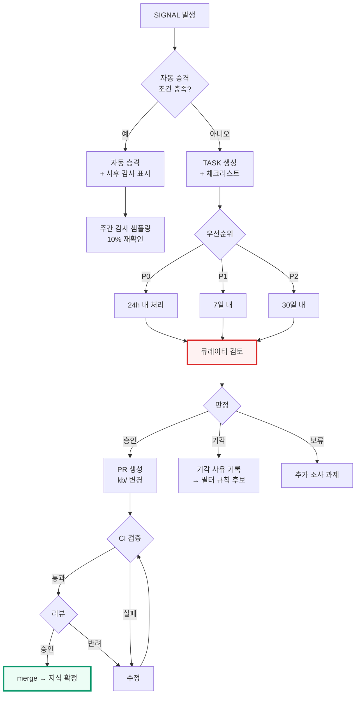

# 검증 워크플로 · 역할 · 승인 게이트

> **원칙**: 자동은 제안까지, 확정은 사람이 · **위치**: L3 → L2 승격 지점

---

## 1. 역할 정의

1인 운영에서 시작하더라도 **역할은 분리해서 정의**한다. 나중에 사람이 늘어날 때 프로세스를 다시 만들지 않기 위해서다.

| 역할 | 책임 | 권한 |
|---|---|---|
| **수집 운영자** (Collector) | 피드 건강 관리, 파서 유지 | `ingest/` 수정 |
| **큐레이터** (Curator) | 신호 판정, 원문 확인, L2 승격 | `kb/facts/`, `kb/states/` 승인 |
| **온톨로지 관리자** (Ontologist) | 클래스·술어 변경, ID 발급 규칙 | `kb/schema/` 수정, ADR 작성 |
| **도메인 검토자** (Reviewer) | 관할별 전문 검토 | 해당 관할 노드 승인 |
| **품질 관리자** (DQ Owner) | 스코어카드, 부채 관리 | 부채 상한 집행, 차단 규칙 조정 |

한 사람이 여러 역할을 겸할 수 있으나, **동일 변경에 대해 작성자와 승인자는 분리한다**(자기 승인 금지). 1인 운영 기간에는 "작성 후 24시간 경과 재검토"로 대체한다.

---

## 2. 승격 절차



---

## 3. 큐레이터 체크리스트

신호 유형별로 자동 생성된다. **체크 없이 승인 불가**.

### 3.1 규범 상태 변경 (`status_change`)

- [ ] 1차 출처(관보·법령정보센터·공식 저널)에서 확인했는가
- [ ] **공포일과 시행일을 구분**했는가
- [ ] 경과규정·유예기간이 있는가
- [ ] 상태 전이가 허용된 경로인가 ([`../ontology/02-dynamic-layer.md §3`](../ontology/02-dynamic-layer.md))
- [ ] `EVT` 노드를 함께 생성했는가
- [ ] 영향받는 `PROV`·`OBL`·산문 문서를 열거했는가
- [ ] 기존 `FACT` 와 상충하는가

### 3.2 명단 변경 (`list_diff`)

- [ ] 공식 명단 파일에서 확인했는가 (2차 보도 아님)
- [ ] 추가/삭제/변경을 정확히 구분했는가
- [ ] 지정일·해제일이 파일에 명시되어 있는가
- [ ] 가상자산 주소 필드가 포함된 경우 형식이 유효한가

### 3.3 수치 (`value_change`)

- [ ] 산정 주체·방법론·기준기간을 확보했는가
- [ ] `revision` 여부를 확인했는가 (초판 vs 개정판)
- [ ] 기존 `METRIC` 과 범위가 동일한가
- [ ] 추정치임을 `caveat` 에 명시했는가

### 3.4 집행·사고 (`enforcement`, `incident`)

- [ ] 발표 주체가 공식 기관인가
- [ ] 제재금액의 형사/민사/총액 구분을 확인했는가
- [ ] 위반 조문을 특정했는가
- [ ] (사고) 손실액 추정 주체를 기록했는가
- [ ] (귀속) 귀속 주체와 근거를 기록했는가 — 미확정이면 confidence C/D

---

## 4. PR 규약

`kb/` 변경은 반드시 PR 로. 커밋 메시지·PR 본문 형식을 고정한다.

```
kb: {변경유형} {대상노드}

- signal: SIG:20260730-0113
- task: TASK:20260730-0042
- 출처: DOC:... (T1)
- 확신도: A
- 영향 노드: 7개 (REG:..., PROV:... 외)
- 재검토 필요 산문: notes/2-regulations/....md
```

변경유형: `add` | `update` | `retract` | `merge` | `promote` | `demote`

### 4.1 리뷰 필수 조건

| 변경 | 리뷰 |
|---|---|
| `kb/schema/` (온톨로지) | ADR + 온톨로지 관리자 승인 |
| L1 노드 추가·수정 | 큐레이터 1인 |
| L1 노드 삭제 | **금지** (deprecated 로만) |
| L2 FACT/STATE 추가 | 큐레이터 1인 (자동 승격분은 사후 샘플링) |
| L2 retract | 큐레이터 1인 + 사유 필수 |
| `ingest/config/sources.yaml` | 수집 운영자 |
| 산문 (`notes/` 등) | 도메인 검토자 |

---

## 5. 큐 위생 (Queue Hygiene)

검증 큐가 무너지는 유일한 원인은 **소음**이다. 큐가 시끄러우면 사람이 보지 않고, 게이트는 형식만 남는다.

| 지표 | 목표 | 초과 시 조치 |
|---|---|---|
| 일일 신규 TASK | ≤ 15건 | 심각도 임계 상향 |
| 기각률 | ≤ 30% | 기각 사유 분석 → 필터 규칙 추가 |
| P0 미처리 24h 초과 | 0건 | 즉시 처리 또는 P1 강등 |
| 큐 총량 | ≤ 50건 | 신규 유입 일시 차단 후 소진 |

### 5.1 기각 사유의 재활용

기각할 때 사유를 분류하면 그것이 다음 필터가 된다.

| 기각 사유 | 필터 규칙화 |
|---|---|
| 관련 없는 주제 | 키워드 제외 목록 추가 |
| 이미 알고 있는 사실 | 중복 탐지 임계 조정 |
| 2차 보도 (원출처 이미 수집) | 소스 우선순위 조정 |
| 추측성 보도 | 해당 소스 tier 하향 검토 |
| 제안 단계일 뿐 | 심각도 산식에서 `proposed` 가중치 하향 |

---

## 6. 사후 감사

자동 승격분과 승인분 모두 표본 감사한다.

| 대상 | 주기 | 표본 | 확인 |
|---|---|---|---|
| 자동 승격 | 주간 | 10% | 원문 재확인 |
| 큐레이터 승인 | 월간 | 5% | 체크리스트 실제 수행 여부 |
| 확신도 A 노드 | 분기 | 3% | 인용 원문 대조 |

감사에서 발견된 오류는 **개별 정정에 그치지 않고 원인을 규칙으로 환원**한다. 같은 유형의 오류가 두 번 나오면 그것은 프로세스 결함이다.

---

## 7. 에스컬레이션

| 상황 | 조치 |
|---|---|
| P0 소스 24h 이상 장애 | 대체 경로(수동 확인) 가동 + 이슈 |
| 상충 미해결 30일 초과 | 도메인 검토자 배정 |
| 품질 종합점수 10점 이상 하락 | 신규 유입 차단 후 원인 분석 |
| 미검증 부채 5% 초과 | C/D 유입 차단, 상환 스프린트 |
| 금칙어 검출 | 즉시 차단, 커밋 이력 확인 |
