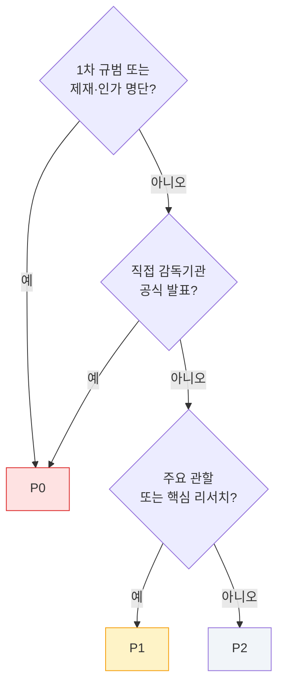
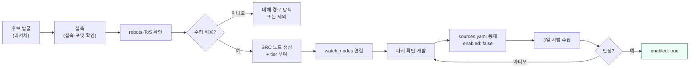

# 소스 레지스트리 — 설계 및 등재 기준

> **기계판**: `ingest/config/sources.yaml` · **채워지는 경로**: 리서치 도시에 `ingestion-sources` → 실측 검증 → 등재
> **현재 상태**: 스키마 확정 · 실측 소스 목록은 리서치 완료 후 반영

---

## 1. 등재 기준

아무 URL 이나 등록하면 파이프라인이 노이즈로 막힌다. 다음을 **모두** 충족해야 등재한다.

| # | 기준 |
|---|---|
| 1 | **실측 완료** — 실제로 접속해 응답과 포맷을 확인했다 |
| 2 | **자동 수집 허용** — robots.txt 및 이용약관 확인, 금지 시 등재 불가 |
| 3 | **소스 등급 부여** — `SRC` 노드가 존재하고 tier 가 정해졌다 |
| 4 | **감시 대상 연결** — `watch_nodes` 에 최소 1개 KB 노드 |
| 5 | **파서 존재** — 해당 `transport` 의 수집기가 처리 가능 |
| 6 | **중복 아님** — 동일 정보를 더 상위 tier 로 이미 받고 있지 않다 |

기준 6이 중요하다. 같은 발표를 관보(T1)와 매체(T4)로 동시에 받으면 큐가 두 배로 시끄러워진다. **상위 tier 가 있으면 하위는 등재하지 않는다** — 단, 상위 소스가 느리거나 불완전한 경우는 예외로 하되 `redundant_of` 로 명시한다.

---

## 2. FEED 레코드 스키마

```yaml
- id: "FEED:{namespace}-{slug}"
  src: "SRC:{...}"                    # 발행처 노드 (필수)
  label: { ko: "...", en: "..." }
  category: "primary-law"             # §3 카테고리
  transport: "rss"                    # rss | api | html | file | email
  endpoint: "https://..."
  format: "rss2"                      # rss2 | atom | json | xml | csv | html
  cadence: "daily"
  auth: "none"                        # none | api-key | oauth | registration
  priority: "P0"
  jurisdiction: "JUR:kr"
  watch_nodes: ["ORG:...", "REG:..."]
  language: "ko"

  # 컴플라이언스
  robots_ok: true                     # robots.txt 확인 결과
  robots_checked: "2026-07-30"
  tos_note: "공개 RSS · 재배포 제한 없음"
  license: "public-domain"            # public-domain | gov-open | cc-* | proprietary | unknown

  # 실측 결과 (등재 필수)
  probe:
    status: "ok"                      # ok | failed | unverified
    checked_at: "2026-07-30T00:00:00Z"
    http_status: 200
    sample_items: 12
    note: "..."

  # 운영
  parser: "generic_rss"
  parser_difficulty: 1                # 1~5
  redundant_of: null                  # 상위 tier 소스가 있으면 그 FEED id
  health:
    last_ok: null
    consecutive_failures: 0
    silence_days: 0
  enabled: true
```

`probe.status: unverified` 인 항목은 **`enabled: false` 로만 등재 가능**하다. 검증되지 않은 소스가 조용히 도는 것을 막는다.

---

## 3. 카테고리 체계

| 카테고리 | 내용 | 기본 우선순위 |
|---|---|---|
| `primary-law` | 법령 원문·관보·법령 API | P0 |
| `regulator-notice` | 감독기관 보도자료·공지·가이던스 | P0 |
| `sanctions-list` | 제재 대상 명단 파일 | P0 (2회/일) |
| `licensing-list` | 인가·등록 사업자 명단 | P0 |
| `warning-list` | 미인가·경고 업체 목록 | P1 |
| `legislative-tracker` | 입법 진행 상황 | P1 |
| `enforcement` | 집행·기소·판결 | P1 |
| `intl-body` | 국제기구 발간물 | P1 |
| `industry-research` | 분석업체 리포트·블로그 | P1 |
| `incident-tracker` | 해킹·익스플로잇 추적 | P1 |
| `academic` | 논문 피드 | P2 |
| `media` | 전문 매체 | P2 |

---

## 4. 우선순위 배정 규칙



| 등급 | SLA | 실패 대응 | 브리프 노출 |
|---|---|---|---|
| **P0** | 매일 (제재는 2회) | 1회 실패 시 알림, 24h 내 복구 | 항상 |
| **P1** | 매일 | 3회 연속 실패 시 알림 | 신호 발생 시 |
| **P2** | 매일 수집, 주간 리뷰 | 주간 리포트 | 주간만 |

---

## 5. 관할 커버리지 목표

리서치 결과로 확정하되, 최소 커버리지 목표를 미리 고정한다.

| 관할군 | 최소 소스 수 | 필수 포함 |
|---|---|---|
| 국제기구 | 5 | 국제 기준설정기구, 제재 관련 국제기구 |
| 미국 | 8 | 법령·규칙제정·제재명단·집행·주(州) |
| EU·영국 | 8 | 법령 DB·감독기관·제재명단·등록부 |
| 아시아·중동 | 10 | 주요 관할별 감독기관·인가명단 |
| **한국** | **12** | 법령 API·감독기관 3곳·입법추적·판례·업계 |
| 산업·기술 | 8 | 분석업체·사고추적·학술 |
| **합계** | **51+** | P0 최소 20 |

한국 커버리지를 가장 두껍게 잡는다. 국내 1차 출처는 RSS 미제공이 많아 소스당 정보량이 적고, 대체 경로를 여러 개 확보해야 한다.

---

## 6. 한국 소스의 특수 문제

리서치에서 반드시 결론을 내야 할 항목.

| 문제 | 확인 필요 사항 |
|---|---|
| RSS 부재 | 주요 감독기관의 공식 RSS 제공 여부. 없으면 목록 페이지 URL 패턴과 HTML 구조 |
| 법령 API | 국가법령정보센터 오픈API 신청 절차·엔드포인트·파라미터·이용 조건 |
| 입법 추적 | 국회 의안정보 검색 방식과 자동 조회 가능성 |
| 판례 | 판례 검색 서비스의 자동 접근 가능 여부 |
| 인코딩 | 일부 정부 사이트의 레거시 인코딩 |
| 접근 제한 | 국내 기관 사이트의 해외 IP·자동화 차단 여부 (CI 러너 위치 문제) |

마지막 항목이 실무적으로 가장 위험하다. GitHub Actions 러너가 해외에 있어 국내 기관 접근이 차단되면 파이프라인의 절반이 죽는다. **리서치 단계에서 반드시 실측 확인**하고, 차단 시 대체 실행 환경을 계획한다.

---

## 7. 라이선스·이용약관 대응

| 상황 | 처리 |
|---|---|
| 공공누리·정부 공개 데이터 | 출처 표시 후 사용 |
| robots.txt 금지 | **수집 불가** — 공식 API·이메일 구독으로 대체 |
| 이용약관상 자동수집 금지 | 수집 불가 — 수동 확인 대상으로 별도 관리 |
| 재배포 제한 | 수집·내부 분석은 가능, **원문 재게시 금지** — 링크와 인용만 |
| 유료·구독 | 등재하되 `auth: registration`, 라이선스 준수 범위 명시 |
| 불명확 | `license: unknown` + 보수적으로 인용만 |

**공개 저장소에 원문을 통째로 재게시하지 않는다.** 저장하는 것은 `data/raw/`(gitignore)이고, 커밋되는 것은 인용·요약·메타데이터다.

---

## 8. 등재 절차



시범 수집 3일을 거치는 이유: 첫 수집은 과거 항목이 대량 유입되어 정상 동작을 판단할 수 없다. 정상 상태의 일일 유입량을 확인한 뒤 활성화한다.
