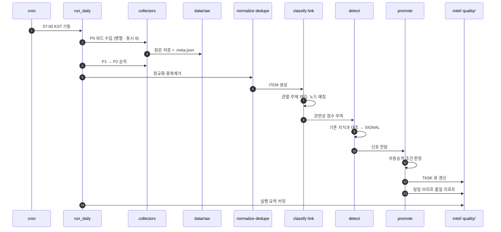
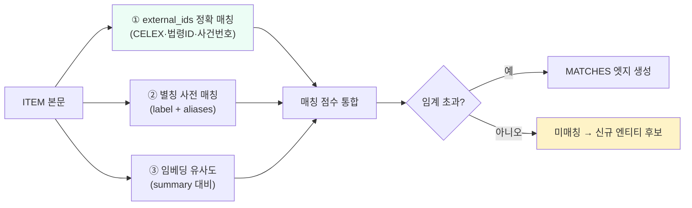
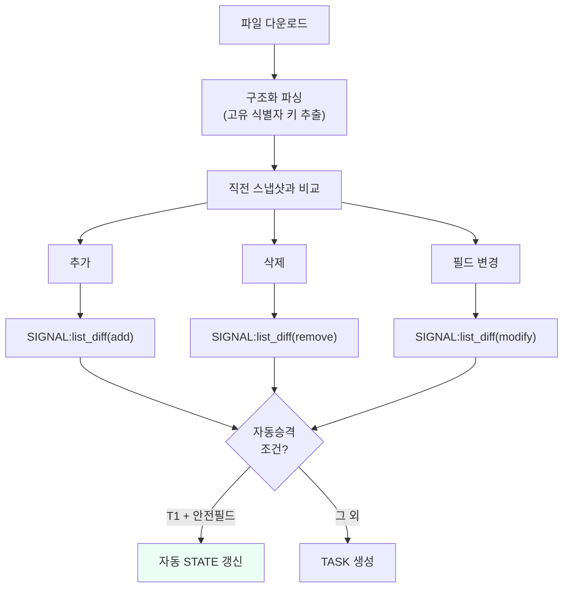
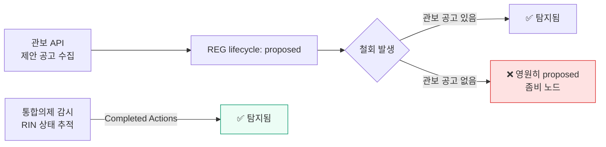

# 일일 수집 파이프라인 — 운영 설계

> **구현 위치**: `ingest/` · **실행**: GitHub Actions cron → 규모 확대 시 전용 러너
> **설계 근거**: [`../ontology/03-kinetic-layer.md`](../ontology/03-kinetic-layer.md)

---

## 1. 모듈 구성

```
ingest/
├── config/
│   ├── sources.yaml          # FEED 레지스트리 (선언적 · 코드 수정 없이 소스 추가)
│   ├── keywords.yaml         # 관련성 판정 키워드 (다국어)
│   └── filters.yaml          # 기각 사유에서 학습된 제외 규칙
├── collectors/
│   ├── base.py               # 공통 인터페이스·재시도·백오프·UA
│   ├── rss.py                # RSS/Atom
│   ├── api.py                # REST API 어댑터
│   ├── html.py               # 목록 스크레이핑 + 본문 추출
│   ├── file_snapshot.py      # 명단 파일 다운로드 + diff
│   └── registry.py           # transport → collector 매핑
├── normalize.py              # 포맷 통일·언어 감지·본문 정제
├── dedupe.py                 # content_hash + 근사 중복(simhash)
├── classify.py               # 관할·주제 태깅, 관련성 점수
├── link.py                   # 기존 KB 노드 매칭 (별칭·external_ids·임베딩)
├── detect.py                 # 변화 탐지 → SIGNAL
├── promote.py                # 자동 승격 판정 + TASK 생성
├── brief.py                  # 일일 브리프 생성
└── run_daily.py              # 오케스트레이터
```

---

## 2. 실행 순서



### 2.1 스케줄

| 작업 | 시각 (KST) | cron (UTC) |
|---|---|---|
| 메인 파이프라인 | 07:00 | `0 22 * * *` |
| 제재 명단 2차 | 19:00 | `0 10 * * *` |
| 링크 헬스체크 | 일요일 03:00 | `0 18 * * 6` |
| 인용 검증 전수 | 매월 1일 03:00 | `0 18 1 * *` |
| SLA 만료 스캔 | 매일 06:30 | `30 21 * * *` |

메인은 **07:00 KST** 에 돈다. 전날 미주·유럽 발표를 모두 포함하면서 국내 업무 시작 전에 브리프가 준비된다.

---

## 3. 수집 규율

### 3.1 예의 (Politeness)

| 항목 | 규칙 |
|---|---|
| User-Agent | 식별 가능한 문자열 + 연락 경로 명시 |
| 요청 간격 | 동일 호스트 최소 2초 |
| 동시 연결 | 호스트당 1, 전체 8 |
| robots.txt | **매 실행 시 확인**, 금지 경로 접근 안 함 |
| 조건부 요청 | `If-Modified-Since` / `ETag` 사용 |
| 재시도 | 지수 백오프 3회 (2s → 8s → 32s), 429/503 은 더 길게 |
| 시간대 | 대상 기관 업무시간 회피 (야간 수집) |

`robots_ok: false` 인 소스는 수집기가 **거부**한다. 설정으로 우회할 수 없게 한다.

### 3.2 원본 보존

```
data/raw/2026/07/30/
├── us-fincen-news/
│   ├── 20260730T220015Z.rss.xml          # 응답 원문 그대로
│   └── 20260730T220015Z.meta.json        # 요청·응답 메타
└── ofac-sdn/
    ├── 20260730T220102Z.sdn.xml
    └── 20260730T220102Z.meta.json
```

```json
{
  "feed": "FEED:us-fincen-news",
  "run": "RUN:20260730-us-fincen-news",
  "requested_at": "2026-07-30T22:00:15Z",
  "url": "https://...",
  "http_status": 200,
  "etag": "...",
  "last_modified": "...",
  "content_hash": "sha256:...",
  "bytes": 48213,
  "collector": "rss@1.0.0"
}
```

원본은 **절대 수정하지 않는다**. 파싱 로직이 바뀌어도 원본에서 재처리할 수 있어야 한다. 이것이 파서 버그로 인한 지식 오염을 되돌릴 수 있게 하는 유일한 장치다.

---

## 4. 정규화 · 중복제거

### 4.1 정규 ITEM 형식

```json
{
  "id": "ITEM:20260730-us-fincen-news-00007",
  "run": "RUN:20260730-us-fincen-news",
  "url": "https://...",
  "canonical_url": "https://...",
  "title": "...",
  "published": "2026-07-29",
  "lang": "en",
  "body_text": "...",
  "raw_path": "data/raw/2026/07/30/us-fincen-news/20260730T220015Z.rss.xml",
  "content_hash": "sha256:...",
  "simhash": "...",
  "jurisdiction": ["JUR:us"],
  "topics": ["travel-rule", "enforcement"],
  "matched_nodes": [{"id": "ORG:us-fincen", "score": 0.94}],
  "relevance": 0.81
}
```

### 4.2 중복 판정 3단계

| 단계 | 방법 | 판정 |
|---|---|---|
| 1 | `content_hash` 완전 일치 | 동일 문서 — 폐기 |
| 2 | `canonical_url` 일치 | 동일 문서 — 폐기 |
| 3 | `simhash` 해밍거리 ≤ 임계 | 근사 중복 — 클러스터로 묶고 **최고 tier 출처를 대표로** |

3단계가 중요하다. 같은 사건을 여러 매체가 보도할 때 **가장 권위 있는 출처 하나만** 신호로 올린다. 나머지는 보조 증거로 붙인다.

---

## 5. 노드 매칭 (link)

수집 항목을 기존 KB 노드에 연결한다. 이것이 "이 소식이 우리 지식의 무엇을 건드리는가"를 결정한다.



- **① 정확 매칭이 최우선.** 법령 식별번호·사건번호가 본문에 있으면 그것으로 확정한다.
- **③ 임베딩은 보조.** 단독으로는 매칭을 확정하지 않는다. 의미 유사도는 "관련 있어 보임"이지 "동일함"이 아니다.
- **미매칭 항목이 신규 엔티티 후보**다. 이것이 지식베이스가 자라는 경로다.

---

## 6. 명단 diff 처리

가장 정확한 신호원. 별도 경로로 처리한다.



대상 명단(리서치 결과로 확정):
- 각국 제재 대상자 목록 (가상자산 주소 필드 포함 여부 확인 필요)
- 관할별 인가·등록 사업자 목록
- 감독당국 경고·미인가 업체 목록
- 국제기구 이행평가 대상국 목록

**파싱 실패는 곧바로 P0 알림.** 명단 형식 변경을 놓치면 제재 상태가 통째로 낡는다.

---

## 6.4 신호 유형 (SIGNAL)

수집 항목 대부분은 지식 변화가 아니다. 노이즈를 걸러 실제 변화 후보만 신호로 승격한다.

| `sig_kind` | 발생 조건 | 예 |
|---|---|---|
| `new_norm` | 신규 규범·규칙제정 감지 | 입법예고 공고 |
| `status_change` | 기존 규범의 상태 전이 시사 | 시행일 도래·최종규칙 공포 |
| `value_change` | 기존 FACT 값과 불일치 | 임계값 변경 보도 |
| `list_diff` | 명단 파일 추가/삭제/변경 | 제재 지정·VASP 신고 수리 |
| `enforcement` | 집행조치 발표 | 과태료·합의 |
| `incident` | 해킹·사고 | 거래소 탈취 |
| `sla_expiry` | 신선도 SLA 만료 | 90일 미검토 노드 |
| `contradiction` | 신규 사실이 기존 사실과 상충 | 통계 수치 불일치 |
| `feed_silence` | 피드 침묵 | 셀렉터 파손 의심 |
| `link_rot` | 기존 증거 URL 사망 | 원문 페이지 이동 |
| **`silent_withdrawal`** | **공고 없이 사라진 규범** | **통합의제에서 Completed 로 전이 (§6.5)** |

### 심각도 산정

```
severity = w1·source_tier_score + w2·jurisdiction_weight + w3·affected_node_count
         + w4·is_p0_feed + w5·keyword_criticality
```

`affected_node_count` 가 핵심이다 — 이 변화가 그래프에서 몇 개 노드에 영향을 주는가.
**그래프가 있으니 계산 가능하다.** 단순 키워드 알림과의 결정적 차이다.
"특금법 시행령 개정"은 그에 매달린 조문·의무·산문 문서가 수십 개이므로 자동으로 최상위로 올라간다.

---

## 6.5 ⚠️ 관보가 보여주지 않는 것 — 조용한 철회

**2파 실측에서 발견된 설계 결함이다.** 규칙 *제안*은 관보에 실리지만, 규칙 *철회*는 실리지 않을 수 있다.

| 사안 | 제안 | 철회 | 관보 철회공고 |
|---|---|---|---|
| Travel Rule 임계값 $250 하향 | 85 FR 68005 (2020-10-27) | 2025-04-16 | **없음** |
| 비수탁 지갑 규칙 | 85 FR 83840 (2020-12-23) | 2024-04-12 | **없음** |
| ABLV 관련 건 | — | — | 있음 (89 FR 79184) |

같은 기관이 어떤 건은 관보 공고를 내고 어떤 건은 내지 않았다. 즉 **형식 선택은 의도적**이며,
공고 없는 철회는 예외가 아니라 정상 경로다.

### 결과

관보 API 만 감시하면 **철회된 제안을 "아직 살아있는 제안"으로 계속 오해한다.**
`proposed` 상태가 영원히 지속되는 좀비 노드가 생기고, 그 상태로 산문에 인용된다.



### 대응

1. **통합의제(Unified Agenda)를 별도 P0 소스로 등재** — `FEED:us-reginfo-agenda`.
   RIN 단위로 상태(Proposed / Final / Long-Term / **Completed**)를 추적한다.
2. **신호 유형 `silent_withdrawal` 추가** — 관보에 없으나 의제에서 사라지거나 Completed 로 전이된 RIN.
3. **`proposed` 상태 노드에 별도 SLA** — 14일. 진행 상황이 갱신되지 않으면 자동으로 재확인 과제 생성.

### 일반화

이것은 미국에 국한된 문제가 아니다. **"규범이 사라지는 경로"는 "규범이 생기는 경로"보다 조용하다.**
어느 관할에서든 다음을 별도로 확인해야 한다.

| 확인 대상 | 이유 |
|---|---|
| 입법 회기 종료 | 계류 법안이 자동 폐기된다 (한국 국회 임기만료 폐기) |
| 명단 파일에서 사라진 항목 | 해제 공고 없이 목록에서만 빠질 수 있다 |
| 갱신이 멈춘 문서 | 폐지 공고 없이 방치되는 가이던스 |
| 목록 API 의 "삭제 데이터" | 법제처는 별도 API 로 제공 — 이걸 안 보면 폐지를 놓친다 |

**설계 원칙**: 생성 경로와 소멸 경로를 **각각 별도로** 감시한다. 하나의 소스가 둘 다 알려줄 것이라고 가정하지 않는다.

---

## 7. 일일 브리프 형식

```markdown
# 일일 브리프 — YYYY-MM-DD

## BLUF
1. <가장 중요한 변화 1줄>
2. ...
(최대 5줄. 없으면 "중대 변화 없음"이라고 쓴다.)

## 승격된 지식 (N건)
| 노드 | 변경 | 출처 | 확신도 |

## 검증 대기 (N건)
| 우선순위 | 신호 | 대상 | 기한 |

## 관할별 동향
### 국제 / 미국 / EU·영국 / 아시아 / 한국

## 주의 항목
- 상충 신규 발생
- SLA 임박
- 피드 장애

## 수집 통계
소스 N개 · 신규 항목 M건 · 신호 K건 · 자동승격 J건
```

**"중대 변화 없음"을 쓸 수 있어야 한다.** 매일 무언가 중요한 일이 있는 척하면 브리프가 신뢰를 잃는다.

---

## 8. 실패 처리

| 실패 | 탐지 | 조치 |
|---|---|---|
| HTTP 4xx/5xx | 상태코드 | 백오프 재시도 → 실패 카운트 |
| 파싱 실패 | 예외 | 원문 보존 + TASK 생성 |
| 0건 수집 (P0) | 항목 수 | `feed_silence` 신호 |
| 파서 결과 급감 | 전일 대비 80% 감소 | 셀렉터 파손 의심 알림 |
| 명단 항목 수 급변 | 전일 대비 ±20% | **자동승격 중단** + 수동 확인 |
| 전체 실행 실패 | 종료 코드 | 이슈 자동 생성 |

명단 급변 시 자동승격을 멈추는 것이 중요하다. 파일 형식 변경이 "전원 해제"로 오인되는 사고를 막는다.

---

## 9. 기존 자산과의 관계

현행 `ingest/legacy/regulatory_rss.py` + `.github/workflows/regulatory-watch.yml` (주간 RSS → 이슈 생성) 은 이 파이프라인의 **원형**이다. 다음과 같이 흡수한다.

| 현행 | 전환 |
|---|---|
| 하드코딩된 `FEEDS` 딕셔너리 | `ingest/config/sources.yaml` 로 이관 + 실측 검증 |
| 키워드 단순 매칭 | `classify.py` 관련성 점수 + 노드 매칭 |
| 주간 실행 | 일일 실행 (+ 제재 명단 2회) |
| 이슈 생성으로 종료 | SIGNAL → TASK → L2 승격까지 연결 |
| 결과 미보존 (artifact 90일) | `data/` 영구 보존 + 계보 기록 |

전환 기간에는 **병행 운영**하고, 신규 파이프라인이 기존 결과를 재현하는지 확인한 뒤 교체한다.
