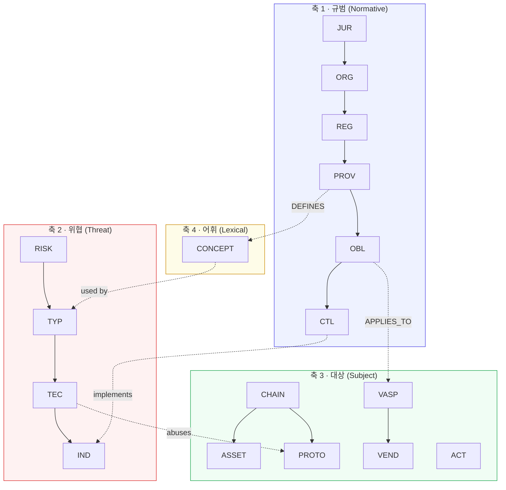
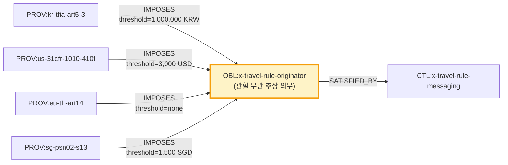
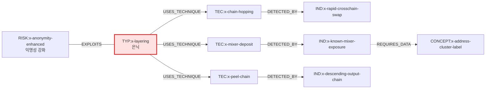
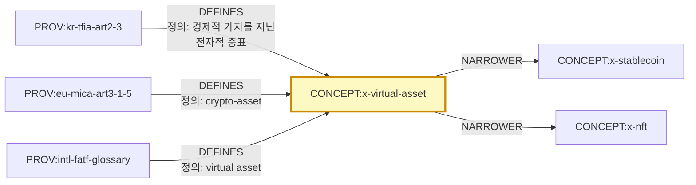

# L1 · 의미 계층 (Semantic Layer)

> **역할**: 무엇이 존재하고 서로 어떤 관계인가 · **변경 빈도**: 월~분기 · **변경 주체**: 사람(PR 리뷰 필수)
> **카탈로그**: [`04-node-edge-spec.md §3.1`](04-node-edge-spec.md) · **저장**: `kb/schema/`, `kb/entities/`

---

## 1. 이 계층이 하는 일

의미 계층은 **시간을 담지 않는다**. "특금법이 존재하고, 제5조의3이 그 일부이며, 그 조문이 트래블룰 의무를 부과한다"까지가 L1 이다. "그 의무가 지금 시행 중인가, 임계값이 얼마인가"는 L2 다.

이 분리를 지키지 않으면 온톨로지가 곧바로 썩는다. 임계값을 노드 속성에 박아 넣는 순간, 임계값이 바뀔 때마다 노드를 덮어써야 하고 과거 상태를 잃는다. **L1 은 골격, L2 는 살** 이라고 기억하면 된다.

### 판단 기준 — L1 인가 L2 인가

| 질문 | L1 | L2 |
|---|---|---|
| 이 사실이 5년 뒤에도 참인가? | 예 | 아니오 |
| "언제부터/언제까지"를 붙여야 말이 되는가? | 아니오 | 예 |
| 예 | "MiCA 는 EU 규정이다" | "MiCA CASP 조항은 2024-12-30 적용 개시" |
| 예 | "체인호핑은 은닉 단계 기법이다" | "2025년 체인호핑 사용 비중 X%" |
| 예 | "업비트는 대한민국 소재 거래소다" | "업비트는 2021-09-24 신고 수리됨" |

---

## 2. 4개 축 (axes)

L1 은 서로 직교하는 4개 축으로 구성된다. 각 축은 독립적으로 확장 가능하고, 축 사이는 엣지로만 연결된다.



### 2.1 축 1 — 규범 (JUR → ORG → REG → PROV → OBL → CTL)

규제 지식의 척추. 핵심 설계 판단 두 가지:

**(a) 조문(PROV)을 독립 노드로 분리한다.**
규범(REG) 통째로는 질의가 불가능하다. "트래블룰을 부과하는 조문"을 찾으려면 조문이 노드여야 한다. 조문 텍스트 원문을 함께 보관해 인용 검증이 가능하게 한다.

**(b) 의무(OBL)를 관할에서 탈각시킨다.**
`OBL:x-travel-rule-originator` 는 어느 나라 것도 아닌 **추상 의무**다. 각국 조문이 이 추상 의무를 `IMPOSES` 로 가리키고, 임계값 같은 관할별 차이는 엣지의 한정자(qualifier)에 담는다.



이 구조 하나로 **관할 비교표가 질의 결과로 생성된다**. 지금까지 손으로 유지하던 비교표는 파생물이 된다.

### 2.2 축 2 — 위협 (RISK → TYP → TEC → IND)

MITRE ATT&CK 의 tactic→technique→detection 구조를 차용한다. 이유는 셋:

1. 자금세탁은 목적(전술)과 수단(기법)이 명확히 분리된다 — 은닉이라는 전술을 체인호핑·믹서·피일체인 등 다른 기법으로 달성한다.
2. 기법 단위로 탐지 지표를 붙여야 실제 룰 엔진으로 내려간다.
3. STIX 2.1 로 그대로 내보낼 수 있다 ([`04-node-edge-spec.md §7`](04-node-edge-spec.md)).



### 2.3 축 3 — 대상 (CHAIN·ASSET·PROTO·VASP·VEND·ACT)

규범이 적용되고 위협이 발생하는 실체들. 이 축의 노드는 L2 상태를 가장 많이 갖는다(인가 상태·제재 지정·서비스 중단 등).

### 2.4 축 4 — 어휘 (CONCEPT)

용어사전이 별도 문서가 아니라 그래프 노드가 된다. 이점:

- 같은 용어가 관할마다 다르게 정의되는 문제를 `DEFINES` 엣지 복수 개로 표현한다. (예: "가상자산"의 특금법 정의 ≠ MiCA 의 "crypto-asset" 정의)
- 산문·리서치 산출물이 용어를 참조하면 정의 변경 시 영향 범위가 잡힌다.



---

## 3. 파일 배치

```
kb/
├── schema/
│   ├── ontology.yaml            # 클래스·술어 정의 (기계판)
│   ├── node.schema.json         # 노드 공통 JSON Schema
│   ├── edge.schema.json         # 엣지 공통 JSON Schema
│   └── types/                   # 클래스별 확장 스키마
│       ├── REG.schema.json
│       ├── OBL.schema.json
│       └── ...
└── entities/
    ├── jurisdictions/kr.yaml
    ├── regulators/kr-kofiu.yaml
    ├── regulations/
    │   ├── kr-tfia.yaml
    │   └── kr-tfia/provisions/art5-3.yaml   # 조문은 규범 하위 디렉터리
    ├── obligations/x-travel-rule-originator.yaml
    ├── controls/x-sanctions-screening.yaml
    ├── typologies/x-layering.yaml
    ├── techniques/x-chain-hopping.yaml
    ├── indicators/x-peel-chain-pattern.yaml
    ├── concepts/x-virtual-asset.yaml
    ├── vasps/kr-upbit.yaml
    ├── vendors/us-chainalysis.yaml
    ├── threat-actors/kp-lazarus.yaml
    ├── protocols/x-tornado-cash.yaml
    └── chains/x-bitcoin.yaml
```

**1 노드 = 1 파일** 원칙. 엣지는 각 노드 파일의 `edges:` 블록에 **출발점 기준으로** 기록한다. 양방향 필요 시 빌드 단계에서 역엣지를 생성한다. 이렇게 하면 PR diff 가 "어떤 노드가 바뀌었나"로 읽힌다.

### 3.1 노드 파일 예시

```yaml
# kb/entities/obligations/x-travel-rule-originator.yaml
id: "OBL:x-travel-rule-originator"
type: "OBL"
layer: "semantic"
label:
  ko: "송금인 정보 전달 의무"
  en: "Originator information transmission requirement"
  short: "트래블룰(송금인)"
aliases: ["travel rule originator obligation"]
summary: >
  가상자산 이체 시 송금 VASP 가 수취 VASP 에게 송금인 식별정보를
  이체와 동시에 또는 사전에 전달해야 하는 의무. 관할별 임계값과
  자기수탁 지갑 취급이 상이하다.
obl_kind: "information-transmission"
actor_class: "VASP"
trigger: "virtual-asset-transfer"
tags: ["travel-rule", "fatf-r16"]
edges:
  - predicate: "SATISFIED_BY"
    to: "CTL:x-travel-rule-messaging"
    qualifiers: { sufficiency: "sufficient" }
    evidence: [{ doc: "DOC:fatf-r16-2025", confidence: "A" }]
  - predicate: "APPLIES_TO"
    to: "CONCEPT:x-vasp"
    evidence: [{ doc: "DOC:fatf-r16-2025", confidence: "A" }]
evidence:
  - doc: "DOC:fatf-r16-2025"
    confidence: "A"
created_at: "2026-07-30"
updated_at: "2026-07-30"
review_due: "2026-10-30"
```

---

## 4. 온톨로지 확장 규칙

새 클래스·술어 추가는 온톨로지 변경이므로 **ADR(Architecture Decision Record)** 를 남긴다 (`docs/adr/`).

| 상황 | 조치 |
|---|---|
| 기존 클래스로 표현 가능 | 클래스 추가 금지. 태그나 `*_kind` 필드로 해결 |
| 새로운 관계 유형 필요 | 술어 추가 + `ontology.yaml` 갱신 + validator 규칙 추가 |
| 기존 술어 의미 변경 | 금지. 새 술어를 만들고 기존 것을 deprecate |
| 클래스 병합 | `MERGED_INTO` 엣지 + 구 ID 는 `status: merged` 로 영구 보존 |

**금지 사항**: 클래스 폭증. 20개 L1 클래스로 대부분이 표현되어야 한다. "이건 좀 다른데"라는 느낌만으로 클래스를 늘리면 질의가 불가능해진다. 새 클래스를 만들기 전에 **그 클래스가 참여하는 질의를 3개 이상 적어보고**, 못 적으면 만들지 않는다.

---

## 5. 초기 구축 목표 (Phase 1)

| 축 | 클래스 | 목표 노드 수 | 우선순위 |
|---|---|---|---|
| 규범 | JUR | 15 | P0 |
| 규범 | ORG | 40 | P0 |
| 규범 | REG | 60 | P0 |
| 규범 | PROV | 250 | P0 |
| 규범 | OBL | 45 | P0 |
| 규범 | CTL | 40 | P1 |
| 위협 | RISK | 25 | P1 |
| 위협 | TYP | 12 | P0 |
| 위협 | TEC | 60 | P0 |
| 위협 | IND | 120 | P1 |
| 대상 | CHAIN / ASSET | 25 / 40 | P1 |
| 대상 | PROTO | 60 | P1 |
| 대상 | VASP | 80 | P1 |
| 대상 | VEND | 45 | P1 |
| 대상 | ACT | 30 | P1 |
| 어휘 | CONCEPT | 250 | P0 |

합계 약 **1,200 노드**. 기존 산문 22,000줄에서 추출 가능한 분량이 상당수이며, 리서치 도시에가 나머지를 채운다.
