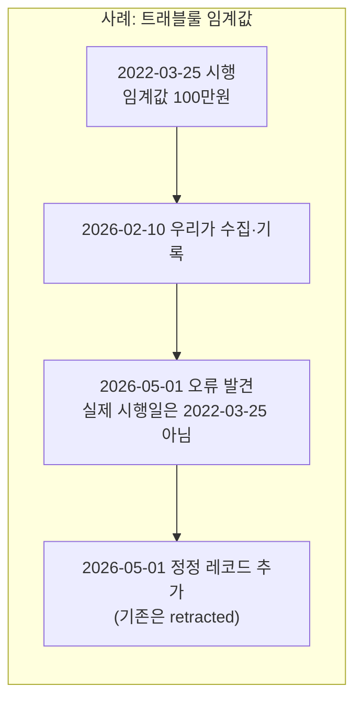
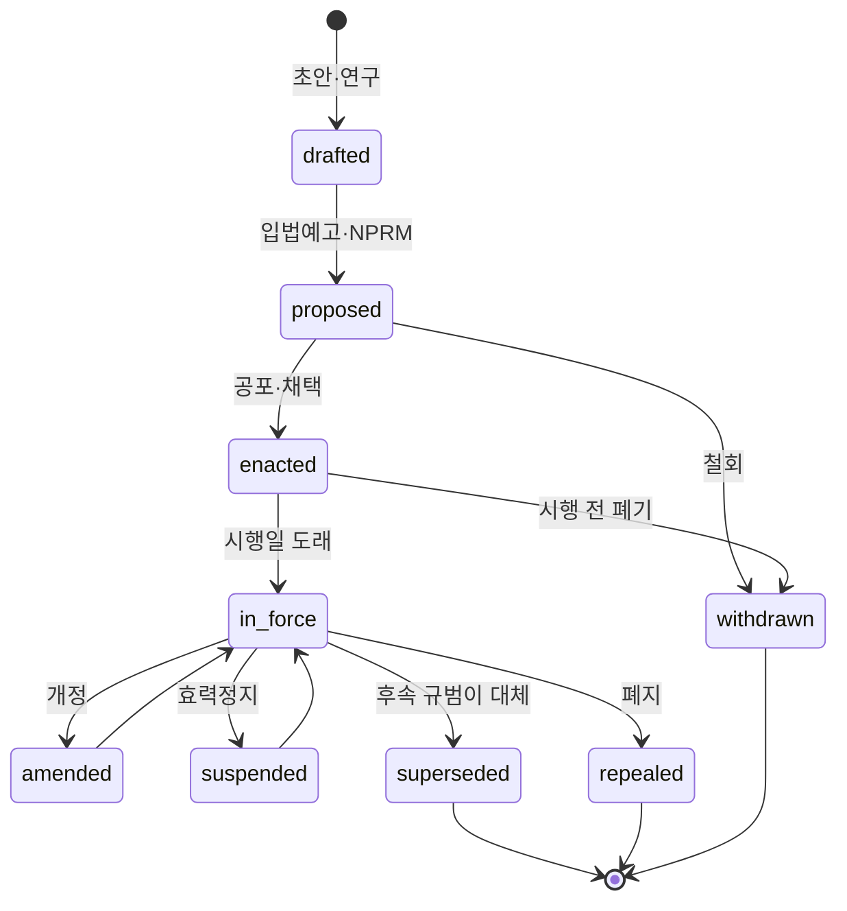
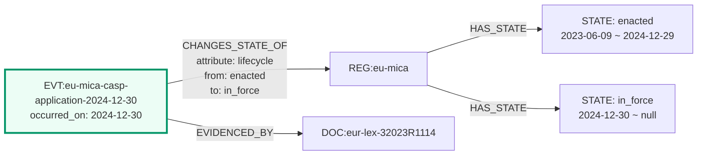
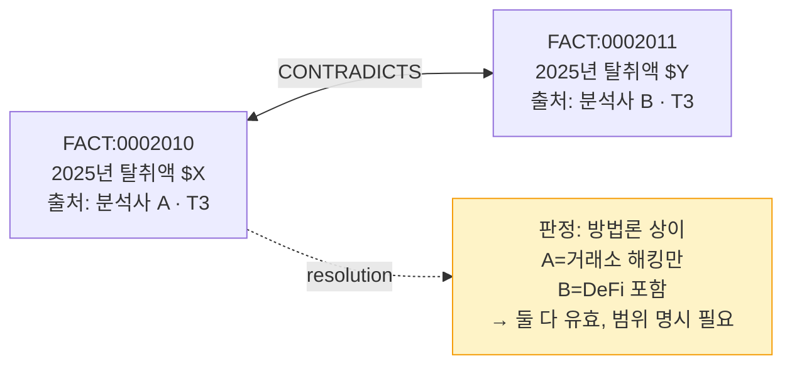

# L2 · 동적 계층 (Dynamic Layer)

> **역할**: 언제 무엇이 참이었는가 · **변경 빈도**: 일~주 · **변경 주체**: 자동 제안 + 사람 승인
> **카탈로그**: [`04-node-edge-spec.md §3.2`](04-node-edge-spec.md) · **저장**: `kb/facts/`, `kb/entities/**/states/`

---

## 1. 이 계층이 푸는 문제

규제 지식베이스가 실패하는 지점은 거의 항상 **시간**이다.

| 실패 유형 | 예 |
|---|---|
| 상대 표현 고착 | "현재 임계값은 100만원" — 언제 기준인지 없음 |
| 상태 혼동 | 제안 단계 규칙을 시행 중인 것처럼 서술 |
| 이력 소실 | 개정되면 이전 값을 덮어써서 "그때는 어땠나"를 답할 수 없음 |
| 지식 시점 부재 | "우리가 언제부터 이걸 알았나"를 답할 수 없어 감사 대응 불가 |

L2 는 이 넷을 **스키마 수준에서 불가능하게** 만든다.

---

## 2. 이중시간 모델 (Bitemporal)

모든 L2 레코드는 두 개의 시간축을 갖는다.

| 축 | 필드 | 의미 |
|---|---|---|
| **유효시간** (valid time) | `valid_from`, `valid_to` | 현실 세계에서 이 사실이 참인 기간 |
| **기록시간** (transaction time) | `recorded_at`, `retracted_at` | 우리 지식베이스가 이 사실을 참으로 믿은 기간 |



**왜 두 축이 필요한가** — 세 가지 질문이 각각 다른 축을 요구한다.

1. "2023년 6월에 이 거래는 트래블룰 대상이었나?" → 유효시간 질의
2. "2023년 6월에 **우리는** 그것을 대상이라고 알고 있었나?" → 기록시간 질의
3. "소급 시행된 규정을 우리는 언제 반영했나?" → 두 축 교차

3번이 감사·검사 대응의 핵심이다. 당시 판단의 정당성은 "당시 알 수 있었던 정보"로 평가되기 때문이다.

### 2.1 정정 규칙 — 덮어쓰기 금지

```yaml
# ❌ 금지: 값을 수정
value: 1000000   → value: 2000000

# ✅ 필수: 기존 레코드 폐기 표시 + 새 레코드 추가
- id: "STATE:00412"
  subject: "PROV:kr-tfia-art5-3"
  attribute: "travel_rule_threshold_krw"
  value: 1000000
  valid_from: "2022-03-25"
  valid_to: null
  recorded_at: "2026-02-10"
  retracted_at: "2026-05-01"          # ← 폐기 표시만
  retraction_reason: "시행일 오기 — 원문 재확인 결과 상이"
  superseded_by: "STATE:00987"

- id: "STATE:00987"
  subject: "PROV:kr-tfia-art5-3"
  attribute: "travel_rule_threshold_krw"
  value: 1000000
  valid_from: "2022-03-25"
  valid_to: null
  recorded_at: "2026-05-01"
  retracted_at: null
  evidence: [{ doc: "DOC:law-go-kr-tfia-20260101", confidence: "A", quote: "..." }]
```

파일은 append-only JSONL. Git 히스토리와 이중으로 보호된다.

---

## 3. 상태 전이 모델

규범의 생애주기를 상태기계로 고정한다. **임의 문자열 금지** — 아래 값만 허용된다.



| 상태 | 정의 | 실무 함의 |
|---|---|---|
| `drafted` | 공식 발의 전 | 참고만 |
| `proposed` | 입법예고·규칙제정 공고 상태 | **준수 의무 없음** — 혼동 최다 지점 |
| `enacted` | 공포·채택되었으나 시행 전 | 준비 기간 |
| `in_force` | 시행 중 | 준수 의무 발생 |
| `amended` | 개정되어 내용이 변경됨 | 개정분 별도 추적 |
| `suspended` | 효력 정지(사법·행정) | 한시적 |
| `superseded` | 후속 규범이 대체 | `SUPERSEDES` 엣지 필수 |
| `repealed` | 폐지 | — |
| `withdrawn` | 시행 전 철회 | — |

**전이는 반드시 `EVT` 노드를 동반한다.** 상태만 바뀌고 사건이 없으면 validator 가 거부한다. 이것이 "왜 바뀌었는지 근거가 없는 변경"을 원천 차단한다.



---

## 4. FACT — 원자적 사실

L2 의 최소 단위. **하나의 검증 가능한 진술 + 증거 결속**.

```jsonl
{"id":"FACT:0001842","claim":"대한민국 특금법상 가상자산 이체 트래블룰 적용 기준금액은 100만원이다","subject":"PROV:kr-tfia-art5-3","attribute":"travel_rule_threshold_krw","value":1000000,"unit":"KRW","valid_from":"2022-03-25","valid_to":null,"confidence":"A","evidence":[{"doc":"DOC:law-go-kr-tfia-sd-20260101","locator":"시행령 제10조의10","quote":"...","tier":"T1","retrieved":"2026-07-30"}],"recorded_at":"2026-07-30","derived_from":["ITEM:20260730-lawgokr-00231"]}
```

### 4.1 원자성 기준

한 FACT 가 담아야 하는 것: **주어 1 · 술어 1 · 값 1 · 시점 1**.

| ❌ 나쁜 예 | ✅ 좋은 예 |
|---|---|
| "한국은 트래블룰을 100만원 기준으로 2022년부터 시행했고 위반 시 과태료가 있다" | FACT-A: 임계값 = 1,000,000 KRW<br/>FACT-B: 시행일 = 2022-03-25<br/>FACT-C: 위반 시 제재 = 과태료 |

원자성을 지켜야 **부분 정정**이 가능하다. 뭉친 사실은 하나가 틀리면 전체를 버려야 한다.

### 4.2 상충 처리

출처가 엇갈리면 **어느 쪽도 지우지 않는다**. 둘 다 기록하고 `CONTRADICTS` 로 연결한 뒤 판정을 별도 필드에 남긴다.



상충 미해결 사실은 산문에 인용될 때 자동으로 경고 표시가 붙는다.

---

## 5. EVENT — 사건과 인과

`EVT` 는 시점 사건이고, `CAUSED` 엣지로 인과를 잇는다. 이것이 역사 타임라인의 뼈대다 ([`06-timeline-model.md`](06-timeline-model.md)).

```yaml
id: "EVT:x-mtgox-collapse-2014"
type: "EVT"
layer: "dynamic"
label: { ko: "마운트곡스 파산", en: "Mt. Gox collapse" }
evt_kind: "incident"          # incident | legislative | enforcement | market | technical
occurred_on: "2014-02-28"
announced_on: "2014-02-28"
jurisdiction: "JUR:jp"
impact: "H"
edges:
  - predicate: "CAUSED"
    to: "EVT:jp-psa-amendment-2016"
    qualifiers:
      mechanism: "거래소 파산으로 이용자 보호 공백이 드러나 등록제 도입 논의 촉발"
      lag_days: 780
      confidence: "B"
```

**인과 엣지는 신중하게.** `confidence` 를 반드시 붙이고, "시간적 선후"만으로 인과를 주장하지 않는다. 근거는 입법 이유서·정책 문서에 명시적 언급이 있을 때 `A`/`B`, 논평 수준이면 `C`.

---

## 6. METRIC — 시계열 관측

수치는 노드 속성이 아니라 **관측 레코드**다. 추정치의 방법론과 추정 주체를 반드시 함께 기록한다.

```jsonl
{"id":"METRIC:000731","subject":"TYP:x-illicit-total","measure":"illicit_volume_usd","value":null,"unit":"USD","period":{"start":"2025-01-01","end":"2025-12-31"},"method":"온체인 클러스터 라벨 기반 추정","estimator":"분석사 X 연례보고서","revision":"초판","caveat":"라벨 미확보 주소 미포함 — 후속 개정 시 상향되는 경향","evidence":[{"doc":"DOC:...","tier":"T3"}],"confidence":"B"}
```

**`revision` 필드가 중요하다.** 이 분야 추정치는 이듬해 대폭 상향 개정되는 것이 관례다. 초판 수치를 확정값처럼 쓰면 반드시 틀린다. 동일 `(subject, measure, period)` 에 여러 revision 이 존재하는 것이 정상이며, 질의 시 최신 revision 을 기본값으로 반환하되 이력을 함께 노출한다.

---

## 7. 시점 질의 (Time-travel query)

L2 의 존재 이유. 세 가지 질의 형태를 지원한다.

| 질의 | 의미 | 구현 |
|---|---|---|
| `as_of(T)` | T 시점에 참이었던 지식 | `valid_from <= T < valid_to` |
| `known_as_of(R)` | R 시점에 우리가 알던 지식 | `recorded_at <= R AND (retracted_at IS NULL OR retracted_at > R)` |
| `as_of(T, R)` | R 시점 기준으로 본 T 시점 지식 | 위 둘의 교차 |

```
# 예: 2024-12-30 EU CASP 규제 지형
as_of("2024-12-30") ∘ subgraph(JUR:eu, REG.lifecycle == in_force)

# 예: 우리가 2026-01-01 에 알고 있던 한국 VASP 신고 명단
known_as_of("2026-01-01") ∘ edges(LICENSED_IN → JUR:kr, status == active)
```

---

## 8. 신선도 SLA

노드 유형별로 재검토 주기를 강제한다. 만료 시 자동으로 `TASK` 가 생성된다.

| 대상 | SLA | 근거 |
|---|---|---|
| 제재 명단 상태 | **1일** | 지정·해제가 즉시 효력 |
| 규범 상태(`in_force` 여부) | 7일 | 시행일 도래·개정 |
| VASP 인가 상태 | 30일 | 신고 수리·말소 |
| 진행 중 입법(`proposed`) | 14일 | 상태 변동 빈번 |
| 집행조치·사고 | 30일 | 후속 절차 진행 |
| 벤더 정보 | 90일 | 변동 완만 |
| 유형론·기법 | 180일 | 구조적 지식 |
| 확신도 `C`/`D` 인 모든 노드 | **90일** | 미검증 부채 |

