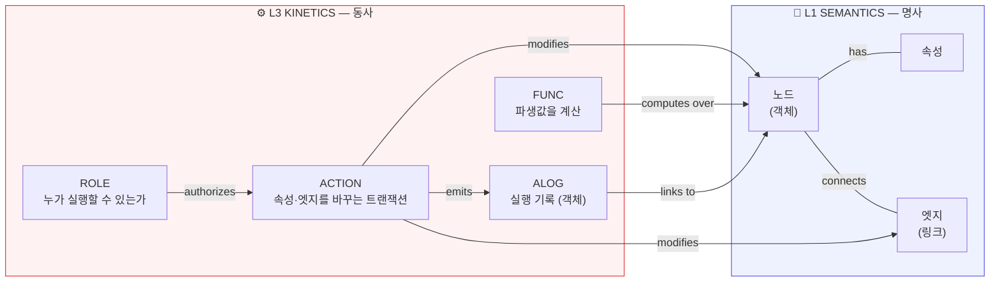
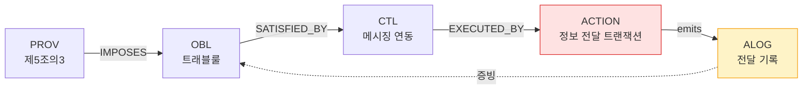
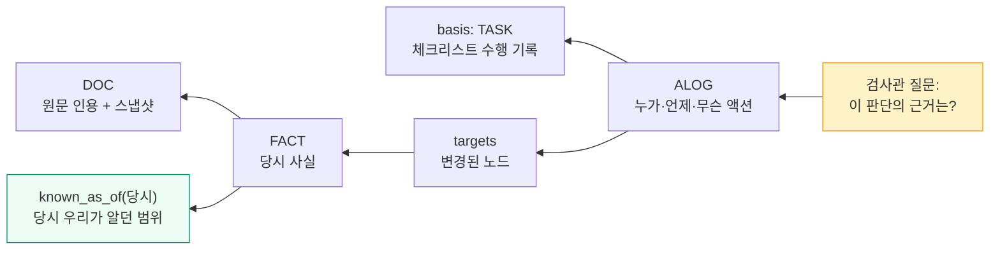
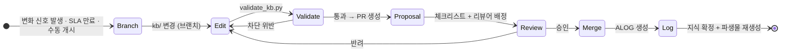
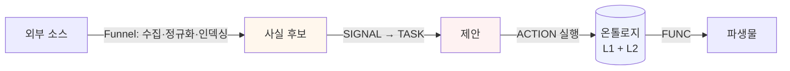

# L3 · 운동 계층 (Kinetic Layer) — 동사의 세계

> **역할**: 지식과 현실을 **바꾸는 행위**를 정의한다 · **변경 주체**: 액션은 자동 제안, 실행은 권한 통제
> **카탈로그**: [`04-node-edge-spec.md §3.3`](04-node-edge-spec.md) · **정정 이력**: [ADR-0004](../adr/0004-kinetic-layer-correction.md)
> **방법론 출처**: `DOC:jp-leadingai-palantir-ontology` (CC BY 4.0) → [`../references.md`](../references.md)

---

## 0. ⚠️ 정정 고지

이 문서의 초판(2026-07-30 오전)은 **Kinetic 을 "수집 파이프라인"으로 잘못 정의했다.**

Kinetics 는 데이터가 *들어오는* 흐름이 아니다. **세계를 바꾸는 쓰기 행위**다.
수집·인덱싱은 온톨로지의 계층이 아니라 이를 채우는 인프라(Palantir 의 Funnel 에 해당)이며,
[`../ingestion/02-daily-pipeline.md`](../ingestion/02-daily-pipeline.md) 로 분리했다.

| | 초판 (오류) | 정정판 |
|---|---|---|
| L3 의 내용 | FEED·RUN·ITEM·SIG·TASK (수집) | ACTION·FUNC·ROLE·ALOG (쓰기·실행) |
| 수집의 위치 | L3 계층 | 계층 아님 — Funnel 인프라 |

---

## 1. 명사만으로는 닫히지 않는다

L1 은 "무엇이 존재하는가", L2 는 "언제 참이었는가"를 담는다. 둘 다 **읽기 전용 세계**다.

그런데 지식베이스는 반드시 변경된다. 사실이 승격되고, 상태가 전이되고, 오류가 폐기된다.
이 변경을 **모델 밖의 스크립트**에 맡기면 두 가지가 무너진다.

| 무너지는 것 | 결과 |
|---|---|
| 무엇이 바뀔 수 있는지의 명세 | 임의 필드가 임의로 바뀜. 스키마가 사실상 없어짐 |
| 누가 무엇을 바꿨는지의 기록 | 감사 대응 불가. AML 에서는 **법적 의무 위반** |

그래서 변경 경로를 **모델 안에 닫아 넣는다**. 이것이 Kinetic 계층이다.



> "By creating a 'model for viewing' and a 'model for changing' simultaneously — closing the data
> model to include update pathways — AI and applications can execute safe actions against the real
> world without hesitation." — `DOC:jp-leadingai-palantir-ontology` 제2장

---

## 2. 두 종류의 액션

AML 지식베이스의 액션은 두 층으로 나뉜다. 이 구분이 중요하다.

| 층 | 무엇을 바꾸는가 | 지금 필요한가 |
|---|---|---|
| **거버넌스 액션** | 지식베이스 자체 (사실 승격·상태 전이·폐기) | ✅ 지금 |
| **운용 액션** | 현실의 AML 업무 (STR 제출·이체 차단·위험등급 변경) | 🔜 서비스 배포 시 |

거버넌스 액션만 먼저 구현하되, **운용 액션의 자리를 미리 비워둔다.** 나중에 이 지식베이스를
실제 AML 시스템이 소비할 때 액션 정의가 그대로 실행 명세가 되기 때문이다.

### 2.1 왜 지금 운용 액션까지 설계하는가

L1 의 `OBL`(의무)·`CTL`(통제)은 "무엇을 해야 하는가"만 서술한다. 그것을 **누가 어떤 조건에서
실행하고 무엇이 기록되는가**는 액션 명세가 없으면 표현할 수 없다.

예: `OBL:x-str-filing`(의심거래보고 의무)은 존재를 서술한다. 그러나
`ACTION:x-file-str`(제출 트랜잭션 — 필수 필드·제출 기한·승인자·기록 요건)이 있어야
의무가 실행 가능한 형태가 된다. 이 연결이 지식베이스를 문서에서 시스템 명세로 승격시킨다.

---

## 3. ACTION — 변경 트랜잭션

하나의 액션은 **하나의 트랜잭션**이다. 부분 적용은 없다.

```yaml
id: "ACTION:x-promote-fact"
type: "ACTION"
layer: "kinetic"
label:
  ko: "사실 승격"
  en: "Promote fact"
summary: >
  검증 게이트를 통과한 사실 후보를 L2 로 승격한다. 원자적 사실 레코드를 생성하고
  증거를 결속하며, 관련 노드의 투영값을 갱신한다.
action_kind: "governance"          # governance | operational
tier: "L2-write"

# 변경 집합 — 이 액션이 건드릴 수 있는 것의 전부
change_set:
  creates: ["FACT"]
  modifies:
    - target: "any"
      properties: ["updated_at", "review_due"]
  never_touches: ["id", "created_at", "evidence[].doc"]

# 제출 기준 — 충족하지 않으면 실행 거부
submission_criteria:
  - "evidence 가 1개 이상 존재한다"
  - "evidence.doc 가 실존하는 DOC 노드를 가리킨다"
  - "수치 값에는 unit 이 있다"
  - "기존 FACT 와 상충하지 않거나, 상충 시 CTR 레코드가 함께 생성된다"
  - "confidence 가 C 또는 D 이면 review_due 가 90일 이내다"

# 부수효과 — 액션이 유발하는 연쇄
side_effects:
  - "참조하는 산문 문서에 재검토 플래그를 설정한다"
  - "영향 노드의 파생 크로스워크를 무효화한다"
  - "ALOG 레코드를 생성한다"

authorized_roles: ["ROLE:x-curator", "ROLE:x-reviewer"]
requires_proposal: true            # 브랜치-리뷰-머지 필수
reversible_by: "ACTION:x-retract-fact"
```

### 3.1 거버넌스 액션 목록

| 액션 | 무엇을 바꾸는가 | 되돌리는 액션 | 제안 필수 |
|---|---|---|---|
| `ACTION:x-promote-fact` | FACT 생성 + 투영 갱신 | `x-retract-fact` | ✅ |
| `ACTION:x-retract-fact` | `retracted_at` 설정 (**삭제 아님**) | — (새 FACT 로 정정) | ✅ |
| `ACTION:x-transition-lifecycle` | 규범 상태 전이 + EVT 생성 | 역전이 불가 — 정정 EVT | ✅ |
| `ACTION:x-close-state` | STATE 구간 `valid_to` 마감 | `x-reopen-state` | ✅ |
| `ACTION:x-resolve-contradiction` | CTR 판정 기록 | 재판정 | ✅ |
| `ACTION:x-demote-confidence` | 확신도 하향 | `x-promote-confidence` | ❌ **자동** |
| `ACTION:x-promote-confidence` | 확신도 상향 | `x-demote-confidence` | ✅ |
| `ACTION:x-merge-node` | 중복 노드 병합 | 불가 (ID 불변) | ✅ |
| `ACTION:x-deprecate-node` | `status: deprecated` | `x-reactivate-node` | ✅ |
| `ACTION:x-register-feed` | 소스 레지스트리 등재 | `x-disable-feed` | ✅ |
| `ACTION:x-disable-feed` | 피드 비활성화 | `x-register-feed` | ❌ **자동** |

**비대칭이 설계다.** 강등·비활성화는 자동으로 즉시 실행되고, 승격·활성화는 사람 승인을 거친다.
이것이 지식 인플레이션과 죽은 피드 방치를 동시에 막는다.

### 3.2 운용 액션 (자리 예약)

배포된 AML 시스템이 실행할 액션. **지금은 명세만 두고 구현하지 않는다.**

| 액션 | 대응 의무 | 기록 요건 |
|---|---|---|
| `ACTION:x-file-str` | `OBL:x-str-filing` | 보고 시각·근거·판단자 |
| `ACTION:x-escalate-alert` | `OBL:x-ongoing-monitoring` | 승급 사유·검토자 |
| `ACTION:x-block-transfer` | `OBL:x-screening` | 차단 근거·해제 조건 |
| `ACTION:x-set-risk-rating` | `OBL:x-risk-assessment` | 산정 요소·재평가 주기 |
| `ACTION:x-freeze-asset` | `OBL:x-sanctions-freeze` | 지정 근거·통보 |
| `ACTION:x-approve-onboarding` | `OBL:x-customer-identification` | 확인 항목·승인자 |

각 운용 액션은 `IMPLEMENTS_OBLIGATION` 엣지로 L1 의 `OBL` 을 가리킨다.
**의무 → 통제 → 액션** 사슬이 완성되면 규제 조문에서 실행 명세까지 한 경로로 이어진다.



마지막 점선이 핵심이다 — **액션 로그가 의무 이행의 증빙이 된다.**

---

## 4. FUNC — 파생 계산

읽기 전용 계산. 상태를 바꾸지 않으므로 권한이 느슨하고 캐시 가능하다.

```yaml
id: "FUNC:x-crosswalk"
type: "FUNC"
layer: "kinetic"
label: { ko: "관할 크로스워크", en: "Jurisdiction crosswalk" }
func_kind: "derivation"           # derivation | scoring | validation | projection
inputs: ["OBL", "PROV", "IMPOSES 엣지"]
output: "관할 × 임계값 비교표"
deterministic: true
implementation: "scripts/build_crosswalk.py"
cache_invalidated_by:
  - "ACTION:x-promote-fact"
  - "ACTION:x-transition-lifecycle"
```

| 함수 | 종류 | 구현 | 산출 |
|---|---|---|---|
| `FUNC:x-crosswalk` | derivation | `scripts/build_crosswalk.py` | 관할 비교표 |
| `FUNC:x-as-of-snapshot` | projection | `--as-of` 질의 | 시점 규제 지형 |
| `FUNC:x-affected-nodes` | derivation | 그래프 순회 | 변경 영향 범위 |
| `FUNC:x-dq-score` | scoring | `quality/validate_kb.py` | 품질 종합점수 |
| `FUNC:x-freshness-check` | validation | SLA 스캔 | 만료 노드 목록 |
| `FUNC:x-invariant-check` | validation | validator | 불변식 위반 목록 |
| `FUNC:x-exposure-score` | scoring | 🔜 미구현 | 온체인 익스포저 |

`deterministic: true` 인 함수는 **동일 입력 → 동일 출력**이 보장되어야 한다.
CI 가 파생물 재현성을 검사하는 근거다 ([ADR-0003](../adr/0003-file-ssot-defer-engine.md)).

---

## 5. ROLE — 동적 보안

권한을 문서가 아니라 **온톨로지 요소**로 둔다. "누가 무엇을 실행할 수 있는가"가 질의 가능해야 한다.

```yaml
id: "ROLE:x-curator"
type: "ROLE"
layer: "kinetic"
label: { ko: "큐레이터", en: "Curator" }
summary: "신호를 판정하고 검증된 사실을 L2 로 승격한다."
can_execute:
  - "ACTION:x-promote-fact"
  - "ACTION:x-retract-fact"
  - "ACTION:x-close-state"
  - "ACTION:x-resolve-contradiction"
cannot_execute:
  - "ACTION:x-merge-node"          # 온톨로지 관리자 전용
scope:
  node_types: ["FACT", "STATE", "EVT"]
  jurisdictions: "all"
constraints:
  - "자기 작성 변경을 자기 승인할 수 없다"
  - "1인 운영 기간에는 작성 후 24시간 경과 재검토로 대체"
```

### 5.1 접근 통제 2축

| 축 | 대상 | 예 |
|---|---|---|
| **노드 단위** (행 상당) | 특정 노드·관할 전체 | "한국 관할 노드만 승인 가능" |
| **속성 단위** (열 상당) | 특정 필드 | "`confidence` 는 큐레이터만, `id` 는 누구도 변경 불가" |

속성 단위 통제가 필요한 이유: `evidence` 는 추가만 허용하고, `id`·`created_at` 은 불변,
`retracted_at` 은 설정만 가능하고 해제는 불가 — 필드마다 규칙이 다르다.

### 5.2 역할 목록

| 역할 | 실행 권한 | 비고 |
|---|---|---|
| `ROLE:x-curator` | 사실 승격·폐기·상충 판정 | 자기 승인 금지 |
| `ROLE:x-ontologist` | 클래스·술어 변경, 노드 병합 | ADR 필수 |
| `ROLE:x-reviewer` | 관할별 전문 검토 승인 | 담당 관할만 |
| `ROLE:x-collector` | 피드 등재·비활성화 | KB 쓰기 권한 없음 |
| `ROLE:x-dq-owner` | 차단 규칙 조정, 부채 상한 집행 | |
| `ROLE:x-agent` | 제안만 — 어떤 액션도 직접 실행 불가 | **AI 에이전트** |

**`ROLE:x-agent` 가 중요하다.** 리서치·구축 에이전트는 `_research/` 에 쓰고 제안만 한다.
직접 `kb/` 를 변경하는 권한이 없다. AI 가 자율적으로 지식을 확정하지 못하게 하는 구조적 장치다.

---

## 6. ALOG — 액션 로그

**모든 액션 실행은 객체로 기록된다.** 로그 파일이 아니라 그래프의 1급 노드다.

```jsonl
{"action":"ACTION:x-promote-fact","actor":"ROLE:x-curator","basis":"TASK:20260730-0042","executed_at":"2026-07-30T11:20:00Z","id":"ALOG:0000001","proposal":"PR#128","targets":["FACT:0000001","PROV:kr-tfia-art5-3"],"change":{"created":["FACT:0000001"],"modified":[{"node":"PROV:kr-tfia-art5-3","field":"updated_at","from":null,"to":"2026-07-30"}]},"result":"applied"}
```

| 필드 | 의미 |
|---|---|
| `action` | 실행된 ACTION 타입 |
| `actor` | 실행 주체 역할 (+ 사람 식별자) |
| `basis` | 근거 — TASK·SIGNAL·수동 |
| `proposal` | 브랜치 제안 참조 (PR) |
| `targets` | 영향받은 노드 — **대상 객체에 연결된다** |
| `change` | 실제 변경 내역 (전/후 값) |
| `result` | applied / rejected / rolled_back |

### 6.1 이것은 AML 에서 법적 요건이다

Palantir 에서 Action Log 는 우수 설계다. **AML 에서는 규제 의무다.**

기록보존 의무는 "무엇을 했는가"뿐 아니 라 "왜 그렇게 판단했는가"를 요구한다.
감독 검사에서 나오는 질문은 언제나 같다 — *"이 판단의 근거는 무엇이었습니까?"*

L2 의 이중시간(당시 알던 것)과 L3 의 액션 로그(당시 한 것)를 결합하면 그 질문에 답할 수 있다.



### 6.2 불변 규칙

| # | 규칙 |
|---|---|
| K-1 | 모든 액션 실행은 정확히 하나의 `ALOG` 를 생성한다 |
| K-2 | `ALOG` 는 수정·삭제되지 않는다 (append-only) |
| K-3 | `ALOG.targets` 의 모든 노드는 실존해야 한다 |
| K-4 | `requires_proposal: true` 인 액션의 `ALOG` 는 `proposal` 을 가져야 한다 |
| K-5 | `ALOG.actor` 는 해당 액션을 실행할 권한이 있는 `ROLE` 이어야 한다 |
| K-6 | 액션의 `change_set.never_touches` 필드가 변경되면 실행을 거부한다 |

---

## 7. 제안 생애주기 (Ontology Proposal)

지식·온톨로지 변경은 **브랜치에서 하고 리뷰를 거쳐 머지한다.** 소프트웨어의 풀 리퀘스트 패턴을
데이터 운영에 그대로 적용한 것이다.



기존 설계의 `SIGNAL → TASK → 승격`이 이 절차의 구현이다. 대응은 다음과 같다.

| Palantir | 본 저장소 |
|---|---|
| Working branch | git 브랜치 |
| Ontology Proposal | Pull Request |
| Approvals App | PR 리뷰 + 체크리스트 ([`../governance/03-review-workflow.md`](../governance/03-review-workflow.md)) |
| Merge to main | merge → `kb/` 확정 |
| Action Log | `ALOG` + git 커밋 이력 |

**구조적으로 얻는 것**: 승인받지 않은 지식 변경 경로가 존재하지 않는다.
`kb/` 직접 푸시를 브랜치 보호로 막으면 우회로가 없어진다.

---

## 8. Funnel — 계층이 아닌 것

수집·인덱싱은 Kinetic 계층이 **아니다.** 온톨로지를 채우는 인프라다.



Funnel 은 **후보까지만** 만든다. 후보가 지식이 되는 것은 액션을 통해서다.
이 경계가 흐려지면 "수집한 것이 곧 지식"이 되어 검증 게이트가 무력화된다.

상세 → [`../ingestion/02-daily-pipeline.md`](../ingestion/02-daily-pipeline.md)

Palantir 의 batch / streaming 인덱싱 구분은 수집 설계에 반영했다.

| Funnel 모드 | 본 저장소 대응 |
|---|---|
| batch pipeline | 일일 파이프라인 (07:00 KST) |
| streaming pipeline | 제재 명단 2회/일 — SLA 1일 대상 |

---

## 9. 미구현 · 다음 단계

| 항목 | 상태 |
|---|---|
| ACTION·FUNC·ROLE 노드 등재 | 씨앗 일부만 |
| ALOG 자동 생성 | 미구현 — 현재는 git 커밋과 TASK 기록으로 대체 |
| 속성 단위 접근 통제 집행 | 규칙만 정의, 코드 미구현 |
| 운용 액션 | 명세 예약만. 서비스 배포 시 구현 |
| `FUNC:x-exposure-score` | 미구현 |
| 액션 실행 런타임 | 없음 — 현재는 사람이 파일을 편집하고 validator 가 검사 |

**현 상태를 정직하게 말하면**: Kinetic 계층은 *명세*가 존재하고 *집행*은 부분적이다.
`validate_kb.py` 가 제출 기준 일부를 검사하고 git 이 제안 절차를 강제하지만,
액션 실행 런타임과 ALOG 자동 생성은 아직 없다.
