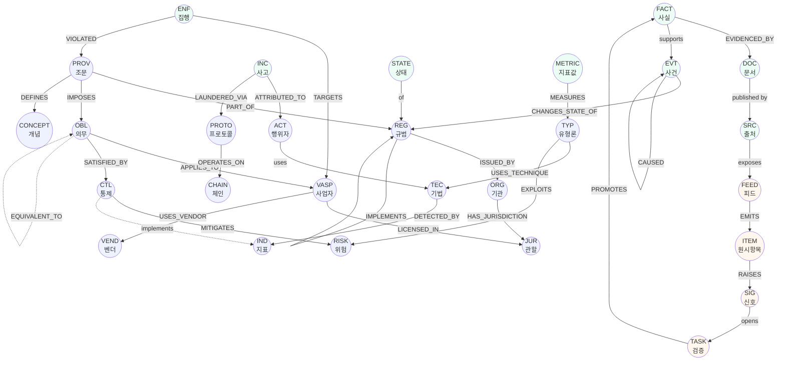

# 노드·엣지 전체 명세 (Node & Edge Catalog)

> **상태**: 설계 확정 (v0.1) · **작성일**: 2026-07-30
> **기계판**: [`../../kb/schema/ontology.yaml`](../../kb/schema/ontology.yaml) · [`node.schema.json`](../../kb/schema/node.schema.json) · [`edge.schema.json`](../../kb/schema/edge.schema.json)

이 문서가 온톨로지의 **규범적 정의**다. 코드·스키마·리서치 산출물은 모두 여기에 맞춘다.

---

## 1. 그래프 모델

**레이블드 프로퍼티 그래프(labeled property graph)** 를 채택한다. RDF 트리플이 아니라 프로퍼티 그래프인 이유:

- 엣지에 속성(유효기간·확신도·출처)을 직접 달아야 한다. RDF 로는 reification 이 필요해 표현이 부풀어 오른다.
- 규제 지식의 핵심 질의는 경로 탐색(“이 의무의 근거를 FATF 권고까지 거슬러 올라가라”)이다. 프로퍼티 그래프가 자연스럽다.
- 필요 시 JSON-LD 로 내보내 상호운용성은 별도 확보한다 (§7).

### 1.1 노드 공통 스키마

모든 노드가 반드시 갖는 필드.

```yaml
id: "REG:kr-tfia"                 # 전역 유일 · 불변 · §2 규칙
type: "REG"                        # 노드 클래스
layer: "semantic"                  # semantic | dynamic | kinetic
label:
  ko: "특정 금융거래정보의 보고 및 이용 등에 관한 법률"
  en: "Act on Reporting and Using Specified Financial Transaction Information"
  short: "특금법"
aliases: ["특금법", "TFIA", "특정금융정보법"]
summary: "<2~3문장. 이 노드가 무엇인지.>"
tags: ["travel-rule", "vasp-registration"]
status: "active"                   # active | deprecated | merged | disputed
evidence:                          # 최소 1개 필수
  - doc: "DOC:law-go-kr-tfia-20260101"
    confidence: "A"
created_at: "2026-07-30"
updated_at: "2026-07-30"
review_due: "2026-10-30"           # 신선도 SLA (§ governance)
```

### 1.2 엣지 공통 스키마

```yaml
id: "E:00001"
predicate: "IMPOSES"               # §4 술어 목록
from: "PROV:kr-tfia-art5-3"
to: "OBL:travel-rule-originator-info"
qualifiers:                        # 술어별 추가 속성
  threshold_krw: 1000000
valid_from: "2022-03-25"           # 이 관계가 성립하기 시작한 날
valid_to: null                     # null = 현재까지 유효
evidence:
  - doc: "DOC:law-go-kr-tfia-20260101"
    confidence: "A"
    quote: "<원문 인용>"
recorded_at: "2026-07-30"          # 우리가 이 관계를 기록한 시각 (transaction time)
```

**엣지에 시간이 붙는 것이 이 설계의 핵심이다.** 노드는 존재하지만 관계는 시기에 따라 성립·소멸한다. 예: `VASP:upbit --LICENSED_IN--> JUR:kr` 는 신고 수리일부터 유효하다.

---

## 2. 식별자 규칙

```
{TYPE}:{namespace}-{slug}
```

- `TYPE` — 대문자 클래스 코드 (§3)
- `namespace` — 관할 ISO 코드(`kr`, `us`, `eu`, `sg`) 또는 `intl`(국제기구) 또는 `x`(무국적/기술)
- `slug` — 소문자 kebab-case. 조문은 `art5-3`, `sec1010-410f` 형태

| 예시 | 의미 |
|---|---|
| `JUR:kr` | 대한민국 관할 |
| `ORG:kr-kofiu` | 금융정보분석원 |
| `REG:eu-mica` | MiCA 규정 |
| `PROV:us-31cfr-1010-410f` | 31 CFR §1010.410(f) |
| `OBL:x-travel-rule-originator` | 송금인 정보 전달 의무 (관할 무관 추상 의무) |
| `TYP:x-layering` | 은닉 단계 유형론 |
| `TEC:x-chain-hopping` | 체인호핑 기법 |
| `IND:x-rapid-multi-chain-swap` | 탐지 지표 |
| `ACT:kp-lazarus` | 라자루스 그룹 |
| `ENF:us-binance-2023` | 바이낸스 집행조치 |

**불변 규칙**: 발급된 ID 는 절대 변경하지 않는다. 오기(誤記)로 만든 ID 는 `status: merged` + `MERGED_INTO` 엣지로 처리한다. 상세는 [`05-identifier-scheme.md`](05-identifier-scheme.md).

---

## 3. 노드 클래스 카탈로그

### 3.1 L1 SEMANTIC — 20 클래스

| 코드 | 클래스 | 정의 | 고유 필드 | 예 |
|---|---|---|---|---|
| `JUR` | Jurisdiction | 법역. 국가·초국가체·특별행정구 | `iso`, `parent`, `fatf_member`, `legal_family` | `JUR:kr`, `JUR:eu`, `JUR:hk` |
| `ORG` | Organization | 규제기관·FIU·국제기구·수사기관·협회 | `org_kind`, `jurisdiction`, `founded` | `ORG:intl-fatf`, `ORG:kr-kofiu` |
| `REG` | Regulation | 규범 문서 단위 (법률·시행령·규정·가이던스·권고) | `reg_kind`, `citation`, `promulgated`, `binding` | `REG:kr-tfia`, `REG:intl-fatf-r15` |
| `PROV` | Provision | 규범의 하위 조문 단위 | `parent_reg`, `citation_path`, `text_ko`, `text_orig` | `PROV:kr-tfia-art7` |
| `OBL` | Obligation | 조문에서 도출된 **실행 가능한 요구사항** | `obl_kind`, `actor_class`, `trigger`, `deadline` | `OBL:x-str-filing` |
| `CTL` | Control | 의무를 충족시키는 실무 통제 수단 | `ctl_kind`, `automatable`, `maturity` | `CTL:x-sanctions-screening` |
| `CONCEPT` | Concept | 온톨로지 어휘·용어 | `definition_ko`, `definition_en`, `defined_by` | `CONCEPT:x-beneficial-owner` |
| `RISK` | RiskFactor | 위험요인 | `risk_kind`, `severity_default` | `RISK:x-anonymity-enhanced` |
| `TYP` | Typology | 자금세탁 유형론 (전술 수준) | `stage`, `predicate_offenses` | `TYP:x-layering-crosschain` |
| `TEC` | Technique | 유형론 하위 실행 기법 | `parent_typology`, `chains`, `detectability` | `TEC:x-peel-chain` |
| `IND` | Indicator | 탐지 지표·레드플래그 | `signal_type`, `data_required`, `fp_risk` | `IND:x-structuring-below-threshold` |
| `ASSET` | Asset | 가상자산 | `symbol`, `asset_kind`, `native_chain` | `ASSET:x-usdt` |
| `CHAIN` | Chain | 블록체인 네트워크 | `consensus`, `model`(utxo/account), `launched` | `CHAIN:x-bitcoin` |
| `PROTO` | Protocol/Service | 온체인 서비스 (믹서·브리지·DEX·트래블룰 프로토콜) | `proto_kind`, `custody`, `chains` | `PROTO:x-tornado-cash` |
| `VASP` | VASP | 가상자산사업자 (거래소·수탁·지갑) | `vasp_kind`, `hq`, `founded` | `VASP:kr-upbit` |
| `VEND` | Vendor | 컴플라이언스 솔루션 공급자 | `vend_kind`, `hq`, `founded` | `VEND:us-chainalysis` |
| `CAP` | Capability | 벤더 역량 항목 (비교 축) | `cap_kind`, `measurable` | `CAP:x-crosschain-tracing` |
| `ACT` | ThreatActor | 위협행위자 | `actor_kind`, `attributed_state`, `active_since` | `ACT:kp-lazarus` |
| `SRC` | Source | 발행처 단위 출처 | `tier`, `publisher_kind`, `base_url` | `SRC:kr-lawgokr` |
| `DOC` | Document | 개별 발행물 | `src`, `url`, `published`, `doc_kind`, `hash` | `DOC:fatf-r16-2025` |

### 3.2 L2 DYNAMIC — 7 클래스

| 코드 | 클래스 | 정의 | 고유 필드 |
|---|---|---|---|
| `FACT` | Claim | 검증 가능한 원자적 사실 진술 | `claim`, `subject`, `confidence`, `evidence[]`, `contradicts[]` |
| `EVT` | Event | 시점(point-in-time) 사건 | `occurred_on`, `announced_on`, `evt_kind`, `impact` |
| `STATE` | StateAssertion | 구간(interval) 상태 주장 | `subject`, `attribute`, `value`, `valid_from`, `valid_to`, `recorded_at`, `superseded_by` |
| `ENF` | EnforcementAction | 집행조치 | `authority`, `target`, `violated[]`, `penalty`, `settled_on`, `monitorship` |
| `INC` | Incident | 사건·해킹·사고 | `occurred_on`, `loss_usd`, `vector`, `attributed_to`, `recovered_usd` |
| `CASE` | LegalCase | 판례·소송 | `court`, `docket`, `filed`, `decided`, `holding` |
| `METRIC` | MetricObservation | 관측 수치 (시계열 1점) | `subject`, `measure`, `value`, `unit`, `period`, `method`, `estimator` |

### 3.3 L3 KINETIC — 4 클래스 (동사)

> Kinetics = **Action · Function · Dynamic security**. 수집이 아니다.
> 정정 이력 → [ADR-0004](../adr/0004-kinetic-layer-correction.md) · 상세 → [`03-kinetic-layer.md`](03-kinetic-layer.md)

| 코드 | 클래스 | 정의 | 고유 필드 |
|---|---|---|---|
| `ACTION` | Action type | 변경 트랜잭션 명세 | `action_kind`, `change_set`, `submission_criteria`, `side_effects`, `authorized_roles`, `requires_proposal`, `reversible_by`, `implements_obligation` |
| `FUNC` | Function | 파생 계산 (상태 불변) | `func_kind`, `inputs`, `output`, `deterministic`, `implementation`, `cache_invalidated_by` |
| `ROLE` | Role | 동적 보안 — 실행 권한 | `can_execute`, `cannot_execute`, `scope`, `constraints`, `is_agent` |
| `ALOG` | Action log | 실행 기록 (append-only) | `action`, `actor`, `basis`, `proposal`, `executed_at`, `targets`, `change`, `result` |

`change_set` 은 `creates` / `modifies` / **`never_touches`** 3부로 구성된다.
`never_touches` 가 덮어쓰기 금지 원칙의 집행 지점이다.

### 3.4 FUNNEL — 6 클래스 (계층 아님)

온톨로지를 채우는 인프라. **사실 후보까지만** 만들며, 후보가 지식이 되는 것은 `ACTION` 을 통해서다.

| 코드 | 클래스 | 정의 | 고유 필드 |
|---|---|---|---|
| `FEED` | Feed | 수집 소스 엔드포인트 | `src`, `transport`, `endpoint`, `format`, `cadence`, `auth`, `robots_ok`, `priority` |
| `RUN` | IngestRun | 수집 실행 인스턴스 | `feed`, `started_at`, `status`, `items_new`, `error` |
| `ITEM` | RawItem | 수집 원시 항목 | `run`, `url`, `title`, `published`, `raw_path`, `content_hash` |
| `SIG` | Signal | 변화 신호 | `sig_kind`, `subject`, `severity`, `detected_at`, `evidence_items[]` |
| `TASK` | ReviewTask | 검증 과제 | `signal`, `assignee`, `state`, `due`, `resolution` |
| `PROD` | Product | 분석 산출물 | `prod_kind`, `period`, `facts[]`, `published_at` |

---

## 4. 엣지 술어 카탈로그

### 4.1 L1 구조 (Semantic)

| 술어 | from → to | 의미 | 한정자 |
|---|---|---|---|
| `HAS_JURISDICTION` | ORG·REG·VASP → JUR | 관할 귀속 | — |
| `PART_OF` | JUR→JUR, PROV→REG, TEC→TYP | 포함 관계 | — |
| `ISSUED_BY` | REG·DOC → ORG | 발행 주체 | — |
| `SUPERVISES` | ORG → VASP·JUR | 감독 관계 | `since` |
| `IMPLEMENTS` | REG → REG | 상위 기준의 국내 이행 | `fidelity`(full/partial/divergent) |
| `IMPOSES` | PROV → OBL | 조문이 의무를 부과 | `threshold`, `currency`, `grace_until` |
| `APPLIES_TO` | OBL → VASP·CONCEPT | 의무의 수범자 범위 | `scope_note` |
| `SATISFIED_BY` | OBL → CTL | 의무 충족 수단 | `sufficiency`(sufficient/partial) |
| `EQUIVALENT_TO` | OBL↔OBL, PROV↔PROV | 관할 간 크로스워크 | `equivalence`(strict/broad/narrow) |
| `DEFINES` | REG·PROV → CONCEPT | 법적 정의 제공 | — |
| `BROADER` / `NARROWER` | 동종 → 동종 | 분류 계층 | — |
| `MITIGATES` | CTL → RISK | 위험 경감 | `effectiveness` |
| `EXPLOITS` | TYP·TEC → RISK | 위험 악용 | — |
| `USES_TECHNIQUE` | TYP → TEC | 전술-기법 | — |
| `DETECTED_BY` | TEC → IND | 기법-지표 | `precision_est`, `recall_est` |
| `REQUIRES_DATA` | IND → CONCEPT | 탐지에 필요한 데이터 | — |
| `OPERATES_ON` | PROTO·ASSET → CHAIN | 체인 귀속 | — |
| `BRIDGES` | PROTO → CHAIN | 브리지 연결 | `direction` |
| `PROVIDES` | VEND → CAP | 벤더 역량 보유 | `evidence_kind`(공식문서/조달/보도) |
| `COMPETES_WITH` | VEND ↔ VEND | 시장 경쟁 관계 | `segment` |
| `USES_VENDOR` | VASP → VEND | 솔루션 도입 | `since`, `disclosed_by` |
| `MEMBER_OF` | VASP·ORG → ORG | 협회·기구 회원 | `since` |

### 4.2 L2 시간·증거 (Dynamic)

| 술어 | from → to | 의미 | 한정자 |
|---|---|---|---|
| `ASSERTS` | DOC → FACT | 문서가 사실을 주장 | `quote`, `locator`(페이지·조문) |
| `EVIDENCED_BY` | 모든 노드 → DOC | 근거 결속 | `confidence` |
| `SUPPORTS` / `CONTRADICTS` | FACT ↔ FACT | 사실 간 정합·상충 | `resolution` |
| `CHANGES_STATE_OF` | EVT → 모든 노드 | 사건이 상태를 바꿈 | `attribute`, `from_value`, `to_value` |
| `HAS_STATE` | 노드 → STATE | 구간 상태 보유 | — |
| `SUPERSEDES` | REG·STATE → REG·STATE | 대체 | `effective` |
| `AMENDS` | REG → REG | 개정 | `effective`, `articles[]` |
| `TARGETS` | ENF → VASP·ACT·PROTO | 집행 대상 | — |
| `VIOLATED` | ENF → PROV | 위반 조문 | `count` |
| `ATTRIBUTED_TO` | INC → ACT | 귀속 | `attributor`, `basis`, `confidence` |
| `LAUNDERED_VIA` | INC → PROTO·TEC | 세탁 경로 | `amount_usd`, `share` |
| `LICENSED_IN` | VASP → JUR | 인가·신고 상태 | `license_kind`, `since`, `until`, `status` |
| `DESIGNATED_BY` | VASP·ACT·PROTO → ORG | 제재 지정 | `list`, `designated_on`, `delisted_on` |
| `MEASURES` | METRIC → 모든 노드 | 수치 관측 대상 | — |
| `CAUSED` | EVT → EVT | 인과 (타임라인 핵심) | `mechanism`, `lag_days`, `confidence` |

### 4.3 L3 KINETIC (동사)

| 술어 | from → to | 의미 |
|---|---|---|
| `MODIFIES` | ACTION → 모든 노드 | 액션이 바꾸는 대상 |
| `AUTHORIZES` | ROLE → ACTION | 실행 권한 부여 |
| `EMITS_LOG` | ACTION → ALOG | 실행 기록 생성 |
| `LOGGED_ON` | ALOG → 모든 노드 | 로그가 대상 객체에 결속 |
| `EXECUTED_BY` | CTL → ACTION | 통제의 실행 형태 |
| `IMPLEMENTS_OBLIGATION` | ACTION → OBL | 운용 액션이 이행하는 의무 |
| `COMPUTES_OVER` | FUNC → 모든 노드 | 계산 대상 |
| `REVERSED_BY` | ACTION → ACTION | 되돌리는 액션 |
| `INVALIDATES_CACHE` | ACTION → FUNC | 파생물 무효화 |

### 4.4 FUNNEL 흐름 (계층 아님)

| 술어 | from → to | 의미 |
|---|---|---|
| `EMITS` | FEED → ITEM | 피드가 항목 산출 |
| `PRODUCED_BY` | ITEM → RUN | 실행 귀속 |
| `MATCHES` | ITEM → 노드 | 원시 항목이 기존 노드와 연관 |
| `RAISES` | ITEM·RUN → SIG | 신호 발생 |
| `RESOLVES` | TASK → SIG | 신호 해소 |
| `PROMOTES` | TASK → FACT·EVT | 승인되어 L2 로 승격 |
| `DERIVED_FROM` | FACT → ITEM | 사실의 수집 출처 |
| `INCLUDES` | PROD → FACT·EVT | 산출물 구성 |
| `WATCHES` | 노드 → FEED | 관심 대상이 피드 우선순위 결정 |

---

## 5. 노드 연결식 — 전체 그래프 조감



## 6. 대표 경로 (질의 패턴)

설계가 실제로 답해야 하는 질문들. 각각이 그래프 경로로 표현된다.

### 6.1 "이 의무의 국제적 뿌리는?"
```
OBL --IMPOSES⁻¹--> PROV --PART_OF--> REG --IMPLEMENTS--> REG(FATF)
```
예: `OBL:x-travel-rule-originator` → `PROV:kr-tfia-art5-3` → `REG:kr-tfia` → `REG:intl-fatf-r16`

### 6.2 "관할 간 규제 차이 비교"
```
OBL --EQUIVALENT_TO--> OBL, 각각 --IMPOSES⁻¹--> PROV --HAS_STATE--> STATE[valid_at=T]
```
동일 추상 의무에 걸린 각국 조문의 임계값·상태를 시점 T 기준으로 나란히 뽑는다.

### 6.3 "이 기법을 막는 통제와 그 법적 근거"
```
TEC --DETECTED_BY--> IND <--implements-- CTL <--SATISFIED_BY-- OBL <--IMPOSES-- PROV
```

### 6.4 "이 사고의 자금 흐름과 후속 규제 변화"
```
INC --LAUNDERED_VIA--> PROTO
INC --ATTRIBUTED_TO--> ACT
INC --CAUSED--> EVT --CHANGES_STATE_OF--> REG
```

### 6.5 "규제 변경 시 갱신해야 할 문서"
```
REG --HAS_STATE--> STATE(changed) → FACT(참조) ← 산문 문서 frontmatter `covers:`
```

### 6.6 "특정 시점의 규제 지형 스냅샷"
```
모든 STATE where valid_from <= T < valid_to AND recorded_at <= T_record
```

## 7. 상호운용 내보내기

| 대상 | 매핑 |
|---|---|
| **JSON-LD** | `@context` 로 클래스→IRI 매핑. 외부 공개용 |
| **SKOS** | `CONCEPT`, `TYP`, `TEC` 계층을 `skos:broader/narrower` 로 |
| **PROV-O** | `DOC`/`ITEM`/`RUN` 을 `prov:Entity/Activity/Agent` 로 — 계보 표준 준수 |
| **STIX 2.1** | `ACT`/`TEC`/`IND` 를 `intrusion-set`/`attack-pattern`/`indicator` 로 — 위협 인텔 도구와 연동 |

STIX 매핑은 의도적 선택이다. 가상자산 AML 의 위협행위자·기법·지표 3단 구조는 사이버 위협 인텔리전스와 사실상 동형이며, 기존 도구 생태계를 그대로 쓸 수 있다.

## 8. 제약·불변식 (validator 가 강제)

| # | 불변식 |
|---|---|
| I-1 | 모든 노드는 `evidence` 를 1개 이상 갖는다 (단, `CONCEPT` 중 순수 내부 어휘는 예외 허용) |
| I-2 | `PROV` 는 정확히 하나의 `REG` 에 `PART_OF` 로 연결된다 |
| I-3 | `STATE` 의 `valid_from < valid_to` (또는 `valid_to == null`) |
| I-4 | 동일 `(subject, attribute)` 의 `STATE` 구간은 겹치지 않는다 |
| I-5 | `EVT.occurred_on <= EVT.announced_on` |
| I-6 | `CAUSED` 엣지는 `from.occurred_on <= to.occurred_on` |
| I-7 | 모든 `FACT` 는 `EVIDENCED_BY` 로 최소 1개 `DOC` 에 연결된다 |
| I-8 | `confidence: C|D` 인 노드는 `review_due` 가 90일 이내여야 한다 |
| I-9 | ID 는 정규식 `^[A-Z]{3,7}:[a-z0-9]{1,4}(-[a-z0-9][a-z0-9-]*)?$` 를 만족하고, `JUR` 외 클래스는 slug 를 갖는다 |
| I-10 | 그래프에 고립 노드(엣지 0개)가 없다 |
| I-11 | `EQUIVALENT_TO` 는 대칭이어야 한다 (양방향 존재) |
| I-12 | 어떤 노드·문서에도 발주사·자사 관련 문자열이 포함되지 않는다 |
