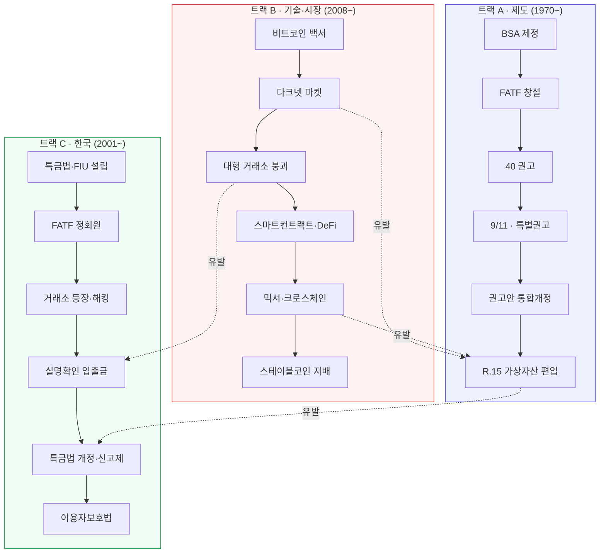
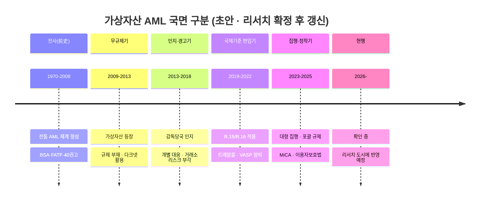

# 타임라인 데이터 모델 — 역사적 분기부터 현재까지

> **역할**: 제도·기술·시장의 시간축 재구성 · **의존**: L2 동적 계층 (`EVT`, `CAUSED`)
> **저장**: `kb/entities/events/`, `kb/derived/timeline/` · **리서치 소스**: `_research/wave1/historical-timeline.md`

---

## 1. 왜 타임라인이 별도 모델인가

AML 규제는 **사건 → 대응**의 반복으로 만들어졌다. 조문만 읽으면 "왜 이런 규정이 생겼는지" 알 수 없고, 규정의 취지를 모르면 회색지대에서 판단할 수 없다. 업계 최고 수준의 판단력은 조문 암기가 아니라 **계보 이해**에서 나온다.

그래서 타임라인은 부록이 아니라 **1급 데이터 구조**다. 세 가지를 담는다.

1. **무엇이 언제 일어났는가** — 사건의 시점
2. **무엇이 무엇을 유발했는가** — 인과 사슬
3. **시대가 어떻게 나뉘는가** — 국면(era) 구분

---

## 2. 3트랙 구조

사건을 하나의 선으로 늘어놓으면 인과가 보이지 않는다. 세 트랙으로 분리하고 **트랙 간 인과 엣지**로 연결한다.



| 트랙 | 범위 | 담는 것 |
|---|---|---|
| **A · 제도** | 1970~ | 국제기준·주요국 입법·감독체계 형성 |
| **B · 기술·시장** | 2008~ | 프로토콜 등장, 사고·해킹, 시장 구조 변화, 세탁 기법 진화 |
| **C · 한국** | 2001~ | 국내 법제·시장·집행 |

---

## 3. EVT 레코드 스키마 (타임라인 확장)

```yaml
id: "EVT:jp-mtgox-collapse-2014"
type: "EVT"
layer: "dynamic"
label:
  ko: "마운트곡스 파산 신청"
  en: "Mt. Gox files for bankruptcy protection"
track: "B"                        # A | B | C (복수 가능 → tracks: [A, C])
evt_kind: "incident"              # legislative | enforcement | incident | technical | market | institutional
occurred_on: "2014-02-28"         # 실제 발생일
announced_on: "2014-02-28"        # 공표일 (다르면 둘 다)
date_precision: "day"             # day | month | year — 불확실하면 낮춰서 정직하게
jurisdiction: "JUR:jp"
impact: "H"                       # H | M | L — §5 기준
era: "ERA:2013-2017-exchange-risk"
subjects: ["VASP:jp-mtgox"]
summary: >
  <2~3문장. 무슨 일이 있었는지.>
significance: >
  <이 사건이 왜 타임라인에 들어가는지. 제도적 의미.>
edges:
  - predicate: "CAUSED"
    to: "EVT:jp-psa-amendment-2016"
    qualifiers:
      mechanism: "이용자 자산 보호 공백 노출 → 거래소 등록제 도입"
      lag_days: 780
      confidence: "B"
      basis: "개정 법률안 제안이유서에 명시적 언급"
evidence:
  - doc: "DOC:..."
    confidence: "A"
```

### 3.1 날짜 정밀도 (`date_precision`)

역사 데이터는 정밀도가 균일하지 않다. **모르는 것을 아는 척하지 않기 위한 필드**다.

| 값 | 표기 | 사용 |
|---|---|---|
| `day` | `2014-02-28` | 확정 일자 |
| `month` | `2014-02` | 월까지만 확인 |
| `year` | `2014` | 연도만 확인 |
| `range` | `2014-02-01/2014-03-31` | 구간으로만 특정 |

렌더링 시 정밀도에 따라 표기를 다르게 한다. 연도만 아는 사건을 `2014-01-01` 로 채우면 그 시점부터 거짓이 된다.

### 3.2 발생일 ≠ 공표일

| 사례 | occurred_on | announced_on |
|---|---|---|
| 해킹 | 실제 탈취 시각 | 사후 공개 시점 |
| 제재 지정 | 지정 효력일 | 관보 게재일 |
| 법률 | 공포일 | — (시행일은 별도 `EVT`) |

**법률은 공포와 시행을 각각 별개 `EVT` 로 만든다.** 하나로 뭉치면 "언제부터 의무가 발생했나"를 답할 수 없다.

---

## 4. 인과 사슬 (CAUSED)

타임라인의 진짜 가치는 여기 있다.


### 4.1 인과 주장의 근거 등급

인과는 **가장 틀리기 쉬운 주장**이다. 시간적 선후를 인과로 오인하는 것을 막기 위해 근거 유형을 강제한다.

| `basis` | 확신도 | 예 |
|---|---|---|
| `explicit_legislative` | **A** | 제안이유서·규칙제정 배경설명에 사건이 명시적으로 언급됨 |
| `official_statement` | **A~B** | 감독기관 공식 발언·보도자료에서 연결 |
| `contemporaneous_record` | **B** | 당시 공청회·의사록에서 논의 확인 |
| `expert_consensus` | **C** | 복수 전문 분석이 일관되게 연결 |
| `temporal_only` | **D** | 시간 순서만 — **원칙적으로 기록 금지** |

`temporal_only` 는 validator 가 거부한다. 근거 없는 인과는 그럴듯해서 더 위험하다.

### 4.2 인과 유형

| `mechanism` 분류 | 설명 |
|---|---|
| `gap_exposure` | 사건이 규제 공백을 드러냄 |
| `harm_scale` | 피해 규모가 임계를 넘어 대응 촉발 |
| `international_pressure` | 국제기준·평가 압력 |
| `technology_shift` | 기술 변화가 기존 규정을 무력화 |
| `enforcement_precedent` | 집행·판결이 해석을 확립 |
| `political_cycle` | 정권·정책 기조 변화 |

---

## 5. 파급도 (impact) 기준

주관적 판단을 줄이기 위해 기준을 고정한다.

| 등급 | 기준 (하나 이상 충족) |
|---|---|
| **H** | 국제기준 변경 / 주요국 법제 신설·전면개정 / 후속 `CAUSED` 엣지 3개 이상 / 시장 구조 자체를 바꾼 사건 |
| **M** | 단일 관할 규정 개정 / 주요 집행조치 / 후속 `CAUSED` 1~2개 |
| **L** | 가이던스·FAQ 수준 / 개별 사업자 사안 |

---

## 6. 국면(ERA) 구분

시대 구분은 별도 노드로 만든다. 각 국면은 **시작 기준·종료 기준·지배적 특징**을 갖는다.

```yaml
id: "ERA:x-2019-2022-standardization"
type: "ERA"
label: { ko: "국제기준 편입기", en: "Standardization era" }
starts_with: "EVT:intl-fatf-r15-va-2019"
ends_with: "EVT:x-ftx-collapse-2022"
valid_from: "2019-06"
valid_to: "2022-11"
dominant_traits:
  - "가상자산이 기존 AML 프레임에 공식 편입"
  - "트래블룰의 기술적 이행 문제 부상"
  - "관할별 이행 속도 격차 확대"
key_events: ["EVT:...", "EVT:..."]
```

국면 구분의 효용: 개별 사건을 외우는 대신 **"지금이 어떤 국면인지"** 로 새 사안을 해석할 수 있다. 전문가의 판단력은 여기서 나온다.



> **주의**: 위 국면 구분은 **설계 예시**이며 확정 사실이 아니다. `_research/wave1/historical-timeline.md` 도시에 검증 완료 후 `kb/entities/eras/` 에 확정 노드를 생성한다.

---

## 7. 파생 산출물

타임라인 그래프에서 자동 생성한다.

| 산출물 | 경로 | 형식 |
|---|---|---|
| 전체 연표 | `kb/derived/timeline/full.md` | 트랙별 표 |
| 관할별 연표 | `kb/derived/timeline/by-jurisdiction/{jur}.md` | — |
| 주제별 연표 | `kb/derived/timeline/by-topic/{topic}.md` | 예: 트래블룰 변천사 |
| 인과 그래프 | `kb/derived/timeline/causality.mmd` | Mermaid |
| 국면 요약 | `kb/derived/timeline/eras.md` | — |
| 시계열 데이터 | `kb/derived/timeline/events.jsonl` | 사이트·차트용 |

`events.jsonl` 은 향후 프론트엔드 타임라인 컴포넌트가 직접 소비할 형식이다 ([`../architecture/03-site-blueprint.md`](../architecture/03-site-blueprint.md)).

---

## 8. 품질 규칙

| # | 규칙 |
|---|---|
| T-1 | 모든 `EVT` 는 `date_precision` 을 명시한다 |
| T-2 | `CAUSED` 엣지는 `basis` 가 `temporal_only` 가 아니어야 한다 |
| T-3 | `CAUSED` 는 `from.occurred_on <= to.occurred_on` |
| T-4 | 법률 사건은 공포·시행을 별도 `EVT` 로 분리한다 |
| T-5 | `impact: H` 인 사건은 `significance` 를 반드시 채운다 |
| T-6 | 모든 `EVT` 는 최소 1개 T1~T3 출처를 갖는다 |
| T-7 | 국면(`ERA`)은 시작·종료 사건을 명시하거나 명시적으로 "진행 중"으로 표시한다 |
