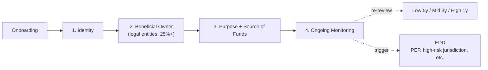

# CDD, EDD, and RBA — Risk-Based Customer Due Diligence

> Korean VASP approach to customer due diligence and the risk-based approach score. Condensed from [`../notes/5-compliance/cdd-edd.md`](../notes/5-compliance/cdd-edd.md). Covers CDD four-step, EDD triggers, the five-factor RBA score with calibration, and what supervisors expect to see during inspection.

## TL;DR

- **CDD** is the four-step standard applied to every customer: identify, confirm beneficial owner, establish purpose and source of funds, ongoing monitoring.
- **EDD** adds source-of-funds evidence, executive approval, and enhanced monitoring on top of CDD for high-risk customers. It **supplements**, not replaces, CDD.
- Korean VASPs apply EDD on: PEP, high-risk jurisdictions, large transactions, complex ownership, cash-intensive occupations, mixer exposure, adverse media.
- Virtual asset business is 100% non-face-to-face by design — this alone contributes weight to the RBA score.
- The FIU **Risk-Based Approach Processing Standard** guideline is the operating bible, mapping CDD/EDD requirements to customer risk tiers.
- The RBA score is a weighted sum of five factors (customer, geography, product, channel, behavior) with a calibration override that promotes a customer when any single factor hits a top bucket.

---

## 1. CDD — Four Standard Steps



### Step 1 — Identification and Verification

**Identification** is collecting what the customer tells you. **Verification** is confirming it through an independent source. Regulators treat these as distinct checks.

| Item | Individual | Corporate |
|---|---|---|
| Required | Name, DOB, address, contact | Legal name, business number, address, representative, business purpose |
| Verification | ID OCR + selfie + liveness + 본인확인기관 | Business registration, corporate registry, articles of incorporation |
| Supplementary | Mobile phone / email verification | Shareholder list, officer list |

### Step 2 — Beneficial Owner (Legal Entities)

Identify the **natural person holding 25%+ ownership** or exercising actual control. Multi-layered ownership must be traced to the end:

- Customer legal entity A -> shareholder legal entity B (50%)
- B -> shareholder legal entity C (60%)
- C -> natural person X (100%)
- Then X is A's UBO (50% × 60% × 100% = 30%, above 25%)

Where UBO cannot be identified, the usual fallback is to designate a senior executive as the **interim BO** (supervisor-recommended workaround).

### Step 3 — Purpose and Source of Funds

Three layers of information:

- **Purpose**: investment, payment, custody, business operations
- **Expected activity**: amount, frequency, counterparty countries
- **Source of Funds** (SoF): origin of the funds entering the account
- **Source of Wealth** (SoW): origin of the customer's overall wealth (emphasized in EDD)

SoF vs SoW is often confused. SoF is about **this specific money** (this month's salary). SoW is about **the customer's total wealth** (career earnings plus real estate proceeds). EDD requires documentation for both.

### Step 4 — Ongoing Monitoring

- Keep KYC data current
- Check transaction patterns against declared purpose
- Re-review when risk factors change (newly designated PEP, move to a high-risk jurisdiction)
- Korean guideline re-review cycle: **low 5 years, medium 3 years, high 1 year**

**Operating reality**: Over 80% of CDD failures occur at Step 4. Onboarding is laborious and usually handled well; existing customers get neglected on the assumption "they were already approved". Automated re-review queues and a supervisory dashboard are the safety net.

---

## 2. EDD Triggers (Korean Context)

EDD layers on top of CDD — it does not replace it. "We did EDD, so we skipped CDD" is a regulatory violation.

### Triggers (automatic)

| Category | Example |
|---|---|
| **PEP** | PEP or their family or close associates |
| **High-risk jurisdiction** | FATF Black/Grey, Korean MOFA designation |
| **Non-face-to-face + additional risk** | Virtual assets are always non-face-to-face, so another factor tips it into EDD |
| **Large transactions** | Amounts disproportionate to declared purpose |
| **Complex ownership** | Shell companies, multi-layer holding |
| **Cash-intensive occupation** | Casino, precious metals, currency exchange, real estate |
| **High-risk product** | Privacy coins, mixer exposure, anonymous wallets |
| **Adverse media** | Match against negative-news databases |

### EDD additional procedures

1. **Source of funds / wealth evidence** — salary slips, business records, account statements, sale contracts
2. **Senior executive approval** — executive (CCO or AMLO) sign-off required
3. **Enhanced monitoring** — lower transaction thresholds, higher alert priority
4. **Shorter re-review cycle** — typically 1 year
5. **Additional information** — occupation, income, business partners, counterparty countries

**Common mistake**: treating EDD as "one extra ID photo". The regulatory core of EDD is **source-of-funds evidence**. If the evidence is ambiguous, request more; if adequate, approve. If the customer refuses, close the account.

### Source-of-Funds documents actually requested at Korean VASPs

| Customer type | Documents |
|---|---|
| Salaried employee | 3-6 months of pay slips + withholding tax receipts |
| Self-employed | Business registration + VAT returns + bank statements |
| Inheritance / gift | Inheritance or gift tax receipts + asset schedule |
| Real-estate sale | Sale contract + proof of receipt |
| Stock options | Exercise contract + tax filing |
| Foreign resident | Home-country tax filings + bank records (notarized translation) |
| Crypto miner | Electricity bills + mining equipment records + on-chain reward history |

**SLA**: submission -> analyst first review 1-3 days -> AMLO approval 1 day -> customer response. Total 3-7 days is normal.

---

## 3. RBA Score — Five-Factor Formula

### Why quantify?

FATF R.1 and Tukgeumbeop §5-2 both require **"controls proportionate to risk"**. To operationalize this, firms need a numerical risk score. Qualitative judgment alone fails on three counts:

- Cannot be proven consistent during inspection
- Produces analyst-to-analyst variance on the same customer
- Cannot be automated in rules

### Standard formula

```
risk_score = w_customer  × customer_factor
           + w_geography × country_factor
           + w_product   × product_factor
           + w_channel   × channel_factor
           + w_behavior  × behavior_factor
```

Weights sum to 1.0 (or 100 on an un-normalized scale).

### Customer Factor (weight 25-30)

| Attribute | Score |
|---|---|
| PEP | 30 |
| PEP family or close associate | 20 |
| High-risk occupation (casino, firearms, crypto exchange) | 15 |
| General professional (doctor, lawyer) | 5 |
| Salaried employee or civil servant | 0 |
| Student or homemaker | 0 (upweighted on large-amount activity) |

### Geography Factor (weight 20-25)

| Country | Score |
|---|---|
| FATF Black List (North Korea, Iran) | 40 |
| FATF Grey List (14 countries as of 2026-04) | 25 |
| OFAC Comprehensive (Cuba, Syria, Venezuela and others) | 35 |
| Tax haven (Cayman, BVI and others) | 15 |
| Korea / US / EU / Japan / UK | 0 |
| Other | 5 |

### Product Factor (weight 15-20)

| Service | Score |
|---|---|
| Privacy coin trading (Monero, Zcash) | 30 |
| Mixer / tumbler exposure history | 25 |
| Large self-hosted wallet deposits or withdrawals | 15 |
| Staking / LST | 10 |
| Basic spot trading | 0 |
| KRW deposit and withdrawal only | 0 |

### Channel Factor (weight 10-15)

| Channel | Score |
|---|---|
| Video-only non-face-to-face | 15 |
| Non-face-to-face + supplementary offline verification | 5 |
| In-person (branch visit) | 0 |

### Behavior Factor (weight 15-20)

| Pattern | Score |
|---|---|
| Smurfing / structuring suspected | 40 |
| Pass-through (deposit then withdraw within 24h, repeating) | 30 |
| Late-night high-velocity trading | 20 |
| Normal | 0 |

### Tier mapping

| Total Score | Tier | CDD/EDD |
|---|---|---|
| 0-29 | Low | Simplified CDD (document-lite) |
| 30-59 | Medium | Standard CDD |
| 60-79 | High | EDD triggered |
| 80+ | Critical | EDD + manual approval + AMLO review |

---

## 4. Calibration — Override for Single-Factor Spikes

A simple weighted sum can **under-count** a customer whose risk comes entirely from one factor. Industry practice applies a calibration step that promotes the customer when any factor hits a top bucket:

```python
def calibrate(raw_score, factors):
    if max(factors) >= 25:
        raw_score = max(raw_score, 50)  # Medium floor
    if max(factors) >= 35:
        raw_score = max(raw_score, 70)  # High floor
    return min(raw_score, 100)
```

### Worked example

Customer B — UAE resident, construction contractor, video KYC, interested in privacy coins, 24-hour pass-through trades.

- Customer: high-risk occupation 15 × 0.25 = 3.75
- Geography: other 5 × 0.20 = 1.0
- Product: privacy coin 30 × 0.20 = 6.0
- Channel: video KYC 15 × 0.10 = 1.5
- Behavior: pass-through 30 × 0.25 = 7.5

Raw total: 19.75 (would read "Low" on the raw scale).

After calibration: privacy coin factor = 30 and pass-through = 30, both >= 25, so the Medium floor (50) kicks in. Final score >= 50. Tier = Medium or higher.

### Why this matters

Without calibration, a customer with a single dangerous signal (for example, heavy Tornado Cash exposure) can slip into Low simply because their other factors are clean. Calibration enforces the principle: **any single material risk is enough** to require enhanced scrutiny.

---

## 5. Re-assessment Cycles

| Tier | Re-review cycle |
|---|---|
| Low | 3 years |
| Medium | 2 years |
| High | 1 year |
| Critical | 6 months + ad hoc |

### Trigger-based re-assessment

- Large transaction (single event of KRW 100M+)
- New counterparty country
- Elevated KYT alert volume
- Change in customer-reported information

---

## 6. Documentation for Inspectors

During inspection, the FIU and FSS will request:

- **Documented scoring formula** (Excel or pseudocode is acceptable)
- **Weight justification** — why these weights, not others
- **Tier distribution** for the last 12 months (Low / Medium / High / Critical %)
- **Re-assessment audit trail** samples

### Expected distribution (typical Korean VASP)

- Low: 70-85%
- Medium: 10-25%
- High: 3-8%
- Critical: 0.5-2%

Red flags for inspectors:

- **Critical > 5%** — the customer base may be genuinely too high-risk
- **Low > 90%** — RBA operation probably nominal rather than real

---

## 7. Common Mistakes

- **Treating CDD as onboarding only** — ongoing monitoring gets skipped
- **Defining PEP too narrowly** — must include family and close associates
- **Stopping at the nominal representative** — BO tracing must reach the controller
- **Treating EDD as just "another ID"** — the core is source-of-funds evidence
- **Tipping off** — telling the customer about an STR, a separate criminal offense
- **Missing recordkeeping** — cannot produce evidence at inspection = sanction

These six are the most-cited issues in Korean on-site inspections. Quarterly internal sampling against each of them is an effective preventive drill.

---

## Korean Source

- [`../notes/5-compliance/cdd-edd.md`](../notes/5-compliance/cdd-edd.md) — Full Korean note with additional operating KPIs, approval workflow diagrams, and "Industry Reality" sections
- [`../notes/5-compliance/sanctions-screening.md`](../notes/5-compliance/sanctions-screening.md) — Sanctions screening with Korean fuzzy-matching tuning
- [`../notes/5-compliance/str-ctr.md`](../notes/5-compliance/str-ctr.md) — STR and CTR reporting
- FIU [위험기반접근법(RBA) 처리기준](https://www.kofiu.go.kr/) — Korean regulator guideline
