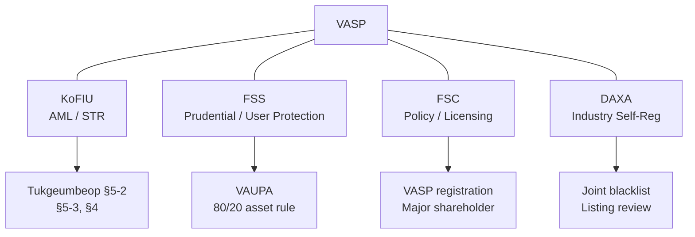
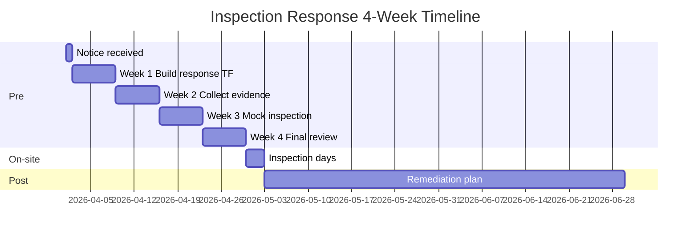
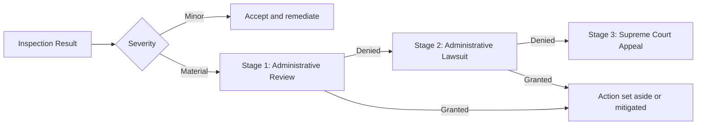

# FIU/FSS On-site Inspection Response — Full Workbook

> Full English translation of the Korean inspection response workbook ([`../notes/5-compliance/inspection-response.md`](../notes/5-compliance/inspection-response.md), 901 lines). Korean VASPs face one to two regulator inspections per year. This workbook covers the 4-week preparation timeline, 40-item checklist, document requirements, interview guides, post-inspection remediation, and the three-stage appeals process. Reference date: 2026-04.

## TL;DR

- **Inspectors**: KoFIU (AML), FSS (prudential and user protection), FSC (policy). DAXA (industry self-regulator).
- **Frequency**: One annual comprehensive inspection plus ad hoc.
- **Preparation window**: 2-4 weeks after notice; on-site 1-2 days.
- **Deliverables**: self-assessment report, 40-60 evidentiary documents, FAQ response kit.
- **Must-avoid**: missing documents, number inconsistencies, tipping-off violations, AMLO absence, unremediated prior findings.

---

## 1. Regulatory Body Overview

### Division of labor across the three Korean agencies (+ DAXA)

| Agency | Scope | Annual inspection focus |
|---|---|---|
| **KoFIU (FIU)** | AML, STR, CTR, Travel Rule | STR quality, tipping-off controls, internal controls |
| **FSS (Financial Supervisory Service)** | Prudential, user asset protection | 80/20 asset segregation, cold-wallet evidence, insurance |
| **FSC (Financial Services Commission)** | Policy, licensing | VASP registration maintenance, major shareholder changes |
| **DAXA (self-regulator)** | Industry self-regulation | Joint blacklist, listing review, coordinated responses |



### Three inspection types

1. **Comprehensive (annual)** — once a year, 4-5 days, all domains.
2. **Thematic** — targeted (STR quality, Travel Rule, user protection), 2-3 days.
3. **Ad hoc / emergency** — triggered by incidents (hack, large STR, complaint surge), no advance notice.

### Legal basis

- **Tukgeumbeop §15** — inspection and supervision authority (FIU)
- **Tukgeumbeop §16** — document production authority
- **VAUPA §13-14** — FSS inspection authority
- **FSC Establishment Act §17** — FSC supervisory authority

### Intensity comparison

| Item | Comprehensive | Thematic | Ad hoc |
|---|---|---|---|
| Notice | D-30 | D-14 | None |
| Duration | 4-5 days | 2-3 days | 1-2 days |
| Document requests | 50+ | 20-30 | 10+ |
| Interviews | 8-10 people | 3-5 | 2-3 |
| Penalty likelihood | Medium | Medium | High |

---

## 2. Timeline — 4 weeks of preparation + on-site + aftermath



### Notice received (D-30 or D-15)

The notice typically includes:

- Inspector agency, dates, location (firm HQ or FIU offices)
- Scope and focus areas
- **Required document list** (normally 30-50 items)
- Contact person, inspection team composition

### Immediate actions (within 24 hours of notice)

- [ ] Brief the CEO, board, and audit committee
- [ ] AMLO convenes the response task force (TF)
- [ ] Put external counsel on standby (mandatory for comprehensive inspections)
- [ ] Archive the original notice under chain-of-custody controls

### Week 1 (D-30 to D-22): Team Formation

- [ ] **AMLO-led response TF** — AMLO + operations head + legal + IT
- [ ] Internal kickoff — scope, timeline, roles
- [ ] Board notice — reporting cadence during the inspection
- [ ] External legal / compliance advisors retained if needed
- [ ] Review prior-year findings and remediation status
- [ ] Secure a dedicated War Room
- [ ] Establish communication policy — external, press, customers

### Week 2 (D-21 to D-14): Evidence Collection

- [ ] First-pass collection of the 40-60 requested items
- [ ] Apply the self-diagnostic checklist (see §3)
- [ ] Remediate any gaps you can fix before inspection
- [ ] Cross-check key numbers (STR counts, volumes, account totals)
- [ ] Scan, classify, and index evidence
- [ ] Validate data-extraction queries — ensure reports reproduce
- [ ] Risk-score items with weak evidence and prepare alternate support

### Week 3 (D-14 to D-7): Mock Inspection

- [ ] Document QA — final AMLO sign-off
- [ ] Draft FAQ responses (see §4)
- [ ] Interview prep — 30-minute AMLO, analyst, IT Q&A simulations
- [ ] Environment check — conference rooms, demo systems, printers, network
- [ ] Half-day mock drill led by external counsel
- [ ] Emergency response to any gaps the mock exposes

### Week 4 (D-7 to D-0): Final Review

- [ ] Submit documents (D-3 or D-1)
- [ ] Final AMLO all-hands briefing
- [ ] Prepare inspector reception — parking, badges, conference rooms
- [ ] Pre-brief CS and sales teams on escalation during inspection
- [ ] Security check — define inspector network access boundaries
- [ ] Pre-print document receipt forms

### On-site days (D-day to D+2)

- [ ] Inspector reception — CEO and AMLO greet
- [ ] Interviews per pre-agreed guidance
- [ ] Rapid response to supplementary document requests
- [ ] Daily 17:00 internal debrief
- [ ] Final confirmation at inspector departure — document receipt
- [ ] Maintain clean-desk policy in any inspector-visible area

#### Daily debrief template

```
[Date] Inspection Day-N Debrief
─────────────────────────────
1. Topics covered today:
2. Additional document requests: __ (submitted __, pending __)
3. Interviews completed: __ (scheduled __)
4. Inspector tone: neutral / favorable / stern
5. Expected topics tomorrow:
6. Overnight action items:
Prepared by: ____  Approved: AMLO ____
```

### Post-inspection (D+3 to D+60)

- [ ] Receive inspection opinion (D+30 to D+60)
- [ ] Submit remediation plan within 60 days
- [ ] Reporting cadence — quarterly or per instruction
- [ ] Prevent repeat findings — SOP revisions and training
- [ ] Internal lessons-learned session before TF is disbanded
- [ ] Final board report — findings plus remediation plan

---

## 3. 40-Item Self-Diagnostic Checklist

### A. Registration and Licensing (5 items)

- [ ] FIU registration certificate (original, valid)
- [ ] ISMS certificate valid
- [ ] Real-name banking contract on file
- [ ] Recent major shareholder changes filed
- [ ] Articles of incorporation and business registration current

### B. AMLO and Governance (6 items)

- [ ] AMLO appointment letter and resume (3+ years of relevant experience)
- [ ] AMLO authority and reporting documents (direct board line)
- [ ] Internal control standards current (AML policy and SOPs)
- [ ] Quarterly board AML reporting records
- [ ] Annual independent audit (internal or external) evidence
- [ ] Annual employee AML training records

### C. KYC / CDD / EDD (7 items)

- [ ] KYC policy and SOP
- [ ] Real-name verification (integration with 본인확인기관)
- [ ] Customer risk tier criteria (3-5 tiers)
- [ ] EDD trigger list and execution records
- [ ] Non-face-to-face verification flow (video call, document checks)
- [ ] PEP screening vendor and records
- [ ] Customer profile refresh cycle (low 3 years, high 1 year)

### D. KYT and Transaction Monitoring (8 items)

- [ ] KYT vendor contracts (Chainalysis, VerifyVASP, CODE, and others)
- [ ] Rule catalog and activation status
- [ ] Alert-handling SOP and SLA (24h, 48h)
- [ ] False-positive management policy with quarterly tuning
- [ ] Rule committee minutes (monthly cadence)
- [ ] Wallet blacklist (DAXA shared + internal)
- [ ] Enhanced monitoring evidence for top 100 customers
- [ ] Real-time escalation system for anomalous transactions

### E. STR / CTR / Reporting (6 items)

- [ ] STR submissions (annual count, processing time, AMLO approvals)
- [ ] STR template — 7-section compliance
- [ ] Tipping-off controls and training records
- [ ] CTR records (10M KRW+)
- [ ] Rejection and resubmission history with response
- [ ] FIU-TIS portal access rights and logs

### F. Sanctions Screening (4 items)

- [ ] OFAC SDN daily refresh and update records
- [ ] Daily comparison against UN, EU, Korean MOFA lists
- [ ] Wallet-address sanctions screening (Chainalysis, TRM)
- [ ] Potential-match disposition records

### G. Travel Rule (4 items)

- [ ] Travel Rule vendor contract (VerifyVASP, CODE, Notabene)
- [ ] IVMS101 message quality validation logs
- [ ] Sunrise Issue policy plus handled cases
- [ ] PIPA compliance — national ID hashing

### Scoring

Each item is marked **Complete / Partial / Deficient**. Three or more deficient items triggers an emergency TF meeting — these gaps get first priority. Items that cannot be fixed before inspection need a reasonable alternate evidence bundle plus a management sign-off memo.

---

## 4. Expected Questions and Model Answers

### Q1. "Why is your STR count low relative to peers?"

**Framing**:

- Customer mix (institutional / B2B customers produce fewer false positives)
- KYT and EDD **prevention at entry** — risk filtered before transaction
- STR quality policy (low rejection rate)
- Support with concrete numbers: "N filings per year, zero rejections, 3-day average AMLO approval, fewer than 5% FIU supplementary requests"

**Supporting evidence**:

- Year-over-year STR trend chart
- Rejection rate and AMLO processing time statistics
- EDD / denial report (pre-entry prevention record)

### Q2. "Why is a Tornado Cash interaction address still blocked?"

**Framing**:

- "Independent risk assessment under Tukgeumbeop §5-2"
- "Past money-laundering risk persists"
- "Consistent with the DAXA joint guideline"
- Policy document + AMLO signature + board approval

**Supporting evidence**:

- Internal Tornado risk memo
- DAXA guideline receipt log
- Unblock / appeal SOP

### Q3. "How do you evidence 80/20 user asset segregation?"

**Answer**:

- Quarterly external audit reports (auditor attestation)
- Disclosed multi-sig cold-wallet addresses with balance proof
- Per-user internal ledger reconciled to on-chain balances (Proof of Reserves, PoR)

**Supporting evidence**:

- Big 4 or designated auditor opinion
- Signed multi-sig address list with balance snapshots
- PoR Merkle tree report

### Q4. "Does the AMLO have sufficient authority?"

**Answer**:

- Organizational chart — direct CEO / board reporting line
- Transaction-stop authority in the SOP
- Compensation at top-executive tier
- Attendance at board and executive meetings

**Supporting evidence**:

- Appointment letter and delegation-of-authority rules
- Board attendance records
- D&O insurance policy

### Q5. "How are monitoring rules maintained?"

**Answer**:

- Monthly rule committee — AMLO + analytics lead + KYT engineer + legal
- Quantitative tuning from alert and FP data
- Board reporting for material changes
- Full version control (Git or equivalent)

**Supporting evidence**:

- 12 months of rule committee minutes
- Change log (Git commits or Jira)
- Before/after FP metric comparison

### Q6. "Can you walk us through a specific large STR case?"

**Framing**:

- **Never** disclose a specific case number or customer ID orally — tipping-off risk.
- Describe the **process** instead: alert -> EDD -> AMLO sign-off -> FIU submission route.
- Offer a written follow-up if the inspector insists.

### Q7. "How reliable is your non-face-to-face identity verification?"

**Framing**:

- API integration with 본인확인기관 (KCB, NICE, and others)
- Recorded video calls with face matching (vendor name disclosed)
- Forgery/impersonation detection statistics

### Q8. "Has any employee communicated favorably with a customer after an STR?"

**Framing**:

- Tipping-off SOP — automatic masking of STR-subject customer IDs plus CS ticket isolation
- Dedicated tipping-off training module in employee AML training
- No prior violations, or documented remediation

---

## 5. Required Documents (approximately 40)

Grouped into three sets.

### Policy / SOP (10)

- [ ] AML policy (top-level)
- [ ] KYC / CDD SOP
- [ ] EDD SOP
- [ ] KYT rule-operations SOP
- [ ] STR drafting and submission SOP
- [ ] Sanctions screening SOP
- [ ] Travel Rule operations SOP
- [ ] Tipping-off controls SOP
- [ ] User protection policy
- [ ] Board AML reporting SOP

### Evidence / Records (20)

- [ ] FIU registration certificate
- [ ] ISMS certificate
- [ ] Real-name banking contract
- [ ] AMLO appointment letter
- [ ] Board minutes (AML-related)
- [ ] Independent audit reports
- [ ] Employee AML training records
- [ ] KYC vendor contract
- [ ] KYT vendor contract
- [ ] Travel Rule vendor contract
- [ ] External audit of asset segregation
- [ ] Proof of Reserves (PoR)
- [ ] Monthly alert / FP reports
- [ ] Rule committee minutes
- [ ] STR submission records and evidence
- [ ] Sanctions screening logs
- [ ] IVMS101 message quality logs
- [ ] Customer risk-tier distribution report
- [ ] Escalation records for anomalous transactions
- [ ] Prior-year remediation progress report

### Incident Response Records (10)

- [ ] Hacking and fraud response
- [ ] Large STR case files
- [ ] Suspected sanctions-violation cases
- [ ] Customer complaints
- [ ] Service suspension / block records
- [ ] Law-enforcement cooperation records
- [ ] Press response records
- [ ] Customer notices
- [ ] System-outage response records
- [ ] Foreign VASP cooperation

### Document index template

Every artifact is assigned a unique ID so inspectors can reference it:

```
[ID] [Category] [Title] [Version] [Date] [Owner] [Path]
POL-001  Policy   AML Policy       v3.2  2026-01-15  AMLO       /compliance/policy/aml-policy-v3.2.pdf
POL-002  Policy   KYC SOP          v2.1  2025-11-03  Ops lead   /compliance/sop/kyc-sop-v2.1.pdf
EVD-001  Evidence FIU cert         orig  2021-09-24  Legal      /legal/cert/fiu-2021.pdf
EVD-002  Evidence ISMS cert        2025  2025-06-30  Security   /security/isms-2025.pdf
...
```

### Submission format

- PDF originals + Excel summary in parallel
- File naming: `ID_title_date.pdf`
- Password-protected, delivered via a separate channel

---

## 6. On-site Interview Guides

### General principles

1. **3-second rule** — pause for three seconds after a question before answering. Do not blurt.
2. **"I don't know" is acceptable** — speculation or fabrication creates perjury risk.
3. **Reference documents** — "Please see document ID EVD-XXX" is a valid answer.
4. **Ask for time** — "Let me confirm and get back within the hour" is acceptable.
5. **Recording** — confirm whether the inspector is recording and under what notice.

### AMLO interview (30-60 min)

**Likely questions**:

- Organization, authority, reporting structure
- Reasoning behind major policy decisions
- Three significant incidents from the past year
- Self-assessed weaknesses and improvement plan

**Principles**:

- Cite numbers, dates, and document paths
- "I will confirm and respond" — never guess
- Emphasize executive and board-level support

**Materials to have on hand**:

- AMLO playbook (authority and decisions log)
- Board reports for the last four quarters
- Major STR case number list (numbers only, not content)

### Analyst interview (30 min)

**Likely questions**:

- Daily alert-handling flow
- FP determination criteria and SOP
- STR drafting experience
- A recent difficult case

**Principles**:

- SOP-grounded responses
- Walk through alert -> FP / STR flow step by step
- Share rule-tuning proposals

### IT / Engineer interview (30 min)

**Likely questions**:

- KYT system architecture
- Vendor API integration and latency
- Data retention and encryption
- Change management process

**Principles**:

- Bring architecture diagrams
- Demo live logs and monitoring dashboards

### Executive interview (15-30 min, CEO / board member)

**Likely questions**:

- AMLO support and resource allocation
- AML strategic direction
- Involvement in major incident response

**Principles**:

- Emphasize AMLO independence
- Cite annual AML budget and headcount growth
- Describe board AML-agenda frequency

### Top 5 things to avoid

1. Disclosing specific customer IDs or case numbers aloud (tipping-off)
2. Inventing numbers you don't remember
3. Pre-coordinating answers with colleagues
4. Shifting blame for document delays
5. Offering gifts or entertainment to inspectors

---

## 7. Post-Inspection Remediation

### Finding severity tiers

| Tier | Meaning | Response deadline |
|---|---|---|
| **Recommendation** | Room for improvement | 6 months |
| **Finding** | Potential violation | 3 months |
| **Warning** | Material violation | 1 month + administrative fine |

### Remediation-plan principles

- Specific, measurable, time-bound
- Owner assigned (AMLO accountable)
- Board-approved
- Monthly internal progress reporting

### Remediation plan template

```
────────────────────────────────────
Remediation Plan
────────────────────────────────────
Company: ___
Regulator: FIU / FSS
Inspection period: 2026-__-__ to __-__
Submitted: 2026-__-__

[Finding 1]
- Original text: "____________________"
- Tier: Recommendation / Finding / Warning
- Root cause: ____________________
- Actions:
  1) ____________________
  2) ____________________
  3) ____________________
- Owner: AMLO ___ / Implementer ___
- Deadline: 2026-__-__
- KPI: ____________________

[Finding 2]
...

────────────────────────────────────
AMLO signature ____  CEO approval ____  Board resolution date ____
────────────────────────────────────
```

### Reporting cadence

- **Monthly internal** — AMLO -> Board Risk Committee
- **Quarterly regulatory** — to FIU / FSS per stated deadline
- **Completion notice** — formal document per finding on closure

### Administrative fines

- **Range**: KRW 10M - 100M+ under Tukgeumbeop §20
- **Pre-decision comment**: 14-day right-of-reply under the §20 enforcement decree
- **Appeal**: 60 days to initiate administrative review (see §8)

---

## 8. Appeals Process — when you disagree with the result

When the inspection result (finding, administrative action, or fine) contains factual errors, legal misinterpretation, or proportionality problems, a VASP can pursue formal appeal routes. In practice, **large actions** (fine of USD 100K+, business suspension, deregistration) almost always prompt appeal consideration.

### 8.1 Three-stage appeal path



### 8.2 Stage 1 — Administrative Review (행정심판)

**Basis**: Administrative Basic Act §28-29, Administrative Appeals Act

**Filing deadline**: 90 days from notice of the disposition (Administrative Appeals Act §27)

**Forum**:
- FSC action: FSC Administrative Appeals Committee
- FIU action: Commissioner of KoFIU (supervising authority)

**Required documents**:
- Administrative review petition (prescribed form)
- Copy of the original disposition notice
- Evidence rebutting the facts (transaction logs, emails, minutes, external audit)
- Legal opinion (required for large matters — retain a top-tier law firm)
- Power of attorney (if acting through counsel)

**Processing time**: 60 days (extendable by 30)

**Practical tips**:
- Filing **does not** stay enforcement. Fines are paid first, then refunded if the appeal prevails.
- Large firms (Kim&Chang, Sejong, Lee&Ko, Yulchon) staff former FSC lawyers — win rates are higher.
- Historical grant rate in Korean financial cases: roughly 10-20% (mostly denied, occasional partial mitigation).

### 8.3 Stage 2 — Administrative Lawsuit (행정소송)

**Basis**: Administrative Litigation Act §19 (cancellation suit)

**Filing deadline**: 90 days from the administrative review decision, or 90 days from the original disposition if review is skipped.

**Forum**: Seoul Administrative Court (has jurisdiction over FSC / FIU actions)

**Suit types**:
- **Cancellation suit** — most common, seeks to void the disposition
- **Nullity confirmation** — argues the disposition is legally void ab initio
- **Illegal inaction** — when a mandated FIU action was not taken

**Processing time**: typically 1-2 years (longer for complex matters)

**Grant rate**: Korean administrative litigation averages 15-25% (2024 court statistics)

**Practical tips**:
- Financial cases are preferably routed to specialist panels (Seoul Admin Court Divisions 2 or 3) — counsel experience matters.
- **Preliminary injunction (stay of enforcement)** can be filed separately, suspending the disposition while the case proceeds.
- Loss exposes the firm to counsel fees and court costs — often tens of millions to hundreds of millions of KRW.

### 8.4 Stage 3 — Supreme Court

Supreme Court appeal is available after losing at the administrative court, but:

- **Legal review only** — no factual reargument, only law and application.
- Summary dismissal rate exceeds 70%.
- Virtually no precedent exists in major crypto matters — the industry's Korean history is still too short.

### 8.5 Negotiated settlement

Korea has no formal consent-decree mechanism, but in practice:

- **Demonstrated remediation** — showing "we are already improving" during or after the inspection can lead to reduced severity in negotiation.
- **Voluntary self-reporting** — before a formal disposition, self-reporting plus remediation has historically produced fine reductions.
- **Industry joint position** — DAXA or similar SRO position papers can influence supervisory decisions.

**US-style consent decrees** — Korea has no formal equivalent. There are no Korean analogues to the Binance USD 4.3B or OKX USD 504M settlements.

### 8.6 Real-world appeals (2020-2026)

| Year | Case | Route | Outcome |
|---|---|---|---|
| 2021 | VASP registration denial | Administrative review | Denied |
| 2022 | KRW 100M fine (KYC deficiency) | Administrative lawsuit | Mitigated to 50M |
| 2023 | Listed coin investigation non-compliance | Administrative review | Partially granted |
| 2024 | Registration revocation | Lawsuit + preliminary injunction | Injunction granted (case continues) |
| 2025 | STR omission penalty | Voluntary self-report | Closed before formal disposition |

**Pattern**: Success rests overwhelmingly on **procedural defects** or **proportionality** arguments. Directly rebutting the facts has a low hit rate.

### 8.7 Risks of appealing

- **Relationship risk** — you will work with FIU/FSS long term; emotionally charged appeals tend to invite stricter subsequent inspections.
- **Reputational risk** — lawsuits are public and Korean court decisions are published by default.
- **Cost risk** — top firms charge USD 500K - USD 2M+ depending on scale.
- **Timing risk** — 90-day deadlines are strictly enforced.

### 8.8 Recommended paths

For most VASPs:

1. **Minor findings**: accept and remediate diligently. Do not appeal.
2. **Moderate action (fine under KRW 50M)**: attempt voluntary self-report closure.
3. **Major action (fine KRW 100M+, suspension, deregistration)**: administrative review is effectively required, with top-tier counsel.
4. **Administrative review denied + existential business threat**: administrative lawsuit plus preliminary injunction.

The operating principle: **appeals are usually about severity mitigation, not outright victory**.

### 8.9 Decision checklist for appeals

Before deciding to appeal:

- [ ] Read the disposition notice and its statutory basis carefully
- [ ] Confirm existence of rebutting evidence on the facts
- [ ] Assess proportionality — compare with similar cases
- [ ] Financial impact analysis — compliance vs appeal cost
- [ ] Relationship risk assessment (future inspections, licensing)
- [ ] Reputational risk (public lawsuit)
- [ ] Counsel opinion (objective probability of success)
- [ ] Board approval for large matters
- [ ] Confirm you can actually prepare within 90 days

If the decision is "proceed", activate a dedicated TF, retain outside counsel, and set up shareholder communication promptly.

---

## 9. Top 5 Failures

1. **Late document submission** — even one day of delay costs points. Build in slack.
2. **Number inconsistency** — STR count in the report differs from the underlying database.
3. **Tipping-off violation** — a CS agent casually tells a customer the account was frozen because of an STR.
4. **AMLO absence** — AMLO is traveling on inspection day without a pre-designated deputy.
5. **Unremediated prior findings** — the same issue flagged two years running.

### Extended patterns

| # | Type | Concrete case | Mitigation |
|---|---|---|---|
| 1 | Documents | Submitted 48 of 50 requested items | Two-person cross-check on submission checklist |
| 2 | Numbers | STR report says 120 filings; DB says 118 | Single source of truth (SQL) with auto-extraction |
| 3 | Tipping-off | CS agent tells customer "your account is frozen because of an STR" | CS training + scripted responses |
| 4 | AMLO absence | AMLO at an overseas conference on inspection day | Pre-appoint a deputy AMLO |
| 5 | Repeat finding | "Training records deficient" two years in a row | Final D-7 confirmation of prior-year remediation |
| 6 | Demo failure | KYT dashboard errors out during the live demo | Dry-run rehearsal + backup screenshots |
| 7 | Interview contradiction | AMLO and analyst give opposite answers | Unified answer guide + mock inspection |

### Peer benchmarks inspectors reference

- Annual STR count per monthly trading volume
- EDD coverage ratio
- Alert -> STR conversion rate
- Average AMLO processing time
- False-positive rate (industry average 90%+)

Reporting significantly below peers invites scrutiny. A quarterly internal benchmark report is recommended.

---

## 10. RACI — Role and Responsibility

| Task | AMLO | Ops lead | Legal | IT | CEO |
|---|---|---|---|---|---|
| TF formation | R | A | C | C | I |
| Evidence collection | A | R | C | R | I |
| Self-assessment | R | A | C | C | I |
| Mock inspection | R | A | C | C | I |
| Interview participation | R | R | C | R | R |
| Remediation plan | R | A | C | C | A |
| Board reporting | R | C | C | I | A |

> R=Responsible, A=Accountable, C=Consulted, I=Informed

---

## 11. War Room Setup

### Physical space

- Dedicated conference room (lockable, cameras off)
- Two large monitors (for inspector demos)
- Printer, copier, shredder
- Document index on wall charts
- Emergency contact board

### Digital space

- Shared drive for the response (encrypted)
- Access limited to TF members
- Version control (Git or equivalent)
- Full audit logging

### Communications

- Dedicated Slack or Teams channel — `#inspection-2026`
- Daily standup at 17:00
- AMLO mobile available 24/7 for emergencies

---

## 12. TF Kickoff Agenda Template

```
─────────────────────────────────
Inspection Response TF — Kickoff
─────────────────────────────────
Date: 2026-__-__ 10:00-12:00
Attendees: AMLO, Ops lead, Legal, IT, CFO

1. Review the inspection notice (10 min)
2. Confirm scope and timeline (10 min)
3. RACI assignment (20 min)
4. Document request review (30 min)
5. Prior-year remediation status (15 min)
6. External communications policy (10 min)
7. Next meeting schedule (5 min)
─────────────────────────────────
```

---

## 13. When to Bring in External Experts

### Retain external advisors when

- Fine of KRW 50M+ is expected
- Criminal referral is possible
- Prior-year finding reached the **Warning** tier
- Major shareholder or executive changes are concurrent
- Structure ties to a foreign VASP are material

### Cost ranges (2025 Korea market reference)

| Service | Duration | Cost range |
|---|---|---|
| Legal advisory (Kim&Chang, Lee&Ko, Sejong) | Per matter | KRW 50M - 200M |
| Compliance consulting (Big 4) | 1 month | KRW 100M - 300M |
| Mock drill (external-run) | 2 days | KRW 20M - 50M |
| Forensic audit (hacking-linked) | Hourly | KRW 500K - 1.5M / hour |

---

## 14. Comparison With Other Jurisdictions

| Country | Supervisor | Key distinction |
|---|---|---|
| Korea | FIU, FSS, FSC | Real-name banking + VAUPA dual regime |
| US | FinCEN, OCC, state regulators | BSA/AML exam + MSB state licensing |
| Singapore | MAS | Payment Services Act basis, comprehensive on-site |
| Japan | FSA, JAFIC | Joint inspection with JVCEA self-regulator |
| EU | AMLA (from 2025), national FIUs | MiCA + AMLR dual inspection |

Korea's **real-name banking requirement** is unique globally. The partner bank effectively re-inspects the VASP, creating a double-check dynamic that other markets lack.

---

## 15. Post-inspection Internal Reset

Within 30 days of the inspection close, complete:

- [ ] SOP revisions addressing the gaps surfaced
- [ ] All-hands retraining on misunderstandings spotted during interviews
- [ ] Emergency rule committee session for any flagged rules
- [ ] Board resolution formally approving the remediation plan
- [ ] Vendor re-evaluation if KYT / Travel Rule performance was questioned
- [ ] Internal audit schedule adjustment — reset next-quarter focus
- [ ] Internal "lessons learned" document for next inspection

---

## 16. Crisis Scenarios During Inspection

### Scenario A — hack or incident occurs mid-inspection

1. Inform inspectors immediately — do not conceal.
2. Run incident response and IR workflows in parallel.
3. Request formal inspection pause if necessary.
4. Deploy legal and communications teams.

### Scenario B — sensitive data exposure in submitted documents

- Mask as required by PIPA before submission.
- Get the inspector's scope request in writing.
- Pre-consult with PIPC (Personal Information Protection Commission) if needed.

### Scenario C — suspected employee tipping-off

- Immediately escalate to AMLO
- Place the employee on standby and schedule retraining
- Initiate internal disciplinary process — **disclose proactively to inspectors**

### Scenario D — inspector request is unreasonable or overbroad

- Legal reviews, then file formal objection
- Escalate to the inspector's supervising official
- Document meticulously

---

## 17. D-1 Final Checklist

The 12 items the AMLO confirms the day before inspection:

- [ ] 100% of requested documents submitted?
- [ ] Full TF confirmed present on D-day?
- [ ] Deputy AMLO appointment letter prepared?
- [ ] Conference room / demo environment verified?
- [ ] Document index and ID system ready?
- [ ] Interview participants briefed one more time?
- [ ] Tipping-off reminder sent to all staff?
- [ ] External advisors on standby confirmed?
- [ ] CEO and board availability confirmed?
- [ ] Press / social-media response owner designated?
- [ ] Prior-year remediation evidence table ready?
- [ ] War Room keys / badges distributed?

A single "No" on this list triggers emergency action the next morning.

---

## Further Reading

- Original Korean workbook with all templates: [`../notes/5-compliance/inspection-response.md`](../notes/5-compliance/inspection-response.md)
- [`inspection-response-summary.md`](inspection-response-summary.md) — Condensed English summary
- [`korea-aml-overview.md`](korea-aml-overview.md) — Regulatory context
- [KoFIU official site](https://www.kofiu.go.kr/)
- [FSS official site](https://www.fss.or.kr/)
