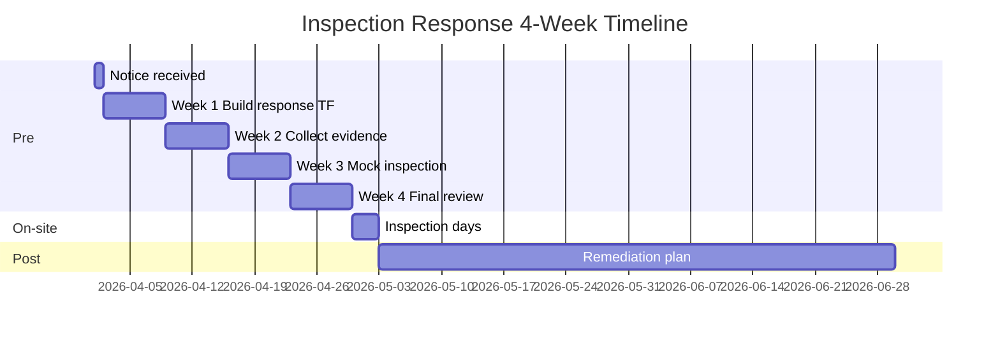
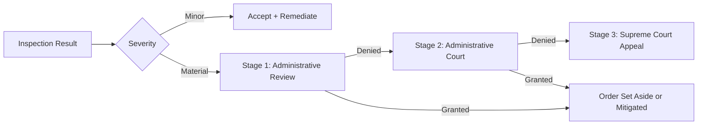

# Inspection Response — English Summary

> English summary of the Korean inspection response workbook ([901 lines, `../notes/5-compliance/inspection-response.md`](../notes/5-compliance/inspection-response.md)). How a Korean VASP prepares for and responds to KoFIU (FIU) and FSS on-site inspections. Reference date: 2026-04.

---

## TL;DR

- **Inspectors**: KoFIU (AML), FSS (user protection and prudential), FSC (policy). DAXA conducts informal peer reviews.
- **Frequency**: annual comprehensive inspection plus ad hoc.
- **Preparation window**: typically 2-4 weeks after notice; on-site portion is 1-2 days.
- **Core deliverables**: self-assessment report, 40-60 evidentiary documents, FAQ responses.
- **Top failure modes**: missing documents, number mismatches, tipping-off, AMLO absence, unremediated prior findings.

---

## 1. Inspection Types

| Type | Notice | Duration | Document Requests | Interviews | Penalty Likelihood |
|---|---|---|---|---|---|
| Comprehensive (annual) | D-30 | 4-5 days | 50+ | 8-10 people | Medium |
| Thematic (specific scope) | D-14 | 2-3 days | 20-30 | 3-5 people | Medium |
| Ad hoc / emergency | No advance notice | 1-2 days | 10+ | 2-3 people | High |

**Statutory basis**:

- Tukgeumbeop §15: KoFIU inspection authority
- Tukgeumbeop §16: authority to demand document production
- VAUPA §13-14: FSS inspection authority
- FSC Establishment Act §17: FSC supervisory authority

---

## 2. 4-Week Preparation Timeline

### Immediate actions (within 24 hours of notice)

- Brief the CEO, board, and audit committee.
- AMLO convenes the response task force (TF).
- Put external counsel on standby (especially for comprehensive inspections).
- Archive the original notice with chain-of-custody controls.

### Week 1 — Team Formation (D-30 to D-22)

Build the TF: AMLO (lead) plus operations head, legal, and IT. Secure a dedicated war-room, define communication policy, and review prior-year findings.

### Week 2 — Evidence Collection (D-21 to D-14)

First-pass collection of 40-60 requested items. Apply the 40-item self-assessment checklist. Cross-check key numbers (STR counts, volumes, account totals) against a **single source of truth** (typically an SQL-backed report).

### Week 3 — Mock Inspection (D-14 to D-7)

External counsel runs a half-day mock inspection. Prepare FAQ responses and simulate 30-minute AMLO, analyst, and IT interviews.

### Week 4 — Final Review (D-7 to D-0)

Submit documents D-3 or D-1. Final AMLO briefing of all staff. Prepare the physical environment, access badges, and the system demo setup.

### On-site days (D-day to D+2)

- Daily 17:00 debrief with the TF.
- Maintain a clean-desk policy in any area the inspectors can see.
- Track all supplementary document requests; respond within 24 hours.

### Post-inspection (D+3 to D+60)

- Receive inspection opinion (D+30 to D+60).
- Submit remediation plan within 60 days.
- Quarterly progress reports until closed.
- Run an internal lessons-learned session before disbanding the TF.

---

## 3. 40-Item Self-Assessment Checklist (7 Categories)

| # | Category | Items | Focus |
|---|---|---|---|
| A | Registration and Licensing | 5 | FIU certificate, ISMS, real-name bank contract, major shareholder filing, articles of incorporation |
| B | AMLO and Governance | 6 | AMLO appointment with 3+ years experience, board reporting, internal controls, annual training |
| C | KYC / CDD / EDD | 7 | KYC policy, real-name verification, risk tiers, EDD triggers, non-face-to-face verification, PEP screening, profile refresh |
| D | KYT and Transaction Monitoring | 8 | KYT vendor contracts, rule catalog, alert SLAs, false-positive management, rule committee minutes, blacklist management |
| E | STR / CTR / Reporting | 6 | STR submission records, 7-section template compliance, tipping-off controls, CTR records, FIU-TIS access logs |
| F | Sanctions Screening | 4 | OFAC SDN daily refresh, UN/EU/KR lists, wallet screening, potential-match disposition |
| G | Travel Rule | 4 | Vendor contract, IVMS101 quality logs, sunrise policy, PIPA compliance |

**Scoring**: each item is marked Complete / Partial / Deficient. Three or more deficient items triggers an emergency TF meeting.

Full Korean checklist: [`../notes/5-compliance/inspection-response.md`](../notes/5-compliance/inspection-response.md) §3.

---

## 4. Mandatory Documents (~40 total)

Grouped into three sets:

1. **Policies and SOPs (10 documents)**: AML policy, KYC/CDD SOP, EDD SOP, KYT operations SOP, STR SOP, sanctions screening SOP, Travel Rule SOP, tipping-off control SOP, user protection policy, board AML reporting SOP.

2. **Evidentiary records (20 documents)**: FIU registration certificate, ISMS certificate, real-name bank contract, AMLO appointment, board minutes (AML-related), independent audit reports, training records, vendor contracts (KYC, KYT, Travel Rule), external audit of asset segregation, Proof of Reserves (PoR), monthly alert / false-positive reports, rule committee minutes, STR records, sanctions screening logs, IVMS101 quality logs, risk tier distribution report, escalation records, prior-year remediation progress.

3. **Incident records (10 documents)**: hacking and fraud response, large STR cases, suspected sanctions violations, complaints, service suspensions, investigation cooperation, press handling, user notices, system outages, foreign VASP cooperation.

Every document is assigned a unique ID (`POL-001`, `EVD-001`, `INC-001`) so inspectors can request artifacts by reference.

---

## 5. FAQ — Frequent Inspector Questions

### Q1. "Why is your STR count low relative to peers?"

Frame: customer mix (institutional / B2B skew lowers false positives), KYT and EDD prevention at entry, STR quality policy (low rejection rate). Support with year-over-year STR trend, rejection rates, and EDD denial statistics.

### Q2. "Why is a Tornado Cash interaction address still blocked?"

Frame: independent risk assessment under Tukgeumbeop §5-2, past money-laundering risk persists, compliance with DAXA joint guideline. Support with an internal Tornado risk memo, DAXA communications log, and a published unblocking-appeal SOP.

### Q3. "How do you evidence 80/20 user asset segregation?"

Frame: quarterly external audit, disclosed multi-sig cold wallet addresses, PoR Merkle tree reconciling internal ledger to on-chain balances. Support with Big 4 or designated auditor opinion and a signed multi-sig address list.

### Q4. "Does the AMLO have sufficient authority?"

Frame: organization chart showing direct CEO / board reporting line, explicit transaction-stop authority in the SOP, compensation at top-executive tier, attendance at every board meeting. Support with appointment letter, delegation rules, board attendance records, D&O insurance policy.

### Q5. "How are monitoring rules maintained?"

Frame: monthly rule committee (AMLO + analytics lead + KYT engineer + legal), quantitative tuning based on alert and false-positive data, board reporting for major changes, full version control. Support with 12 months of rule committee minutes and a Git or Jira change log.

### Q6. "Can you describe a specific large STR case?"

**Critical**: never disclose a specific case ID or customer ID orally. Tipping-off risk. Respond with a **process** description (alert → EDD → AMLO sign-off → FIU submission), and offer a written follow-up if the inspector insists.

### Q7. "How reliable is your non-face-to-face identity verification?"

Frame: API integration with licensed identity verification institutions (KCB, NICE, KOMSCO-linked PASS), video-call recording with face matching, annual fraud statistics.

### Q8. "Has any employee contacted a customer after an STR was filed?"

Frame: tipping-off SOP with automatic masking of STR-subject customer IDs in CS tickets, dedicated tipping-off training module, no prior violations (or documented remediation).

---

## 6. Common Failures — Top 5 (plus 7 extended patterns)

1. **Late document submission** — even one day of delay incurs a penalty.
2. **Number inconsistencies** — STR count in the report differs from the underlying database.
3. **Tipping-off** — CS staff casually tells a customer the account is frozen because of an STR.
4. **AMLO absence** — AMLO on travel on inspection day without a pre-designated deputy.
5. **Unremediated prior findings** — the same deficiency cited two years in a row.

Extended patterns:

- **Demo failure** — KYT dashboard errors out during the live demo (solution: dry-run rehearsal plus backup screenshots).
- **Interview contradiction** — AMLO and analyst give opposite answers to the same question (solution: unified answer guide plus mock inspection).

**Peer benchmarks that inspectors reference**: annual STR count per trading volume, EDD coverage ratio, alert-to-STR conversion rate, average AMLO processing time, and false-positive rate (industry average 90%+). Reporting significantly below peers invites scrutiny.

---

## 7. Post-Inspection Remediation

### Finding severity tiers

| Tier | Meaning | Response Deadline |
|---|---|---|
| Recommendation | Room for improvement | 6 months |
| Finding | Potential violation | 3 months |
| Warning | Material violation | 1 month + administrative fine likely |

### Remediation plan requirements

Specific, measurable, time-bound. Owner assigned (AMLO accountable). Board-approved. Monthly internal progress reporting plus quarterly reporting to the supervisor.

### Administrative fines

- **Range**: KRW 10 million to 100 million+ under Tukgeumbeop §20.
- **Pre-decision comment**: 14-day right-of-reply under the enforcement decree of §20.
- **Appeal**: 60 days to file administrative review (see §8 below).

---

## 8. Appeals Process — 3 Stages

### Stage 1 — Administrative Review (행정심판)

- **Basis**: Administrative Basic Act §28-29, Administrative Appeals Act.
- **Filing deadline**: 90 days from notice of the disposition.
- **Forum**: FSC Administrative Appeals Committee (for FSC actions) or the KoFIU Commissioner (for FIU actions).
- **Processing period**: 60 days, extendable by 30.
- **Historical grant rate in Korean financial cases**: approximately 10-20% (mostly denial or partial mitigation).
- **Important**: filing does not stay enforcement by itself. Fines are typically paid first and refunded if the appeal succeeds.

### Stage 2 — Administrative Court (행정소송)

- **Basis**: Administrative Litigation Act §19 (cancellation suit).
- **Filing deadline**: 90 days from the administrative review decision, or 90 days from the original disposition if the review stage is skipped.
- **Forum**: Seoul Administrative Court.
- **Types**: cancellation suit (most common), nullity confirmation, unlawful-inaction confirmation.
- **Processing period**: typically 1-2 years.
- **Historical grant rate**: roughly 15-25% based on 2024 court statistics.
- **Stay of enforcement**: separately available via a preliminary injunction motion.

### Stage 3 — Supreme Court

- **Nature**: legal review only. No factual reargument.
- **Summary dismissal rate**: 70%+.
- **Crypto precedent**: very limited — the industry's history in Korea is still too short for a deep body of case law.

### Negotiated settlement

Korea has no formal consent-decree mechanism analogous to the US BSA settlements (for example, the Binance USD 4.3B settlement). In practice, Korean VASPs can sometimes reduce severity through:

- Demonstrated voluntary remediation during or after the inspection.
- Voluntary self-reporting before a formal disposition issues.
- Joint industry statements via DAXA.

### Practical recommendation

- **Minor findings**: accept and remediate.
- **Medium fines (under KRW 50M)**: attempt voluntary self-report closure.
- **Major actions (KRW 100M+, license suspension, deregistration)**: administrative review is effectively mandatory with a top law firm.
- **Business-critical actions**: file administrative review plus a preliminary injunction.

The goal is typically **severity mitigation, not outright victory**.

---

## Further Reading

- Full Korean workbook (901 lines, with all templates): [`../notes/5-compliance/inspection-response.md`](../notes/5-compliance/inspection-response.md)
- Korean AML overview: [`korea-aml-overview.md`](korea-aml-overview.md)
- Regulatory comparison: [`regulatory-comparison.md`](regulatory-comparison.md)
