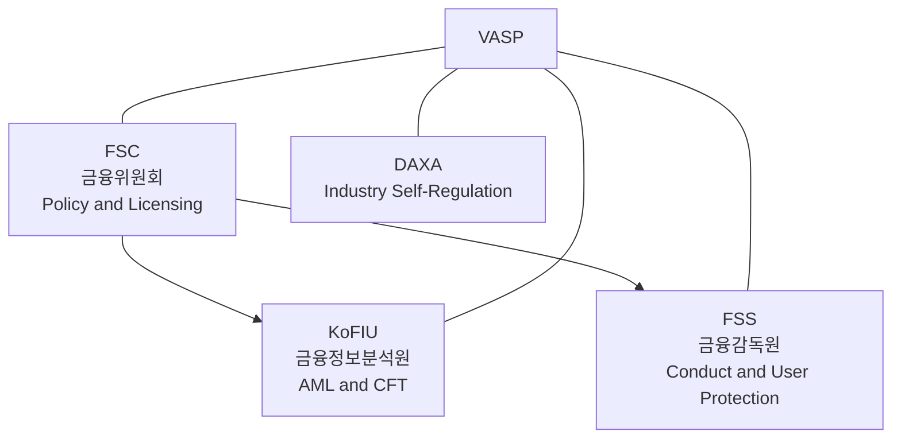
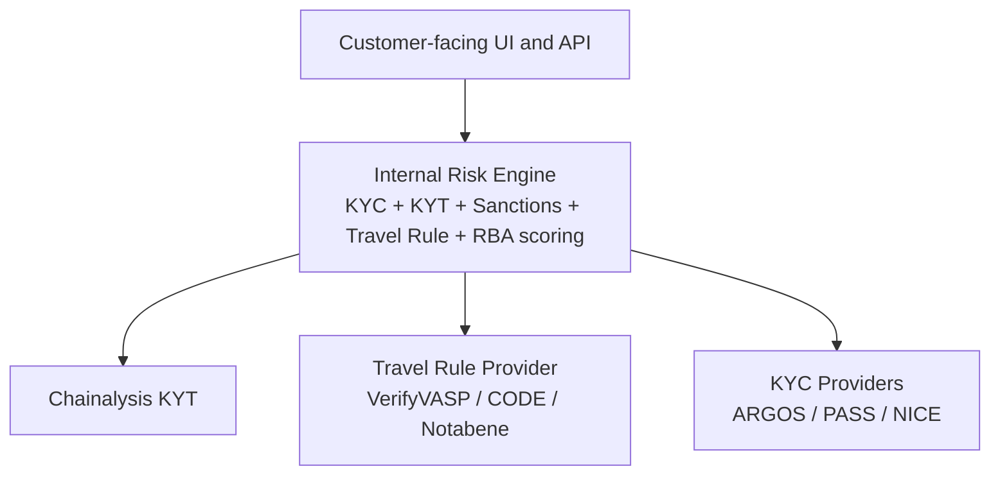

# Korean AML for Virtual Assets — Comprehensive Overview

> A complete map of how Korea regulates AML for virtual asset service providers (VASPs), as of April 2026. Written for international audiences evaluating Korean market entry or benchmarking against other jurisdictions.

---

## TL;DR

- **Two laws**: 特金法 / 특금법 (Tukgeumbeop, AML-focused) and 가상자산이용자보호법 (Virtual Asset User Protection Act).
- **Regulators**: KoFIU (FIU) for AML, FSS for prudential and user-protection supervision, FSC for policy and licensing.
- **Market**: 5 KRW-fiat licensed exchanges (DAXA members), approximately USD 2 trillion in annual trading volume (industry estimate).
- **Travel Rule threshold**: KRW 1,000,000 (about USD 700) per transfer.
- **Mandatory**: ISMS certification, real-name banking partnership, AMLO appointment.
- **2026-01 change**: Enhanced major shareholder review adds roughly 3-6 months to M&A timelines.
- **Inspections**: Annual FIU and FSS on-site reviews; 4-week preparation is standard.

---

## 1. Two Laws, Two Different Purposes

Korean crypto AML rests on **two separate statutes** that a VASP must comply with simultaneously.

### 1.1 특금법 (Tukgeumbeop / Specified Financial Information Act)

- Full Korean name: 특정 금융거래정보의 보고 및 이용 등에 관한 법률
- English short name: Specified Financial Information Act
- **Purpose**: AML, CFT (counter-terrorist financing), and sanctions screening.
- **Key sections**:
  - §5-2: KYC and customer due diligence
  - §5-3: Suspicious transaction reports (STR) and recordkeeping
  - §5-4: Recordkeeping (5 years)
  - §7: VASP registration requirements
  - §15: KoFIU on-site inspection authority
  - §20: Administrative fines
- **Original Korean source**: [`../notes/2-regulations/korea-fiu-act.md`](../notes/2-regulations/korea-fiu-act.md)

### 1.2 가상자산이용자보호법 (Virtual Asset User Protection Act)

- English short name: VAUPA or User Protection Act.
- **Effective**: 2024-07-19.
- **Purpose**: user asset segregation, market manipulation prevention, insurance.
- **Key sections**:
  - §6: User asset segregation (at least 80% in cold storage)
  - §10: Market manipulation prohibition (insider trading, wash trades, price manipulation)
  - §11: Transaction recordkeeping (15 years)
  - §13-14: FSS inspection authority
- **Original Korean source**: [`../notes/2-regulations/korea-user-protection.md`](../notes/2-regulations/korea-user-protection.md)

### Why Two Laws?

- **Tukgeumbeop** is the "AML toolkit" — descended from FATF obligations, administered by KoFIU.
- **VAUPA** is the "consumer protection toolkit" — conceptually closer to securities regulation, administered primarily by the FSS.

A Korean VASP is subject to both simultaneously. Compliance teams typically map controls against both laws in a single internal framework.

---

## 2. Regulators — Three-Headed Structure

- **FSC (Financial Services Commission, 금융위원회)**: the top policy body. Approves VASP registrations and issues regulations.
- **KoFIU (Korea Financial Intelligence Unit, 금융정보분석원)**: AML enforcement. Receives STRs, runs on-site inspections, and issues administrative fines.
- **FSS (Financial Supervisory Service, 금융감독원)**: prudential and conduct oversight. Inspects user-protection compliance under VAUPA.
- **DAXA (Digital Asset eXchange Association)**: industry self-regulator. Voluntary, but practically a quasi-license — non-members are excluded from mainstream KRW banking.

---

## 3. The "Big 4" Korean Exchanges

The Korean retail crypto market is dominated by four exchanges with KRW (won) trading pairs, plus GOPAX as a smaller fifth DAXA member.

| Exchange | Bank Partner | KYT Stack | Travel Rule |
|---|---|---|---|
| **Upbit** (Dunamu) | K-Bank | Lambda256 VerifyVASP + Chainalysis | VerifyVASP primary |
| **Bithumb** | NH NongHyup | Chainalysis + CODE | CODE primary |
| **Coinone** | Kakao Bank | Chainalysis + CODE | CODE primary |
| **Korbit** | Shinhan Bank | Chainalysis | CODE |
| **GOPAX** | Jeonbuk Bank | Chainalysis | CODE |

**Estimated market share (2026-Q1)**:

- Upbit: 70-80% of KRW volume
- Bithumb: 10-15%
- Coinone: 3-5%
- Korbit: 1-2%
- Others: about 5%

---

## 4. DAXA — Self-Regulation That Acts Like a License

**DAXA** (Digital Asset eXchange Association, 디지털자산거래소 공동협의체):

- Founded 2022-06 after the Terra-LUNA collapse.
- Members: the five KRW-fiat exchanges listed above.
- **Legal status**: voluntary association, no statutory enforcement power.
- **Practical effect**: a de facto quasi-license. Non-membership effectively means exclusion from the Korean retail market.
- **Functions**:
  - Joint listing review standards (common screening of new tokens)
  - Shared blacklist of suspicious wallet addresses
  - Crisis response and coordinated policy (for example, the Tornado Cash response in 2025-03)
  - Industry-wide advocacy with the FSC and KoFIU

---

## 5. VASP Registration — 6 Requirements

To operate as a VASP in Korea, a company must register with KoFIU under Tukgeumbeop §7. Required elements:

1. **ISMS certification** (Information Security Management System), issued by KISA.
2. **Real-name banking partnership** — a contract with a Korean bank for customer KRW deposit-withdrawal accounts matched to verified real names.
3. **AML/CFT internal control system** — written policies, procedures, and SOPs.
4. **AMLO designation** — a senior executive with at least 3 years of relevant experience, reporting directly to the board.
5. **Disqualification screening** — no major criminal or regulatory violations by directors or controlling shareholders.
6. **(Added 2026-01) Enhanced major shareholder review** — detailed financial, criminal, and AML history check of the beneficial owners.

---

## 6. Travel Rule — KRW 1M Threshold

- **Threshold**: KRW 1,000,000 (about USD 700) per virtual asset transfer.
- **Standard**: IVMS101 (FATF Recommendation 16).
- **Korean providers**:
  - **VerifyVASP** — built by Lambda256 (Dunamu subsidiary).
  - **CODE** — a consortium originally led by Bithumb, Coinone, and Korbit.
- **Counterparty handling**:
  - Members of Korean consortia: instant IVMS exchange via VerifyVASP or CODE.
  - Global VASPs: typically bridged via Notabene Gateway or direct bilateral connections.
  - Self-hosted (unhosted) wallets: additional KYC extension per FATF R.16 2025-06 guidance update.
- **Sunrise rate**: an estimated 5-15% of cross-border transfers still involve non-compliant or out-of-scope counterparties.

---

## 7. KYT Stack — What Korean Exchanges Actually Run

A typical Korean VASP technology stack:

- **KYC**: mandatory integration with Korean identity verification providers (PASS, NICE, KCB).
- **KYT**: Chainalysis is dominant (roughly 95%+ of Big 4 usage).
- **Travel Rule**: Korean consortia for domestic traffic, Notabene for global.
- **Risk Engine**: proprietary, integrating all of the above signals for unified risk scoring.

For vendor details, see [`../notes/7-vendors/korea-solutions.md`](../notes/7-vendors/korea-solutions.md).

---

## 8. Inspections — Annual Plus Ad Hoc

Korean VASPs face multiple overlapping supervisory reviews:

- **Annual KoFIU inspection** — 4-5 days, comprehensive AML scope.
- **Annual FSS inspection** — 3-4 days, user-protection focus under VAUPA.
- **Ad hoc inspections** — triggered by incidents, complaints, or large STR patterns.
- **DAXA peer reviews** — informal but influential.

Standard preparation time is 4 weeks. See [`inspection-response-summary.md`](inspection-response-summary.md) for the detailed workbook summary.

---

## 9. 2026 Key Changes

- **2026-01-29**: Tukgeumbeop amendment — enhanced major shareholder review in force.
- **Mid-2026 (expected)**: KoFIU guideline update addressing FATF R.16 2025-06 changes (self-hosted wallet handling).
- **Later in 2026 (planned)**: staking service guideline. None of the Big 4 currently offers staking for Korean retail customers because of legal uncertainty under VAUPA §10.
- **Reference date for this document**: 2026-04.

---

## 10. Comparison to Other Jurisdictions

For a detailed comparison, see [`regulatory-comparison.md`](regulatory-comparison.md).

Quick summary:

- **vs United States (FinCEN / BSA)**: Korea is more centralized and administrative; the US is more litigation-driven and state-fragmented (MTL regime).
- **vs EU (MiCA / AMLR)**: Korea has a simpler statutory structure; the EU is more comprehensive and harmonized across 27 member states.
- **vs Singapore (MAS)**: Korea has stricter AMLO requirements; Singapore has stricter licensing gating (PSA Major Payment Institution).
- **vs Japan (FSA)**: both are registration-based; Japan's token whitelisting (via JVCEA) is more restrictive than Korea's DAXA screening.

---

## Further Reading (Korean)

For deep dives, consult the Korean primary notes:

- [`../notes/2-regulations/korea-fiu-act.md`](../notes/2-regulations/korea-fiu-act.md) — Tukgeumbeop article-by-article
- [`../notes/2-regulations/korea-user-protection.md`](../notes/2-regulations/korea-user-protection.md) — VAUPA
- [`../notes/5-compliance/inspection-response.md`](../notes/5-compliance/inspection-response.md) — Inspection workbook (901 lines)
- [`../notes/7-vendors/korea-solutions.md`](../notes/7-vendors/korea-solutions.md) — Korean infrastructure providers
- [`../notes/3-crypto-aml/`](../notes/3-crypto-aml/) — Crypto-specific AML topics
- [`../notes/glossary.md`](../notes/glossary.md) — Korean-English glossary

## External References

- [KoFIU official site](https://www.kofiu.go.kr/)
- [FSS official site](https://www.fss.or.kr/)
- [FSC official site](https://www.fsc.go.kr/)
- [DAXA statements](https://www.daxa.or.kr/)
- [FATF R.15 and R.16](https://www.fatf-gafi.org/en/topics/virtual-assets.html)
