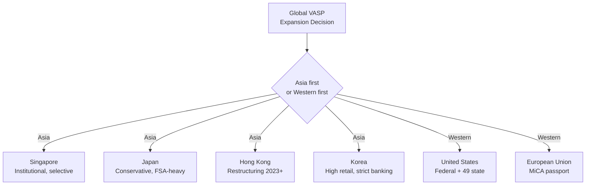

# Regulatory Comparison — Korea vs US vs EU vs Asia

> Cross-jurisdictional comparison of crypto AML regimes as of April 2026. Korea (KR) versus United States (US), European Union (EU), and four Asia-Pacific peers (Singapore, UAE, Japan, Hong Kong). Based on the Korean deep notes in [`../notes/2-regulations/`](../notes/2-regulations/).

---

## 1. Side-by-Side Summary

| Dimension | Korea | United States | EU | Singapore | UAE (VARA) | Japan | Hong Kong |
|---|---|---|---|---|---|---|---|
| **Primary AML law** | Tukgeumbeop (特金法) | BSA / FinCEN | AMLR + MiCA | PSA + FSMA | VARA Regs + CBUAE | PSA + FIEA | AMLO + VASP regime |
| **Regulator** | KoFIU | FinCEN (fed) + state MTL | EU AMLA (2025+) + NCAs | MAS | VARA (Dubai) + CBUAE | FSA / JFSA + JVCEA | SFC + HKMA |
| **VASP licensing model** | KoFIU registration | FinCEN MSB + 49 state MTLs | MiCA CASP + AMLR CASP | PSA Major Payment Institution | VARA full license | FSA Type-1 crypto | SFC Type 7 + VATP license |
| **Travel Rule threshold** | KRW 1M (~USD 700) | USD 3,000 | EUR 1,000 (moving to EUR 0 under AMLR) | SGD 1,500 | USD 1,000 | JPY 100,000 (~USD 700) | HKD 8,000 |
| **Cold storage mandate** | 80%+ (VAUPA §6) | None at federal level | Industry standard, not statutory | MAS risk-based | VARA prescriptive | 95%+ (FSA guidance) | SFC 98% requirement |
| **Self-hosted wallet handling** | Additional KYC (FATF R.16 2025-06) | Varies by state | AMLR extends KYC to unhosted transfers | MAS Notice PS-N02 | VARA Rulebook | JVCEA guideline | SFC restricts |
| **Sanctions enforcement** | OFAC-aligned via MOFA, plus UN / EU lists | OFAC SDN (aggressive) | EU consolidated list | MAS Targeted Financial Sanctions | UAE FCCU | MOFA-JAFIC | HKMA + SFC |
| **Administrative fines (max)** | KRW 100M+ per violation | Unlimited (BSA civil + criminal) | Up to 10% group turnover | SGD 1M+ | AED 50M+ | JPY 300M+ | HKD 10M+ |
| **M&A shareholder review** | Enhanced (2026-01) | Federal plus state notice | MiCA qualifying-holding test | MAS approval required | VARA approval | FSA approval | SFC approval |

See the Korean notes for full details: [`../notes/2-regulations/korea-fiu-act.md`](../notes/2-regulations/korea-fiu-act.md), [`us-bsa-fincen.md`](../notes/2-regulations/us-bsa-fincen.md), [`eu-mica-amlr.md`](../notes/2-regulations/eu-mica-amlr.md), [`asia-regs.md`](../notes/2-regulations/asia-regs.md).

---

## 2. Licensing Models — Comparative View

### Korea — Registration with Substantive Gates

Korea's model looks like a registration on paper but operates as a substantive license because:

- ISMS certification is expensive and time-consuming (typically 6-12 months).
- A real-name banking partnership is a de facto gatekeeper controlled by the banks.
- Post-2026-01, major shareholder review adds 3-6 months to any M&A.

**Typical timeline for a new VASP registration**: 12-18 months.

### United States — Dual-Track Federal and State

- Federal: FinCEN MSB registration is a form-filing exercise.
- State: Money Transmitter Licenses (MTL) in up to 49 states. This is the actual barrier.
- **Typical timeline for full US coverage**: 18-36 months and USD 5-20M in surety bonds plus legal fees.

### EU — MiCA Passporting

- MiCA CASP (Crypto-Asset Service Provider) authorization is issued by a single National Competent Authority (NCA) and passports across 27 member states.
- AMLR (AML Regulation) applies directly as of 2027.
- **Typical timeline**: 6-12 months in a single NCA (Malta, Germany, or France are the most common choices).

### Singapore — MAS Licensing

- Payment Services Act (PSA) Major Payment Institution license covers Digital Payment Token (DPT) services.
- MAS is famously selective; rejection rates have been high since 2022.
- **Typical timeline**: 12-24 months.

### Korea vs Peers — Key Differentiators

- Korea's **real-name banking partnership** requirement has no direct analog anywhere else. It effectively gives Korean banks veto power over VASP market entry.
- Korea's AMLO experience requirement (3+ years) is stricter than Singapore (MAS approves case-by-case without a fixed minimum) or Japan (general "fit and proper").

---

## 3. Travel Rule — Thresholds and Architecture

| Jurisdiction | Threshold | Protocol | Unhosted wallets |
|---|---|---|---|
| Korea | KRW 1M | IVMS101 via VerifyVASP / CODE | Additional KYC |
| United States | USD 3,000 | TRUST, Sygna, Notabene | Mostly permissive |
| EU (AMLR) | EUR 0 (full coverage) | Protocol-neutral | Mandatory KYC |
| Singapore | SGD 1,500 | IVMS101 via Notabene, Sumsub | Risk-based |
| UAE | USD 1,000 | IVMS101 | VARA-specified |
| Japan | JPY 100,000 | IVMS101 via TRC / Notabene | JVCEA guideline |
| Hong Kong | HKD 8,000 | IVMS101 | SFC restricts |

**Observation**: Korea's KRW 1M threshold is the lowest-equivalent among major jurisdictions. The EU's AMLR (effective 2027) will go even lower — zero threshold for crypto transfers.

For the Korean Travel Rule ecosystem, see [`../notes/7-vendors/travel-rule-vendors.md`](../notes/7-vendors/travel-rule-vendors.md).

---

## 4. Cold Storage and User Asset Segregation

- **Korea (VAUPA §6)**: at least 80% of user assets in cold storage; quarterly external audit; PoR (Proof of Reserves) expected by practice.
- **United States**: no federal mandate. Individual states (NY DFS BitLicense) and SEC for registered entities impose partial requirements.
- **EU (MiCA)**: segregation of client assets with bankruptcy remoteness; no fixed cold-storage percentage.
- **Singapore (MAS PS-N02)**: risk-based segregation. MAS 2023 guidance pushed toward 90% cold storage.
- **UAE (VARA)**: detailed rulebook specifies wallet architecture.
- **Japan (FSA)**: 95% cold storage guidance since 2018 post-Coincheck hack.
- **Hong Kong (SFC)**: 98% cold storage for VATP (Virtual Asset Trading Platform) licensees — the strictest globally.

**Implication**: Korea's 80% is moderate. A Hong Kong-licensed platform already exceeds the Korean standard.

---

## 5. Sanctions Enforcement — Posture Comparison

| Jurisdiction | Primary List | Enforcement Posture | Notable Case |
|---|---|---|---|
| United States | OFAC SDN | Aggressive, extraterritorial | Binance USD 4.3B (2023), OKX USD 504M (2025) |
| EU | Consolidated List | Institutional, steady | Tornado Cash sanctions (2022) |
| Korea | MOFA-published UN + independent list | Administrative | Few public crypto-sanctions cases |
| Singapore | MAS TFS | Measured | No major crypto-sanctions case |
| UAE | UAE FCCU | Rising | VARA enforcements starting 2024 |
| Japan | MOFA | Conservative | Limited |
| Hong Kong | HKMA / SFC | Moderate | No major crypto case yet |

Korea relies on **OFAC alignment without US extraterritorial reach**, so Korean VASPs effectively implement OFAC SDN controls while being judged by KoFIU.

For Korean sanctions screening details, see [`../notes/5-compliance/sanctions-screening.md`](../notes/5-compliance/sanctions-screening.md).

---

## 6. STR Architecture

| Jurisdiction | Report Name | Filing Window | FIU | Tipping-off Standard |
|---|---|---|---|---|
| Korea | STR | "Promptly" (typically 30 days) | KoFIU | Strict, criminal sanction possible |
| United States | SAR | 30 days (extendable to 60) | FinCEN | Strict |
| EU | STR | Without delay | National FIUs + EU AMLA | Strict |
| Singapore | STR | As soon as practicable | STRO | Strict |
| Japan | STR | Promptly | JAFIC | Strict |
| Hong Kong | STR | As soon as practicable | JFIU | Strict |

See Korean STR details: [`../notes/5-compliance/str-ctr.md`](../notes/5-compliance/str-ctr.md).

---

## 7. Decision Matrix — Global Expansion Sequencing

For a global VASP choosing its next jurisdiction, a rough sequencing matrix:

### When does Korea make sense?

- Your business targets **retail Korean won volume** — the market is one of the top 3 globally in KRW-fiat crypto liquidity.
- You can commit to an **ISMS track plus real-name bank partnership** effort of 12-18 months.
- You have local leadership capable of passing the AMLO 3+ year experience bar.

### When is Korea a poor first choice?

- Institutional-only businesses: Singapore or Hong Kong VATP regimes are more streamlined.
- Stablecoin issuers: MiCA provides clearer rules (Title III / IV of MiCA).
- Staking or lending platforms: Korea currently lacks a guideline, creating uncertainty.

---

## 8. Observations for International Readers

1. **Korea's AML is more administrative than litigative.** There is no Korean equivalent of the US "consent decree" settlement. Most disputes are resolved through administrative review rather than public court proceedings.

2. **Banking access is Korea's unique gatekeeper.** No other major jurisdiction ties VASP viability to a specific named bank contract.

3. **DAXA is a soft-power layer unique to Korea.** Comparable industry associations exist (JVCEA in Japan), but DAXA's coordination with regulators on listing and on blacklist sharing is unusually tight.

4. **User protection and AML are separately legislated in Korea.** The US, EU, and Singapore generally bundle conduct and AML supervision in one statute or authority; Korea splits them between VAUPA (FSS) and Tukgeumbeop (FIU).

5. **The KRW 1M Travel Rule threshold predates FATF consensus.** Korea implemented it in 2022 when most peers were still at higher thresholds.

---

## Further Reading

- Korean overview: [`korea-aml-overview.md`](korea-aml-overview.md)
- Korean inspection workbook summary: [`inspection-response-summary.md`](inspection-response-summary.md)
- Korean FIU Act deep note: [`../notes/2-regulations/korea-fiu-act.md`](../notes/2-regulations/korea-fiu-act.md)
- US BSA and FinCEN: [`../notes/2-regulations/us-bsa-fincen.md`](../notes/2-regulations/us-bsa-fincen.md)
- EU MiCA and AMLR: [`../notes/2-regulations/eu-mica-amlr.md`](../notes/2-regulations/eu-mica-amlr.md)
- Asia-Pacific regulations: [`../notes/2-regulations/asia-regs.md`](../notes/2-regulations/asia-regs.md)
- FATF standards: [`../notes/2-regulations/fatf.md`](../notes/2-regulations/fatf.md)
