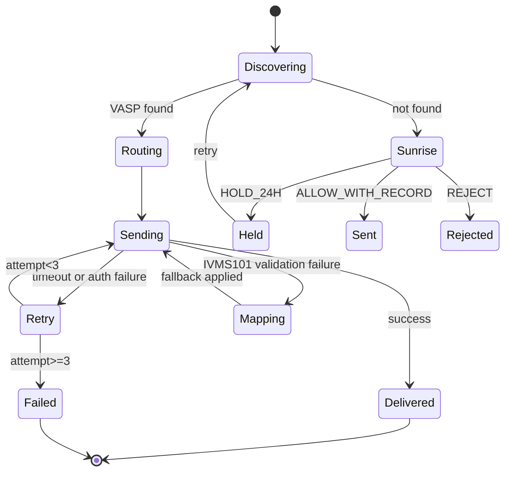

# Travel Rule — Korean VASP Perspective

> How Korean VASPs implement FATF Recommendation 16 (the Travel Rule). Covers the legal basis under Tukgeumbeop, the 1M KRW threshold, the IVMS101 standard with Korea-specific fields, the two domestic consortia (VerifyVASP and CODE), and global routing through Notabene Gateway. Derived from the Korean source notes in [`../notes/3-crypto-aml/travel-rule.md`](../notes/3-crypto-aml/travel-rule.md), [`../notes/4-technology/travel-rule-protocols.md`](../notes/4-technology/travel-rule-protocols.md), and [`../notes/2-regulations/korea-fiu-act.md`](../notes/2-regulations/korea-fiu-act.md). Reference date: 2026-04.

## TL;DR

- **Threshold**: KRW 1,000,000 (about USD 700) per transfer. Set by FIU notice under Tukgeumbeop enforcement decree §10-10.
- **Standard**: IVMS101 (FATF Recommendation 16). Every major protocol uses IVMS101 as its JSON payload.
- **Korean consortia**: VerifyVASP (Lambda256, affiliated with Dunamu/Upbit) + CODE (Big 4 joint venture of Bithumb, Korbit, Coinone).
- **Global routing**: Notabene Gateway bridges multiple protocols (TRISA, TRP, VerifyVASP, CODE) for cross-border interop.
- **Sunrise rate**: Approximately 5-15% of cross-border transfers still involve non-compliant or out-of-scope counterparties.

---

## 1. Legal Basis — Tukgeumbeop §5-3

- Statutory basis: Tukgeumbeop §5-2 + enforcement decree §10-10
- FIU notice sets the KRW 1M threshold
- Effective date in Korea: 2022-03-25

### Who has what obligation

When a VASP transfers virtual assets **to another VASP** and the amount is at least KRW 1,000,000, it must transmit originator and beneficiary information to the receiving VASP.

### Fields required under Korean law

Originator (sender):
- Name
- Virtual asset address
- National ID or a combination of name + physical address

Beneficiary (receiver):
- Name
- Virtual asset address

Korea requires **fewer fields than FATF** because of tension with the Personal Information Protection Act (PIPA). The EU TFR is the strictest regime and requires everything.

### Sanctions for non-compliance

- **Business correction order** — minor violation
- **Partial or full business suspension** — material violation (for example, Travel Rule system long-term non-functional)
- **Administrative fine** — KRW 10M - 100M+ under Tukgeumbeop §20
- **Registration cancellation** — exceptional cases

---

## 2. IVMS101 — Korea-specific Field Requirements

The FATF-endorsed JSON schema for Travel Rule messages. Every Korean protocol uses IVMS101 as the payload; jurisdictional differences live in the validator rules.

### Required or hashed fields for Korean messages

```python
JURISDICTION_RULES_KR = {
    "originator.name.nameIdentifier": REQUIRED,   # Hangul + Latin transliteration pair
    "originator.geographicAddress": REQUIRED,     # Above 1M KRW threshold
    "originator.nationalIdentification": HASHED,  # PIPA compliance, never in cleartext
    "originator.dateOfBirth": OPTIONAL,
    "beneficiary.name.nameIdentifier": REQUIRED,
    "beneficiary.accountNumber": REQUIRED,        # wallet address
}
```

### Korea-specific cross-field validation

Korean names are expected to be in **both Hangul and Latin** form. Validator logic typically enforces:

```python
def validate_kr_name(name: str) -> bool:
    return has_hangul(name) and has_latin(name)
```

### Why national IDs must be hashed

PIPA prohibits transmitting Korean Resident Registration Numbers (주민등록번호) in cleartext across organizations. Travel Rule messages therefore carry SHA-256 hashes of the national ID, never the raw number. The receiving VASP re-hashes its own record and compares.

### Jurisdictional differences (why cross-border is hard)

| Field | Korea | EU (TFR) | US (FinCEN) |
|---|---|---|---|
| Name | Required | Required | Required |
| Address | Required (above threshold) | Required | Required above USD 3,000 |
| Date of birth | Optional | Required | Optional |
| Place of birth | Optional | Required | Optional |
| National ID | Hashed | Required | Optional |
| Customer number | Optional | Required | Required |

Korea -> EU transfers fail most often at the **date of birth** field. Korean messages frequently omit it; EU validators reject on that alone.

---

## 3. Korean Consortia

### VerifyVASP

- Operator: Lambda256 (Dunamu subsidiary) + Chainalysis
- Anchor member: Upbit
- Wider membership: 200+ global VASPs (Bybit, OKX, Crypto.com partially)
- Model: closed consortium + REST API + IVMS101
- Strength: global reach, English documentation mature

### CODE

- Operator: CODE joint venture (equal equity: Bithumb, Korbit, Coinone)
- Anchor members: Bithumb, Korbit, Coinone
- Wider membership: domestic small-to-mid VASPs
- Model: closed consortium + REST API + IVMS101
- Strength: optimized for the KRW 1M threshold, Korean-language support, tight integration with real-name banking partners

### Interconnection

From May 2022, VerifyVASP and CODE operate **mutual routing**. An Upbit -> Bithumb transfer goes: Upbit VerifyVASP -> routing bridge -> CODE -> Bithumb. Both consortia now honor each other's messages without field loss.

### Why Korea chose closed consortia over distributed protocols

Korea's Big 4 exchange market is small and mutually trusted. Governance by joint venture is operationally simpler than PKI-based distributed protocols. In contrast, the US and EU have hundreds of VASPs, so closed consortia are impractical there — distributed protocols plus gateways dominate.

### Routing matrix

| From | To | Path | Typical p50 latency |
|---|---|---|---|
| Upbit | Bithumb | VerifyVASP -> CODE (bilateral) | 2-3 seconds |
| Upbit | Coinbase (US) | VerifyVASP -> Notabene Gateway -> TRISA | 5-10 seconds |
| Bithumb | Binance | CODE -> Notabene Gateway -> Binance internal | 3-7 seconds |
| Any Korean VASP | Unconnected counterparty | Gateway discovery -> VASP directory lookup | 20-60 seconds, or Sunrise |

---

## 4. Global Routing — Notabene Gateway

Multi-protocol SaaS gateway operated from the US. Supports TRISA, TRP, OpenVASP, VerifyVASP, CODE, and others.

### Why Notabene rose

Sunrise Issue — different jurisdictions implement Travel Rule at different speeds using different protocols. A Korean VASP that tries to connect directly to each foreign VASP's protocol gets buried in integration work. Notabene handles multi-protocol translation, VASP directory lookup, and routing under a single API.

### Directory service

Notabene Directory carries 1,500+ VASPs with their protocol, endpoint, and certificate information. A Korean VASP looking up a foreign wallet's operator queries Notabene, gets the protocol, and sends the IVMS101 message through the right channel automatically.

### Alternatives for discovery

| Mechanism | Strength | Weakness |
|---|---|---|
| Notabene Directory | Largest coverage (1,500+ VASPs) | Centralized on Notabene |
| TRISA GDS (Global Directory Service) | Open, distributed | Limited coverage |
| VerifyVASP closed membership | Korean Big-4 guaranteed | Non-members unreachable |
| DNS-based (TRP) | Simple | Requires engine build |
| Hard-coded peering (CODE) | Deterministic | Slow to add new counterparties |

In practice most Korean VASPs combine **Chainalysis attribution (1st-pass identification)** + **Notabene Directory (fallback)**. When both fail, the withdrawal goes into a manual review queue — typically several hundred to several thousand per month at a major exchange.

---

## 5. Sunrise Issue

When a counterparty VASP is unreachable because they do not run a Travel Rule system (or use an incompatible one), the Korean VASP must choose a policy.

### Three policies

| Policy | Description | When to use |
|---|---|---|
| **HOLD_24H** | Hold the transfer for 24 hours and retry; reject if still no route | Default for medium-risk counterparties |
| **ALLOW_WITH_RECORD** | Process the on-chain transfer but record the missing TR message internally | Grandfathered counterparties in Sunrise jurisdictions |
| **REJECT** | Reject outright with a user notice | High-risk counterparties, unregistered exchanges |

### Pseudocode

```python
def handle_sunrise(msg: IVMS101, target_vasp: str, policy: SunrisePolicy):
    # 1. Retry VASP directory lookup (Notabene, TRISA GDS)
    discovered = await discover_vasp(target_vasp)
    if discovered:
        return await send_tr(msg, discovered)

    # 2. Apply the policy
    if policy == "HOLD_24H":
        await queue.delay(msg, target_vasp, delay_hours=24)
        return Status.PENDING
    elif policy == "ALLOW_WITH_RECORD":
        await audit_log.record(msg, reason="sunrise_allowed")
        return Status.SENT_WITHOUT_TR
    elif policy == "REJECT":
        return Status.REJECTED
```

### Real-world Korean cases

- "Why can I no longer withdraw to Binance?" — Binance is unregistered in Korea, on the FIU-coordinated block list since 2024-07.
- "Why did my Crypto.com transfer fail with a Travel Rule error?" — Crypto.com is integrated with VerifyVASP but API timeouts are frequent.
- "Why do I need to register my MetaMask wallet before withdrawing?" — Korean exchange self-policy (not a statutory requirement). The 24-hour hold is a DAXA joint policy.

---

## 6. IVMS101 Validator — Pseudocode

```python
def validate_ivms101(msg: dict, jurisdiction: str) -> ValidationResult:
    errors = []
    rules = JURISDICTION_RULES[jurisdiction]

    for field_path, requirement in rules.items():
        value = get_nested(msg, field_path)
        if requirement == REQUIRED and not value:
            errors.append(f"Missing required: {field_path}")
        elif requirement == HASHED and value:
            if not looks_like_hash(value):  # SHA-256 hex 64 chars
                errors.append(f"{field_path} must be hashed (PIPA)")

    # Cross-field validation
    if jurisdiction == "KR":
        name = get_nested(msg, "originator.name.nameIdentifier")
        if not (has_hangul(name) and has_latin(name)):
            errors.append("KR: name requires both Hangul and Latin")

    # ISO 3166 country code check
    for path in ["originator.geographicAddress.countryCode",
                 "beneficiary.geographicAddress.countryCode"]:
        cc = get_nested(msg, path)
        if cc and cc not in ISO_3166_ALPHA2:
            errors.append(f"Invalid country code: {path}={cc}")

    return ValidationResult(passed=len(errors) == 0, errors=errors)
```

### Typical validation error distribution

| Error | Share | Cause |
|---|---|---|
| Jurisdictional field mismatch | 35% | EU DoB missing, etc. |
| Romanization mismatch | 22% | "Hong Gildong" vs "Hong Gil-dong" |
| Address format error | 18% | Country-specific address structures |
| Raw national ID transmitted | 12% | Korean RRN in cleartext (PIPA breach) |
| Country code error | 8% | Non-ISO 3166 alpha-2 value |
| Other | 5% | |

---

## 7. Protocol Interop — Retry and Fallback

### Router pseudocode

```python
class TravelRuleRouter:
    MAX_RETRIES = 3
    BACKOFF_BASE = 2  # exponential seconds
    TIMEOUTS = {
        "TRISA": 15, "CODE": 10, "VerifyVASP": 10,
        "TRP": 20, "Notabene": 30,
    }

    async def send(self, msg: IVMS101, target_vasp: str):
        protocol, endpoint = await self.discover_route(target_vasp)

        for attempt in range(self.MAX_RETRIES):
            try:
                return await self._send(msg, protocol, endpoint,
                                        timeout=self.TIMEOUTS[protocol])
            except TimeoutError:
                await asyncio.sleep(self.BACKOFF_BASE ** attempt)
                continue
            except AuthError as e:
                if e.code == "cert_expired":
                    await self.refresh_cert()
                    continue
                raise
            except IVMS101ValidationError as e:
                msg = self.mapper.fallback(msg, target_jurisdiction=e.jurisdiction)
                continue
            except UnreachableError:
                if protocol != "Notabene":
                    # Gateway fallback
                    return await self.send_via_gateway(msg, target_vasp)
                raise
        raise UndeliverableError(target_vasp)
```

### State transition



### Production SLA (representative Korean VASP)

| Metric | Target | Typical actual |
|---|---|---|
| Normal TR message p50 | < 5 seconds | 2-3 seconds (same consortium) |
| Normal TR message p99 | < 30 seconds | 15-25 seconds |
| Sunrise share | < 10% | 5-15% |
| Delivery success within 24h | > 95% | 90-97% |
| IVMS101 first-pass validation | > 80% | 60-75% |

---

## 8. 2025-06 FATF R.16 Update

FATF published a revised Recommendation 16 on 2025-06-18:

- Reflects payments-industry changes (non-bank PSPs, stablecoins)
- Standardizes messaging identifiers
- Applies to VASPs through a **separate, tailored framework** distinct from traditional-finance TR
- Guidance expected mid-to-late 2026
- Full effect targeted for **end of 2030** — firms have a 3-4 year runway

### Likely Korean impact

- FIU enforcement decree will be amended in 2026 to align with R.16 revisions
- Possible changes to unhosted wallet handling
- Threshold may be reassessed (currently KRW 1M)

Korean VASPs should architect Travel Rule systems with **evolvability to the 2030 baseline** in mind, not just today's requirements.

---

## 9. Unhosted Wallet Registration

Not a statutory requirement, but a DAXA joint policy adopted by every Korean Big 4 exchange.

### Process

- Customer submits the external wallet address before withdrawal
- Proof of wallet ownership via **Satoshi Test** (small deposit returned from the same wallet) or **signed message** (signing a challenge with the wallet's private key)
- 24-hour hold before the wallet is whitelisted
- Withdrawals only go to whitelisted wallets

This regime is the Korean practical answer to the R.16 treatment of unhosted wallets.

---

## 10. Checklist for a Korean VASP

```
[ ] Travel Rule solution integrated (VerifyVASP / CODE / Notabene)
[ ] IVMS101 message validation (JSON schema based, with KR rules)
[ ] Counterparty VASP compatibility tested
[ ] Sunrise Issue policy documented (HOLD / ALLOW / REJECT)
[ ] Unhosted wallet registration in operation
[ ] Travel Rule messages retained 15 years (VAUPA §11)
[ ] PII encryption + access control
[ ] PIPA + GDPR compliance, cross-border transfer PIA completed
[ ] 2026 FATF R.16 guidance monitored
[ ] 2030 effective-date migration roadmap
```

---

## Further Reading (Korean originals)

- [`../notes/3-crypto-aml/travel-rule.md`](../notes/3-crypto-aml/travel-rule.md) — Concept, history, operational flow
- [`../notes/4-technology/travel-rule-protocols.md`](../notes/4-technology/travel-rule-protocols.md) — Protocol deep dive (IVMS101, TRISA, TRP, VerifyVASP, CODE, Notabene)
- [`../notes/2-regulations/korea-fiu-act.md`](../notes/2-regulations/korea-fiu-act.md) §5 — Legal basis
- [`../notes/7-vendors/travel-rule-vendors.md`](../notes/7-vendors/travel-rule-vendors.md) — Vendor comparison
- [Notabene — Travel Rule Messaging Protocols](https://notabene.id/travel-rule-messaging-protocols)
- [21 Analytics — FATF Travel Rule Status 2026](https://www.21analytics.co/blog/fatf-crypto-travel-rule-status-2026/)
