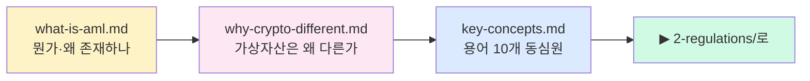

# 1️⃣ Foundations — 기초

> 가상자산 AML을 시작하는 **맨 첫 장**. 용어를 외우기 전에 **무엇이 있고 왜 있는지**부터 잡습니다. 마지막 업데이트: 2026-04-20.

## 누가 먼저 읽어야 하나

- 🆕 AML을 처음 듣는 사람 — 여기가 입구입니다
- 💼 비(非)컴플라이언스 포지션에서 AML 팀과 협업해야 하는 사람 (엔지니어·PM·기획자)
- 🎓 학생·구직자로서 "대체 AML이 뭐길래 이렇게 크게 벌리는가"를 이해하고 싶은 사람

## 읽는 순서

## 파일 인덱스

| # | 파일 | 핵심 질문 | 배우고 나면 |
|---|---|---|---|
| 1 | [`what-is-aml.md`](what-is-aml.md) | 자금세탁이 뭔가? 왜 막아야 하나? | Placement·Layering·Integration 3단계 예시로 말함 |
| 2 | [`why-crypto-different.md`](why-crypto-different.md) | 공개 원장인데 왜 어려운가? | mixer·bridge·stablecoin이 왜 생겼는지 구조적으로 이해 |
| 3 | [`key-concepts.md`](key-concepts.md) | KYC·KYT·CDD·EDD·STR·CTR·PEP·BO가 각각 뭔가? | 용어 A를 봤을 때 B와 어떻게 다른지 30초 내 설명 |

## 핵심 출구

이 폴더를 다 읽으면 다음 질문에 답할 수 있어야 합니다.

- 자금세탁 3단계를 예시 1개씩 들 수 있는가
- "KYC vs KYT" 차이를 30초 안에 말할 수 있는가
- 왜 가상자산 AML은 전통 금융 AML과 다른 도구가 필요한가
- CDD·EDD·SDD 동심원 구조를 손으로 그릴 수 있는가

## 다음 단계

- 규제 구조 → [`../2-regulations/README.md`](../2-regulations/README.md)
- 60일 커리큘럼에서는 **D1~D4** — [`../../curriculum/day_01.md`](../../curriculum/day_01.md)
- 상위 인덱스 → [`../README.md`](../README.md)
