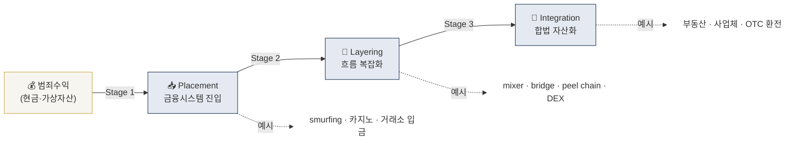
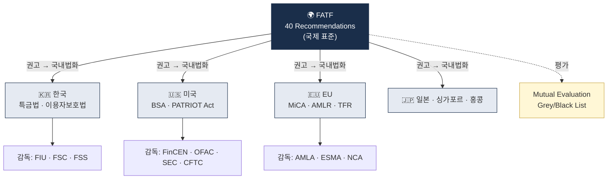

# What is AML? — 자금세탁방지 기초

> 자금세탁(Money Laundering)이란 무엇이고, AML(Anti-Money Laundering)이 왜 존재하는가. 이 글을 읽고 나면 "자금세탁 3단계"가 머릿속 그림으로 남고, 왜 AML이 단순 금융규제가 아니라 **범죄 억제 인프라**인지 설명할 수 있게 됩니다. 마지막 업데이트: 2026-04-17.

## TL;DR
- **자금세탁(ML, Money Laundering)**: 범죄로 얻은 돈의 출처를 숨겨 합법적인 자금처럼 보이게 하는 행위
- **AML(Anti-Money Laundering)**: 그걸 막기 위한 법·제도·기술·운영의 총합. 짝꿍 개념으로 **CFT**(테러자금조달방지)가 있음
- 자금세탁은 전통적으로 **3단계 모델**: Placement → Layering → Integration
- 가상자산은 이 3단계가 다 **온체인에서** 일어날 수 있어서 추적은 쉬워졌지만 속도·규모가 폭증
- AML 의무의 큰 줄기: **고객을 알고(KYC) → 거래를 모니터링하고(KYT/TM) → 의심되면 신고(STR)**

---

## 1. 자금세탁이 뭔가 — "왜 굳이 세탁하나"부터

### 핵심 아이디어

범죄로 번 돈은 당장 써도 문제입니다. 현금 다발을 들고 부동산을 계약하면 공인중개사가 의심 신고를 하고, 은행에 한 번에 10억을 입금하면 은행이 FIU(금융정보분석원)에 보고합니다. 그래서 범죄조직은 **"이 돈이 어디서 왔는지 모르게 만든 뒤, 합법적인 소득처럼 보이도록 포장하는 일"** 에 시간과 수수료를 쓰게 됩니다. 이게 자금세탁입니다.

용어 정의:
- **ML (Money Laundering)** — 자금세탁. 범죄수익의 출처를 은닉하고 합법성을 가장하는 일련의 과정.
- **AML (Anti-Money Laundering)** — 자금세탁방지. 그걸 탐지·차단하기 위한 법·제도·기술·운영 전체.
- **Predicate Offense (전제범죄)** — 자금세탁의 대상이 된 원범죄. 마약, 뇌물, 탈세, 해킹 등이 대표. 전제범죄가 없으면 자금세탁죄도 성립하지 않음.

### 자금세탁의 3가지 목적

범죄조직 관점에서 자금세탁의 목적은 단순합니다.

1. **출처(origin)를 숨긴다** — 돈이 마약 판매금인지 랜섬웨어 몸값인지 알 수 없게 한다.
2. **추적(trail)을 끊는다** — 자금 흐름이 수사기관 눈에 안 보이게 만든다.
3. **합법 경제에 통합(integration)한다** — 부동산·사업체·럭셔리 자산 형태로 "정상 소득"이 된다.

이 셋이 달성되면 범죄자는 번 돈을 마음대로 쓸 수 있고, 수사기관이 뒤늦게 발견해도 **몰수(asset forfeiture)가 어려워집니다**. 그래서 AML은 단순한 "금융 규제"가 아니라 **마약·조직범죄·테러·사이버범죄·대량살상무기 확산 그 자체를 억제하는 수단**으로 다뤄집니다. 이게 AML이 금융위·FSC가 아닌 **FIU**(Financial Intelligence Unit, 금융정보분석원) 같은 전담기구와 국가정보기관이 관여하는 이유입니다.

### 실무 포인트

AML 부서에서 일한다는 건 결국 "범죄수익이 우리 회사를 통과하지 못하게 막는 일"입니다. 그래서 AML 실무자는 금융지식 + 규제지식 + 수사적 감(조금 낯선 패턴을 놓치지 않는 본능)을 동시에 요구받습니다. 이 감각이 **거래 모니터링 룰을 설계**하는 출발점이 됩니다.

---

## 2. 고전적 3단계 모델 (Placement → Layering → Integration)

### 왜 3단계인가

1984년 미국 관세청 산하 조직이 처음 제안하고 FATF·UNODC가 표준으로 채택한 모델. 실제 자금세탁은 단계가 뚜렷이 구분되지 않고 섞여 돌아가지만, 이 모델은 **"어디에 방어선을 칠지"** 설계하는 데 유용해서 40년째 기본 프레임으로 쓰입니다.

용어:
- **FATF (Financial Action Task Force)** — 국제자금세탁방지기구. 1989년 G7이 만든 국제기구로, 회원국에 권고안(Recommendation)을 발표.
- **UNODC (UN Office on Drugs and Crime)** — UN 마약범죄국. 자금세탁 관련 통계·연구 발간.

### 한 줄 서사로 보는 3단계

마약상 A가 길거리에서 번 현금 10억을 부동산으로 바꿔 은퇴하려 합니다.

- **Stage 1 Placement (배치)** — A가 현금 10억을 100개 계좌에 100만원씩 나눠 입금(**structuring/smurfing**). 또는 현금→카지노칩→환전 전표로 바꾸기. 또는 현금→가상자산 거래소 입금.
- **Stage 2 Layering (은닉)** — A가 100개 계좌의 돈을 해외법인(쉘컴퍼니)으로 송금, 다시 3국을 거쳐 다른 법인으로 재송금. 가상자산이라면 mixer(믹서)를 거쳐 chain hopping(체인호핑)으로 Tron-USDT로 변환.
- **Stage 3 Integration (통합)** — A가 해외법인 명의로 서울 아파트를 매입. 이 아파트에서 나오는 임대소득은 이제 **"합법적 부동산 임대수익"** 으로 보입니다.

### Stage 1. Placement (배치)

**정의**: 더러운 돈을 금융 시스템에 **처음 집어넣는** 단계.

예:
- 현금다발을 여러 계좌에 분할 입금(**structuring/smurfing** — "스머프"들이 각자 소액씩 입금한다고 해서 붙은 이름)
- 카지노에서 현금 → 칩 → 체크 환전
- 현금 → 가상자산 거래소 입금 (P2P 또는 OTC)
- 실물 자산(금, 고가 시계, 미술품) 구매

이 단계가 **가장 위험하고 가장 탐지하기 쉬운** 구간입니다. 현금이 금융 시스템에 들어오는 순간 은행·거래소의 KYC(Know Your Customer, 고객확인)와 CTR(Currency Transaction Report, 고액현금거래보고) 규제와 맞닥뜨리기 때문. 그래서 AML 1차 방어선이 여기에 집중됩니다. 즉 "Placement를 포기시키면 나머지 단계는 의미가 없다"는 게 규제의 설계 철학입니다.

### Stage 2. Layering (은닉)

**정의**: 여러 번의 거래를 통해 돈의 흐름을 복잡하게 만들어 **추적을 끊는** 단계.

예:
- 여러 계좌·국가·법인 간 반복 송금
- 가상자산: **mixer**(Tornado Cash 등), **chain hopping**(BTC→ETH→Tron→BNB), **peel chain**(큰 금액을 계속 조금씩 떼어내 이전), DeFi swap, NFT wash trading

용어:
- **Mixer** — 여러 사용자의 자금을 섞어서 입출금 관계를 끊는 서비스.
- **Chain Hopping** — 서로 다른 블록체인 사이를 점프해 흔적을 흐리는 기법.
- **Peel Chain** — 큰 금액에서 소액을 떼어내(peel) 다른 주소로 보내고 나머지는 또 다른 주소로, 긴 사슬 패턴.

이 단계가 **가장 길고 창의적**입니다. 가상자산 환경에서는 layering 도구가 매년 새로 나옵니다 — 크로스체인 브리지가 2022~2023년에 터졌다면 2024~2025년엔 DeFi 프로토콜 기반 믹싱이 대세입니다. **온체인 분석(blockchain analytics)** 산업이 돈을 버는 지점이 바로 이 구간 — Chainalysis·Elliptic·TRM Labs 같은 회사의 기술은 대부분 "Layering을 풀어내는 휴리스틱"에 투자되어 있습니다.

### Stage 3. Integration (통합)

**정의**: 세탁된 돈이 **합법 자산으로 다시 등장**하는 단계.

예:
- 부동산 매입 (자금출처 증빙 모호하게)
- 럭셔리 자산 (요트, 시계, 미술품) 구매
- 합법 사업체 인수 → 매출 부풀리기
- 대출 상환 (가장한 대출 계약)
- 가상자산 → OTC desk → 법정화폐 → 사업 투자

이 시점에 잡히면 자산몰수가 **극도로 어렵습니다**. 왜냐하면 돈이 이미 "정당한 계약"과 "정당한 소유권" 옆에 붙어 있어서, 수사기관이 이를 몰수하려면 민사상 제3자 권리(선의취득자, 담보권자 등)를 건드려야 하기 때문. 그래서 AML 설계는 **"그 전 단계에서 막는다"** 에 집중합니다.

### 이 표를 어떻게 읽어야 하나

아래 표는 3단계를 **전통 금융 vs 가상자산** 관점에서 같은 행위가 어떻게 다른 도구로 나타나는지 대조합니다. 왼쪽이 익숙한 형태, 오른쪽이 가상자산 산업에서 보게 될 형태.

| 단계 | 전통 금융 도구 | 가상자산 도구 |
|---|---|---|
| Placement | 현금 분할입금, 카지노, 전신환, 차명계좌 | P2P/OTC 거래, 현금→거래소 입금, 선불카드→거래소 |
| Layering | 해외법인 송금, shell company, back-to-back loan | Mixer, cross-chain bridge, DEX swap, peel chain, NFT wash trade |
| Integration | 부동산, 사업체 인수, 가공매출 | OTC → 법정화폐 → 부동산, 스테이블코인 보유 후 글로벌 결제 |

### 실무 포인트

가상자산에서는 이 3단계가 **모두 한 트랜잭션 안에 압축**되거나 **24시간 내에 다 끝날 수도** 있습니다 — 2025-02 Bybit 해킹(Lazarus)에서 48시간 내 $160M이 layering 완료된 게 상징적 사례입니다. 그래서 가상자산 AML은 **실시간성**이 절대적이고, 사후 조사로는 자산을 회수하지 못합니다. 이게 KYT(Know Your Transaction, 거래 확인) 실시간 모니터링이 사업 필수 기능이 된 배경입니다.

---

## 3. AML과 CFT의 관계 — 왜 짝꿍인가

### 세 약어의 차이

- **AML (Anti-Money Laundering)** — 자금세탁방지. **범죄수익 → 합법자산** 전환을 막는다.
- **CFT (Combating the Financing of Terrorism)** — 테러자금조달방지. **자금(합법이든 불법이든) → 테러조직**으로의 이동을 막는다.
- **CPF (Counter-Proliferation Financing)** — 대량살상무기 확산금융 차단. 주로 북한·이란 관련.

### ML과 TF는 방향이 정반대

여기가 혼동 지점입니다. ML은 "더러운 돈이 합법이 되는 과정"을 다루고 TF는 "합법 자금이 테러에 쓰이는 과정"을 다룹니다.

- **ML**: 더러운 돈 → (세탁) → 깨끗한 돈. 관심은 **출처**.
- **TF**: 깨끗한 돈이어도 → (이동) → 테러 자금. 관심은 **수취인/용도**.

그래서 TF는 **자금출처가 합법이어도** 차단 대상이 될 수 있습니다. 예를 들어 이슬라믹 스테이트(IS)가 자선단체를 가장해 정당한 기부금을 모은 뒤 무기 구매에 쓴다면, 그 기부금 자체는 범죄수익이 아니지만 CFT 위반이 됩니다. 이 차이가 **제재(sanctions) 스크리닝**을 실무의 핵심 통제로 만든 이유입니다 — 수취인 쪽 명단을 보는 일이기 때문.

용어:
- **Sanctions Screening (제재 스크리닝)** — 거래 당사자가 OFAC SDN, UN, EU, 외교부 제재대상자 명단에 해당하는지 실시간 매칭.
- **OFAC (Office of Foreign Assets Control)** — 미국 재무부 해외자산통제국. 제재 대상을 지정·집행하는 권한 보유.
- **SDN List (Specially Designated Nationals List)** — OFAC가 발표하는 제재대상자 목록. 가상자산 주소도 포함됨.

### 실무 포인트

회사 AML 문서가 흔히 "AML/CFT" 또는 "AML/CFT/CPF"로 한 덩어리로 표기되는데, **운영 관점에서는 둘의 통제 지점이 다릅니다**. ML 통제는 "의심거래 탐지(STR)"에 집중하고, TF·CPF 통제는 "제재 명단 매칭(Sanctions Screening)"에 집중합니다. 거래 모니터링 룰을 설계할 때 이 둘을 섞지 말고, 별도 룰 세트로 관리하는 게 분석 품질에 유리합니다.

---

## 4. AML 의무의 큰 줄기 (어떤 회사든 비슷함)

### 개요

가상자산사업자(VASP, Virtual Asset Service Provider — 거래소·수탁·OTC 등)든 은행이든 결제사든, AML 의무의 뼈대는 거의 동일합니다. 관할(한국·미국·EU)에 따라 세부 조항과 임계금액만 달라집니다. 이 9개는 어떤 AML 교재에서도 반복 등장하므로 순서째로 암기해두면 이후 규제 문서를 읽을 때 뼈대가 됩니다.

### 9개 의무 (가상자산 기준 Travel Rule 포함 시 10개)

1. **신고·등록(Licensing)** — 당국에 사업자 등록. 한국은 FIU 신고, 미국은 FinCEN MSB 등록, EU는 MiCA CASP 라이선스.
2. **고객확인(KYC/CDD)** — 누구와 거래하는지 확인. 신분증, 주소, 거래목적.
3. **위험기반접근(RBA, Risk-Based Approach)** — 고객·상품·지역별 위험등급을 매기고 그에 비례해 통제 강도 조정. 저위험은 간소하게, 고위험은 두껍게.
4. **강화실사(EDD, Enhanced Due Diligence)** — 고위험(PEP, 고위험국, 비대면+기타 위험요소) 고객에 추가 확인. 자금원천 증빙이 핵심.
5. **거래모니터링(TM/KYT)** — 비정상 거래 패턴 탐지. 전통 금융은 TM(Transaction Monitoring), 가상자산은 KYT(Know Your Transaction)로 부름.
6. **제재 스크리닝(Sanctions Screening)** — 고객·카운터파티·지갑주소가 제재 대상인지 실시간 대조.
7. **의심거래보고(STR/SAR)** — 의심되면 즉시 FIU에 보고. STR(Suspicious Transaction Report, 한국·FATF 용어), SAR(Suspicious Activity Report, 미국 FinCEN 용어).
8. **기록보관(Record Keeping)** — 한국은 **가상자산이용자보호법 §11로 거래정보 15년**, **특금법 §5의4로 AML 기록 5년**. 대상이 다르므로 둘 다 준수.
9. **내부통제(Internal Controls)** — AML 책임자(AMLO/MLRO) 임명, 정책·절차 문서화, 임직원 교육, 내부감사.

**가상자산 추가 10번째**:

10. **Travel Rule (FATF R.16)** — 일정 금액 이상 VASP 간 이전 시 송수신인 정보 동반. 한국은 100만원, 미국은 $3,000, EU는 임계 없음(1유로부터).

용어:
- **PEP (Politically Exposed Person)** — 정치적 주요인물. 고위 공직자·그 가족·측근. 부패 위험이 구조적으로 높아 자동 EDD.
- **Travel Rule** — FATF 권고 16조. 전통 금융의 SWIFT 송금정보 동반을 가상자산으로 확장한 개념.

### 실무 포인트

"우리 회사 AML 프로그램이 완성됐는가"를 점검할 때는 이 10개를 체크리스트로 만들어 각각에 **담당자·시스템·SLA·증빙**이 있는지 본다. 이 중 어느 하나라도 "사람만 있고 시스템이 없다"면 규제 검사에서 지적 대상입니다.

---

## 5. 누가 만든 룰을 따르는가 — 글로벌 거버넌스 지도

### FATF → 국내법의 구조

### FATF는 법을 만들지 않는다

중요한 오해 하나를 먼저 풀면, **FATF는 국제법을 만드는 기구가 아닙니다**. FATF가 하는 일은 권고안(Recommendation, 40개)을 발표하고, 회원국이 이를 국내법으로 얼마나 잘 이행했는지 주기적으로 **상호평가(Mutual Evaluation, ME)** 하는 것입니다.

그러면 왜 각국이 FATF 권고를 열심히 따르는가? **제재보다 무서운 게 평판이기 때문**입니다. 상호평가에서 낮은 점수를 받으면 FATF는 그 나라를 **Grey List**(강화 모니터링) 또는 **Black List**(Call for Action)에 올릴 수 있고, 그러면:

- 외국 은행이 그 나라 금융기관과의 **코르레스(correspondent) 관계**를 끊거나 제한
- 국가 신용등급 강등, 자본 유출
- 외국인 투자 기피

즉 국가 경제 자체가 타격을 입습니다. 2021~2025년 사이 터키·남아공·나이지리아·파키스탄이 Grey List에 올랐다가 빠지는 과정에서 이런 압력을 체감했습니다. 한국은 Grey List에 오른 적이 없지만, 바로 그 이유로 FATF 권고 이행에 민감합니다.

### 가상자산에 대한 결정적 권고 2개

가상자산 산업이 FATF 권고를 체감하는 지점은 거의 이 둘로 압축됩니다.

- **FATF Recommendation 15 — VASP에 AML/CFT 의무 부과.** 가상자산사업자를 전통 금융기관과 동일한 AML 체계에 편입. 2019년 신설, 2021·2025년 개정.
- **FATF Recommendation 16 — Travel Rule.** VASP 간 이전 시 송수신인 정보 동반 의무. 2019년 확장, 2025-06 해석지침 업데이트.

R.15와 R.16은 한국 특금법 개정(2020-03, 2021-03)과 EU MiCA·TFR 제정(2023~2024)의 **직접 모태**가 됐습니다. 두 권고의 정확한 문언을 아는 것은 이후 모든 국가별 규제 학습의 출발점입니다. 자세한 내용은 [`../2-regulations/fatf.md`](../2-regulations/fatf.md) 참조.

### 실무 포인트

회사 AML 정책 문서 맨 앞에 "본 정책은 FATF Recommendation 10, 15, 16 및 한국 특금법 §5의2~§5의4에 근거한다"고 명시하면, 규제 검사관이 문서 구조를 이해하기 쉬워지고 내부 교육 자료에서도 "이 룰이 왜 있는가"를 거슬러 올라가 설명할 수 있습니다. 법적 근거 추적성(traceability)을 문서에 내재화하는 게 성숙한 AML 프로그램의 표식입니다.

---

## 요약 부록 — 빠른 참조용

**3단계 모델**: Placement → Layering → Integration (전통·가상자산 공통 틀)
**AML 9대 의무**: 신고 · KYC/CDD · RBA · EDD · TM/KYT · 제재 스크리닝 · STR · 기록보관 · 내부통제 (+ 가상자산 Travel Rule)
**글로벌 구조**: FATF 권고 → 각국 국내법 → 감독기관 집행 → Mutual Evaluation 피드백 루프

## 더 읽을거리
- [`why-crypto-different.md`](why-crypto-different.md) — 왜 가상자산 AML은 다른가
- [`key-concepts.md`](key-concepts.md) — KYC/KYT/CDD/EDD/STR/CTR 정의 상세
- [`../2-regulations/fatf.md`](../2-regulations/fatf.md) — FATF 권고안 R.15/R.16 deep
- [FATF — Money Laundering](https://www.fatf-gafi.org/en/topics/money-laundering.html)
- [UNODC — Money Laundering Overview](https://www.unodc.org/unodc/en/money-laundering/overview.html)
