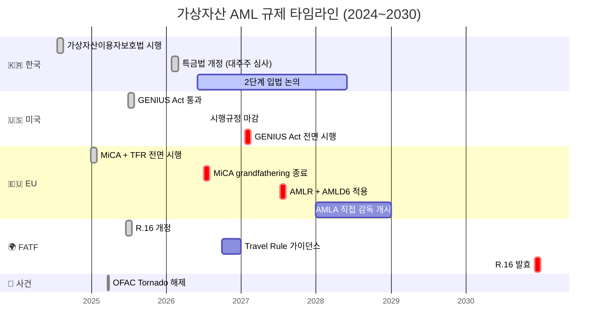

# 2️⃣ Regulations — 규제 맵

> 가상자산 AML 관련 규제의 **전체 지도**. 이 글은 이 폴더의 5개 상세 문서를 언제 어떻게 읽어야 할지 안내합니다. 마지막 업데이트: 2026-04-17.

## 규제가 어떻게 흘러내리는가

가상자산 AML 규제는 **하나의 법**이 아니라 **여러 층의 규범**이 서로 참조하면서 작동합니다. 맨 위에 국제 표준이 있고, 그 아래에 각국이 자국 법으로 받아들이는 구조.

```
                    ┌─────────────────────────┐
                    │   FATF (국제 표준)       │
                    │   Recommendation 15, 16  │
                    └────────────┬─────────────┘
                                 │ 권고 → 회원국 도입
            ┌────────────────────┼─────────────────────┐
            ▼                    ▼                     ▼
    ┌──────────────┐    ┌──────────────┐    ┌────────────────┐
    │   한국        │    │   미국         │    │      EU       │
    │ 특금법 + 이용자│    │ BSA + USAPA   │    │ MiCA + AMLR +  │
    │ 보호법        │    │ FinCEN·OFAC   │    │ AMLD6 + TFR   │
    │ 감독: FIU·FSC │    │               │    │ 감독: AMLA·NCA│
    └──────────────┘    └──────────────┘    └────────────────┘
```

### 이 구조를 어떻게 활용하나

- **한국 VASP 실무자**: FATF 원문을 직접 준수할 의무는 없지만, **특금법 조항의 논리적 근거**를 찾으려면 FATF를 참조.
- **해외 진출 검토자**: 미국·EU 진출 시 해당 관할의 AML 법을 **처음부터 배우는 게 아니라 FATF 공통 구조에서 관할별 차이만 파악**하면 효율적.
- **규제 변화 모니터링**: FATF에서 권고가 개정되면 1~3년 후 각국이 따라간다는 시간 차이가 있으므로, **FATF 개정**이 선행 지표.

---

## 영역별 문서 — 무엇을 읽어야 하나

| 파일 | 다루는 내용 | 먼저 읽어야 할 사람 |
|---|---|---|
| [`fatf.md`](fatf.md) | FATF 권고안 (R.15, R.16), Travel Rule, 상호평가 | 모든 사람 — 이게 기반 |
| [`korea-fiu-act.md`](korea-fiu-act.md) | 한국 특정금융정보법 (특금법) — VASP 신고제 | 한국 VASP 실무자 |
| [`korea-user-protection.md`](korea-user-protection.md) | 가상자산이용자보호법 (2024-07-19 시행) | 한국 VASP (자산보호·시세조종 담당) |
| [`us-bsa-fincen.md`](us-bsa-fincen.md) | 미국 BSA, FinCEN, OFAC, GENIUS Act (스테이블코인) | 미국 진출 검토자·OFAC 담당자 |
| [`eu-mica-amlr.md`](eu-mica-amlr.md) | EU MiCA, AMLR·AMLD6, TFR (Travel Rule) | EU 진출 검토자·글로벌 Travel Rule 담당자 |

---

## 적용 우선순위 (한국 법인·한국 신고 VASP 기준)

1. **🔴 1순위 (직접 적용)** — 한국 특금법 + 가상자산이용자보호법 + FIU 고시
2. **🟠 2순위 (글로벌 거래·해외 고객)** — FATF 표준, 외국 VASP와의 Travel Rule 호환
3. **🟡 3순위 (해외 진출·자회사 시)** — EU MiCA, US BSA
4. **⚪ 항시 의식** — OFAC·UN 제재 (전 세계 적용)

### 이 우선순위를 어떻게 활용하나

신입 AML 담당자 교육 시 이 순서대로 커리큘럼을 짜면 효율적. 1순위(한국)에 2~3개월, 2순위(FATF)에 1개월, 3순위(EU·미국)는 필요에 따라 학습. 단 **OFAC은 1일차부터 의식**하도록 교육 — 한국에만 영업해도 OFAC 준수는 사실상 필수이기 때문.

---

## 핵심 일정 — 2024~2030 규제 로드맵



## 핵심 일정 (2026~2027) — 당장 주시해야 할 이벤트

| 시점 | 사건 |
|---|---|
| 2024-07-19 | 한국 가상자산이용자보호법 시행 |
| 2024-12-30 | EU MiCA 전면 시행 |
| 2025-03-21 | OFAC, Tornado Cash 제재 해제 |
| 2025-06-18 | FATF Recommendation 16 개정 |
| 2025-07 | 미국 GENIUS Act 통과 (스테이블코인 BSA 적용) |
| 2026-01-29 | 한국 특금법 개정안 통과 (대주주 자격심사 강화) |
| 2026-07-01 | EU MiCA grandfathering 종료 (CASP 라이선스 의무) |
| 2026-07-18 | 미국 GENIUS Act 시행규정 마감 |
| 2026 후반 | FATF Travel Rule 가이던스 발표 예정 |
| 2027-01-18 | 미국 GENIUS Act 전면 시행 |
| 2027-07-10 | EU AMLR + AMLD6 적용 |
| 2030년 말 | FATF R.16 개정 발효 |

### 실무 포인트

위 타임라인에서 **2026년 하반기**에 여러 이벤트가 집중됩니다 — MiCA grandfathering 종료, GENIUS Act 시행규정, FATF 가이던스. 이 시점에 회사의 **규제 모니터링 리소스가 가장 바빠질 시기**이며, 해당 분기에는 AMLO가 다른 업무를 줄이고 규제 변화 추적에 집중할 수 있도록 사전에 계획하는 게 현실적.

---

## 이 폴더 전체를 관통하는 2가지 원리

### 1. FATF가 원형, 각국이 변형

한국·미국·EU 법을 각각 배우려 하면 무한 반복처럼 느껴집니다. 그러나 **핵심은 FATF 권고 몇 개**이고, 각국은 이를 자국 법 체계에 맞게 변형한 것에 불과합니다. FATF를 먼저 탄탄히 이해하면 나머지 관할은 "차이점만 파악"하는 방식으로 빠르게 학습 가능.

### 2. 동시 적용이 표준

한국 VASP는 특금법(AML) + 이용자보호법(시장)을 동시 적용받고, 글로벌 영업 시에는 여기에 미국 OFAC + EU TFR까지 **사실상 네 개 관할**을 동시 고려해야 합니다. "우리는 한국법만 따른다"는 발상은 글로벌 가상자산 산업의 현실과 맞지 않습니다. 처음부터 **멀티 관할 설계**가 효율적이며, 이 방향에서 **EU·미국·FATF의 가장 엄격한 기준**을 기준으로 잡는 게 안전합니다.
