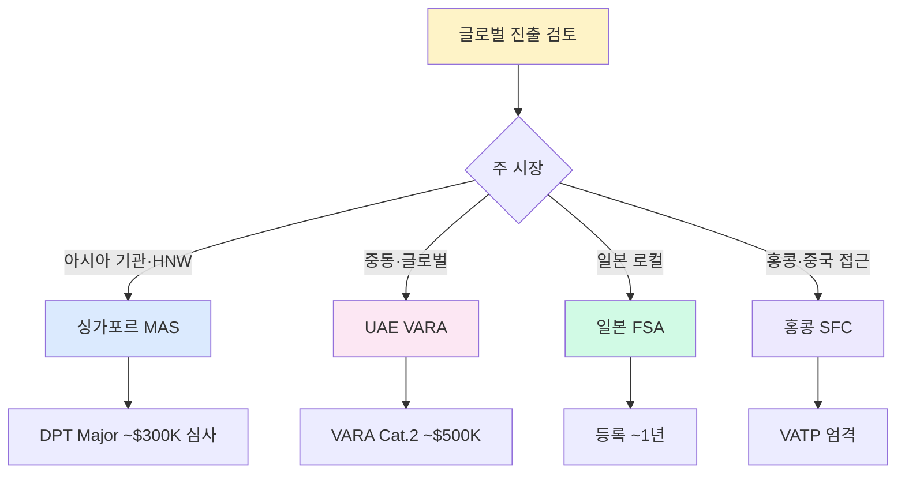

# 아시아 주요 VASP 규제 — 싱가포르·UAE·일본·홍콩

> 한국 VASP 글로벌 진출의 주요 목적지. 각 관할의 핵심 법령·감독·Travel Rule 구조를 **비교 가능한 수준**으로 정리. 마지막 업데이트: 2026-04-22.

## TL;DR

- **싱가포르 (MAS PSA)**: 가장 촘촘. DPT 라이선스, Travel Rule 임계 S$1,500
- **UAE (VARA + ADGM + DFSA)**: 아부다비·두바이 이원 체제, Travel Rule 글로벌 가장 엄격한 편
- **일본 (FSA 자금결제법)**: Crypto Asset Exchange Service Provider 등록 필수, JVCEA 자율규제
- **홍콩 (SFC VASP 라이선스)**: 2023 신규 도입, 소매 거래 허용(2024~)

## 1. 싱가포르 — MAS PSA (Payment Services Act)

### 핵심 법령·감독
- **MAS (Monetary Authority of Singapore)** — 중앙은행 + 금융감독
- **PSA (Payment Services Act 2019, 2024 개정)** — DPT (Digital Payment Token) Service Provider 라이선스
- **AML/CFT Notice PS-N02** — VASP AML 의무 구체화

### VASP 의무 핵심
- **라이선스**: DPT Major Service / Standard Service / Money-Changing (3종)
- **KYC/CDD**: MAS Notice 626 / Notice 824 기반
- **STR**: STRO (Suspicious Transaction Reporting Office) 제출
- **Travel Rule**: **임계 S$1,500** (≈US$1,100) + IVMS101 권고
- **신용카드 크립토 구매 금지** (2024~)

### 한국 VASP 진출 패턴
- Upbit Singapore (2022) — Major Service 라이선스 취득
- Bithumb Singapore (2023)
- 현지 실체·싱가포르인 AMLO 필수

### 참고
- [MAS PSA 공식](https://www.mas.gov.sg/regulation/acts/payment-services-act)

---

## 2. UAE — VARA (두바이) + ADGM FSRA (아부다비) + DFSA (DIFC)

### 핵심 구조
- **VARA (Virtual Assets Regulatory Authority, 2022~)** — 두바이 주 독립 VASP 규제기관
- **ADGM FSRA (Abu Dhabi Global Market)** — 아부다비 자유지대 금융감독
- **DFSA (Dubai International Financial Centre)** — DIFC 금융감독 (VASP 별도 라이선스)

### VARA 특징 (가장 글로벌 지향)
- **Category 1~4 라이선스** — 수탁·거래·대출·발행 등 기능별
- **Travel Rule**: **임계 0 (1 AED부터)** — 세계에서 가장 엄격
- **필수 로컬 고용**: CCO (Chief Compliance Officer) 현지 거주 필수
- **Market Abuse Framework**: 시장조작 직접 규제

### 한국 VASP 진출 고려 사항
- 두바이 VARA는 **라이선스 심사 엄격 + 고비용** (수수료 AED 100K~500K)
- 최소자본 규모 별도 책정 — Category 2 (exchange) 대략 $1~3M
- 대표적 진출 기업: Binance (VARA), OKX (VARA), Bybit (두바이 본사 이전)

### 참고
- [VARA 공식](https://www.vara.ae/)
- [ADGM FSRA](https://www.adgm.com/operating-in-adgm/financial-services-regulatory-authority)

---

## 3. 일본 — FSA (금융청) + 자금결제법

### 핵심 법령·감독
- **자금결제법(資金決済法) 2017** — Crypto Asset Exchange Service Provider(暗号資産交換業) 등록 의무
- **금융청(FSA)** — 직접 감독
- **JVCEA (Japan Virtual Currency Exchange Association)** — 업계 자율규제

### 특징
- **등록제 (라이선스 아님)** — 상대적으로 엄격 심사
- **Cold Wallet 95% 보관 의무** (2018 Coincheck 해킹 이후 도입)
- **Travel Rule**: **임계 10만엔** (≈US$700) + JVCEA 가이드라인
- **상장 심사**: JVCEA White List — 신규 코인 상장 시 화이트리스트 기반

### 한국과 차이
| 항목 | 한국 | 일본 |
|---|---|---|
| 제도 | 신고제 | 등록제 |
| 상장 심사 | 자유 (DAXA 자율) | JVCEA 화이트리스트 필수 |
| 콜드월렛 | 80% 권고 | 95% 의무 |
| Travel Rule | 100만원 | 10만엔 |

### 참고
- [FSA Virtual Currency](https://www.fsa.go.jp/policy/virtual_currency/index.html)
- [JVCEA 공식](https://jvcea.or.jp/)

---

## 4. 홍콩 — SFC VASP 라이선스

### 핵심
- **SFC (Securities and Futures Commission)** — 증권 감독기관이 VASP 담당
- **VATP (Virtual Asset Trading Platform) 라이선스** — 2023-06 시행
- **소매 거래 허용 (2024~)** — 글로벌 최초 규제 틀 내 소매 허용

### 의무 핵심
- **Travel Rule**: 임계 HK$8,000 (≈US$1,000)
- **PoR (Proof of Reserves) 분기 공개 의무**
- **보험/대체 보상 체제 필수** (최소 50% 커버)
- **상장 심사**: SFC 승인 코인만 소매 거래 가능 (BTC·ETH 등 엄선)

### 한국 VASP 관심
- 홍콩은 **VASP 친화적 관할** 평가 — 2024~2025 OSL·HashKey 등 상장/IPO 성공
- 글로벌 VASP (Binance 등)는 홍콩 진출 어려움 (엄격 심사)

### 참고
- [SFC VASP 규제](https://www.sfc.hk/en/Regulatory-functions/Intermediaries/Licensing/Virtual-assets-trading-platforms)

---

## 5. 5개 관할 종합 비교 표

| 항목 | 🇰🇷 한국 | 🇸🇬 싱가포르 | 🇦🇪 UAE(VARA) | 🇯🇵 일본 | 🇭🇰 홍콩 |
|---|---|---|---|---|---|
| 감독기관 | FIU + FSS | MAS | VARA | FSA | SFC |
| 제도 | 신고제 | 라이선스 | 라이선스 | 등록제 | 라이선스 |
| Travel Rule 임계 | 100만원 | S$1,500 | **임계 0** | 10만엔 | HK$8,000 |
| Cold Wallet | 80% 권고 | 자율 | 카테고리별 | 95% 의무 | 98%+ |
| 소매 거래 | 자유 | 제한적 | 허용 | 등록자만 | 2024~ 허용 |
| 상장 심사 | DAXA 자율 | 자유 | VARA 심사 | JVCEA 화이트리스트 | SFC 승인 |

## 6. 한국 VASP 진출 의사결정 가이드

## 7. 실무 포인트

### 진출 패턴 3가지
1. **신설 법인**: 한국 본사와 별개 법인, 현지 감독 직접 대응 (Upbit Singapore 모델)
2. **합작 법인**: 현지 파트너와 50:50 법인 (라이선스 심사 유리)
3. **서비스 법인**: 기술·운영만, 라이선스는 파트너사 (리스크 전가)

### 공통 준비사항
- 현지 AMLO/CCO 고용 (법정 요건)
- Travel Rule 벤더 재계약 (임계·프로토콜 현지 맞춤)
- KYC 벤더 지역 확장 (한국 KYC ≠ 글로벌 KYC)
- 세무 구조 설계 (이전가격·관세 회피)

## 더 읽을거리

- [`fatf.md`](fatf.md) — FATF 권고 원형 (아시아 관할 모두 FATF 기반)
- [`korea-fiu-act.md`](korea-fiu-act.md) — 한국 특금법 비교 기준
- [`eu-mica-amlr.md`](eu-mica-amlr.md) — EU 규제 비교
- [`us-bsa-fincen.md`](us-bsa-fincen.md) — 미국 규제 비교
- [MAS PSA](https://www.mas.gov.sg/regulation/acts/payment-services-act)
- [VARA](https://www.vara.ae/)
- [FSA Virtual Currency](https://www.fsa.go.jp/policy/virtual_currency/index.html)
- [SFC VATP](https://www.sfc.hk/en/Regulatory-functions/Intermediaries/Licensing/Virtual-assets-trading-platforms)
