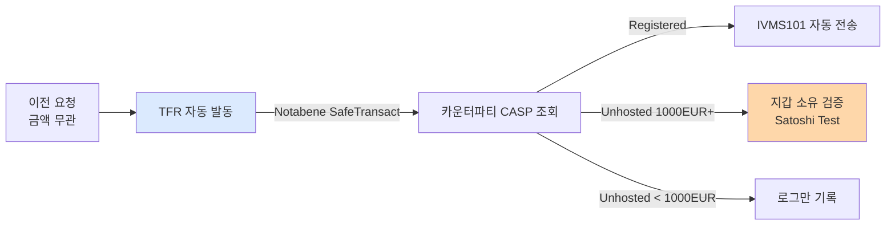

# EU — MiCA, AMLR/AMLD6, TFR

> EU의 가상자산 규제 **3종 세트**: MiCA(시장규제) + AMLR/AMLD6(AML) + TFR(Travel Rule). 이 글을 읽고 나면 EU가 왜 가장 엄격한 Travel Rule(임계 없음)을 택했는지, 그리고 2024-2027년 사이에 전 세계 VASP들이 왜 EU 기준을 설계 기준으로 삼는지 이해하게 됩니다. 마지막 업데이트: 2026-04-17.

## TL;DR
- **MiCA** (Markets in Crypto-Assets Regulation) — 가상자산 시장 통합 규제. **2024-12-30 전면 시행**
- **2026-07-01**: grandfathering 종료 — 모든 CASP는 라이선스 획득 의무
- **AMLR + AMLD6** (AML 패키지) — **2027-07-10 적용**, EU 27개국 단일 규칙
- **TFR** (Transfer of Funds Regulation) — EU판 Travel Rule, **임계금액 없음 (모든 거래)**
- 신규 감독기구 **AMLA** (EU AML Authority) 설립, 2025년부터 본격 운영
- **CASP** = Crypto-Asset Service Provider (≈ 한국 VASP)

---

## 1. EU 가상자산 규제 3종 세트 — 한국과 비교

### 이 표를 어떻게 읽어야 하나

EU는 한국의 "특금법 + 가상자산이용자보호법 + 트래블룰" 3층 구조를 **3개 법령 패키지**로 구성. 각 법령의 역할이 명확히 분리돼 있어 체계가 한국보다 깔끔하다는 평가.

| 법령 | 정체성 | 발효 |
|---|---|---|
| **MiCA** | 가상자산 **시장 규제** (라이선스, 발행, 거래) | 2024-12-30 |
| **AMLR** (AML Regulation) | AML **단일 규칙** (회원국 직접 적용) | 2027-07-10 |
| **AMLD6** (6th AML Directive) | AML **지침** (회원국 국내법화) | 2027-07-10 |
| **TFR** | EU **Travel Rule** | 2024-12-30 (MiCA와 동시) |

용어:
- **Regulation vs Directive** — EU 법의 두 형식. **Regulation은 회원국 법 변환 없이 직접 적용**, **Directive는 회원국이 국내법으로 옮겨야** 작동. AMLR은 Regulation(더 강한 강제력), AMLD6은 Directive(보완적).

---

## 2. MiCA — Markets in Crypto-Assets Regulation

### EU 최초의 통합 가상자산 규제

MiCA는 "Regulation"이므로 **27개 회원국에 동일 적용**. 2023-06 채택, **2024-12-30 전면 시행**. EU가 전 세계에서 가장 먼저 포괄적 가상자산 규제를 완성한 상징적 사건이며, 다른 관할(영국·일본·싱가포르 등)이 MiCA를 참고 모델로 삼고 있습니다.

### 적용 대상: CASP

**CASP = Crypto-Asset Service Provider** = VASP의 EU 버전. 다음 중 하나 이상을 영업으로 하면 CASP:

1. 자산의 **수탁·관리** (custody)
2. **거래소** 운영
3. **주문 집행·매칭**
4. **포트폴리오 관리**
5. **이전 서비스**
6. **자문**
7. **인수·배치**

### MiCA의 토큰 분류 — 3개 카테고리

MiCA는 토큰을 **속성에 따라 3개 카테고리**로 분류:

1. **ART (Asset-Referenced Token)** — 여러 통화·자산 바스켓 페그
2. **EMT (E-Money Token)** — 단일 fiat 페그 (USDC, USDT 같은 스테이블코인)
3. **Other Crypto-Assets** — 위 2개를 제외한 모든 것 (BTC, ETH, NFT 일부 제외 등)

**ART와 EMT는 발행 라이선스 의무** (CASP 라이선스와 별도).

### 라이선스

- 회원국 NCA(National Competent Authority)에서 발급
- **EU passporting**: 한 국가에서 받으면 **27개국 영업 가능**
- 발급 요건: 자본금, 거버넌스, 내부통제, AML 정책

용어:
- **NCA (National Competent Authority)** — EU 회원국의 금융감독기구. 프랑스 ACPR, 독일 BaFin, 이탈리아 CONSOB 등.
- **EU Passporting** — 한 회원국 라이선스로 EU 전역에서 영업 가능한 원리. 미국의 주별 MTL과 대비되는 강점.

### Grandfathering (전환기간)

- 기존 사업자는 **2026-07-01 까지** 또는 **라이선스 획득·거부 결정 시까지** 종전 라이선스로 영업 가능
- 회원국별 길이 다름 (최대 18개월)
- **2026-07-01 이후 모든 EU CASP는 MiCA 라이선스 보유** 상태가 됨

### 2026 전환점 — 검사 강도의 변화

2026년부터 **NCA가 onboarding → active supervision으로 전환**. 즉 2025년까지는 "라이선스 심사·발급" 중심이었다면 2026년부터는 **실효성 검사**가 본격. 이게 업계에서 "MiCA 진짜 시작은 2026"이라고 말하는 이유.

### 실무 포인트

한국 VASP가 EU 진출을 고려한다면 **라이선스 발급 회원국 선택**이 전략적 결정. 아일랜드·룩셈부르크·키프로스가 상대적으로 친기업적이라 알려져 있고, 독일·프랑스는 심사가 엄격하지만 브랜드 신뢰도가 높음. EU passporting 덕분에 어느 한 나라 라이선스만 있으면 되므로 선택의 여지가 큼.

---

## 3. TFR — Travel Rule (EU 버전)

### EU TFR의 특이점

- **Regulation (EU) 2023/1113** — Transfer of Funds Regulation 개정안
- MiCA와 같은 패키지로 통과, **2024-12-30 시행**

**전 세계에서 가장 엄격한 Travel Rule**:
- **임계금액 없음** — **모든 가상자산 이전에 적용** (FATF 1,000 EUR, 한국 100만원과 다름)
- **unhosted wallet** (개인지갑) 거래도 적용:
  - 1,000 EUR 초과 시 — **고객 신원 + 지갑 소유 검증** 의무
  - 단, 미국과 달리 unhosted wallet 자체를 금지하지는 않음
- **Originator + Beneficiary 모두 정보 필요**

### Travel Rule 정보 (TFR)

- 송신인: 이름, 주소, 계좌번호·지갑주소, 신원확인번호 또는 출생지·생년월일
- 수신인: 이름, 계좌번호·지갑주소

### CASP 의무

- 상대 CASP가 미준수 시 **반복 위반자 차단·거절**
- AMLA에 보고

### 실무 포인트

EU TFR의 "임계금액 없음"이 글로벌 VASP에게 미치는 효과: **EU 고객이 있으면 사실상 모든 Travel Rule 시스템을 엄격 모드로 운영**해야 합니다. 1 EUR 이체도 대상이므로, 한국에서 설계한 "100만원 이상" 시스템은 EU 거래에서 부족. 이 때문에 글로벌 영업 VASP는 "EU 기준 = 글로벌 기준"으로 시스템을 설계합니다.

---

## 4. AMLR + AMLD6 — AML 패키지

### 패키지 구성 (2024년 입법)

1. **AMLR** (Regulation) — 단일 규칙, 직접 적용
2. **AMLD6** (Directive) — 보완 지침
3. **AMLA Regulation** — EU AML Authority 설립

### 적용 일정

- **2027-07-10 본격 적용**
- AMLD5 + 회원국 국내법 → AMLR + AMLD6로 통합

### 주요 변화

- **27개국 단일 규칙** — 종전엔 각국마다 차이가 있었음
- **현금거래 한도 €10,000 EU 전체 적용**
- **CASP를 명시적으로 포함** (의무자 목록에 등재)
- **EDD 트리거 강화** — 고위험국, 비대면, 복잡한 구조 등

### CASP에 적용되는 AMLR 의무

- KYC + 실소유자 확인 (25% 기준)
- CDD·EDD
- 거래 모니터링
- STR (FIU 보고)
- 기록보관
- 내부통제 + AMLO 임명
- **TFR 준수**

### 실무 포인트

AMLR의 "단일 규칙" 특성이 기업에게 주는 장점은 **27개국에 각각 맞춤 정책을 만들 필요가 없다**는 점. 종전 AMLD 시스템에서는 독일·프랑스·이탈리아의 AML 요건이 미묘하게 달라 compliance 조직이 국가별로 분산되었지만, AMLR 이후에는 **단일 컴플라이언스 정책**으로 EU 전역 대응이 가능.

---

## 5. AMLA — EU AML Authority

### 정체성

- **신규 설립**: 2024년 EU 법으로 설립
- **본부**: 프랑크푸르트
- **본격 운영**: 2025년 시작, 2028년경 직접 감독 개시 예정
- **역할**:
  - EU 차원의 AML 룰북 단일 해석
  - 가장 위험한 40여 개 cross-border 금융기관 **직접 감독**
  - 회원국 NCA 조정
  - FIU 협력 강화

### 왜 AMLA를 만들었나

EU는 "단일 시장"을 지향하지만 **AML 감독은 각국 NCA에 분산**돼 있어 회원국 간 강도 차이가 컸습니다. 이 분절성이 **AML 차익**(regulatory arbitrage)을 만들어 규제가 느슨한 국가로 자금이 흐르는 문제. AMLA는 이를 해소하기 위한 EU판 중앙 AML 감독기구.

### 실무 포인트

AMLA의 **직접 감독 대상 40개**에 들어가는지 여부가 대형 CASP의 관심사. 이 리스트에 들면 AMLA가 직접 검사를 하고, 들지 않으면 여전히 해당국 NCA가 감독. 대형 거래소는 "AMLA 직접 감독"을 지위의 상징으로 보는 한편 검사 강도가 높아져 컴플라이언스 비용이 증가하는 양면성이 있습니다.

---

## 6. EU vs 한국 vs 미국 — 가상자산 AML 비교

### 이 표를 어떻게 읽어야 하나

세 관할의 규제 아키텍처 비교. 단일 사업자가 3개 관할 모두를 운영한다면 **가장 엄격한 기준**(EU TFR 임계 없음·미국 OFAC 2차 제재)이 전체 설계를 지배합니다.

| 항목 | EU | 한국 | 미국 |
|---|---|---|---|
| 시장규제 | MiCA | 가상자산이용자보호법 | (조각) SEC/CFTC |
| AML | AMLR + AMLD6 | 특금법 | BSA + USA PATRIOT |
| Travel Rule 임계 | **없음 (모든 거래)** | **100만원** | **$3,000** |
| Unhosted wallet | 1,000 EUR+ 신원검증 | 외부지갑 등록제 (자율) | 명시 룰 부재 |
| 단일 라이선스 | ✅ EU passporting | (한국 단일) | ❌ 주별 |
| 감독기구 (AML) | AMLA + NCA | FIU | FinCEN + OFAC |
| 스테이블코인 | EMT (MiCA) | 2단계 입법 예정 | GENIUS Act |

### 실무 포인트

세 관할 중 **EU가 가장 체계적**이고 **미국이 가장 분절적**. 한국은 중간 규모로 상대적으로 단순. 글로벌 영업 VASP는 보통 "EU 기준으로 설계 + 관할별 미세 조정"이 효율적인 전략.

---

## 7. 한국 사업자가 EU 진출 시 체크

```
□ MiCA CASP 라이선스 (EU 회원국 1개에서)
□ EU passporting 활용 계획
□ AMLR 컴플라이언스 프로그램
□ TFR 솔루션 연동 (Notabene, Sumsub 등)
□ ART·EMT 발행 시 별도 라이선스
□ AMLA 직접 감독 대상 여부 검토 (대형사만)
□ unhosted wallet 1,000 EUR+ 신원검증 절차
□ EU GDPR + AML 기록보관 충돌 관리
```

---

## 8. 주요 시점 정리

| 시점 | 사건 |
|---|---|
| 2020-09 | EU Commission, MiCA 초안 공개 |
| 2023-06 | MiCA 채택 + TFR 채택 |
| 2024-06-30 | MiCA — ART·EMT 부분 시행 |
| **2024-12-30** | **MiCA + TFR 전면 시행** |
| 2025 | AMLA 본격 운영 시작 |
| **2026-07-01** | **MiCA grandfathering 종료** |
| **2027-07-10** | **AMLR + AMLD6 적용** |
| 2028~ | AMLA 직접 감독 개시 |

### 실무 포인트

이 타임라인에서 **2026-07 grandfathering 종료**와 **2027-07 AMLR 적용**이 EU CASP들의 양대 압박 시점. 한국 VASP가 EU 진출을 진지하게 고려한다면 이 두 시점 사이를 진출 타이밍으로 잡는 게 전략적 — 감독이 성숙하면서 동시에 시장이 정리되는 구간.

## 💼 실무 현장 (Industry Reality)

### MiCA CASP 라이선스 — 실제 심사 경험

**회원국 선택 3패턴**:

| 패턴 | 대표 CASP | 선택 이유 |
|---|---|---|
| 친기업 (Ireland·Luxembourg·Cyprus) | Coinbase EU → 아일랜드, Gemini → 몰타 | 영어·세제·NCA 속도 |
| 권위 (Germany·France) | Bitpanda → BaFin, Kraken Bank → BaFin | 브랜드 신뢰도, 은행·기관 고객 |
| 재빠른 전환 (Netherlands) | 기존 AFM 라이선스 보유자 유리 | 연속성 |

**BaFin(독일) 심사 경험담**: CASP 신청서 ~500페이지, IT 보안 심사 3~6개월, 대표 인터뷰, **거부율 ~30%**. Bitstamp·Coinbase 등은 아일랜드·독일 양쪽으로 보험 차원에서 신청.

### Notabene·Sumsub — EU 1 EUR Travel Rule 대응 실태

EU TFR **임계 없음**이 시스템 아키텍처를 바꿈:



**Satoshi Test** = 소액 송금 후 고객이 해당 지갑에서 반환해 소유권 증명. EU CASP는 이를 자동화한 PoAoW(Proof of Address Ownership) 모듈을 Sumsub·Chainalysis KYT에서 구매.

### AMLA 1유로 기준의 글로벌 영향

- **글로벌 VASP의 기본 설계 기준이 EU**로 이동 — 한국 Upbit도 2025 Travel Rule 시스템 업그레이드 시 "EU 호환" 명시
- 한국 특금법 100만원 기준도 **사실상 99만원 분할송금** 케이스가 있어 더 낮은 설계가 안전
- **GDPR vs AML 기록 보존 충돌**: 삭제권 vs 15년 보관. EU DPO(Data Protection Officer) + AMLO 공동 결재 프로세스 필요

### 주요 CASP의 MiCA 대응 조직

- **Coinbase Europe**: 아일랜드 자회사, CASP 라이선스 획득 + AMLO 상주. EU 전용 **Compliance Council**.
- **Binance Europe**: DOJ 합의 후 EU 허브를 **프랑스(AMF 라이선스)** 로 재편. 외부 모니터 상주.
- **Kraken Bank**: 독일 BaFin 라이선스로 **은행업+CASP** 동시 운영. 유럽 유일 사례.
- **Bitpanda**: 오스트리아 본사, 독일·프랑스로 passporting. 소매 중심.

### 자주 나오는 오해

- **"MiCA = 가상자산 전체 법"** — MiCA는 **증권형 토큰(MiFID II 대상) 제외**. DeFi·NFT는 일부만 포함. 별도 법 필요.
- **"EU 1개국 라이선스면 27개국 영업"** — 맞지만 **고객 수취 국가의 NCA에도 notification** 필요. 적극 영업 시에는 재심사 가능.
- **"AMLR 2027 이전엔 기존 AMLD5로 충분"** — 2025년부터 AMLA 현장 실사가 선행 시작. 대형 CASP는 이미 대응 중.

### 한국 VASP가 EU 진출 시 실무 체크

- **PIPA ↔ GDPR** 이중 대응: 한국 15년 보존이 GDPR 삭제권과 충돌 → Legal Ground 문서 사전 확보
- **Unhosted wallet 등록제**: 한국 자율제가 EU에서는 **1 EUR 초과 시 필수**. 외부지갑 화이트리스트 정교화 필요
- **현금 €10,000 한도**: EU 전역 공통. 가상자산과 현금 연결 채널(ATM, OTC) 특히 주의

### 숫자 감각 (2026-Q1)

- MiCA 라이선스 발급 수: EU 전체 ~200개 CASP
- AMLA 예산: 연 €45M (초기 300명 규모, 2028년 500명 목표)
- EU CASP 평균 컴플라이언스 인력 비중: 12~15% (미국 Coinbase 수준)

---

## 더 읽을거리
- [`fatf.md`](fatf.md) — FATF 권고와의 관계
- [`korea-fiu-act.md`](korea-fiu-act.md) — 한국과 비교
- [`../7-vendors/travel-rule-vendors.md`](../7-vendors/travel-rule-vendors.md) — TFR 솔루션
- [ESMA — MiCA 페이지](https://www.esma.europa.eu/esmas-activities/digital-finance-and-innovation/markets-crypto-assets-regulation-mica)
- [Jones Day — MiCA + AMLR 분석](https://www.jonesday.com/en/insights/2025/07/crypto-assets-casps-and-amlcft-compliance-the-new-european-regulatory-landscape-under-mica-and-amlr)
- [Sumsub — MiCA 2026 가이드](https://sumsub.com/blog/crypto-regulations-in-the-european-union-markets-in-crypto-assets-mica/)
