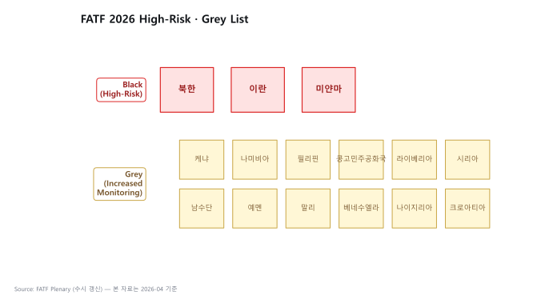

# FATF — 국제 자금세탁방지 표준

> Financial Action Task Force. 가상자산 AML의 **모든 룰의 출발점**. 이 글을 읽고 나면 왜 한국 특금법이 FATF 권고 때문에 개정됐는지, 그리고 Grey/Black List가 어떻게 한 나라 경제 전체를 움직이는지 이해하게 됩니다. 마지막 업데이트: 2026-04-17.

## TL;DR
- FATF는 1989년 G7이 설립한 정부간 기구. **법은 안 만들고 권고(Recommendation)** 발표
- 회원국은 권고를 국내법으로 도입 → **상호평가(ME)** 로 점수 매김 → 낮으면 **Grey·Black List**
- 가상자산 핵심 권고: **R.15** (VASP에 AML/CFT 부과), **R.16** (Travel Rule)
- 한국은 FATF 회원국 + APG 회원 → 권고 미이행 시 직접 페널티
- **2025-06-18, R.16 개정** → 2030년 말 발효, VASP는 별도 tailored framework로 적용
- **2026 후반에 가이던스 발표 예정**

---

## 1. FATF 기본 구조 — 법 아닌 "권고"

### 왜 법이 아니라 권고인가

FATF는 UN처럼 주권을 가진 국제기구가 아니라 **G7이 설립한 정부간 작업반(task force)**. 조약을 맺을 권한이 없어서 각국에 강제할 법적 수단이 없습니다. 대신 **"권고를 따르지 않으면 공개 망신"** 이라는 방식으로 작동. 이게 뜻밖에 효과적인 이유는 아래 7번 Grey·Black List 섹션에서 자세히.

| 항목 | 내용 |
|---|---|
| 설립 | 1989년 (G7 파리정상회의) |
| 본부 | 파리 (OECD 내 사무국) |
| 회원국 | 39개 (한국 포함) + 2개 지역기구 (EU, GCC) |
| 한국 가입 | 2009년 |
| 역할 | AML·CFT·CPF 국제 표준 설정 + 회원국 평가 + 비협력국 식별 |

용어:
- **APG (Asia-Pacific Group on Money Laundering)** — FATF의 아시아·태평양 지역 그룹. 한국은 FATF 회원이면서 APG 회원이기도 함.
- **CFT (Combating the Financing of Terrorism)** — 테러자금조달방지.
- **CPF (Counter-Proliferation Financing)** — 대량살상무기 확산금융 차단.

### 실무 포인트

한국이 FATF 회원국이라는 건 "한국 규제가 이미 FATF 권고에 맞춰져 있다"는 의미. 특금법·이용자보호법 조항을 읽다가 이해가 안 되면 **FATF 권고 원문을 찾아보는 것이 최단 경로**입니다. 한국 법이 왜 그렇게 설계됐는지가 FATF 원문을 읽으면 명확해집니다.

---

## 2. FATF 40 Recommendations — 가상자산 핵심만

### 전체 구조

FATF 권고는 40개로 구성됩니다. 그중 가상자산 AML에 직접 영향을 주는 건 몇 개에 불과합니다. 이 핵심 몇 개를 숙지하는 게 나머지 규제 학습의 기반.

### Recommendation 15 — New Technologies

- 신기술(가상자산 포함)에서 발생하는 ML·TF 위험을 평가하고 관리할 의무
- **2018년 개정**: 가상자산(VA)과 가상자산사업자(VASP)를 명시적으로 포함
- VASP는 AML·CFT 의무를 다른 금융기관과 동일하게 부담

**왜 이게 전환점인가**: 2018년 이전까지 가상자산은 "기존 금융기관 관점에서 약간 있는 부분"으로 다뤄졌지만, R.15 개정으로 **VASP가 독립 규제 대상**으로 편입. 한국 특금법 2020 개정, EU MiCA, 미국 FinCEN 가이던스가 모두 이 개정의 파생물.

### Recommendation 16 — Wire Transfers (Travel Rule)

- 송금 시 **송신인·수신인 정보를 함께 동반(travel)** 해야 한다는 룰
- **2019년 개정** (Travel Rule을 가상자산까지 확장): VASP 간 가상자산 이전에도 적용
- **2025-06-18 개정**: 결제 산업 변화 반영, 2030년 말 발효
- VASP는 직접이 아닌 **별도 tailored framework**로 적용

### Recommendation 1 — Risk-Based Approach

**위험기반접근(RBA)** — 모든 AML 의무의 운영 원칙. 고객·상품·지역 위험에 비례해 통제 강도를 맞추는 철학.

### Recommendation 10~12 — Customer Due Diligence

CDD, EDD, PEP에 대한 표준. 한국 특금법 §5의2의 원형.

### Recommendation 20 — STR

의심거래 보고 의무. 한국 특금법 §4의 원형.

### Recommendation 22 — DNFBPs

비금융 전문가(변호사·회계사·부동산·카지노·귀금속상)에 대한 AML 의무. 가상자산과 직접 관계는 적지만 "AML 의무자의 범위가 이렇게 넓다"는 맥락 이해에 유용.

### 실무 포인트

회사 AML 정책 문서 맨 앞에 **"본 정책은 FATF R.10·R.15·R.16·R.20에 근거한다"** 를 명시하면, 규제 검사관이 문서 구조를 즉시 이해하고, 임직원 교육에서도 "이 룰의 근거가 어디인가"를 거슬러 설명할 수 있습니다. 이게 성숙한 AML 프로그램의 표식.

---

## 3. VASP 정의 — FATF Glossary 원문

FATF는 VASP를 다음과 같이 정의합니다:

> A **virtual asset service provider** is any natural or legal person who, as a business, conducts one or more of the following activities for or on behalf of another natural or legal person:
> 1. Exchange between virtual assets and fiat currencies
> 2. Exchange between one or more forms of virtual assets
> 3. Transfer of virtual assets
> 4. Safekeeping and/or administration of virtual assets
> 5. Participation in and provision of financial services related to an issuer's offer and/or sale of a virtual asset

한국 특금법의 VASP 정의(§2)와 **사실상 동일** — 특금법이 FATF 원문을 거의 그대로 차용한 결과입니다.

---

## 4. Travel Rule (R.16) 핵심 요건

VASP가 다른 VASP에게 가상자산을 이전할 때, **임계금액(threshold) 이상이면** 다음 정보를 함께 전달:

**송신인 (Originator):**
- 이름
- 계좌번호 또는 가상자산 주소
- 주소, 신원확인번호(국가식별번호 등) 또는 출생지·생년월일

**수신인 (Beneficiary):**
- 이름
- 계좌번호 또는 가상자산 주소

**임계금액:**
- FATF 권고: **USD·EUR 1,000** (각국 자율 결정)
- 한국: **100만원** (특금법)
- 미국: **$3,000** (FinCEN)
- EU TFR: **임계금액 없음 (모든 거래)**

수신 측 VASP는 받은 정보를 검증하고, **누락·이상 시 보류 또는 거절** 가능.

### 실무 포인트

FATF 권고의 임계금액 $1,000이 각국에 따라 달라진다는 점이 운영 복잡도의 원인. 한국 VASP가 EU 카운터파티와 거래 시 **EU 기준(임계 없음)** 을 따라야 하며, 이게 "가장 엄격한 관할 기준으로 시스템을 설계해야 글로벌 영업 가능"한 원리입니다.

---

## 5. 2025-06-18 R.16 개정의 의미

### 왜 개정했나

- 결제 산업 변화 — 실시간 결제, ISO 20022, 새로운 사업자, 메시징 표준
- 기존 R.16이 SWIFT 시대 기준이라 안 맞는 부분 발생

### 핵심 변화

- 메시징 표준 명확화
- VASP는 **별도 tailored framework**로 적용 (Virtual Asset Contact Group이 작업)
- 가이던스 **2026 후반** 발표 예정

### 일정

- 발효: **2030년 말**
- 각국이 그 전까지 국내법화

### 실무 포인트

2025-06 개정은 **"지금 당장의 변화가 아닌 5년 준비 기간"** 입니다. 2026년 현재 대부분 VASP는 여전히 2022년 R.16 기반으로 운영 중이며, 2030년 새 기준 발효까지 여유가 있습니다. 다만 신규 Travel Rule 시스템을 도입할 때는 **"지금 기준"만 보지 말고 "2030 기준에 맞게 진화 가능한 시스템"** 인지를 선택 기준에 포함시켜야 합니다.

---

## 6. 상호평가 (Mutual Evaluation, ME)

### 메커니즘

FATF가 회원국의 AML·CFT 이행을 평가하는 공식 절차. 평가 주기는 **5~7년**.

**평가 항목 두 축:**
1. **Technical Compliance** — 법·규제가 권고와 일치하는가
2. **Effectiveness** — 실제로 작동하는가 (11개 Immediate Outcome)

**점수 등급:**
- **C** (Compliant) / **LC** (Largely Compliant) / **PC** (Partially Compliant) / **NC** (Non-Compliant)

### 한국 ME 결과 (4차 라운드, 2020년)

전반적으로 양호하나 **VASP·가상자산 영역 약점** 지적 → 이후 특금법 개정의 동인이 됨.

### 실무 포인트

한국이 다음 ME 사이클(2027~2028 예상)에서는 가상자산 영역이 훨씬 깊이 평가됩니다. 현재 Travel Rule 미연결 카운터파티 처리 등에서 약점이 있으면 다음 평가에서 Largely Compliant 이하 등급을 받을 가능성이 있고, 이게 감독당국이 검사 강도를 높이는 동기가 됩니다.

---

## 7. Grey List · Black List — 소프트 파워가 작동하는 방식

### 리스트의 의미

| 리스트 | 의미 | 2026 예시 |
|---|---|---|
| **Black List (High-Risk Jurisdictions)** | 강화된 대응조치 (counter-measures) 적용 | 북한, 이란, 미얀마 |
| **Grey List (Increased Monitoring)** | 강화 모니터링 | 케냐, 나미비아, 필리핀 등 (수시 변경) |

### 왜 무서운가

FATF는 법적 강제력이 없음에도 **Grey·Black List가 사실상 경제 제재**처럼 작동합니다:

- 외국 은행이 그 나라 금융기관과의 **환거래(correspondent banking) 관계**를 끊거나 제한
- 국가 신용등급 강등, 자본 유출
- 외국인 투자 기피
- 그 나라 기업의 글로벌 영업 어려움

터키·남아공·파키스탄이 Grey List 등재 기간에 이 압력을 체감했고, 이게 FATF 권고 이행의 실질적 강제 메커니즘입니다.

### 실무 포인트

회사 AML 정책에서 "FATF Grey·Black 국가 고객은 자동 EDD 대상"으로 설정하는 건 표준 운영. 특히 Black List 국가는 사실상 거래 거절이 통상적. 리스트는 **FATF 공식 사이트에서 주기 업데이트**되므로 KYT 벤더 스크리닝 feed에 반영되는지 확인해야 합니다.

---

## 8. FATF의 Sunrise Issue (가상자산 특화)

- VASP A국이 Travel Rule을 시행했는데, B국은 아직 안 했음
- A국 VASP가 B국 VASP에게 송금하려는데, B국 VASP는 메시징 받을 인프라가 없음
- → **글로벌 동시 적용이 안 되어 발생하는 호환성 공백**

**해결책**: Notabene Gateway, VerifyVASP 같은 멀티프로토콜 게이트웨이. 자세한 내용은 [`../3-crypto-aml/travel-rule.md`](../3-crypto-aml/travel-rule.md) 참조.

---

## 9. FATF 발간물 — 가상자산 관련 필수 문서

| 문서 | 발행 |
|---|---|
| **Updated Guidance for a Risk-Based Approach to Virtual Assets and VASPs** | 2021-10 |
| **Targeted Update on Implementation of FATF Standards on VAs and VASPs** | 매년 발간 (가장 최근 2025) |
| **Best Practices on Travel Rule Supervision** | 2025-06 발표 |
| **Explanatory Note for Revised R.16** | 2025-06 |

### 실무 포인트

FATF는 매년 **Targeted Update**를 발간해 회원국 가상자산 이행 현황을 공개합니다. 이 문서가 한국 FIU 정책 방향을 예고하는 **선행 지표**로 자주 쓰이므로, 발표될 때마다 가상자산 섹션을 확인하는 게 유용합니다.

---

## 10. 그래서 회사 차원에서 뭘 해야 하나

1. **R.15 + R.16 영문 원문**을 한 번 읽어둘 것
2. 한국이 **상호평가**에서 어떻게 평가받는지 추적 → 다음 평가 사이클에서 VASP 영역 더 본다
3. **2025-06 R.16 개정**의 영향 모니터링 — 2026 후반 가이던스 발표를 trigger로 내부 정책 업데이트
4. **Sunrise Issue** 대응 — 카운터파티 VASP의 Travel Rule 솔루션 호환성 점검

## 💼 실무 현장 (Industry Reality)

### Grey List 등재가 VASP에 미친 실제 영향 (터키·남아공 사례)

**터키 (2021-10 Grey → 2024-06 해제)**

- FATF ME에서 Travel Rule 미흡·PEP 스크리닝 부실 지적
- 등재 직후 **터키 리라 환율 ~20% 급락** + 외국은행의 correspondent banking 축소
- 대응: 가상자산법 2024-01 발효 → CMB(Capital Markets Board)가 VASP 라이선스 담당, 60여 개 거래소 중 ~30개 신청
- 2024-06 해제 과정에서 **고객 KYC 전수 재확인**과 STR 시스템 상용화가 핵심 조건

**남아공 (2023-02 Grey → 2025-10 해제)**

- 지적 사항: UBO(실소유자) 데이터베이스 부실, FIC(남아공 FIU) 분석 역량 부족
- 대응: Companies Act 개정으로 UBO 등록부 공공 접근 확대 + FIC 예산 증액
- 로컬 VASP 담당자 증언 — "Grey 등재 기간에 글로벌 거래소가 신규 계좌 신청을 중단했다"

### 회원국 감독기관별 실제 역할

| 국가 | FIU | 시장·가상자산 감독 | 제재 |
|---|---|---|---|
| 한국 | KoFIU (금융위 산하) | FSC · FSS | 외교부 제재대상자 |
| 미국 | FinCEN (재무부) | SEC · CFTC · 주 DFS | OFAC |
| EU | 2025-07 출범한 **AMLA**(프랑크푸르트) | ESMA + 각국 NCA | EU Consolidated List |
| 일본 | JAFIC (국가공안위) | FSA | 외무성 |
| 싱가포르 | STRO | MAS | MAS targeted |

AMLA(Authority for Anti-Money Laundering)는 2028년부터 EU 40개 고위험 VASP를 **직접 감독**하는 게 목표 — 글로벌 최초의 **초국가 AML 감독기구**.

### ME 실무 — Assessment Visit은 어떻게 진행되나

- **5~7년 주기**, 한국은 4차(2020) 완료 → 5차 **2027~2028 예상**
- 사전: FATF 사무국에 자국 AML 체계 답변서(수천 페이지) 제출
- 현장 방문: 평가관 6~8명이 1~2주 머물며 **FIU·은행·VASP·법원 인터뷰**
- VASP는 **Upbit·Bithumb·Coinone·Korbit가 샘플링 대상**으로 뽑힐 가능성 큼
- 인터뷰 질문: "STR 결정 프로세스를 보여달라", "Travel Rule 실패 거래 로그를 보여달라"

### 한국 VASP가 FATF 업데이트를 실무에 반영하는 루틴

1. **월례 모니터링** — FATF Plenary 발표(연 3회)·Targeted Update 공개 시 AMLO에게 자동 알림
2. **Grey/Black List 변경** → 내부 country risk table 즉시 업데이트 → 고위험국 고객 자동 EDD 트리거
3. **R.16 2025 개정** → 2026 후반 가이던스 발표 시 Travel Rule 시스템 벤더(VerifyVASP·CODE)와 로드맵 확인
4. **FATF Best Practices** 문서 → 사내 SOP 개정 근거로 인용

### 자주 나오는 오해

- **"FATF 권고는 가이드라인일 뿐"** — 법적으론 맞지만 Grey List 등재 시 **국가 경제 충격**이 막대. VASP 입장에선 특금법만큼 실질적 강제력.
- **"R.16 개정은 2030년 일이니 지금 신경 쓸 필요 없다"** — Travel Rule 벤더 선정·시스템 아키텍처는 3~5년 주기라 지금 결정이 2030 체계에 묶임.
- **"한국은 FATF에서 늘 잘했다"** — 4차 ME에서 가상자산 영역은 **Partially Compliant**. 5차에서 더 깊이 본다.

### 한국 특수 현실

- **금융위·FIU가 FATF TF에 상시 참여** — 한국 출신 위원이 VACG(Virtual Asset Contact Group)에서 활동 중
- **KoFIU 조직도**: 원장(금융위 출신) + 기획행정실 + 심사분석실 + 정보분석실 (약 100명 규모)
- **한국 VASP는 APG Mutual Evaluation 샘플링 대상** — 즉 한국 ME 시 4대 거래소 전수 인터뷰 가능성

---

## 더 읽을거리
- [`korea-fiu-act.md`](korea-fiu-act.md) — 특금법이 FATF를 어떻게 반영했는지
- [`../3-crypto-aml/travel-rule.md`](../3-crypto-aml/travel-rule.md) — Travel Rule 운영 상세
- [FATF — Virtual Assets](https://www.fatf-gafi.org/en/topics/virtual-assets.html)
- [FATF — Recommendations 원문](https://www.fatf-gafi.org/en/publications/Fatfrecommendations/Fatf-recommendations.html)
- [FATF — 2025 Targeted Update on VAs and VASPs](https://www.fatf-gafi.org/content/dam/fatf-gafi/recommendations/2025-Targeted-Upate-VA-VASPs.pdf.coredownload.pdf)
- [FATF — Updated R.16 Explanatory Note](https://www.fatf-gafi.org/content/dam/fatf-gafi/recommendations/Explanatory%20note%20for%20revised%20R.16.pdf.coredownload.pdf)
