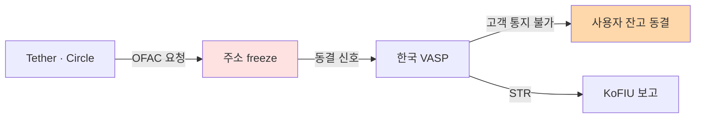

# 미국 — BSA, FinCEN, OFAC

> 미국 가상자산 AML 체계: **BSA → FinCEN (자금세탁) + OFAC (제재) → GENIUS Act (스테이블코인)**. 이 글을 읽고 나면 왜 한국 VASP도 사실상 미국 룰의 영향을 받는지, 그리고 미국의 "분절된 규제 체계"가 만들어내는 컴플라이언스 부담을 이해하게 됩니다. 마지막 업데이트: 2026-04-17.

## TL;DR
- **BSA (Bank Secrecy Act, 1970)** — 미국 AML의 모법. 2001 USA PATRIOT Act로 강화
- **FinCEN** — 미국 FIU. 가상자산은 **MSB (Money Services Business)** 로 등록 의무
- **OFAC** — 제재 집행 기관. **SDN List에 가상자산 지갑주소 등재** (Lazarus, Tornado Cash 등)
- **2025-07 GENIUS Act** — 스테이블코인을 BSA 적용 대상으로 명시
- **2026-04-08** FinCEN + OFAC 합동 제안 → 시행규정 **2026-07-18 마감**, 전면 시행 **2027-01-18**
- 2025년 강력한 enforcement: **OKX $500M+ DOJ 합의, Paxful $3.5M FinCEN 벌금**

---

## 1. BSA — 미국 AML의 토대

### 1970년부터 온 법

**BSA (Bank Secrecy Act)** 는 정식 명칭이 "Currency and Foreign Transactions Reporting Act". 이름에서 보듯 1970년대 **현금 다발 추적**이 문제의 출발점이었습니다. 그 시대 마약 카르텔이 수표·현금을 미국 은행에 다발로 입금하는 걸 막으려 만든 법이 오늘날 가상자산 AML의 뿌리.

| 항목 | 내용 |
|---|---|
| 제정 | 1970 (Bank Secrecy Act = Currency and Foreign Transactions Reporting Act) |
| 핵심 의무 | CTR ($10,000+), SAR (의심거래), 기록보관, AML 프로그램 운영 |
| 2001 PATRIOT Act | KYC + EDD + 외국 PEP + 환거래은행 |
| 적용 | 은행 + MSB + 증권회사 + 카지노 + 선물중개업자 + (가상자산) |

### USA PATRIOT Act의 의미

2001년 9·11 이후 제정된 USA PATRIOT Act는 BSA를 **대폭 확장**했습니다. 특히:
- **KYC 의무 강화** — 이전에는 "의심되면 확인"이었지만 이제 **모든 고객에 대한 CIP(Customer Identification Program)** 의무
- **외국 PEP** — 고위 외국 공직자 EDD 명시
- **환거래은행(correspondent banking) 규제** — 해외 은행이 미국 달러망에 접근할 때 추가 심사

이게 지금 한국 특금법에 그대로 이식된 구조입니다.

### 실무 포인트

한국 VASP가 "왜 우리가 미국 법을 공부해야 하나"를 묻는다면 답은 간단: **미국 BSA가 FATF 권고의 원형**이고, 한국 특금법이 **그 FATF 권고의 한국화 버전**입니다. 즉 한국 법을 깊이 이해하려면 미국 BSA의 논리를 알아야 합니다.

---

## 2. FinCEN — 미국 FIU

### 정체성

- **풀이**: Financial Crimes Enforcement Network
- **소속**: 미국 재무부
- **역할**: BSA 시행, SAR·CTR 수집·분석, 정책 발표, MSB 등록 관리

### 가상자산 = MSB

2013년 FinCEN 가이던스: **가상통화 administrator/exchanger는 MSB**. MSB로 등록하면 AML 프로그램 + SAR + 기록보관 의무가 발생합니다. 거래소뿐 아니라 mixer·wallet provider도 해석상 해당될 수 있습니다.

용어:
- **MSB (Money Services Business)** — 송금·환전·가치전송 등을 하는 비은행 금융사업자. 미국 가상자산 업체가 속한 카테고리.
- **CVC (Convertible Virtual Currency)** — 법정화폐로 환전 가능한 가상통화. FinCEN의 정식 용어.

### Travel Rule (FinCEN 버전)

- BSA Travel Rule (1996년부터): **$3,000 이상** 송금 시 송수신인 정보 동반
- 가상자산에도 적용 (2019년 재확인)
- FATF 권고($1,000)보다 임계금액이 높음

### 주요 FinCEN 가이던스

- 2013-03-18: 가상통화 가이던스 (FIN-2013-G001)
- 2019-05-09: CVC(Convertible Virtual Currency) 모델 가이던스
- 2020-10-23: Travel Rule 가상자산 적용 명확화 제안
- 2024~2025: Mixer 관련 정보수집 명령

### 실무 포인트

FinCEN의 "Primary Concern" 지정은 사실상 특정 사업자·관할을 **시장에서 퇴출**하는 효과가 있습니다. 2020년대 들어 특정 외국 거래소·믹서가 Primary Concern으로 지정되면 미국 금융기관과의 관계가 끊어지고, 한국 VASP도 이를 고려해 거래 상대를 선별하게 됩니다.

---

## 3. OFAC — 제재 집행의 글로벌 위력

### 정체성

- **풀이**: Office of Foreign Assets Control
- **소속**: 미국 재무부
- **역할**: 경제·무역 제재 집행 (이란·북한·러시아·베네수엘라 등 + 테러조직 + 마약카르텔)

### SDN List (Specially Designated Nationals)

- 거래 금지 대상자 명단
- **가상자산 지갑주소도 등재** — 거래 시 미국법 위반

### 가상자산 SDN 사례 (시간순)

| 연도 | 대상 | 비고 |
|---|---|---|
| 2018 | 이란 비트코인 주소 (Marinov, Khorashadizadeh) | OFAC 첫 가상자산 SDN |
| 2020 | 러시아 Lazarus 관련 주소 | DPRK 자금세탁 차단 |
| 2022-08 | **Tornado Cash 스마트컨트랙트** | DeFi 첫 제재, 큰 논쟁 |
| 2022-11 | Hydra Market | 다크넷 |
| 2024 | Garantex 추가 제재 | 러시아 거래소 |
| **2025-03-21** | **Tornado Cash 제재 해제** | 5th Circuit 패소 후 |

### Tornado Cash 제재의 의미

- 미국 첫 **스마트컨트랙트 자체 제재**
- 2024-11 5th Circuit: "OFAC이 권한을 초과했다, 컨트랙트는 'property'가 아니다" 판결
- 2025-03 OFAC이 제재 해제
- **DeFi 영역에서 OFAC의 한계가 드러난 사건** — 향후 입법으로 보완 시도

자세한 내용은 [`../6-cases/tornado-cash.md`](../6-cases/tornado-cash.md) 참조.

### 실무 포인트

OFAC은 한국 법이 아니지만 한국 VASP에게 **실질적 강제력**이 있습니다. 이유는 6번 "미국 외부 영향력" 섹션에서 자세히. 결론만 말하면 OFAC 제재 준수는 **선택이 아니라 필수**.

---

## 4. 주요 Enforcement 사례 (가상자산)

### 이 표를 어떻게 읽어야 하나

벌금 규모의 궤적: $98K → $100M → $4.3B. 이 5년간의 10,000배 증가가 미국 규제당국이 **가상자산 산업 "학습기"에서 "본격 집행기"로 전환**했음을 보여주는 지표.

| 연도 | 대상 | 벌금 | 사유 |
|---|---|---|---|
| 2020 | BitMEX | $100M | KYC 미흡, AML 프로그램 결여 |
| 2021 | BitGo | $98K | OFAC 제재 위반 |
| 2022 | Bittrex | $29M | OFAC + FinCEN 결합 |
| 2023 | **Binance** | **$4.3B** | 역대 최대, AML·제재 복합 |
| 2023 | Kraken | $30M (SEC) | (등록 미신고) |
| 2024~2025 | **OKX** | **$500M+ DOJ** | KYC 약함, 수십억 의심거래 |
| 2025 | **Paxful** | **$3.5M FinCEN** | $500M 불법자금 처리 |

**BSA 위반 + 제재 위반 결합 처벌**이 트렌드. CCO 개인 처벌도 증가.

### 실무 포인트

Binance 사례 이후 업계의 규제 대응 투자가 수직 상승했고, 한국 VASP도 **미국 고객 영업 여부와 무관하게** 자체 AML 수준을 미국 기준으로 맞추는 추세입니다. 글로벌 고객·USDT 사용·AWS 클라우드 등 어느 하나로도 미국 관할에 닿기 때문.

---

## 5. GENIUS Act (2025-07 통과) — 스테이블코인의 BSA 편입

### 정체성

- **풀이**: Generating Innovation in Unified Stablecoins Act
- 의미: **payment stablecoin을 BSA 적용 대상으로 공식화**

### 발행자 의무

- AML 프로그램
- KYC + CDD
- 거래 모니터링
- SAR 보고
- **OFAC 스크리닝**
- **freeze, burn, reject 능력 의무화** — 스마트컨트랙트 레벨에서 제재 대상 거래 차단

### 시행 일정

- **2026-07-18**: 시행규정(implementing regulations) 발표 마감
- **2027-01-18**: 전면 enforcement 시작

### 2026-04-08 FinCEN + OFAC 합동 제안

- 스테이블코인 발행자가 BSA + 제재 의무 이행하는 구체적 방법 제안
- 1차 시장(발행·상환)뿐 아니라 **2차 시장(거래)** 까지 컴플라이언스 책임 확장

### 실무 포인트

GENIUS Act는 Tether·Circle 같은 발행자에게 큰 영향. 한국에 진출한 USDC·USDT 사용 시에도 **freeze 정책의 영향이 한국 거래소까지** 미치게 됩니다. 한국 VASP는 스테이블코인 상장 정책 수립 시 "발행자가 freeze 실행 시 우리 플랫폼에서 어떻게 처리할지"를 미리 SOP에 반영해야 합니다.

---

## 6. 미국 외부 영향력 — 역외 적용의 4가지 지렛대

미국은 법적으로 한국 VASP에 직접 제재를 강제할 수 없지만, 다음 4가지 지렛대로 사실상 글로벌 적용을 달성합니다.

1. **USD 결제망** — 환거래 은행을 통해 모든 달러 거래에 영향력
2. **OFAC 2차 제재** — 미국인이 아니어도 SDN과 거래하면 미국 시장 접근 차단
3. **Cloud·Infra 의존도** — AWS, Cloudflare, Github 등이 OFAC 준수
4. **달러화 스테이블코인 (USDC, USDT)** — 발행자가 미국 OFAC 준수 의무

### 실무 포인트

4번 달러 스테이블코인 의존도가 가장 강력한 지렛대입니다. 한국 거래소에서 USDT 거래가 차지하는 비중이 크므로, Tether가 OFAC 요청으로 특정 주소를 freeze하면 한국 사용자가 직접 영향을 받습니다. 이게 한국 감독당국이 원화 stablecoin 자체 발행을 고민하는 배경 중 하나.

---

## 7. SEC vs CFTC vs FinCEN — 분절된 미국 가상자산 규제

### 한 사업자가 4~5개 기관에 대응

미국은 가상자산을 한 기관이 다 보지 못합니다. 한국의 (FIU + 금융위·금감원) 단순함과 대비.

| 기관 | 시각 | 다루는 것 |
|---|---|---|
| **SEC** | "대부분 증권" | 토큰 발행, 거래소 등록 |
| **CFTC** | "BTC·ETH는 상품" | 파생상품, 시장 조작 |
| **FinCEN** | "AML 의무자" | MSB 등록, SAR |
| **OFAC** | "제재 집행" | SDN 차단 |
| **OCC** | "은행 감독" | 은행의 가상자산 사업 |
| **IRS** | "세무" | 자산으로 과세 |

### 실무 포인트

미국 시장 진출 시 이 분절성이 가장 큰 비용 요인. 하나의 상품이 여러 기관의 관할에 동시에 걸릴 수 있고, 기관 간 해석이 충돌하기도 합니다. 한국 회사가 미국 진출할 때는 **법무법인 자문이 처음부터 끝까지 필수**이며, 이 비용이 단독 영업보다 M&A를 통한 진입이 선호되는 이유이기도 합니다.

---

## 8. 한국 사업자가 알아야 할 미국 룰

### 상황별 적용

| 상황 | 적용 |
|---|---|
| 한국에서만 영업 | 직접 적용 X, 단 OFAC 제재는 항시 의식 |
| 미국 고객 받음 | **MSB 등록 + 주별 Money Transmitter License** |
| USD 결제망 사용 | OFAC 준수 (사실상 모든 달러 거래) |
| USDC·USDT 사용 | 발행자가 OFAC 따름 → freeze 가능성 |
| 라자루스 의심 거래 | 미국 사법공조 요청 가능성 |

### 실무 포인트

위 표의 "한국에서만 영업" 케이스도 **OFAC 준수는 항시 의식**이 필요합니다. 한국 고객이 OFAC SDN 주소로 출금하려 하면 미국법상 위반이 되고, 그 거래가 USDT로 이루어지면 Tether가 freeze해 결과적으로 우리 고객의 자금 손실이 발생. 사용자 UX·고객 민원 대응까지 모두 미국 룰의 영향을 받는 구조입니다.

---

## 💼 실무 현장 (Industry Reality)

### SAR 제출 실무 — FinCEN BSA E-Filing

한국 FIU-TIS 수기 업로드와 달리 **FinCEN은 완전 API 자동화** 제공:

- **BSA E-Filing System** — 대형 VASP는 자체 시스템에서 직접 SAR 자동 생성·제출
- **제출 기한**: 의심 판단일로부터 **30일 내** (예외 시 60일)
- **확장 기한**: 추가 조사 필요 시 연장 가능
- **Supplemental SAR**: 추가 정보 발견 시 보완 제출

**Coinbase·Kraken·Gemini 실무**: 자체 케이스 관리 시스템(예: Coinbase의 내부 툴)에서 분석가가 SAR 초안 작성 → 시니어 리뷰 → 자동 XML 생성 → FinCEN API 전송 → 제출 번호 수신까지 **1일 내 처리 가능**.

### FinCEN 현장 인터뷰(Enforcement Interview) 경험담

FinCEN 검사는 한국 FIU보다 **공격적**:

- 2~3일 현장 방문 + 분석가 개별 인터뷰
- "최근 3개월 dispositioned alert 10건을 무작위로 보여달라"
- "SAR 결정 당시 AMLO와 어떤 대화가 있었나" — Slack·이메일 로그 요구
- 불이행 시 **civil money penalty**(민사벌금) 즉시 부과 가능

### MSB 등록 + 주별 Money Transmitter License (MTL)

미국 진출의 가장 큰 허들은 **주별 라이선스**:

| 주 | 라이선스 | 특징 |
|---|---|---|
| New York | **BitLicense** (NYDFS) | 가장 까다로움, 연 수십만 달러 비용 |
| California | Money Transmission License | 2024년 가상자산 명시 개정 |
| Texas | MTL | 상대적으로 순함 |
| Wyoming | Special Purpose Depository Institution | 가상자산 친화 |

**50개 주 모두 라이선스 획득 = 수백만 달러 + 2~3년** 소요. Coinbase·Kraken·Gemini는 보유, Binance.US는 대폭 축소, 다수 외국 거래소는 뉴욕 철수.

### GENIUS Act 시행 실무 영향

한국 VASP 입장에서 GENIUS Act 대응:

1. USDC·USDT 상장 토큰의 **freeze 이벤트 모니터링 자동화**(Circle API, Tether blockchain log)
2. Freeze 발생 시 **15분 내 사용자 출금 정지 + AMLO 브리핑** SOP
3. 사용자 민원 대응 스크립트 사전 준비 (Tipping-off 리스크 고려)

### 자주 나오는 오해

- **"한국만 영업하면 미국 법 무관"** — USD·USDT·AWS 중 하나라도 쓰면 **OFAC 준수 필수**. 사실상 모든 한국 VASP에 적용.
- **"FinCEN이 특정 거래소를 제재하면 끝"** — 실제론 **Section 311 Special Measure**(환거래은행 차단)가 더 무서움. 2021년 FATF Non-Cooperating Jurisdiction 전례.
- **"BitLicense만 있으면 미국 전역 영업"** — NY만 커버. 50개 주 개별 라이선스 필요.

### 연봉·조직 숫자 (2026 기준)

- **Coinbase**: 컴플 ~500명 (전사 ~14%), 3분할(FCI·Sanctions Ops·AML Advisory), 주니어 $90~120K + equity
- **Kraken**: 컴플 ~200명 (전사 ~10%)
- **Gemini**: NY BitLicense 대응 특화 조직
- **Binance.US**: DOJ 합의 후 5개 hub AMLO + 외부 모니터 2024-2029 상주

### 한국 VASP가 미국 룰에서 가장 자주 놓치는 것

- **Tether freeze 대응 시간**: 글로벌 평균 30분, 한국은 주말·야간에 1~2시간 지연 사례
- **OFAC SDN.XML 일일 diff**: 주소 필드(`<feature><type>Digital Currency Address</type>`) 파싱 자동화 필요
- **2차 제재(Secondary Sanctions)**: 러시아·이란 관련 고객의 직접 제재 대상이 아니어도 **간접 지원 행위**로 적용 가능

---

## 더 읽을거리
- [`korea-fiu-act.md`](korea-fiu-act.md) — 한국 특금법과 비교
- [`fatf.md`](fatf.md) — FATF가 미국에 어떻게 평가받는지
- [`../6-cases/tornado-cash.md`](../6-cases/tornado-cash.md) — Tornado Cash 제재 상세
- [`../6-cases/major-enforcement.md`](../6-cases/major-enforcement.md) — Binance·OKX·Paxful 상세
- [FinCEN 공식 사이트](https://www.fincen.gov/)
- [OFAC SDN List 검색](https://sanctionssearch.ofac.treas.gov/)
- [Treasury — Tornado Cash 제재 보도자료 (2022)](https://home.treasury.gov/news/press-releases/jy0916)
- [Latham — US Crypto Policy Tracker](https://www.lw.com/en/us-crypto-policy-tracker/regulatory-developments)
