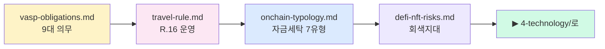

# 3️⃣ Crypto AML — 가상자산 특화 의무·패턴

> 전통 AML이 **가상자산 특수성**과 만나는 층. VASP가 실제로 떠안는 의무·Travel Rule·자금세탁 패턴을 정리합니다. 마지막 업데이트: 2026-04-20.

## 누가 먼저 읽어야 하나

- 🏢 가상자산 거래소·수탁·지갑 서비스에서 AML 업무를 맡은 실무자
- 🔗 Travel Rule·KYT 연동 엔지니어 (IVMS101 메시지가 뭔지 코드 레벨에서 필요)
- 🕵️ 조사·수사·법률 자문에서 **가상자산 특유 패턴**(mixer·peel chain·cross-chain)을 이해해야 하는 사람

## 읽는 순서

## 파일 인덱스

| # | 파일 | 핵심 질문 | 배우고 나면 |
|---|---|---|---|
| 1 | [`vasp-obligations.md`](vasp-obligations.md) | VASP가 해야 할 일 9가지가 뭔가? | "AML 프로그램 있다"는 주장을 체크리스트로 검증 |
| 2 | [`travel-rule.md`](travel-rule.md) | 송수신인 정보를 왜·어떻게 동반해야 하나? | Sunrise Issue·한국 100만원 임계·2벤더 구조 설명 가능 |
| 3 | [`onchain-typology.md`](onchain-typology.md) | 실제로 어떻게 세탁하는가? | KYT가 탐지하려는 7~9패턴의 원리·탐지 난이도 설명 |
| 4 | [`defi-nft-risks.md`](defi-nft-risks.md) | 사업자 없는 영역은 누가 책임지나? | DeFi·NFT·Privacy coin 규제가 왜 지연되는지 이해 |

## 핵심 출구

- VASP 9대 의무를 7개 이상 외운다
- Travel Rule 한국 임계(100만원)·EU TFR(임계 없음)·미국 FinCEN Rule(3,000달러→1,000달러 제안) 차이 설명
- Peel chain·Smurfing·Chain hopping·Mixer·Privacy coin·NFT wash trading·Flash loan abuse 각각 **1문장 정의**
- Tornado Cash·북한 Lazarus와 이 문서의 유형이 어떻게 대응되는지

## 다음 단계

- 기술 스택 → [`../4-technology/README.md`](../4-technology/README.md)
- 운영 절차 → [`../5-compliance/README.md`](../5-compliance/README.md)
- 실제 사건 → [`../6-cases/README.md`](../6-cases/README.md)
- 상위 인덱스 → [`../README.md`](../README.md)
