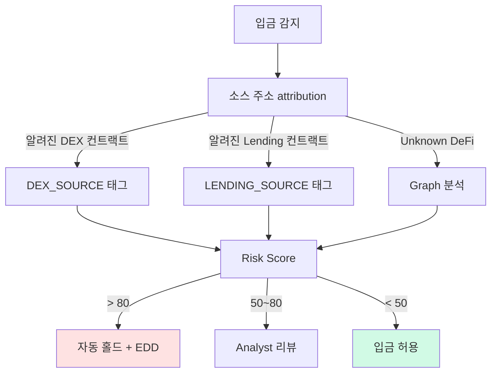

# DeFi / NFT / Privacy Coin — 특수 영역 AML 리스크

> 중앙화 VASP **외부의 회색지대**. 이 글을 읽고 나면 왜 DeFi·NFT·Privacy Coin이 "사업자 없는 자금세탁 인프라"가 됐는지, 그리고 규제가 왜 이 영역에서 계속 지연되는지 이해하게 됩니다. 마지막 업데이트: 2026-04-17.

## TL;DR
- **DeFi**: 운영자 식별 어려움 → AML 의무 적용 모호. OFAC의 Tornado Cash 제재(2022) → 2025-03 해제는 "코드를 제재할 수 있는가" 판례의 전환점
- **NFT**: wash trading + 자금이전 정당화 도구. FATF는 NFT를 사례별로 VA로 분류
- **Privacy Coin**: Monero·Zcash. 한국·일본 거래소는 사실상 상장 폐지
- **Cross-chain Bridge**: layering 핵심 인프라이자 해킹 1순위 표적
- **MEV bot · flash loan**: 가격 조작 + 자금세탁 결합 가능

---

## 1. DeFi (Decentralized Finance)

### 정체성

**DeFi**는 중개자 없이 스마트컨트랙트가 직접 lending·swap·derivatives를 처리하는 금융 인프라. 대표 프로토콜로 Uniswap(DEX), Aave(lending), Compound(lending), Curve(stablecoin AMM), MakerDAO(stablecoin 발행), GMX(derivatives) 등이 있으며 TVL(Total Value Locked, 예치 자산 가치)은 수백억 달러 규모.

용어:
- **TVL (Total Value Locked)** — 프로토콜에 예치된 자산의 총 USD 환산 가치. DeFi 지표로 가장 흔히 사용.
- **AMM (Automated Market Maker)** — 사람 중개인 없이 알고리즘이 자동 가격 결정하는 DEX 구조.
- **DAO (Decentralized Autonomous Organization)** — 거버넌스 토큰 홀더의 투표로 운영되는 조직.

### 왜 AML에서 문제인가

| 항목 | 이슈 |
|---|---|
| **운영자 식별** | DAO·익명 개발자 → **누가 VASP인가**? |
| **KYC 부재** | 사용자가 wallet만 연결, 신원 확인 없음 |
| **글로벌 즉시 접근** | 제재국 사용자도 제한 없이 사용 가능 |
| **자금세탁 도구화** | DEX swap이 layering 인프라 |
| **Fork 가능성** | 한 코드베이스가 무한 복제. 프런트엔드 차단해도 포크로 우회 |

### 규제 현황 (2026 시점)

- **FATF**: DeFi에 사실상 운영 통제권을 가진 자(developer, governance token holder)는 VASP 의무 부담 가능 (2021 가이던스).
- **미국**: 인프라법 broker 정의 확장, FIT21 등 입법 추진. 2024년 Uniswap Labs에 SEC Wells Notice 발부.
- **EU MiCA**: "fully decentralized" DeFi는 적용 제외, 단 **frontend 운영자는 적용 가능**.
- **한국**: 2단계 입법에서 다룰 예정, 현재 명확한 룰 없음.

### 회색지대 맵

```
완전 탈중앙 (코드만 존재) ──────────────── 중앙화 (회사 운영)
  ↑                                          ↑
  AML 규제 거의 불가                      VASP로 직접 적용

중간 영역 — 점점 규제 타겟이 되는 층:
- DAO 거버넌스 토큰 보유자 (비례 통제력)
- Frontend 운영자 (uniswap.org)
- Routing infrastructure
- 1inch 같은 aggregator
```

### 주요 DeFi 자금세탁 패턴

1. **Swap layering**: ETH → USDT → DAI → ETH → USDT (출처 단절).
2. **Liquidity Pool 세탁**: LP 입금 → 다른 자산으로 인출.
3. **Flash Loan Attack 결합**: 가격 조작 → 차익 인출 → 즉시 mixer.
4. **MEV bot 활용**: sandwich/arbitrage으로 자금 흐름 위장.

### 실무 포인트

"frontend 운영자가 규제 타겟이 된다"가 현재 글로벌 흐름의 핵심입니다. 프런트엔드(uniswap.org, aave.com 같은 웹페이지)를 운영하는 회사는 KYC 구현·제재 스크리닝·지역 차단이 가능하므로, 규제 압력이 여기로 몰립니다. "코드는 규제 불가"이지만 "그 코드를 사용하기 쉽게 만드는 회사는 규제 가능"이라는 논리.

---

## 2. NFT (Non-Fungible Token)

### AML 관점에서 NFT의 본질

NFT는 **고유 자산 + 가격 자율 책정 + 즉시 글로벌 거래**라는 조합을 갖습니다. 이게 의미하는 바: **거래 가격을 임의로 조작 가능** → 자금세탁자에게 매력적인 도구. 주식시장의 시세조종과 구조적으로 같은 리스크.

### 주요 패턴

| 패턴 | 설명 |
|---|---|
| **Wash trading** | 자기들끼리 NFT를 사고팔아 가격·거래량 부풀림 |
| **Self-laundering** | A 주소에서 B 주소로 NFT 매수 (사실상 같은 사람) |
| **Trading mule** | 더러운 자금으로 정당한 NFT 매수 → 합법자산화 |
| **Phishing 결합** | 가짜 NFT 민팅으로 피해자 wallet drain |
| **Royalty manipulation** | 로열티를 자기 주소로 받게 설정 |

### 시장 통계

- 2022~2023 NFT 광풍 시 wash trading 비중 추정 **25~50%** (Chainalysis)
- 2025년 NFT 시장 위축 → 거래량 자체 감소
- 그래도 high-value collection (BAYC, CryptoPunks) 중심으로는 여전 활동

### FATF·한국 입장

- **FATF (2021 가이던스)**: NFT가 **fungible해질 수 있고 결제·투자 수단으로 쓰이면** VA로 분류. 단순 collectible은 VA 아님 — 사례별 판단.
- **한국 (2024-06 FSC 가이드라인)**: 결제수단 사용, 대량발행, 펀더멘털 분할(예: 부동산 NFT 조각화) → VA로 간주. 단순 디지털 아트 NFT → 비-VA.

### 실무 포인트

NFT 마켓플레이스 운영 시 **wash trading 모니터링**은 자율 통제 수준이 아니라 **감독당국이 사실상 기대**하는 영역입니다. OpenSea·Blur·Magic Eden 같은 글로벌 대형사는 이미 자체 탐지 팀을 운영. 한국 NFT 사업자도 동일 수준을 갖추는 게 규제 부담 경감의 지름길.

---

## 3. Privacy Coin

### 대표 코인과 기술

| 코인 | 기술 | 추적 가능성 |
|---|---|---|
| **Monero (XMR)** | Ring Signature + Stealth Address + RingCT | **거의 불가** |
| **Zcash (ZEC)** | zk-SNARK shielded transaction | shielded 사용 시 불가 (선택적) |
| **Dash** | PrivateSend (CoinJoin 변형) | 제한적 추적 가능 |
| **Grin / Beam** | MimbleWimble | 어려움 |

### 각 기술의 원리 한 줄 요약

- **Ring Signature (Monero)** — 여러 명의 서명자 중 누가 실제 서명자인지 모르게. 기본적으로 "용의자가 여러 명"으로 수사를 난해하게 함.
- **Stealth Address (Monero)** — 받는 주소가 매 거래마다 새로 생성. 같은 사람이 받아도 다른 주소로 보임.
- **RingCT (Monero)** — 거래 금액 자체도 암호화. 발신·수신·금액 3요소가 모두 숨겨짐.
- **zk-SNARK (Zcash)** — 영지식 증명으로 "거래가 유효함"만 증명, 내용은 완전 숨김.

### 거래소 상장 회피 추세

- **FATF 권고**: 거래소가 privacy coin 취급 시 추가 위험관리 필요.
- **한국**: 2021년 특금법 시행과 함께 4대 거래소가 privacy coin 전량 상장폐지 (Monero, Zcash, Dash 등).
- **일본**: 2018년부터 privacy coin 상장 금지.
- **미국·EU**: 일부 거래소 상장 유지, 단 강화감시.
- 결과: privacy coin은 **OTC·P2P·비규제 거래소**로 밀려남.

### 추적 시도

- **Monero**: Chainalysis가 부분적 분석 도구 발표 (2020) — 효과는 제한적, 완전 분석은 여전 불가.
- **Zcash**: shielded 사용 비율이 낮아(대부분 transparent 사용) 분석 가능한 비중이 큼. **"선택적 프라이버시"** 는 실무상 프라이버시가 아님.

### 실무 포인트

한국 거래소에서는 privacy coin 입금을 **자동 차단**하는 게 표준. 입금 시 "알 수 없는 자산"이 도착하면 반려. 출금 시점에는 수신 주소가 privacy coin 관련 지갑(알려진 Monero exchange 주소 등)인지 KYT가 확인. 운영 부담이 크지 않은 편이지만, privacy coin을 자체 수용하려는 시도는 규제 리스크가 너무 커서 거의 없습니다.

---

## 4. Cross-chain Bridge

### 정체성

A 체인 자산을 **잠그고(lock)** B 체인에서 **wrapped 토큰**을 발행. 예: ETH를 Ethereum 컨트랙트에 잠그고 BSC에서 wETH 발행. 반대로 환원하려면 B에서 소각(burn) → A에서 해제.

### AML 관점

- **Layering 핵심 인프라** — chain 간 끊김 발생.
- 2025~2026 자금세탁 트렌드 1위가 cross-chain.
- 분석 도구가 cross-chain tracing 기능을 공격적으로 강화 중 (Chainalysis Crosschain, TRM Multichain).

### 해킹 표적 역사

브리지는 AML 관점과 무관하게 **해킹 1순위 표적**이기도. 자금이 한 곳에 집중되는 honeypot 구조.

| 사고 | 연도 | 손실 |
|---|---|---|
| Poly Network | 2021 | $611M (이후 반환) |
| Wormhole | 2022 | $325M |
| **Ronin Bridge** | 2022 | **$625M** (Lazarus) |
| Nomad | 2022 | $190M |
| Harmony Horizon | 2022 | $100M (Lazarus) |
| Multichain | 2023 | $231M |

→ 브리지가 해킹 → 자금이 다시 다른 브리지로 → 세탁. **해킹과 세탁이 같은 인프라를 순환**하는 구조.

### 실무 포인트

출금 주소가 브리지 컨트랙트이면 **고위험 카테고리**로 다뤄야 합니다. 브리지 자체가 범죄적이지는 않지만, 브리지로 나간 자금의 **다음 홉**을 추적할 수 없다면 그 시점 exposure는 사실상 unknown. 공격적 회사는 모든 브리지 출금에 자동 STR 후보 큐잉을 적용하고, 안전한 회사는 이 리스크를 감수하고 빠른 UX를 택합니다.

---

## 5. MEV · Flash Loan · 기타 DeFi 도구

### MEV (Maximal Extractable Value)

블록 생성 시 **트랜잭션 순서 조작**으로 얻는 이득. 블록 생성자(validator)나 MEV 봇이 활용.

**AML 관점**: **Sandwich attack**(피해 거래 앞뒤로 거래 끼워 넣어 가격 올리고 되돌림)으로 가격 조작 → 자금세탁·시세조종과 결합 가능.

### Flash Loan

**담보 없이** 한 트랜잭션 안에서 빌리고 갚는 대출. 한 블록 내에서 완결되어야 하며, 안 되면 트랜잭션 자체가 revert.

**AML 관점**: 가격 조작 → 차익 추출 → 즉시 mixer로. 사례: bZx, Cream Finance, Beanstalk Farms 등 플래시론 공격.

### Re-staking · LST · LRT

Lido(LST, Liquid Staking Token), EigenLayer(LRT, Liquid Restaking Token) 같은 새로운 layer. 자산이 staking 토큰으로 감싸지고 또 감싸지면 **자산 형태 변환이 가능**해 layering 도구화될 수 있음. 분석 도구가 아직 완전히 따라가지 못하는 영역.

용어:
- **LST (Liquid Staking Token)** — ETH를 staking하고 그 증표로 받는 토큰 (예: stETH).
- **LRT (Liquid Restaking Token)** — LST를 다시 restaking하고 받는 토큰.
- **Flash Loan** — 담보 없이 한 트랜잭션 내 빌리고 갚는 대출.

### 실무 포인트

LST·LRT 세탁은 2025~2026년 부상 중인 신종 유형입니다. ETH → stETH → eETH(EigenLayer) → PT(Pendle) 같은 형태로 자산을 여러 번 감싸면 원래 출처가 불투명해집니다. 이 영역에 대한 attribution DB는 아직 빈약하고, KYT 벤더도 명시적 지원을 시작한 지 얼마 안 됐습니다.

---

## 6. 회사 관점 — 어떻게 대응하나

### 거래소

- DeFi 입출금 차단·제한 정책
- DEX 컨트랙트 주소 라벨링
- Bridge 출금 시 추가 KYT
- Privacy coin 상장 금지

### 수탁업자

- 고객의 DeFi 사용 위탁 시 별도 정책
- Staking·restaking 위탁 시 출금 흐름 분석
- NFT 수탁 시 attribution 강화

### 분석·솔루션 회사

- DeFi·NFT 분석 모듈 개발 가치
- Cross-chain tracing 기능
- 새로운 프로토콜 라벨링 자동화

### 실무 포인트

사업자가 DeFi 리스크를 대응하는 방법은 크게 두 접근: **차단 우선**(보수적)과 **탐지 강화**(공격적). 한국 거래소는 대체로 차단 우선으로 가고 있는데, 이게 편하지만 **경쟁 상품**(해외 거래소·탈중앙 앱)으로 고객 이탈 위험을 키웁니다. 장기적으로는 **탐지 강화 쪽으로 진화**가 필수이며, 그러려면 KYT 벤더와의 전략적 파트너십이 중요해집니다.

---

## 요약 부록 — 빠른 참조용

**DeFi 4대 패턴**: Swap layering · LP 세탁 · Flash Loan 결합 · MEV 활용
**NFT 5대 패턴**: Wash trading · Self-laundering · Trading mule · Phishing · Royalty manipulation
**Privacy Coin 운영 표준**: 상장 폐지 + 입금 차단 + 출금 KYT
**신종 영역**: LST·LRT, MEV, Flash Loan

## 💼 실무 현장 (Industry Reality)

### 회색지대에서 VASP가 실제로 어떻게 선을 긋는가

**한국 4대 거래소 정책 (2026-Q1)**:

| 영역 | Upbit | Bithumb | Coinone | Korbit |
|---|---|---|---|---|
| Privacy coin 상장 | ❌ 2021 상폐 | ❌ 2021 상폐 | ❌ 2021 상폐 | ❌ 2021 상폐 |
| DeFi 상호작용 주소 입금 | KYT 리뷰 후 허용 | 동일 | 동일 | 동일 |
| Bridge 출금 | 자동 EDD 트리거 | 금액별 차등 | 동일 | 동일 |
| LST(stETH 등) 상장 | 일부 상장 | 일부 상장 | 제한적 | 제한적 |
| NFT 거래 기능 | 미운영 | 별도 법인(NFT마켓) | 미운영 | 미운영 |
| Tornado Cash 관련 주소 | 자동 차단 (해제 후에도) | 동일 | 동일 | 동일 |

### 글로벌 대형 거래소의 DeFi 대응

- **Coinbase**: WalletConnect 경유 DeFi 접속 허용 + 자사 Base L2 운영 + KYT(TRM Labs·Chainalysis 병행)
- **Kraken**: DeFi 입금 상대적으로 제한적, 보수적 접근
- **Binance**: BNB Chain·opBNB 자체 L2 운영, DeFi 상호작용 주소 자동 Risk Score
- **Gemini**: 기관 고객에만 제한된 DeFi yield 상품 제공

### DeFi 입금 판정 플로 (한국 VASP 실제)



### NFT Wash Trading 탐지 — 실제 운영

- **OpenSea·Blur·Magic Eden**: 자체 탐지 모델 운영, 사용자에게 "suspicious trading" 경고 표시
- **한국 NFT 마켓(업비트 NFT 등)**: 금감원·FSC 가이드라인(2024-06)에 따라 탐지 의무. 대부분 Chainalysis NFT 모듈 사용
- **탐지 지표**: 지갑 클러스터 간 순환 매매, 가격 급등 후 하락, 동일 IP·기기 지문

### LST/LRT 세탁 대응의 어려움

```python
# 2025년 부상한 세탁 경로 예시
ETH -> Lido(stETH) -> EigenLayer(eETH) -> Pendle(PT-eETH) -> ... 
# 각 단계마다 자산이 새 토큰으로 감싸져 Attribution DB가 못 따라감
```

- Chainalysis·TRM은 2025년부터 LST/LRT 전용 모듈 출시했으나 커버리지 아직 부분적
- 한국 거래소는 **LST 상장 자체를 제한적**으로 운영 (예: stETH·rETH만, 나머지 거부)

### 자주 나오는 오해

- **"DeFi는 규제 불가니 우리 책임 아님"** — 프론트엔드·라우팅·프로토콜 DAO 보유자는 **규제 타겟**이 되고 있음(SEC Wells Notice Uniswap). CEX도 DeFi 상호작용 주소를 받는 순간 책임.
- **"NFT는 예술품이라 AML 무관"** — FATF·FSC 모두 결제·투자 용도 NFT를 VA로 간주. 글로벌 마켓플레이스는 KYT 필수 운영.
- **"Monero는 한국에서 안 다루니 리스크 없음"** — 한국 고객이 해외 거래소·P2P에서 XMR 사용 후 한국 거래소로 **BTC로 환전해 입금**하는 패턴이 주 리스크.

### 한국 특수 현실

- **2단계 입법 공백**: DeFi·DAO·스테이블코인 구체 규율 미정. 업계는 **"올 방향"을 미리 맞추는 자율규제**.
- **DAXA 공동 정책**: NFT·DeFi 관련 입출금 기준을 공동 협의. Tornado Cash 차단도 DAXA 합의.
- **FSC 2024-06 NFT 가이드라인**: 결제·분할·대량발행 → VA 취급. 단순 아트 NFT → 비-VA. 회색지대 많음.

---

## 7. 스테이킹 서비스의 AML 함의

### 7.1 Staking이 뭐길래 AML 문제가 되나

**Staking**: PoS(Proof-of-Stake) 블록체인에서 코인을 묶어(stake) 네트워크 검증에 참여, 대가로 **보상(reward)** 수취. 대표: Ethereum·Solana·Cardano 등.

VASP가 제공하는 Staking 서비스 유형:
- **Native Staking**: 고객 자산을 직접 validator에 위임. 보상 그대로 전달.
- **Liquid Staking**: 스테이킹 증서(stETH·mETH 등) 발행. DeFi 호환.
- **Pooled Staking**: 소액 보유자 대상 풀 서비스. 수수료 차감.

### 7.2 AML 판단 논점

**논점 A: Staking Rewards가 "새로운 자금"인가?**
- 일부 관할: 기존 자산의 수익 → 별도 AML 의무 없음
- FATF R.15 해석: **보상이 "돈세탁 경로"가 될 수 있으면** 모니터링 대상

**논점 B: Liquid Staking Token(LST)은 별도 가상자산인가?**
- 실질은 원본 자산의 증서이나, **별도 가격·유동성** 보유
- 한국 특금법 해석: LST도 가상자산 → KYT·Travel Rule 대상

**논점 C: Unstaking Timeline 악용?**
- Ethereum unstake 대기 ~27시간 + Exit queue
- **자금세탁 지연 창구**로 악용 가능 (자금 묶은 상태 → 조사 회피)

### 7.3 주요 VASP의 Staking AML 대응

| VASP | Staking 서비스 | AML 대응 |
|---|---|---|
| Coinbase | Native + Liquid (cbETH) | 보상 내역 STR 대상 포함 |
| Kraken | Native | 미국 SEC 소송 후 중단 (2023-02) |
| Binance | Staked ETH (BETH) | 지역별 제공 여부 다름 |
| 한국 4대 | 없음 | 특금법·이용자보호법 해석 불명 → 미출시 |

### 7.4 한국 정책 현황 (2026-04)

한국 금융위·FIU는 Staking 서비스를 **"신종 금융서비스"로 분류 검토 중**. 2026년 중 가이드라인 예정. 현재:
- 4대 거래소는 Staking 서비스 **미출시**
- 기관 대상 개별 서비스는 일부 제공 (법적 불확실성 risk)

### 7.5 Liquid Staking 프로토콜 집중도 리스크

**Lido dominance**: 2026-04 기준 Lido가 **Ethereum 전체 스테이킹의 ~28~32%** 차지 (네트워크 보안 위험 수준). 상위 3 LST 프로토콜(Lido·Rocket Pool·Frax)이 40%+ 점유 → 검열 저항성·탈중앙화 훼손.

| 프로토콜 | ETH Staked 점유 (2026-Q1) | LST |
|---|---|---|
| Lido | ~28~32% | stETH |
| Rocket Pool | ~5~7% | rETH |
| Frax Ether | ~2~3% | sfrxETH |
| Binance Staked ETH | ~2~3% | WBETH |
| Coinbase Wrapped Staked ETH | ~2~3% | cbETH |

**AML 함의**:
- LST가 **Tornado·Railgun 같은 mixer로 유입**되는 경로 분석 필요 (Chainalysis 2025-Q3 리포트: Lido stETH → privacy pool 연간 ~$200M 추정)
- 한 프로토콜 장악이 AML 통제의 단일 실패점(SPOF) 가능성 — validator 지점에서 특정 주소 censoring 압박 시 네트워크 전체 영향

### 7.6 기술적 리스크 (Slashing · MEV · Restaking)

**Slashing (슬래싱)**: Validator가 이중 서명·비활성 등 위반 시 **stake 일부 자동 소각**. AML 관점:
- Slashing으로 고객 자산 손실 시 **VASP 책임 경계** 불명 (약관 이슈)
- Slashing 주소가 제재 대상으로 전환 시 원본 스테이커는 제재 노출 가능

**MEV (Maximal Extractable Value)**: Block builder가 tx 재정렬로 추출하는 가치. Lido·Rocket Pool 같은 프로토콜이 MEV-Boost 연동:
- MEV 수익이 stake 보상에 포함 → **자금원천 불투명**
- Sandwich attack·frontrunning은 **가격 조작** 유형 → 한국 이용자보호법 위반 소지
- Flashbots·builder censorship 이슈 (OFAC 제재 tx 필터링)

**Restaking (EigenLayer 등)**: Staked ETH를 **재차 staking**해 추가 수익. 2024-06 main net launch.
- Operator 지점에 여러 프로토콜 위임 → **연쇄 slashing 리스크**
- 각 AVS(Actively Validated Service)별 slashing 조건 다름 → 고객이 이해·통제 어려움
- 한국 FIU·FSS 아직 가이드라인 없음 (2026년 이후 예상)

### 7.7 한국 VASP 미출시 주요 이유 (정리)

한국 4대 거래소가 Staking·Liquid Staking을 미출시한 이유:

1. **법적 불확실성**: 특금법·이용자보호법 양쪽 적용 범위 불명 (증권성 여부)
2. **집중도 리스크**: Lido 등 글로벌 프로토콜 이용 시 **외국 인프라 의존**
3. **Slashing 책임**: 고객 자산 손실 시 배상 구조 불명확
4. **상장 심사 부담**: DAXA 공동 기준 미정립
5. **수익성 한계**: Staking 수수료 모델이 전통 거래소 fee 대비 낮음

**예상 출시 시기**: 2026년 중 FIU 가이드라인 발표 후, 2026-Q4 ~ 2027-Q1 사이 일부 거래소 파일럿 가능성.

### 7.8 참고 자료

- [Lido Protocol Dominance Dashboard](https://dune.com/lido/staking-pool)
- [EigenLayer Risk Framework](https://docs.eigenlayer.xyz/)
- [Chainalysis 2025 Crypto Crime Report — Staking Section](https://www.chainalysis.com/reports/)
- [FSC 가상자산 스테이킹 검토 보고서 (2026년 예정)]

---

## 8. NFT 로열티 세탁 — 숨은 typology

### 8.1 로열티가 뭐길래

**NFT Royalty**: 2차 시장 거래 시 원작자가 일정 비율(보통 5~10%) 수수료 수취. OpenSea·Blur 등 마켓이 스마트 컨트랙트 수준에서 집행.

### 8.2 세탁 메커니즘

1. **가짜 아티스트가 NFT 컬렉션 발행** + 고비율 로열티 설정 (예: 10%)
2. **가짜 구매자(공모자) 간 반복 거래** (wash trading)
3. 마켓 수수료 차감 후 **아티스트 지갑에 로열티 누적**
4. 거래 표면상 "예술품 2차 거래" → **자금세탁 탐지 어려움**

### 8.3 사례·규모

- **Blur 마켓 2023-Q2 조사**: 상위 NFT 거래의 45~60%가 wash trading (Chainalysis 2023 Crypto Crime Report)
- **한국 거래소 NFT 플랫폼 2024 철수**: Upbit·Bithumb NFT 섹션 축소 — AML 리스크·수익성 악화

### 8.4 탐지 룰 예시

```python
def detect_nft_wash_trading(trades: list[NFTTrade]) -> list[Alert]:
    alerts = []
    for collection in group_by_collection(trades):
        # 1. 상위 10% 거래자의 거래 비율
        top_10_ratio = top_n_traders_volume(collection, n=10) / total_volume(collection)
        if top_10_ratio > 0.8:  # 상위 10명이 80%+
            alerts.append("Concentrated trading")
        # 2. 동일 주소 간 반복 거래
        for pair in address_pairs(collection):
            if pair.trade_count >= 5 and pair.value_cycle_ratio < 0.1:
                alerts.append(f"Wash trading pair: {pair}")
        # 3. 로열티 수취자 자금 흐름
        royalty_receiver = collection.royalty_wallet
        if suspicious_outflow(royalty_receiver):
            alerts.append(f"Royalty laundering suspect: {royalty_receiver}")
    return alerts
```

### 8.5 Marketplace 대응

- **OpenSea 2023-02**: Optional Royalty 도입 (creator 보호 ↓)
- **Blur 2023**: 0% 로열티 default (wash trading 억제)
- **한국**: NFT 마켓 진입 감소, 국내 거래소 NFT 사업 축소

---

## 더 읽을거리
- [`onchain-typology.md`](onchain-typology.md) — 자금세탁 9대 유형
- [`travel-rule.md`](travel-rule.md) — Travel Rule (DeFi 적용 한계)
- [`../4-technology/blockchain-analytics.md`](../4-technology/blockchain-analytics.md) — cross-chain tracing 기법
- [`../6-cases/tornado-cash.md`](../6-cases/tornado-cash.md) — DeFi 첫 제재 사례
- [Transnet — DeFi Compliance 2026 Guide](https://transnetinc.com/navigating-compliance-challenges-in-defi-a-2026-guide)
- [Steptoe — Tornado Cash & DeFi AML implications](https://www.steptoe.com/en/news-publications/critical-tornado-cash-developments-have-significant-implications-for-defi-aml-and-sanctions-compliance.html)
