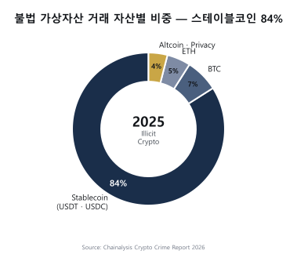
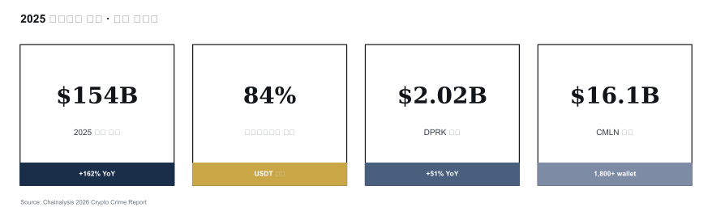

# 온체인 자금세탁 유형 (Typologies)

> 가상자산 자금세탁의 **실제 패턴**. 어떻게 layering 하는가. 이 글을 읽고 나면 KYT 시스템이 탐지하려는 9개 패턴이 각각 **어떤 원리로 작동**하고 **왜 탐지가 어려운지** 설명할 수 있게 됩니다. 마지막 업데이트: 2026-04-17.

## TL;DR
- 자금세탁자는 온체인의 **익명성 + 속도 + 자동화**를 최대한 활용
- 핵심 9가지 유형: **믹서 · 체인호핑 · 브리지 · peel chain · DEX swap · DeFi lending · 프라이버시코인 · NFT wash · OTC 환전**
- 2025~2026 트렌드: **cross-chain laundering** + **CMLN(중국어 자금세탁 네트워크)**
- 스테이블코인이 불법거래의 **84%** (Chainalysis 2026)
- 탐지는 **클러스터링 + attribution + behavior pattern** 삼박자

---

## 1. 왜 9개 유형을 알아야 하나

### KYT 룰의 출발점

KYT 시스템의 거의 모든 룰은 이 9개 유형 중 하나를 탐지하려 설계됩니다. "왜 이 룰이 있는가"를 이해하려면 **그 룰이 방어하려는 자금세탁 유형**을 먼저 알아야 합니다. 유형의 원리를 모른 채 룰만 카피하면 임계값 조정·예외 처리에서 실패합니다.

### 자금세탁 3단계와의 매핑

| 전통 ML | 가상자산 ML 예시 |
|---|---|
| **Placement** | 현금 → 거래소 입금, OTC 매수, P2P 거래 |
| **Layering** | Mixer, chain hopping, bridge, DEX swap, peel chain, NFT wash |
| **Integration** | OTC 환전, gift card 구매, 부동산·명품 결제, 합법사업체 자금화 |

가상자산은 **24~48시간 내 3단계 완주**가 가능합니다 (Bybit 사례: 48시간 내 $160M layering 완료). 이게 전통 금융 AML과의 결정적 차이.

---

## 2. 9가지 자금세탁 유형 — 원리·도구·탐지 포인트

### A. Mixer / Tumbler (믹서)

**원리**: 여러 사용자의 자금을 한 풀에 섞은 뒤 무작위 금액·시간으로 출금 → 입금 주소와 출금 주소의 **온체인 연결을 끊음**.

**대표 서비스**:
- **Tornado Cash** (Ethereum) — zk-SNARK 기반. 2022-08 OFAC 제재 → 2024-11 5th Cir. Van Loon 판결 → 2025-03-21 지정 해제. 해제 후에도 업계는 **여전히 위험 카테고리** 유지.
- **Wasabi Wallet** (Bitcoin) — CoinJoin. 여러 사용자가 동시에 균등 금액을 섞는 방식.
- **Samourai Whirlpool** (Bitcoin) — CoinJoin, 2024 운영자 체포 후 서비스 종료.
- **JoinMarket** (Bitcoin) — P2P CoinJoin. 메이커/테이커 모델.

**탐지 포인트**:
- 알려진 mixer 스마트컨트랙트 주소 노출
- **Denomination 표준화** (Tornado는 0.1/1/10/100 ETH 풀)
- Input/Output 개수 균등 (CoinJoin 지문)
- mixer 진입 후 **정확한 유지시간 분포**

### B. Chain Hopping (체인 점프)

**원리**: BTC → ETH → USDT(Tron) → BNB → ... 처럼 여러 체인을 점프하며 흔적을 흐림. 분석 도구가 한 체인에서 끊기는 점 노림.

**2026 트렌드**: 가장 많이 쓰이는 layering 방식. **cross-chain bridge가 핵심 인프라**이므로 bridge 탐지가 곧 chain hopping 탐지.

### C. Cross-chain Bridge 활용

**원리**: A 체인에서 자금을 잠그고 B 체인에서 **wrapped 토큰** 발행 → 추적 단절.

**대표 브리지**: Wormhole, LayerZero, Synapse, Stargate, Across, Hop, THORChain.

**이중 리스크**: 브리지 자체가 **해킹 1순위 표적**이기도 함.

| 사고 | 연도 | 손실 |
|---|---|---|
| Poly Network | 2021 | $611M (이후 반환) |
| Wormhole | 2022 | $325M |
| Ronin Bridge | 2022 | **$625M** (Lazarus) |
| Nomad | 2022 | $190M |
| Multichain | 2023 | $231M |

**탐지 포인트**: 브리지 컨트랙트 입출금 인덱싱 + 시간·금액 매칭으로 A→B 체인 연결 복원.

### D. Peel Chain (껍질 사슬)

**원리**: 큰 금액 주소에서 **소액씩 떼어내(peel)** 다른 주소로 보내고 잔액은 또 다른 주소로 → 길게 늘여진 사슬 패턴.

**왜 쓰나**: 사람이 일일이 따라가기 어렵게 만드는 의도. 전통 금융 smurfing(분할입금)의 온체인 버전.

**탐지 포인트**: 그래프 분석 — in-degree/out-degree 패턴, 분기 간격, 소액 상대적 일정성. 그래프 DB에서 시각적으로 **거의 일자형 사슬**로 보임.

### E. DEX Swap (탈중앙거래소 활용)

**원리**: KYC 없는 DEX(Uniswap, PancakeSwap, Curve)에서 토큰을 교환해 **자산 형태를 바꿈**. ETH를 USDT로 바꾸면 출처 추적 감각이 끊어짐.

**layering 효과**: 자산 형태 변환 + 대량 유동성 풀 통과로 흐름 희석.

**탐지 포인트**: DEX 컨트랙트 노출 + swap 전후 행동 패턴. DEX 자체는 합법이므로 **swap 자체가 위험이 아니라 swap 전후 흐름이 위험**.

### F. DeFi Lending / Liquidity Pool

**원리**: Aave·Compound에 토큰 입금 → 다른 자산으로 인출. 또는 Uniswap LP(Liquidity Pool) 토큰 발행·소각으로 출처 흐림.

**layering 효과**: 자산 형태 변환 + 다른 사용자 자금과 혼합.

**탐지 포인트**: 비정상 LP 진입/퇴출 패턴, 짧은 시간 내 다수 프로토콜 거침.

### G. Privacy Coin

**원리**: 프로토콜 설계 자체가 **추적 불가능**하도록 익명성 강화.

| 코인 | 기술 | 추적 가능성 |
|---|---|---|
| **Monero (XMR)** | Ring Signature + Stealth Address + RingCT | **거의 불가** |
| **Zcash (ZEC)** | zk-SNARK shielded transaction | shielded 사용 시 불가 (선택적) |
| **Dash** | PrivateSend (CoinJoin 변형) | 제한적 추적 가능 |
| **Grin/Beam** | MimbleWimble | 어려움 |

**운영 현실**: 한국·일본 주요 거래소는 privacy coin 전량 상장폐지. 자금세탁자는 privacy coin을 OTC/P2P/비규제 거래소에서만 다루고, 입출 시점에 BTC로 환전해서 들어가고 나옴. 이 **진입·탈출 순간**이 탐지 기회.

### H. NFT Wash Trading

**원리**: 자기들끼리 NFT를 사고팔며 **가격·거래량을 부풀려** 자금 이전을 정당화.

**유형**:
- **Self-trading** — 같은 사람이 양쪽 지갑 보유
- **Loop trading** — 3자 이상 순환 (A→B→C→A)
- **인플레이션 펌프** — 가격 띄워 외부 바이어에 매도

**시장 통계**: 2022~2023 NFT 광풍 시 wash trading 비중 추정 **25~50%**. 2025년 NFT 시장 위축 후 거래량 자체 감소했으나 **고가 컬렉션**(BAYC, CryptoPunks) 중심으로는 여전 활동.

**탐지 포인트**: 짧은 시간 내 같은 NFT의 반복 거래, 거래자 주소 간 클러스터 관계, 가격 변동 패턴 대비 유동성 부족.

### I. OTC Desk (Off-Exchange Counter)

**원리**: 익명·저KYC OTC desk에서 가상자산 ↔ 법정화폐 환전.

**위험 OTC**:
- **중국어권 텔레그램 OTC** — 2025년 자금세탁의 중심축
- **폐쇄된 P2P** (Paxful, LocalBitcoins)
- 비규제국 소재 OTC

**CMLN (Chinese Money Laundering Network)** 이 이 영역에서 부상 — 2025년 **$16.1B 처리, 1,800+ 활성 wallet**. 북한 자금까지 세탁 파트너 역할.

### 실무 포인트

룰 설계 시 이 9개 유형을 **별도 룰 그룹**으로 관리해야 false positive 원인을 역추적할 수 있습니다. 한 룰 엔진 안에 유형을 섞어 관리하면 나중에 "왜 이 고객이 차단됐는지" 설명하기 어렵고, STR에 근거를 쓰기도 힘들어집니다.

---

## 3. 2025~2026 새로운 트렌드






### A. Cross-chain Laundering 가속화

단일 체인 분석으로는 추적 불가능한 수준으로 발전. **Chainalysis Crosschain, TRM Multichain Tracing** 같은 cross-chain 도구가 KYT 벤더의 핵심 차별점으로 부상. 2025년 자금세탁의 **상당 부분이 multi-chain**.

### B. CMLN (Chinese Money Laundering Networks)

**Laundering-as-a-Service(LaaS)** 의 등장. 수수료(보통 5~15%)를 받고 세탁 서비스를 제공.

- 2025년 **$16.1B 처리**, 1,800+ 활성 wallet
- 북한·러시아 자금까지 이용
- 텔레그램·위챗 기반 OTC 네트워크와 결합
- 범죄조직이 자체 세탁 대신 **"전문 업체에 아웃소싱"** 하는 시대의 시작

### C. 스테이블코인 압도적 점유

- 불법거래의 **84%가 스테이블코인** (USDT > USDC > 기타)
- 이유: 가격 안정성 + Tron의 저수수료 + 글로벌 환금성
- 동시에 **freeze 가능** (Tether/Circle이 실제로 SDN·도난자금 freeze 수행) → 양면

### D. 국가 단위 자금세탁

- **러시아 A7A5 stablecoin**: 2025-02 발행 후 1년 내 $93.3B 거래 — 제재 회피 인프라
- **DPRK Lazarus**: 2025년 $2.02B 탈취, 누적 $6.75B

### E. 산업화 (Professionalization)

단일 행위자 시대 → **분업 생태계**: 해킹팀·세탁팀·환전팀·OTC팀이 각자 전문화. 마치 SaaS처럼 **서비스로 제공**됨.

### 실무 포인트

이 트렌드 중 **"Laundering-as-a-Service"** 의 부상이 가장 구조적 위협입니다. 개별 범죄자가 자체 능력으로 세탁하는 시대에는 KYT 룰이 대응 가능했지만, 전문 세탁업자가 매번 새 기법을 시도하면 **탐지 rule 엔지니어링이 군비 경쟁**이 됩니다. 이게 KYT 벤더가 ML 연구에 공격적으로 투자하는 이유.

---

## 4. 탐지 기법 (방어 측)

### A. Address Clustering (주소 클러스터링)

- **Common Input Ownership Heuristic (CIOH)** — UTXO 모델에서 한 트랜잭션의 input 주소들은 **한 사람이 통제**. 비트코인 분석의 기본 휴리스틱.
- **Change Detection** — UTXO 모델에서 거스름돈 주소 식별. 정확도는 보조 휴리스틱 수준.
- **Deposit Heuristic** — 거래소의 consolidation 패턴을 이용한 거래소 클러스터 식별.

### B. Attribution (행위자 매핑)

클러스터를 **알려진 엔티티**(거래소, 믹서, OFAC)에 연결. Chainalysis·TRM·Elliptic의 라벨 DB가 이 영역의 **moat**. 라벨 DB는 자체 구축이 거의 불가능 — 수년간의 다크웹 OSINT + 거래소 협업 + 법집행 협력이 쌓여야 작동.

### C. Behavior Pattern Analysis

- Peel chain 패턴, mixer 사용 패턴, 시간대 패턴
- 머신러닝 + 룰 베이스 결합
- 이상거래 자동 탐지

### D. Cross-chain Tracing

- 브리지 입출금 매칭
- 시간·금액·메타데이터 짝짓기
- memo 또는 wrapped asset의 contract event 인덱싱

### E. Exposure Score (위험노출도)

한 주소가 직접·간접으로 **몇 hop 안에** mixer·SDN·도난자금에 닿는가를 정량 지표로 표현. KYT 시스템의 대표 출력.

### 기술적 정밀화

**Peel Chain 탐지 쿼리** (SQL, UTXO 기준):

```sql
WITH chain AS (
  SELECT tx_hash, FROM_address, TO_address, amount,
         LAG(amount) OVER (PARTITION BY FROM_address ORDER BY block) as prev_amount
  FROM utxo_transactions
  WHERE block_time > NOW() - INTERVAL '30 days'
)
SELECT * FROM chain
WHERE amount < prev_amount * 0.05  -- 5% 미만만 떼어냄
  AND prev_amount > 10000000  -- 1억 이상에서만 출발
ORDER BY tx_hash;
```

**Mixer·CoinJoin 구분**:
- Mixer (custodial): Tornado·Wasabi Coordinator → entity 명시 가능
- CoinJoin (peer-to-peer): Wasabi·Samourai → fingerprint로 탐지 (동일 금액 output, 고정 denomination, 5:5 대칭)

**정확도**: CIOH 단독 75% → Fingerprint 결합 95% (Möser 2017, Bellei 2024)

### 실무 포인트

탐지 기법 5개 중 어느 하나도 단독으로 완벽하지 않습니다. KYT 벤더의 경쟁력은 **5개를 잘 조합한 Risk Score 공식**이며, 이 공식은 벤더마다 다른 결과를 냅니다. 벤더 선정 시 같은 주소 100개를 여러 벤더에 넣어보고 **출력 일치율**을 비교하는 PoC가 필수.

---

## 5. 탐지의 한계 — 무엇이 안 되는가

- **Privacy coin**: 거의 추적 불가 (Monero)
- **Off-chain trade**: 거래소 내부 트랜잭션은 외부에서 안 보임 (CEX 내부 이체)
- **새로운 mixer·bridge**: 라벨링 안 된 시점에는 탐지 어려움 (**Lag Time**)
- **Adversarial behavior**: 분석 도구를 회피하는 패턴 학습됨 (무작위 금액·시간)
- **법적 제한**: 한 회사가 다른 회사 고객 정보 보기 어려움 (개인정보 보호법)

### 실무 포인트

탐지 실패는 기술 한계와 법적 한계가 겹쳐서 발생합니다. "왜 이 자금세탁을 못 잡았나"에 대한 사후 분석에서 **기술적 개선**만 추구하면 한계가 있고, **업계 협력(공유 attribution DB, 법집행 협업)**이 동시에 발전해야 전체 탐지율이 올라갑니다.

---

## 6. 거래소·수탁업자 관점 — 어떤 패턴 알람을 봐야 하나

```
□ 입금 주소가 알려진 mixer / SDN / 도난자금에 N hop 내 노출
□ 출금 요청 주소가 위 동일
□ 단기간 내 다수 주소에서 분할 입금 (smurfing)
□ 입금 직후 즉시 전액 출금 (pass-through)
□ 비정상 시간대 거래 (UTC 기준 새벽 등)
□ peel chain 패턴 진입
□ DEX / bridge로의 빈번한 출금
□ NFT wash trading 의심 패턴
□ KYC 정보와 거래 패턴 불일치 (신고소득 대비 거액)
□ 특정 국가 IP·VPN 패턴 + 고위험 출금 조합
```

### 실무 포인트

위 10개 알람은 **같은 강도가 아닙니다**. "OFAC 1-hop 노출"은 즉시 차단 + STR, "비정상 시간대 거래"는 단독 시그널로는 약함. 룰 설계 시 **단일 시그널 차단**을 최소화하고 **복합 시그널 조합**에 의존하는 구조가 false positive를 줄입니다.

---

## 요약 부록 — 빠른 참조용

**9대 유형**: Mixer · Chain Hopping · Bridge · Peel Chain · DEX Swap · DeFi L/LP · Privacy Coin · NFT Wash · OTC
**탐지 5축**: Clustering · Attribution · Behavior · Cross-chain · Exposure
**2025 트렌드**: Cross-chain / CMLN / 스테이블코인 / 국가세탁 / LaaS 산업화

## 💼 실무 현장 (Industry Reality)

### 각 Typology별 KYT 탐지 룰 (pseudocode)

**Mixer 노출 탐지**:
```python
def mixer_rule(wallet):
    exp = chainalysis.exposure(wallet, hops=3)
    if exp["TORNADO_CASH_DIRECT"] > 0: return "CRITICAL"
    if exp["TORNADO_CASH_3HOP"] / wallet.balance > 0.05: return "HIGH"
    if exp["WASABI_SAMOURAI"] > 0: return "MEDIUM"
    return None
```

**Peel Chain 탐지**:
```python
def peel_chain(addr, depth=20):
    chain = []
    curr = addr
    for _ in range(depth):
        outs = get_outputs(curr)
        if len(outs) != 2: break  # peel 특징: 2개 output
        small, large = sorted(outs, key=lambda o: o.value)
        if small.value / large.value > 0.3: break  # 균등 분할 아님
        chain.append(curr)
        curr = large.to_addr
    return len(chain) >= 5  # 5단 이상이면 peel 의심
```

**Bridge 체인호핑 탐지**:
```python
def bridge_hop(tx):
    KNOWN_BRIDGES = ["0x3ee18b2214aff97000d974cf647e7c347e8fa585", ...]  # Wormhole 등
    if tx.to in KNOWN_BRIDGES:
        return "BRIDGE_ENTRY", tx.amount, tx.token
    return None
```

**NFT Wash Trading**:
```python
def nft_wash(nft_id, window="7d"):
    trades = get_trades(nft_id, window)
    addresses = set()
    for t in trades:
        addresses.add(t.buyer); addresses.add(t.seller)
    # 순환 매매 여부
    if len(trades) >= 3 and len(addresses) <= 3:
        return "WASH_LOOP_SUSPECT"
    return None
```

### 실무에서 발생 빈도 (한국 VASP 주니어 Analyst 기준)

| Typology | 월간 Alert 발생 빈도 | FP 비율 | 실제 STR 이어지는 비율 |
|---|---|---|---|
| Mixer 직접 노출 | 5~10건 | ~20% | ~50% |
| Mixer 간접(2~3 hop) | 50~100건 | ~85% | ~5% |
| Peel chain | 10~30건 | ~70% | ~10% |
| Bridge/체인호핑 | 100+건 | ~90% | ~3% (대부분 정상 이용) |
| DEX swap | 수백 건 | ~95% | ~1% |
| NFT wash | 5~20건 | ~60% | ~15% |
| Privacy coin 터치 | 매우 드묾 (국내 상폐) | 높음 | 상폐 후 거의 無 |
| OTC(CMLN 패턴) | 3~10건 | ~40% | ~30% |

### 벤더별 Typology 커버리지 차이 (PoC 비교 결과 예시)

| Typology | Chainalysis | Elliptic | TRM | Crystal |
|---|---|---|---|---|
| Mixer (Tornado·Wasabi) | 매우 강함 | 강함 | 강함 | 강함 |
| Cross-chain Bridge | 매우 강함 (Crosschain) | 중~강 (Holistic) | 매우 강함 (Universal) | 중 |
| DeFi 상호작용 | 강함 | 매우 강함 | 강함 | 중 |
| CMLN / 중국어권 OTC | 강함 | 중 | 강함 (Asia 특화) | 중 |
| NFT wash | 중 | 강함 | 중 | 약 |
| 한국 거래소 Attribution | 중 | 중 | 중~강 | 약 |

### 자주 나오는 오해

- **"Tornado 제재 해제됐으니 이제 괜찮다"** — 2025-03 SDN 해제됐지만 **업계는 여전히 위험 카테고리 유지**. Coinbase·Kraken 모두 Tornado 관련 주소 거부 정책 지속.
- **"DEX는 규제 대상 아니니 KYT 필요 없음"** — CEX가 DEX 상호작용 주소를 **입금 받는 순간** KYT 대상. DEX는 탐지 대상이 아니라 **경로**.
- **"Privacy coin은 탐지 불가능"** — 완전 불가는 아님. **shielded → transparent 전환 순간**, 거래소 입금 순간이 탐지 기회.

### 한국 특수 현실

- **Privacy coin 전량 상폐**: XMR·ZEC·DASH 등 2021년 4대 거래소 공동 상폐. 이후 한국 고객의 privacy coin 노출은 **OTC/해외 P2P** 경유만 남음.
- **CMLN 위챗·텔레그램 OTC**: 한국 고객이 USDT를 위안화로 환전하려 CMLN에 의뢰하는 케이스가 증가. Chainalysis Korea는 이 영역 특화 분석 보고서 정기 발간.
- **Lazarus 공급망 공격**: 2019 Upbit 해킹, 2022 GDAC, 2023 BonqDAO 공격 모두 한국 연관. **DAXA 4사는 Lazarus 노출 주소 공유 리스트** 운영.

---

## 더 읽을거리
- [`vasp-obligations.md`](vasp-obligations.md) — VASP 의무
- [`defi-nft-risks.md`](defi-nft-risks.md) — DeFi·NFT·프라이버시 코인 상세
- [`../4-technology/blockchain-analytics.md`](../4-technology/blockchain-analytics.md) — 블록체인 분석 기법
- [`../6-cases/lazarus-dprk.md`](../6-cases/lazarus-dprk.md) — DPRK 실제 사례
- [Chainalysis 2026 Crypto Crime Report](https://www.chainalysis.com/reports/crypto-crime-2026/)
- [TRM Labs Blog](https://www.trmlabs.com/resources/blog)
