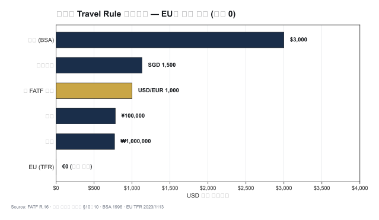
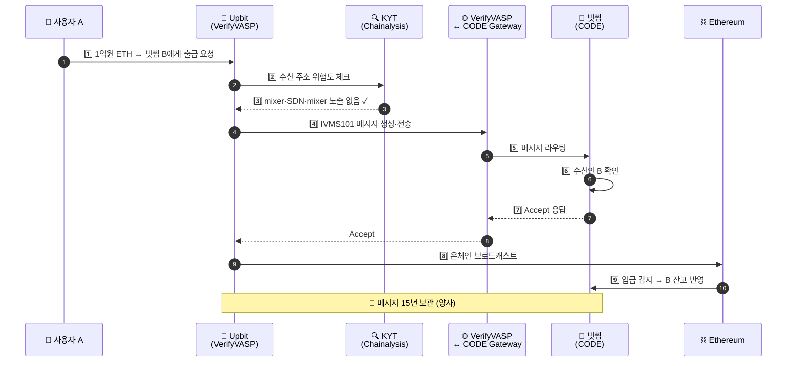

# Travel Rule — 가상자산 송수신인 정보 동반 의무

> FATF Recommendation 16의 가상자산 적용. VASP 운영 난이도 **1순위** 테마. 이 글을 읽고 나면 Travel Rule이 왜 단순 규제가 아니라 **글로벌 인프라 문제**인지, 그리고 왜 한국이 두 개의 솔루션을 동시에 운영하는지 이해하게 됩니다. 마지막 업데이트: 2026-04-17.

## TL;DR
- VASP가 다른 VASP에게 가상자산을 이전할 때 **송신인 + 수신인 정보를 함께 전달**해야 하는 의무
- 임계금액: **한국 100만원 / 미국 $3,000 / EU 없음 / FATF 권고 USD-EUR 1,000**
- 핵심 난제 두 가지: **Sunrise Issue**(관할별 시행 격차) + **VASP 식별**(지갑주소만으로 누구 VASP인지 알기 어려움)
- 메시지 표준: **IVMS101** (사실상 글로벌 표준)
- 한국: **VerifyVASP** (Upbit) + **CODE** (빗썸·코빗·코인원) 두 솔루션 연동

---

## 1. Travel Rule이 뭐고 왜 만들어졌나

### 전통 금융의 유산

전통 은행 송금에서는 SWIFT MT103 메시지에 **송신인·수신인 정보**가 함께 실려 갑니다. 이게 가능한 이유는 1996년 미국 BSA가 **Bank Secrecy Act Travel Rule**을 만들어 은행 간 송금 정보 동반을 의무화했기 때문. "돈이 움직이면 사람 정보도 같이 움직여야 한다"는 원칙은 그때부터 금융 AML의 기본값이었습니다.

### FATF가 이걸 가상자산에 확장한 이유

2019년 FATF는 Recommendation 16을 개정해 **가상자산 이전에도 같은 원칙**을 적용. 왜였나?

- 가상자산 이전에서는 "돈"(블록체인 트랜잭션)은 움직이는데 "사람 정보"가 따라가지 않음
- 이 비대칭이 자금세탁의 **layering 단계**를 매우 유리하게 만듦
- VASP 간 책임 추적이 불가능해 수사기관이 사고 대응 어려움
- 수신 VASP가 위험 신호(SDN, mixer) 있는 거래를 사전에 차단할 수단이 없음

**목적 요약**:
- 자금세탁의 layering 단계 차단
- VASP 간 책임 추적 가능성 확보
- 수신 측 사전 차단 가능

### 실무 포인트

Travel Rule은 "기술적 구현 문제"처럼 포장되지만 본질은 **"전 세계 VASP가 AML 데이터를 서로 공유하자"** 는 합의입니다. 기술적 어려움보다 **관할·개인정보·사업 모델 간 긴장**이 더 큰 도전이고, 이게 2019년 권고 후 7년이 지난 2026년에도 완벽 이행이 안 된 이유입니다.

---

## 2. 핵심 정보 항목

### 송신인(Originator) 정보

송신인 정보가 항상 더 많이 요구됩니다 — 수신 측 VASP는 수신인이 자기 고객인지 이미 알고 있지만, 송신인에 대해서는 원래 모르기 때문.

| 필드 | FATF | 한국 | EU TFR |
|---|---|---|---|
| 이름 | ✅ | ✅ | ✅ |
| 가상자산 주소 | ✅ | ✅ | ✅ |
| 신원확인번호 (또는 출생지·생년월일) | ✅ | (정보보호 이슈로 일부) | ✅ |
| 주소 | ✅ | (이름·주소 둘 중 하나) | ✅ |

### 수신인(Beneficiary) 정보

| 필드 | FATF | 한국 | EU TFR |
|---|---|---|---|
| 이름 | ✅ | ✅ | ✅ |
| 가상자산 주소 | ✅ | ✅ | ✅ |

### 실무 포인트

한국 특금법은 FATF 권고보다 **필드가 적습니다** — 개인정보 보호법과의 긴장 때문. 반면 EU TFR은 **가장 엄격**합니다. 글로벌 영업 VASP는 "가장 빡빡한 EU 기준에 맞추면 다른 관할은 자동 충족"이라는 전략으로 운영합니다.

---

## 3. 임계금액 비교 — 관할별 선택의 차이




### 이 표를 어떻게 읽어야 하나

임계금액이 낮을수록 더 많은 거래가 Travel Rule 대상이 되어 운영 부담이 큽니다. 한국은 중간, EU는 극단(임계 없음), 미국은 상대적으로 완화. 관할 선택은 **"우리 고객이 어느 나라 VASP와 주로 거래하나"** 로 결정해야 합니다.

| 관할 | 임계 | 비고 |
|---|---|---|
| FATF 권고 | USD/EUR 1,000 | 회원국 자율 결정 |
| **한국** | **100만원** | 특금법 시행령 §10의10 |
| **미국 (FinCEN)** | **$3,000** | BSA Travel Rule 1996 |
| **EU TFR** | **없음 (모든 거래)** | 가장 엄격 |
| 일본 | 100,000엔 | 2023 시행 |
| 싱가포르 | SGD 1,500 | 2020 시행 |

### 실무 포인트

한국 사업자가 EU 카운터파티와 거래할 때는 **EU 기준(임계 없음)** 으로 맞춰야 합니다. 1유로짜리 거래여도 EU 측은 모든 필드를 요구. 이게 한국 거래소가 EU 고객 온보딩에 미적거리는 구조적 이유 중 하나.

---

## 4. 메시지 표준: IVMS101

### 정체성

- **InterVASP Messaging Standard 101** — Travel Rule 메시지의 글로벌 표준
- 2020년 InterVASP Joint Working Group (JWG) 합의
- JSON Schema로 송수신인 정보 표준화
- **모든 주요 전송 프로토콜이 IVMS101을 페이로드로 사용**

### 왜 표준이 필요했나

Travel Rule 시행 초기(2019~2020)에는 각 프로토콜이 자체 메시지 형식을 썼습니다. 그러면 TRISA 쓰는 A 거래소가 Sygna 쓰는 B 거래소로 메시지를 보낼 때 **형식 변환**이 필요했고, 필드가 일대일 매핑 안 되는 경우가 속출. 이 문제를 풀려고 Notabene·21 Analytics·CipherTrace(TRISA)·CoolBitX(Sygna)·Securrency 등 주요 플레이어가 모여 공통 JSON 스키마를 합의한 게 IVMS101.

### 핵심 구조

```json
{
  "originator": {
    "naturalPerson": {
      "name": { "primaryIdentifier": "...", "secondaryIdentifier": "..." },
      "geographicAddress": { ... },
      "dateAndPlaceOfBirth": { ... },
      "nationalIdentification": { ... }
    },
    "accountNumber": ["bc1q..."]
  },
  "beneficiary": { ... },
  "originatingVASP": { "legalPerson": { ... } },
  "beneficiaryVASP": { ... },
  "transferPath": { ... }
}
```

### 실무 포인트

IVMS101은 "표준이지만 유연성이 있어서" 관할별 필수 필드 차이를 허용합니다. 같은 메시지라도 한국 VASP가 보낸 버전과 EU VASP가 보낸 버전의 채움 정도가 다를 수 있고, 수신 측이 이를 **관할 기준으로 검증**해야 합니다. 이게 IVMS101 validator 구현에서 가장 복잡한 부분.

---

## 5. Travel Rule 프로토콜 — 전송 방식들

### 이 표를 어떻게 읽어야 하나

표준(IVMS101)이 "무엇을"이라면, 프로토콜은 "어떻게"입니다. 분산형은 누구나 참여할 수 있지만 식별 인프라가 별도 필요하고, 폐쇄형은 신뢰는 높지만 회원사 한정. 한국은 폐쇄형(VerifyVASP·CODE)이 주류, 글로벌은 Notabene Gateway가 멀티프로토콜 허브로 부상.

| 프로토콜 | 운영 | 모델 | 비고 |
|---|---|---|---|
| **TRISA** | 비영리, CipherTrace 시작 (→ Mastercard) | 분산형, gRPC/PKI | 오픈소스, 누구나 참여 |
| **TRP** | 21 Analytics, ING | API 기반 REST | 가벼움, 빠른 구현 |
| **OpenVASP** | OpenVASP Association | 분산형, Ethereum 기반 | 2026년 활용도 낮음 |
| **VerifyVASP** | 람다256(Upbit 자회사) + Chainalysis | 폐쇄형 컨소시엄 | 한국 + 글로벌 |
| **CODE** | 빗썸+코빗+코인원 합작 | 폐쇄형 컨소시엄 | 한국 특화 |
| **Notabene** | Notabene Inc. (미국) | SaaS, 멀티프로토콜 | 1,500+ VASP, Sunrise 해결책 |
| **Sumsub Travel Rule** | Sumsub | SaaS | KYC 통합 |
| **Sygna** | CoolBitX (대만) | API | 아시아 강세 |

### 분산형 vs 폐쇄형 트레이드오프

- **분산형(TRISA, OpenVASP)**: 누구나 참여 가능, 신뢰는 **PKI 인증서**로. 장점은 확장성·오픈, 단점은 VASP 식별 인프라를 별도로 갖춰야 함.
- **폐쇄형(VerifyVASP, CODE)**: 사전 검증된 VASP만 참여, 신뢰는 **컨소시엄 운영자**가 보증. 장점은 즉시 작동, 단점은 회원사 외 카운터파티 불가.

### 실무 포인트

"우리는 어느 프로토콜을 써야 하나"의 답은 **"고객이 어디로 주로 출금하나"** 로 결정합니다. 한국 고객이 주로 국내 4대 거래소 간 이동이면 VerifyVASP+CODE, 해외 거래소가 많으면 Notabene Gateway, 글로벌 규모면 Notabene + TRISA 조합. 한 솔루션만 고집하면 반드시 Sunrise Issue에 부딪힙니다.

---

## 6. 한국 시장의 Travel Rule

### 두 솔루션 양강 체제

| 솔루션 | 운영자 | 사용 거래소 |
|---|---|---|
| **VerifyVASP** | 람다256 (두나무 자회사) + Chainalysis | **Upbit**, 다수 글로벌 |
| **CODE** | 코드 (빗썸·코빗·코인원 합작법인) | **빗썸·코빗·코인원** |

### 시행 초기의 혼란

**2022-03-25 시행 직후** 한국 시장은 두 솔루션이 **분리** 운영되는 상황이었습니다. 즉 Upbit에서 빗썸으로 원화 100만원 상당 코인을 보낼 수 없는 기간이 있었고, 이용자들은 "내 코인을 못 보낸다"는 불만을 쏟았습니다. 시행 1개월여 후 **VerifyVASP ↔ CODE 연동**이 완료되며 해결. 현재는 4대 거래소 간 자유롭게 송금 가능.

### 외부지갑(unhosted wallet) 등록제

법령이 명시 요구한 건 아니지만, 한국 거래소는 자체 정책으로 **출금 받을 외부지갑을 사전 등록** 받습니다.

- **등록 시**: 본인인증 + 지갑 소유 증명(인증 문자열 서명 제출) + 화이트리스트 등록
- 등록 안 된 지갑으로는 **출금 불가**
- 개인지갑(MetaMask 등)에 대한 Travel Rule 대응책으로 발전

### 실무 포인트

한국 4대 거래소 간에는 이제 Travel Rule이 매끄럽지만, **해외 VASP와의 거래에서는 여전히 Sunrise Issue**가 자주 발생. 고객 민원의 상당수가 "왜 이 해외 거래소로 출금이 안 되나"이고, 답은 "카운터파티가 Travel Rule 시스템을 안 갖췄거나 미승인"인 경우가 대부분. 고객 안내 템플릿을 잘 만들어두는 게 CX 부담 경감에 도움.

---

## 7. 두 가지 핵심 난제

### A. Sunrise Issue — 관할별 시행 격차

A국은 시행, B국은 미시행 상태라면, A국 VASP가 B국 VASP에게 송금할 때 B국 측이 메시지를 받을 인프라 자체가 없습니다.

**해결책**:
- **멀티프로토콜 게이트웨이** (Notabene Gateway가 부상한 이유) — 한 번 연결로 다양한 카운터파티 프로토콜 대응
- **폴백 정책** — 미연결 카운터파티에게는 **송금 보류 또는 자체 검토 후 결정**
- **점진적 글로벌 합의** — 2030년까지 완성 목표 (FATF 로드맵)

### B. VASP Discovery — 지갑주소 식별

지갑 주소 `0xABC...`가 출금 대상으로 들어왔을 때, **그게 어느 VASP의 주소인지** 어떻게 아는가?

**해결책**:
- **Chainalysis / TRM / Elliptic attribution DB** — 주소 → VASP 매핑 (가장 일반적)
- **자체 검증 컨소시엄** (VerifyVASP, CODE) — 회원사 주소 사전 등록
- **API 조회** (Notabene Directory 등) — 멀티 DB 통합 조회
- **DTI (Digital Token Identifier, ISO 24165)** — 토큰 ID 표준화
- **GLEIF LEI (Legal Entity Identifier)** — 법인 식별 글로벌 표준

### C. Personal Data 보호 긴장

Travel Rule은 본질적으로 **PII(Personally Identifiable Information, 개인식별정보)를 VASP 간 전송**하는 것 — 이게 GDPR·한국 개인정보 보호법(PIPA)과 충돌.

**해결**:
- 암호화 전송 (TLS + 메시지 수준 암호화)
- 목적 한정 원칙 (Travel Rule 이외 용도 사용 금지)
- 보존 기간 명확화 (한국 15년, EU 5년)
- 수신 VASP의 데이터 위임 처리 계약 체결

### 실무 포인트

세 난제 중 개인정보 충돌이 가장 조용하지만 가장 무거운 위험입니다. Travel Rule 메시지가 제3국 VASP로 넘어가는 순간 해당국 개인정보법이 적용되고, 한국 개인정보보호위원회(PIPC)는 "국외 이전 시 적정성 확인"을 요구합니다. 글로벌 영업 VASP는 국외이전 영향평가(Privacy Impact Assessment)를 정기적으로 수행해야 합니다.

---

## 8. 운영 흐름 — 한국 거래소 출금 예시



### 실무 포인트

**5번 메시지 교환이 안 되거나 timeout 시 송금 자체가 멈춥니다** = 사용자 UX 충격. 그래서 카운터파티 호환성(interoperability)이 운영의 핵심 KPI. "카운터파티 에러율"을 월별로 추적하며, 특정 카운터파티에서 반복 실패가 나면 회사 차원의 에스컬레이션이 필요합니다.

---

## 9. 2025-06-18 FATF R.16 개정의 영향

- 결제 산업 변화 반영, 메시징 표준 명확화
- VASP는 **별도 tailored framework**로 적용 (기존 전통 금융 Travel Rule과 구별)
- **2026 후반 가이던스 발표 예정** — 한국 FIU도 이를 반영한 시행령 개정 가능성
- **2030년 말 발효** — 회사들은 그전에 시스템 업그레이드 준비

### 실무 포인트

2026-04 현재 대부분 VASP는 2022년 R.16 기반 시스템에서 운영 중입니다. 2030년 새 기준 발효까지 **3~4년 리드타임**이 있으므로, 차기 시스템 선택 시 "지금 쓸 것"보다는 "2030년 기준에 맞게 진화 가능한 것"을 기준으로 보는 게 현명합니다.

---

## 10. 회사 체크리스트

```
□ Travel Rule 솔루션 도입 (VerifyVASP / CODE / Notabene 등)
□ IVMS101 메시지 정확성 검증 (JSON Schema 기반)
□ 카운터파티 VASP 호환성 점검 (Sunrise Issue)
□ 미연결 카운터파티 처리 정책 (송금 거절·보류·수동 검토)
□ unhosted wallet 등록제 운영
□ Travel Rule 메시지 15년 보관
□ PII 암호화 + 접근 통제
□ 개인정보보호법·GDPR 호환성 점검 (국외이전 영향평가)
□ 2026 후반 FATF 가이던스 모니터링
□ 2030 발효 대비 로드맵 수립
```

## 더 읽을거리
- [`vasp-obligations.md`](vasp-obligations.md) — VASP 의무 종합
- [`../4-technology/travel-rule-protocols.md`](../4-technology/travel-rule-protocols.md) — 프로토콜 기술 상세
- [`../7-vendors/travel-rule-vendors.md`](../7-vendors/travel-rule-vendors.md) — 벤더 비교
- [`../7-vendors/korea-solutions.md`](../7-vendors/korea-solutions.md) — 한국 솔루션 상세
- [Notabene — Travel Rule Messaging Protocols](https://notabene.id/travel-rule-messaging-protocols)
- [21 Analytics — FATF Travel Rule Status 2026](https://www.21analytics.co/blog/fatf-crypto-travel-rule-status-2026/)
- [Sumsub — FATF Travel Rule 2026](https://sumsub.com/blog/what-is-the-fatf-travel-rule/)
