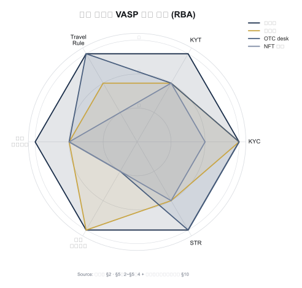

# VASP 의무 — 가상자산사업자가 해야 할 일 정리

> VASP가 법적·실무적으로 떠안는 **9대 의무**를 한 장에. 이 글을 읽고 나면 회사가 "AML 프로그램을 갖췄다"고 주장할 때 구체적으로 어떤 9가지 능력이 있어야 하는지 체크리스트로 말할 수 있게 됩니다. 마지막 업데이트: 2026-04-17.

## TL;DR
- VASP 의무는 **글로벌(FATF) → 각국법(특금법·BSA·AMLR)** 으로 흘러내려옴
- 핵심 9가지: **신고/라이선스 → KYC/CDD → EDD → 거래모니터링 → 제재 스크리닝 → STR/CTR → Travel Rule → 기록보관 → 내부통제**
- **수탁업자(custody)도 VASP** — 의무 종류는 거래소와 동일 (강도는 상품 특성에 따라 RBA로 차등)
- 한국에서 위반 시: 형사처벌 + 신고 취소 + 평판 리스크

---

## 1. VASP 정의 — 누가 이 의무를 지는가

### 관할별 용어

용어는 다르지만 본질은 같습니다. FATF가 만든 표준을 각 관할이 자국 법 체계에 맞게 부르는 것뿐입니다.

- **VASP (Virtual Asset Service Provider)** — FATF 용어. 가장 포괄적.
- **MSB (Money Services Business)** — 미국 용어. 송금사업자 체계에 편입.
- **CASP (Crypto-Asset Service Provider)** — EU MiCA 용어.
- **가상자산사업자** — 한국 특금법 §2 용어.

### 이 표를 어떻게 읽어야 하나

관할마다 문언의 미묘한 차이는 있으나, 실질적으로는 **매수도·교환·이전·보관 + 중개**를 영업으로 하면 모두 대상. 즉 거래소만이 아니라 수탁·OTC도 VASP로 포함된다는 점이 가장 자주 놓치는 부분입니다.

| 관할 | 용어 | 정의 (간단히) |
|---|---|---|
| FATF | VASP | 매수도/교환/이전/보관/관련 금융서비스 영업 |
| 한국 | 가상자산사업자 | 매도매수/교환/이전/보관관리/중개 (특금법 §2) |
| 미국 | MSB | 가상통화 administrator/exchanger (FinCEN 2013 해석) |
| EU | CASP | 수탁/거래소/주문집행/포트폴리오관리/이전/자문/인수배치 (MiCA) |

### 실무 포인트

"우리는 거래소가 아니라 수탁업자인데 AML 의무가 적용되나"라는 질문은 자주 나오지만, 답은 **적용된다**. 수탁(custody)은 명문상 VASP 행위이며 FATF·한국·미국·EU 모두 동일. 다만 RBA에 따라 **의무 강도**는 차이가 날 수 있습니다 — 예를 들어 B2B 수탁업자는 Travel Rule이 고객 출금 시점에만 트리거되므로 거래소보다 빈도가 낮습니다.

---

## 2. VASP 9대 의무 (RBA 기반) — 순서 자체가 의미가 있다

### 왜 이 순서인가

아래 9개는 **시간 흐름**에 따라 배치돼 있습니다. 사업자가 영업을 시작하는 순간부터 매 거래마다 어떤 통제가 작동해야 하는지의 순서.

```
   ┌─────────────────────────────────────┐
   │  1. 신고·라이선스 (Authorization)   │  ← 진입 단계 (영업 전)
   ├─────────────────────────────────────┤
   │  2. KYC · CDD                        │
   │  3. EDD (고위험 고객)                 │  ← 고객 단계 (onboarding·주기적)
   │  4. 거래 모니터링 · KYT               │
   │  5. 제재 스크리닝 (Sanctions)         │
   │  6. STR · CTR (의심거래·현금거래 보고) │  ← 운영 단계 (매 거래마다)
   │  7. Travel Rule (송수신인 정보 동반)  │
   │  8. 기록 보관 (Record Keeping)        │
   ├─────────────────────────────────────┤
   │  9. 내부통제 + AMLO (조직)           │  ← 거버넌스 (상시 백본)
   └─────────────────────────────────────┘
```

### 1. 신고·라이선스

**왜 먼저인가**: 사업자 등록 없이 영업하면 이후 모든 AML 통제는 무의미. 관할마다 방식 다름 — 한국은 **신고제(실질 인허가)**, 미국은 **등록제(등록 자체는 쉽지만 주별 MTL 필요)**, EU는 **인가제(MiCA CASP 라이선스)**.

- **한국**: FIU 신고 + 3년 갱신 + ISMS 인증. 2026-01 개정으로 **대주주 자격심사** 추가.
- **미국**: FinCEN MSB 등록(연방) + 주별 Money Transmitter License(MTL). 50개 주별 각자 면허 취득이 악명 높음.
- **EU**: MiCA CASP 라이선스. NCA(회원국 감독기구) 발급 + **EU passporting**(한 나라 인가로 EU 전체 영업 가능).

### 2. KYC · CDD

기본 4단계: 신원확인 → 실소유자(BO) 확인 → 거래목적·자금원천 → 지속 모니터링.

- **신원확인**: 이름·생년월일·주소·연락처 + 신분증 진위 확인.
- **실소유자 확인**: 법인 고객은 **25% 이상 지분 자연인**까지 재귀적으로 추적. Shell company 방어의 핵심.
- **거래목적·자금원천 파악**: 신고 소득 대비 거래 규모가 맞는지 판단 기준.
- **지속 모니터링**: onboarding 1회로 끝나지 않음. 고객 위험등급 변동 시·일정 주기마다 재실사(refresh).

### 3. EDD (강화된 실사)

일반 CDD 위에 **추가 확인**을 덧붙이는 구조. 트리거와 추가 절차가 명확해야 합니다.

**트리거 예시**:
- PEP (정치적 주요인물)
- 고위험국 거주·국적 (FATF Grey/Black)
- 비대면 + 기타 위험요소 조합
- 거액거래 (개별 또는 누적)
- 복잡한 소유구조 (3단 이상 법인 층)

**추가 절차**:
- **자금출처(SoF, Source of Funds)** 증빙 — 월급? 사업수익? 상속? 문서로 증명.
- **자산출처(SoW, Source of Wealth)** 증빙 — 전체 재산의 형성 경로.
- **고위경영진 승인** — 팀장이 아닌 임원급 사인.
- **재실사 주기 단축** — 연 1회 → 분기 1회 등.

### 4. 거래 모니터링 · KYT

**전통 금융 AML의 TM(Transaction Monitoring)** 에 **가상자산 특화 KYT(Know Your Transaction)** 가 더해진 형태. 두 축의 차이:

- **룰 기반**: 사람이 작성한 패턴(예: "1시간 내 10회 이상 분할 입금"). 설명 가능성 ↑, 적응성 ↓.
- **ML 기반**: 학습된 모델이 비정상 탐지. 설명 가능성 ↓, 적응성 ↑.

실무는 **룰 + ML 하이브리드**가 표준. 알람 발생 → 1선 분석가 리뷰 → 2선 escalation → 필요 시 STR. 이 큐 운영이 AML 조직의 **일상 업무**.

### 5. 제재 스크리닝

- **고객 신원** vs OFAC·UN·EU·한국 외교부 명단 — 이름·생년월일·국적 매칭.
- **지갑 주소** vs OFAC SDN의 가상자산 지갑 주소 목록 — 실시간 차단.
- **공급망·결제 수신** 시에도 스크리닝 — 결제 PG사에게 특히 중요.

### 6. STR · CTR

- **STR**: 의심되면 지체 없이 FIU에 보고 (**금액 무관**). "의심의 합리적 근거"만 있으면 충분.
- **CTR**: 한국 1천만원, 미국 $10,000 이상 **현금**거래.
  - VASP는 현금 취급 자체가 드물어 실제 트리거는 **거의 없음** (OTC desk 예외).
  - 법 문언상 VASP 포함되지만 실무상 적용 사례 모호.
- **누설 금지(Tipping-off)**: 고객에게 STR 사실 알리면 **별도 형사처벌**.

### 7. Travel Rule

임계금액 이상 VASP 간 이전 시 송수신인 정보 동반:
- **한국**: 100만원 (특금법 시행령 §10의10)
- **미국**: $3,000 (BSA Travel Rule 1996)
- **EU**: **임계 없음** (TFR — 모든 이전)
- **FATF 권고**: USD/EUR 1,000

솔루션 연동 필수 (CODE / VerifyVASP / Notabene Gateway 등). 자세한 내용은 [`travel-rule.md`](travel-rule.md).

### 8. 기록 보관

한국은 **두 법이 서로 다른 대상에 다른 기간**을 부과. 같은 자료가 둘 다에 해당하면 **더 긴 쪽** 적용.

- **가상자산이용자보호법 §11**: 이용자 **거래 정보** → **15년**
- **특금법 §5의4**: AML 관련 기록 (KYC, STR 사본, 내부 조사) → **5년**
- **미국 BSA**: 5년
- **EU AMLR**: 5년 (개정 논의)

실무에서는 DB 설계 단계부터 **15년 기본값**으로 가는 게 안전.

### 9. 내부통제 + AMLO

- **자금세탁방지 보고책임자(AMLO/MLRO)** 임명 — **임원급** 필수. 팀장·부장 불가.
- AML 정책·절차 문서화 — 규제 검사에서 가장 먼저 요구하는 것.
- **3중 방어선(3LoD)**: 영업(1선) / 컴플라이언스(2선) / 감사(3선). 3선이 **독립**돼야 실효.
- **임직원 정기 교육** — 연 1회 이상. 교육 기록도 보존.
- **내부 감사 + 외부 감사** — 외부 감사는 보통 회계법인 위탁.

### 실무 포인트

이 9개가 모두 "있어야" 한다는 것은 명확하지만, 실제 검사에서 지적받는 건 "있지만 작동하지 않는" 경우가 압도적으로 많습니다. 예: STR 프로세스는 문서화돼 있지만 실제 제출 건수 0건, AMLO는 임명됐지만 실권 없음, 교육은 있지만 이수율 확인 안 됨. 형식과 실질 모두 증빙해야 합니다.

---

## 3. 사업 유형별 의무 강도 차이 (RBA)




### 이 표를 어떻게 읽어야 하나

같은 VASP 카테고리지만 사업 유형에 따라 **무엇이 최우선인지**가 다릅니다. 신규 진입 시 "우리는 어느 칸인가"를 먼저 확정하고, 그 칸에서 '강'으로 표시된 영역에 자원을 먼저 투입하는 게 RBA의 실질적 의미입니다.

| 사업 유형 | KYC | KYT | Travel Rule | 특이사항 |
|---|---|---|---|---|
| **거래소** (Upbit, 빗썸) | 강 | 강 | 강 | 가장 풀스택, 상장심사 의무 |
| **수탁업(custody)** | 중~강 | 중 | 부분적용 (이전 시) | **자산 분리보관**이 최우선 |
| **OTC desk** | 강 | 중 | 강 | 거액 거래 → STR 트리거 多 |
| **결제 PG** | 중 | 강 | 강 | 가맹점 KYC + 거래 실시간 |
| **NFT 마켓플레이스** | 중 | 중 | 약 | wash trading 모니터링 |
| **DeFi 프로토콜** | (사업자 식별 어려움) | — | — | 회색지대, 입법 진행 중 |

### 수탁업의 특수성

수탁업은 거래 자체를 적게 하지만 **자산 보호의 책임이 가장 크다**. 실제 의무 구성:

- **자기자산·고객자산 분리** (가상자산이용자보호법 §10) — 거래소보다 수탁업에서 더 엄격하게 들여다봄.
- **고객별 Segregated Wallet** vs **Omnibus Wallet** 정책 선택.
- **콜드월렛 비율** (시행령 80%) 유지.
- **출금 승인 다중서명** (MPC/HSM).
- **출금 시 KYT** — 외부 수신 주소가 OFAC SDN·mixer·도난자금 노출인지 반드시 검사.
- **준비금 증명(Proof of Reserves)** — 고객 자산 실제 보유를 온체인 증명.

### 실무 포인트

거래소가 풀스택이고 수탁업이 분리보관 중심이라는 큰 틀은 맞지만, **OTC desk는 의외로 STR 건수가 거래소 못지않게 많습니다**. 거액·특수 고객·국경 간 거래가 집중되므로 단위 거래당 리스크가 높은 편. OTC를 "작은 사업"이라 얕잡아보면 AML 지적의 집중 타겟이 됩니다.

---

## 4. 의무 위반 → 처벌

### 이 표를 어떻게 읽어야 하나

처벌 수위가 관할별로 다릅니다. 이 표를 "절대 금액 비교"가 아니라 **"무엇이 가장 무거운 범죄로 취급되는가"** 의 관점에서 읽어야 합니다. 한국은 **미신고 영업이 가장 무거운 범죄**(5년 징역)인 반면, 미국은 **STR 미보고가 단일 건당 $500K까지** 과징될 수 있어 대형사에는 특히 치명적.

| 관할 | 미신고 영업 | KYC 위반 | STR 미보고 |
|---|---|---|---|
| 한국 | **5년 / 5천만원** | 1년 / 1천만원 | 1년 / 1천만원 |
| 미국 | $250K~ + 형사 | 민사벌금 | **$500K~** |
| EU | 회원국별, 최대 €10M 또는 매출 5% | 동일 | 동일 |

**추가로**: 신고 취소 + **CCO/CEO 개인 형사 책임** + 평판 리스크. 특히 미국·EU는 임원 개인 책임을 적극 추궁.

### 실무 포인트

AML 사고가 터졌을 때 회사만 벌금을 내고 끝나는 시대는 지났습니다. 2023년 Binance CZ가 4개월 실형을 받은 건 가상자산 산업에 상징적 경고. 임원 개인보험(D&O), AMLO 권한 문서화, 의사결정 로그 보존이 실제 임원을 보호하는 장치가 됐습니다.

---

## 5. 회사 컴플라이언스 프로그램 — 5 Pillars

### 역사적 배경

미국 BSA가 규정한 **4 pillars** (1970s 기원):
1. **Internal Controls** — 정책·절차·시스템
2. **Designated AMLO** — 임명된 책임자
3. **Training** — 임직원 교육
4. **Independent Audit** — 독립 감사

여기에 2018년 **FinCEN CDD Final Rule**로 5번째 pillar가 추가됐습니다:

5. **CDD / Beneficial Ownership** — 실소유자 확인 절차

### 한국 FIU 검사에서도 사실상 동일 기준

한국 감독당국은 명시적으로 "5 pillars"라 부르지 않지만, **FIU 신고 매뉴얼과 RBA 가이드라인이 사실상 이 5개 항목**을 요구. 즉 미국 BSA 기준에 맞춰 놓으면 한국 검사에도 대부분 대응됩니다.

### 실무 포인트

회사 AML 정책 문서를 쓸 때 **목차 자체를 5 pillars로 구조화**하면 감독 검사관이 읽기 쉽고, 글로벌 영업 시 외국 감독당국도 즉시 이해합니다. 국내 법에만 맞춘 구성은 해외 파트너 실사(due diligence)에서 불편을 겪는 경우가 많습니다.

---

## 6. 수탁업자 관점 추가 의무

수탁업은 거래 자체를 적게 하지만 다음이 **거래소와 구별되는** 핵심:

- **자기자산·고객자산 분리** (가상자산이용자보호법)
- **고객별 Segregated Wallet** vs **Omnibus Wallet** 정책
- **콜드월렛 비율** (시행령 80%)
- **출금 승인 다중서명** (MPC/HSM)
- **출금 시 KYT** — 외부 주소가 OFAC SDN·mixer·도난자금 노출인지
- **준비금 증명(Proof of Reserves)** — 고객 자산 실제 보유 온체인 증명

### 실무 포인트

수탁업은 **보안 사고 한 번이 곧 회사 종료**로 이어지는 구조입니다. 2022년 이후 Celsius·Voyager 파산은 KYC·AML 문제보다 **자산 관리 실패**가 원인이었음을 기억해야 합니다. 수탁업에서 AML 의무는 "필요조건"이고, **자산 보호·보안·거버넌스**가 "충분조건"입니다.

---

## 요약 부록 — 빠른 참조용

**9대 의무 순서**: 신고 → KYC → EDD → TM/KYT → 제재 → STR/CTR → Travel Rule → 기록 → 내부통제
**5 Pillars**: Internal Controls / AMLO / Training / Audit / CDD-BO
**사업유형별 최우선**: 거래소=풀스택 / 수탁=분리보관 / OTC=STR / PG=실시간 KYT / NFT=wash trading

## 더 읽을거리
- [`travel-rule.md`](travel-rule.md) — Travel Rule 상세
- [`onchain-typology.md`](onchain-typology.md) — 온체인 자금세탁 유형
- [`../4-technology/kyc-kyt.md`](../4-technology/kyc-kyt.md) — KYC·KYT 기술
- [`../5-compliance/cdd-edd.md`](../5-compliance/cdd-edd.md) — CDD·EDD 운영
- [FIU — 가상자산사업자 신고 매뉴얼](https://www.fsc.go.kr/comm/getFile?srvcId=BBSTY1&upperNo=75409&fileTy=ATTACH&fileNo=6)
