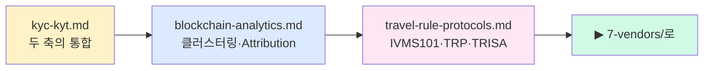

# 4️⃣ Technology — KYC · KYT · Travel Rule 기술

> "AML은 시스템이 절반"입니다. 이 폴더는 컴플라이언스 조직 **뒤에서 돌아가는 엔진**을 기술 관점에서 설명합니다. 마지막 업데이트: 2026-04-20.

## 누가 먼저 읽어야 하나

- 🧑‍💻 AML·리스크 엔진을 **설계·구현**하는 엔지니어
- 🛒 벤더(Chainalysis·Elliptic·TRM·Notabene·VerifyVASP·CODE) **선정**을 주도하는 PM·AMLO
- 🔬 블록체인 분석이 **왜 정확하고 왜 틀리는가**를 판단해야 하는 조사관

## 읽는 순서

## 파일 인덱스

| # | 파일 | 핵심 질문 | 배우고 나면 |
|---|---|---|---|
| 1 | [`kyc-kyt.md`](kyc-kyt.md) | KYC와 KYT는 왜 한 엔진에 통합돼야 하나? | Risk Engine 설계 시 벤더·데이터 플로우 판단 |
| 2 | [`blockchain-analytics.md`](blockchain-analytics.md) | Attribution은 어떻게 만들어지나? 왜 자체 구축이 불가능한가? | Chainalysis 등 빅4의 수익 구조 + 라벨 경제 이해 |
| 3 | [`travel-rule-protocols.md`](travel-rule-protocols.md) | IVMS101·TRP·TRISA·VerifyVASP·CODE·Notabene — 뭐가 뭐인가? | 프로토콜 선택 + Gateway·컨소시엄 조합 결정 |

## 핵심 출구

- KYC(사람) vs KYT(거래·지갑)를 **왜 둘 다** 필요한지 1분 스피치
- Common-Input-Ownership·Change Detection·Peeling·Address Attribution 각각 한 줄 정의
- "IVMS101은 표준, TRISA/TRP는 프로토콜, Notabene은 게이트웨이, VerifyVASP/CODE는 컨소시엄" — 이 4계층 분리 설명
- 왜 2026년에도 Sunrise Issue가 해결되지 않는지

## 다음 단계

- 벤더 시장 비교 → [`../7-vendors/README.md`](../7-vendors/README.md)
- 가상자산 자금세탁 패턴 원리 → [`../3-crypto-aml/onchain-typology.md`](../3-crypto-aml/onchain-typology.md)
- 상위 인덱스 → [`../README.md`](../README.md)
