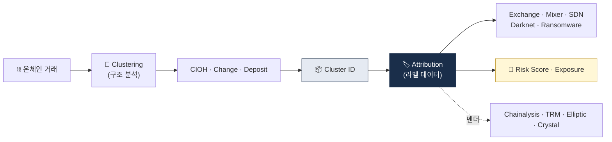

# Blockchain Analytics — 온체인 분석 기법

> KYT의 **기술적 기반**. 어떻게 익명 주소를 분석하는가. 이 글을 읽고 나면 Chainalysis·Elliptic·TRM Labs가 어떤 알고리즘 위에 돈을 벌고 있는지, 그리고 자체 구축이 왜 거의 불가능한지 근본 이유를 이해하게 됩니다. 마지막 업데이트: 2026-04-17.

## TL;DR
- 블록체인 분석의 두 축: **Clustering** (주소 묶기) + **Attribution** (주소→엔티티 매핑)
- 핵심 휴리스틱: **Common Input Ownership, Change Detection, Deposit Heuristic**
- Bitcoin (UTXO 모델) 과 Ethereum (Account 모델) 분석법이 다름
- Cross-chain 추적은 **시간·금액 매칭 + 브리지 인덱싱**으로
- 한계: privacy coin, 새 mixer, off-chain (CEX 내부) 거래

---

## 1. 두 축 — Clustering + Attribution




### 블록체인 분석이 답하려는 두 질문

블록체인 분석은 결국 두 가지 질문에 답하는 것입니다.

1. **이 주소들이 같은 사람인가?** → Clustering
2. **이 클러스터는 누구인가?** → Attribution

이 둘이 합쳐져야 "주소 `0x...` 가 누구"를 말할 수 있습니다. Clustering은 **순수 알고리즘**에 가깝고, Attribution은 **데이터·OSINT·파트너십**에 의존합니다. 알고리즘은 복제할 수 있어도 수년간의 누적 attribution DB는 후발주자가 따라잡기 어렵다 — 이게 Chainalysis·Elliptic·TRM의 **moat** 입니다.

> Clustering (구조 분석) + Attribution (라벨 데이터) = 전체 분석 능력

---

## 2. 주요 클러스터링 휴리스틱

### A. Common Input Ownership Heuristic (CIOH) — Bitcoin

**한 트랜잭션의 여러 input 주소 = 같은 사람이 통제.**

UTXO 모델 비트코인에서는 한 트랜잭션이 여러 UTXO를 input으로 소비합니다. 그런데 각 input을 소비하려면 해당 UTXO의 **private key로 서명**해야 하므로, 같은 트랜잭션에 모인 input들은 **모두 같은 개인키 소유자**가 통제한다는 결론.

**왜 강력한가**: 한 사용자가 주소를 100개로 쪼개도, 언젠가 여러 UTXO를 합쳐 큰 금액을 보내는 순간 그 100개가 한 클러스터로 묶입니다. 즉 **"탈익명화는 시간문제"** 에 가깝고, 이게 Chainalysis 같은 회사가 탄생한 기술적 근거입니다.

**예외·한계**: CoinJoin(Wasabi, Samourai) 같은 **협력 소비**는 서로 다른 엔티티가 의도적으로 input을 합치는 것이라 CIOH가 **오작동**합니다. 그래서 믹서 탐지는 CIOH를 그대로 쓰지 않고 "CoinJoin fingerprint"(균등 금액, 특정 output count)를 먼저 검출합니다.

### B. Change Detection (거스름돈 식별)

UTXO 모델에서 **거스름돈(change)은 새 주소로 반환**됩니다. 이 거스름돈 output을 원 주소 소유자와 같은 클러스터로 묶는 기법.

**휴리스틱**:
- 한 input → 두 output 중 한 쪽이 거스름돈
- 같은 클러스터 / 새 주소 / 더 작은 금액 등 패턴

**정확도**: 높지 않음 (약 60~80%). 단독으로는 오류가 많아 **보조 휴리스틱**으로 쓰입니다.

### C. Deposit Heuristic (거래소 입금 식별)

**배경**: 거래소는 고객별로 입금 주소를 별도 발급합니다. 고객이 입금하면 거래소는 이 자금을 주기적으로 **consolidation 주소**로 모아 콜드월렛·핫월렛 관리. 이 consolidation 흐름을 따라가면 거래소 주소 체계 전체가 드러납니다.

**결과**: 거래소 attribution의 핵심 방법. "이 주소에서 받는 consolidation 흐름이 Binance의 알려진 핫월렛으로 흐른다 → 이 주소는 Binance deposit 주소" 식의 추론.

### D. Behavior-based Clustering (행동 기반)

- 시간대, 금액, 거래 빈도 패턴이 비슷한 주소들
- ML 기반
- **약한 신호지만 다른 휴리스틱과 결합 시 강함**

### E. Multi-input Heuristic for Ethereum (계정 모델)

Ethereum은 UTXO가 아닌 **Account 모델**이라 CIOH를 **직접 적용 불가**. 대신 다음 패턴을 활용:

- 같은 EOA(Externally Owned Account)가 여러 contract와 상호작용하는 패턴
- Smart contract 호출 패턴 (funding relationship)
- Gas 지불 주소 분석 (누가 ETH로 가스비 내는가)
- 같은 ENS 도메인 사용

용어:
- **EOA (Externally Owned Account)** — 사용자가 private key로 통제하는 Ethereum 계정.
- **UTXO (Unspent Transaction Output)** — Bitcoin의 미사용 거래 출력. 비트코인의 기본 단위.

### 실무 포인트

Ethereum은 Bitcoin보다 **클러스터링이 구조적으로 더 어렵습니다**. 이게 Ethereum에서의 KYT 정확도가 Bitcoin보다 낮고, 특히 DeFi·wallet aggregator가 섞이면 분석 신뢰도가 떨어지는 이유. 실무에서는 "Ethereum은 Attribution DB 의존도가 더 크다"고 기억하면 됩니다.

---

## 3. Attribution — 주소를 누구에게 매핑하나

### 데이터 소스

Attribution은 "알고리즘"이 아니라 "**데이터 누적**" 의 문제입니다. 다음 소스들이 수년간 쌓여야 쓸 만한 DB가 됩니다.

| 소스 | 예시 |
|---|---|
| **자체 거래** | 분석회사가 거래소에 입금해 주소 라벨 확보 |
| **공개 정보** | 거래소가 공개한 hot/cold wallet 주소 |
| **다크넷 마켓** | 운영 관찰로 주소 라벨링 |
| **법집행 정보** | 압수·체포로 노출된 주소 |
| **OFAC SDN** | 정부 발표 (정기 업데이트) |
| **Smart Contract 분석** | 컨트랙트 deployer, 함수 호출 패턴 |
| **소셜 / OSINT** | 트위터·텔레그램에서 주소 노출 |

### 라벨 카테고리 (Chainalysis 기준 예시)

- Exchange (Binance, Upbit, ...)
- DEX (Uniswap, Curve, ...)
- Mixer (Tornado Cash, Wasabi, ...)
- Sanctions (OFAC SDN)
- Stolen Funds (해킹 자금)
- Ransomware (LockBit, BlackCat, ...)
- Darknet Market
- Scam (Pig Butchering, Romance, ...)
- Gambling
- Mining Pool
- High-risk Jurisdiction Exchange
- ATM
- Merchant Service

### 실무 포인트

Attribution DB는 **벤더마다 강점이 다릅니다**. Chainalysis는 북미 거래소·다크넷 강세, Elliptic은 유럽 강세, TRM Labs는 DeFi·cross-chain 강세, Crystal은 러시아·동유럽 강세. 글로벌 영업 VASP는 2개 이상 벤더를 병행하는 게 실무 표준.

---

## 4. Exposure Score 계산

### Direct Exposure (직접 노출)

분석 대상 주소가 **위험 주소와 직접 거래**.

### Indirect Exposure (간접 노출, N-hop)

**N hop 안에서** 위험 주소에 도달. N=1이 direct, N=2이면 한 단계 거쳐, ... 보통 5-hop까지 분석.

### 가중치 적용

- **거래 금액** — 큰 금액일수록 가중 ↑
- **시간 거리** — 오래된 거래 가중치 ↓ (예: 3년 전 노출은 현재 위험 낮게)
- **위험 카테고리** — OFAC > mixer > high-risk exchange > gambling

### 예시 점수 계산

```
주소 0xABC...의 risk score:
- Direct exposure to Tornado Cash (금액 $50K): 50점
- 2-hop to OFAC SDN (금액 $10K): 30점
- Direct exposure to Binance (low risk): 0점
→ 총합 80점 (HIGH)
```

### 실무 주의사항

위 예시는 **산술 합산**으로 표현했지만, 실제 KYT 시스템은 **다요인 가중 모델**을 씁니다 — 단순 합산하면 여러 작은 노출이 과장될 수 있기 때문. 실무에서는 카테고리마다 별도 점수 축을 유지하고, 의사결정 시 각 축을 별도로 검토하는 게 정확합니다.

### 실무 포인트

Exposure Score 공식은 벤더마다 다르고 **블랙박스인 경우가 많습니다**. 이게 STR 작성 시 "왜 이 점수인가" 설명이 어려운 원인. 실무 대응은 벤더에게 **sub-score breakdown**(Tornado 노출 X점, SDN Y점)을 API로 요청해서 사내 정책 언어로 재해석하는 것.

---

## 5. Cross-chain Tracing

### 도전

한 체인에서 끊어진 흐름이 다른 체인에서 시작되는 구조. 중간에 **wrapped 토큰화**(A의 ETH가 B의 wETH로)로 같은 가치지만 다른 형태가 됨.

### 방법

1. **Bridge Indexing**: 주요 브리지 컨트랙트의 deposit/withdraw를 체인별로 인덱싱.
2. **Time/Amount Matching**: bridge에 들어간 금액·시간을 기준으로 다른 체인에서 같은 시점·금액 출금 매칭.
3. **Address Pattern**: 같은 주소 형식·nonce 패턴 사용 시 (Lazarus는 특유의 주소 생성 습관 있음).
4. **Atomic Swap**: HTLC(Hash Time-Locked Contract) 기반 cross-chain swap 인덱싱.

### 한계

- **LayerZero·Wormhole** 같은 generic messaging은 메시지와 자금 이동이 분리돼 매칭 어려움.
- **Memo 없이**는 정확한 매칭 안 됨.
- **익명 브리지**(cBridge, Synapse) 활용 시 매칭 난이도 ↑.

### 실무 포인트

Cross-chain tracing은 2025~2026년 KYT 벤더의 **핵심 차별점**이 된 영역. PoC 시 cross-chain 시나리오(예: ETH → Solana, BTC → Avalanche)를 여러 패턴으로 테스트하고 벤더별 복원율을 비교하는 게 필수. 광고와 실제 성능 차이가 큰 영역입니다.

---

## 6. UTXO 모델 vs Account 모델 분석

### 이 표를 어떻게 읽어야 하나

두 모델의 분석 방법론이 근본적으로 다릅니다. 이 차이를 모르면 "왜 Bitcoin 분석이 Ethereum 분석보다 정확도가 높나" 같은 질문에 답할 수 없습니다.

| 측면 | Bitcoin (UTXO) | Ethereum (Account) |
|---|---|---|
| **기본 단위** | UTXO (unspent output) | Account (EOA + Contract) |
| **클러스터링** | Common Input Ownership 강력 | EOA-Contract 패턴 분석 |
| **Smart Contract** | 제한적 (Taproot 이후 확장) | 풍부 (분석 더 복잡) |
| **Token** | Layer 1엔 없음 (Ordinals 등 별도) | ERC-20/721/1155 풍부 |
| **분석 도구 성숙도** | 가장 성숙 | 활발히 발전 중 |

### 실무 포인트

같은 금액의 거래라도 Bitcoin과 Ethereum에서의 **분석 신뢰도가 다릅니다**. Bitcoin 기반 거래는 CIOH 덕분에 정확도가 높은 편이고, Ethereum은 Account 모델의 한계로 클러스터링 정확도가 낮습니다. Risk Score를 비교할 때 이 **체인별 정확도 차이**를 감안하지 않으면 Ethereum 거래의 위험이 과소평가되는 경향이 있습니다.

---

## 7. 분석 도구의 데이터 파이프라인

```
1. Node Operation (자체 풀노드 운영)
   - Bitcoin Core, Geth, Erigon, Reth
   - Archive node (전체 history)

2. Indexing
   - 트랜잭션 → 그래프 DB (Neo4j, JanusGraph)
   - 주소 ↔ 트랜잭션 매핑

3. Heuristic Clustering
   - CIOH·Change Detection·Deposit 휴리스틱 룰 적용
   - 클러스터 ID 부여

4. Attribution
   - 라벨 DB (자체 + 외부)
   - 클러스터 → 엔티티 매핑

5. Risk Scoring
   - Exposure 계산
   - 점수 산출

6. API / UI
   - 외부 KYT API
   - 분석가용 시각화 도구
```

### 실무 포인트

1번 Node Operation은 **인프라 비용이 가장 큰** 부분. Ethereum archive node 하나 유지에 SSD 수 TB + 높은 메모리 필요. 이게 자체 구축 시 초기 투자 부담이고, 결국 대형 VASP도 **자체 노드 + 벤더 API 하이브리드**로 가는 경제적 이유입니다.

---

## 8. ML·AI의 활용

### 적용 영역

- **클러스터링 보조**: 휴리스틱이 잡지 못하는 패턴 발견
- **이상거래 탐지**: 비정상 패턴 학습
- **NFT wash trading 탐지**: 그래프 Neural Network
- **새로운 mixer 식별**: 행위 패턴 분류
- **Scam wallet 사전 탐지**: phishing·rug pull 사전 식별

### 한계

- **라벨 데이터 부족** — 각 회사가 자체 보유, 공개 안 함
- **Adversarial behavior** — 분석을 회피하는 패턴이 학습됨 (분할 금액, 무작위 시간)
- **모델 설명가능성** — 규제 보고 시 "왜 STR 보고했나" 설명이 필요한데 블랙박스 ML은 불리

### 실무 포인트

ML 기반 탐지는 **보조 수단**으로 쓰는 게 안전합니다. 감독 검사에서 "이 고객은 어떤 근거로 STR 대상이 됐나" 질문에 "ML 모델이 그렇게 판단했습니다"는 불합격. **룰 기반 primary + ML 기반 hint**의 조합이 현실적.

---

## 9. 자체 구축 vs 벤더 활용

### 벤더 활용 장점

- **라벨 DB가 핵심 자산** → 자체 구축 거의 불가능
- **글로벌 attribution** (국경 넘는 데이터 수집)
- **규제 당국이 인정하는 표준 도구** (Chainalysis는 정부 기관 표준)

### 자체 구축 장점

- **비용 절감** (대형사에 한함)
- **한국 특화 라벨** (현지 거래소·사기 wallet·한국 다크넷)
- **사내 데이터와 결합 분석** (자사 고객 패턴)

### 현실

대부분 **하이브리드** — 외부 KYT API(Chainalysis 등) + 자체 한국 특화 분석 모듈. 한국 주요 거래소·수탁사도 Chainalysis/TRM 사용 + 자체 분석.

### 실무 포인트

"자체 구축 vs 벤더 활용"의 답은 **비용 기반이 아니라 규제 대응 기반**으로 봐야 합니다. 감독 검사에서 Chainalysis/TRM 같은 업계 표준 도구를 썼다고 하면 "충분히 주의를 기울였다"로 인정받기 쉽지만, 무명 자체 도구만 썼다면 "왜 이걸 믿을 수 있나"를 입증해야 합니다.

---

## 10. 한계와 미래

### 한계

- **Privacy coin** (Monero) 거의 분석 불가
- **새 mixer·새 bridge** 라벨링 lag time (수일~수주)
- **Off-chain** (CEX 내부 거래) 안 보임
- **Adversarial**: AI 시대에 자금세탁 자동화도 발전

### 미래 방향

- **AI 기반 패턴 탐지** 강화
- **Cross-chain analytics** 표준화
- **ZKP 적용** — 프라이버시 + 컴플라이언스 양립 시도 (개인정보 보호하면서 제재 준수)
- **공유 attribution DB** 가능성 (산업 협력 — 이상론 수준)

### 실무 포인트

ZKP(Zero-Knowledge Proof) 기반 프라이버시-컴플라이언스 양립은 **장기 방향**이지만 아직 실용화 초기. "프라이버시 있는 KYC" 시도(예: Polygon ID, Worldcoin)가 2026년 활발하지만 규제 당국 수용은 지연 중. 단기적으로는 여전히 "모두 보여주는 KYC + 암호화된 전송"이 표준입니다.

---

## 요약 부록 — 빠른 참조용

**두 축**: Clustering (구조) + Attribution (데이터)
**5대 휴리스틱**: CIOH · Change · Deposit · Behavior · Ethereum Multi-input
**체인별 차이**: Bitcoin UTXO = 강력한 클러스터링 / Ethereum Account = Attribution 의존
**Exposure 축**: Direct / Indirect (N-hop) / Risk Category 가중

## 더 읽을거리
- [`kyc-kyt.md`](kyc-kyt.md) — KYT의 운영적 측면
- [`travel-rule-protocols.md`](travel-rule-protocols.md) — VASP 식별과의 관계
- [`../3-crypto-aml/onchain-typology.md`](../3-crypto-aml/onchain-typology.md) — 자금세탁 패턴
- [`../7-vendors/analytics-vendors.md`](../7-vendors/analytics-vendors.md) — 벤더 비교
- [TRM Labs — Blockchain Analytics 정의](https://www.trmlabs.com/glossary/blockchain-analytics)
- [Elementus — Data Science Heuristics](https://www.elementus.io/blog-post/decoding-the-chain-how-data-science-based-heuristics-reveal-blockchain-networks)
- [AMLBot — Wallet Clustering](https://blog.amlbot.com/wallet-and-entity-identification-in-blockchain-analytics/)
