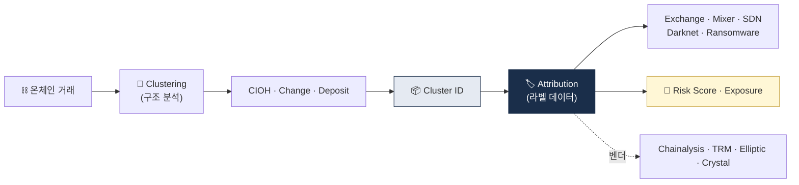

# Blockchain Analytics — 온체인 분석 기법

> KYT의 **기술적 기반**. 어떻게 익명 주소를 분석하는가. 이 글을 읽고 나면 Chainalysis·Elliptic·TRM Labs가 어떤 알고리즘 위에 돈을 벌고 있는지, 그리고 자체 구축이 왜 거의 불가능한지 근본 이유를 이해하게 됩니다. 마지막 업데이트: 2026-04-17.

## TL;DR
- 블록체인 분석의 두 축: **Clustering** (주소 묶기) + **Attribution** (주소→엔티티 매핑)
- 핵심 휴리스틱: **Common Input Ownership, Change Detection, Deposit Heuristic**
- Bitcoin (UTXO 모델) 과 Ethereum (Account 모델) 분석법이 다름
- Cross-chain 추적은 **시간·금액 매칭 + 브리지 인덱싱**으로
- 한계: privacy coin, 새 mixer, off-chain (CEX 내부) 거래

---

## 1. 두 축 — Clustering + Attribution




### 블록체인 분석이 답하려는 두 질문

블록체인 분석은 결국 두 가지 질문에 답하는 것입니다.

1. **이 주소들이 같은 사람인가?** → Clustering
2. **이 클러스터는 누구인가?** → Attribution

이 둘이 합쳐져야 "주소 `0x...` 가 누구"를 말할 수 있습니다. Clustering은 **순수 알고리즘**에 가깝고, Attribution은 **데이터·OSINT·파트너십**에 의존합니다. 알고리즘은 복제할 수 있어도 수년간의 누적 attribution DB는 후발주자가 따라잡기 어렵다 — 이게 Chainalysis·Elliptic·TRM의 **moat** 입니다.

> Clustering (구조 분석) + Attribution (라벨 데이터) = 전체 분석 능력

---

## 2. 주요 클러스터링 휴리스틱

### A. Common Input Ownership Heuristic (CIOH) — Bitcoin

**한 트랜잭션의 여러 input 주소 = 같은 사람이 통제.**

UTXO 모델 비트코인에서는 한 트랜잭션이 여러 UTXO를 input으로 소비합니다. 그런데 각 input을 소비하려면 해당 UTXO의 **private key로 서명**해야 하므로, 같은 트랜잭션에 모인 input들은 **모두 같은 개인키 소유자**가 통제한다는 결론.

**왜 강력한가**: 한 사용자가 주소를 100개로 쪼개도, 언젠가 여러 UTXO를 합쳐 큰 금액을 보내는 순간 그 100개가 한 클러스터로 묶입니다. 즉 **"탈익명화는 시간문제"** 에 가깝고, 이게 Chainalysis 같은 회사가 탄생한 기술적 근거입니다.

**예외·한계**: CoinJoin(Wasabi, Samourai) 같은 **협력 소비**는 서로 다른 엔티티가 의도적으로 input을 합치는 것이라 CIOH가 **오작동**합니다. 그래서 믹서 탐지는 CIOH를 그대로 쓰지 않고 "CoinJoin fingerprint"(균등 금액, 특정 output count)를 먼저 검출합니다.

### 2.A Common Input Ownership Heuristic — 엄밀 정의

**알고리즘**:

```
def common_input_ownership(tx: Transaction) -> set[Address] | None:
    if len(tx.inputs) < 2:
        return None
    if is_coinjoin(tx):   # 2.B 참조
        return None
    return {inp.address for inp in tx.inputs}
```

**전제**: Bitcoin UTXO에서 여러 input을 한 tx에 소비하려면 각 input의 private key에 접근해야 함 → "소유자 동일"이라는 통계적 가정.

**엄밀한 한계**:
- UTXO 모델에서만 성립. **Ethereum Account 모델 X** (from 주소가 항상 1개).
- CoinJoin(의도적 input 합치기)은 가정 위반.
- Custodial 거래소 hot wallet은 여러 고객 자금을 한 tx에 합침 → "거래소"라는 entity로는 맞지만 "고객"까지 맞지 않음.

**실증 정확도** (공개 벤치마크):

| 데이터셋 | Precision | Recall | F1 | 출처 |
|---|---|---|---|---|
| Bitcoin mainnet 랜덤 샘플 | 0.95~0.98 | 0.99 | 0.97 | Meiklejohn et al. 2013 |
| Elliptic (200K 라벨) | 0.87 | 0.93 | 0.90 | Weber et al. 2019 |
| CoinJoin 포함 샘플 | 0.75 | 0.98 | 0.85 | Möser & Böhme 2017 |
| Elliptic2 (2024) + Fingerprint 필터 결합 | 0.95 | 0.92 | 0.93 | Bellei et al. 2024 |

### 2.B CoinJoin Fingerprint Detection (CIOH 전 필터)

**문제**: Wasabi·Samourai Whirlpool·JoinMarket 같은 CoinJoin은 서로 다른 사용자가 의도적으로 input을 합침. CIOH 단독 적용 시 오분류(FP).

**Fingerprint 탐지 규칙** (Chainalysis·Elliptic 공통 추정):

```
def is_coinjoin(tx: Transaction) -> bool:
    # 1. Input 수 ≥ 2 (최소 조건)
    if len(tx.inputs) < 2:
        return False
    # 2. Output 동일 금액 클러스터 검출
    amounts = [o.value for o in tx.outputs]
    uniform_outputs = [a for a in amounts if amounts.count(a) >= 3]
    if not uniform_outputs:
        return False
    # 3. 고정 denomination (Wasabi 0.1 BTC, Samourai 0.001/0.01/0.1)
    KNOWN_DENOMS = {0.1e8, 0.01e8, 0.001e8}
    if any(a in KNOWN_DENOMS for a in uniform_outputs):
        return True
    # 4. Input/Output 비율 (Wasabi ~1:1.5, Whirlpool 5:5)
    if len(tx.inputs) >= 5 and len(tx.outputs) >= 5:
        if abs(len(tx.inputs) - len(tx.outputs)) <= 1:
            return True
    return False
```

**결합 정확도**:

| 방법 | Precision | Recall | 비고 |
|---|---|---|---|
| CIOH 단독 (CoinJoin 포함 데이터) | 0.75 | 0.98 | 75% FP |
| Fingerprint 필터 적용 후 CIOH | 0.95 | 0.92 | 프로덕션 표준 |
| ML 기반 CoinJoin 분류기(GNN) | 0.97 | 0.94 | Chainalysis Behavior 추정 |

**참고**:
- Meiklejohn et al. (2013) "A Fistful of Bitcoins: Characterizing Payments Among Men with No Names"
- Möser, Böhme (2017) "Anonymous Alone? Measuring Bitcoin's Second-Generation Anonymization Techniques"
- Bellei et al. (2024) "Shape vs. Structure: Topology-Aware Self-Supervised Learning for Anti-Money Laundering on Elliptic2"

### B. Change Detection (거스름돈 식별)

UTXO 모델에서 **거스름돈(change)은 새 주소로 반환**됩니다. 이 거스름돈 output을 원 주소 소유자와 같은 클러스터로 묶는 기법.

**휴리스틱**:
- 한 input → 두 output 중 한 쪽이 거스름돈
- 같은 클러스터 / 새 주소 / 더 작은 금액 등 패턴

**정확도**: 높지 않음 (약 60~80%). 단독으로는 오류가 많아 **보조 휴리스틱**으로 쓰입니다.

### C. Deposit Heuristic (거래소 입금 식별)

**배경**: 거래소는 고객별로 입금 주소를 별도 발급합니다. 고객이 입금하면 거래소는 이 자금을 주기적으로 **consolidation 주소**로 모아 콜드월렛·핫월렛 관리. 이 consolidation 흐름을 따라가면 거래소 주소 체계 전체가 드러납니다.

**결과**: 거래소 attribution의 핵심 방법. "이 주소에서 받는 consolidation 흐름이 Binance의 알려진 핫월렛으로 흐른다 → 이 주소는 Binance deposit 주소" 식의 추론.

### D. Behavior-based Clustering (행동 기반)

- 시간대, 금액, 거래 빈도 패턴이 비슷한 주소들
- ML 기반
- **약한 신호지만 다른 휴리스틱과 결합 시 강함**

### E. Multi-input Heuristic for Ethereum (계정 모델)

Ethereum은 UTXO가 아닌 **Account 모델**이라 CIOH를 **직접 적용 불가**. 대신 다음 패턴을 활용:

- 같은 EOA(Externally Owned Account)가 여러 contract와 상호작용하는 패턴
- Smart contract 호출 패턴 (funding relationship)
- Gas 지불 주소 분석 (누가 ETH로 가스비 내는가)
- 같은 ENS 도메인 사용

용어:
- **EOA (Externally Owned Account)** — 사용자가 private key로 통제하는 Ethereum 계정.
- **UTXO (Unspent Transaction Output)** — Bitcoin의 미사용 거래 출력. 비트코인의 기본 단위.

### 실무 포인트

Ethereum은 Bitcoin보다 **클러스터링이 구조적으로 더 어렵습니다**. 이게 Ethereum에서의 KYT 정확도가 Bitcoin보다 낮고, 특히 DeFi·wallet aggregator가 섞이면 분석 신뢰도가 떨어지는 이유. 실무에서는 "Ethereum은 Attribution DB 의존도가 더 크다"고 기억하면 됩니다.

---

## 3. Attribution — 주소를 누구에게 매핑하나

### 데이터 소스

Attribution은 "알고리즘"이 아니라 "**데이터 누적**" 의 문제입니다. 다음 소스들이 수년간 쌓여야 쓸 만한 DB가 됩니다.

| 소스 | 예시 |
|---|---|
| **자체 거래** | 분석회사가 거래소에 입금해 주소 라벨 확보 |
| **공개 정보** | 거래소가 공개한 hot/cold wallet 주소 |
| **다크넷 마켓** | 운영 관찰로 주소 라벨링 |
| **법집행 정보** | 압수·체포로 노출된 주소 |
| **OFAC SDN** | 정부 발표 (정기 업데이트) |
| **Smart Contract 분석** | 컨트랙트 deployer, 함수 호출 패턴 |
| **소셜 / OSINT** | 트위터·텔레그램에서 주소 노출 |

### 라벨 카테고리 (Chainalysis 기준 예시)

- Exchange (Binance, Upbit, ...)
- DEX (Uniswap, Curve, ...)
- Mixer (Tornado Cash, Wasabi, ...)
- Sanctions (OFAC SDN)
- Stolen Funds (해킹 자금)
- Ransomware (LockBit, BlackCat, ...)
- Darknet Market
- Scam (Pig Butchering, Romance, ...)
- Gambling
- Mining Pool
- High-risk Jurisdiction Exchange
- ATM
- Merchant Service

### 실무 포인트

Attribution DB는 **벤더마다 강점이 다릅니다**. Chainalysis는 북미 거래소·다크넷 강세, Elliptic은 유럽 강세, TRM Labs는 DeFi·cross-chain 강세, Crystal은 러시아·동유럽 강세. 글로벌 영업 VASP는 2개 이상 벤더를 병행하는 게 실무 표준.

---

## 4. Exposure Score — 수식·가중치·검증

### 4.1 정의

**Exposure Score**: 한 주소(또는 클러스터)가 위험 entity(OFAC·mixer·dark market 등)와 **N-hop 이내 연결**된 정도를 0~100 정수로 정량화.

- **Direct (1-hop)**: 분석 대상 ↔ 위험 entity 직접 거래
- **Indirect (N-hop, N≥2)**: 중개 주소 거쳐 도달. 보통 5-hop까지 분석 (그 이상은 noise 폭발)

### 4.2 벤더 일반화 공식

```
score = clip(
    Σ (e_direct_i × w_cat_i × f_amount × f_behavior)
    + Σ (e_indirect_j × w_cat_j × decay(age_j) × f_amount),
    0, 100
)
```

**변수**:
- e_direct_i, e_indirect_j: 카테고리 i·j 노출 비율(%) 또는 금액 비중
- w_cat: 카테고리 가중치 (아래 표)
- decay(age) = exp(-λ × age_days / 365), λ 기본 0.5 (벤더별 상이)
- f_amount = min(1 + ln(tx_krw / 100M), 1.3), floor 0
- f_behavior = 1.0 (정상) · 1.2~1.5 (smurfing·pass-through·layering 패턴)

**카테고리 가중치 w_cat** (값은 일반화 추정, 벤더별 조정):

| 카테고리 | Direct | 2-hop | 3-hop | 근거 |
|---|---|---|---|---|
| OFAC SDN | 10.0 | 5.0 | 2.0 | 국가 제재 최고 |
| UN/EU Sanctions | 8.0 | 4.0 | 1.5 | |
| Ransomware | 6.0 | 3.0 | 1.0 | 범죄수익 직접 |
| Mixer (Tornado·Wasabi) | 5.0 | 2.0 | 0.5 | 의도적 은닉 |
| Darknet Market | 4.0 | 1.5 | 0.3 | |
| Stolen Funds | 3.0 | 1.5 | 0.3 | 피해 자산 |
| High-Risk Exchange | 1.5 | 0.5 | 0.1 | 규제 미흡 |
| Gambling | 0.5 | 0 | 0 | 합법이지만 주의 |

### 4.3 시간 감쇠 (Decay Function)

```
decay(age_days) = exp(-λ × age_days / 365)
```

- 0일: 1.00
- 90일: 0.88
- 365일 (1년): 0.61
- 730일 (2년): 0.37
- 1,825일 (5년): 0.08

**λ 벤더 추정**:

| 벤더 | λ | 철학 |
|---|---|---|
| Chainalysis | 0.5 | 중간 |
| TRM Labs | 0.3 | 장기 추적 (대테러금융 초점) |
| Elliptic | 0.6 | 단기 반영 (유럽 TFR 1 EUR 임계 대응) |

### 4.4 워크드 예시

**시나리오**: 한국 VASP 고객 A, 5억원 출금 요청, 수신 0xABC...

KYT 조회 결과:
- Direct: Tornado Cash 5% ($20K), 180일 전 노출
- 2-hop: OFAC SDN (Ren Fiery) 8%, 365일 전
- Direct: Binance (HR-Exchange 아님) 0% — 제외
- 행동 패턴: 정상 (f_behavior = 1.0)
- 금액 배수: f_amount = min(1 + ln(5), 1.3) = 1.3

계산:
```
  direct_tornado = 5 × 5.0 × 1.3 × 1.0 = 32.5
  indirect_ofac = 8 × 5.0 × exp(-0.5 × 365/365) × 1.3 = 8 × 5.0 × 0.61 × 1.3 = 31.72
  score = clip(32.5 + 31.72, 0, 100) = 64.22 → 64점 (HIGH)
```

행동: BLOCK + STR 자동 발동.

**SQL 검증**:

```sql
WITH exposures AS (
  SELECT 'Tornado' AS category, 5.0 AS e_pct, 5.0 AS w, 1.0 AS decay, 1.3 AS f_amt, 1.0 AS f_beh
  UNION ALL
  SELECT 'OFAC_SDN', 8.0, 5.0, EXP(-0.5), 1.3, 1.0
)
SELECT LEAST(SUM(e_pct * w * decay * f_amt * f_beh), 100) AS risk_score
FROM exposures;
-- 결과: 64.22
```

### 4.5 FP 감축 (Override 룰)

KYT 점수 그대로 차단하면 FP 30~50%. 프로덕션 VASP는 고객 속성 기반 **재매핑**:

```
score_final = score × override_factor
```

override_factor 규칙:
- 고객 KYC Tier 3 (여권 + 주소 실사 + 자금원천 증빙): × 0.7
- 장기 거래 이력 (2년+ 이슈 없음): × 0.85
- 수신자가 자사 고객(내부 이체): × 0.6
- 거래 행동 비정상 (새벽·고속): × 1.2 (증가)

### 4.6 Threshold 튜닝 (KPI 기반)

목표 FP = 5%, FN = 1% 기준 월간 재조정:

```
def tune_threshold(alerts: list, labels: list, target_fp=0.05, target_fn=0.01):
    # ROC curve 상에서 target FP·FN에 가장 가까운 threshold 선택
    from sklearn.metrics import roc_curve
    fpr, tpr, thresholds = roc_curve(labels, [a.score for a in alerts])
    fnr = 1 - tpr
    # FP·FN 동시 충족하는 점 찾기
    candidates = [(t, f, n) for t, f, n in zip(thresholds, fpr, fnr)
                  if f <= target_fp and n <= target_fn]
    return max(candidates, key=lambda x: x[0])[0] if candidates else None
```

실제 한국 VASP 흐름: 월 1회 False Positive 리뷰 → threshold ±5 조정 → 효과 확인.

### 4.7 한계

1. Exposure는 **과거 거래 기반** → 실시간 새 라벨 반영 lag 수주~수개월
2. N-hop ≥ 5는 **지수 폭발** → 대부분 oversensitive, 실무는 3~5-hop만
3. **Mixer 진화** → 새 protocol(Silentpool·Railway 등) 라벨링 지연
4. **Cross-chain 미반영** → bridge matching 별도 (§5 참조)

### 실무 포인트

Exposure Score 공식은 벤더마다 다르고 **블랙박스인 경우가 많습니다**. 이게 STR 작성 시 "왜 이 점수인가" 설명이 어려운 원인. 실무 대응은 벤더에게 **sub-score breakdown**(Tornado 노출 X점, SDN Y점)을 API로 요청해서 사내 정책 언어로 재해석하는 것.

---

## 5. Cross-chain Tracing — Bridge Matching 알고리즘

### 도전

한 체인에서 끊어진 흐름이 다른 체인에서 시작되는 구조. 중간에 **wrapped 토큰화**(A의 ETH가 B의 wETH로)로 같은 가치지만 다른 형태가 됨.

### 5.1 문제 정의

Ethereum → Polygon → Arbitrum → Optimism 간 자산 이동은 **bridge contract**를 통함. 각 체인의 tx는 독립적 → KYT는 "bridge event를 체인 간 연결"해야 추적 유지.

### 5.2 Bridge 이벤트 구조

| 체인 | 이벤트 이름 | 주요 필드 | Nonce 있음? |
|---|---|---|---|
| Polygon PoS | LockEvent | (user, token, amount, targetChain, depositCount) | ✓ |
| Arbitrum | OutboundTransfer | (token, from, to, seqNumber, amount) | ✓ |
| Optimism | WithdrawalInitiated | (l1Token, l2Token, from, to, amount, nonce) | ✓ |
| Wormhole | LogMessagePublished | (sender, sequence, nonce, payload) | ✓ |
| LayerZero | PacketSent | (dstEid, receiver, payload) | generic — payload 해석 필요 |
| Hop Protocol | TransferSentToL2 | (chainId, recipient, amount, transferId) | transferId ~ nonce |

### 5.3 매칭 알고리즘

```
def match_bridge_events(
    lock_events: list[LockEvent],
    mint_events: list[MintEvent],
    time_window: int = 300,       # 초
    amount_tolerance: float = 0.005,  # 0.5%
) -> list[tuple[LockEvent, MintEvent]]:
    matches = []
    for lock in lock_events:
        candidates = []
        for mint in mint_events:
            if mint.token_canonical != lock.token_canonical:
                continue
            if abs(mint.timestamp - lock.timestamp) > time_window:
                continue
            if abs(mint.amount - lock.amount) / lock.amount > amount_tolerance:
                continue
            # Nonce 우선 매칭
            if hasattr(lock, 'nonce') and hasattr(mint, 'nonce'):
                if lock.nonce == mint.nonce:
                    candidates = [mint]  # 결정적
                    break
            candidates.append(mint)
        if len(candidates) == 1:
            matches.append((lock, candidates[0]))
        elif len(candidates) > 1:
            # 금액 차이 최소 선택 (차선책)
            best = min(candidates, key=lambda m: abs(m.amount - lock.amount))
            matches.append((lock, best))
        # 0개: Sunrise (destination 아직 도착 안 함) — 재큐잉
    return matches
```

### 5.4 실패 케이스

| 시나리오 | 원인 | 대응 |
|---|---|---|
| LayerZero Generic Message | Payload가 임의 bytes, 표준 금액 필드 X | payload decoder 필요 (DApp별) |
| Fee-on-Transfer 토큰 | Burn시 수수료 차감 → amount mismatch | tolerance 상향 (0.5% → 1%) |
| Batched Bridge | 한 tx에 여러 sender 합쳐 bridge | 개별 user 추적 불가능 |
| 시차 오류 | 같은 token·금액·nonce 없이 5분 내 우연 매칭 | 다중 filter 강화 |
| Failed Relay (stuck message) | destination이 며칠 후 도착 | time_window 확장 (5분 → 24시간) |

### 5.5 정확도 벤치마크 (공개 + 추정)

| Bridge | Nonce 매칭 | 매칭 정확도 | 특이점 |
|---|---|---|---|
| Polygon PoS | ✓ | 97~99% | 표준 |
| Arbitrum | ✓ | 96~99% | seqNumber 결정적 |
| Optimism | ✓ | 96~99% | 표준 |
| Wormhole | ✓ (VAA) | 94~98% | VAA 검증 필요 |
| Hop Protocol | transferId | 92~96% | transferRoot 거쳐 간접 |
| LayerZero OFT | generic | 85~92% | 토큰 bridge 타입만 |
| LayerZero Generic | 해독 필요 | 40~60% | DApp별 맞춤 decoder |

### 5.6 한계

- 위 정확도는 **단일 bridge** 기준. 2~3번 연속 hop(ETH→Poly→Arb→BSC) 시 정확도 **곱셈 감소** → 3-hop: ~0.90^3 ≈ 0.73
- 비표준 bridge (centralized OTC·P2P)는 온체인 이벤트 없음 → 추적 불가
- THORChain·Across 같은 liquidity 기반 bridge는 **pool 거치므로** sender-receiver 연결이 1:1 아님

### 실무 포인트

Cross-chain tracing은 2025~2026년 KYT 벤더의 **핵심 차별점**이 된 영역. PoC 시 cross-chain 시나리오(예: ETH → Solana, BTC → Avalanche)를 여러 패턴으로 테스트하고 벤더별 복원율을 비교하는 게 필수. 광고와 실제 성능 차이가 큰 영역입니다.

---

## 6. UTXO 모델 vs Account 모델 분석

### 이 표를 어떻게 읽어야 하나

두 모델의 분석 방법론이 근본적으로 다릅니다. 이 차이를 모르면 "왜 Bitcoin 분석이 Ethereum 분석보다 정확도가 높나" 같은 질문에 답할 수 없습니다.

| 측면 | Bitcoin (UTXO) | Ethereum (Account) |
|---|---|---|
| **기본 단위** | UTXO (unspent output) | Account (EOA + Contract) |
| **클러스터링** | Common Input Ownership 강력 | EOA-Contract 패턴 분석 |
| **Smart Contract** | 제한적 (Taproot 이후 확장) | 풍부 (분석 더 복잡) |
| **Token** | Layer 1엔 없음 (Ordinals 등 별도) | ERC-20/721/1155 풍부 |
| **분석 도구 성숙도** | 가장 성숙 | 활발히 발전 중 |

### 실무 포인트

같은 금액의 거래라도 Bitcoin과 Ethereum에서의 **분석 신뢰도가 다릅니다**. Bitcoin 기반 거래는 CIOH 덕분에 정확도가 높은 편이고, Ethereum은 Account 모델의 한계로 클러스터링 정확도가 낮습니다. Risk Score를 비교할 때 이 **체인별 정확도 차이**를 감안하지 않으면 Ethereum 거래의 위험이 과소평가되는 경향이 있습니다.

---

## 7. 분석 도구의 데이터 파이프라인

```
1. Node Operation (자체 풀노드 운영)
   - Bitcoin Core, Geth, Erigon, Reth
   - Archive node (전체 history)

2. Indexing
   - 트랜잭션 → 그래프 DB (Neo4j, JanusGraph)
   - 주소 ↔ 트랜잭션 매핑

3. Heuristic Clustering
   - CIOH·Change Detection·Deposit 휴리스틱 룰 적용
   - 클러스터 ID 부여

4. Attribution
   - 라벨 DB (자체 + 외부)
   - 클러스터 → 엔티티 매핑

5. Risk Scoring
   - Exposure 계산
   - 점수 산출

6. API / UI
   - 외부 KYT API
   - 분석가용 시각화 도구
```

### 실무 포인트

1번 Node Operation은 **인프라 비용이 가장 큰** 부분. Ethereum archive node 하나 유지에 SSD 수 TB + 높은 메모리 필요. 이게 자체 구축 시 초기 투자 부담이고, 결국 대형 VASP도 **자체 노드 + 벤더 API 하이브리드**로 가는 경제적 이유입니다.

---

## 8. ML·AI의 활용

### 적용 영역

- **클러스터링 보조**: 휴리스틱이 잡지 못하는 패턴 발견
- **이상거래 탐지**: 비정상 패턴 학습
- **NFT wash trading 탐지**: 그래프 Neural Network
- **새로운 mixer 식별**: 행위 패턴 분류
- **Scam wallet 사전 탐지**: phishing·rug pull 사전 식별

### 한계

- **라벨 데이터 부족** — 각 회사가 자체 보유, 공개 안 함
- **Adversarial behavior** — 분석을 회피하는 패턴이 학습됨 (분할 금액, 무작위 시간)
- **모델 설명가능성** — 규제 보고 시 "왜 STR 보고했나" 설명이 필요한데 블랙박스 ML은 불리

### 실무 포인트

ML 기반 탐지는 **보조 수단**으로 쓰는 게 안전합니다. 감독 검사에서 "이 고객은 어떤 근거로 STR 대상이 됐나" 질문에 "ML 모델이 그렇게 판단했습니다"는 불합격. **룰 기반 primary + ML 기반 hint**의 조합이 현실적.

---

## 9. 자체 구축 vs 벤더 활용

### 벤더 활용 장점

- **라벨 DB가 핵심 자산** → 자체 구축 거의 불가능
- **글로벌 attribution** (국경 넘는 데이터 수집)
- **규제 당국이 인정하는 표준 도구** (Chainalysis는 정부 기관 표준)

### 자체 구축 장점

- **비용 절감** (대형사에 한함)
- **한국 특화 라벨** (현지 거래소·사기 wallet·한국 다크넷)
- **사내 데이터와 결합 분석** (자사 고객 패턴)

### 현실

대부분 **하이브리드** — 외부 KYT API(Chainalysis 등) + 자체 한국 특화 분석 모듈. 한국 주요 거래소·수탁사도 Chainalysis/TRM 사용 + 자체 분석.

### 실무 포인트

"자체 구축 vs 벤더 활용"의 답은 **비용 기반이 아니라 규제 대응 기반**으로 봐야 합니다. 감독 검사에서 Chainalysis/TRM 같은 업계 표준 도구를 썼다고 하면 "충분히 주의를 기울였다"로 인정받기 쉽지만, 무명 자체 도구만 썼다면 "왜 이걸 믿을 수 있나"를 입증해야 합니다.

---

## 10. 한계와 미래

### 한계

- **Privacy coin** (Monero) 거의 분석 불가
- **새 mixer·새 bridge** 라벨링 lag time (수일~수주)
- **Off-chain** (CEX 내부 거래) 안 보임
- **Adversarial**: AI 시대에 자금세탁 자동화도 발전

### 미래 방향

- **AI 기반 패턴 탐지** 강화
- **Cross-chain analytics** 표준화
- **ZKP 적용** — 프라이버시 + 컴플라이언스 양립 시도 (개인정보 보호하면서 제재 준수)
- **공유 attribution DB** 가능성 (산업 협력 — 이상론 수준)

### 실무 포인트

ZKP(Zero-Knowledge Proof) 기반 프라이버시-컴플라이언스 양립은 **장기 방향**이지만 아직 실용화 초기. "프라이버시 있는 KYC" 시도(예: Polygon ID, Worldcoin)가 2026년 활발하지만 규제 당국 수용은 지연 중. 단기적으로는 여전히 "모두 보여주는 KYC + 암호화된 전송"이 표준입니다.

---

## 요약 부록 — 빠른 참조용

**두 축**: Clustering (구조) + Attribution (데이터)
**5대 휴리스틱**: CIOH · Change · Deposit · Behavior · Ethereum Multi-input
**체인별 차이**: Bitcoin UTXO = 강력한 클러스터링 / Ethereum Account = Attribution 의존
**Exposure 축**: Direct / Indirect (N-hop) / Risk Category 가중

## 💼 실무 현장 (Industry Reality)

### Attribution을 만드는 비용 구조 — Chainalysis 기준

Chainalysis는 2014년 창업, 2026년 현재 **누적 attribution 거래량 ~$24T+, 라벨링 주소 ~10억개**. 이 DB가 Moat이 되기까지의 투자:

- **초기 자본금**: $500M+ 누적 조달 (Accel·Benchmark·Coatue 등)
- **Node 인프라**: Bitcoin·Ethereum·30+ 체인 archive node → 서버 비용만 월 수백만 달러
- **데이터 엔지니어·리서처**: 300~400명 (전사 ~1,200명 중 30%+)
- **OSINT + 다크넷 관찰**: 전담 팀, 사법당국 협업

### Chainalysis 수익 구조 (추정)

| 라인 | 고객 | 연매출 비중 |
|---|---|---|
| **KYT** (거래소·VASP용 실시간 API) | 거래소, 은행, 결제사 | ~35% |
| **Reactor** (수사용 시각화 도구) | 정부·수사기관·로펌 | ~35% |
| **Data** (원본 데이터 라이선스) | 규제당국, 학술연구 | ~15% |
| **Crypto Investigations** (컨설팅) | 민간·공공 | ~15% |

2026년 전체 매출 ~$300~500M 추정, ARR 기준 연 성장 20~30%.

### KYT 벤더별 강점 (2026-Q1 PoC 비교)

| 벤더 | 강점 | 약점 | 한국 주 사용처 |
|---|---|---|---|
| **Chainalysis** | 북미·다크넷·정부 관계 압도적 | Asia OTC 커버리지 약간 부족 | Upbit·Bithumb·Coinone·Korbit (표준) |
| **TRM Labs** | Cross-chain·Asia OTC·AI 탐지 | 일부 레거시 체인 부족 | 보조 도구로 병행 채택 증가 |
| **Elliptic** | 유럽·NFT·DeFi 그래프 분석 | 북미 점유율 상대적 약함 | 유럽 진출 한국 기업 검토 |
| **Crystal (Bitfury)** | 러시아·동유럽·Lazarus 심층 | UI 상대적 구형 | 특수 리서치용 |
| **Merkle Science** | 실시간 DeFi·LST 탐지 | 소규모 | 신규 진입 중 |

### 자체 구축 시도의 실패 이유

한국·일본 몇몇 대형 거래소가 2020~2022년 자체 KYT 구축 시도했으나 대부분 **Chainalysis로 회귀**:

- **Attribution 라벨**: 자체 팀 10명이 1년 해도 Chainalysis 1주 수집량 못 따라감
- **노드 인프라 비용**: Ethereum archive 하나에 월 $50K+
- **신규 프로토콜 대응**: 매월 새 브리지·DeFi 출시 → 전담팀 없이 불가
- **감독 인정**: FIU가 "Chainalysis 썼다"면 **de facto 면책**, 무명 자체 툴은 입증 부담

### 자주 나오는 오해

- **"Chainalysis 하나만 믿으면 OK"** — 벤더 한 곳에 과의존은 사각지대·가격 협상력 상실. 글로벌 대형은 **2~3 벤더 병행**.
- **"UTXO와 Account 모델 분석 비용이 같다"** — Ethereum archive + 토큰 인덱싱이 Bitcoin 대비 5~10배 비쌈.
- **"Monero도 곧 분석 가능"** — Chainalysis가 2020년 부분 분석 도구 발표했지만 실무 적용 여전 제한. 완전 추적 불가는 지속.

### 주니어 분석가가 Chainalysis Reactor로 하는 일

Reactor는 Chainalysis의 **시각화 수사 도구** — 주니어 Analyst의 메인 UI:

- **주소 클릭** → 소스·목적지 그래프 시각화
- **Category 필터**: Mixer·SDN·Darknet 등으로 좁히기
- **Timeline 뷰**: 시간순 자금 흐름 재생
- **클러스터 확장**: "이 주소와 같은 사람이 통제하는 다른 주소들"
- **Export**: STR 첨부용 PDF 리포트 자동 생성

Chainalysis Academy(무료 교육)가 주니어 교육의 사실상 표준. **Chainalysis Investigations Certification(CCI)** 가 AML 분석가 이력서 단골 스펙.

### 한국 특수 현실

- **한국 거래소 Attribution**: Chainalysis도 한국 4대 거래소는 잘 커버하지만 중소 거래소(코인마켓 포함)는 커버리지 부족. 국내 경찰·검찰 협력 필수.
- **원화 OTC 추적**: Chainalysis는 원화 Off-chain 플로우는 못 봄. 은행 실명계좌 조회는 FIU·경찰의 영역.
- **Lazarus 분석**: 국가정보원·KoFIU가 Chainalysis Reactor 라이선스 다수 보유. 민간 VASP와 별도 수사 라인.

---

## 11. Clustering & AML 벤치마크 — 공개 논문·데이터셋

### 11.1 공개 벤치마크 데이터셋

| 데이터셋 | 연도 | 규모 | 라벨 | 용도 |
|---|---|---|---|---|
| Elliptic | 2019 | 203K nodes, 234K edges | 23% labeled | 첫 공개 AML 그래프 |
| Elliptic++ | 2022 | ~840K txs, 1.6M addresses | Address+Tx 양쪽 | 확장판 |
| Elliptic2 | 2024 | ~122M txs, 196M transactions | Subgraph-level labels | Shape-aware |
| BABD-13 | 2022 | 13 behavior classes | Supervised | 주소 분류 |
| WalletExplorer dump | 계속 | ~8M addresses | 거래소 태깅 | 라벨 씨드 |

### 11.2 알고리즘 정확도 비교

**Bitcoin clustering** (Elliptic/Elliptic2 기준):

| 방법 | Precision | Recall | F1 | 출처 |
|---|---|---|---|---|
| CIOH 단독 | 0.87 | 0.93 | 0.90 | Meiklejohn 2013 재현 |
| CIOH + Change Detection | 0.91 | 0.95 | 0.93 | Androulaki 2013 |
| CIOH + CoinJoin Fingerprint | 0.95 | 0.92 | 0.93 | Möser 2017 기반 |
| Random Forest (Elliptic) | 0.93 | 0.77 | 0.84 | Weber 2019 |
| GCN (Graph Conv Network) | 0.92 | 0.83 | 0.87 | Weber 2019 |
| GAT (Graph Attention) | 0.94 | 0.86 | 0.90 | Alarab 2020 |
| Shape-based SSL (Elliptic2) | 0.96 | 0.89 | 0.92 | Bellei 2024 |
| Chainalysis Behavior (proprietary) | ~0.97 claim | ~0.95 claim | N/A | 내부 |

### 11.3 핵심 참조 논문

- **Meiklejohn et al. (2013)** — "A Fistful of Bitcoins" (IMC) — CIOH·Change detection 초기 공식화
- **Androulaki et al. (2013)** — "Evaluating User Privacy in Bitcoin" (FC) — 클러스터링 실증
- **Möser & Böhme (2017)** — "Anonymous Alone? Measuring Bitcoin's Second-Generation Anonymization" (ESORICS) — CoinJoin 분석
- **Weber et al. (2019)** — "Anti-Money Laundering in Bitcoin: Experimenting with Graph Convolutional Networks" — Elliptic 공개
- **Harlev et al. (2018)** — "Breaking Bad: De-Anonymising Entity Types on the Bitcoin Blockchain"
- **Bellei et al. (2024)** — "Shape vs. Structure" (Elliptic2 공개)
- **Xiang et al. (2022)** — "BABD: A Bitcoin Address Behavior Dataset"
- **Farrugia et al. (2020)** — "Detection of Illicit Accounts over the Ethereum Blockchain"

### 11.4 한국·Ethereum 공개 데이터

- Etherscan 라벨 ≈ 500K (2026년 기준, 영어 라벨)
- DAXA 5사 공동 블랙리스트: 내부 공유 (외부 비공개)
- 국내 벤더 (Uppsala Security·Cignal Labs) 라벨: 유료 API
- 학술 목적 한국 KYT 데이터셋 공개는 없음 (PIPA 제약)

---

## 더 읽을거리
- [`kyc-kyt.md`](kyc-kyt.md) — KYT의 운영적 측면
- [`travel-rule-protocols.md`](travel-rule-protocols.md) — VASP 식별과의 관계
- [`../3-crypto-aml/onchain-typology.md`](../3-crypto-aml/onchain-typology.md) — 자금세탁 패턴
- [`../7-vendors/analytics-vendors.md`](../7-vendors/analytics-vendors.md) — 벤더 비교
- [TRM Labs — Blockchain Analytics 정의](https://www.trmlabs.com/glossary/blockchain-analytics)
- [Elementus — Data Science Heuristics](https://www.elementus.io/blog-post/decoding-the-chain-how-data-science-based-heuristics-reveal-blockchain-networks)
- [AMLBot — Wallet Clustering](https://blog.amlbot.com/wallet-and-entity-identification-in-blockchain-analytics/)
- Meiklejohn et al. (2013), "A Fistful of Bitcoins" — CIOH 정립
- Möser & Böhme (2017), "Anonymous Alone?" — CoinJoin fingerprint 기초
- Weber et al. (2019), "Anti-Money Laundering in Bitcoin with GCN" — Elliptic 공개
- Bellei et al. (2024), "Shape vs. Structure" — Elliptic2 공개
