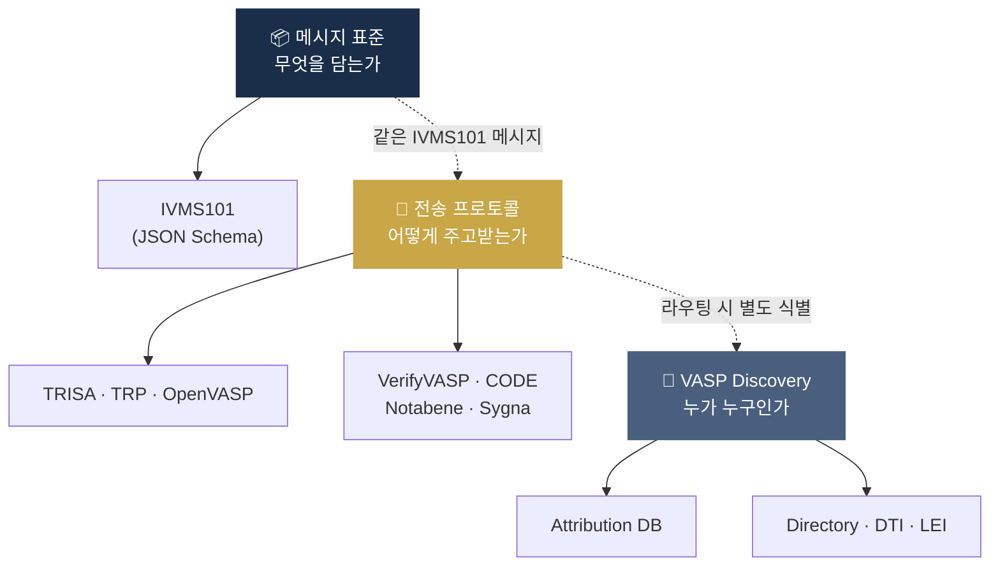
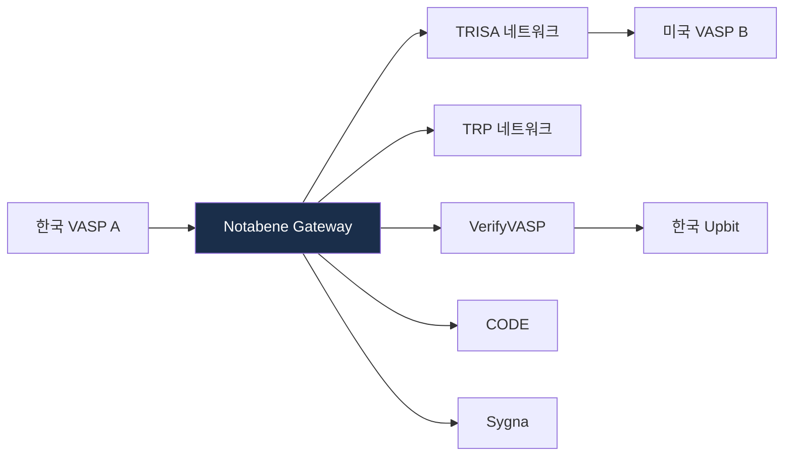

# Travel Rule Protocols — 기술 표준 / 메시징 프로토콜

> Travel Rule을 **실제로 어떻게** 메시지로 주고받는가. 이 글을 읽고 나면 "IVMS101은 표준이고 TRISA는 프로토콜이다"라는 흔한 혼동을 정리하고, 왜 2026년에도 Notabene Gateway가 가장 실용적 선택이 되는지 이해하게 됩니다. 마지막 업데이트: 2026-04-17.

## TL;DR
- **메시지 표준 = IVMS101** (사실상 글로벌 표준, 모든 프로토콜이 페이로드로 사용)
- **전송 프로토콜**은 다양: TRP, TRISA, OpenVASP, VerifyVASP, CODE, Notabene Gateway
- 두 가지 모델: **분산형 (TRISA, OpenVASP)** vs **폐쇄형 (VerifyVASP, CODE)**
- **상호운용성(interoperability)** 이 가장 큰 기술 과제 — Notabene Gateway가 부상한 이유
- **VASP Discovery** (지갑 → VASP 매핑)는 별도 인프라 (DTI, GLEIF LEI, attribution DB)

---

## 1. 표준 vs 프로토콜 vs Discovery — 3개를 분리해서 이해하라




### 왜 혼동이 자주 일어나나

Travel Rule 구현에서 용어 혼동의 대부분은 **"메시지에 뭘 넣을지"(표준)** 와 **"어떻게 주고받을지"(프로토콜)** 와 **"누구에게 보낼지"(Discovery)** 가 서로 다른 층위라는 걸 몰라서 생깁니다. 이 3개는 독립적으로 선택할 수 있으며, 같은 IVMS101 메시지를 다른 프로토콜로 주고받을 수 있습니다.

### 이 표를 어떻게 읽어야 하나

3개 층을 세로로 잡고 각각의 역할·예시를 병렬 비교. 회사가 Travel Rule 시스템을 설계할 때 **각 층마다 별도 결정**이 필요합니다.

| 구분 | 역할 | 예시 |
|---|---|---|
| **메시지 표준** | 무엇을 담는가 (필드 구조) | IVMS101 |
| **전송 프로토콜** | 어떻게 주고받는가 (네트워크) | TRISA, TRP, OpenVASP, VerifyVASP, CODE |
| **VASP Discovery** | 누가 누구인가 (라우팅) | Attribution DB, DTI, GLEIF LEI |

---

## 2. IVMS101 — 메시지 표준 상세

### 정체성

- **InterVASP Messaging Standard 101**
- 2020년 InterVASP Joint Working Group (JWG) 합의
- 참여사: Sygna(CoolBitX), TRISA(CipherTrace), Notabene, Securrency 등
- JSON Schema 기반

### 왜 표준이 필요했나

2019~2020년 초기에는 각 프로토콜이 자체 메시지 형식을 썼습니다. TRISA는 TRISA대로, Sygna는 Sygna대로. 결과: A 거래소가 TRISA로 보낸 메시지를 B 거래소가 Sygna로 받으면 **필드 변환 과정에서 정보 손실**이 발생. 이 문제를 풀려고 주요 플레이어들이 모여 합의한 공통 JSON 스키마가 IVMS101.

### 핵심 데이터 모델

```
IVMS101 Message
├── Originator (송신인)
│   ├── OriginatorPersons: [NaturalPerson | LegalPerson]
│   └── AccountNumbers: [지갑주소]
├── Beneficiary (수신인)
│   ├── BeneficiaryPersons: [...]
│   └── AccountNumbers: [...]
├── OriginatingVASP
├── BeneficiaryVASP
├── TransferPath
└── PayloadMetadata
```

### NaturalPerson 필드 — 필수 vs 선택

- **Name** (필수): primary + secondary identifier
- **GeographicAddress** (선택)
- **NationalIdentification** (선택): passport, ID 등
- **DateAndPlaceOfBirth** (선택)
- **CountryOfResidence** (선택)
- **CustomerIdentification** (선택)

### 관할별 차이 처리

- **한국**: 신원확인번호 대신 이름·주소 조합 가능
- **EU TFR**: 모든 필드 필수 (강제력 ↑)
- **미국 BSA**: 이름·주소·계좌 + (1만 USD 초과 시 ID#)

### 실무 포인트

IVMS101 validator 구현에서 가장 어려운 부분은 **관할별 필수 필드 차이** 처리입니다. 한국 송신 → EU 수신일 경우 수신 측은 EU 기준으로 검증하므로 한국이 채워준 필드가 EU 기준에 부족할 수 있습니다. 이 mismatch를 **거절**할지 **보완 요청**할지의 정책을 회사 차원에서 명문화해야 합니다.

---

## 3. 주요 전송 프로토콜

### A. TRISA (Travel Rule Information Sharing Architecture)

- **운영**: TRISA 비영리 (CipherTrace 시작 → Mastercard 인수)
- **모델**: 분산형, 인증서 기반 (PKI)
- **특징**: VASP가 X.509 인증서로 신원 확인, peer-to-peer gRPC 통신, 오픈소스
- **장점**: 누구나 참여 가능, 중앙 의존 적음
- **단점**: 운영 복잡, VASP 식별이 별도 필요

### B. TRP (Travel Rule Protocol)

- **운영**: 21 Analytics, ING 등 주도
- **모델**: REST API 기반
- **특징**: 가벼움, 표준 HTTP/HTTPS, JWT 또는 인증서 인증, 빠른 구현
- **장점**: 단순함, 구현 공수 낮음
- **단점**: 분산형이지만 식별 메커니즘 별도 필요

### C. OpenVASP

- **운영**: OpenVASP Association (Bitcoin Suisse, Sygnum 등)
- **모델**: 분산형, Ethereum 기반
- **특징**: ENS, Whisper messaging 활용
- **현황**: 2026년 시점 **활용도 낮음** (TRISA·TRP 우세)

### D. VerifyVASP

- **운영**: 람다256 (Upbit 자회사) + Chainalysis 합작
- **모델**: 폐쇄형 컨소시엄 (사전 검증된 VASP만 참여)
- **사용**: Upbit 외 다수 글로벌 거래소
- **특징**: 카운터파티 신뢰성 보장, 한국 4대 거래소 중 Upbit 채택, CODE와 연동 완료

### E. CODE

- **운영**: 코드 (빗썸 + 코빗 + 코인원 합작법인)
- **모델**: 폐쇄형 컨소시엄
- **사용**: 빗썸·코빗·코인원 + 일부 외부
- **특징**: 한국 컨소시엄, 2022 시행 시점부터 운영, VerifyVASP와 연동

### F. Notabene Gateway

- **운영**: Notabene Inc. (미국)
- **모델**: SaaS 게이트웨이 + 멀티프로토콜
- **특징**: TRISA·TRP·OpenVASP·VerifyVASP·CODE 등 **다중 프로토콜 동시 지원**, 한 번 연결로 다 처리, VASP Discovery 통합
- **사용**: 1,500+ VASP
- **왜 부상했나**: **Sunrise Issue 해결책**. 다양한 프로토콜을 운영하는 전 세계 VASP들과 일일이 연결하지 않고, Notabene을 허브로 두는 구조.

### G. Sygna (CoolBitX)

- **운영**: 대만 CoolBitX
- **사용**: 아시아권 거래소 다수
- **특징**: 자체 hub 구조

### H. 기타

- **Sumsub Travel Rule**: KYC와 통합
- **Global Travel Rule (GTR)**: BitGo 등 일부 사용

### 실무 포인트

프로토콜 선택은 **고객 지리적 분포**로 결정합니다. 한국 로컬 집중이면 VerifyVASP 또는 CODE, 아시아권 중심이면 Sygna + 이상 하나, 글로벌이면 Notabene + TRISA 조합이 일반적. "한 프로토콜만 쓰겠다"는 전략은 Sunrise Issue로 빠르게 한계에 부딪힙니다.

---

## 4. 분산형 vs 폐쇄형 — 트레이드오프

### 이 표를 어떻게 읽어야 하나

두 모델은 **철학이 다릅니다**. 분산형은 "누구나 참여할 수 있어야 공정하다", 폐쇄형은 "서로 신뢰할 수 있는 회원사끼리만 주고받자". 어느 쪽이 맞다는 답은 없고, **관할과 시장 구조**에 따라 선택됩니다.

| 항목 | 분산형 (TRISA, OpenVASP) | 폐쇄형 (VerifyVASP, CODE) |
|---|---|---|
| **참여 진입장벽** | 낮음 (오픈) | 높음 (검증 필요) |
| **신뢰 모델** | 인증서 + 검증 | 컨소시엄 사전 검증 |
| **확장성** | 높음 (이론) | 낮음 (회원사 한정) |
| **라우팅** | 별도 식별 필요 | 컨소시엄 내 자동 |
| **운영 책임** | 각자 | 컨소시엄 운영자 |
| **한국 적합성** | 낮음 | 높음 (실제 채택) |

### 한국이 폐쇄형을 택한 이유

한국 4대 거래소는 **사업자 수가 적고 상호 신뢰 구축이 상대적으로 쉬운** 시장 구조. 분산형 인증서 관리보다 **합작법인 거버넌스**가 더 간단하게 문제를 해결. 반면 미국·EU는 VASP가 수백 개로 많아 폐쇄형 컨소시엄이 사실상 불가능하고, 분산형 + 게이트웨이 모델이 현실적.

### 실무 포인트

한국 시장에 진입하는 외국 VASP는 **VerifyVASP 또는 CODE 회원 가입을 먼저 준비**하는 게 실무입니다. 자체 TRISA·TRP만 운영하고 한국 거래소로 출금이 오기를 기다리면 한국 측이 메시지를 받지 못해 거래가 막힙니다. Notabene Gateway를 쓰면 자동 연결되지만 별도 비용.

---

## 5. VASP Discovery — 지갑 주소가 어느 VASP인가

### 문제

출금 주소 `0xABC...`가 들어오면, **어느 VASP의 것인지** 알아야 그 VASP에게 메시지를 보낼 수 있습니다. 지갑 주소만 봐서는 식별 불가.

### 해결책 5가지

#### A. Attribution DB 활용

- Chainalysis·TRM·Elliptic의 라벨 DB
- 알려진 거래소 deposit 주소 → 해당 거래소 식별
- **자체 deposit 주소 ≠ 거래소 식별 정보 누락 가능성** — 라벨링이 최신이 아닐 수 있음

#### B. VASP Directory 서비스

- OpenVASP Directory, TRISA Directory, Notabene Directory
- 각 VASP의 메시징 endpoint + 인증서 등록
- 카운터파티 직접 조회

#### C. DTI (Digital Token Identifier, ISO 24165)

- ISO 표준 토큰 식별자 + VASP LEI 연결
- 2024년부터 EU 등 채택 시작

#### D. GLEIF LEI (Legal Entity Identifier)

- 법인 식별 글로벌 표준
- VASP가 LEI 보유 시 메시지에 포함

#### E. 카운터파티 직접 등록

- VASP끼리 사전에 주소 화이트리스트 교환

### 실무 포인트

현실적으로는 A + B 조합이 대부분입니다. Attribution DB로 1차 식별하고, 식별 안 되거나 모호하면 Directory 조회. 그래도 안 되면 **수동 검토 큐**로 넘기는 게 실무 흐름. 완벽한 자동화는 불가능하며, 매달 수백~수천 건의 수동 처리가 남습니다.

---

## 6. 호환성 / Interoperability 문제

### Sunrise Issue (미시행 관할 카운터파티)

일부 국가는 Travel Rule 시행 안 함 → 메시지 수신할 인프라 없음. **해결**: 폴백 정책 (송금 보류, 수동 확인, 거절).

### Protocol Mismatch

A 거래소는 TRISA 사용, B는 VerifyVASP 사용 → 직접 호환 안 됨.
- **해결 1**: Notabene Gateway 같은 멀티프로토콜 hub
- **해결 2**: 양 프로토콜 동시 지원 (한국: VerifyVASP + CODE 양쪽 가입)

### Schema Version Mismatch

IVMS101에도 마이너 버전 차이 존재 → 필드 매핑 mismatch 가능성.
- **해결**: 표준 컨버터 / fallback 매핑

### 실무 포인트

세 mismatch 중 **Protocol Mismatch**가 운영상 가장 빈번한 실패 원인. 이를 방어하려면 회사 Travel Rule 시스템이 **멀티 프로토콜 어댑터**를 갖는 게 이상적이지만 공수 부담이 큽니다. 대안은 Notabene Gateway 같은 SaaS에 위임하는 것.

---

## 7. 한국 시장 운영 패턴

```
Upbit (VerifyVASP)
  ├─ 해외 VASP에게 송금: VerifyVASP 직접 또는 Notabene Gateway 경유
  └─ 빗썸·코빗·코인원에게 송금: VerifyVASP ↔ CODE 연동

빗썸·코빗·코인원 (CODE)
  ├─ 해외 VASP에게 송금: CODE 또는 Notabene Gateway
  └─ Upbit에게 송금: CODE ↔ VerifyVASP 연동

수탁업자 — Travel Rule 적용 범위 검토 필요
  ├─ 고객 출금 시 외부 VASP로 가면 적용
  └─ 내부 wallet 간 이동은 적용 X
```

### 실무 포인트

수탁업자는 "내부 wallet 간 이동" 이 **Travel Rule 적용 대상이 아니라는 점**이 실무 포인트. 고객 자산을 한 콜드월렛에서 다른 콜드월렛으로 옮기는 것은 "VASP 간 이전"이 아닌 "내부 운영". 이 구분을 정책에 명문화하지 않으면 불필요한 Travel Rule 메시지를 발송하게 됩니다.

---

## 8. 기술 스택 통합 예시

```
[ User Request: 출금 ]
        ▼
[ KYC / KYT 1차 체크 ]
        ▼
[ Sanctions Screening ]
        ▼
[ Travel Rule SDK ]
   ├─ Counterparty Discovery (Attribution DB)
   ├─ IVMS101 Message Build
   ├─ Protocol Selection (TRISA / VerifyVASP / CODE / ...)
   ├─ Send via Notabene Gateway or Direct
   ▼
[ Counterparty VASP Response ]
   ├─ Accept → 계속
   ├─ Reject → 송금 거절, 사용자 통지
   ├─ Hold → 수동 검토
   └─ Timeout → 폴백 정책
        ▼
[ On-chain Broadcast ]
        ▼
[ Travel Rule Message 보관 (15년) ]
```

### 실무 포인트

이 흐름에서 가장 자주 고장 나는 지점은 **Counterparty Response의 Timeout** 처리. 카운터파티가 응답하지 않을 때 얼마나 기다리고 어떻게 처리할지에 대한 정책이 명확해야 합니다. 너무 짧으면 Timeout 폴백이 남발되고, 너무 길면 사용자 UX가 망가집니다. 실무 표준은 **15초~60초 대기 + 폴백**.

---

## 9. 회사 도입 체크리스트

```
□ 메인 프로토콜 선택 (한국이면 VerifyVASP 또는 CODE)
□ 글로벌 호환성 (Notabene Gateway 등 검토)
□ IVMS101 메시지 검증 로직
□ Counterparty Discovery 인프라
□ 미연결 카운터파티 폴백 정책 명문화
□ 메시지 보관 (한국 15년, EU 5년 등)
□ PII 암호화 + 접근 통제
□ Audit Log
□ 시간 동기화 (NTP) — 메시지 timestamp 일치
□ 인증서 갱신 자동화 (TRISA의 경우)
```

---

## 요약 부록 — 빠른 참조용

**3층 구조**: 메시지(IVMS101) / 프로토콜(TRISA·VerifyVASP·CODE·Notabene…) / Discovery(Attribution DB·DTI·LEI)
**모델 2분법**: 분산형(TRISA, OpenVASP) vs 폐쇄형(VerifyVASP, CODE)
**한국 현실**: Upbit = VerifyVASP / 빗썸·코빗·코인원 = CODE / 두 솔루션 상호 연동
**글로벌 실무**: Notabene Gateway가 멀티프로토콜 허브로 사실상 표준

## 💼 실무 현장 (Industry Reality)

### Notabene Gateway 실사용 — 멀티프로토콜 허브

Notabene은 2020년 뉴욕 창업, 2026년 기준 **1,500+ VASP 연결**. 한 VASP가 Notabene 1곳에 연결하면 전 세계 다른 VASP와 자동 라우팅:



**가격**: 월 구독제, 소형 $5K~$20K/월, 대형 $50K+/월. 글로벌 영업 VASP에 사실상 필수.

### Notabene Gateway vs 한국 컨소시엄 선택 기준

| 기준 | Notabene | VerifyVASP | CODE |
|---|---|---|---|
| 글로벌 커버리지 | ★★★★★ | ★★★★ | ★★★ |
| 한국 4사 연결 | △ (VV/CODE 경유) | ◎ | ◎ |
| 초기 연동 공수 | 2~4주 | 4~8주 | 4~8주 |
| 월 비용 | 중~고 | 포함 (회원사 구조) | 포함 |
| 한국어 지원 | ❌ | ✅ | ✅ |
| 적합 사업자 | 글로벌 지향 | Upbit·Chainalysis 기반 | 빗썸·코빗·코인원 |

### 실제 메시지 교환 로그 샘플 (의사 데이터)

```json
{
  "msg_id": "tr-2026-04-15-001",
  "timestamp": "2026-04-15T14:32:11Z",
  "status": "ACCEPTED",
  "protocol": "VerifyVASP",
  "originator_vasp": "Upbit (Dunamu)",
  "beneficiary_vasp": "Bithumb",
  "originator": {
    "name": "김**수",  // 마스킹된 표현
    "wallet": "bc1q...abc",
    "country": "KR"
  },
  "beneficiary": {
    "name": "이**영",
    "wallet": "bc1q...xyz"
  },
  "amount_krw": 5000000,
  "routing_latency_ms": 847
}
```

### Sunrise Issue — 한국 VASP 실제 Timeout 통계

대형 한국 거래소 월간 Travel Rule 통계 (추정):

- 전체 송금 시도: **50,000~100,000건/월**
- Travel Rule 필요: 약 **30~40%** (100만원 이상)
- **자동 성공**: ~85%
- **카운터파티 Timeout**: ~8% → 폴백 처리
- **거절/취소**: ~5% → 미신고 VASP·blacklist
- **수동 리뷰**: ~2%

### 자주 나오는 오해

- **"IVMS101만 지원하면 Travel Rule 완성"** — 메시지 형식만 맞추는 건 기본. 실제론 **프로토콜 선택 + VASP Discovery + 폴백 정책**이 3대 축.
- **"Notabene Gateway = 특정 프로토콜"** — Notabene은 메시지 라우터. 실제 전송은 여전히 TRISA·TRP·VerifyVASP 등 하부 프로토콜이 담당.
- **"VerifyVASP ↔ CODE 연동 = 완전 투명"** — 실제 운영에선 월 1~2회 API 타임아웃 장애. 담당 엔지니어 on-call 필요.

### 주니어 KYT 엔지니어 하루 — Travel Rule 관련

- 전날 Travel Rule 실패 로그 (보통 5~20건) 분석: timeout, schema mismatch, counterparty unknown
- 신규 글로벌 VASP 연결 요청 (Notabene Directory에서 추가) 처리
- IVMS101 schema validator 업데이트 (EU TFR 필드 변경 등)
- 월간 AMLO 브리핑: "어느 카운터파티로 반복 실패, 차단 제안"

### 한국 특수 현실

- **VerifyVASP ↔ CODE 연동이 2022-05 완성**: 3개월간 Upbit ↔ 빗썸 송금 불가 경험이 업계 트라우마. 이후 **이중 가입**이 표준.
- **Notabene은 한국 공식 진출 안 함**: 대형 거래소는 Notabene 직접 계약 or 글로벌 거래소 경유. 중소는 거의 미사용.
- **메시지 15년 보관**: 이용자보호법 §11 적용 해석. WORM 스토리지 필수, 무결성 해시 체크 정기 감사.
- **개인정보 국외이전**: 한국 고객 정보가 해외 VASP에 넘어가는 순간 PIPA 국외이전 동의 필요. 대부분 이용약관에 포괄 동의 받지만, 개인정보보호위원회(PIPC) 가이드 점차 엄격화 중.

---

## 더 읽을거리
- [`../3-crypto-aml/travel-rule.md`](../3-crypto-aml/travel-rule.md) — Travel Rule 운영 전반
- [`../7-vendors/travel-rule-vendors.md`](../7-vendors/travel-rule-vendors.md) — 벤더 비교
- [`../7-vendors/korea-solutions.md`](../7-vendors/korea-solutions.md) — 한국 시장
- [Notabene — IVMS101 분석](https://notabene.id/travel-rule-messaging-protocols/ivms-101)
- [Notabene — VerifyVASP 분석](https://notabene.id/travel-rule-messaging-protocols/verifyvasp)
- [21 Analytics — Open-Source IVMS101](https://www.21analytics.co/blog/21-analytics-open-sources-its-intervasp-ivms-101-implementation/)
- [Sygna — IVMS101 합의 발표](https://www.sygna.io/blog/joint-working-group-adopts-ivms101-crypto-messaging-standard-for-fatf-travel-rule/)
- [VerifyVASP IVMS101 문서](https://www.verifyvasp.com/)
- [CodeVASP 공식 사이트](https://www.codevasp.com/ko)
