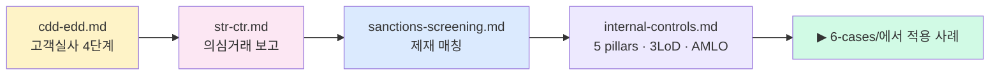

# 5️⃣ Compliance — 운영 실무

> 법·기술이 만나서 **사람이 돌리는 하루 운영**이 되는 층. CDD·EDD·STR·제재·거버넌스. 마지막 업데이트: 2026-04-20.

## 누가 먼저 읽어야 하나

- 👩‍💼 AMLO·AML 팀원·컴플라이언스 실무자 (직접 돌리는 사람)
- 📋 KoFIU·감독당국 검사 대응 담당자
- 🧱 내부통제·감사·3LoD 구조를 **설계**하는 CxO·법무

## 읽는 순서

## 파일 인덱스

| # | 파일 | 핵심 질문 | 배우고 나면 |
|---|---|---|---|
| 1 | [`cdd-edd.md`](cdd-edd.md) | 표준 실사 4단계 + 어떤 트리거로 EDD로 올리나? | 가상자산 비대면이 왜 항상 위험 가중인지 설명 |
| 2 | [`str-ctr.md`](str-ctr.md) | 좋은 STR과 나쁜 STR의 차이? Tipping-off란? | "AML 시스템의 출구" 의미 이해 + SOP 작성 가능 |
| 3 | [`sanctions-screening.md`](sanctions-screening.md) | OFAC 2차 제재가 왜 한국 거래소에도 강제력이 있나? | 거래 전·중·후 3지점 스크리닝 설계 |
| 4 | [`internal-controls.md`](internal-controls.md) | AMLO가 왜 단순 직책이 아니라 의사결정권자인가? | 5 pillars + 3LoD + AMLO 구조 그릴 수 있음 |

## 핵심 출구

- CDD 4단계(식별→검증→목적·자금원→모니터링) + EDD 트리거 5개 이상 암기
- STR: 금액 무관 + Tipping-off 금지 + 보고 기한
- 제재 매칭 False Positive 줄이는 기술 3개 이상(fuzzy·transliteration·DOB)
- 5 pillars: (1) Written policy (2) AMLO 지정 (3) 교육 (4) 독립 감사 (5) CDD/RBA
- 3LoD: 1선(영업·KYC) / 2선(컴플라이언스) / 3선(내부 감사)

## 다음 단계

- 실제 Enforcement 결과 확인 → [`../6-cases/README.md`](../6-cases/README.md)
- 한국 특수 절차 + KoFIU → [`../2-regulations/korea-fiu-act.md`](../2-regulations/korea-fiu-act.md)
- 상위 인덱스 → [`../README.md`](../README.md)
