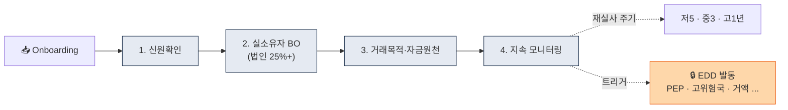
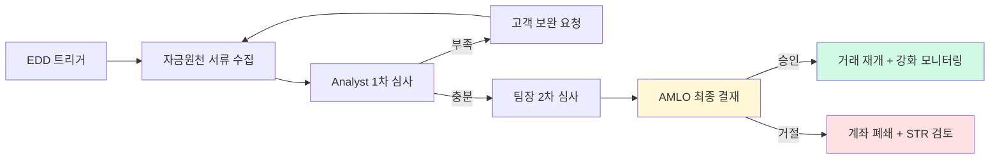

# CDD / EDD — 고객실사 운영 실무

> 표준 실사(CDD)와 강화 실사(EDD)를 **어떻게** 수행하는가. 이 글을 읽고 나면 "CDD는 4단계, EDD는 그 위에 얹는 강화층"이라는 동심원 구조가 머릿속에 남고, 가상자산이 왜 **100% 비대면 때문에 항상 위험 가중**이 되는지 이해하게 됩니다. 마지막 업데이트: 2026-04-17.

## TL;DR
- **CDD**: 모든 고객에게 적용하는 표준 실사 4단계 (식별 → 실소유자 → 목적 → 모니터링)
- **EDD**: 고위험 고객에게만 적용하는 강화 실사 (자금원천 증빙 + 경영진 승인 + 강화 모니터링)
- EDD 트리거: **PEP · 고위험국 · 비대면+위험요소 · 거액거래 · 복잡한 소유구조**
- 가상자산은 **100% 비대면**이라 항상 위험가중 + 거래 패턴 vs 신고 의도 비교가 핵심
- 한국: 위험기반접근법(RBA) 처리기준 가이드라인이 운영 바이블

---

## 1. CDD (Customer Due Diligence) — 표준 4단계




### 왜 4단계 구조인가

CDD는 "한 번 신분증 찍고 끝"이 아니라 **고객과의 관계 전체에 걸친 지속 공정**입니다. 4단계로 나눈 것은 FATF R.10이 요구한 4가지 요소를 각자 독립 작업으로 관리하기 위해서. 이 중 어느 하나만 빠져도 규제 위반으로 간주됩니다.

### Step 1. 신원확인 (Identification & Verification)

용어:
- **Identification**: 고객이 제공한 신원 정보 수집.
- **Verification**: 그 정보가 진짜인지 독립 소스로 검증.

이 둘이 다른 단계라는 걸 명확히 구분해야 합니다. "이름을 적어달라"는 Identification이고, "그 이름이 신분증과 일치하고 신분증이 위조 아님"을 확인하는 게 Verification.

| 항목 | 개인 | 법인 |
|---|---|---|
| 필수 | 이름·생년월일·주소·연락처 | 법인명·사업자번호·주소·대표자·사업목적 |
| 검증 방법 | 신분증 OCR + 셀카 + Liveness + 본인확인기관 | 등기부등본·사업자등록증·정관 |
| 보완 | 휴대폰·이메일 인증 | 주주명부·임원 명단 |

### Step 2. 실소유자(Beneficial Owner) 확인 — 법인만

**25% 이상 지분 자연인** 또는 **실질 지배 자연인**을 식별. 다층 법인 구조라도 **끝까지 추적**합니다. 예를 들어:

- 고객 법인 A → 주주: 법인 B(50%)
- 법인 B → 주주: 법인 C(60%)
- 법인 C → 주주: 자연인 X(100%)
- → X가 A의 UBO (50% × 60% × 100% = 30%, 25% 이상)

**기준 국가별**:
- 한국: 25% (특금법 시행령)
- EU: 25% (논의 중 인하 가능성)

**식별 불가능 시**: 고위 경영진 자연인을 **임시 BO**로 지정 (감독당국이 권장하는 차선책).

### Step 3. 거래 목적·자금 원천 파악

세 층의 정보를 수집:

- **거래 목적** — 투자, 결제, 수탁, 사업 운영 등
- **예상 거래 파라미터** — 금액·빈도·상대국
- **자금 원천 (Source of Funds)** — 어디서 온 자금인가
- **자산 원천 (Source of Wealth)** — 전체 자산이 어떻게 형성됐는가 (EDD에서 강조)

Source of Funds vs Source of Wealth를 자주 혼동합니다. SoF는 **지금 들어오는 이 자금**의 출처(이번 달 월급), SoW는 **이 사람이 가진 전체 재산**의 형성 경로(평생 모아온 월급 + 부동산 매각 이익). EDD에서는 둘 다 증빙을 요구합니다.

### Step 4. 지속 모니터링 (Ongoing Monitoring)

- KYC 정보가 **최신인지** 주기적 점검
- **거래 패턴 vs Step 3의 신고 의도**가 일치하는가
- 위험요소 변경 시 (PEP 신규 지정, 고위험국 이주 등) 재실사
- 한국 가이드라인: **저위험 5년 / 중위험 3년 / 고위험 1년** 주기 재실사

### 실무 포인트

CDD 실패의 80% 이상은 **Step 4 지속 모니터링**에서 발생합니다. Onboarding은 공수가 많이 들어서 꼼꼼한데, 기존 고객은 "이미 승인된 사람"이라고 방치하다가 규제 검사에서 대량 지적 받는 게 전형적 패턴. 자동 재실사 큐와 관리자 대시보드가 운영의 안전장치입니다.

---

## 2. EDD (Enhanced Due Diligence) — 트리거와 추가 절차

### EDD의 본질

EDD는 CDD를 **대체**하지 않고 **덧붙이는** 작업입니다. 즉 고위험 고객에게도 CDD 4단계는 모두 수행하고, 그 위에 자금원천 증빙·경영진 승인·강화 모니터링을 추가. "EDD 했으니 CDD 생략" 같은 구조는 규제 위반.

### EDD 트리거 (자동 발동)

| 카테고리 | 사례 |
|---|---|
| **PEP** | 정치적 주요인물 본인·가족·측근 |
| **고위험국** | FATF Black/Grey, 한국 외교부 분류 |
| **비대면 + 추가 위험** | (가상자산은 항상 비대면, 추가 요소로 트리거) |
| **거액거래** | 신고 의도 대비 과도한 금액 |
| **복잡한 소유구조** | Shell company, 다층 holding |
| **현금집약 업종** | 카지노·귀금속·환전·부동산 |
| **고위험 상품** | Privacy coin, 익명 wallet, mixer 노출 |
| **부정적 보도** | Adverse media 매칭 |

### EDD 추가 절차

1. **자금·자산 원천 증빙** — 급여명세·사업자료·계좌내역·매매계약서 등 **문서 요구**
2. **고위 경영진 승인** — 임원급 결재 필수 (CCO·AMLO)
3. **강화 모니터링** — 거래 임계값 낮춤, 알람 우선순위 ↑
4. **재실사 주기 단축** — 보통 1년
5. **추가 정보 수집** — 직업·소득·사업 파트너·거래 상대국

### 실무 포인트

EDD를 "추가 신분증 한 장 더 받음" 정도로 이해하는 조직이 있는데, **규제가 요구하는 EDD의 핵심은 자금원천 증빙**입니다. "이 자금이 어디서 왔는가"를 문서로 증명받고, 그 증빙이 **합리적**인지 AMLO가 판단하는 과정. 증빙이 애매하면 보완 요청 → 받으면 승인, 못 받으면 계좌 폐쇄가 정상 흐름.

---

## 3. 한국 가이드라인 — RBA 처리기준

### 가이드라인의 위치

FIU의 「위험기반접근법(RBA) 처리기준」 가이드라인은 한국 VASP가 CDD·EDD를 **어떻게 위험등급으로 매핑할지**에 대한 사실상 바이블. 법·시행령·감독규정은 원칙만 말하지만 이 가이드라인이 **구체 점수표와 등급 기준**을 제시.

### 4가지 위험 차원

1. **고객 위험** — 직업, PEP 여부, 거주지
2. **상품·서비스 위험** — 가상자산 종류, 수탁 vs 매매
3. **거래 위험** — 금액·빈도·상대국
4. **국가·지역 위험** — FATF 분류, 외교부 분류

### 종합 등급

- **저위험 (LOW)** — SDD 가능 (제한적)
- **중위험 (MEDIUM)** — 표준 CDD
- **고위험 (HIGH)** — EDD 필수
- **수용불가 (UNACCEPTABLE)** — 거래 거절

### 실무 포인트

"수용불가" 등급이 있다는 걸 아는 게 중요합니다. 고위험이라고 무조건 EDD로 받을 수 있는 게 아니라, 너무 위험한 조합(예: 북한 국적 + Tornado 노출 + 자금원천 거부)은 아예 받지 않는 것이 정답. 회사 정책에 "수용불가 기준"을 명시해두면 영업 압력을 방어하는 근거가 됩니다.

---

## 4. 가상자산 특화 실사 항목

### A. Wallet Ownership Verification (지갑 소유 증명)

사용자가 출금받을 외부 지갑이 **본인 것인지** 증명해야 합니다. 방법:

- **Satoshi Test**: 소액 입금 후 같은 wallet에서 회신 — 개인키 소유 증명
- **Signed Message**: 해당 wallet의 private key로 메시지 서명 → 검증 (가장 표준)
- **셀카 + 지갑주소 인증샷** — 약한 증명이지만 보조

한국 거래소 **외부지갑 등록제**의 기술적 핵심.

### B. KYT 노출도 점검

- 입금 wallet이 mixer·SDN·도난자금에 노출되어 있는가
- 출금 받을 wallet이 same
- KYT 시스템이 자동 점검

### C. 거래 패턴 vs 신고 의도

"월 1천만원 투자" 신고했는데 **일 1억 거래** → EDD 트리거. 신고 직업("학생")과 거래 규모("수억") 불일치도 마찬가지. Step 3에서 받은 정보가 **검증 기준**으로 이후 작동한다는 점이 핵심.

### D. Source of Crypto (가상자산 원천)

**입금된 가상자산이 어디서 왔는가** 를 추적:
- 직접 채굴(Mining)?
- 다른 규제 거래소에서 입금?
- OTC 매수?
- 무허가 거래소?

무허가·고위험 출처면 EDD.

### 실무 포인트

Source of Crypto는 전통 금융 KYC에 없던 가상자산 고유 요소입니다. "해외 거래소에서 넘어온 자금"이면 그 해외 거래소가 규제받는 곳인지, KYT 커버 범위인지를 확인. Binance Global처럼 한국 고객 영업 제한 상태인 곳에서 넘어오는 자금은 **거래 배경 설명 + 증빙 요구**가 표준 대응.

---

## 5. CDD·EDD 실패 시 액션

### 이 표를 어떻게 읽어야 하나

CDD·EDD가 실패한 경우의 단계적 대응. "거래 거절" 하나만 있는 게 아니라 상황별로 여러 수준의 액션이 있습니다. **Tipping-off 금지** 행을 특히 주의 — 고객에게 STR 사실을 알리면 그 자체가 별도 형사처벌.

| 상황 | 액션 |
|---|---|
| 신원확인 실패 | 거래 거절, 계정 미개설 |
| EDD 정보 거부 | 거래 제한, 단계적 거절 |
| 고위험 등급 + 대응 불가 | 계좌 폐쇄 + STR 검토 |
| 계좌 폐쇄 결정 | 사유 문서화, 지급 정산 |
| **Tipping-off (고객 통지 금지)** | STR 사실은 **절대 알려주지 말 것** |

---

## 6. 운영 흐름 예시

```
[ 신규 가입 신청 ]
        ▼
[ KYC: 신분증 + 셀카 + Liveness ]
        ▼
[ 본인확인기관 (PASS 등) 검증 ]
        ▼
[ PEP / Sanctions / Adverse Media 스크리닝 ]
        ▼
[ Risk Score 계산 ]
   ├─ LOW/MED → CDD 완료, 거래 가능
   └─ HIGH → EDD 트리거
                  ▼
            [ 자금원천 증빙 요구 ]
                  ▼
            [ 경영진(CCO/AMLO) 승인 ]
                  ▼
            [ 거래 가능 + 강화 모니터링 라벨 ]

[ 이후 ]
거래 발생 → KYT + 패턴 분석
   ├─ 정상 → 통과
   └─ 알람 → Case Management → STR 검토
```

### 실무 포인트

이 흐름에서 가장 자주 병목이 생기는 지점은 **경영진 승인** 단계. 임원이 다른 업무로 바빠서 승인 회신이 지연되면 EDD 후보 고객의 계정이 **며칠째 보류** 상태로 남고, 이게 고객 민원으로 이어집니다. SLA(예: 48시간 내 승인/거절)를 명문화하고, 부재 시 Deputy가 승인하는 백업 구조가 필요.

---

## 7. 자주 쓰는 외부 데이터

| 데이터 | 벤더 |
|---|---|
| **PEP DB** | LSEG World-Check, Dow Jones Risk Center, ComplyAdvantage |
| **Sanctions** | OFAC SDN (직접), UN, EU, HM Treasury, 한국 외교부 |
| **Adverse Media** | ComplyAdvantage, RDC, LSEG |
| **국가 위험** | Basel AML Index, FATF 발표, Transparency International |
| **본인확인** | PASS, NICE, KCB, 카카오인증 |

---

## 8. 흔한 실수와 함정

- **CDD를 onboarding으로만 끝냄** — 지속 모니터링이 빠짐
- **PEP 정의 너무 좁음** — 가족·측근까지 포함해야 함
- **BO를 명목상 대표로 끝냄** — 실질 지배자까지 추적해야
- **EDD를 "추가 신분증"으로만 이해** — 핵심은 자금원천 증빙
- **Tipping-off 위반** — 고객에게 STR 사실 말함 (별도 처벌)
- **자료 보관 누락** — 검사 시 증빙 못하면 제재

### 실무 포인트

위 6개 실수는 감독 검사에서 **가장 자주 지적되는 항목**들입니다. 내부 정책 리뷰 시 이 6개가 조직에서 실제 작동하는지를 샘플 기반으로 테스트하는 "내부 모의 검사"가 효과적인 예방책입니다.

---

## 9. 체크리스트

```
□ 모든 고객 CDD 4단계 완료
□ 법인고객 BO (25% 자연인) 확인
□ 위험등급 산정 + 주기적 재평가
□ EDD 트리거 자동화 (PEP·제재·고위험국·거액)
□ 자금원천 증빙 받는 절차
□ 경영진 승인 워크플로 + SLA
□ 외부지갑 소유 증명 절차
□ Tipping-off 금지 임직원 교육
□ KYC 자료 15년 보관 (가상자산이용자보호법 §11)
□ Case Management 시스템
```

## 💼 실무 현장 (Industry Reality)

### EDD 트리거 실제 리스트 (한국 VASP 운영)

| 트리거 | 탐지 방법 | 월간 발생 (대형 거래소 추정) |
|---|---|---|
| PEP 매칭 | World-Check / Dow Jones fuzzy | 50~100건 (대부분 FP) |
| FATF Grey/Black 국적 | Onboarding country 필드 | 10~30건 |
| FATF Grey/Black 거주 | 휴대폰·IP geo + 주소 | 변동 큼 |
| 거액 거래 (1억원 이상) | 금액 임계 룰 | 500~2,000건 |
| Tornado Cash 3-hop 노출 | Chainalysis exposure | 50~200건 |
| Mixer 직접 노출 | Chainalysis tagging | 5~15건 |
| Cash-intensive 직업 | 직업 필드 + NLP | 온보딩 시 자동 |
| 신고소득 vs 거래규모 mismatch | 월간 배치 분석 | 100~300건 |
| 복잡한 소유구조 (법인) | UBO 3층 이상 | 월 5~20건 |
| Pig Butchering 피해자 패턴 | 출금 패턴 분석 | 월 10~50건 (증가 추세) |

### 자금원천(SoF) 증빙 서류 — 실제 요구 목록

| 고객 유형 | 요구 서류 |
|---|---|
| 직장인 | 최근 3~6개월 급여명세서 + 원천징수영수증 |
| 자영업 | 사업자등록증 + 부가세 신고서 + 통장거래내역 |
| 자산가(상속·증여) | 상속세·증여세 납부증명 + 상속재산 명세 |
| 부동산 매각 | 부동산 매매계약서 + 매각대금 입금 내역 |
| 스톡옵션 | 행사 계약서 + 세무신고서 |
| 해외 거주자 | 해당국 세무신고서 + 은행거래내역 (번역·공증) |
| 크립토 마이너 | 전기요금 내역 + 채굴 장비 증빙 + 블록체인 보상 내역 |

**증빙 심사 SLA**: 제출 → 분석가 1차 검토 1~3일 → AMLO 결재 1일 → 통보. 총 3~7일 통상.

### 경영진 승인 워크플로 — 한국 VASP



### CDD/EDD 운영 KPI (한국 VASP 실무)

- 월간 EDD 처리 건수
- EDD 결재 평균 소요일 (목표 5일 이하)
- EDD 승인률 (통상 70~85%)
- 재실사 완료율 (고위험 고객 목표 95%+)
- 자금원천 거부 → 계좌폐쇄 연결률

### 자주 나오는 오해

- **"EDD = 추가 신분증"** — 핵심은 **자금원천 증빙**. 증빙 없이 신분증만 보강하면 규제 위반.
- **"VIP 고객은 EDD 면제"** — 실제로는 **거액 거래 = EDD 필수**. VIP일수록 강도 높음.
- **"25% BO만 확인하면 됨"** — FATF 2024 가이던스는 **실질 지배** 포함. 지분 낮아도 이사회 장악 시 BO.
- **"Tipping-off는 STR만 해당"** — EDD 결과도 "의심 사유" 드러나는 부분은 고객에게 설명 주의.

### 한국 특수 현실

- **재실사 주기**: FIU 가이드라인 — **저 5년 / 중 3년 / 고 1년**. 자동 스케줄러 없으면 누락 확실.
- **PEP 국내 범위**: 한국 공직자 + 배우자 + 직계혈족 + 형제자매. "측근" 해석 여지 커서 보수적 운영.
- **외국인 고객 증빙**: 외국어 서류는 번역공증 요구. 러시아·중국 고객 대응 어려움.
- **법인고객 UBO**: 재벌 지주회사 구조는 3~5층 법인. Moody's·NICE·CRETOP 구독 필수.

---

## 더 읽을거리
- [`str-ctr.md`](str-ctr.md) — STR·CTR 보고
- [`sanctions-screening.md`](sanctions-screening.md) — 제재 스크리닝
- [`internal-controls.md`](internal-controls.md) — 내부통제
- [`../4-technology/kyc-kyt.md`](../4-technology/kyc-kyt.md) — KYC·KYT 기술
- [FIU — 자금세탁방지 업무규정](https://www.kofiu.go.kr/)
