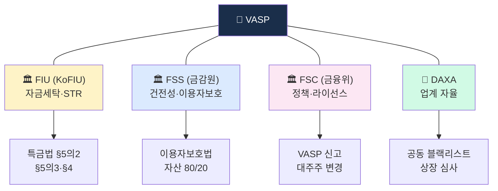
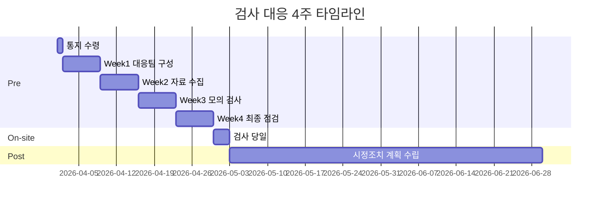
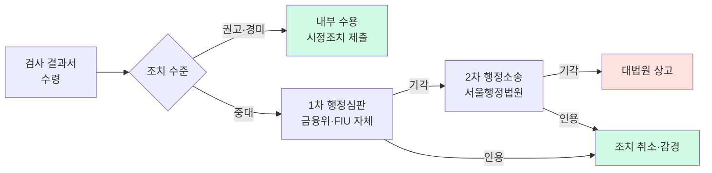

# 감독 검사 대응 워크북 — FIU·FSS·FSC 현장 검사 실전 가이드

> 한국 VASP가 연 1~2회 받는 FIU/FSS 현장 검사 대응. 검사 통지 → 자료 준비 → 검사 당일 → 사후 대응까지 **4주 타임라인 + 40개 체크리스트 + 문서 템플릿**. 마지막 업데이트: 2026-04-22.

## TL;DR

- **검사 주체**: FIU(자금세탁) · FSS(건전성·이용자보호) · FSC(정책)
- **주기**: 정기검사 연 1회 + 비정기(수시) 검사
- **준비 기간**: 통지 후 2~4주 (문서 제출 1주, 현장 대응 1~2일)
- **핵심 산출물**: 자체 진단 보고서 + 증빙 40~60건 + FAQ 대응 자료
- **반드시 피할 것**: 자료 누락·숫자 불일치·Tipping-off 위반·AMLO 부재

---

## 1. 검사 체계 개요

### 한국 감독 3기관의 분담

| 기관 | 감독 범위 | 연 1회 공통 검사 항목 |
|---|---|---|
| **FIU (KoFIU)** | 자금세탁·STR·CTR·Travel Rule | STR 품질, Tipping-off 통제, 내부통제 |
| **FSS (금융감독원)** | 건전성·이용자 자산 보호 | 자산 분리 80/20, 콜드월렛 증빙, 보험 |
| **FSC (금융위원회)** | 정책·라이선스 | VASP 신고 요건 유지, 대주주 변경 |
| **DAXA (자율)** | 업계 자율 | 공동 블랙리스트, 상장 심사, 공동 대응 |



### 검사 종류 3가지

1. **정기 종합검사** — 연 1회, 4~5일, 전영역
2. **부문검사** — 특정 분야(STR 품질·Travel Rule·이용자보호) 집중, 2~3일
3. **수시·긴급 검사** — 사건 발생 시 (해킹·대형 STR·민원 폭증), 무통보

### 법적 근거

- **특금법 §15** — 검사·감독 권한 (FIU)
- **특금법 §16** — 자료 제출 요구권
- **이용자보호법 §13~14** — FSS 검사권
- **금융위원회 설치법 §17** — FSC 감독권

### 검사 강도 비교 — 종합 vs 부문 vs 수시

| 항목 | 종합 | 부문 | 수시 |
|---|---|---|---|
| 통지 | D-30 | D-14 | 무통보 |
| 기간 | 4~5일 | 2~3일 | 1~2일 |
| 자료 요구 | 50+ | 20~30 | 10~ |
| 인터뷰 | 8~10명 | 3~5명 | 2~3명 |
| 과태료 가능성 | 중 | 중 | 고 |

---

## 2. 타임라인 — 4주 준비 → 현장 → 사후



### 통지 수령 (D-30 또는 D-15)

검사 통지서에 포함되는 정보:

- 검사 주체·일정·장소(회사 or FIU 출석)
- 검사 범위·중점 사항
- **제출 요구 자료 목록** (보통 30~50개 항목)
- 연락 담당자·검사단 구성

**즉시 조치 (D-day 통지일 24시간 이내):**

- [ ] CEO·이사회·감사위원회에 통지 공유
- [ ] AMLO가 대응 TF 소집 공문 발송
- [ ] 외부 법무/컴플 자문사에 선임 의사 타진
- [ ] 통지서 원본 스캔·디지털 보관 (체인 오브 커스터디)

### Week 1 (D-30 ~ D-22): 대응팀 구성

- [ ] **AMLO 주도 대응 TF 구성** — AMLO + 실무팀장 + 법무 + 운영 + IT
- [ ] **내부 킥오프 미팅** — 범위·일정·역할 분담
- [ ] **이사회 공지** — 검사 진행 사항 보고 체계
- [ ] **외부 법무/컴플 자문** — 필요 시 대형 검사 시 자문사 선임
- [ ] **과거 검사 지적사항 검토** — 전년도 시정조치 이행 상태
- [ ] **대응 룸(War Room) 확보** — 자료 집결·검사단 전용 회의실 지정
- [ ] **커뮤니케이션 정책 수립** — 외부·언론·고객 대응 원칙

### Week 2 (D-21 ~ D-14): 자료 수집

- [ ] 요구 자료 40~60개 **1차 수집**
- [ ] **자체 진단 체크리스트** 적용 (§3 참조)
- [ ] 미흡 사항 발견 시 **즉시 시정조치** (가능한 범위)
- [ ] 주요 숫자 **cross-check** (STR 건수·금액·계좌 수 등)
- [ ] 증빙 서류 스캔·분류·색인
- [ ] **데이터 추출 쿼리 검증** — SQL/리포트 산출 재현성 확인
- [ ] **증빙 부족 항목 리스크 평가** — 대체 서류 또는 서술 답변 준비

### Week 3 (D-14 ~ D-7): 모의 검사

- [ ] **자료 품질 QA** — AMLO 최종 승인
- [ ] **예상 질의 FAQ** 작성 (§4 참조)
- [ ] **임직원 인터뷰 준비** — AMLO·분석가·IT 담당 각 30분 Q&A 시뮬레이션
- [ ] **검사 환경 점검** — 회의실·시스템 시연 환경·프린터·인터넷
- [ ] **Mock Drill** — 외부 자문사 주재 모의 검사 (반나절)
- [ ] **약점 재확인** — Mock에서 드러난 갭 긴급 대응

### Week 4 (D-7 ~ D-0): 최종 점검

- [ ] **자료 최종 제출** (D-3 또는 D-1)
- [ ] **AMLO 최종 브리핑** — 전 임직원 대응 지침
- [ ] **검사단 영접 준비** — 주차·출입증·회의실
- [ ] **CS·영업팀 사전 공지** — 검사 기간 이슈 발생 시 에스컬레이션
- [ ] **보안 점검** — 검사단 네트워크 액세스 범위 설정
- [ ] **자료 접수 확인서** 양식 사전 준비

### 검사 당일 (D-day ~ D+2)

- [ ] **검사단 영접** — 대표·AMLO 인사
- [ ] **인터뷰 응대** — 사전 지침 준수
- [ ] **추가 자료 요구** — 즉시 대응 체계 가동
- [ ] **일일 디브리프** — 매일 17시 내부 요약
- [ ] **검사단 퇴실 직전 최종 확인** — 자료 수령 확인서
- [ ] **Clean Desk 유지** — 검사단 동선 내 무관 자료 비가시화

#### 일일 디브리프 템플릿

```
[날짜] 검사 Day-N 디브리프
─────────────────────────────
1. 오늘 다룬 주제: 
2. 추가 자료 요청 건수: __ (제출 __, 미제출 __)
3. 인터뷰 완료: __명 (예정 __명)
4. 검사단 톤: 보통 / 우호적 / 엄중
5. 내일 예상 주제: 
6. 야간 대응 필요 항목: 
작성자: ____  승인: AMLO ____
```

### 사후 대응 (D+3 ~ D+60)

- [ ] **검사 의견서 수령** (D+30~60 내)
- [ ] **시정조치 계획서 작성** (D+60 내 제출)
- [ ] **이행 보고 체계** — 분기별 또는 특정 기한
- [ ] **반복 지적 방지** — 내부 SOP 개정·교육
- [ ] **내부 Lessons-Learned 세션** — TF 해산 전 교훈 정리
- [ ] **이사회 최종 보고** — 전체 검사 결과 + 시정 계획

---

## 3. 40개 자체 진단 체크리스트 (검사 전 필수 점검)

### A. 신고·라이선스 (5개)

- [ ] FIU 신고증 원본·유효기간 확인
- [ ] ISMS 인증서 유효
- [ ] 실명계좌 파트너 은행 계약서 사본
- [ ] 최근 대주주 변경 신고 완료
- [ ] 정관·사업자등록증 최신

### B. AMLO·거버넌스 (6개)

- [ ] AMLO 임명 문서·이력서 (경력 3년+ 충족)
- [ ] AMLO 권한·보고 체계 문서 (이사회 직접 보고)
- [ ] 내부통제기준 최신 (AML 정책·SOP)
- [ ] 이사회 분기별 AML 보고 기록
- [ ] 독립감사(내부 or 외부) 연 1회 실시 증빙
- [ ] 임직원 AML 교육 연 1회+ 실시 기록

### C. KYC/CDD/EDD (7개)

- [ ] KYC 정책·SOP 문서
- [ ] 실명확인 방식 (본인확인기관 연동 증빙)
- [ ] 고객 위험 등급 분류 기준 (3~5단계)
- [ ] EDD 트리거 리스트·실행 기록
- [ ] 비대면 실명확인 프로세스 (영상통화·문서 검증)
- [ ] PEP 스크리닝 벤더·기록
- [ ] 고객 프로파일 업데이트 주기 (저위험 3년·고위험 1년)

### D. KYT·거래 모니터링 (8개)

- [ ] KYT 벤더 계약서 (Chainalysis·VerifyVASP·CODE 등)
- [ ] 거래 모니터링 룰 목록·활성화 상태
- [ ] Alert 처리 SOP·SLA (24h·48h)
- [ ] False Positive 관리 정책 + 분기별 튜닝 기록
- [ ] 룰 위원회 회의록 (월 1회 이상)
- [ ] 지갑 주소 블랙리스트 (DAXA 공유 + 자체)
- [ ] 상위 100 고객 모니터링 강화 증빙
- [ ] 이상 거래 실시간 에스컬레이션 체계

### E. STR·CTR·보고 (6개)

- [ ] STR 제출 기록 (연간 건수·처리 시간·AMLO 승인 기록)
- [ ] STR 템플릿 7섹션 준수 증빙
- [ ] Tipping-off 통제 문서·교육 기록
- [ ] CTR(1천만원+) 제출 기록
- [ ] STR 반송·재제출 이력·조치
- [ ] FIU-TIS 포털 접속 권한·로그 관리

### F. 제재 스크리닝 (4개)

- [ ] OFAC SDN 일일 업데이트·갱신 기록
- [ ] UN/EU/한국 제재 목록 일일 대조
- [ ] 지갑 주소 제재 스크리닝 (Chainalysis·TRM)
- [ ] 잠재적 매칭 disposition 기록

### G. Travel Rule (4개)

- [ ] Travel Rule 벤더 계약 (VerifyVASP / CODE / Notabene)
- [ ] IVMS101 메시지 품질 검증 로그
- [ ] Sunrise Issue 정책 문서 + 실제 처리 사례
- [ ] PIPA 준수 (주민번호 해시)

### 체크리스트 스코어링

각 항목 (완료 / 일부 / 미흡) 3단계 표시. **미흡 3개 이상이면 대응 TF 긴급 회의** → 검사 전 최우선 시정. 가능한 즉시 시정 불가한 항목은 **합리적 대체 증빙·경영진 승인 메모** 준비.

---

## 4. 예상 질의 FAQ + 모범 답변

### Q1. "STR 제출 건수가 동종 업계 대비 적은데 왜?"

**답변 프레임**:

- 우리 회사의 **고객 구성** (기관·B2B 비중 높으면 FP 낮음)
- **KYT·EDD 사전 방어**로 거래 진입 단계에서 차단
- **STR 품질** 우선 정책 (반송율 낮음)
- 구체 수치로: "연 N건 중 반송 0건, 평균 AMLO 승인 시간 3일, FIU 추가 요청 <5%"

**뒷받침 증빙**:

- 연간 STR 건수 추이 그래프
- 반송률·AMLO 처리 시간 통계
- EDD/거절률 리포트 (사전 방어 실적)

### Q2. "Tornado 상호작용 주소가 왜 여전히 차단?"

**답변 프레임**:

- "특금법 §5의2 자체 위험 평가에 기반한 독립 판단"
- "과거 이용 이력의 자금세탁 위험 여전 존재"
- "DAXA 공동 가이드라인 준수"
- 정책 문서 + AMLO 서명 + 이사회 승인 제출

**뒷받침 증빙**:

- Tornado 리스크 평가서 (내부 작성)
- DAXA 가이드라인 수신 기록
- 해제 요청·이의신청 처리 SOP

### Q3. "이용자 자산 80/20 분리는 어떻게 증빙?"

**답변**:

- 분기별 **감사보고서** (외부 감사인 인증)
- 콜드월렛 멀티시그 주소 공개 + 잔액 증빙
- 이용자별 내부 계정 내역 vs 온체인 잔액 **일치 증명** (PoR, Proof of Reserves)

**뒷받침 증빙**:

- 외부 감사 의견서 (BIG 4 또는 지정 감사인)
- 멀티시그 주소 리스트 + 잔액 스냅샷
- PoR Merkle Tree 보고서

### Q4. "AMLO는 충분한 권한을 가지고 있나?"

**답변**:

- 조직도 (대표이사 직속·이사회 직접 보고)
- 거래 중단 권한 있음 (SOP 증빙)
- 연봉 구간 (5대 임원 수준)
- 회의 참석 기록 (이사회·경영회의 상시)

**뒷받침 증빙**:

- 임명장·위임전결 규정
- 이사회 참석 기록
- D&O 보험 증권

### Q5. "룰 업데이트는 어떻게 관리?"

**답변**:

- 월 1회 **룰 위원회**: AMLO + 분석팀장 + KYT 엔지니어 + 법무
- Alert/FP 데이터 기반 정량 튜닝
- 주요 변경 시 이사회 보고
- 변경 로그 + 버전 관리 (Git 등)

**뒷받침 증빙**:

- 룰 위원회 회의록 12개월치
- 룰 변경 로그 (Git 커밋 또는 Jira)
- 튜닝 전후 FP 지표 비교

### Q6. "대형 STR 사례 구체 설명 가능한가?"

**답변 프레임**:

- 특정 건 번호·고객 ID **절대 구두 공개 금지** (Tipping-off 위험)
- 대신 **프로세스** 중심 답변: "알람 → EDD → AMLO 서명 → FIU 제출 경로 설명"
- 필요 시 **서면 별도 제출**로 전환

### Q7. "비대면 실명확인의 신뢰성은?"

**답변 프레임**:

- 본인확인기관(KCB·NICE 등) API 연동
- 영상통화 녹화·얼굴 매칭 (AI 벤더명 공개)
- 위조·사칭 적발 건수·비율

### Q8. "직원이 STR 이후 고객에 우호적 연락한 이력은?"

**답변 프레임**:

- Tipping-off 통제 SOP: STR 대상 고객 ID **자동 마스킹·CS 티켓 격리**
- 직원 AML 교육 기록 (Tipping-off 교육 모듈 별도)
- 과거 위반 이력 없음 (또는 시정 기록)

---

## 5. 필수 서류 40종 리스트

### 정책·SOP 문서 (10종)

- [ ] AML 정책서 (최상위)
- [ ] KYC/CDD SOP
- [ ] EDD SOP
- [ ] KYT 룰 운영 SOP
- [ ] STR 작성·제출 SOP
- [ ] 제재 스크리닝 SOP
- [ ] Travel Rule 운영 SOP
- [ ] Tipping-off 통제 SOP
- [ ] 이용자보호 정책서
- [ ] 이사회 AML 보고 SOP

### 증빙·기록 (20종)

- [ ] FIU 신고증 원본
- [ ] ISMS 인증서
- [ ] 실명계좌 계약서
- [ ] AMLO 임명장
- [ ] 이사회 회의록 (AML 관련)
- [ ] 독립감사 보고서
- [ ] 임직원 AML 교육 기록
- [ ] KYC 벤더 계약서
- [ ] KYT 벤더 계약서
- [ ] Travel Rule 벤더 계약서
- [ ] 외부 감사 보고서 (자산 분리)
- [ ] PoR (Proof of Reserves)
- [ ] 월간 Alert/FP 리포트
- [ ] 룰 위원회 회의록
- [ ] STR 제출 기록·증빙
- [ ] 제재 스크리닝 로그
- [ ] IVMS101 메시지 품질 로그
- [ ] 고객 위험 등급 분포 리포트
- [ ] 이상 거래 에스컬레이션 기록
- [ ] 전년도 검사 시정조치 이행 보고

### 사건 대응 기록 (10종)

- [ ] 해킹·사기 대응 이력
- [ ] 대형 STR 케이스 파일
- [ ] 제재 위반 의심 케이스
- [ ] 민원 처리 기록
- [ ] 업무 정지·차단 기록
- [ ] 외부 수사 협조 기록
- [ ] 언론 대응 기록
- [ ] 이용자 공지 기록
- [ ] 시스템 장애 대응 기록
- [ ] 해외 VASP 협조 기록

### 문서 색인 템플릿

각 서류에 **고유 ID**를 부여해 검사단이 요청 시 즉시 호출:

```
[ID] [카테고리] [문서명] [버전] [작성일] [담당자] [경로]
POL-001  정책   AML정책서      v3.2  2026-01-15  AMLO     /compliance/policy/aml-policy-v3.2.pdf
POL-002  정책   KYC-SOP        v2.1  2025-11-03  AMLO팀장 /compliance/sop/kyc-sop-v2.1.pdf
EVD-001  증빙   FIU신고증      원본  2021-09-24  법무      /legal/cert/fiu-2021.pdf
EVD-002  증빙   ISMS인증서     2025  2025-06-30  보안      /security/isms-2025.pdf
...
```

### 제출 형식

- PDF 원본 + 엑셀 요약본 병행
- 모든 파일명 **ID_문서명_날짜.pdf** 표준화
- 암호화(패스워드) + 별도 채널 전달

---

## 6. 현장 인터뷰 대응 가이드

### 인터뷰 일반 원칙

1. **3초 룰** — 질문 듣고 3초 숨 돌리고 답변 시작 (반사 대답 금지)
2. **모르는 건 모른다** — 추측·허위 답변은 위증 리스크
3. **자료 참조 요청** — "서류 ID EVD-XXX 참조" 답변 OK
4. **시간 요청** — "확인 후 1시간 내 답변드리겠습니다" 허용됨
5. **녹음 의사 확인** — 검사단 녹음 시 사전 고지 여부 확인

### AMLO 인터뷰 (30~60분)

**예상 질문 유형**:

- 조직·권한·보고 체계
- 주요 정책 의사결정 근거
- 최근 1년 중대 이슈 3건
- 자체 진단상 약점·개선 계획

**답변 원칙**:

- 숫자·일자·문서 경로 즉시 제시
- 모르는 것은 **"확인 후 답변"** — 추측 금지
- 경영진·이사회 지원 수준 강조

**대응 자료 지참 목록**:

- AMLO 핸드북 (본인 권한·의사결정 기록)
- 이사회 보고서 최근 4분기
- 주요 STR 케이스 번호 리스트 (내용 아님)

### 분석가 인터뷰 (30분)

**예상 질문**:

- 일일 Alert 처리 흐름
- FP 판정 기준·SOP
- STR 초안 작성 경험
- 최근 고난이도 케이스

**답변 원칙**:

- SOP 기반 답변
- Alert → FP/STR 흐름 단계별 설명
- 룰 튜닝 제안 사례

### IT/엔지니어 인터뷰 (30분)

**예상 질문**:

- KYT 시스템 아키텍처
- 벤더 API 연동·Latency
- 데이터 보관·암호화
- 변경 관리 프로세스

**답변 원칙**:

- 다이어그램 준비
- 실제 로그·모니터링 대시보드 시연

### 경영진(CEO·이사) 인터뷰 (15~30분)

**예상 질문**:

- AMLO 지원·자원 배분
- AML 전략 방향
- 중대 이슈 대응 참여도

**답변 원칙**:

- AMLO 독립성 강조
- 연간 AML 예산·인력 증가율 구체
- 이사회 AML 의제 분포

### 인터뷰 금지 행위 Top 5

1. 특정 고객 ID·케이스 번호 **구두 공개** (Tipping-off)
2. 기억나지 않는 수치 **허위 진술**
3. 다른 직원의 답변 **사전 논의/합의**
4. 자료 제출 지연 시 **책임 전가**
5. 검사단에 **선물·접대** 제공 시도

---

## 7. 사후 시정조치 운영

### 지적 등급 3단계

| 등급 | 내용 | 대응 기한 |
|---|---|---|
| **권고** | 개선 여지 | 6개월 |
| **지적** | 위반 소지 | 3개월 |
| **경고** | 중대 위반 | 1개월 + 과태료 |

### 시정조치 계획서 작성 원칙

- 구체적·측정 가능·마감일 명시
- 책임자 지정 (AMLO 총괄)
- 이사회 승인
- 진행 상황 월간 보고

### 시정조치 계획서 템플릿

```
────────────────────────────────────
시정조치 계획서
────────────────────────────────────
회사명: ○○○
검사 주체: FIU / FSS
검사 기간: 2026-__-__ ~ __-__
제출일: 2026-__-__

[지적사항 1]
- 원문: "____________________"
- 등급: 권고/지적/경고
- 근본 원인: ____________________
- 시정 조치:
  1) ____________________
  2) ____________________
  3) ____________________
- 책임자: AMLO ___ / 실무 ___
- 완료 기한: 2026-__-__
- 이행 지표(KPI): ____________________

[지적사항 2]
...

────────────────────────────────────
AMLO 서명 ____  CEO 승인 ____  이사회 의결일 ____
────────────────────────────────────
```

### 이행 보고 체계

- **월간 내부 보고** — AMLO → 이사회 리스크위
- **분기별 감독 보고** — 지정 기한 내 FIU/FSS 제출
- **완료 통지** — 각 건별 완료 시 공식 문서 제출

### 과태료·제재 대응

- **과태료 구간** — 특금법 §20 기준 1천만원~1억원+
- **의견 제출** — 부과 전 14일 의견 진술권 (§20 시행령)
- **행정심판·소송** — 부당 시 60일 내 심판 청구

---

## 8. 이의제기·재검사 프로세스 — 검사 결과에 불복할 때

검사 결과(지적사항·행정조치·과태료)에 **사실관계 오류·법 해석 이견·비례성 문제**가 있을 때 VASP는 공식 이의제기 경로를 활용할 수 있다. 실무에서는 **대형 조치(과태료 $100K+·영업정지·신고말소)** 시 거의 항상 이의제기 검토.

### 8.1 이의제기 경로 3단계



### 8.2 1차 — 행정심판 (Administrative Appeal)

**근거**: 행정기본법 §28·§29, 행정심판법

**제출 기한**: 처분 통지 후 **90일 이내** (한국 행정심판법 §27)

**제출처**: 
- 금융위 처분 → **금융위원회 행정심판위원회**
- FIU 처분 → **금융정보분석원장** (관할 상위 기관)

**필수 서류**:
- 행정심판 청구서 (지정 양식)
- 처분 통지서 사본
- 사실관계 반박 증거 (거래 로그·이메일·회의록·외부 감사보고서)
- 법률 의견서 (대형 케이스는 로펌 필수)
- 위임장 (대리인 신청 시)

**처리 기한**: 접수 후 **60일 (30일 연장 가능)**

**실무 Tip**:
- 행정심판 제기 자체가 **집행 정지 효과 없음** → 과태료는 일단 납부 후 환급 청구 구조
- 대형 로펌 (김·장, 세종, 광장, 율촌)은 **금융위 출신 변호사** 보유 — 승소율 ↑
- 1차 심판 승소율: 한국 금융 분야 **약 10~20%** (대부분 기각, 감경 일부)

### 8.3 2차 — 행정소송 (Court Review)

**근거**: 행정소송법 §19 (처분 취소소송)

**제출 기한**: 행정심판 재결서 수령 후 **90일 이내**, 또는 심판 없이 직접 제소도 가능 (처분 통지 후 90일)

**제출처**: **서울행정법원** (금융위·FIU 처분은 서울행정법원 관할)

**소송 유형**:
- **취소소송**: 처분 자체 취소 요구 (가장 흔함)
- **무효확인소송**: 처분 자체가 법적으로 무효라는 확인
- **부작위 위법확인소송**: FIU가 해야 할 처분을 안 했을 때

**처리 기한**: 통상 **1~2년** (대형 케이스 더 길어질 수 있음)

**승소율**: 한국 행정소송 **평균 약 15~25%** (2024 법원 통계)

**실무 Tip**:
- 금융 케이스는 **전문 재판부** (서울행정법원 2~3부) 배당 선호 → 변호사 선임 시 경험 중요
- **집행정지 가처분** 별도 신청 가능 — 소송 중 처분 효력 일시 중단
- 패소 시 **변호사 비용·인지대** 등 수천만 원~수억 원 부담

### 8.4 3차 — 대법원 상고

행정소송 패소 시 **상고심 (대법원)** 가능하나:
- **법률심** 성격 — 사실 다툼 불가, 법 해석·적용만
- 심리 불속행 기각률 **70%+** — 대부분 상고 기각
- 대형 가상자산 사건 중 대법원 판례 **아직 거의 없음** (산업 역사 짧음)

### 8.5 합의·조정 (Negotiated Settlement)

한국은 **공식 합의 제도 미흡**하나 실무에서:

- **시정 의사 강조** — 검사 중·후에 "스스로 개선 중" 입증 → 조치 수준 하향 협상
- **자발적 시정보고** — 정식 처분 전 자체 신고 + 개선 → 과태료 감경 사례
- **업계 공동 의견** — DAXA 등 자율기구 공동 의견서 제출 → 감독 당국 숙고

**미국 스타일 "Consent Decree" (합의 명령서)**: 한국은 공식 제도 부재, 미국 Binance $4.3B·OKX $504M 같은 케이스 유사 구조 없음.

### 8.6 실제 이의제기 사례 (2020~2026)

| 연도 | 케이스 | 경로 | 결과 |
|---|---|---|---|
| 2021 | VASP 신고 거부 1건 | 행정심판 | 기각 |
| 2022 | 과태료 1억 (KYC 미흡) | 행정소송 | 감경 (5천) |
| 2023 | 상장 코인 조사 불응 | 행정심판 | 일부 인용 |
| 2024 | 신고 말소 처분 | 행정소송 + 집행정지 | 집행정지 인용 (본안 계속) |
| 2025 | STR 누락 제재 | 자발적 시정보고 | 공식 처분 전 종결 |

**패턴**: 대부분 **절차적 하자**·**비례성 위반** 주장이 승소 포인트. 사실관계 자체 반박은 성공률 낮음.

### 8.7 이의제기 시 주의사항

- **관계 악화 리스크**: FIU·FSS와의 장기 관계 → 감정적 이의제기는 이후 검사 강화 가능성
- **평판 리스크**: 행정소송 공개 → 언론 보도 가능성 (한국 법원 판결문 공개 원칙)
- **비용 리스크**: 대형 로펌 fee $500K~$2M+ (사건 규모 비례)
- **타이밍 리스크**: 기한 놓치면 영구 확정 (90일 엄격)

### 8.8 실무 권장 경로

**대부분의 VASP 경우**:
1. **경미한 지적**: 수용 + 시정조치 성실 이행 (이의제기 X)
2. **중간 수준 조치 (과태료 5천만원 이하)**: 자발적 시정보고로 종결 시도
3. **대형 조치 (과태료 1억+ / 영업정지 / 신고말소)**: 행정심판 필수, 로펌 동원
4. **행정심판 기각 + 회사 존립 위협 수준**: 행정소송 + 집행정지 병행

이의제기가 **원칙적으로 승리 의도가 아니라 "조치 수준 감경 협상"** 수단이라는 이해가 실무 핵심.

### 8.9 내부 의사결정 체크리스트

이의제기 여부 결정 전:

- [ ] 처분 통지서 법적 근거 조항 정독
- [ ] 사실관계 반박 가능한 증거 존재 여부
- [ ] 조치 수준의 비례성 이슈 (유사 케이스 비교)
- [ ] 회사 재무 영향 분석 (조치 이행 vs 이의제기 비용)
- [ ] 관계 리스크 평가 (향후 검사·라이선스 영향)
- [ ] 언론 리스크 평가 (소송 공개 시 평판)
- [ ] 로펌 자문 (승소 가능성 객관 평가)
- [ ] 이사회 승인 (대형 케이스)
- [ ] 90일 이내 제출 가능한 준비 시간 확보

**결론이 "이의제기 진행"이면**: 전용 TF 구성 + 외부 법무 선임 + 주주 소통 체계 등 즉시 가동.

---

## 9. 흔한 실패 사례 Top 5

1. **자료 제출 지연** — 1일 늦어도 감점. 사전 여유 필수.
2. **숫자 불일치** — STR 건수 vs 시스템 로그 vs 보고서 간 차이
3. **Tipping-off 위반** — 검사 중 직원이 고객에게 무심코 언급
4. **AMLO 부재** — 검사 당일 AMLO 출장·병가 (대리인 권한 필요)
5. **과거 지적 미이행** — 전년도 시정조치 지연이 재검사에서 가중

### 실패 사례 확장 — 실제 관찰된 패턴

| # | 유형 | 구체 사례 | 방지책 |
|---|---|---|---|
| 1 | 자료 | 요구 목록 50개 중 48개만 제출 | 제출 체크리스트 2인 교차 확인 |
| 2 | 숫자 | STR 보고서 연 120건 vs DB 118건 | 숫자는 **단일 진실원(SQL)** 에서 자동 추출 |
| 3 | Tipping-off | CS 상담사가 "계좌가 잠긴 건 STR 때문" 구두 | CS 교육 + 스크립트 자동화 |
| 4 | AMLO 부재 | 검사 당일 AMLO 해외 학회 | **대리 AMLO** 임명장 사전 준비 |
| 5 | 반복 지적 | 2년 연속 "교육 기록 미흡" | 전년도 시정 이행 보고 D-7 최종 확인 |
| 6 | 시연 실패 | KYT 대시보드 시연 중 시스템 오류 | 사전 시연 리허설 + 백업 스크린샷 |
| 7 | 인터뷰 엇박 | 동일 질문에 AMLO·분석가 답변 상반 | **통일 답변 가이드** 배포 + 모의 검사 |

### 벤치마크 지표 (검사단이 참고하는 동종 비교)

- 연 STR 건수 / 월 거래량 비율
- EDD 대상 비율 (총 고객 대비)
- Alert → STR 전환율
- AMLO 처리 평균 시간
- FP 비율 (업계 평균 90%+)

이 숫자들이 **업계 평균 대비 현격히 낮으면** 지적 가능성 급증. 자체 벤치마크 리포트 분기별 작성 권장.

---

## 10. 조직 역할 분담 — RACI

| 업무 | AMLO | 실무팀장 | 법무 | IT | CEO |
|---|---|---|---|---|---|
| TF 구성 | R | A | C | C | I |
| 자료 수집 | A | R | C | R | I |
| 자체 진단 | R | A | C | C | I |
| 모의 검사 | R | A | C | C | I |
| 인터뷰 응대 | R | R | C | R | R |
| 시정조치 계획 | R | A | C | C | A |
| 이사회 보고 | R | C | C | I | A |

> R=Responsible / A=Accountable / C=Consulted / I=Informed

---

## 11. 검사 대응 War Room 구성

### 물리적 공간

- **전용 회의실** (잠금장치·보안카메라 OFF)
- 대형 모니터 2대 (검사단 자료 시연)
- 프린터·복사기·파쇄기
- 문서 색인 벽면 차트
- 긴급 연락망 보드

### 디지털 공간

- **대응 전용 공유 드라이브** (암호화)
- 접근 권한: TF 멤버만
- 버전 관리 (Git 또는 유사)
- 감사 로그 필수

### 커뮤니케이션

- **Slack/Teams 전용 채널** — #inspection-2026
- 일일 17시 스탠드업
- 긴급 시 AMLO 휴대전화 (24h)

---

## 12. 대응 TF 킥오프 아젠다 템플릿

```
─────────────────────────────────
검사 대응 TF 킥오프 — 아젠다
─────────────────────────────────
일시: 2026-__-__ 10:00~12:00
참석: AMLO, 실무팀장, 법무, IT, CFO

1. 검사 통지 내용 공유 (10분)
2. 일정·범위 확인 (10분)
3. 역할 분담 (RACI 확정) (20분)
4. 자료 요구 목록 review (30분)
5. 과거 시정조치 이행 상태 (15분)
6. 대외 커뮤니케이션 정책 (10분)
7. 다음 회의 일정 (5분)
─────────────────────────────────
```

---

## 13. 외부 전문가 활용 판단

### 자문사 선임 권장 조건

- 과태료 5천만원+ 예상
- 형사 고발 가능성
- 전년도 **경고** 등급 지적
- 대주주·임원 변경 이슈 동반
- 해외 VASP와 구조 연계

### 비용 기준 (2025 업계 참고)

| 서비스 | 기간 | 비용 범위 |
|---|---|---|
| 법무 자문 (김앤장·광장·세종 등) | 한 건 | 5천만~2억 |
| 컴플라이언스 컨설팅 (Big 4) | 1개월 | 1억~3억 |
| Mock Drill (외부 진행) | 2일 | 2~5천만 |
| 포렌식 감사 (해킹 연계) | 별도 | 시간당 50~150만 |

---

## 14. 국가별 유사 절차 비교 (참고)

| 국가 | 감독기관 | 주요 차이 |
|---|---|---|
| 🇰🇷 한국 | FIU·FSS·FSC | 실명계좌·이용자보호법 이중 |
| 🇺🇸 미국 | FinCEN·OCC·state | BSA/AML exam + MSB 라이선스 |
| 🇸🇬 싱가포르 | MAS | PS Act 기반, Comprehensive on-site |
| 🇯🇵 일본 | FSA·JAFIC | 자율규제협회(JVCEA) 공동 검사 |
| 🇪🇺 EU | AMLA(2025~)·국별 FIU | MiCA·AMLR 이중 검사 |

한국은 **실명계좌 요건**이라는 세계 유일 장치 때문에 **은행 파트너 검사 동조화**가 특이. 파트너 은행이 VASP를 사실상 재검사.

---

## 15. 검사 후 내부 운영 리셋 체크리스트

검사 종료 후 **30일 이내** 다음 사항 전사 반영:

- [ ] SOP 개정 (검사에서 드러난 갭 반영)
- [ ] 전 직원 재교육 (인터뷰 중 발견된 오해 해소)
- [ ] 룰 위원회 긴급 회의 (지적된 룰 긴급 튜닝)
- [ ] 이사회 결의 (시정조치 계획 공식 승인)
- [ ] 벤더 재평가 (KYT/Travel Rule 성능 의문 시)
- [ ] 내부 감사 일정 조정 (다음 분기 중점 영역 재설정)
- [ ] 자체 "Lessons Learned" 문서 (차기 검사 대비 내부 전수)

---

## 16. 위기 시나리오 대응 — 검사 중 돌발 이슈

### 시나리오 A: 검사 중 해킹·사고 발생

1. 즉시 검사단에 **상황 공식 고지** (감추지 말 것)
2. 동시에 IR·보안 대응 절차 가동
3. 필요 시 검사 **임시 중단 요청**
4. 법무·대외협력 투입

### 시나리오 B: 자료 중 민감 정보 노출

- 개인정보보호법 충돌 시 **마스킹 후 제출**
- 검사단 요구 범위 서면 확인
- PIPA(개인정보보호위원회) 사전 협의

### 시나리오 C: 직원 실수 Tipping-off 의심

- **즉시 AMLO에 보고**
- 해당 직원 대기·교육 조치
- 자체 징계 절차 가동 (검사단에 **선제 공개** 원칙)

### 시나리오 D: 검사단 요구 불합리·과도

- 법무 검토 후 **공식 이의 제기**
- 감독기관 내 상급자 에스컬레이션 옵션
- 기록·문서화 철저

---

## 17. 최종 체크 — 검사 D-1 마지막 점검

검사 하루 전 AMLO가 체크하는 **최종 12문항**:

- [ ] 요구 자료 100% 제출 완료?
- [ ] 대응 TF 전원 D-day 출근 확정?
- [ ] 대리 AMLO 임명장 준비?
- [ ] 회의실·시스템 시연 환경 OK?
- [ ] 자료 색인·ID 체계 문서화?
- [ ] 인터뷰 대상자 최종 브리핑 완료?
- [ ] Tipping-off 교육 직전 재공지?
- [ ] 외부 자문사 D-day 대기 확인?
- [ ] CEO·이사 일정 확보?
- [ ] 언론·SNS 대응 담당 지정?
- [ ] 전년도 시정조치 이행 증빙 테이블 정리?
- [ ] War Room 키·출입증 배부 완료?

이 12개 중 **단 하나라도 No** 면 당일 아침 긴급 대응.

---

## 더 읽을거리

- [`str-ctr.md`](str-ctr.md) — STR 작성 실무 템플릿
- [`sanctions-screening.md`](sanctions-screening.md) — 제재 스크리닝 tuning
- [`internal-controls.md`](internal-controls.md) — 5 pillars + 3LoD
- [`cdd-edd.md`](cdd-edd.md) — CDD/EDD 절차
- [KoFIU 공식](https://www.kofiu.go.kr/)
- [FSS 공식](https://www.fss.or.kr/)
