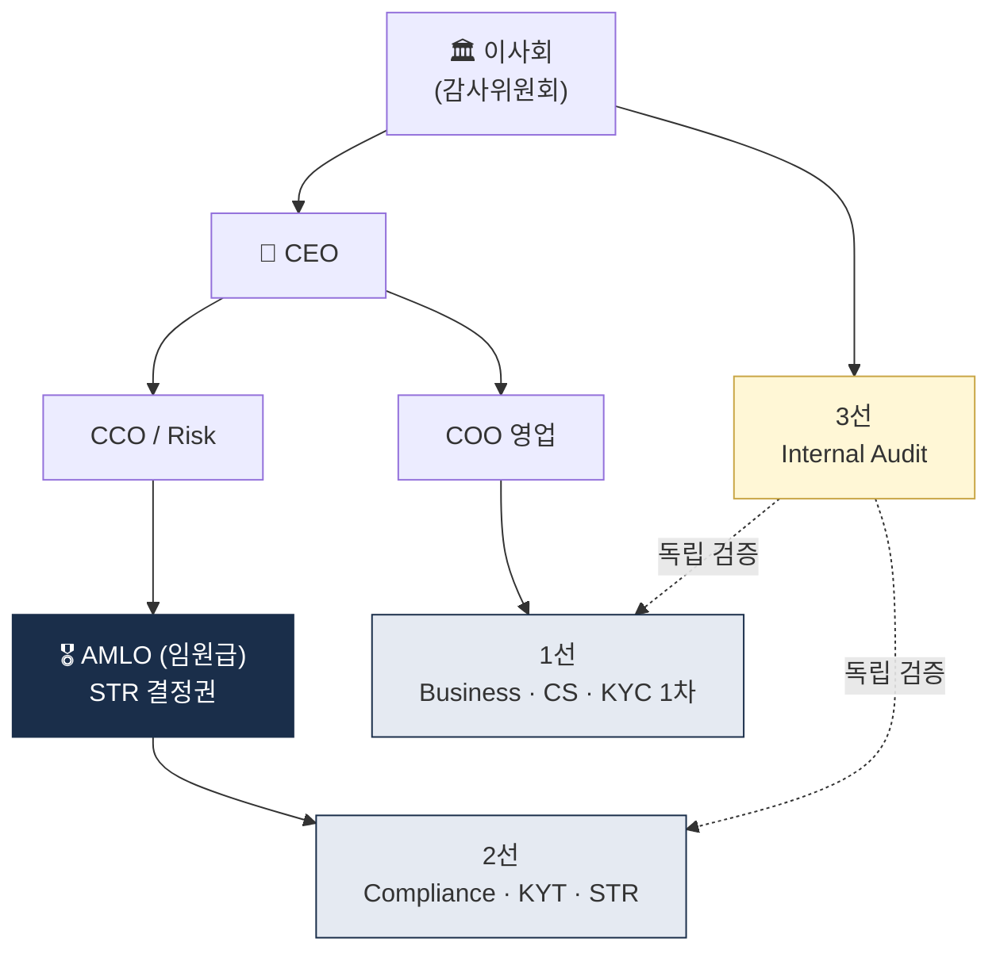
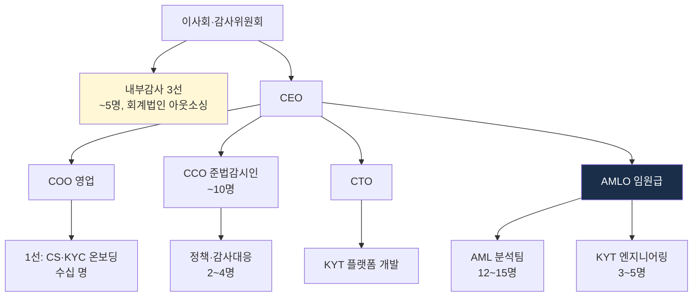

# Internal Controls — 내부통제 / AMLO / 거버넌스

> AML 프로그램의 **거버넌스 구조**. 사람·정책·감사. 이 글을 읽고 나면 "AML은 시스템보다 거버넌스가 본질"이라는 명제의 의미를 이해하고, AMLO가 단순 직책이 아니라 **회사 의사결정권자**가 되어야 하는 이유를 설명할 수 있게 됩니다. 마지막 업데이트: 2026-04-17.

## TL;DR
- AML 컴플라이언스는 **시스템보다 거버넌스가 본질** — 5 pillars (정책·AMLO·교육·감사·CDD)
- **3중 방어선**: 영업(1선) → 컴플라이언스(2선) → 내부감사(3선)
- 한국 특금법: **자금세탁방지 보고책임자(임원급)** 임명 의무
- AMLO는 **CEO에게 직접 보고** + **독립적 권한** 필요
- 임직원 정기 교육 + 정책 문서화 + 외부 감사가 검사 단골 항목

---

## 1. 5 Pillars of AML Program




### 왜 "5 Pillars"인가

미국 BSA가 명시화한 AML 프로그램의 5대 기둥. 한국·EU도 사실상 동일한 요소를 요구합니다. 이 5개를 모두 갖추지 않으면 "AML 프로그램이 있다"고 말할 수 없으며, 감독 검사에서도 이 5개 항목을 개별 평가합니다.

### Pillar 1. Internal Policies, Procedures, Controls

- AML 정책 문서 (Policy)
- 절차 매뉴얼 (Procedure)
- 시스템 통제 (System Controls)
- 위험기반접근(RBA) 처리기준

### Pillar 2. Designated AML Officer (AMLO)

- **임원급 책임자** 임명
- 한국: "자금세탁방지 보고책임자"
- 충분한 권한과 자원
- CEO 또는 이사회 직접 보고

### Pillar 3. Training

- 신입 + 정기 (연 1회 이상)
- 역할별 차별화 (영업·컴플라이언스·임원)
- 교육 이수 기록 보관

### Pillar 4. Independent Audit

- 내부감사 또는 외부감사
- 정기 (연 1회 권장)
- 독립성 + 결과 이사회 보고

### Pillar 5. CDD / Beneficial Ownership (2018 추가)

- CDD 4단계 + BO 식별
- 지속 모니터링

### 실무 포인트

5 Pillars는 체크리스트처럼 보이지만 감독 검사관은 "있다 없다"가 아니라 **"작동하는가"** 를 봅니다. 정책 문서가 있어도 직원들이 읽지 않았다면 Pillar 1 미작동, AMLO가 임명됐어도 영업에 종속돼 있다면 Pillar 2 미작동. 문서와 실제 운영의 **일치 증거**(알람 처리 로그, STR 결재 기록)가 감독 대응의 핵심.

---

## 2. 3중 방어선 (Three Lines of Defense)

### 구조

```
┌──────────────────────────────────────────────────┐
│ 3선: Internal Audit (내부감사)                    │
│      독립 검증, 이사회 직접 보고                   │
├──────────────────────────────────────────────────┤
│ 2선: Compliance · Risk Management                │
│      정책 수립, 모니터링, STR, 시스템 운영          │
│      AMLO가 여기 소속                            │
├──────────────────────────────────────────────────┤
│ 1선: Business · Frontline                        │
│      고객 응대, KYC 1차, 거래 승인                 │
│      매일 AML을 실행                              │
└──────────────────────────────────────────────────┘
```

### 1선의 역할 (Business · Frontline)

- 신규 가입 시 KYC 정확히 수행
- 거래 의도 청취 + 비정상 행동 1차 인지
- 알람 발생 시 추가 정보 수집
- "내가 보면 이건 이상한데?"를 2선으로 escalation

### 2선의 역할 (Compliance · Risk)

- AML 정책 수립·갱신
- 거래 모니터링 시스템 운영
- 알람 분석 + STR 결정
- 1선 교육·지원
- 규제 변화 추적

### 3선의 역할 (Internal Audit)

- 1선·2선이 제대로 작동하는가 **독립 검증**
- 발견사항을 **이사회·감사위원회**에 직접 보고
- 회사 전체 AML 효과성 평가

### 실무 포인트

신생 VASP에서 가장 먼저 무너지는 게 3선입니다. 인력이 부족해서 2선이 1선을 겸하고 "3선"이라고 주장하는 구조가 흔한데, 이건 본질적으로 **자기 감독** 이라 무의미합니다. 감독당국도 이를 즉시 지적. 현실적 해결은 **외부 회계법인(EY·삼일 등)에 3선 역할 연 1회 아웃소싱**하는 구조.

---

## 3. AMLO (자금세탁방지 보고책임자)

### 한국 특금법의 요구

- **임원급** (이사 또는 그에 준하는 직위)
- 충분한 경험과 지식
- AML 업무를 전담하거나 주된 업무
- FIU에 임명·변경 신고

### 핵심 권한

- 모든 거래 정보 접근 권한
- **STR 결정권** (혼자 또는 위원회)
- **CEO 직접 보고 채널**
- 외부 기관(FIU, 감독당국) 직접 소통

### 핵심 책임

- AML 프로그램 효과성 보장
- STR 적시 보고
- 임직원 교육
- 정책 갱신
- 검사·감사 대응

### AMLO의 함정

- **권한 부족**: 영업에 압도되어 STR 못 보냄
- **자원 부족**: 인력·시스템 부족
- **CEO 보호 부재**: 영업 실적 압력에 굴복
- **개인 책임**: 회사 위반 시 AMLO 개인 형사처벌 가능 (Binance 사례 참조)

### 실무 포인트

"AMLO를 임명했다"는 것만으로는 부족합니다. AMLO가 **실제로 결정 권한을 가지고 있는가**를 증빙해야 합니다. 증빙 방법: (1) 정관·권한 부여 규정에 AMLO 권한 명시, (2) STR 결재 로그에 AMLO의 사인만 있는 경우, (3) CEO와의 정기 1:1 미팅 회의록, (4) AMLO가 영업 부서장과 **동급 이상 직급**. 이 증빙이 약하면 명목상 AMLO로 간주됩니다.

---

## 4. AML 정책 문서 구조

표준적인 AML Manual 구조는 다음과 같이 12개 섹션으로 구성됩니다. 이 구조를 따르면 감독 검사관이 **어디에 무엇이 있는지** 빠르게 찾을 수 있고, 글로벌 파트너 실사에서도 표준 체크리스트와 1:1 매핑됩니다.

```
1. Introduction & Scope
   - 회사 소개, AML 적용 범위, 책임 분담

2. Risk Assessment
   - Enterprise-wide Risk Assessment (ERA)
   - 고객·상품·거래·지역 위험 분석

3. Customer Due Diligence (CDD·EDD)
   - 신원확인 절차
   - 위험등급 산정
   - EDD 트리거 + 절차
   - BO 식별

4. Transaction Monitoring (KYT)
   - 룰 카탈로그
   - 알람 처리 SOP
   - Threshold 설정

5. Sanctions Screening
   - 사용 리스트
   - 매칭 방식
   - Disposition 절차

6. STR · CTR
   - 보고 트리거
   - 작성 SOP
   - 보관

7. Travel Rule
   - 카운터파티 식별
   - 메시지 처리
   - Sunrise 폴백

8. Recordkeeping
   - 무엇을 · 얼마나 · 어디에

9. Training
   - 대상 · 주기 · 평가

10. Independent Audit
    - 주기 · 범위 · 결과 보고

11. AMLO Role & Reporting
    - 권한 · 보고 라인

12. Sanctions on Tipping-off
    - 금지 사항 · 처벌

부록: 양식, 체크리스트, 외부 데이터 소스
```

### 실무 포인트

정책 문서를 쓸 때 흔한 실수는 **"법 조문 복사"** 입니다. "이렇게 해야 한다"만 있고 "우리 회사에서는 이렇게 한다"가 없으면 실용성이 없습니다. 각 섹션에 **회사 고유의 책임자 이름·시스템 이름·예시 숫자**를 명시해야 문서가 실제로 운영에 쓰입니다.

---

## 5. Training (임직원 교육)

### 핵심 원칙

- **신입 입사 1개월 내** + **정기 (연 1회 이상)**
- **역할별 차별화** — 임원·영업·컴플라이언스·IT
- **실제 사례** 활용 (Binance, Bybit 등)
- **이수 기록** 보관 (검사 단골 항목)

### 커리큘럼 예시

1. AML·CFT 기초 (1시간)
2. 우리 회사가 받는 규제 (1시간)
3. KYC·CDD 실무 (1시간)
4. 의심거래 사례 (1시간)
5. Tipping-off 금지 (30분)
6. 제재 + OFAC (30분)
7. 평가 시험 (60% 이상)

### 실무 포인트

교육 효과성 평가가 중요. 단순히 영상을 틀어두고 "이수"로 처리하면 감독 검사 시 **교육 이수자들이 인터뷰에서 기본 질문**("Tipping-off이 뭐죠?")에 답 못하는 경우가 종종 있고, 이는 교육 부실로 지적됩니다. 최소한의 시험과 통과 기준을 두는 게 안전장치.

---

## 6. Enterprise-wide Risk Assessment (ERA)

### 정체성

- 회사 전체의 ML·TF 위험을 정기적으로 평가하는 문서
- 한국 RBA 가이드라인이 강조

### 평가 차원

| 차원 | 평가 항목 |
|---|---|
| 고객 | 개인·법인, 국적, 직업, PEP |
| 상품 | 가상자산 종류, 수탁 vs 매매 vs 이전 |
| 채널 | 비대면, OTC, B2B |
| 지역 | 한국·해외, 고위험국 비중 |
| 거래 | 평균 금액·빈도·상대국 |

### 산출물

- 위험 등급 매트릭스
- 통제 강도 매핑
- **잔여 위험 (Residual Risk)**
- 개선 계획

용어:
- **Residual Risk (잔여 위험)** — 통제를 적용한 후에도 남아 있는 위험. "인식하지만 수용"하는 영역.

### 주기

- **연 1회 이상** (한국 가이드라인)
- 사업 변경 시 (신상품 출시 등) 추가

### 실무 포인트

ERA는 감독 검사 시 **가장 먼저 요구되는 문서**입니다. "이 회사가 자기 위험을 스스로 얼마나 잘 이해하는가"를 보여주는 지표로 사용. ERA가 형식적이거나 오래됐으면 다른 어떤 문서도 **"근거 없는 것"** 으로 간주되기 쉬우므로, 연 1회 실제로 리프레시하는 게 중요합니다.

---

## 7. Internal · External Audit

### 내부감사

- 3선 방어선
- 1선·2선 효과성 검증
- 정책 vs 실제 운영 일치
- 결과를 이사회·감사위원회 보고

### 외부감사

- 법정 회계감사와 **별개**로 AML 특화 감사
- 규제당국이 권장
- 신뢰성 ↑, 검사 시 우호적

### 검사 (Examination) — 외부

- **FIU 또는 금감원** 검사
- 정기 검사 (3년 주기) + 수시 검사
- 자료 제출 + 인터뷰
- 위반 발견 시 시정명령·과태료·형사고발

### 실무 포인트

외부 감사는 선택사항이지만 **실질적으로 필수**입니다. "외부 감사에서 이 이슈가 지적됐고 우리는 이렇게 개선했다"는 스토리는 감독 검사 시 매우 강력한 방어 근거. 반대로 외부 감사 기록이 전혀 없으면 "이 회사가 자기 문제를 인지조차 못했다"는 인상을 주기 쉽습니다.

---

## 8. 거버넌스 구조 예시

```
이사회
  ├─ 감사위원회
  │     └─ 내부감사 (3선)
  ├─ 리스크 관리 위원회 (2선 정책 결정)
  │     └─ AML 위원회 (월 1회 이상)
  │            └─ AMLO 주재
  └─ CEO
        ├─ COO ─ 영업·거래소 운영 (1선)
        ├─ CCO ─ 컴플라이언스 (2선) ─ AMLO 직속
        ├─ CTO ─ KYT·시스템
        └─ CISO ─ 보안
```

### 실무 포인트

이 구조에서 **AML 위원회의 위치**가 중요합니다. 월 1회 이상 개최하며 1선·2선·IT·보안이 모두 참여, AMLO가 주재해 결정. 이 위원회 회의록이 감독 검사 시 핵심 증빙이 됩니다 — "회사가 AML 이슈를 정기적으로 토의하고 결정한다"는 증거.

---

## 9. RBA 거버넌스 요약

RBA 운영의 거버넌스 구조:

- **AMLO**: RBA 정책 전반 책임, 가중치·Factor 업데이트 승인
- **RBA 위원회** (분기 1회): AMLO + 분석팀장 + 영업 리더 + IT — 가중치 조정·Factor 추가 검토
- **이사회 연 1회 보고**: 등급 분포·재평가 이행률·이상 패턴
- **외부 감사 (연 1회)**: RBA 공식·기록 검증

**상세 점수법**: [`cdd-edd.md`](cdd-edd.md) §8 참조.

---

## 10. 책임 매트릭스 (RACI 예시)

| 활동 | AMLO | CCO | 1선 | IT | 임원 |
|---|---|---|---|---|---|
| KYC 수집 | I | A | R | C | I |
| 알람 분석 | A | C | C | I | I |
| STR 결정 | **R** | A | I | I | I |
| 정책 갱신 | A | R | C | C | I |
| 임직원 교육 | A | R | C | C | I |
| 시스템 도입 | C | A | C | R | I |
| 검사 대응 | R | A | C | C | I |
| 이사회 보고 | R | A | I | I | I |

용어:
- **R**esponsible — 실행 책임
- **A**ccountable — 최종 책임
- **C**onsulted — 자문
- **I**nformed — 통보만

### 실무 포인트

RACI는 AML 정책의 부록으로 포함하는 게 표준. "누가 어떤 결정을 내리는가"가 명확하지 않으면 위기 상황에서 의사결정이 지연되거나 책임 전가가 발생합니다. 신규 임직원 교육 시 이 RACI를 공유하면 1주일 안에 자기 역할 인식이 잡힙니다.

---

## 11. 검사·감사 흔한 지적사항

- ERA 미수행 또는 형식적
- AMLO 권한·자원 부족
- 정책 vs 실제 운영 괴리
- 알람 통계 미작성
- STR 보고 지연
- Training 이수 기록 누락
- 외부지갑 등록제 미운영
- KYC 자료 보관 누락
- Tipping-off 통제 약함
- BO 식별 미흡

### 실무 포인트

위 10개는 한국 FIU 검사에서 실제로 자주 나오는 지적사항입니다. 내부 자체 점검(self-assessment) 시 이 10개를 체크리스트로 삼아 정기 점검하는 조직이 실제 검사에서도 잘 대응합니다.

---

## 12. 체크리스트

```
□ AMLO 임명 + FIU 신고
□ AML 정책 문서 작성 + 연 1회 갱신
□ 3중 방어선 구축
□ ERA 연 1회 + 변동 시
□ 임직원 교육 연 1회 + 신입 + 이수기록
□ 내부감사 연 1회
□ 외부감사 검토
□ 거래 모니터링 시스템 + 룰 정기 튜닝
□ STR·CTR 통계 월간 추적
□ KoFIU 보고 시스템 + 인증서
□ 검사 대응 매뉴얼
□ 이사회 분기·연간 보고
□ AMLO CEO 직접 보고 채널
□ 위반 발견 시 자체 정정 + FIU 자진신고
```

## 💼 실무 현장 (Industry Reality)

### 실제 한국 VASP 조직도 (Upbit 기준, 2026-Q1 추정)



**주요 특징**: 대부분 거래소가 **CCO와 AMLO를 분리**. CCO는 준법감시인(금융위 신고), AMLO는 FIU 신고. 이중 구조로 영업 압력 방어.

### AMLO 실권 — 실제 증빙 방법

규제 검사에서 "이 AMLO가 실권 있는가"를 보는 증거:

1. **정관/규정에 AMLO 권한 명시**: "STR 제출은 AMLO 단독 결재" 조항
2. **STR 결재 로그**: AMLO 서명만 있고 CEO·영업 결재 없음 (독립성 증명)
3. **이사회 직접 보고**: AMLO가 분기 1회 이사회 직접 보고 (회의록 증빙)
4. **예산권**: AMLO가 AML 팀 예산·벤더 계약 결재권 보유
5. **거부권**: 영업 요청(예: VIP 고객 EDD 생략)을 거부할 수 있는 문서화된 권한

### AMLO 연봉·경력 (2026 한국 기준)

- **대형 거래소 AMLO** (이사·상무급): 1.5~3억원 + 스톡옵션
- 보통 배경: **금감원·FIU 출신** + **은행 AML 팀장 경험** 10년+
- 개인 D&O 보험: Binance CZ 사례 이후 연 수백만원 자비 가입 트렌드

### 글로벌 대형사 3LoD 실제 운영

**Coinbase (미국)**:
- 1선: 프론트라인 — CS·온보딩 등 ~1,500명
- 2선: **FCI(Financial Crimes Investigations) + Sanctions Ops + AML Advisory** — ~500명
- 3선: Internal Audit (독립 부서) + 외부 Deloitte 연 감사

**Binance (DOJ 모니터 하)**:
- 외부 모니터 5년 상주(2024~2029) — **사실상 4선 방어선** 추가
- 지역 hub별 독립 AMLO 배치

### 교육 커리큘럼 실제 예시

| 대상 | 시간 | 주제 | 주기 |
|---|---|---|---|
| 전 임직원 | 2시간 | AML 기초 + Tipping-off + 제재 | 연 1회 |
| 영업·CS (1선) | 4시간 | KYC·의심 신고 + 실제 사례 | 연 2회 |
| 컴플라이언스 (2선) | 8시간 | KYT·STR 작성·벤더 도구 | 반기 1회 |
| 임원 | 1시간 | 개인 책임·Binance 사례 | 연 1회 |
| 신입 | 8시간 | 전체 커리큘럼 | 입사 1개월 내 |

**이수 확인**: LMS 기반, 시험 통과 필수. 미이수자 영업 부서장 KPI 반영.

### ERA (Enterprise Risk Assessment) 실제 템플릿 구조

1. **회사 개요**: 상품·고객 세그먼트·지역
2. **위험 식별**: 5x5 매트릭스 (Likelihood x Impact)
3. **Inherent Risk**: 통제 전 위험 수준
4. **통제 효과성**: 현재 통제가 얼마나 잘 작동
5. **Residual Risk**: 통제 후 남는 위험
6. **개선 액션**: 우선순위·담당자·기한

분량: 한국 대형 거래소 **50~100페이지**. 연 1회 AMLO 주도, 외부 컨설팅(PwC·EY·삼일) 협업 많음.

### 자주 나오는 오해

- **"AMLO는 준법감시인과 같다"** — 다름. 준법감시인(금융위 신고)은 전체 준법, AMLO(FIU 신고)는 AML 특화.
- **"3선 내부감사는 내부인원으로 족함"** — 인원 부족 시 EY·삼일·Deloitte에 **외부 위탁 연 1회**가 실무 표준.
- **"교육은 영상 한 번 틀면 끝"** — 검사에서 임직원 인터뷰로 **실제 숙지 여부** 확인. 시험·평가 필수.
- **"ERA는 형식적 문서"** — 검사 시 가장 먼저 요구. 작동 증빙 없으면 전체 프로그램 신뢰도 하락.

### FIU/FSS 검사 실제 진행 (한국)

- **사전 자료 제출**: 약 1~2주 전 수백 항목 리스트 도착
- **현장 검사**: 보통 3~5일, 검사관 3~5명
- **인터뷰**: AMLO·CCO·분석가·IT·CEO 개별 인터뷰
- **샘플링 검증**: 랜덤 고객 100명 KYC/CDD 체크, STR 10건 품질 검증
- **결과 통보**: 2~3개월 후, 지적사항 + 개선 요구 + 과태료 여부

### 한국 특수 현실

- **AMLO 임원 등록**: FIU에 **개인 실명 신고**. 사임 시 14일 내 교체. 공백 기간은 위반.
- **대주주 재심사(2026-01)**: 주주 변동 시 AMLO 포함 전체 거버넌스 재심사.
- **DAXA 공동 AMLO 포럼**: 5사 AMLO가 월 1회 비공식 협의. FIU 정책 대응·공동 블랙리스트 운영.
- **국정원 협력**: 북한·러시아 관련 이슈는 경찰 경유 X, 국정원 직접 접촉. 별도 SOP 필수.

---

## 더 읽을거리
- [`cdd-edd.md`](cdd-edd.md) — CDD·EDD 절차
- [`str-ctr.md`](str-ctr.md) — STR·CTR 보고
- [`sanctions-screening.md`](sanctions-screening.md) — 제재 스크리닝
- [`../3-crypto-aml/vasp-obligations.md`](../3-crypto-aml/vasp-obligations.md) — VASP 9대 의무 (거버넌스 포함)
- [FIU — 자금세탁방지 업무규정](https://www.kofiu.go.kr/)
- [Wolfsberg Group — Principles for Crypto](https://www.wolfsberg-group.org/)
