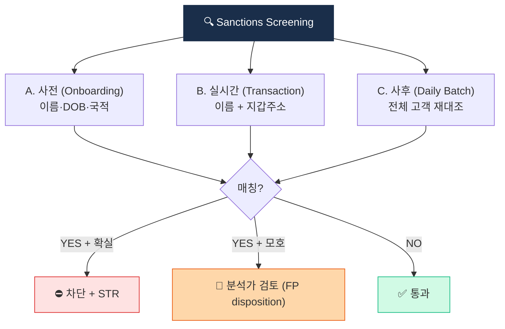

# Sanctions Screening — 제재 스크리닝

> 거래 **전·중·후** 모든 단계에서 제재 대상자 차단. 이 글을 읽고 나면 OFAC 2차 제재가 왜 한국 거래소에도 실질적 강제력을 가지는지, 그리고 Binance $4.3B 사례가 왜 제재 위반 처벌의 상징이 됐는지 이해하게 됩니다. 마지막 업데이트: 2026-04-17.

## TL;DR
- 핵심 리스트: **OFAC SDN (미국) · UN Consolidated · EU CFSP · HM Treasury (영국) · 한국 외교부**
- 가상자산 추가: **OFAC SDN의 가상자산 지갑주소** — 거래 전 실시간 차단 필수
- 매칭 방식: **이름(fuzzy) + 생년월일 + 국적 + 지갑주소(정확매칭)**
- 사전·실시간·사후 모니터링 3중 체크
- 위반 시 형사처벌 + 거대 벌금 (Binance $4.3B 사례)

---

## 1. 제재의 종류




### 왜 제재가 AML의 별도 축인가

제재(Sanctions)는 AML과 자주 묶이지만 **방향이 다릅니다**. AML은 범죄수익의 세탁을 막는 **사후** 통제라면, 제재는 특정 대상과의 거래 자체를 막는 **사전** 차단. 그래서 제재 스크리닝은 거래 발생 **이전**에 작동해야 의미가 있고, 이게 VASP가 **Pre-transaction screening** 인프라를 무겁게 구축해야 하는 이유입니다.

### 카테고리별

| 카테고리 | 예시 |
|---|---|
| **국가 제재** | 북한, 이란, 시리아, 쿠바, 베네수엘라, 미얀마 |
| **러시아 분리 제재** | 푸틴 측근, 올리가르히, 러시아 은행 (2022~) |
| **테러조직** | 알카에다, ISIS, Hamas, Hezbollah |
| **마약 카르텔** | 멕시코·콜롬비아 카르텔 |
| **사이버 범죄** | Lazarus, Evil Corp |
| **확산금융** | 핵·미사일 관련 |
| **부패** | Magnitsky Act 관련 (글로벌 인권 침해) |

### 제재 형태

- **자산 동결 (Asset Freeze)** — 미국 관할 내 자산 동결
- **거래 금지 (Transaction Ban)** — 미국인·기업 거래 금지
- **2차 제재 (Secondary Sanctions)** — 외국인이라도 미국 시장 접근 차단
- **무역 금지 (Trade Embargo)** — 특정 품목·서비스 금지

### 실무 포인트

위 4개 형태 중 **2차 제재**가 한국 VASP에게 가장 실질적 위협입니다. 한국 거래소가 OFAC 제재 대상과 거래하면, OFAC는 "한국 회사를 직접 제재"할 권한이 있고, 제재되면 미국 은행·결제망 접근이 끊어집니다. 가상자산 사업은 달러 페그 스테이블코인·미국 소재 KYT 벤더·미국 클라우드에 의존하므로, 2차 제재는 사실상 **사업 종료 수준**의 리스크.

---

## 2. 핵심 리스트

### 이 표를 어떻게 읽어야 하나

5개 리스트가 지역별로 독립적으로 발행되지만, 실무에서는 이 모두를 **통합 스크리닝 DB**로 관리합니다. 상용 벤더(World-Check 등)가 5개를 합쳐 일일 업데이트해주며, 회사는 이 통합본을 구독해 쓰는 구조.

| 리스트 | 발행 | 가상자산 포함? | 갱신 |
|---|---|---|---|
| **OFAC SDN List** | 미국 재무부 | ✅ (지갑주소 등재) | 수시 |
| **OFAC Consolidated** | 미국 재무부 (SDN 외 추가) | 일부 | 수시 |
| **UN Consolidated** | UN 안보리 | 명시 X (이름 위주) | 수시 |
| **EU Consolidated Financial Sanctions** | EU | 일부 | 수시 |
| **HM Treasury Sanctions List** | 영국 | 일부 | 수시 |
| **한국 외교부 제재대상자** | 한국 | (종속적, UN·OFAC 반영) | 수시 |

### OFAC이 중심인 이유

OFAC SDN은 **유일하게 가상자산 지갑주소를 명시**합니다. UN·EU·외교부는 전통적 신원 정보(이름·생년월일) 중심으로 지갑주소 등재는 제한적. 그래서 가상자산 산업의 제재 스크리닝은 **OFAC SDN을 축**으로 설계하고, 나머지는 이름 매칭으로 보완하는 구조.

---

## 3. OFAC의 가상자산 지갑주소 등재 역사

### 타임라인

| 연도 | 대상 | 비고 |
|---|---|---|
| 2018 | 이란 BTC 주소 (Marinov, Khorashadizadeh) | 첫 가상자산 SDN |
| 2020 | DPRK 라자루스 관련 ETH·BTC | |
| 2022-08 | **Tornado Cash 컨트랙트** | DeFi 첫 제재 |
| 2022-11 | Hydra Market (다크넷) | |
| 2024 | Garantex 추가 제재 (러시아) | |
| **2025-03-21** | **Tornado Cash 제재 해제** | 5th Cir. Van Loon 판결 후 |

### OFAC SDN 가상자산 검색

- 공식: https://sanctionssearch.ofac.treas.gov/
- 가상자산 영역도 같은 검색
- API: 일부 벤더가 라이센스 (Chainalysis, TRM)

### 실무 포인트

OFAC는 **SDN 업데이트를 예고 없이** 수행합니다. 새 주소가 오전에 발표되면 그 시점부터 거래 차단 의무가 생기는 구조. 그래서 회사 시스템은 **OFAC 변경 알림을 실시간 구독**하고 **자동 반영**해야 하며, 수작업 업데이트 주기를 길게 두면 그 사이 새 SDN 주소와 거래가 발생할 위험이 있습니다.

---

## 4. 스크리닝 매칭 방식

### A. 이름 매칭 (Fuzzy Matching)

동음이의·음역 다양성을 처리해야 하는 복잡한 문제입니다. "Mohammed"와 "Mohammad"는 같은 사람일 수도, 다른 사람일 수도 있습니다.

용어:
- **Fuzzy Matching** — 완전 일치가 아닌 유사도 기반 매칭.
- **Levenshtein Distance** — 한 문자열을 다른 문자열로 바꾸는 데 필요한 최소 편집 횟수.
- **Jaro-Winkler** — 문자열 유사도 알고리즘. 짧은 공통 접두사에 가중.
- **Soundex** — 음가 기반 매칭. 영어에 주로 사용.

**트레이드오프**:
- **너무 느슨**: False Positive 폭발 → 업무 마비
- **너무 빡빡**: False Negative → 진짜 제재 대상 통과

### B. 보조 식별자

이름 매칭의 False Positive를 줄이는 핵심:

- 생년월일
- 국적·거주지
- 신원확인번호 (passport 등)
- 회사명·직책

### C. 가상자산 지갑주소 매칭

- **정확 매칭 (Exact Match)** — 동일 주소
- **클러스터 매칭 (Extended)** — 같은 클러스터 내 주소
- **Hop 노출 (Indirect)** — N hop 내 도달 주소

### 실무 포인트

이름 매칭의 Fuzzy 수준은 벤더마다 기본 설정이 다릅니다. 최초 도입 시 **기본값 그대로 쓰면** 한국에서는 "Kim"·"Lee" 같은 흔한 성씨에서 False Positive가 폭발합니다. 한국 운영 환경에 맞춘 **튜닝**(생년월일·국적 필수 매칭)이 도입 첫 1~2달의 핵심 과제.

---

## 5. 스크리닝 시점 — 3단 체크

### A. 사전 (Onboarding) 스크리닝

- 신규 가입 시 KYC 정보로 매칭
- 매칭되면 가입 거절 또는 보류
- 가입 후 정보 변경 시 재스크리닝

### B. 실시간 (Transaction) 스크리닝

거래 발생 직전:
- 송신·수신 wallet의 OFAC SDN 매칭
- 카운터파티 VASP의 제재국 여부
- 거래 메타데이터 (memo, tag) 매칭

매칭되면 **거래 차단 + 자동 알람**.

### C. 사후 (Periodic) 스크리닝

- 모든 고객·wallet을 주기적으로 (일·주·월) 전체 스크리닝
- 새로 SDN 추가된 항목과 기존 데이터 매칭
- "잠재 노출" 발견 시 STR 검토

### 실무 포인트

3단 체크 중 가장 자주 소홀해지는 게 **C 사후 스크리닝**입니다. 회사가 관리하는 기존 고객 수만 명을 매일 전체 재스크리닝하는 건 컴퓨팅 부담이 크지만, OFAC이 새 주소를 추가한 순간 **기존 고객 중 그 주소를 쓰는 사람이 노출**될 수 있습니다. 일 1회 배치 스크리닝은 필수 운영 항목.

---

## 6. 운영 흐름

```
[ 신규 가입 ] → KYC + Sanctions Screening (이름·DOB·국적)
                  ├─ Hit → 가입 거절
                  └─ No Hit → 가입 승인

[ 거래 요청 ] → Sanctions Screening (이름 + wallet 주소)
                  ├─ Hit (high confidence) → 차단 + STR 보고
                  ├─ Hit (low confidence) → 수동 검토
                  └─ No Hit → 거래 진행

[ 일일 배치 ] → 전체 고객 + wallet vs SDN 갱신본
                  ├─ 신규 매칭 → 즉시 동결 + 분석 + STR
                  └─ 기존 통과 → 다음 사이클
```

---

## 7. False Positive 처리 (Disposition)

### 일반 시나리오

"Kim Min-soo"를 SDN에 매칭 → 다수 동명이인. 생년월일·국적이 다르면 → 명백한 False Positive → 통과. 모호하면 → 추가 자료 요청 → 분석가 판단.

### Disposition 코드 예시

| 코드 | 의미 |
|---|---|
| TP-Confirmed | 진짜 매칭 → 차단 + STR |
| FP-Different DOB | DOB 다름, 통과 |
| FP-Different Nationality | 국적 다름, 통과 |
| FP-Different Address | 주소 다름, 통과 |
| Pending | 추가 정보 필요 |

모든 disposition은 **로그 기록 + 검사 시 증빙**.

### 실무 포인트

Disposition 이력은 **규제 검사의 핵심 증빙**입니다. "왜 이 고객을 통과시켰나"에 대한 답이 없으면 검사에서 크게 지적받습니다. 시스템이 disposition 코드를 강제 입력받고 **영구 보관**하는 구조를 초기에 만들어두는 게 나중에 훨씬 편합니다.

---

## 8. 고난이도 케이스

### A. 동명이인 (Common Name)

"Kim", "Mohammed", "Wang" 같은 흔한 이름 — 보조 식별자가 핵심.

### B. 음역 (Transliteration)

한자·아랍어·러시아어 → 영문 음역 다양. "Kim" vs "Gim" vs "Kym".

### C. 회사명 변형

"ABC Corp" vs "ABC Corporation" vs "ABC Co., Ltd." — 약어·띄어쓰기·콤마 차이.

### D. Wallet 주소 — 클러스터 노출

**직접 매칭은 없지만 같은 클러스터에 SDN 주소가 있는** 경우. 위험 노출 인정 → 강화 모니터링.

### E. Privacy Coin 거래

추적 불가 → 사실상 모든 거래가 잠재 위험. 한국에선 거래소 상장 폐지로 우회.

### 실무 포인트

E번 Privacy Coin 대응은 "제재 스크리닝 자체를 포기"하는 게 아니라 **상품 자체를 취급하지 않음**으로 리스크를 제거하는 접근입니다. 이게 한국·일본 거래소가 privacy coin을 상장 폐지한 진짜 이유 — 기술적 어려움이 아니라 **규제 리스크의 경제성**.

---

## 9. 한국 특수 — 어디서 정보를 받나

| 출처 | 무엇 |
|---|---|
| 외교부 | UN·EU·OFAC 반영 + 한국 자체 |
| FIU | 가상자산 위험 wallet 정보 (협조 시) |
| KISA | 사이버 위협 정보 (랜섬웨어 wallet 등) |
| 글로벌 벤더 | World-Check, Dow Jones, ComplyAdvantage |
| KYT 벤더 | Chainalysis, TRM, Elliptic SDN wallet feed |

---

## 10. 위반 시 처벌

### 미국 OFAC (가장 강력)

- **민사벌금**: 거래당 최대 $300K+
- **형사**: 최대 30년 징역, $1M+ 벌금
- **2차 제재**: 외국인이라도 미국 시장 접근 차단

### 사례

- **Binance $4.3B (2023)** — OFAC + FinCEN 결합. 가상자산 AML 사상 최대 단일 벌금.
- **Bittrex $29M (2022)** — 이란·수단 고객 서비스.
- **BitGo $98K (2021)** — 소규모지만 OFAC 제재 위반의 첫 가상자산 사례.

### 한국

- 외환거래법, 특정범죄가중처벌법 등
- 외교부 제재 위반 시 형사처벌
- + 특금법 위반 결합

### 실무 포인트

Binance 사례가 업계에 남긴 교훈은 "2차 제재는 실존한다"는 것. 미국 이외 회사도 OFAC 제재 위반 시 단독으로 처벌받을 수 있다는 걸 거대 사례로 보여줬고, 그 이후 글로벌 VASP들의 제재 컴플라이언스 투자가 수직 상승했습니다. 한국 VASP도 2024~2025년 사이 OFAC 전담팀을 별도 운영하는 방향으로 조직이 재편되는 추세.

---

## 11. 체크리스트

```
□ OFAC + UN + EU + 외교부 명단 일일 갱신
□ 사전 스크리닝 (onboarding)
□ 실시간 스크리닝 (모든 거래)
□ 사후 배치 스크리닝 (전체 고객)
□ Wallet 주소 OFAC SDN 매칭
□ KYT 벤더 SDN feed 통합
□ False Positive disposition 로그
□ 매칭 시 차단 + STR + 보고 SOP
□ Adverse Media 모니터링
□ 외환거래법 호환성 점검
□ 임직원 교육 (OFAC 2차 제재 인식)
```

## 더 읽을거리
- [`cdd-edd.md`](cdd-edd.md) — Onboarding 스크리닝 통합
- [`str-ctr.md`](str-ctr.md) — 매칭 시 STR
- [`../2-regulations/us-bsa-fincen.md`](../2-regulations/us-bsa-fincen.md) — OFAC 제도 상세
- [`../6-cases/tornado-cash.md`](../6-cases/tornado-cash.md) — DeFi 제재 사례
- [OFAC 공식](https://ofac.treasury.gov/)
- [OFAC SDN List 검색](https://sanctionssearch.ofac.treas.gov/)
- [UN Consolidated List](https://www.un.org/securitycouncil/content/un-sc-consolidated-list)
