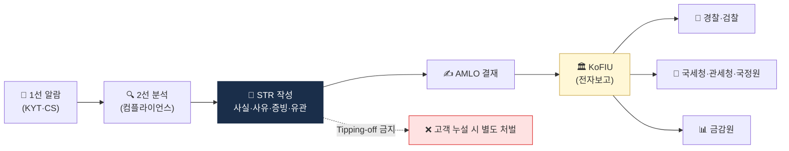
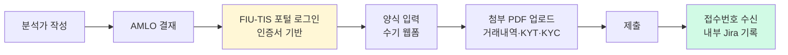

# STR / CTR — 의심거래·고액현금거래 보고

> FIU에 **무엇을 어떻게** 보고하는가. 이 글을 읽고 나면 "STR은 AML 시스템의 출구다"라는 말의 의미를 이해하고, 좋은 STR과 나쁜 STR의 차이를 기준으로 말할 수 있게 됩니다. 마지막 업데이트: 2026-04-17.

## TL;DR
- **STR (Suspicious Transaction Report)** — 의심되는 거래는 **금액 무관 지체 없이** 보고
- **CTR (Currency Transaction Report)** — **임계금액 초과 현금거래** 자동 보고 (한국 1천만원, 가상자산엔 적용 모호)
- **Tipping-off 금지** — 고객에게 STR 사실 알리면 별도 처벌
- 가상자산은 STR이 압도적으로 중요 (CTR보다)
- 보고 채널: **KoFIU 전자보고 시스템** (한국)

---

## 1. STR — AML 시스템의 출구




### 왜 STR이 그렇게 중요한가

STR은 AML 시스템이 만드는 **최종 산출물**입니다. KYC로 고객을 확인하고, KYT로 거래를 분석하고, 제재 스크리닝으로 차단을 하는 이 모든 과정이 결국 **"의심되는 거래를 FIU에게 알리기 위한"** 것입니다. STR이 없으면 수사기관은 범죄수익을 추적할 수 없고, AML 전체가 무용지물.

감독당국이 "STR 건수가 적은 회사"를 오히려 의심하는 이유가 여기 있습니다. 거래소 규모 대비 STR이 지나치게 적으면 "탐지가 실패하고 있거나, 분석가가 보고를 망설이고 있다"는 신호로 해석.

### 정의와 기본 속성

- "자금세탁 또는 공중협박자금조달의 **의심이 있는** 거래"를 FIU에 보고
- **금액 무관**: 1,000원짜리 거래여도 의심이 있으면 보고
- **지체 없이**: 감독규정 해석으로 보통 30일 내, 시급하면 즉시
- **의심의 합리적 근거**만 있으면 충분 — 실제 범죄 확정 필요 없음
- **보호 원칙**: 정당 절차로 보고하면 민사·형사 면책

### 누가 보고하나

한국 특금법 §4에 따라 VASP를 포함한 모든 의무자. 보고 책임자는 **자금세탁방지 보고책임자(AMLO·MLRO)**.

### 트리거 — 무엇을 의심으로 보나

| 카테고리 | 사례 |
|---|---|
| **신원·거래 불일치** | 신고 직업과 거래 금액 불일치, 가명 의심 |
| **거래 패턴 비정상** | 분할 입금(smurfing), 즉시 pass-through |
| **고위험 노출** | Mixer, OFAC SDN, 도난자금 노출 |
| **회피 행동** | 임계금액 바로 아래로 분할, KYC 회피 시도 |
| **정보 불일치** | 자료 거부, 자료 위조 의심 |
| **외부 정보** | 부정적 보도, 법집행 요청 |

### 보고 절차 (한국)

```
1. 1선 (영업·CS) 또는 시스템(KYT) → 알람 발생
2. 2선 (컴플라이언스) → 분석 + 자료 수집
3. AMLO → 보고 결정
4. KoFIU 전자보고 시스템으로 STR 전송
5. 사후: 추가 자료 요청 시 협조
```

### 보고 양식 핵심 항목

- 보고기관·보고책임자
- 거래자 신원
- 거래 일시·금액·방법
- 의심 사유 (**사실 + 분석**)
- 첨부자료 (KYC, 거래내역, 시스템 알람)

### Tipping-off 금지 (특금법 §9)

- **고객에게 STR 사실 알리면 별도 처벌** (1년 이하 징역 또는 1천만원 이하 벌금)
- 거래 거절·계좌폐쇄 사유로 "STR 보고했음"이라고 말하면 안 됨
- 대신 "내부 정책상" 같은 **일반적 사유**로 안내

### 실무 포인트

STR 결정은 "의심이 든다"는 1차 신호만으로 충분하므로, 분석가가 입증 책임에 부담을 느껴 **보고를 미루는 문화**가 AML 조직의 최악의 병입니다. 회사 정책에 "의심이 들면 문서화 후 STR, 아니라고 판단된 경우 사유 기록"을 기본값으로 명시해야 합니다. 이게 감독당국의 기대치이기도 합니다.

---

## 2. CTR — 한국에서의 위치

### 정의

**Currency Transaction Report** — 임계금액 초과 **현금거래** 자동 보고.

- 한국: **1천만원** (특금법 §4의2)
- 미국: $10,000

### 가상자산 적용이 모호한 이유

CTR은 본질적으로 **현금(currency)** 거래 보고 제도. 1970년대 미국 BSA에서 "현금 다발이 은행에 들어오는 순간을 잡자"는 설계로 출발. 그런데 가상자산은:

- 자체가 현금 아님
- 은행 실명계좌를 경유하므로 **입금·출금은 이미 계좌이체**
- 실제 현금 취급은 OTC desk의 극소수 사례 정도

그래서 법 문언상 VASP도 대상이지만 **실제 트리거는 거의 없음**.

### 예외: 현금 ↔ 가상자산 환전

- 현금 매매가 일어나는 OTC 시점에는 fiat 부분에 CTR 적용 가능
- 이건 VASP가 아니라 OTC desk의 문제로 포섭

### STR과의 관계

- **CTR**: 임계금액 만족하면 자동, **의심 여부 무관**
- **STR**: 의심 있으면 무조건, **금액 무관**
- **둘 다 트리거되면 둘 다 보고**

### 실무 포인트

"CTR 처리 프로세스"를 거래소에서 별도로 유지할 필요가 거의 없습니다. 영업 특성상 트리거될 가능성이 극히 낮고, 설령 발생해도 STR 프로세스로 포섭하는 게 보편적. 정책 문서에만 "CTR 대상 거래 발생 시 STR 프로세스 준용" 한 줄 있으면 규제상 충분합니다.

---

## 3. STR 품질 — 좋은 STR vs 나쁜 STR

### 좋은 STR의 4요소

- ✅ **명확한 fact pattern** — "이 시점에 이 금액이 이 패턴으로 발생"
- ✅ **분석 결론** — "왜 의심하는가"
- ✅ **첨부 증빙** — KYT 결과, KYC 자료, 시스템 로그
- ✅ **유관 거래 묶음** — 단건이 아니라 연관된 다수 거래

### 나쁜 STR의 징후

- ❌ "의심됨" 한 줄만
- ❌ 패턴 묘사 없이 금액만 나열
- ❌ 시스템 알람 **무비판 복사**
- ❌ 고위험 라벨만 보고 보고 (왜 의심인지 분석 없음)

### 실무 포인트

FIU 분석관이 한 회사의 STR을 수백 건 받으면, 품질이 낮은 STR은 실질적으로 **노이즈**가 됩니다. 노이즈가 많은 회사의 STR은 우선순위가 뒤로 밀리고, 정말 중요한 건이 묻히기 쉽습니다. 품질이 건수보다 중요하다는 인식을 회사에 심는 게 AMLO의 핵심 임무.

---

## 4. STR 운영 데이터 (한국)

- 한국 FIU 연간 STR 접수: **수백만 건** (전체 금융권)
- 가상자산 부문 STR: 매년 증가 추세
- VASP 도입 후 거래소발 STR이 급증
- 자료: FIU 「KoFIU 연차보고서」

---

## 5. STR이 가는 곳 — 사후 흐름

```
VASP → KoFIU 전자보고
        ▼
KoFIU 분석 (STR + CTR + 외부 정보)
        ▼
정보 가치 있다고 판단 시
        ▼
경찰청 · 검찰 · 국세청 · 관세청 · 국정원 · 금감원에 정보 제공
        ▼
수사 · 조사 · 자산 동결 · 형사 처벌
```

### 실무 포인트

회사가 제출한 STR이 **어디까지 갔는지**는 보통 알 수 없습니다. 수사기관이 영장이나 자료제출 요청으로 다시 접촉할 때 비로소 "그 STR이 수사로 이어졌구나"를 짐작. 이 불투명성은 AML 실무자의 동기 부여를 떨어뜨리기도 하지만, **STR이 목적이 아니라 과정**이라는 것을 조직에 교육하는 게 중요합니다.

---

## 6. 자주 쓰는 STR 패턴 (가상자산)

### A. Mixer 사용

- 입금 wallet이 Tornado Cash·Wasabi 등에서 N hop 내 노출
- 출금 wallet이 mixer로 즉시 이전

### B. OFAC SDN 노출

- 거래 상대 wallet이 OFAC SDN 명단

### C. 분할 입출금 (Smurfing)

- 단기간 내 다수의 작은 금액 입금 → 한 번에 출금
- KYC 의도 회피

### D. Pass-through

- 입금 → 즉시 전액 출금 (몇 분 내)
- 거래 의도 불일치 (왜 굳이 거래소를 경유?)

### E. 신원 불일치

- 한 사람이 다수 계정 운영 의심
- 가족·지인 명의 도용 의심

### F. 도난자금 노출

- 알려진 해킹 사건의 자금 흐름과 매칭
- 예: Bybit hack, Lazarus 관련

### G. 사기 의심

- Pig Butchering·Romance scam 패턴
- 피해자 자금이 가상자산으로 이전

### 실무 포인트

7개 패턴은 **KYT 룰과 1:1 매핑**이 가능합니다. 각 패턴을 탐지하는 룰이 룰 엔진에 있다면, STR 작성 시 **"어느 룰이 트리거됐는지"** 를 첫 문장에 명시하면 자동으로 좋은 STR의 **fact pattern + 분석 결론**이 갖춰집니다. 템플릿 설계 시 이 구조를 내재화하는 게 팁.

---

## 7. 외부 협력 — 법집행 협조

### 한국 절차

- **압수수색영장** — 법원 발부. 거래 기록·계정 정보·KYC 자료 제공
- **금융거래정보 제공 요청서** (특금법 §10)
- **국제 사법공조** — 다른 나라 VASP 자금 흐름 추적

### 회사가 갖춰야 할 것

- **LE Request 처리 SOP** — Law Enforcement 요청 대응 표준 절차
- **영장 검증 절차** — 정당한 영장인지 법무 검토
- 보안·암호화된 전송 채널
- 기록보관 (어떤 자료를 누구에게 줬는지)

### 실무 포인트

수사기관 요청은 "영장이 왔으면 무조건 협조"로 끝나지 않습니다. 영장의 **범위**(특정 기간·특정 계정)를 넘는 자료를 요청하는 경우 법무 검토가 필요하고, 고객 개인정보 보호와의 균형도 고려해야 합니다. 대형 거래소는 **법무팀 전담 LE Request 담당자**를 두고, 월 수십 건의 요청을 체계적으로 처리합니다.

---

## 8. 체크리스트

```
□ KoFIU 전자보고 시스템 등록 + 인증서
□ STR 트리거 룰 정의 + 자동 큐
□ AMLO 결재 워크플로
□ Tipping-off 금지 임직원 교육
□ STR 작성 템플릿 (사실+분석+증빙)
□ STR 보고 자료 보관 (15년)
□ 외부지갑 등록제 운영
□ 내부 분석가 trained on 패턴
□ LE Request SOP
□ 분기·연간 STR 통계 모니터링
```

## 💼 실무 현장 (Industry Reality)

### 좋은 STR vs 나쁜 STR — 실제 문단 비교

**나쁜 STR (감점)**:
> "고객 A가 2026-04-10 1억원 상당 비트코인을 외부지갑으로 출금하였음. KYT 시스템에서 HIGH 알람 발생. 의심됨. STR 보고."

**좋은 STR (품질)**:
> "고객 A(계정 #12345)는 2026-04-10 14:32 KST에 1.85 BTC(당시 1.02억원 상당)를 외부지갑 bc1q...xyz로 출금하였음. 수신 주소는 Chainalysis KYT에서 Tornado Cash로부터 2-hop 상류에 위치하며, Risk Score 82점. 고객은 2025-11 가입 후 월 평균 입금 200만원에 그쳤으나 본건 출금 3일 전 8회에 걸쳐 총 1.01억원을 다수 은행 실명계좌에서 분할 입금(최대 1,490만원, 최소 980만원)하여 **CTR 회피 의심 smurfing 패턴**과 일치. 신고 직업은 '대학원생'이며 월 신고 소득 150만원 대비 거래 규모 60배 이상의 mismatch. 첨부: ①거래 타임라인 ②KYT Reactor 스크린샷 ③외부지갑 등록 기록 ④입금 원천 계좌 분석."

**차이**: fact pattern + 숫자 + 구체적 typology 명시 + 첨부 증빙.

### KoFIU 피드백 루프 — 실제 경험

- KoFIU는 **회사별 STR 품질을 내부 점수화**하고 있다고 알려짐
- 수사로 이어진 STR은 비공식 피드백이 오기도 함 ("귀사 STR이 수사에 기여")
- 1년간 STR 0건 or 극소수면 검사 우선순위 상승
- 반대로 품질 낮은 STR 남발도 지적 대상

### FIU-TIS 제출 실무 — 한국



**실무 부담**: 한 건 제출에 **30~60분**. 월 10건이면 분석가 1명이 상당 시간 투입. 대형 거래소는 **매크로 보조 도구**로 반복 입력 자동화.

### STR 건수 벤치마크 (추정)

| 규모 | 월간 STR 제출 건수 |
|---|---|
| Upbit (KR 최대) | 200~500건 |
| Bithumb·Coinone·Korbit | 50~200건 각각 |
| 중소 VASP | 5~30건 |
| Coinbase (글로벌) | 월 수천 건 |
| Binance (글로벌) | 월 수천~1만 건 |

### 한국 FIU-TIS vs 미국 FinCEN 비교

| 항목 | 한국 FIU-TIS | 미국 FinCEN |
|---|---|---|
| 제출 방식 | **웹 수기 폼** | **API 자동화 가능** |
| 양식 | 단일 포맷 | SAR / CTR / 8300 다양 |
| 접수 확인 | 즉시 번호 발급 | 즉시 |
| 기한 | 30일 통상 해석 | 30일 명시 (60일 연장) |
| Tipping-off 금지 | §9 1년/1천만원 | §5318(g) |
| 벌금 | 1년 이하 | SAR 미보고 건당 $500K까지 |

### 자주 나오는 오해

- **"STR 많이 내면 잘하는 것"** — 품질 > 수량. 나쁜 STR 100건 < 좋은 STR 10건.
- **"시스템 알람 = STR 자동 제출"** — 1선 알람은 **분석가 검토 대상**. 모두 STR로 가면 FIU 부담만 늘림.
- **"Tipping-off 위반 = CS 담당자만 조심"** — AMLO·영업·마케팅 누구라도 위반 시 처벌. 전사 교육 필수.
- **"CTR은 가상자산과 무관"** — 대부분 맞지만 OTC desk의 현금 환전은 여전히 대상.

### 한국 특수 현실

- **FIU-TIS API 미지원**: 2026-04 현재 대형 거래소도 **수기 입력**. 업계가 API 지원을 수년간 요청 중.
- **STR 보존 15년**: 이용자보호법 §11 해석 적용. WORM + 암호화 저장 필수.
- **LE Request (경찰·검찰 요청)**: 대형 거래소 월 수십~수백 건. 전담 법무팀 필수. Upbit은 2024년 **"법집행 협조 리포트"** 자율 공개.
- **국가정보원 요청**: 북한 관련 자금 추적 시 국정원이 경찰 경유하지 않고 직접 요청 — 별도 SOP 필요.

### 주니어 Analyst STR 작성 — 실제 공수

- 단순 케이스 (mixer 직접 노출): 30분~1시간
- 복잡 케이스 (pig butchering + 다계정 의심): 4~8시간
- 조직적 의심 (CMLN 네트워크 등): 수일 (AMLO·법무 협업)

---

## 더 읽을거리
- [`cdd-edd.md`](cdd-edd.md) — CDD·EDD가 STR 트리거의 시작
- [`sanctions-screening.md`](sanctions-screening.md) — 제재 매칭 → STR
- [`../4-technology/kyc-kyt.md`](../4-technology/kyc-kyt.md) — KYT 알람이 STR로 연결
- [KoFIU 공식](https://www.kofiu.go.kr/)
- [FATF Recommendation 20 — STR](https://www.fatf-gafi.org/en/publications/Fatfrecommendations/Fatf-recommendations.html)
