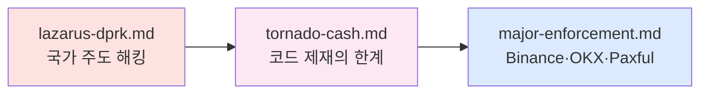

# 6️⃣ Cases — 실제 사건에서 배우기

> 이론은 배운 뒤, **실제로 무엇이 터졌는지**. 이 폴더는 업계 분기점이 된 3개 사건 계열을 서사로 정리합니다. 마지막 업데이트: 2026-04-20.

## 누가 먼저 읽어야 하나

- 🕵️ AML 담당자 — 남의 실패에서 자사 리스크 체크리스트를 뽑고 싶은 사람
- 📰 투자자·기자·학생 — 업계에서 "Binance $4.3B" "Bybit $1.46B" "Tornado 제재"를 맥락과 함께 이해
- ⚖️ 법무·정책 — 제재 위반·해제·코드 제재의 **법적 한계**를 보고 싶은 사람

## 읽는 순서

## 파일 인덱스

| # | 파일 | 대표 사건 | 왜 분기점인가 |
|---|---|---|---|
| 1 | [`lazarus-dprk.md`](lazarus-dprk.md) | Bybit $1.46B (2025-02) + DMM·Ronin·Axie | 거래소 **핫월렛 보안 표준**이 바뀐 분기점 |
| 2 | [`tornado-cash.md`](tornado-cash.md) | 2022 제재 → 2024 판결 → 2025 해제 → Storm 재판 | **코드를 제재할 수 있는가** — DeFi 규제의 법적 한계 확인 |
| 3 | [`major-enforcement.md`](major-enforcement.md) | Binance $4.3B + CZ 복역 + OKX $500M+ | **CEO 개인 형사 책임**이 AML 위반의 신규 표준 |

## 핵심 출구

- Lazarus 자금세탁 체인: 해킹 → Tornado·THORChain → OTC → 북한
- Tornado 타임라인의 4개 분기점 각각 이유 설명 가능
- Binance 합의금 $4.3B의 구성(벌금·범칙금·환수)
- "이 사건이 내 회사였다면 어디서 막았어야 했나" 관점의 내부 체크리스트

## 다음 단계

- 온체인 자금세탁 **기술적 원리** → [`../3-crypto-aml/onchain-typology.md`](../3-crypto-aml/onchain-typology.md)
- 제재 스크리닝 구현 → [`../5-compliance/sanctions-screening.md`](../5-compliance/sanctions-screening.md)
- 60일 커리큘럼 D50~D53에서 사건별 읽기
- 상위 인덱스 → [`../README.md`](../README.md)
