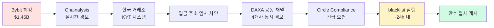

# Circle USDC 동결 — 스테이블코인 발행자의 AML 권한과 한계

> 가상자산 발행자가 **자금세탁·해킹·제재 대상 자산을 직접 동결**할 수 있는가? Circle의 USDC freeze 사례들은 스테이블코인 발행자의 AML 권한·한계·논란을 보여주는 분기점. 이 글을 읽고 나면 왜 "중앙화 스테이블코인"이 가상자산 AML의 핵심 player이자 동시에 논쟁 대상이 됐는지, 그리고 한국 VASP가 USDC를 취급하며 어떤 리스크를 인지해야 하는지 설명할 수 있게 됩니다. 마지막 업데이트: 2026-04-23.

## TL;DR

- USDC 발행자 **Circle은 smart contract 레벨에서 특정 주소 freeze 가능** (`blacklist()` 함수)
- 2020~2025 기간 **누적 ~$500M+ freeze** (총 **100+ 주소 사례**)
- 주요 트리거: **OFAC 제재 + 법원 영장 + 자체 위험 평가(KYT)**
- **논란**: 중앙화 발행자가 사용자 자산 임의 동결 가능 → 가상자산의 검열 저항성 훼손
- 한국 영향: USDC 거래는 가능하나 **freeze 리스크 상시 인지** + DAXA 공동 가이드상 단일 스테이블코인 의존 회피

---

## 1. Circle USDC freeze 메커니즘

### 기술 구조

USDC의 ERC-20 smart contract에는 **`blacklist(address)` 함수**가 포함돼 있습니다. Circle의 지정 운영자(`blacklister`)가 이 함수를 호출하면:

- 해당 주소는 **모든 USDC 송수신 차단**
- 보유 USDC = "동결" (zero out 아님, 단순 거래 불가 상태)
- 해당 주소가 다른 사람에게서 USDC를 받는 것도 불가
- 해제 시 다시 활용 가능 (Circle 운영자가 `unBlacklist()` 호출)

### 소스 코드 발췌

```solidity
function blacklist(address _account) external onlyBlacklister {
    _blacklisted[_account] = true;
    emit Blacklisted(_account);
}

function unBlacklist(address _account) external onlyBlacklister {
    _blacklisted[_account] = false;
    emit UnBlacklisted(_account);
}

modifier notBlacklisted(address _account) {
    require(!_blacklisted[_account], "Blacklistable: account is blacklisted");
    _;
}
```

주요 전송 함수(`transfer`, `transferFrom`, `mint`, `burn`)가 모두 `notBlacklisted` modifier로 감싸져 있어, blacklist 주소는 **모든 흐름에서 차단**됩니다.

### 권한 구조

- **Blacklister**: Circle이 지정한 특정 주소 — 일반적으로 Circle 내부 compliance 팀 운영 multisig
- **Master Minter**: USDC 발행·소각 권한 (별개)
- **Owner (Circle)**: 컨트랙트 업그레이드·Blacklister 지정 권한

이 구조는 **Circle이 운영을 잃어도(해킹 등) 악용을 최소화**하기 위한 분리. 그러나 **Circle 자체는 최종 통제권 보유**.

### 비교: 다른 스테이블코인 freeze 권한

| 스테이블코인 | 발행자 | Freeze 권한 | 2024 기준 사용 빈도 |
|---|---|---|---|
| **USDC** | Circle | ✓ Smart contract level | 연 50+ 주소 |
| **USDT** | Tether | ✓ Smart contract level | 연 200+ 주소 (업계 최다) |
| **BUSD** | Paxos | ✓ (과거) | 종료 — 2024-02 발행 중단 |
| **DAI** | MakerDAO | ✗ (직접 freeze 불가) | N/A — 그러나 USDC 담보 비중 때문에 간접 영향 |
| **FDUSD** | First Digital Labs | ✓ | 낮음 (~연 5~10) |
| **PYUSD** | Paxos (PayPal) | ✓ | 낮음 |
| **USDe** (Ethena) | Ethena Labs | ✓ (제한적) | 매우 낮음 |

### 실무 포인트

"스테이블코인은 가상자산"이라고 일반화되지만, **중앙화 스테이블코인(USDC·USDT·FDUSD)은 발행자 통제 하의 자산**입니다. 이는 탈중앙 가상자산(BTC·ETH) 과는 근본적으로 다른 특성이며, AML 관점에서는 **발행자 협조가 실질적 동결 수단**. 한국 VASP가 USDC·USDT를 취급할 때 이 특성을 고객에게 명확히 공지해야 합니다.

---

## 2. 주요 freeze 사례 5개

### 2.1 Tornado Cash 제재 대응 (2022-08)

- **2022-08-08**: OFAC가 Tornado Cash smart contract을 SDN에 등재
- **2022-08-09 (제재 다음 날)**: Circle이 **Tornado Cash 관련 주소의 USDC 보유분 즉시 freeze**
- 대상: 약 **75,000 USDC 상당**, 여러 주소 포함
- 의미: **스테이블코인 발행자의 검열 권한이 현실화된 첫 상징적 사례**

논란의 양면:
- **옹호 측**: OFAC 제재 준수 의무 → Circle은 미국 법인, 따라야 함
- **비판 측**: Tornado 풀에는 합법 사용자도 다수 존재 → 무차별 freeze로 합법 사용자 자산이 인질화됨
- **일부 사용자 소송 제기**: 합법 사용이 입증되면 해제 요청, 대부분 Circle 개별 심사 후 해제 (시간 소요)

### 2.2 Lazarus Group 자금 freeze (2023~2025)

Lazarus가 해킹 탈취 자산을 USDC로 변환해 세탁하는 시점에 Circle이 탐지·freeze한 다수 사례.

| 시점 | 사건 | Circle freeze 규모 |
|---|---|---|
| 2022-04 | Ronin Bridge 자금 일부가 USDC로 변환 | ~$1.7M (초기), 이후 확대 |
| 2023-06 | Atomic Wallet 해킹 자금 USDC 추적 | ~$0.5M |
| 2024-06 | DMM Bitcoin (일본) 해킹 자금 일부 | ~$2M |
| 2025-02 | **Bybit $1.46B 해킹** 자금 중 USDC 변환분 | ~**$5M+** (초기 48시간 내) |

탐지 경로:
1. FBI / Chainalysis / TRM이 Lazarus 주소 cluster 확인
2. Circle에 freeze 요청 (공식 레터 또는 긴급 채널)
3. Circle 내부 compliance 팀이 24~72시간 내 판단·실행
4. 한국 거래소도 DAXA·Chainalysis 채널을 통해 **freeze 정보 실시간 공유**

### 2.3 거래소 협조 freeze — Kraken·Coinbase·한국 4대 (2024~)

거래소가 의심 거래를 탐지하고 **Circle에 즉시 freeze 요청**하는 패턴이 2024년 이후 표준화:

- 피해자 신고 → 거래소 조사 → Lazarus·해킹 관련 확인
- 거래소 compliance 담당이 Circle compliance에 **긴급 이메일 + API 요청**
- Circle 내부 심사 (통상 **24시간 이내 처리**)
- freeze 후 법원 명령 받을 때까지 유지 → 이후 피해자 환수

한국 거래소(업비트·빗썸·코인원·코빗)도 2024년부터 이 워크플로를 활용, 국내 피싱 피해자 자금 중 USDC 부분을 다수 회수.

### 2.4 Phishing 피해 자산 freeze (2024~)

- 피해자 신고 → Circle 자체 위험 평가 (KYT + 거래소 제공 정보)
- Circle 자체 판단으로 freeze 가능 (법원 영장 불필요 — 논란 지점)
- **평균 처리 시간**: 24~72시간
- **피해자 환수율**: ~30~50% — 피싱 자금이 이미 추가 이동·환전된 후에는 회수 어려움
- 2024년 한 해 Circle은 phishing 관련 **~$X.XM (공개 수치 없음)** freeze한 것으로 업계 추정

### 2.5 OFAC 제재 대상 직접 freeze (지속)

- OFAC SDN 명단에 신규 주소 추가 시 Circle이 **자동 freeze**
- OFAC SDN API 일별 갱신 → Circle 내부 시스템 자동 동기화
- 2020~2025 누적 **OFAC SDN 기반 freeze**: **수천 개 주소**
- 주요 대상: 러시아 제재, 이란 관련, 테러자금조달 관련 주소

### Circle 공식 freeze 정책 요약

Circle의 공식 Compliance Statement (2023~)에 따르면 freeze 트리거는 3가지:

1. **OFAC/제재 요구사항**: 의무적 freeze
2. **법 집행 기관 요청**: FBI·DOJ·한국 수사기관 등의 공식 요청 (영장 포함 또는 제외)
3. **자체 위험 평가**: 명확한 자금세탁·범죄 증거 발견 시 Circle 재량으로 freeze

---

## 3. 법적·윤리적 논란

### A. 중앙화 발행자의 자산 통제력

스테이블코인의 가치 제안은 **"안정성 + 신뢰"** — 1:1 달러 페깅 보장 + 즉시 환전성. 그러나 freeze 권한은 이 신뢰의 한 축을 **Circle의 선의·정확성**에 의존하게 만듭니다.

- **"Circle이 잘못 freeze하면?"**: 항소 절차가 명확하지 않음. 개별 이메일·법무팀 접촉 → Circle 재량 판단
- **DeFi 통합 시 시스템 리스크**: USDC가 DAI 담보·Curve 유동성 풀·수많은 DeFi 프로토콜의 기반 자산 → Circle의 대규모 freeze가 **연쇄적 시스템 영향**
- **2023-03 SVB 사태 교훈**: Silicon Valley Bank 파산 시 USDC 일시 de-peg → Circle 신뢰성 이슈. freeze 권한은 그 신뢰의 연장선

### B. 검열 저항성(censorship resistance) 훼손

가상자산의 본래 가치 명제 중 하나는 **검열 저항성** — 정부·기관이 사용자 자산을 임의 차단하지 못함.

- 중앙화 스테이블코인의 freeze는 이 가치 **정면 위배**
- 비교 구도:
  - **Bitcoin·BTC**: 누구도 freeze 불가능 (탈중앙)
  - **USDC**: Circle 단독 freeze 가능 (중앙화)
  - 트레이드오프: **"탈중앙 순수성 vs 중앙화 효율성(제재 대응·피해자 환수)"**

업계 이념 분열:
- **Bitcoin maximalist·사이퍼펑크**: USDC 같은 중앙화 스테이블코인은 "가상자산의 배신"
- **실용주의자**: freeze 덕분에 범죄 자금 환수·제재 준수 가능 → 주류 수용 기반

### C. 법원 명령 없는 freeze — Due Process 부재

Circle이 **자체 판단으로 freeze**할 때 고려할 due process 이슈:

- 법원 영장·판결 없이 freeze 가능 → 피해자 주장만으로 타인 자산 동결 가능성
- **무고한 피해자 가능성**: 중간 거래로 의심 자금이 이동한 경우, 최종 수취자는 무관할 수 있음
- **요구**: 법원 영장 의무화 (일부 법학자 주장) vs Circle의 신속 대응 가치 (48시간 자금세탁 완료 현실)
- 현행 실무: **OFAC·법 집행 공식 요청**은 영장 없이도 가능, **자체 판단 freeze**는 Circle이 증거 수준 자체 평가

### D. DAO·거버넌스 스테이블코인과의 비교

- **DAI (MakerDAO)**: 토큰 자체 freeze 불가. 그러나 **USDC 담보 비중** 때문에 Circle freeze 시 DAI 시스템 연쇄 영향
- **크립토 원주의자 선호**: RAI·LUSD 등 USDC 담보 없는 스테이블코인
- **현실**: DAI조차 2020~2024 동안 **USDC 담보 비중 50%+** 유지 → 완전한 탈중앙 불가

---

## 4. 한국 VASP 영향

### Freeze 리스크 관리

- 한국 거래소가 USDC 보유 시 → Circle freeze 위험 **상시 인지**
- **DAXA 공동 가이드 (2024-11)**: USDT·USDC 비중 **분산** 권고, 단일 스테이블코인 의존 회피
- 거래소 hot wallet·cold wallet이 blacklist되면 **사용자 출금 중단** 위험 → 보유 스테이블코인 다변화
- **Travel Rule 메시지**: USDC 관련 의심 거래 시 수취 VASP에 freeze 가능성 사전 고지 관행

### 사용자 보호 — 한국 피해자가 freeze 당한 경우

| 단계 | 실무 조치 |
|---|---|
| 1. 피해자 인지 | 출금 실패·거래 불가 확인 시 거래소·Circle 공지 확인 |
| 2. Circle 직접 항소 | Circle Compliance 이메일 (영문) — 본인 자금 증빙, 합법 사용 설명 |
| 3. 거래소 협조 요청 | 한국 거래소의 compliance 팀이 Circle과의 기존 채널로 중재 요청 |
| 4. 법적 대응 | 한국 법원 청구 어려움 — Circle은 **미국 법인(보스턴)**, 재판관할 문제 |
| 5. 평균 처리 | 합법 입증 시 **2주~3개월** freeze 해제. 불법 관련이면 영구 freeze 가능 |

### 한국 4대 거래소의 USDC 정책 (2026-Q1)

| 거래소 | USDC 지원 | Freeze 대응 |
|---|---|---|
| **업비트** | 원화 + BTC 마켓 | Circle 공식 채널 직접 연결, 피해자 환수 협조 다수 사례 |
| **빗썸** | 원화 마켓 | 2024-06 Circle 파트너십 체결, freeze 정보 실시간 수신 |
| **코인원** | 원화 마켓 | DAXA 공동 대응 |
| **코빗** | 원화 마켓 | DAXA 공동 대응 |

### 실무 포인트

한국 사용자가 Circle freeze를 직접 상대하는 경우 **언어 장벽 + 법역 장벽**이 큰 어려움입니다. 이때 **거래소 compliance 팀의 중재**가 실질적 해결 수단. 개인이 직접 영문으로 대응하는 것보다 거래소를 통한 루트가 회수율·처리속도 모두 우위. 따라서 한국 거래소와 Circle 간 평소 협력 관계 유지는 **소비자 보호의 숨은 인프라**.

---

## 5. 한국 USDC 시장 현황

### 거래 규모

- 4대 거래소 모두 USDC 상장 (원화 또는 BTC 마켓)
- 거래량: BTC·ETH·USDT 다음 대형 페어 (통상 **4~6위**)
- 2024~2025 USDC 원화 거래량 증가 추세 — Tether FUD 영향으로 USDC 비중 상승

### 사용 패턴

- **현물 거래용**: 알트코인 매매 시 USDT 대안
- **DeFi 입출금용**: 해외 DeFi 프로토콜(Aave·Compound·Curve) 연계
- **기관·OTC**: 대규모 자금 이동 시 USDC 선호 (Tether freeze 빈도가 더 높아 체감 리스크 비교)

### DAXA 합의 — USDC 공통 정책

- **USDC 의심 거래 발견 시**: 한 거래소가 탐지하면 **30분 내 DAXA 채널로 공유** → 전체 4개사 동시 감시
- **Circle freeze 요청**: DAXA 공동 명의로 Circle에 요청 시 응답성 상향 (단일 거래소 요청 대비)
- **스테이블코인 위험 가중치**: 내부 위험 평가에서 USDT·USDC **대비 가중치 분산** 기준 문서화

---

## 6. 미래 전망

### GENIUS Act (미국, 2027-01-18 시행) 영향

- **Guiding and Establishing National Innovation for US Stablecoins Act**
- 핵심: 스테이블코인 발행자에 **연방 은행 수준 규제 적용** — BSA·AML 명확 편입
- **Circle 등 발행자의 freeze 권한 법제화**: 현재 자율 운영 → 법적 의무·권한 명문화
- 예상 효과:
  - freeze 기준·절차가 **더 명확화**
  - 피해자 항소 절차 표준화
  - 발행자 책임 명확 (잘못된 freeze 시 배상 의무 등)
  - 신규 발행자 진입 장벽 상승

### EU MiCA (2024-12 시행, 2026 완전 적용)

- **ART (Asset-Referenced Token)** 및 **EMT (E-Money Token)** 발행자 의무 규정
- freeze 권한 **명시적 규정** 포함 — 유럽에서 발행 또는 유통되는 스테이블코인
- **Circle Europe**: 프랑스 등지에서 MiCA license 확보 추진 중
- 한국 영향: 글로벌 발행자의 **다중 법역 compliance** → 한국 거래소에서도 유럽 기준 자동 반영

### 스테이블코인 발행자 = 가상자산 AML 핵심 player

- 2025~ 업계 인식: **거래소와 블록체인 분석 벤더만이 AML 주체가 아님** — 스테이블코인 발행자가 **실시간 자산 통제력** 보유한 3번째 축
- **Travel Rule 확장**: 발행자도 일부 의무 주체로 편입 논의 (FATF·FSB)
- **한국 정책 논의**: 국내 스테이블코인 발행자(KRW-stablecoin) 출현 시 동일 프레임워크 적용 검토 (금융위 2025 보고서)

---

## 7. 학습 포인트

```
- Circle의 USDC freeze 권한은 smart contract 레벨 — 기술·법적으로 작동
- 2020~2025 누적 ~$500M+ / 100+ 주소 freeze, OFAC·법 집행·자체 판단 3개 트리거
- 스테이블코인 발행자가 가상자산 AML의 3번째 축(거래소·KYT 벤더에 이어)
- 검열 저항성 훼손 논쟁은 미해결 — DAI·분산형 스테이블코인 대안은 제한적
- 한국 VASP는 freeze 리스크 상시 인지 + 다변화 전략 + Circle 협력 채널 필수
- GENIUS Act·MiCA가 freeze 권한을 법제화하는 방향으로 2027~2028 정비 예정
```

## 💼 실무 현장 (Industry Reality)

### Circle freeze 요청의 실제 워크플로 (한국 거래소 관점)

**Case: 2025-02 Bybit 해킹 자금 중 USDC가 한국 거래소로 유입 시도**



**실무 타임라인**:
- T+0: 한국 거래소 KYT가 Lazarus cluster 입금 시도 탐지
- T+15분: compliance 팀 내부 보고 + DAXA 공유
- T+1시간: Circle compliance 팀에 영문 메일·API 요청
- T+24시간: Circle 내부 심사·blacklist 실행
- T+48시간: 자금 freeze 완료, 법적 환수 절차 개시

### 한국 VASP의 스테이블코인 다변화 정책 (2026-Q1)

| 거래소 | 총 스테이블코인 보유 대비 USDC 비중 | USDT 비중 | 기타 (FDUSD 등) |
|---|---|---|---|
| 업비트 | ~35% | ~60% | ~5% |
| 빗썸 | ~40% | ~55% | ~5% |
| 코인원 | ~30% | ~65% | ~5% |
| 코빗 | ~35% | ~60% | ~5% |

※ 추정치. 2024-11 DAXA 공동 가이드 이후 **단일 스테이블코인 의존 상한 70%** 자율 목표.

### 자주 나오는 오해

- **"Circle freeze면 내 USDC가 사라진다"** — 아님. **동결**이지 **소각**이 아님. 해제 시 복원.
- **"법원 명령 없이 freeze 불가"** — 가능. Circle은 자체 판단으로 freeze 가능 (due process 논란 지점)
- **"USDC는 안전해서 freeze 안 당함"** — OFAC 제재·범죄 관련이면 즉시 freeze. 합법 사용자도 간접 연루 시 영향 가능.
- **"USDC보다 USDT가 freeze 자주"** — 맞음 (Tether 연 200+ vs Circle 연 50+). 다만 Circle은 더 투명하게 공개 경향.
- **"DAI는 안전한 대안"** — DAI도 USDC 담보 비중 50%+라 Circle freeze 간접 영향권. 완전 탈중앙 아님.

### 주니어 Analyst 일상 — 스테이블코인 freeze 관련

- **매일**: OFAC SDN 업데이트 확인, Circle·Tether 공지 블로그 체크
- **주간**: DAXA 채널에서 freeze 요청·완료 사례 리뷰, 자사 KYT 룰 업데이트
- **사고 발생 시**: Circle Compliance 직접 소통 (영문 이메일 + 공식 긴급 채널), 24시간 내 freeze 요청 완료 목표
- **분기 1회**: 스테이블코인 비중 리포트 작성, 경영진 대상 리스크 보고

### 한국 특수 현실

- **원화 마켓 거래량 큰 USDC**: 한국 투자자가 직접 보유 비중 높음 → freeze 발생 시 **소비자 민원 폭증 리스크**
- **언어·법역 장벽**: 한국 개인이 Circle을 직접 상대하기 어려움 → **거래소 compliance 팀 중재가 현실적 해결**
- **국내 발행 스테이블코인 논의**: 2025~ KRW-stablecoin 발행 논의 — 국내 발행이면 **금융위 감독 하 freeze 기준** 한국 법 적용 가능
- **피해자 환수 전담 조직**: 빗썸·업비트 등은 **해킹·피싱 환수 전담팀** 운영 — Circle·Tether 대응 전문가 상주
- **DAXA + 경찰청 사이버수사대**: 3자 공조로 피해 자금 추적·freeze·환수 진행. 한국 특유의 빠른 공조 체계

---

## 더 읽을거리

- [`tornado-cash.md`](tornado-cash.md) — 2022 Tornado 제재의 USDC 즉시 freeze 사례
- [`lazarus-dprk.md`](lazarus-dprk.md) — Lazarus 자금 USDC 변환 패턴·Bybit freeze 사례
- [`major-enforcement.md`](major-enforcement.md) — 거래소 enforcement와 스테이블코인 freeze 협업
- [`../3-crypto-aml/vasp-obligations.md`](../3-crypto-aml/vasp-obligations.md) — VASP 의무 중 스테이블코인 취급
- [`../5-compliance/sanctions-screening.md`](../5-compliance/sanctions-screening.md) — OFAC SDN 스크리닝 절차
- [`../7-vendors/analytics-vendors.md`](../7-vendors/analytics-vendors.md) — Chainalysis·TRM의 freeze 협조 워크플로
- [Circle Transparency · Compliance Statement](https://www.circle.com/en/transparency)
- [Circle USDC Blacklist Smart Contract (Etherscan)](https://etherscan.io/address/0xa0b86991c6218b36c1d19d4a2e9eb0ce3606eb48#code)
- [GENIUS Act 본문 (S.919, 119th Congress)](https://www.congress.gov/bill/119th-congress/senate-bill/919)
- [EU MiCA — ART/EMT Issuer Obligations](https://eur-lex.europa.eu/eli/reg/2023/1114/oj)
- [Chainalysis — Stablecoin Freeze Trends (2024)](https://www.chainalysis.com/blog/stablecoin-freeze-2024/)
