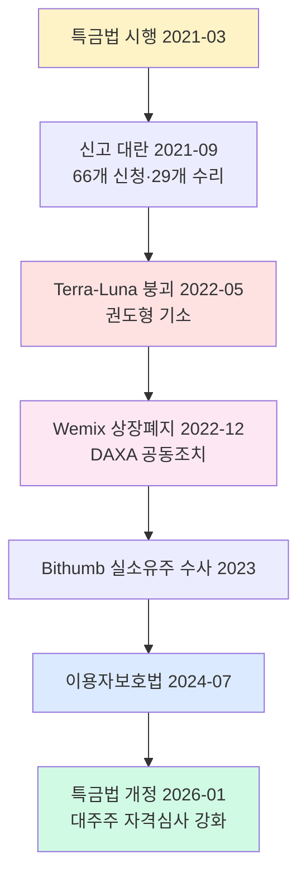
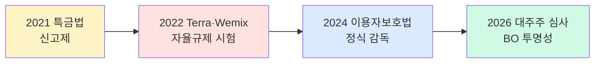

# 🇰🇷 한국 거래소·VASP 실제 사건·Enforcement 분석

> 2021~2026년 한국 가상자산 업계의 주요 사건·DAXA 공동조치·감독 enforcement 기록. 해외 케이스(Binance·Bybit·Tornado)와 달리 한국은 대형 DOJ급 enforcement 아직 없으나, **자율규제·행정지도·민사 소송**을 통한 특수 사례 다수. 마지막 업데이트: 2026-04-23.

---

## TL;DR

- 한국은 **대형 형사 enforcement 아직 없음** — 대부분 행정·민사·자율규제
- **DAXA 공동 상장폐지** (Wemix 2022-12)가 자율규제 실효성 시험 사례
- **Terra-Luna** (2022-05)는 한국 최대 가상자산 사기 사건 (권도형)
- **특금법 2021 시행 초기** VASP 대량 신고 거절 → 시장 정리
- **Upbit 실명계좌** 계약 어려움은 K-뱅크(K-Bank) 파트너십으로 해결
- **이용자보호법 2024-07** 이후 조용 — 대형 enforcement 대기 중

---

## 🗺️ 한국 enforcement 지도

---

## 1. 특금법 초기 시행 — 신고 대란 (2021)

### 타임라인

- **2021-03-25**: 특금법(특정금융정보법) 시행
- **2021-09-24**: VASP 신고 기한 마감 (6개월 유예)
- **결과**: 신고 시도 약 66개 → 최종 수리 29개 (원화거래 4대 포함)

### 주요 이슈

- **실명계좌 의무** — 대부분 VASP가 은행 계약 실패
- **ISMS 인증** — 준비 기간 부족, 비용 부담
- **미수리 거래소 영업 정지** — 약 37개
- FSC·FIU의 은행권 간담회 개입에도 은행 리스크 회피 강함

### 시장 영향

- 중소 거래소 대거 폐업
- 4대 거래소(Upbit·Bithumb·Coinone·Korbit) 독점 구조 고착
- GOPAX(고팍스)가 5번째 원화 거래소로 유일 추가
- 신규 진입 장벽 급격히 상승

### AML 교훈

실명계좌라는 **은행 게이트키퍼(gatekeeper)** 모델 — 형식적으로는 특금법이 요구하지만, 실질 판단 권한은 은행. 은행의 AML 리스크 허용도에 따라 시장 형성 결정.

---

## 2. Terra-Luna UST 붕괴 (2022-05)

### 사건 개요

- **기업**: Terraform Labs (권도형 Do Kwon·신현성)
- **사건**: UST(TerraUSD) 디페그(de-peg) → LUNA 폭락
- **전 세계 피해**: 약 $40B (시가총액 기준 증발)
- **한국 피해자**: 20~30만 명 추정, 피해 수조 원
- **언론 보도**: 서울경제·조선일보·한겨레 수백 건

### 법적 진행

| 일자 | 사건 |
|---|---|
| 2022-06 | 서울남부지검 기소 (자본시장법·특금법 위반) |
| 2022-09 | 권도형 인터폴 적색수배 |
| 2023-03 | 몬테네그로 공항에서 위조 여권 적발 |
| 2024-03 | 몬테네그로 체포 확정 |
| 2024~2026 | 미국·한국 송환 경쟁 |
| 2026-Q1 | 미국 결정 우선 |

### AML·한국 시장 교훈

- **알고리즘 스테이블코인의 붕괴 위험** — 담보 없는 페그의 한계
- **발행자에 대한 AML·투자자 보호 규제 필요성** → 이용자보호법 2024-07 시행 원인 중 하나
- **DAXA의 조기 경보 실패** — Terra 관련 거래소 경고 미흡
- 권도형 자산 추적 과정에서 **온체인 분석(Chainalysis·Elliptic)** 중요성 부각

---

## 3. Wemix 상장폐지 — DAXA 자율규제 첫 시험 (2022-12)

### 사건 개요

- **코인**: Wemix(위믹스, 위메이드 발행)
- **쟁점**: 유통량 허위 공시·DAXA 정보공개 규약 위반
- **DAXA 조치**: 5개 원화거래소(Upbit·Bithumb·Coinone·Korbit·GOPAX) **공동 상장폐지**
- **일정**: 2022-12-08 결정 → 2022-12-15 거래 중지

### 법적 진행

- **2022-12**: 위메이드 → DAXA 회원사 대상 행정소송 (상장폐지 취소 요구)
- **2023-02**: 법원 가처분 기각 (거래소 재량 인정)
- **2023-02**: 코인원·코빗 재상장 → 위메이드 부분 승리
- **2023-09**: 본안 소송 1심 부분 기각

### 의의

- **DAXA 자율규제의 실효성 첫 시험** — 법적 강제력 없이도 공동 조치 효과
- 그러나 **법원에서 완전 인정은 아님** → 회원사 간 자율적 판단 한계 드러남
- 신규 코인 상장 심사 표준화 계기 마련
- 이후 DAXA 상장 심사 가이드라인(2023) 체계화

### 한국 자율규제 모델의 교훈

| 장점 | 한계 |
|---|---|
| 신속한 공동 조치 가능 | 법적 강제력 없음 |
| 업계 자정 작용 | 회원사 간 조치 불일치 시 효과 약화 |
| 규제 공백 보완 | 소송 리스크 회원사가 부담 |

---

## 4. Bithumb 실소유주 논란 (2018~2023)

### 사건 개요

- 이정훈(전 Bithumb 사장)·김병건(실소유주 의혹) 복잡한 지배구조
- **FIU·검찰 수사**: 자본시장법·특금법 위반 의혹
- **2023-02**: 김병건 구속
- **2023-09**: 1심 선고 (사기 혐의 일부 유죄)

### AML 교훈

- **VASP 실소유주(BO, Beneficial Owner) 공개의 중요성**
- **2026-01 대주주 자격심사 강화** 도입의 배경
- KYC 의무가 거래소 고객뿐 아니라 **거래소 주주·임원**에게도 적용되어야 한다는 논리
- 국내 거래소 M&A 투명성 이슈 부각

---

## 5. 신고 후 폐업·영업정지 사례 (2021~2024)

실제 폐업·영업정지 거래소 (순차):

- **2021-09**: 미수리 거래소 37개 영업 정지
- **2022~2023**: 중소 거래소 폐업 연쇄 (~20개 추가)
- **2024**: 일부 코인 전용 거래소(NFT·DeFi-only) 축소

### 폐업 원인

- 실명계좌 계약 유지 실패 (은행이 계약 해지)
- ISMS 갱신 비용 부담 (연 수억 원)
- 거래량 감소·수익성 악화
- FIU 검사 지적 후 자진 폐업

### 시장 구조 영향

원화거래소 4대 + GOPAX 체제 고착 — 2026-04 기준 변동 없음.

---

## 6. Upbit NFT·스테이킹 축소 (2024)

### 배경

- NFT 시장 전체 침체 (2023~)
- **이용자보호법 시행(2024-07)** 후 AML 리스크 재평가
- 4대 거래소 모두 NFT 사업 **축소**

### 영향

- 한국 NFT 자금세탁 경로 차단 효과
- 스테이킹 서비스도 **미출시 유지** (법적 불확실성)
- 해외 CEX(Binance·OKX) 대비 서비스 범위 축소

### 규제 리스크 회피 경향

한국 VASP는 **규제 불확실 영역에 진입하지 않는** 보수적 경향. 미국·유럽 대비 혁신 서비스 출시 지연.

---

## 7. DAXA 공동 블랙리스트 운영 (상시)

### 운영 구조

- 의심 주소·mixer·해킹 자금 수신 주소 공동 공유
- **실효성**: 국내 4대 거래소 입출금 즉시 차단
- 공식 공개 X, 회원사 내부 공유 (secure channel)

### 주요 사례

- **Bybit 탈취 자금 수신 주소** (2025-02 이후) 공동 차단
- **Tornado Cash 상호작용 주소** 공동 관리
- **Lazarus 관련 주소** 즉시 차단

### 한계

- 해외 거래소와의 정보 공유 체계 부족
- 주소 공유 지연 시 자금 이동 가능
- 공식 legal basis 없음 → 개인정보·반독점 이슈 잠재

---

## 8. 국세청·검찰 개입 사례

### 가상자산 조세 포탈 조사 (2022~)

- 국세청이 4대 거래소에 자료 제출 요구
- **2022년 약 2,400억 원 추징세액 부과** (부당 이득 반환)
- 고액 거래자(whale) 집중 조사

### 민사 소송 사례

- 해킹 피해자의 거래소 대상 민사 소송 (2020~)
- 대부분 거래소 책임 한정 (약관 기준)
- **Bithumb 2018 해킹** 피해자 소송 → 일부 패소

---

## 9. 이용자보호법 시행 이후 조용 (2024-07~)

2024-07-19 시행 후 2026-04 현재까지:

- **대형 enforcement 미발생** — FSS 검사 결과 크리티컬 이슈 없음
- **시세조종 조사 진행 중** — 구체 사건 미공개
- **콜드월렛 80% 감사** — 4대 거래소 모두 통과

### 이유 분석

- 시행 초기 거래소 자발적 시정
- FSC·FSS 행정지도 우선 (벌금보다 시정 명령)
- 중대 사건 발생 시 이용자 보호·상환 우선
- 검찰 사건은 **법 시행 이전 행위** 대상이 주류

---

## 10. 2026년 예상 이벤트

- **특금법 2026-01 개정** 적용 — 대주주 M&A 심사 이미 지연
- **스테이킹 가이드라인** 발표 예정 (FIU)
- **DAXA 2단계 입법 논의** — 시장조성·공시 등
- **Terra-Luna 권도형** 한국 송환 시 파급 영향
- **신규 VASP 라이선스 재개** 여부 주목

---

## 🌏 해외 사례와의 차이점

한국 enforcement 특징:

| 특징 | 한국 | 미국 (Binance·OKX) |
|---|---|---|
| 대형 형사 처벌 | 드물다 | Binance CEO 4개월 복역 |
| 합의금 규모 | 백억~천억 | $4.3B·$504M |
| 모니터십 | 없음 | 5년 DOJ 모니터 |
| 자율규제 실효성 | **높음 (DAXA)** | 낮음 |
| 감독 방식 | 행정지도 우선 | 소송·합의 우선 |
| 법인 대비 개인 책임 | 법인 중심 | CEO 개인 형사 |

**한국 모델의 장점**: 신속한 자율 시정, 업계 안정, 이용자 보호 우선
**한국 모델의 약점**: 법적 강제력 약함, 국제 신뢰도 한계, 억제력 부족

---

## 📊 한국 enforcement 강도 진화

**트렌드**: 자율규제 → 행정지도 → 정식 감독 → BO·실소유주 투명성으로 단계적 강화.

---

## 📚 1차 자료

- [FSC 보도자료](https://www.fsc.go.kr/) — 금융위 공식
- [FIU 공식](https://www.kofiu.go.kr/) — 금융정보분석원
- [서울남부지검 보도자료](https://seoulnambu.spo.go.kr/) — Terra·가상자산 전담
- [DAXA 공식](https://www.daxa.or.kr/) — 디지털자산거래소 공동협의체
- [위메이드 공식](https://www.wemade.com/) — Wemix 발행사
- [Chainalysis 한국 리포트](https://www.chainalysis.com/blog/category/korea/)
- [Elliptic Terra 분석](https://www.elliptic.co/resources)

---

## 📖 더 읽을거리

- [`major-enforcement.md`](major-enforcement.md) — 글로벌 enforcement (Binance·OKX)
- [`lazarus-dprk.md`](lazarus-dprk.md) — Bybit 사건
- [`tornado-cash.md`](tornado-cash.md) — Tornado 관련
- [`../7-vendors/korea-solutions.md`](../7-vendors/korea-solutions.md) — DAXA·한국 인프라
- [`../2-regulations/korea-fiu-act.md`](../2-regulations/korea-fiu-act.md) — 특금법 조항별
- [`../2-regulations/korea-user-protection.md`](../2-regulations/korea-user-protection.md) — 가상자산이용자보호법

---

> 🔙 상위: [`README.md`](README.md) · 전체 인덱스: [`../README.md`](../README.md)
