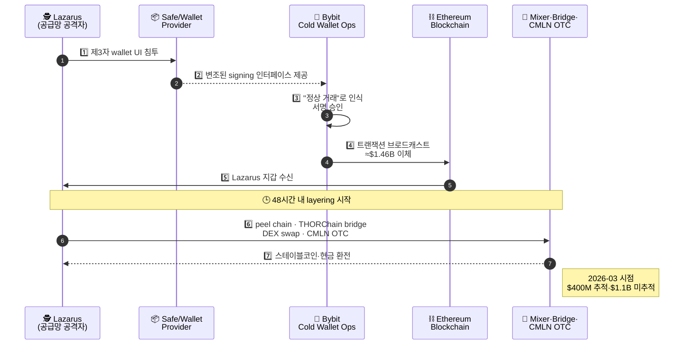
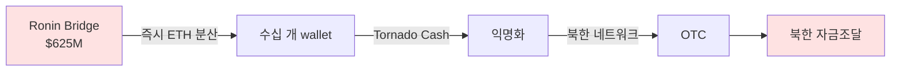
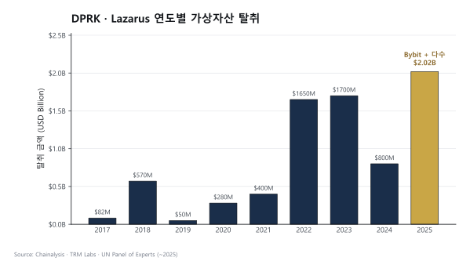
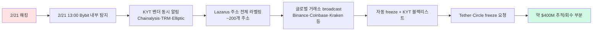

# Lazarus / DPRK — 북한 사이버 자금세탁

> 가상자산 업계 **1순위 위협 행위자**. Bybit $1.46B 사건. 이 글을 읽고 나면 왜 Lazarus가 단순 해커 그룹이 아니라 **국가 자금조달 인프라**인지, 그리고 왜 2025-02 Bybit가 거래소 보안 표준을 바꾼 분기점이 됐는지 이해하게 됩니다. 마지막 업데이트: 2026-04-17.

## TL;DR
- **Lazarus Group** = 북한 정부 후원 사이버 부대 (Bureau 121, RGB 산하)
- 2025년 단일 해 **$2.02B 탈취** (전년 대비 +51%), **누적 $6.75B**
- **2025-02-21 Bybit hack ≈$1.46B** (ETH + stETH + mETH + cmETH 혼합) — 단일 사건 사상 최대
- 자금세탁 핵심: **48시간 내 mixer + cross-chain bridge + CMLN(중국어 자금세탁 네트워크)** 활용
- FBI 명칭: **TraderTraitor** (Lazarus의 한 sub-cluster)
- 2025년 service compromises의 **76%가 DPRK**
- 핵·미사일 프로그램 자금조달원으로 의심

---

## 1. Lazarus Group이란 — 단순 해커가 아니라 국가 기관

### 정체성

Lazarus Group은 **북한 정찰총국(RGB) 산하**의 국가 소속 사이버 부대입니다. 민간 해커 그룹이 아니라 **조선인민군 Bureau 121** 같은 공식 군사 단위에 속하며, 2009년경부터 활동 중. 미국 OFAC은 2019년에 Lazarus를 SDN List에 제재 지정했습니다.

용어:
- **APT (Advanced Persistent Threat)** — 특정 표적을 장기간 집요하게 공격하는 조직. 국가급이 대부분.
- **RGB (Reconnaissance General Bureau)** — 북한 정찰총국. 해외 정보·사이버·암살 작전 총괄.
- **Bureau 121** — RGB 산하 사이버전 부대. Lazarus의 조직적 근거지로 추정.

### 왜 "단순 해킹"이 아닌가

민간 해커 그룹은 보통 **개인 수익**을 목적으로 하지만, Lazarus는 **국가 외화 조달**이 목적. UN Panel of Experts 보고서에 따르면 Lazarus가 탈취한 자금은 **핵·미사일 프로그램 자금**으로 흘러가는 것으로 추정됩니다. 이 때문에:

- 탈취량이 수억 달러 단위 (민간 해커 수준 넘음)
- 자금세탁 인프라가 **국가급 정교함**
- FBI·UN·OFAC이 **매년 집중 감시**
- 한국 입장에서는 **적성국가 제재 + 우리 거래소 표적**의 이중 위협

### 활동 연혁

| 시기 | 활동 |
|---|---|
| 2009~2014 | DDoS, wiper 공격 (한국 농협 등) |
| 2014 | Sony Pictures 해킹 |
| 2016 | **Bangladesh Bank SWIFT $81M** (전통 금융) |
| 2017 | **WannaCry 랜섬웨어** |
| 2017~ | **가상자산 거래소 해킹 본격화** |
| 2022 | **Ronin Bridge $625M** (Axie Infinity) |
| 2024~2025 | DeFi·Bridge·거래소 대거 공격 |
| **2025-02** | **Bybit $1.46B** (사상 최대) |

### Sub-cluster — 같은 조직 내 여러 팀

- **Lazarus** — 광범위 상위 명칭
- **APT38** — 금융 표적
- **TraderTraitor** (FBI 명명) — 가상자산 표적, 가짜 채용 수법
- **Bluenoroff** — 핀테크 표적

### 실무 포인트

Lazarus는 **한 인물이나 한 팀이 아니라 여러 sub-cluster의 합**입니다. 방어 시 "Lazarus 차단"을 단일 조치로 끝낼 수 없고, sub-cluster별 패턴을 별도 추적해야 합니다. KYT 벤더(Chainalysis·TRM·Elliptic)의 Lazarus 라벨 품질은 **sub-cluster별 구분 정확도**로 평가됩니다.

---

## 2. 2025-02-21 Bybit Hack — 사상 최대 사건



### 공격 서사

2025년 2월 21일, Bybit의 콜드월렛 운영팀이 평소처럼 정기 이체 트랜잭션을 서명했습니다. 서명자들은 UI에 표시된 트랜잭션이 정상이라고 확신했지만, 실제 블록체인에 기록된 건 **Lazarus의 지갑으로 약 $1.46B 규모 자산을 전송**하는 트랜잭션이었습니다.

무엇이 일어났나: **공급망 공격(Supply Chain Attack)**. Bybit 자체 시스템이 해킹당한 게 아니라, 서명 워크플로우에서 사용된 **제3자 wallet provider(Safe 등)의 프론트엔드 인터페이스**가 사전에 침투·변조됐습니다. 서명자 눈에는 정상 트랜잭션이 표시됐지만, 실제 서명된 데이터는 Lazarus의 컨트랙트를 호출하는 내용. 운영자가 **"내가 본 것"과 "내가 서명한 것"이 달랐던** 결정적 실패 지점.

### 사실 관계

- **2025-02-21**: Bybit cold wallet에서 **약 $1.46B 탈취** (ETH 약 40만개 + stETH·mETH·cmETH 등 LST 혼합)
- 공격 방식: **공급망 공격** — 제3자 wallet provider 침투, signing 인터페이스 변조
- **2025-02-26** FBI가 공식 Lazarus 귀속 발표

### 48시간 자금세탁 서사

해킹 후 48시간 이내에 Lazarus는 **약 $160M layering을 완료**했습니다. 이 속도가 왜 중요한가: 전통 금융에서는 수일~수주가 걸리는 분산·환전이 **가상자산에서는 48시간**. 사고 후 대응은 이미 늦고, **사전 차단만이 실질적 방어**라는 교훈.

2026-03 시점 추적 현황:
- $400M 추적 + 부분 환전됨
- $1.1B 잔여 추적 중 (다양한 wallet cluster)

사용 도구:
- **Cross-chain bridge** (THORChain 등)
- **DEX swap** (Uniswap, Curve, etc.)
- **CMLN(중국어 자금세탁 네트워크) OTC desk**

### 업계에 남긴 임팩트

Bybit 사건은 가상자산 업계에서 **"Bybit 이전 / Bybit 이후"** 로 불릴 만큼 보안 표준을 재정의했습니다:

- 거래소 보안 표준 재검토 — 다중 서명 흐름·서명 UI 검증 강화
- 미국 의회 청문회 개최
- US 의회 가상자산 보안 입법 가속화
- Bybit는 **자체 자금으로 사용자 손실 전액 보전** (이 사실이 업계에 안도감)

### 실무 포인트

Bybit 사건의 핵심 교훈은 **"서명자가 본 것과 서명한 것이 같은가"** 를 검증하는 메커니즘이 필요하다는 것. 이게 **Blind Signing 금지** 운동으로 이어졌고, 주요 하드웨어 지갑(Ledger 등)이 2025년 내 **트랜잭션 내용을 하드웨어에서 직접 파싱·표시**하는 기능을 강화했습니다. 수탁업자나 거래소 운영팀은 이 검증 레이어를 필수 통제로 두는 게 업계 표준.

---

## 2-B. 2022-03-23 Ronin Bridge Hack — $625M, Bybit 이전의 분기점



Bybit 이전, 가상자산 업계 **단일 사건 사상 최대**였던 사건. 2022-03 시점에 일어났고, 이후 업계 multisig 거버넌스·bridge 보안 표준을 근본적으로 재편한 분기점입니다. "Bybit가 거래소 cold wallet 시대를 갈랐다면, Ronin은 DeFi·bridge 시대를 갈랐다"는 평가.

### 핵심 사실 (스펙)

- **사건일**: 2022-03-23 (실제 해킹 발생), **2022-03-29** (Sky Mavis 공식 발견·발표)
- **발견 지연**: **6일** — 사용자가 5,000 ETH 인출 실패를 신고한 뒤에야 운영팀이 탈취 감지
- **피해**: **$625M** — 173,600 ETH + 25.5M USDC
- **공격 유형**: Validator private key 탈취 (multisig 9개 중 5개 통제 → 인출 승인 권한 확보)
- **공격자**: **Lazarus Group** (FBI 2022-04-14 공식 귀속)
- **자금 회수**: ~$30M (Binance가 ChainAlysis 협조로 차단) — 전체의 5% 미만

### 피해 구조 상세

Ronin은 Axie Infinity(Sky Mavis 개발) 게임 전용 **사이드체인 + Ethereum bridge**였습니다. 사용자가 Ethereum에서 Ronin 사이드체인으로 자산을 이동할 때 이 bridge를 거쳐야 했고, bridge의 인출(withdraw) 승인은 **9명의 validator 중 5명의 서명**이 필요했습니다. 공격자는 이 중 5개 key를 탈취해 **자체 서명으로 인출** 트랜잭션 2건을 생성:

- **트랜잭션 1**: 173,600 ETH 인출
- **트랜잭션 2**: 25.5M USDC 인출
- 두 건 모두 정상 multisig 서명으로 검증 → 컨트랙트가 승인
- Sky Mavis 내부 모니터링은 해당 인출을 **정상 운영 서명**으로 인식

### 공격 메커니즘 상세 — "Discord 가짜 채용"

FBI·Chainalysis·Sky Mavis 사후 조사에 따르면:

1. **표적 선정**: Sky Mavis Discord 채널에서 활발한 **시니어 엔지니어**
2. **LinkedIn 접근**: 다른 블록체인 게임 회사로부터의 **가짜 채용 오퍼** (높은 연봉)
3. **다단계 면접**: 몇 차례 기술 면접 후 신뢰 구축
4. **최종 오퍼 PDF**: Word 문서(`.docx`) 첨부파일 — **macro-enabled malware** 내장
5. **엔지니어 노트북 감염**: 문서 열람 시 매크로 실행 → spyware 설치
6. **내부 네트워크 침투**: VPN credential 탈취 → Sky Mavis 인프라 진입
7. **Validator key 탈취 (4개)**: 직접 관리 중이던 validator 4개의 private key 추출
8. **Axie DAO validator 1개 추가 확보**: 이전 해에 **Sky Mavis가 Axie DAO validator에 대한 서명 권한을 위임받았다가, 회수 처리를 잊음** — 권한이 만료됐어야 했으나 여전히 활성
9. **5/9 달성 → 인출 실행**

### 치명적 실패 지점 — "잊은 권한"

Ronin 사건의 가장 충격적인 부분은 **Axie DAO validator 서명 위임 회수 실패**. 2021년 말 사용자 급증으로 Axie DAO가 Sky Mavis에 일시적 서명 권한을 위임했는데, 이를 **기한 후 회수하지 않음**. 공격자는 이 "유령 권한" 하나로 4/9에서 5/9로 올려 multisig 통과. 단 1개 validator의 권한 관리 부주의가 $625M 피해의 문턱이 됐습니다.

### 자금세탁 흐름

| Phase | 시점 | 행동 | 도구 |
|---|---|---|---|
| 1 | 2022-03-23 | 탈취 즉시 수십 개 wallet으로 분산 | peel chain |
| 2 | 2022-03-23~04 | Tornado Cash 대량 입금 | Tornado (당시 제재 전) |
| 3 | 2022-04~05 | 중국·러시아 OTC desk 환전 | CMLN 초기 |
| 4 | 2022-04-14 | FBI 공식 Lazarus 귀속 → 이후 추적 본격화 | — |
| 5 | 2022-04~08 | Binance ~$30M 차단 (Chainalysis 협조) | exchange freeze |
| 6 | 2022-08-08 | **OFAC Tornado Cash 제재** — Ronin 자금이 제재의 직접 근거 중 하나 | — |

### 업계에 남긴 임팩트 — "3가지 표준 변화"

Ronin 사건은 **multisig 거버넌스 · Discord 보안 · bridge 보안** 3개 영역 표준을 재정의했습니다:

**1. Multisig 거버넌스 표준**
- **권한 자동 회수**: 위임 기간 만료 시 스마트컨트랙트 레벨에서 자동 해제 (Sky Mavis 사건의 직접 교훈)
- **외부 validator 분리**: Axie DAO 같은 외부 entity validator는 Sky Mavis와 물리적으로 분리된 key 관리
- **임계값 상향**: 5/9 → 8/13 등으로 multisig 강화, 재구성 cost 증대

**2. Discord 보안**
- 모든 DAO·DeFi 프로젝트가 Discord 권한 격리 도입
- **Engineer access ≠ Discord admin**: 역할 분리
- 사내 보안 교육에 "LinkedIn 가짜 채용" 시나리오 필수 포함

**3. Bridge 보안**
- Cross-chain bridge가 가상자산 해킹의 **1순위 표적**이라는 인식 확립
- 후속 사건: **Wormhole $325M (2022-02)**, **Nomad $190M (2022-08)**, **BNB Bridge $586M (2022-10)**
- 2022 한 해 bridge 해킹만 **누적 $2B+**

### 한국 VASP 영향

- **빗썸·코인원·코빗·업비트 모두 외부 multisig 외부 감사 분기 1회 강제** (DAXA 2022-06 합의)
- **Cross-chain bridge 추적 룰** 강화 — Chainalysis Reactor에 bridge matching 활성화
- 한국 자체 DeFi·bridge 프로젝트(Orbit Bridge 등) 보안 감사 권고 상향
- Axie Infinity가 한국 유저 비중 높았기에 **한국 투자자 직접 피해 규모 ~수천억 원** 추정

### Bybit 사건과의 비교

Ronin(2022-03)과 Bybit(2025-02)은 **Lazarus 수법의 진화**를 보여줍니다:

| 항목 | Ronin (2022-03) | Bybit (2025-02) |
|---|---|---|
| 피해 | $625M | $1.46B (2.3배) |
| 공격 표적 | Validator private key | Cold wallet operator 서명 UI |
| 공격 수법 | Discord 가짜 채용 (malware 문서) | 공급망 공격 (Safe wallet UI 변조) |
| 발견 시점 | 6일 후 (사용자 신고) | 수시간 내 (자체 탐지) |
| 회수 | ~$30M (5%) | ~$50M 초기 (3%) |
| Lazarus 자금세탁 도구 | Tornado Cash | THORChain·OTC (Tornado 제재 시기라 회피) |
| 업계 표준 변화 | Multisig 거버넌스 | Hardware wallet 검증·Blind signing 금지 |
| 후속 사건 영향 | Wormhole·Nomad·BNB Bridge 연쇄 인식 | MPC·TSS 채택 가속, 공급망 감사 의무화 |

### 실무 포인트

Ronin 사건에서 거래소·DeFi 실무자가 꼭 기억해야 할 2가지:

1. **"잊은 권한"이 가장 치명적**: 보안 사고의 대부분은 **새로운 취약점**이 아니라 **운영 중 발생한 예외·임시 권한의 방치**에서 나옵니다. Sky Mavis의 Axie DAO validator 권한 회수 실패가 대표 사례. 정기적 권한 감사가 실질적 방어.
2. **발견 지연의 비용**: 6일 동안 Lazarus는 이미 자금을 Tornado에 넣고 분산 완료. **실시간 모니터링**(대규모 인출 알람)이 있었다면 최소 분산 전 단계에서 차단 가능. Bybit가 수시간 내 탐지한 것과 극명 대비.

### 사후 조사에서 밝혀진 추가 정보

**Chainalysis 2022 분석 보고서**에 따르면, 공격자는 탈취 직후 다음 행동을 순차 수행:

1. **첫 1시간**: 173,600 ETH + 25.5M USDC를 **약 5개의 1차 wallet**으로 분할
2. **첫 24시간**: 각 1차 wallet에서 **10~20개의 2차 wallet**으로 재분할 (peel chain 초기)
3. **첫 48시간**: 25.5M USDC → 대부분 Uniswap·Curve 경유해 ETH로 환전 (stablecoin freeze 회피)
4. **첫 1주**: Tornado Cash 대량 입금 시작 — 당시 미제재였으므로 가장 효과적 익명화 수단
5. **첫 1개월**: 일부 자금이 Huobi·FTX 등 거래소로 유입 → 거래소 freeze 협조로 **~$5.7M 환수**

**Elliptic 2022-04 분석**: Ronin 자금 중 **약 18%가 Tornado Cash로 유입** 확인. 이 데이터가 이후 **OFAC의 2022-08 Tornado 제재 결정의 핵심 근거** 중 하나가 됐다는 점에서 Ronin 사건은 Tornado 제재 역사의 간접적 트리거.

### Axie Infinity 게임 생태계 붕괴 연쇄 영향

Ronin 해킹의 숨은 피해는 **Axie 게임 생태계 자체의 붕괴**:

- Axie 토큰(AXS·SLP) 가격 **-80% 이상 급락** (2022-03~2022-12)
- Play-to-Earn(P2E) 게이머 이탈 — 특히 **필리핀·베트남** 생계형 플레이어 수십만 명
- Sky Mavis 기업가치 **$3B → $300M 수준** 급락
- P2E 모델 전반의 신뢰 상실 → 2022~2023 P2E 게임 생태계 침체

**한국 투자자 직접 피해**: Axie·AXS가 한국 4대 거래소 상장 주요 종목이었기에 한국 투자자 직접 손실 추정치 **수천억 원**. 가상자산 해킹이 **개별 프로젝트를 넘어 생태계·투자자에 미치는 파급 효과**의 대표 사례.

### Sky Mavis 대응과 복구

- **2022-04-06**: Binance 주도 **$150M 라운드 조달** — 피해 일부 보전
- **2022-06**: Ronin Bridge **복구 재개 전 보안 감사** (Verichains, Certik 등)
- **2022-06-28**: 재개장, validator **9 → 11명으로 확대**, 임계값 상향
- **단계적 환수**: Sky Mavis가 자체 자금 + 조달금으로 피해자 보전, 2022 말까지 대부분 완료
- **Axie DAO validator 권한**: 재설계 — 자동 만료 + 별도 key 관리 인프라

### 2022년 다른 Bridge 해킹과의 비교 — "Bridge 해킹의 해"

2022년은 가상자산 업계에서 **"Bridge 해킹의 해"**로 기록됩니다. Ronin을 필두로 다음 사건 연쇄 발생:

| 사건 | 날짜 | 피해액 | 공격 유형 | 공격자 |
|---|---|---|---|---|
| **Wormhole** | 2022-02-02 | $325M | Signature verification 취약점 | 미상 (Jump Crypto가 보전) |
| **Ronin** | 2022-03-23 | **$625M** | Validator key 탈취 | **Lazarus** |
| **Harmony Horizon** | 2022-06-24 | $100M | Multisig 2/5 탈취 | Lazarus |
| **Nomad** | 2022-08-01 | $190M | Contract 초기화 버그 | 다수 (오픈 약탈) |
| **BNB Chain Bridge** | 2022-10-06 | $586M | Merkle proof 위조 | 미상 |

**공통 교훈**:
- Bridge는 **대규모 자산 집중 + 복잡한 cross-chain 로직** → 공격 표면이 단일 체인 대비 수 배
- Validator·multisig 수가 적을수록 취약 (Ronin 5/9, Harmony 2/5는 너무 낮았음)
- Sky Mavis의 사례가 **Axie DAO validator 권한 회수 실패**였다면, Harmony는 **단 2개 key 탈취**로 $100M 탈취 — **임계값의 중요성**

### 1차 자료

- [FBI 보도자료 2022-04-14 — Lazarus 공식 귀속](https://www.fbi.gov/news/press-releases/fbi-statement-on-attribution-of-malicious-cyber-activity-posed-by-the-democratic-peoples-republic-of-korea)
- [Sky Mavis 사건 공식 보고서 — "Back to Building"](https://blog.roninchain.com/p/back-to-building-roninnetwork)
- [Chainalysis — Ronin·Axie Infinity 해킹 분석 (2022)](https://www.chainalysis.com/blog/ronin-axie-infinity-hack-2022/)
- [Elliptic — Ronin Bridge Post-mortem](https://www.elliptic.co/blog/the-ronin-network-hack-how-did-the-hackers-get-away-with-nearly-625-million)
- [U.S. Treasury OFAC — Lazarus 주소 추가 제재 2022-04](https://home.treasury.gov/news/press-releases/jy0731)
- [CertiK — Ronin 보안 감사 보고서 (2022-06)](https://www.certik.com/resources/blog/ronin-bridge-post-mortem)

---

## 3. DPRK 가상자산 활동 통계 (2025)



### 탈취 금액

- **2025**: $2.02B (전년 +51%)
- **누적**: $6.75B (Lazarus 가상자산 탈취 시작 이후)
- **2025 전체 service compromises의 76%가 DPRK**

### 주요 사건

| 연도 | 사건 | 금액 |
|---|---|---|
| 2017 | Yapizon (한국) | ~$5M |
| 2018 | Coinrail (한국) | $40M |
| 2018 | Coincheck (일본) | $530M (NEM) |
| 2019 | UpBit (한국) | $50M |
| 2020 | KuCoin | $280M |
| 2021 | Liquid (일본) | $97M |
| 2022 | **Ronin Bridge** | **$625M** |
| 2022 | Harmony Horizon | $100M |
| 2023 | Atomic Wallet | $100M |
| 2023 | Stake.com | $41M |
| 2024 | DMM Bitcoin (일본) | $305M |
| **2025** | **Bybit** | **$1.46B** |
| 2025 | WazirX (인도) | $230M |

### 실무 포인트

표에서 한국·일본 거래소가 **반복 표적**이 되고 있다는 패턴이 두드러집니다. 이는 우연이 아니라 **언어·시간대·인력 채용 접근성**이 맞물린 결과. 한국어 사용자 커뮤니티는 Lazarus가 침투하기 쉬운 환경이며, 직원 대상 사회공학(social engineering) 대응이 특히 중요합니다.

---

## 4. 자금세탁 패턴 — Lazarus Playbook

### Step 1. 즉시 분산

- 탈취 직후 수십~수백 wallet으로 분산 (peel chain)
- 각 wallet으로 작은 금액씩

### Step 2. Cross-chain Bridge

- ETH → BTC, ETH → BNB, ETH → Tron 등
- THORChain, Stargate, ChainFlip, Across 등 활용
- 분석 도구의 한 체인 추적 단절

### Step 3. DEX Swap

- Uniswap, PancakeSwap, Curve 등에서 자산 형태 변환
- KYC 없는 환경

### Step 4. Mixer

- Tornado Cash (2025-03 제재 해제 후 다시 활용)
- Wasabi, Samourai (2024 운영자 체포 전까지)
- 최근에는 새로운 mixer·CoinJoin 변형 시도

### Step 5. OTC 환전

- **CMLN (중국어 자금세탁 네트워크)**: 텔레그램·위챗 OTC
- 5~15% 수수료
- 가상자산 → 위안화·USD·현금
- 또는 USDT(Tron) 형태 유지하며 "환금 가능" 자산으로 보유

### Step 6. 북한 자금화

- 중간책을 거쳐 평양 송금
- 사치품 구매 / 핵·미사일 부품 / 사이버 인프라

### 실무 포인트

6단계 playbook은 **거의 모든 Lazarus 사건에서 반복**됩니다. 즉 Step 1부터 차례로 모니터링·차단하는 게 가능. KYT 시스템이 "Lazarus cluster"를 잘 라벨링하는 건 Step 1~2 차단에는 효과적이지만 Step 3 이후(DEX·mixer·OTC)는 **attribution lag**이 큽니다. 그래서 사고 후 글로벌 거래소 간 **24시간 내 freeze 협조 요청**이 실질적 자산 회수의 핵심.

---

## 5. 새로운 패턴 — 가짜 채용·Insider 공격

### Fake Recruitment / Job Scam

Lazarus의 TraderTraitor sub-cluster는 **LinkedIn·구직 사이트에서 가짜 헤드헌터 행세**를 하며 가상자산·AI 회사 직원을 표적으로 삼습니다. 공격 흐름:

1. 가짜 헤드헌터가 높은 연봉의 매력적인 포지션 제안
2. 가짜 코딩 테스트 제공 (GitHub 저장소, 인터뷰 준비 PDF 등)
3. 파일 실행 시 멀웨어 설치
4. 직원 노트북 침투 → 회사 내부 인프라 접근
5. 신원 도용·키 탈취·코드 주입 등 2차 공격

### Insider Threat

북한 IT 노동자가 **가명·위조 신분증으로 가상자산 회사에 원격 채용**되는 사례가 2024년부터 급증. 보수를 가상자산으로 받아 북한에 송금. 미국 DOJ가 2024~2025년 다수 적발, 한국 회사도 잠재적 피해자.

### Bitrefill Mirror Attack (2026-03)

Lazarus를 모방하는 동조 그룹도 등장. 보안 방어가 원본 Lazarus만 겨냥하면 놓치는 영역이 생깁니다.

### 실무 포인트

HR·채용 프로세스도 AML 보안의 일부라는 인식이 필요. 기술 면접 시 **신원 검증(비디오 통화 + 정부 발급 ID 실시간 대조)**, **채용 후 북한 IP·VPN 접속 모니터링**, **정기적인 직원 LinkedIn 가짜 헤드헌터 교육** 이 3가지가 실무 표준이 되어가고 있습니다.

---

## 6. 방어 — 회사 차원

### 기술

- **다중서명 + MPC + Hardware Wallet** — 단일 서명자 실패에 취약하지 않게
- **서명 UI 검증** — Bybit 사건 교훈, 서명자가 본 것과 서명한 것의 일치 보장
- **공급망 보안** — 제3자 SDK·wallet provider 검증
- **Cold storage 비율** — 가상자산이용자보호법 80% 요구

### KYT

- Lazarus 관련 wallet은 Chainalysis·TRM·Elliptic 라벨 즉시 반영
- 입출금 시 **Lazarus exposure 자동 차단**
- 의심 거래 → 즉시 STR

### KYC + HR 보안

- 채용 시 **북한 IT 노동자 식별** (시간대·신분증 위조·언어 단서)
- 임직원 LinkedIn 가짜 헤드헌터 경고
- 보안 교육 (피싱, 가짜 PDF)

### 협력

- **FBI·KISA·FIU** 정보 공유
- 산업 정보 공유 (ISAC)
- 사고 발생 시 **24시간 내 글로벌 거래소 freeze 협조 요청**

### 실무 포인트

거래소는 사고 발생 직후 **전 세계 주요 거래소와의 핫라인**이 얼마나 잘 작동하는가가 자산 회수율을 결정합니다. 회사가 평시에 어떤 그룹(Crypto ISAC, Elliptic Investigator Network 등)에 가입해 있는가, 다른 회사 CISO·AMLO와 직접 연락 가능한가가 위기 시 차이를 만듭니다.

---

## 7. 정책적 의미

- **DPRK는 가상자산 자금세탁의 #1 국가행위자**
- 미국 의회 + UN Panel 보고서 매년 갱신
- 한국 입장에서 특히 중요 — 적성국가 제재 + 우리 거래소 표적
- FATF Black List 유지

---

## 8. 학습 포인트

```
- 가상자산 보안은 단순 해킹 방어가 아니라 "공급망 + Insider + AML"의 결합
- 자금세탁이 24~48시간 내 완료되므로 사고 후 대응은 늦음 → 사전 차단이 본질
- Lazarus 라벨은 KYT 벤더의 attribution 품질의 시금석
- 한국·일본 거래소가 역사적으로 표적 다수 — 한국어 사용자 인식 필수
- 2025-02 Bybit가 보안 인식의 분기점
```

## 💼 실무 현장 (Industry Reality)

### Bybit 사건에서 방어선이 어디서 놓쳤나

**실패한 통제 지점 5개**:

1. **공급망 검증 부재**: Safe 같은 제3자 wallet UI가 변조됐는데 Bybit 운영팀이 검증 수단 없었음
2. **서명 UI 검증**: 서명자가 본 금액·수신 주소와 실제 서명 내용이 달라도 검출 못 함 (Blind Signing)
3. **사전 차단**: 트랜잭션 브로드캐스트 직전 최종 KYT 체크 미흡
4. **콜드월렛 운영 이중화**: 단일 signing flow에 과도한 권한 집중
5. **이상 트랜잭션 탐지**: $1.46B 단일 이체가 정상 패턴 경계 밖인데 시스템 알람 없음

### 사고 후 KYT 벤더 협업 (Chainalysis·TRM·Elliptic)

Bybit 사건 48시간 이내:



**Bybit 측 대응**: 자체 자금 $1.46B 사용자 손실 전액 보전 → 업계 신뢰 회복. **Mazars 회계 감사** 즉시 발표.

### 한국 VASP의 Lazarus 대응 실제 운영

- **4대 거래소 공동 블랙리스트**: FBI·OFAC 발표 즉시 공유. DAXA 채널 + 국정원 비공식 경로
- **자체 Lazarus 룰**: Chainalysis "LAZARUS_DIRECT" 태그 외 **동일 거래 패턴 행동 분석** 병행
- **HR 보안**: 북한 IT 노동자 잠입 경계 — 화상 면접 필수, 주민등록증 실시간 대조, 북한 IP·VPN 탐지

### 2025-02 Bybit 이후 업계 변화 (2026-04 시점)

- **Blind Signing 금지 운동**: Ledger·Trezor 등 하드웨어 지갑 펌웨어 업데이트
- **MPC + TSS 채택 확대**: Fireblocks·Copper·BitGo MPC 서비스 수요 급증
- **공급망 검증**: 제3자 SDK·wallet provider 정기 감사 의무화 움직임
- **미국 의회 입법**: Cryptocurrency Security Enhancement Act 발의
- **한국 금융위 가이드라인**: 2025-08 발표, 콜드월렛 운영 SOP 강화 요구

### Lazarus Playbook 실시간 탐지 룰 (의사코드)

```python
def lazarus_detection(wallet, tx):
    # Step 1: 직접 SDN 매칭
    if chainalysis.get_label(wallet) == "LAZARUS_DIRECT":
        return "CRITICAL", "자산 동결 + 즉시 FBI·KoFIU 통보"
    
    # Step 2: 48시간 급속 layering 패턴
    tx_count_48h = count_outgoing(wallet, "48h")
    if tx_count_48h > 50 and avg_amount < 0.1 * initial:
        return "HIGH", "peel chain 의심 + EDD"
    
    # Step 3: THORChain·Stargate 등 bridge 연계
    if tx.to in LAZARUS_FAVORITE_BRIDGES and tx.token in ["ETH", "stETH"]:
        return "HIGH", "Lazarus bridge 패턴"
    
    return None
```

### 자주 나오는 오해

- **"Lazarus는 거래소만 공격"** — 실제론 **DeFi·브리지·wallet provider·개별 직원**까지. 2024년 Radiant Capital, 2025년 Bybit 모두 공급망·개별 타겟.
- **"콜드월렛이면 안전"** — Bybit 사고의 cold wallet이었음. 콜드 ≠ 안전. **서명 프로세스** 보안이 핵심.
- **"Lazarus 라벨 차단만 하면 됨"** — Attribution lag 있음. **행동 패턴 탐지** 병행 필수.
- **"사고 후 회수 가능"** — 48시간 내 layering 완료. 사후 회수는 $400M/$1.46B (~27%) 수준에 그침.

### 주니어 Analyst 일상 — Lazarus 관련

- 매일 FBI·TRM·Chainalysis blog 모니터링 (신규 Lazarus TTP)
- Lazarus 연관 간접 노출(3~5 hop) 케이스 리뷰 (월 50~100건, 대부분 FP)
- 북한 IT 노동자 의심 신호(IP·시간대·서류 위조) 월간 통계 작성
- 연 1회 "Lazarus 시나리오 기반 모의 훈련" 참여 (붉은 팀 공격 시뮬레이션)

### 한국 특수 현실

- **한국어 사용자 커뮤니티 노출**: Lazarus가 한국어 능숙 → 한국 거래소·프로젝트 사회공학 용이
- **Upbit 2019 해킹 ($50M)**: 5년간 추적, 2024년 부분 회수. 한국 수사기관 + Chainalysis 장기 협업 사례
- **국정원 + DAXA + KISA 3자 채널**: 북한 위협 정보 실시간 공유. 민간 VASP 단독 대응 불가
- **채용 리스크**: 한국 VASP들은 2024~2025년 이후 **원격 개발자 채용 시 화상 면접 + 실명 확인** 필수화

---

## 더 읽을거리
- [`tornado-cash.md`](tornado-cash.md) — Lazarus가 자주 쓴 mixer
- [`major-enforcement.md`](major-enforcement.md) — 관련 enforcement 사례
- [`../3-crypto-aml/onchain-typology.md`](../3-crypto-aml/onchain-typology.md) — 자금세탁 패턴
- [`../5-compliance/sanctions-screening.md`](../5-compliance/sanctions-screening.md) — OFAC SDN
- [The Hacker News — DPRK $2B in 2025](https://thehackernews.com/2025/12/north-korea-linked-hackers-steal-202.html)
- [TRM Labs — Bybit Hack 분석](https://www.trmlabs.com/resources/blog/the-bybit-hack-following-north-koreas-largest-exploit)
- [BlockEden — Lazarus Playbook $6.75B](https://blockeden.xyz/blog/2026/02/03/lazarus-group-playbook-north-korea-crypto-theft-6-75-billion/)
- [38 North — Digital Kleptocracy → Crypto Superpower](https://www.38north.org/2026/01/from-digital-kleptocracy-to-rogue-crypto-superpower/)
- [Chainalysis 2026 Crypto Crime Report](https://www.chainalysis.com/reports/crypto-crime-2026/)
