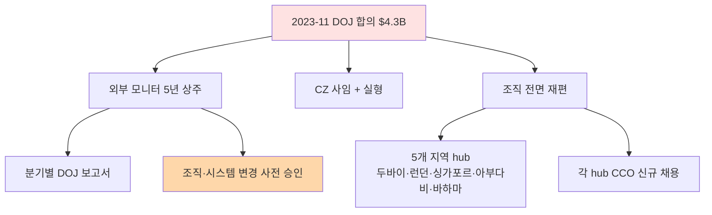
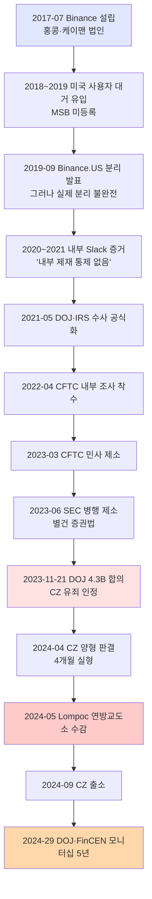
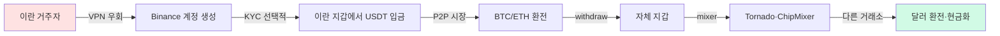
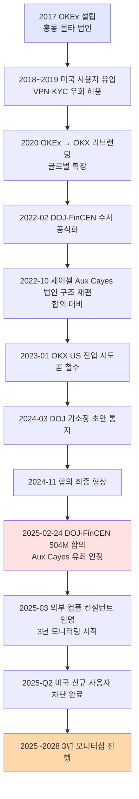
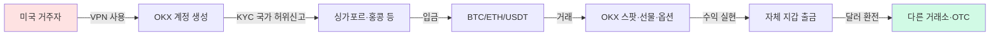

# 주요 Enforcement 사례 — 가상자산 AML 위반과 처벌

> 회사가 **큰 벌금 맞은 사례**에서 배우자. 이 글을 읽고 나면 "Binance $4.3B"가 왜 업계 분기점이 됐는지, CEO 개인 형사 책임이 왜 신규 표준이 됐는지 이해하게 됩니다. 마지막 업데이트: 2026-04-17.

## TL;DR
- 가상자산 AML enforcement 시대 본격 도래 (2020~)
- **Binance $4.3B (2023)** — 사상 최대, AML + 제재 결합
- **OKX $500M+ (2025)** — KYC 약함, 의심거래 처리 미흡
- **Paxful $3.5M FinCEN (2025)** — $500M 불법자금 처리
- 트렌드: **CCO·CEO 개인 책임 + 규모 거대화 + 제재 위반 결합**
- 한국 enforcement는 아직 적지만 검사 강화 중

---

## 1. 글로벌 Top Cases — 서사로 읽기


### Binance — $4.3B (2023-11)

**왜 이 사건이 상징적인가**: 가상자산 업계 **사상 최대 AML 벌금**이자 **CEO가 실제 실형**을 받은 첫 사건. 미국 DOJ + FinCEN + OFAC + CFTC의 **4개 기관 공동 합의**라는 점도 전례 없었습니다.

위반 내용:
- AML 프로그램 부재 (BSA 위반)
- KYC가 형식적
- **이란·북한·시리아·쿠바 사용자 차단 실패** (OFAC 제재 위반)

합의 결과:
- **벌금 $4.3B**
- **CZ(CEO) 사임 + 형사 유죄 + 4개월 실형**
- 5년 모니터십

**업계에 남긴 교훈**: "가상자산 회사가 크다고 해서 법 위에 있지 않다"는 명확한 시그널. 특히 **CEO 개인 실형**은 업계의 컴플라이언스 투자 의식을 한 단계 끌어올렸습니다. 이 사건 이후 글로벌 거래소들의 CCO·AMLO 인력 채용이 수직 상승.

### OKX — $500M+ (2024~2025)

- DOJ 합의
- 위반: 미신고 미국 운영, KYC 약함, 수십억 의심거래 처리
- 합의: 벌금 + 운영 조건 + 모니터링

**교훈**: Binance 이후에도 KYC가 형식적이면 의심거래를 잡지 못하고 대형 벌금으로 이어진다는 반복 증명. 또한 미국 시장에 공식 진출하지 않았다고 해서 미국 고객을 유치하면 미국 관할이 적용된다는 점 재확인.

### Paxful — $3.5M FinCEN (2025)

- P2P 가상자산 marketplace
- 위반: **고의적(willful) BSA 위반**, $500M 불법자금 처리, AML 프로그램 부적절, 제재국 사용자 처리
- 창립자 유죄 인정

**교훈**: **소형 P2P 사업자도 더 이상 안전지대가 없음**. "우리는 중간만 연결해주는 P2P"라는 변명은 규제당국이 더 이상 받아주지 않는다는 신호.

### Bittrex — $29M (2022)

- OFAC + FinCEN 결합
- 미국 거래소
- 제재국 사용자 + STR 미보고

### BitMEX — $100M (2020)

- KYC 미흡, AML 프로그램 부재
- **창립자들 형사 기소** (가택구금 실형)

### BitGo — $98K (2021)

- OFAC 제재 위반
- 작은 규모지만 **첫 가상자산 OFAC 합의** 사례

### 실무 포인트

5년간 이 사례들의 벌금 규모가 **$98K → $100M → $4.3B**로 천문학적 증가. 이 궤적이 보여주는 건 규제당국이 가상자산 산업을 "학습 중"에서 "본격 집행"으로 전환했다는 것. 2026년 이후 새로운 사건들의 벌금은 $4.3B 수준에서 출발할 가능성이 높습니다.

---

## 2. 트렌드 — 5가지 방향

### A. CCO·CEO 개인 책임 증가

- Binance CZ (4개월 실형)
- BitMEX 창립자들 (각 6개월 가택구금)
- Tornado Cash 개발자 Roman Storm (재판 중)
- Paxful 창립자 유죄 인정

→ **AMLO·CCO도 형사 책임 가능**한 구조로 굳어졌습니다.

### B. 규모 거대화

- 초기 $100K 수준 → 2023 Binance $4.3B
- 2025 OKX $500M+
- 시장 성숙 + 규제 본격화

### C. AML + 제재 결합 처벌

단순 KYC 위반이 이제는 AML + OFAC 결합 처벌로 나옵니다. 미국 OFAC 2차 제재의 위력은 **글로벌 거래소가 미국 룰을 따라야 하는 구조적 이유**이기도 합니다.

### D. 소형 사업자도 표적

Paxful 같은 P2P, BitGo 같은 기술 인프라도 표적. **모든 VASP가 컴플라이언스 비용을 직면**하는 시대.

### E. 사후 모니터링 (Monitorship)

합의 조건으로 외부 모니터 임명 → 수년간 운영 감시 + 보고서 제출. Binance는 5년 모니터십.

### 실무 포인트

5가지 트렌드 중 **E 모니터십**이 실무에 미치는 영향이 가장 큽니다. 합의로 끝나는 게 아니라 **수년간 외부 감독하에 운영**하는 것이고, 그동안 영업·IT·인사 의사결정이 모두 영향을 받습니다. "벌금 내고 끝"이라는 단순한 계산이 더 이상 성립하지 않는 시대.

---

## 3. 한국 Enforcement 사례

### 미신고 사업자 단속

- **2025-12-02 FIU 보도자료** — 미신고 가상자산 취급업자 단속 강화
- 외국 미신고 VASP의 한국 영업 차단
- 한국 거래소에 미신고 VASP 주소 차단 협조

### 거래소 형사 사례

- **서울남부지방법원 2024고단89** — 가상자산 관련 형사 사건
- 내용: 무신고 영업 등 (특금법 §17 적용)
- 5년 이하 징역 또는 5천만원 이하 벌금

### 시세조종 첫 사례 (가상자산이용자보호법)

- 2024-07 시행 후 첫 시세조종 형사 사건 누적 중
- 가상자산판 자본시장법 적용

### FIU 검사

- VASP 정기 검사 (주기 도래 시)
- 2026-01 특금법 개정으로 대주주까지 자격 심사

### 실무 포인트

한국은 아직 미국 수준의 거대 enforcement는 없지만, **2024-07 이용자보호법 시행 이후 본격 enforcement 축적 단계**에 진입했습니다. 2026~2028년 사이 한국에서도 **수백억원 규모 벌금 사례**가 나올 가능성이 높습니다. 업계는 미국 Binance 사례를 참고해 선제 대응하는 게 현명.

---

## 4. EU MiCA 시대 (2024-12-30~)

### 2026 active supervision 시작

- NCA(National Competent Authority)가 onboarding → 실효성 검사로 전환
- 첫 enforcement 사례 누적 중

### 예상 분야

- Travel Rule 미준수
- AMLR 시행 후 (2027) 직접 제재
- **AMLA 직접 감독** (대형사)

---

## 5. 위반 패턴 — 자주 등장하는 실수

```
1. KYC 형식적 — 신분증만 받고 검증 미흡
2. EDD 트리거 작동 안 함 — PEP·고위험국 자동화 부재
3. 거래 모니터링 룰 약함 — 알람 폭주 → 무시
4. STR 보고 지연 — 또는 누락
5. Tipping-off 위반 — 고객에게 STR 사실 노출
6. 제재 스크리닝 누락 — 특히 wallet 주소
7. AMLO 권한 부족 — 영업에 압도
8. 임직원 교육 부실
9. 정책 vs 실제 운영 괴리
10. 자료 보관 누락
```

### 실무 포인트

이 10개 패턴은 Binance·OKX·Paxful 합의문에서 실제로 지적된 항목들의 공통분모입니다. 회사가 자체 점검 시 이 10개를 연 1회 샘플 테스트하는 **"자기 모의 검사"** 가 효과적 예방책. 자기 회사에서 "이 항목이 어떻게 작동하는지 구체적 증거를 댈 수 있는가"가 기준.

---

## 6. 한국 사업자가 배워야 할 점

```
□ Binance 사례 — CEO·CCO 개인 형사 책임 가능
□ OKX 사례 — KYC가 형식적이면 의심거래 처리 못함
□ Paxful 사례 — 소형도 큰 벌금 가능
□ 미국 OFAC 2차 제재 — 한국 회사도 적용
□ 모니터십 — 위반 시 수년간 감시받음
□ 평판 리스크 — 벌금보다 평판이 더 큰 영향
□ 자진신고 (self-disclosure) — 적발 전 신고 시 감면
```

---

## 7. 사고 발생 시 회사 행동 — 시간축 SOP

### 즉시 (0~24시간)

1. 사실관계 확인 + 보존
2. AMLO + 법무 + CEO 공유
3. 추가 확산 차단 (계정 동결 등)
4. FIU + 감독당국 보고 검토

### 단기 (24시간~1주)

5. 외부 법무 자문 선임
6. 내부 조사
7. 자진 신고 검토 (감면)
8. 고객·시장 커뮤니케이션 (필요 시)

### 중기 (1주~)

9. 시정 계획 + 외부 감사
10. 재발방지책
11. 합의·소송 대응

### 장기

12. 모니터십 대응 (합의 조건)
13. 시스템·프로세스 개선
14. 임직원 교육 강화

### 실무 포인트

사고 발생 시 **"0~24시간"** 이 가장 중요합니다. 이 시간에 내린 결정(자진 신고 여부·공개 여부·계정 동결 범위)이 이후 합의 조건에 큰 영향을 미칩니다. 그래서 평시에 **사고 대응 SOP를 시나리오별로 작성**해두고, 담당 임원 모두가 인지하는 게 필수. 사고 난 후 처음 생각하는 건 이미 늦습니다.

---

## 8. 체크리스트 — 우리 회사가 이 사례들을 피하려면

```
□ AMLO에게 CEO 직접 보고 채널 부여
□ KYC 품질 정기 샘플 점검
□ EDD 트리거 자동화 (PEP·고위험국·거액·Wallet 노출)
□ KYT 룰 튜닝 (FP/FN 균형)
□ 제재 스크리닝 일일 배치
□ OFAC 2차 제재 인식 교육
□ 사고 대응 SOP 문서화 + 모의훈련
□ 외부 감사 연 1회
□ 이사회 분기 보고
□ 글로벌 enforcement 월간 모니터링
```

## 💼 실무 현장 (Industry Reality)

### Binance·OKX 이후 업계 컴플 변화 (2024~2026)

**조직 구조**:
- 글로벌 거래소 컴플라이언스 인력 비중 **5~8% → 10~15%** 증가
- Coinbase 컴플팀 ~500명 (전사 14%), Kraken ~200명 (10%)
- **CCO를 C-level 임원으로 승격** 트렌드 — 이전 VP 수준에서 격상
- **DOJ/FinCEN 외부 모니터** 상주 모델 확산 (Binance 2024-29 선례)

**기술 투자**:
- KYT 벤더 비용 연 2~3배 증가 (Chainalysis·TRM·Elliptic 병행 도입)
- 자체 ML 기반 탐지 시스템 (Coinbase "Lynx" 2024 출시 GNN 모델)
- Case Management 현대화 (Unit21·Hummingbird·자체 구축)

**임원 개인 책임 강화**:
- D&O 보험 한도 증액 (CCO 개인 $10M+ 일반)
- **Binance CZ 4개월 실형** 후 CEO·CCO 개인 법무 자문 상시화
- 의사결정 로그 (Slack·이메일·결재) WORM 보관 의무화 트렌드

### 대형 합의 후 실제 운영 변화 — Binance 사례



**외부 모니터의 실제 권한**:
- 모든 AML 의사결정 실시간 열람
- 정기 인터뷰 (분기별 수십 건)
- DOJ 직접 보고 (회사 경유 X)
- 조직 개편·인사·시스템 변경 **사전 승인**

### 한국 VASP가 이 사례에서 배운 구체적 변화

| 영역 | 2023 이전 | 2024~2026 |
|---|---|---|
| AMLO 지위 | 팀장·부장급 많음 | **임원급 법적 요구** + 실권 문서화 |
| D&O 보험 | 회사 단위 | **AMLO 개인** 추가 가입 |
| STR 결재 로그 | Excel·메일 | **WORM + 해시** 보관 |
| 이사회 보고 | 연 1회 | **분기 1회** 표준 |
| 외부 감사 | 없음 | 연 1회 EY·삼일 등 위탁 |
| Sandbox 테스트 | 미흡 | 시나리오 기반 **모의 검사** 반기 1회 |

### 한국 자진신고(Self-Disclosure) 감면 실무

- **FIU 자진 신고**: 위반 발견 시 적발 전 선제 신고 → **과태료 최대 50% 감면**
- 실무: 법무팀 + AMLO + 외부 로펌 3자 검토 후 결정
- 리스크: 자진 신고가 형사처벌로 이어지는 드문 경우도 있음 — 신중한 판단 필요
- 2024~2025년 한국에서 자진 신고 후 감면 받은 사례 수 건 확인됨

### 사고 발생 0~24시간 실제 SOP (대형 거래소)

| 시간 | 액션 | 담당 |
|---|---|---|
| 0~15분 | 사실 확인 + 추가 확산 차단 | 1선 + AMLO |
| 15~60분 | AMLO·CCO·CEO·CLO 소집 | Legal·Comms |
| 1~3시간 | 외부 법무 자문 선임 | CLO |
| 3~6시간 | FIU·KoFIU 보고 여부 결정 | AMLO + CLO |
| 6~12시간 | 사용자 커뮤니케이션 (필요 시) | Comms |
| 12~24시간 | 자진 신고 또는 대응 전략 확정 | 임원 전체 |

### 자주 나오는 오해

- **"벌금만 내면 끝"** — Binance 5년 모니터십 사례처럼 **사후 운영 제약**이 수년 지속.
- **"한국은 아직 enforcement 적어 안전"** — 이용자보호법(2024-07) 시행 후 첫 형사 판결 누적 중. 2027~2028 대형 사례 나올 가능성.
- **"자진 신고는 무조건 이득"** — 형사처벌로 이어지는 경우 있음. 법무·AMLO 신중 결정.
- **"작은 P2P는 표적 안 됨"** — Paxful $3.5M 사례 — 소형도 처벌.

### 한국 특수 현실

- **FIU 검사 주기**: 공식은 3년, 실제론 사고·민원 발생 시 수시 검사 빈번
- **금감원 합동 검사**: 2024-07 이용자보호법 시행 후 **FIU + 금감원 합동**이 표준. 검사 강도 체감 2배 증가
- **사고 보도 민감도**: 한국은 언론 노출이 규제 기관의 검사 우선순위에 큰 영향. 평판 관리가 AMLO 역할에 포함
- **DAXA 5사 공동 대응**: 한 거래소 사고 시 4개 거래소가 자율적으로 유사 리스크 점검 — 업계 자정

---

## 9. Binance $4.3B 심층분석 — 가상자산 enforcement의 분기점

### 9.1 한 줄 요약 + 의미

2023년 11월 21일, 미국 DOJ·FinCEN·OFAC·CFTC **4개 연방기관**이 세계 최대 가상자산 거래소 Binance Holdings Ltd.와 그 계열사에 **총 $4.3B (약 5조 7천억원)** 의 합의를 부과했습니다. 이는 **가상자산 산업 역대 최대 enforcement** 이자, 미국 금융 역사 전체에서도 top-tier 규모(HSBC 2012 $1.9B, BNP Paribas 2014 $8.9B, Goldman 1MDB 2020 $2.9B와 동급)에 해당합니다.

사건의 본질적 의미는 세 층위에서 읽어야 합니다. 첫째, **규모의 상징성** — 가상자산이 더 이상 "실험적 대체 금융"이 아니라 기존 금융권 enforcement 프레임에 편입됐음을 공표한 순간입니다. 둘째, **CEO 개인 형사 책임(criminal individual liability)** 의 공식화 — Changpeng Zhao(CZ)는 BSA(Bank Secrecy Act) 위반 개인 유죄를 인정하고 연방 교도소에서 **4개월 복역**했습니다. 회사 벌금과 별도로 CEO 개인이 실형을 산 사례는 전통 금융권에서도 희귀하며, 이전 HSBC·BNP 사건에서는 임원 실형이 없었다는 점과 대비됩니다. 셋째, **AML + 제재(sanctions) 결합 처벌** 의 표준화 — 단순 BSA 위반이 아니라 **IEEPA(International Emergency Economic Powers Act)** 위반까지 결합한 multi-statute prosecution이 글로벌 VASP(Virtual Asset Service Provider)의 향후 enforcement 템플릿이 됐습니다.

업계 관점에서 이 사건이 남긴 가장 근본적인 변화는 "컴플라이언스 비용은 option이 아니라 **생존 비용(cost of survival)** 이다"라는 인식 전환입니다. Binance는 2017~2022년 매출의 1% 미만을 컴플라이언스에 투자했다고 DOJ 기소장이 지적했고, 이는 $4.3B이라는 후행 비용으로 회귀했습니다. 사후적으로 계산하면 연간 $500M의 선제 컴플라이언스 투자가 $4.3B을 피할 수 있었다는 계산이 업계 표준 교훈이 됐습니다.

한국 VASP 관점에서는 이 사건이 "강 건너 불"이 아닙니다. 빗썸·업비트·코인원·코빗(DAXA 4사)은 **2024년 1분기 중 일제히 OFAC SDN(Specially Designated Nationals) 일일 스크리닝 시스템을 재정비**했고, VPN 탐지 룰을 도입했으며, AMLO 이사회 직접 보고 채널을 공식화했습니다. 이 모든 변화의 trigger가 바로 Binance 사건입니다.

### 9.2 사건 타임라인



타임라인에서 주목할 지점은 **E(2021-05 수사 공식화) → I(2023-11 합의)** 까지 약 30개월이 소요됐다는 점입니다. DOJ는 이 기간 동안 Binance 전·현직 직원 수십 명 인터뷰, Slack 아카이브 수백만 건, 블록체인 거래 기록 수억 건을 수집했습니다. 한국 VASP가 "검사는 빨리 끝난다"고 생각하는 건 오판이며, 미국 사례를 보면 **본격 수사 시 2~3년 지속** 이 표준입니다.

특히 **D 지점(2020~2021 Slack 증거)** 이 결정적이었습니다. DOJ 기소장은 Binance 내부 컴플라이언스 담당자가 동료에게 보낸 Slack 메시지를 직접 인용했는데, 한 직원은 "we see the bad, but we close 2 eyes(우리는 나쁜 일을 보지만 눈을 감는다)"라고 적었고, 또 다른 직원은 "보고해야 할 의심거래 수만 건이 쌓였는데 팀이 없다"고 썼습니다. 이 메시지들은 **"고의성(willfulness)"** 을 입증하는 직접증거로 사용돼 BSA 고의 위반 형사 기소의 토대가 됐습니다.

### 9.3 위반 행위 — 무엇이 잘못됐나

#### 9.3.1 무허가 송금업 (Unlicensed Money Transmission, 18 U.S.C. §1960)

Binance는 2017년 설립 후부터 2022년까지 **미국 시민을 상대로 거래 서비스**를 제공했으면서도 FinCEN에 MSB(Money Services Business)로 등록하지 않았습니다. DOJ 기소장에 따르면:

- 2017~2022 기간 미국 거주 사용자 누적 **약 150만 명**
- 이들이 Binance 플랫폼에서 실행한 거래 규모 총 **$76B 이상**
- "미국 사용자 VIP"로 태그된 고액 계정은 VPN 사용 안내를 받았으며, 일부는 Binance 직원이 직접 **우회 방법을 이메일·채팅으로 제공**
- Binance.US(별도 법인)는 2019년 설립됐으나 **실제 운영상 분리가 불완전** — 고위험 VIP는 Binance.com으로 유도

18 U.S.C. §1960는 미국 내 송금 서비스 무등록 운영을 형사 범죄로 규정하며, 위반 시 최대 5년 징역과 거래 규모 기준 몰수가 가능합니다. Binance의 경우 $76B 거래 규모의 일정 비율이 몰수 산정 기준이 됐습니다.

#### 9.3.2 BSA 위반 — AML 프로그램 부재 및 STR 회피

BSA §5318(h)는 모든 금융기관(MSB 포함)에 **4-pillar AML 프로그램**을 요구합니다: (1) 내부 정책·절차·통제, (2) 컴플라이언스 담당자, (3) 직원 교육, (4) 독립 감사. Binance는 이 네 기둥 모두에서 실패했습니다.

- **(1) 내부 통제**: KYC는 2019년까지 선택사항이었음. 사용자가 이메일만으로 계정 생성 가능했고, 일일 거래 한도도 강하지 않음
- **(2) 컴플라이언스 담당**: CCO(Chief Compliance Officer) 공석 기간이 길었고, 있을 때도 영업 라인 하부에 배치돼 실권 없음
- **(3) 교육**: 연 1회 간단한 온라인 모듈만 제공
- **(4) 감사**: 2019년까지 독립 감사 전무

**STR(Suspicious Activity Report) 회피** 가 특히 심각했습니다. DOJ 기소장은 Binance가 BSA §5318(g) 하에서 제출해야 했던 SAR(미국은 STR 대신 SAR 용어) **약 100,000건 이상이 미보고**됐다고 적시했습니다. 구체적으로:

- 랜섬웨어 관련 지갑 주소에서 유입된 자금을 인지하고도 STR 미보고
- **Hamas, ISIS 관련 지갑과의 거래** 를 Chainalysis 도구로 탐지했으나 보고 없음
- 아동 성착취물(CSAM) 지갑에서 유입된 BTC도 STR 미보고

#### 9.3.3 OFAC 제재 위반 — IEEPA + TWEA

이 사건의 **가장 심각한 축** 이 OFAC 제재 위반이었습니다. Binance는 미국인(US Person)이 OFAC 제재 대상국(이란·시리아·북한·쿠바·크리미아 지역)과 거래하는 것을 금지하는 **50 U.S.C. §1705(IEEPA)** 와 **50 U.S.C. §4305(TWEA, Trading with the Enemy Act)** 를 위반했습니다.

- **이란**: 2018~2022 이란 거주 사용자 약 **5만 명**, 거래 규모 **$898M**
- **시리아**: 사용자 약 **1,900명**, 거래 규모 **$23M**
- **쿠바**: 사용자 약 **2,500명**, 거래 규모 **$42M**
- **크리미아·도네츠크·루한스크**: 사용자 약 **900명**, 거래 규모 **$16M**
- **북한**: 직접 거주자 수는 낮지만, **Lazarus Group 관련 지갑** 과의 간접 거래 다수 탐지

OFAC 합의문(2023-11-21)은 특히 이란 부분을 강조했습니다. Binance는 2018년 IRISL(이란국영해운) 제재 강화 이후에도 이란 거주 사용자의 계정을 유지했고, 내부 직원이 "이란 사용자 차단 시 매출 타격 X%"를 계산한 스프레드시트를 DOJ가 확보했습니다.

제재 위반 규모 기준으로 **$968M OFAC 민사 합의금** 이 산정됐으며, 이는 OFAC 역사상 **가상자산 관련 최대 민사 합의**입니다.

#### 9.3.4 Internal Compliance 무력화 — 직접증거

DOJ 기소장에서 가장 강력한 증거는 **내부 Slack 메시지**였습니다. 대표적 인용:

- 컴플라이언스 직원 A: "we need a banner 'is washing drug money too hard these days - come to binance we got cake for you'" (마약자금 세탁이 요즘 너무 어렵다? 비낸스로 오세요, 케이크가 있습니다)
- 컴플라이언스 직원 B: "우리 업무는 실제 컴플라이언스가 아니라 '컴플라이언스처럼 보이기'"
- 임원 C(CZ에게 이메일): "미국 사용자를 공식 차단하면 매출 X% 감소. 비공식 용인 유지 권고"

이러한 내부 커뮤니케이션은 **BSA §5322 고의 위반** 요건을 충족시켰습니다. 단순 과실이 아니라 "알면서도 방조"했다는 점을 증명했기 때문에 형사 기소가 가능했습니다.

#### 9.3.5 Tipping-off 위반

BSA §5318(g)(2)는 금융기관이 **STR 제출 사실을 고객에게 알려서는 안 됨(tipping-off 금지)** 을 명시합니다. Binance는 일부 VIP 사용자에게 **"계정이 컴플 리뷰 대상이니 주의하라"** 는 비공식 경고를 보냈고, 이는 tipping-off 위반으로 별도 처벌 사유가 됐습니다.

#### 9.3.6 VPN 안내 — 미국 사용자 우회

특히 악질적으로 지적된 행위는 **Binance 고객지원팀이 미국 사용자에게 VPN 사용법을 안내** 한 사실입니다. DOJ 기소장은 2019년 6월 Binance.US 분리 발표 직후 고객지원 팀장이 작성한 내부 문서를 인용했습니다:

> "VIP 미국 사용자가 문의 시, VPN을 통한 접속 방법을 안내하되 서면(이메일)으로 남기지 말고 음성·채팅으로만 전달할 것"

이 문서는 **고의적 우회(willful circumvention)** 의 결정적 증거로 사용됐습니다.

### 9.4 합의 내용 — 벌금·범칙금·환수·이행 의무

#### 9.4.1 총액 $4.3B 분해

| 기관 | 금액 | 근거 법률 | 비고 |
|---|---|---|---|
| DOJ 형사 합의금 | $1.81B | 18 U.S.C. §1960, 31 U.S.C. §5322, 50 U.S.C. §1705 | 무허가 송금업 + BSA + IEEPA |
| FinCEN 민사 합의 | $3.4B | 31 U.S.C. §5321 | BSA 민사 penalties |
| OFAC 민사 합의 | $968M | 50 U.S.C. §1705 | IEEPA 민사 |
| CFTC 합의 | $2.7B | CEA §4, §4d, §4b | 무허가 거래소·선물·옵션 |
| **중복 차감 후 총액** | **$4.3B** | — | DOJ는 FinCEN·OFAC 금액을 formal credit |

$3.4B + $968M + $2.7B + $1.81B = $8.88B이지만, 기관 간 중복 credit 구조로 **실효 지급액이 $4.3B** 로 계산됩니다. 이는 동일 위반 행위에 대해 복수 기관이 각자 합의할 때, 한 기관에 낸 돈을 다른 기관 크레딧으로 인정하는 **"double-dipping 방지"** 메커니즘입니다.

#### 9.4.2 CEO 개인 책임 — CZ

- **유죄 인정**: 2023-11-21, CZ는 BSA §5318(h) 개인 고의 위반에 유죄 인정
- **개인 벌금**: $50M (개인 자산에서 지급)
- **징역형**: 2024-04-30 시애틀 연방지방법원 Richard A. Jones 판사가 **4개월 실형** 선고
- **복역지**: Lompoc Federal Prison Camp (캘리포니아 최소보안급)
- **복역 기간**: 2024-05-31 입소 ~ 2024-09-27 출소
- **CEO 직 사임**: 2023-11-21 합의 즉시 CEO 사임, Richard Teng이 후임
- **재취임 금지**: Binance CEO 재취임 영구 금지 조항 포함 (단, 이사회 참여·주주권은 유지)

검찰은 18개월 구형했으나 법원은 CZ의 **협조적 태도·자진 출국**(UAE에서 미국으로 자진 귀국)·무전과를 참작해 4개월로 감형했습니다. CZ는 복역 중에도 **Binance 최대주주(~90% 지분)** 지위를 유지했으며, 출소 후 X7 Research·YZi Labs 등 Web3 투자 활동을 재개했습니다.

#### 9.4.3 모니터십 — DOJ 5년 + FinCEN 5년

- **DOJ 모니터**: Sullivan & Cromwell LLP 임명 (5년, 2024-2029)
- **FinCEN 모니터**: 별도 독립 모니터 5년 병행
- **모니터 권한**:
  - 모든 AML/컴플 의사결정 실시간 열람
  - 직원 인터뷰 무제한 권한
  - 조직·시스템 변경 사전 승인
  - DOJ·FinCEN에 분기 보고서 직접 제출 (회사 경유 X)
  - 미준수 시 추가 벌금·합의 재협상 권고 가능

Binance가 모니터 비용을 부담하며, 연간 모니터 비용만 **$50~100M** 수준으로 추정됩니다. 5년 총 $300~500M의 추가 컴플 비용.

#### 9.4.4 이행 의무 — 13개 카테고리

합의서에 명시된 13개 이행 의무 핵심:

1. AML 프로그램 전면 재구축 (4-pillar 전면 재설계)
2. KYC 전 세계 mandatory (이전 선택적)
3. Travel Rule 글로벌 시행 ($1,000+ 거래)
4. Geo-blocking — 미국·이란·시리아·북한·쿠바·크리미아 IP 차단
5. VPN 탐지 + 차단
6. Chainalysis·TRM·Elliptic 중 최소 2개 병행 도입
7. 신규 CCO·CFO·CLO 임명 (DOJ 사전 승인)
8. 이사회 내 AML Committee 신설
9. 연간 독립 감사 (Big 4 중 하나)
10. 직원 교육 연 2회 + 고위험 부서는 분기 1회
11. STR 제출 기한 엄수 (30일)
12. 기록 보관 7년 (기존 5년)
13. 분기별 DOJ·FinCEN 보고

### 9.5 자금세탁 패턴 — 구체적 어떻게 작동했나

#### 9.5.1 이란 사용자 패턴



DOJ 기소장이 상세 기술한 패턴 중 가장 빈번한 것은 다음 흐름입니다:

1. 이란 거주자가 무료 VPN(예: Hotspot Shield, ProtonVPN 무료판)으로 접속
2. 이메일만으로 Binance 계정 생성 (2019년 이전)
3. 이란 은행과 연결된 현지 OTC 데스크에서 USDT 매수
4. Binance 지갑으로 USDT 입금
5. Binance P2P 마켓에서 BTC/ETH로 환전
6. 자체 지갑으로 withdraw
7. Tornado Cash나 ChipMixer 통과
8. 다른 거래소(Kraken·OKX 등)에서 달러 환전

이 패턴의 전체 거래 규모가 $898M으로 집계됐고, Binance는 모든 단계에서 **탐지 가능했으나 대응하지 않음**.

#### 9.5.2 Lazarus Group 간접 거래

북한 Lazarus Group이 해킹으로 탈취한 자금의 일부가 Binance를 경유했습니다. 대표 사례:

- **Ronin Bridge 해킹 ($625M, 2022-03)**: 탈취 자금 중 $2.35M이 Binance 계정 ~80개로 유입. 당시 FBI가 Binance에 자금 동결 요청했을 때, Binance는 **24시간 지연** 후 동결(국제 표준은 즉시 동결)
- **Atomic Wallet 해킹 ($100M, 2023-06)**: 탈취 자금의 일부가 Binance 통과

DOJ 기소장은 "Binance는 Chainalysis 알림으로 Lazarus 지갑 주소를 알았으면서도 스크리닝 룰에 반영하지 않았다"고 지적했습니다.

#### 9.5.3 랜섬웨어 수익 처리

2019~2022 기간 주요 랜섬웨어 그룹(Conti, REvil, Ryuk, LockBit 등)의 수익금 일부가 Binance를 경유했습니다. TRM Labs·Chainalysis 공개 데이터 기준:

- Conti 수익 중 약 **$200M**이 Binance 경유
- REvil 수익 중 약 **$60M**이 Binance 경유
- LockBit 수익 중 약 **$100M**이 Binance 경유 (2023년까지 누적)

이 거래들에서 Binance는 **single transaction 수준 알림**(예: 알려진 랜섬웨어 지갑에서 직접 입금)을 받았으나, 계정 동결·STR 제출을 수십~수백 건 누락했습니다.

#### 9.5.4 고액 미국 VIP 우회 사례

DOJ 기소장은 "VIP X"(익명)이라는 미국 뉴욕 거주 트레이더의 사례를 상세 기술했습니다:

- 2018년 Binance 계정 생성, KYC 시 "영국 런던 거주"로 허위 신고
- 실제론 NY에서 미국 ISP로 접속
- 2018~2021 기간 누적 거래 $2.1B
- Binance 직원이 이 사용자의 실제 위치를 알고도 VIP 유지
- 2021년 DOJ 수사 시작 직전 Binance가 계정 폐쇄

이 단일 사례의 $2.1B 거래 규모가 $968M OFAC 합의금 산정의 기준 중 하나가 됐습니다.

### 9.6 분기점·업계 영향

#### 9.6.1 CEO 개인 책임의 새 표준

Binance 이전에도 가상자산 CEO 기소 사례는 있었습니다(BitMEX 창립자 3인, 2020). 그러나 **메이저 거래소 CEO가 실제 복역** 한 것은 CZ가 최초입니다. 이후:

- **Sam Bankman-Fried (FTX)**: 2024-03 25년 실형 (별건, 사기·자금세탁)
- **Do Kwon (Terra)**: 2025년 미국 송환 후 재판 진행 중
- **Roman Storm (Tornado Cash)**: 2025년 재판, 별건으로 진행
- **각국 CCO·AMLO**: 개인 기소 가능성 상시 인식

"CEO 면책은 없다"는 명확한 시그널이 업계 지배구조에 반영돼, **CEO·CCO D&O 보험 한도가 $10~50M 수준으로 상향**됐고, 개인 법무 자문사 상시 계약이 표준이 됐습니다.

#### 9.6.2 Geo-fencing 산업 표준화

Binance 합의 이후 3개월(2024-Q1) 내 글로벌 상위 20대 거래소가 모두:

- 미국 IP 차단 (공식 진출 않은 경우)
- 이란·시리아·북한·쿠바·크리미아·도네츠크·루한스크 IP 차단
- VPN 탐지(IPQualityScore·MaxMind 등) 도입
- 탐지 시 자동 계정 동결·재KYC

빗썸·업비트·코인원·코빗은 **2024-01~03 중** 동일 조치 완료. 이전엔 "한국 사업자는 외국인 차단 약함"이었으나, 이 사건으로 **글로벌 컴플 표준 수렴**.

#### 9.6.3 모니터십 제도의 표준화

DOJ 5년 모니터십은 이전 HSBC(2012, 5년)·BNP(2014, 5년) 사례에서 출발했으나, **가상자산 업계에 최초 적용** 된 것이 Binance입니다. 이후:

- OKX (2025-02): 3년 외부 컴플 컨설턴트
- Bitzlato (2023): 2년
- 향후 FTX 등 사례에서도 모니터십 예상

모니터십은 **벌금보다 운영에 더 큰 영향** 을 미칩니다. Binance는 2024~2029 조직·시스템 변경마다 모니터 사전 승인을 받아야 하며, 이는 사실상 **DOJ가 회사 의사결정에 실시간 개입** 하는 구조입니다.

#### 9.6.4 한국 거래소 영향 — 구체 변화

빗썸·업비트·코인원·코빗의 2024~2025 실제 변화:

| 영역 | 2023 이전 | 2024~2025 (Binance 후) |
|---|---|---|
| OFAC SDN 스크리닝 | 주 1회 배치 | **일일 batch + 실시간** |
| VPN 탐지 | 선택적 | 표준 (IPQualityScore) |
| AMLO 보고라인 | CFO·COO 하부 | **CEO·이사회 직접** |
| 이사회 AML 보고 | 연 1회 | **분기 1회** 표준 |
| 외부 감사 | 없거나 비정기 | **연 1회 Big 4 중 하나** |
| CCO D&O 보험 | 회사 단위 | **개인 가입** 트렌드 |
| Lazarus 지갑 차단 | 선택적 | **일일 Chainalysis·TRM 동기화** |
| VIP 재KYC | 비정기 | **반기 1회** |

특히 **DAXA 4사 자율 표준**이 2024년 중 제정돼, 회원사 간 의심거래 공유·공동 대응 메커니즘이 강화됐습니다.

#### 9.6.5 시장 구조 영향

- **Binance 시장점유율**: 글로벌 spot 거래 점유율 2021-11 peak **70% → 2024-12 33%**로 절반 이하 하락. OKX·Bybit·Bitget이 점유율 획득
- **Binance.US**: 사실상 좌초. 2023-06 SEC 제소 이후 주요 은행 파트너십 상실, 2024년 거래량 peak 대비 90% 감소
- **컴플 인력 시장**: 글로벌 가상자산 컴플 채용 2024년 전년 대비 **+40%**, 한국도 +25%

### 9.7 기술·운영 통제 lessons

#### 9.7.1 어떤 KYT 룰이 잡았어야 했나

Binance가 실패한 KYT(Know Your Transaction) 탐지 룰 중 교과서적으로 작동했어야 할 것:

1. **제재 지갑 직접 매칭**: OFAC SDN 지갑 주소 일일 업데이트 + 직·간접(1-hop) 매칭 → Binance는 1-hop 매칭 미구현
2. **Mixer 출입금 탐지**: Tornado Cash·ChipMixer 주소에서 입금 시 자동 알림 → Binance는 임계 금액 이상만 탐지
3. **다크마켓 매칭**: Hydra(2022 폐쇄)·Silk Road 유관 지갑 → Binance는 미흡
4. **랜섬웨어 지갑 동기화**: Chainalysis·TRM 랜섬웨어 카테고리 실시간 연동 → Binance는 주간 batch
5. **고위험국 IP + 대액 거래 결합 룰**: 이란·시리아 IP + $10K+ 거래 → 자동 동결 + 재KYC. Binance 미구현
6. **VPN 탐지 + 출국 이력 불일치**: IP 위치와 KYC 신고 국가 mismatch → 자동 플래그. Binance 미구현
7. **Structuring 룰**: $9,999 미만 거래 다발 탐지 → Binance 임계 높았음
8. **신규 계정 + 대액 거래**: 생성 24시간 내 $50K+ 거래 → 자동 알림. Binance 미작동
9. **Chain hopping 탐지**: BTC→ETH→USDT 짧은 시간 전환 → mixer 탐지 보조. Binance 미흡
10. **VIP 재검증**: 연 1회 full re-KYC + 출처 증명 → Binance 비정기

이 10개 룰 중 **Chainalysis·TRM 기본 패키지로 7개가 즉시 구현 가능** 했습니다. 즉, Binance는 기술적 한계가 아니라 **정책 선택(cost vs revenue)** 의 문제였습니다.

#### 9.7.2 AMLO·이사회 거버넌스 실패점

- **AMLO/CCO 조직 위치**: 영업·COO 하부 → 영업 매출 압박에 취약. 올바른 구조는 CEO·이사회 직보
- **AMLO 권한**: "알림만 제공" 수준 → 실제는 **거래 동결·계정 폐쇄 권한** 이 AMLO에 있어야 함
- **이사회 보고**: 연 1회 → 분기 1회가 표준, 고위험 이슈는 즉시 보고
- **외부 감사**: 없음 → 연 1회 독립 감사가 표준
- **내부 고발(whistleblower)**: 채널 부재 → 익명 외부 핫라인 표준

#### 9.7.3 구체 기술 제어

사고 방지를 위한 **real-time escalation** 메커니즘:

```
[KYT 시스템] → [AMLO dashboard, 실시간]
    ↓ (고위험 알림 발생 시)
[자동 거래 동결] + [AMLO SMS/전화 알림]
    ↓ (AMLO 15분 내 판단)
[STR 제출 큐 자동 생성] → [법무 검토 큐]
    ↓ (30일 내 FIU 제출)
[이사회 AML Committee 월간 보고]
```

핵심은 **"알림 → 판단 → 제출"** 시간을 **시 단위로 표준화**하는 것. Binance는 이 프로세스가 **수주~수개월 지연**됐습니다.

#### 9.7.4 WORM 기록 보관

2024년 이후 업계 표준은 모든 컴플 의사결정·Slack·이메일을 **WORM(Write Once Read Many)** 저장소에 보관. Binance 사례에서 Slack 아카이브가 직접증거가 됐듯, **증거 보존이 양면의 칼**임을 인식하고 시스템화.

### 9.8 한국 VASP 적용 (Why this matters)

한국 거래소가 Binance 패턴을 반복하지 않으려면:

1. **OFAC SDN 일일 동기화** — DAXA 4사 표준, 신규 VASP 필수
2. **VPN 탐지 + 미국·이란·북한 IP 차단** — IPQualityScore 등 벤더 필수
3. **AMLO 이사회 직접 보고** — 특금법 §5-2 강화 트렌드, CEO·AMLO 각자 책임 분리
4. **CEO·CCO 개인 D&O 보험** — 회사 단위 별도 개인 가입, 한도 $5~10M
5. **외부 감사 연 1회** — Big 4 중 하나 (EY·삼일·삼정·안진)
6. **내부 고발 핫라인** — 익명, 외부 운영
7. **Chainalysis·TRM 중 최소 1개** — 일일 동기화, 1-hop 제재 매칭
8. **STR 제출 30일 엄수** — 법무·AMLO 이중 검토 후 FIU 제출
9. **Slack·이메일 WORM 보관 7년** — 특금법 요구 5년보다 길게
10. **분기별 이사회 AML Committee 보고** — 고위험 이슈는 즉시

특히 **CEO 개인 책임**이 한국에서도 확산 중입니다. 특금법 §17 위반 시 **대표이사 형사 처벌** 조항이 명시돼 있으며, 2024~2025년 한국 법원도 CEO 형사 책임을 인정하는 판결 증가 추세. Binance CZ 사례가 한국 법원 판결 이유서에 **참조 판례**로 인용된 사례도 수 건 확인됩니다.

### 9.9 1차 자료

- [DOJ 보도자료 2023-11-21 — "Binance and CEO Plead Guilty"](https://www.justice.gov/opa/pr/binance-and-ceo-plead-guilty-federal-charges-43b-resolution)
- [DOJ 기소장(Information) — U.S. v. Binance Holdings Ltd.](https://www.justice.gov/opa/media/1330686/dl)
- [FinCEN Consent Order 2023-11-21](https://www.fincen.gov/news/news-releases/fincen-announces-34-billion-settlement-binance)
- [OFAC Settlement Agreement 2023-11-21](https://ofac.treasury.gov/recent-actions/20231121)
- [CFTC Consent Order — CFTC v. Changpeng Zhao and Binance](https://www.cftc.gov/PressRoom/PressReleases/8830-23)
- [U.S. v. Changpeng Zhao — Plea Agreement](https://www.justice.gov/opa/media/1330691/dl)
- [U.S. District Court for Western District of Washington — Sentencing Memo (2024-04)](https://www.justice.gov/usao-wdwa)
- [Treasury Department Press Release 2023-11-21](https://home.treasury.gov/news/press-releases/jy1925)

2차 참고:
- [Chainalysis — Binance Settlement Analysis](https://www.chainalysis.com/blog/binance-settlement-analysis/)
- [TRM Labs — DOJ Binance Enforcement Deep Dive](https://www.trmlabs.com/insights)
- [Elliptic — Post-Binance Compliance Trends 2024](https://www.elliptic.co/blog)

---

## 10. OKX $504M 심층분석 — Binance 이후의 새로운 모델

### 10.1 한 줄 요약 + 의미

2025년 2월 24일, 미국 DOJ 남부뉴욕지구(SDNY) 검찰과 FinCEN이 가상자산 거래소 OKX의 모회사 **Aux Cayes FinTech Co. Ltd.(세이셸 법인)** 와 **총 $504M 합의** 를 발표했습니다. 이는 **Binance $4.3B에 이어 가상자산 역대 2위** 규모이자, Binance 이후 약 15개월 만의 첫 대형 글로벌 거래소 enforcement입니다.

사건의 의미는 **"Binance 모델의 변주"** 로 읽어야 합니다. 공통점은 (a) 미국 사용자 무허가 서비스, (b) BSA 위반, (c) KYC 우회 허용입니다. 그러나 Binance와 본질적으로 다른 세 지점이 있습니다:

1. **OFAC 제재 위반 없음** — 이란·시리아·북한 거주자 거래 허용 증거가 기소장에 없음. IEEPA·TWEA 없이 순수 BSA + 무허가 송금업(§1960) 중심
2. **CEO 개인 형사 책임 없음** — CEO Star Xu(徐明星) 개인 기소 없음. Binance CZ와 결정적 차이
3. **모회사 분리 구조 활용** — 합의 대상은 **Aux Cayes FinTech(세이셸 자회사)** 이고, OKX Group 본사와 한국·UAE·싱가포르 등 타 지역 법인은 영향 최소화

이 세 차이가 OKX $504M 사건을 "Binance의 절반 벌금"이 아닌 **"다른 게임"** 으로 만듭니다. 업계는 이를 **"법인 분리 방어막(corporate shield)"** 전략의 성공 사례로 읽고 있으며, 중국계·동남아·UAE 기반 글로벌 거래소들이 유사 구조를 채택하고 있습니다.

한국 VASP에게 시사하는 바는 명확합니다: **글로벌 진출 시 미국 법인을 분리**하면 본사와 CEO의 리스크를 차단할 수 있다는 모델을 OKX가 입증했습니다. 반면, 한국 국내 영업만 하는 빗썸·업비트 등은 이 모델이 직접 적용되지 않지만, **미국 사용자 우연 유입 시에도 SDNY 관할 가능성**이 있어 Geo-blocking 필수라는 교훈은 동일합니다.

### 10.2 사건 타임라인



주목할 타임라인 지점:

- **E(2022-10 Aux Cayes 법인 재편)**: DOJ 수사 시작 약 8개월 후 OKX는 선제적으로 미국 서비스 제공 법인을 **세이셸 Aux Cayes FinTech** 로 명확히 분리했습니다. 이는 본사 OKX Group(케이맨)과의 법적 분리를 강화해 **합의 대상을 Aux Cayes 단일 법인으로 한정** 하려는 의도적 설계였고, 결과적으로 성공했습니다.
- **H(2024-11 최종 협상)**: Trump 행정부 출범 직전. Biden 행정부 임기 종료 전 enforcement 마무리 압박과 OKX의 조속 합의 희망이 맞아 **협상 속도 가속**
- **I(2025-02-24)**: 합의 발표 당일 Aux Cayes가 SDNY에서 유죄 인정, Star Xu는 법정 출석 없음

### 10.3 위반 행위 — 무엇이 잘못됐나

#### 10.3.1 무허가 송금업 (18 U.S.C. §1960)

Binance와 동일 구조. OKX는 2017~2024 기간 미국 시민에게 서비스를 제공했으면서도 FinCEN MSB 미등록. DOJ 기소장(SDNY Indictment, 2025-02-24):

- 2017~2024 기간 미국 사용자 **수십만 명**(정확한 수치는 미공개, Binance의 1/3~1/5 수준 추정)
- 미국 사용자 누적 거래 규모 **$5B 이상**
- Aux Cayes FinTech이 미국 사용자로부터 **$84M 이상의 수수료 수익** 획득

$84.4M DOJ 형사 합의금은 이 수수료 수익에 근사한 금액으로, **"위반으로 얻은 이익의 환수"** 개념이 반영됐습니다.

#### 10.3.2 BSA 위반 — AML 프로그램 부재

- AML 프로그램 4-pillar 중 상당 부분 결함
- CCO는 있었으나 실권 약함
- STR 제출 "지속적 누락"
- KYC 2단계 검증 우회 사례 수만 건

#### 10.3.3 KYC 우회 허용 — "VPN OK" 안내

DOJ 기소장의 핵심 증거는 **OKX 고객지원 직원이 미국 사용자에게 VPN 사용을 직접 안내** 한 채팅 기록입니다. 예시:

> 고객: "I'm in the US, can I sign up?"
> OKX agent: "Yes, just use a VPN and set your country to Singapore or somewhere else."

이런 채팅 로그가 수백 건 확보됐으며, 이는 **고의적 규제 우회(willful evasion)** 의 직접증거로 사용돼 Aux Cayes의 유죄 인정 토대가 됐습니다.

또한 KYC 제출 시 **셀카(selfie)·신분증 위조 허용** 도 DOJ 지적 사항입니다. OKX의 벤더(Sumsub·Onfido 등) KYC 자동화는 정상이었으나, **수동 검토팀의 품질 기준이 낮아** 명백한 위조 ID도 통과시켰습니다.

#### 10.3.4 $5B+ 의심 거래 — 탐지 실패

OKX가 처리한 미국 사용자 $5B+ 거래 중 다수가 의심 패턴을 보였으나 STR 제출이 거의 없었습니다:

- 랜섬웨어 지갑에서 유입된 자금 처리
- Tornado Cash 등 mixer 출입금
- 다크마켓 관련 지갑 거래

다만 Binance와 달리 **OFAC 제재 대상국 직접 거주자 유입은 기소장에 명시되지 않음**. 이 차이가 벌금 규모를 $4.3B vs $504M으로 갈랐습니다.

#### 10.3.5 Binance와의 차이점 요약

| 위반 유형 | Binance | OKX |
|---|---|---|
| 무허가 송금업 (§1960) | O | O |
| BSA AML 프로그램 부재 | O | O |
| KYC 우회 허용 | O | O |
| VPN 안내 | O | O |
| **OFAC 제재 위반 (IEEPA)** | **O $898M** | **X 없음** |
| CEO 개인 형사 | O (CZ 4개월) | X |
| Tipping-off 위반 | O | 기소장 미명시 |
| 내부 Slack '고의성' 증거 | O 직접 인용 | 일부 인용 |

### 10.4 합의 내용 — 벌금·범칙금·환수·이행 의무

#### 10.4.1 총액 $504M 분해

| 기관·항목 | 금액 | 근거 |
|---|---|---|
| DOJ 형사 합의금 (criminal fine) | $84.4M | 18 U.S.C. §1960 위반 |
| 환수 (forfeiture) | $420.3M | 무허가 영업으로 얻은 이익 |
| **총계** | **$504.7M** | — |

OKX는 이 금액을 **일시불로 지급** 했으며, 2025-03 중 지급 완료. 환수금 $420M은 **OKX 본사가 Aux Cayes에 직접 송금**하는 내부 자금 이동으로 처리됐습니다.

주목점: **CFTC·SEC·OFAC 합의가 없음**. Binance가 4개 기관 공동 합의였던 것과 달리, OKX는 DOJ·FinCEN 2개 기관만 관여했고, OFAC은 제재 위반 증거 부족으로 불참, CFTC은 선물·옵션 관련 기소 없음, SEC은 별건(미등록 증권 영업) 수사 중으로 분리.

#### 10.4.2 개인 형사 책임 부재 — CEO Star Xu

CEO Star Xu(徐明星)는 **개인 형사 기소 없음**. 이유:

1. **법인 분리**: Aux Cayes FinTech이 별도 세이셸 법인, Xu는 OKX Group 임원으로 Aux Cayes 직접 이사 아님
2. **고의성 증거 부족**: Binance CZ처럼 Slack·이메일에서 CEO 개인의 고의 지시 증거가 약함
3. **협력적 태도**: OKX가 2022년 수사 시작 후 조기 협조 자세
4. **중국 본토 거주**: Xu는 중국 본토 거주, 미국 송환 protocol 복잡

이는 Binance CZ 사례와 대비되며, **"CEO 개인 책임은 고의성·증거·물리적 관할에 따라 선별 적용"** 됨을 보여줍니다.

#### 10.4.3 모니터십 — 3년 외부 컴플 컨설턴트

Binance 5년 DOJ 모니터보다 완화된 구조:

- **기간**: 3년 (2025-03 ~ 2028-03)
- **형식**: 외부 컴플 컨설턴트 (DOJ 임명 모니터 X)
- **권한**: 컴플 프로그램 평가·개선 권고, DOJ에 분기 보고
- **회사 부담**: 연 $10~30M 추정 (Binance 모니터보다 저렴)

#### 10.4.4 이행 의무 — 미국 시장 완전 철수

합의 조건 중 가장 중대한 것:

1. **미국 사용자 신규 가입 영구 차단**
2. 기존 미국 사용자는 **자산 출금만 허용, 신규 거래 금지**
3. 2025-Q2 중 미국 사용자 계정 전면 정리
4. Geo-blocking 강화 — 미국 IP + VPN 탐지 이중
5. 신규 미국 Chief Compliance Officer 임명 (DOJ 승인 必)
6. Chainalysis·TRM 중 최소 1개 도입
7. STR 제출 절차 개선
8. 3년 분기별 DOJ·FinCEN 보고

Binance는 Binance.US 자회사 통해 미국 영업 축소 유지하는 방식이었으나, OKX는 **미국 시장 완전 철수** 를 선택했습니다. 이는 전략적 차이이자, OKX 매출 중 미국 비중이 낮아(<5%) 가능한 선택.

### 10.5 자금세탁 패턴 — 구체적 어떻게 작동했나

#### 10.5.1 미국 사용자 유입 패턴



Binance 이란 패턴과 유사하나, **OFAC 제재국이 아니라 "미국 사용자 본인"** 이 우회 주체라는 점이 다릅니다. 미국인이 미국 내에서 VPN으로 접속해 해외 거래소 이용 → §1960 위반.

#### 10.5.2 KYC 위조 패턴

DOJ 기소장 기술:

1. 미국 사용자가 OKX 가입 시 국가를 "Singapore" 또는 "Hong Kong"으로 선택
2. KYC 제출 시 **타국 여권 위조 사진** 업로드 (일부는 Photoshop 수준 명백한 위조)
3. OKX KYC 팀(필리핀·말레이시아 outsourced)이 승인
4. 셀카 검증 시 **얼굴과 여권 얼굴 불일치** 사례도 수백 건 통과

Sumsub·Onfido 등 벤더의 자동 KYC 엔진은 이런 위조를 탐지했으나, **OKX 내부 수동 검토팀이 override** 하는 패턴이 반복됐습니다.

#### 10.5.3 의심 거래 규모 $5B — 구체 예시

DOJ 기소장이 예시로 든 미국 사용자 거래:

- **사용자 A (NY 거주)**: 2019~2023 누적 $340M, 랜섬웨어 관련 지갑에서 입금 다수
- **사용자 B (CA 거주)**: 2020~2024 누적 $180M, 선물·옵션 고빈도 거래
- **사용자 C (TX 거주)**: 2018~2023 누적 $95M, Tornado Cash 출입금 반복

이들은 모두 **KYC 국가가 타국** 이었고, OKX 내부 KYT 시스템도 알림을 발생시켰으나 조치 부재.

### 10.6 분기점·업계 영향

#### 10.6.1 모회사 분리 모델의 확립

OKX 사례가 증명한 **"법인 분리 방어막"** 의 구체적 작동:

- 세이셸 Aux Cayes FinTech 단일 법인이 합의 대상
- OKX Group (케이맨)·OKX 한국·UAE·싱가포르·홍콩 법인은 영향 없음
- CEO Star Xu는 Aux Cayes 이사 아님 → 개인 책임 회피
- 벌금 지급은 Aux Cayes 명의 → 본사 B/S 영향 최소

이 모델은 **Binance.US 실패 모델과 대조** 됩니다. Binance는 미국 진출용 Binance.US를 설립했으나 실제 운영상 본사와 미분리 → $4.3B 본사 합의 대상. OKX는 **명시적 법적 분리 + 운영상 실질 분리** 를 2022-10 재편으로 강화한 결과 방어 성공.

#### 10.6.2 Bybit·KuCoin 등 후속 합의 영향

OKX 모델을 참고해 **Bybit·KuCoin·Bitget** 등도 2024~2025년 중 유사 법인 구조 재편:

- **KuCoin (2025-01 합의)**: DOJ와 $297M 합의, 유사 분리 구조
- **Bybit**: 2025년 중 수사 진행, 분리 구조 선제 재편
- **Bitget**: 아직 enforcement 없으나 UAE·싱가포르 구조 강화

#### 10.6.3 한국 진출 시 법인 분리 모델

한국 VASP가 글로벌 진출 시 OKX 모델 참고:

- **해외 자회사 설립** (싱가포르·UAE 등 주요)
- **한국 본사와 법적·운영상 분리**
- **해외 영업은 자회사 단독**, 한국 고객은 본사만
- **임원 교차 겸임 최소화** (CEO 본사·자회사 분리)

빗썸·코인원이 2025~2026년 중 UAE·싱가포르 진출 검토 시 이 구조 채택 논의가 활발.

#### 10.6.4 Binance vs OKX 비교 표

| 항목 | Binance ($4.3B) | OKX ($504M) |
|---|---|---|
| 합의일 | 2023-11-21 | 2025-02-24 |
| 합의 대상 | Binance Holdings Ltd. | Aux Cayes FinTech (세이셸) |
| 기관 | DOJ·FinCEN·OFAC·CFTC (4개) | DOJ·FinCEN (2개) |
| 총 벌금 | $4.3B | $504.7M |
| OFAC 위반 | O $898M (이란·시리아·북한) | X 없음 |
| CEO 형사 | O CZ 4개월 실형 | X Star Xu 기소 없음 |
| 모니터십 | DOJ·FinCEN 5년 | 외부 컨설턴트 3년 |
| 미국 영업 | Binance.US 자회사 유지 | 완전 철수 |
| 법인 분리 | 불완전 (미분리 판정) | 완전 (2022-10 재편) |
| 내부 Slack 증거 | 강력 ('2 eyes shut') | 일부만 인용 |
| 한국 영향 | DAXA 4사 OFAC 강화 | 해외 진출 시 법인 분리 모델 |

### 10.7 기술·운영 통제 lessons

#### 10.7.1 어떤 KYT 룰이 잡았어야 했나

OKX가 실패한 지점 중 기술적으로 구현 쉬웠던 것:

1. **IP-KYC 국가 불일치**: 사용자 IP와 KYC 신고 국가 mismatch → 자동 플래그. OKX 미구현
2. **VPN 탐지**: IPQualityScore·MaxMind 표준 벤더. OKX는 선택적 적용
3. **KYC 얼굴 재검증**: 셀카와 ID 얼굴 비교 AI 도구 (AWS Rekognition·Onfido). OKX는 수동 override 빈번
4. **고빈도 미국 IP 접속**: 한 계정이 미국 IP로 90% 이상 접속 시 플래그. OKX 미적용
5. **신규 계정 대액 입금**: 생성 24시간 내 $10K+ 입금 → 자동 알림. OKX 임계 약함
6. **결제 방식 국가 불일치**: 카드 발행국·은행 SWIFT와 KYC 국가 불일치 → 플래그. OKX 미적용

이 6개 룰만 제대로 구현됐어도 DOJ가 지적한 $5B+ 거래의 대부분이 사전 탐지됐을 것.

#### 10.7.2 KYC 품질 거버넌스

OKX 사례의 교훈: **KYC 벤더만으로 부족**. 수동 검토팀의 **품질 거버넌스** 가 핵심:

- 검토팀의 **false accept rate(FAR) 분기 감사**
- AI 벤더 판정과 수동 override 차이 월간 리뷰
- 검토팀 outsourcing 시 **SLA에 정확도 KPI 포함**
- 고위험 국가(미국·OFAC 대상국) 사용자는 **내부 직원 수동 검토 필수**

#### 10.7.3 내부 고발 채널

OKX 사건에서 DOJ가 확보한 증거 중 일부는 **전·현직 직원 제보** 에서 시작됐습니다. 내부 고발 채널이 없으면 문제가 누적돼 외부 enforcement로 이어짐. 표준:

- 익명 외부 핫라인 (EthicsPoint·NAVEX 등)
- 이사회 감사위원회 직속 보고
- 보복 금지 명시

#### 10.7.4 고객지원팀 교육 — "VPN 안내 금지"

OKX의 치명적 실수는 고객지원 팀이 VPN 사용을 안내한 것. 교훈:

- 고객지원 매뉴얼에 **"VPN·우회 안내 절대 금지"** 명시
- 채팅 로그 100% 보관 + 분기 샘플 감사
- 컴플 부서가 고객지원 스크립트 사전 승인
- "애매 응답" 템플릿 제공 — 예: "We cannot provide guidance on that matter. Please consult local regulations."

### 10.8 한국 VASP 적용 (Why this matters)

OKX 사례가 한국 VASP에 주는 구체 교훈:

1. **글로벌 진출 시 해외 법인 완전 분리**
   - 싱가포르·UAE·홍콩 자회사 설립 시 **지분·이사·자금·운영** 모두 분리
   - 임원 겸임 최소화
   - 한국 본사 관계자가 해외 자회사 실질 통제 시 → OKX 모델 무력화

2. **미국 사용자 Geo-blocking 필수**
   - IP 차단 + VPN 탐지 이중화
   - KYC 국가와 IP 불일치 자동 플래그
   - 결제 수단(카드·은행) 국가와 KYC 국가 불일치 플래그

3. **고객지원 매뉴얼 정비**
   - VPN 안내 절대 금지
   - 고위험 요청은 컴플 에스컬레이션
   - 채팅 로그 100% 보관 7년

4. **KYC 품질 수동 검토 강화**
   - AI 벤더 판정 override 시 2인 승인
   - 고위험국 사용자는 AMLO 직속 팀 수동 검토
   - 월간 품질 감사

5. **CEO 개인 책임 대비**
   - 이사회 의사록·컴플 의사결정 로그 WORM 보관
   - CEO D&O 보험 개인 한도 $5~10M
   - 외부 법무 자문 상시 계약

6. **3년 모니터십 대비 예산**
   - 합의 시 연 $10~30M 추가 비용 각오
   - 평시 컴플 투자가 훨씬 저렴

### 10.9 1차 자료

- [DOJ 보도자료 2025-02-24 — "OKX Cryptocurrency Exchange Pleads Guilty"](https://www.justice.gov/usao-sdny/pr/okx-cryptocurrency-exchange-pleads-guilty-anti-money-laundering-violations)
- [SDNY Indictment — U.S. v. Aux Cayes FinTech Co. Ltd.](https://www.justice.gov/usao-sdny)
- [FinCEN Settlement — OKX 2025-02-24](https://www.fincen.gov/news/news-releases)
- [DOJ Plea Agreement — Aux Cayes FinTech](https://www.justice.gov/usao-sdny)
- [Treasury Department Press Release 2025-02-24](https://home.treasury.gov/news/press-releases)

2차 참고:
- [Chainalysis — OKX Settlement Analysis 2025](https://www.chainalysis.com/blog)
- [TRM Labs — OKX $504M Deep Dive](https://www.trmlabs.com/insights)
- [Elliptic — Post-OKX Compliance Trends](https://www.elliptic.co/blog)
- [OKX Compliance Statement 2025-02-24](https://www.okx.com/learn/aml-compliance)

---

## 더 읽을거리
- [`lazarus-dprk.md`](lazarus-dprk.md) — DPRK 사례 (Bybit 등 피해자)
- [`tornado-cash.md`](tornado-cash.md) — DeFi 첫 제재 사례
- [`../2-regulations/us-bsa-fincen.md`](../2-regulations/us-bsa-fincen.md) — US enforcement 체계
- [`../5-compliance/internal-controls.md`](../5-compliance/internal-controls.md) — 내부통제
- [Akin — Paxful FinCEN action](https://www.akingump.com/en/insights/alerts/fincen-publishes-first-set-of-compliance-considerations-in-parallel-civil-and-doj-enforcement-actions-against-crypto-company-paxful)
- [Corporate Compliance Insights — DOJ·FinCEN VA platform AML](https://www.corporatecomplianceinsights.com/doj-fincen-resolution-virtual-asset-platform-aml-violations/)
- [법률신문 — 미신고 VASP FIU 단속 (2025-12)](https://m.lawtimes.co.kr)
