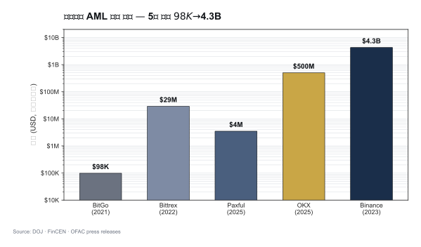

# 주요 Enforcement 사례 — 가상자산 AML 위반과 처벌

> 회사가 **큰 벌금 맞은 사례**에서 배우자. 이 글을 읽고 나면 "Binance $4.3B"가 왜 업계 분기점이 됐는지, CEO 개인 형사 책임이 왜 신규 표준이 됐는지 이해하게 됩니다. 마지막 업데이트: 2026-04-17.

## TL;DR
- 가상자산 AML enforcement 시대 본격 도래 (2020~)
- **Binance $4.3B (2023)** — 사상 최대, AML + 제재 결합
- **OKX $500M+ (2025)** — KYC 약함, 의심거래 처리 미흡
- **Paxful $3.5M FinCEN (2025)** — $500M 불법자금 처리
- 트렌드: **CCO·CEO 개인 책임 + 규모 거대화 + 제재 위반 결합**
- 한국 enforcement는 아직 적지만 검사 강화 중

---

## 1. 글로벌 Top Cases — 서사로 읽기




### Binance — $4.3B (2023-11)

**왜 이 사건이 상징적인가**: 가상자산 업계 **사상 최대 AML 벌금**이자 **CEO가 실제 실형**을 받은 첫 사건. 미국 DOJ + FinCEN + OFAC + CFTC의 **4개 기관 공동 합의**라는 점도 전례 없었습니다.

위반 내용:
- AML 프로그램 부재 (BSA 위반)
- KYC가 형식적
- **이란·북한·시리아·쿠바 사용자 차단 실패** (OFAC 제재 위반)

합의 결과:
- **벌금 $4.3B**
- **CZ(CEO) 사임 + 형사 유죄 + 4개월 실형**
- 5년 모니터십

**업계에 남긴 교훈**: "가상자산 회사가 크다고 해서 법 위에 있지 않다"는 명확한 시그널. 특히 **CEO 개인 실형**은 업계의 컴플라이언스 투자 의식을 한 단계 끌어올렸습니다. 이 사건 이후 글로벌 거래소들의 CCO·AMLO 인력 채용이 수직 상승.

### OKX — $500M+ (2024~2025)

- DOJ 합의
- 위반: 미신고 미국 운영, KYC 약함, 수십억 의심거래 처리
- 합의: 벌금 + 운영 조건 + 모니터링

**교훈**: Binance 이후에도 KYC가 형식적이면 의심거래를 잡지 못하고 대형 벌금으로 이어진다는 반복 증명. 또한 미국 시장에 공식 진출하지 않았다고 해서 미국 고객을 유치하면 미국 관할이 적용된다는 점 재확인.

### Paxful — $3.5M FinCEN (2025)

- P2P 가상자산 marketplace
- 위반: **고의적(willful) BSA 위반**, $500M 불법자금 처리, AML 프로그램 부적절, 제재국 사용자 처리
- 창립자 유죄 인정

**교훈**: **소형 P2P 사업자도 더 이상 안전지대가 없음**. "우리는 중간만 연결해주는 P2P"라는 변명은 규제당국이 더 이상 받아주지 않는다는 신호.

### Bittrex — $29M (2022)

- OFAC + FinCEN 결합
- 미국 거래소
- 제재국 사용자 + STR 미보고

### BitMEX — $100M (2020)

- KYC 미흡, AML 프로그램 부재
- **창립자들 형사 기소** (가택구금 실형)

### BitGo — $98K (2021)

- OFAC 제재 위반
- 작은 규모지만 **첫 가상자산 OFAC 합의** 사례

### 실무 포인트

5년간 이 사례들의 벌금 규모가 **$98K → $100M → $4.3B**로 천문학적 증가. 이 궤적이 보여주는 건 규제당국이 가상자산 산업을 "학습 중"에서 "본격 집행"으로 전환했다는 것. 2026년 이후 새로운 사건들의 벌금은 $4.3B 수준에서 출발할 가능성이 높습니다.

---

## 2. 트렌드 — 5가지 방향

### A. CCO·CEO 개인 책임 증가

- Binance CZ (4개월 실형)
- BitMEX 창립자들 (각 6개월 가택구금)
- Tornado Cash 개발자 Roman Storm (재판 중)
- Paxful 창립자 유죄 인정

→ **AMLO·CCO도 형사 책임 가능**한 구조로 굳어졌습니다.

### B. 규모 거대화

- 초기 $100K 수준 → 2023 Binance $4.3B
- 2025 OKX $500M+
- 시장 성숙 + 규제 본격화

### C. AML + 제재 결합 처벌

단순 KYC 위반이 이제는 AML + OFAC 결합 처벌로 나옵니다. 미국 OFAC 2차 제재의 위력은 **글로벌 거래소가 미국 룰을 따라야 하는 구조적 이유**이기도 합니다.

### D. 소형 사업자도 표적

Paxful 같은 P2P, BitGo 같은 기술 인프라도 표적. **모든 VASP가 컴플라이언스 비용을 직면**하는 시대.

### E. 사후 모니터링 (Monitorship)

합의 조건으로 외부 모니터 임명 → 수년간 운영 감시 + 보고서 제출. Binance는 5년 모니터십.

### 실무 포인트

5가지 트렌드 중 **E 모니터십**이 실무에 미치는 영향이 가장 큽니다. 합의로 끝나는 게 아니라 **수년간 외부 감독하에 운영**하는 것이고, 그동안 영업·IT·인사 의사결정이 모두 영향을 받습니다. "벌금 내고 끝"이라는 단순한 계산이 더 이상 성립하지 않는 시대.

---

## 3. 한국 Enforcement 사례

### 미신고 사업자 단속

- **2025-12-02 FIU 보도자료** — 미신고 가상자산 취급업자 단속 강화
- 외국 미신고 VASP의 한국 영업 차단
- 한국 거래소에 미신고 VASP 주소 차단 협조

### 거래소 형사 사례

- **서울남부지방법원 2024고단89** — 가상자산 관련 형사 사건
- 내용: 무신고 영업 등 (특금법 §17 적용)
- 5년 이하 징역 또는 5천만원 이하 벌금

### 시세조종 첫 사례 (가상자산이용자보호법)

- 2024-07 시행 후 첫 시세조종 형사 사건 누적 중
- 가상자산판 자본시장법 적용

### FIU 검사

- VASP 정기 검사 (주기 도래 시)
- 2026-01 특금법 개정으로 대주주까지 자격 심사

### 실무 포인트

한국은 아직 미국 수준의 거대 enforcement는 없지만, **2024-07 이용자보호법 시행 이후 본격 enforcement 축적 단계**에 진입했습니다. 2026~2028년 사이 한국에서도 **수백억원 규모 벌금 사례**가 나올 가능성이 높습니다. 업계는 미국 Binance 사례를 참고해 선제 대응하는 게 현명.

---

## 4. EU MiCA 시대 (2024-12-30~)

### 2026 active supervision 시작

- NCA(National Competent Authority)가 onboarding → 실효성 검사로 전환
- 첫 enforcement 사례 누적 중

### 예상 분야

- Travel Rule 미준수
- AMLR 시행 후 (2027) 직접 제재
- **AMLA 직접 감독** (대형사)

---

## 5. 위반 패턴 — 자주 등장하는 실수

```
1. KYC 형식적 — 신분증만 받고 검증 미흡
2. EDD 트리거 작동 안 함 — PEP·고위험국 자동화 부재
3. 거래 모니터링 룰 약함 — 알람 폭주 → 무시
4. STR 보고 지연 — 또는 누락
5. Tipping-off 위반 — 고객에게 STR 사실 노출
6. 제재 스크리닝 누락 — 특히 wallet 주소
7. AMLO 권한 부족 — 영업에 압도
8. 임직원 교육 부실
9. 정책 vs 실제 운영 괴리
10. 자료 보관 누락
```

### 실무 포인트

이 10개 패턴은 Binance·OKX·Paxful 합의문에서 실제로 지적된 항목들의 공통분모입니다. 회사가 자체 점검 시 이 10개를 연 1회 샘플 테스트하는 **"자기 모의 검사"** 가 효과적 예방책. 자기 회사에서 "이 항목이 어떻게 작동하는지 구체적 증거를 댈 수 있는가"가 기준.

---

## 6. 한국 사업자가 배워야 할 점

```
□ Binance 사례 — CEO·CCO 개인 형사 책임 가능
□ OKX 사례 — KYC가 형식적이면 의심거래 처리 못함
□ Paxful 사례 — 소형도 큰 벌금 가능
□ 미국 OFAC 2차 제재 — 한국 회사도 적용
□ 모니터십 — 위반 시 수년간 감시받음
□ 평판 리스크 — 벌금보다 평판이 더 큰 영향
□ 자진신고 (self-disclosure) — 적발 전 신고 시 감면
```

---

## 7. 사고 발생 시 회사 행동 — 시간축 SOP

### 즉시 (0~24시간)

1. 사실관계 확인 + 보존
2. AMLO + 법무 + CEO 공유
3. 추가 확산 차단 (계정 동결 등)
4. FIU + 감독당국 보고 검토

### 단기 (24시간~1주)

5. 외부 법무 자문 선임
6. 내부 조사
7. 자진 신고 검토 (감면)
8. 고객·시장 커뮤니케이션 (필요 시)

### 중기 (1주~)

9. 시정 계획 + 외부 감사
10. 재발방지책
11. 합의·소송 대응

### 장기

12. 모니터십 대응 (합의 조건)
13. 시스템·프로세스 개선
14. 임직원 교육 강화

### 실무 포인트

사고 발생 시 **"0~24시간"** 이 가장 중요합니다. 이 시간에 내린 결정(자진 신고 여부·공개 여부·계정 동결 범위)이 이후 합의 조건에 큰 영향을 미칩니다. 그래서 평시에 **사고 대응 SOP를 시나리오별로 작성**해두고, 담당 임원 모두가 인지하는 게 필수. 사고 난 후 처음 생각하는 건 이미 늦습니다.

---

## 8. 체크리스트 — 우리 회사가 이 사례들을 피하려면

```
□ AMLO에게 CEO 직접 보고 채널 부여
□ KYC 품질 정기 샘플 점검
□ EDD 트리거 자동화 (PEP·고위험국·거액·Wallet 노출)
□ KYT 룰 튜닝 (FP/FN 균형)
□ 제재 스크리닝 일일 배치
□ OFAC 2차 제재 인식 교육
□ 사고 대응 SOP 문서화 + 모의훈련
□ 외부 감사 연 1회
□ 이사회 분기 보고
□ 글로벌 enforcement 월간 모니터링
```

## 더 읽을거리
- [`lazarus-dprk.md`](lazarus-dprk.md) — DPRK 사례 (Bybit 등 피해자)
- [`tornado-cash.md`](tornado-cash.md) — DeFi 첫 제재 사례
- [`../2-regulations/us-bsa-fincen.md`](../2-regulations/us-bsa-fincen.md) — US enforcement 체계
- [`../5-compliance/internal-controls.md`](../5-compliance/internal-controls.md) — 내부통제
- [Akin — Paxful FinCEN action](https://www.akingump.com/en/insights/alerts/fincen-publishes-first-set-of-compliance-considerations-in-parallel-civil-and-doj-enforcement-actions-against-crypto-company-paxful)
- [Corporate Compliance Insights — DOJ·FinCEN VA platform AML](https://www.corporatecomplianceinsights.com/doj-fincen-resolution-virtual-asset-platform-aml-violations/)
- [법률신문 — 미신고 VASP FIU 단속 (2025-12)](https://m.lawtimes.co.kr)
