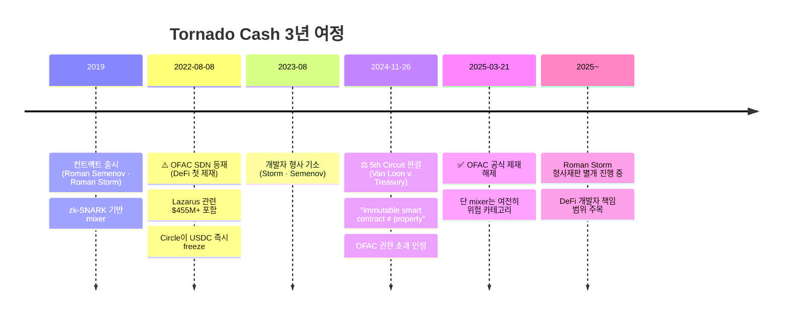

# Tornado Cash — DeFi 첫 OFAC 제재와 그 결말

> **코드를 제재할 수 있는가?** DeFi AML의 분기점이 된 사건. 이 글을 읽고 나면 Tornado Cash 타임라인(2022 제재 → 2024 판결 → 2025 해제 → Storm 재판)이 하나의 서사로 연결되고, 왜 이 사건이 "코드 제재"의 법적 한계를 확인한 판례가 됐는지 설명할 수 있게 됩니다. 마지막 업데이트: 2026-04-17.

## TL;DR
- **2022-08-08**: OFAC가 Tornado Cash 스마트컨트랙트 자체를 SDN List에 등재 (DeFi 첫 제재)
- 7B+ 달러 자금세탁 중 **Lazarus의 $455M+ 포함**
- **2024-11-26**: 5th Circuit 연방항소법원 — "OFAC 권한 초과, 컨트랙트는 'property' 아니다"
- **2025-03-21**: OFAC 공식 제재 해제
- 그러나 **개발자 Roman Storm 형사재판 별도 진행 중** (2024 기소)
- 의미: 코드 자체 제재의 법적 한계 + DeFi·스마트컨트랙트 컴플라이언스 미해결 과제

---

## 타임라인 — 한눈에



## 1. Tornado Cash란 — 기술부터 이해하기

### 정체성

Tornado Cash는 **이더리움 기반 mixer 스마트컨트랙트**로 2019년 Roman Semenov·Roman Storm이 개발했습니다. **zk-SNARK** 기반 영지식 증명을 사용해, 사용자가 풀에 입금한 이력을 드러내지 않고 출금할 수 있도록 설계됐습니다.

용어:
- **Mixer** — 여러 사용자 자금을 섞어 입출금 매핑을 끊는 서비스.
- **zk-SNARK** (Zero-Knowledge Succinct Non-interactive Argument of Knowledge) — "내가 어떤 사실을 안다는 것"만 증명하고, 그 사실 자체는 숨기는 암호 기법.
- **Immutable Smart Contract** — 한 번 배포되면 수정·삭제가 불가능한 스마트컨트랙트.

### 작동 방식

```
1. 사용자 A가 1 ETH를 Tornado pool에 입금
2. 입금 시 commitment 생성 (해시) — A만 알고 있음
3. 시간 지난 후 다른 wallet B로 인출 요청 + zk-SNARK 증명
4. 컨트랙트가 증명 검증 → B에게 1 ETH 출금
5. 온체인상 A→B 연결고리가 없음 (zk-SNARK가 익명성 보장)
```

### 사용 분포 — 합법 vs 불법의 논쟁

Tornado Cash의 사용은 합법(프라이버시 추구)과 불법(해킹 자금 세탁) 양쪽에 걸쳤고, 비율에 대한 논쟁이 제재 논의의 핵심이 됐습니다. OFAC 측은 **Lazarus만으로 $455M+ 사용**했음을 강조했고, 반대 측은 **합법 사용자도 다수**임을 지적. 이 양면성이 이후 법적 도전의 쟁점이 됐습니다.

### 실무 포인트

Tornado Cash 이해의 핵심은 **"개발자가 컨트랙트를 배포한 후에는 통제할 수 없다"** 는 속성. 일반 회사 서비스는 운영자가 중단·수정할 수 있지만, immutable smart contract는 배포 후 개발자가 죽어도 계속 작동. 이 기술적 속성이 법적 논쟁의 출발점입니다.

---

## 2. 2022-08-08 OFAC 제재

### 결정

미국 재무부 OFAC가 **Tornado Cash 스마트컨트랙트 주소를 SDN List에 등재**. 누적 $7B+ 자금세탁, 그중 **Lazarus 관련 $455M+** 포함(Ronin·Harmony 등). 미국인의 Tornado Cash 사용 금지.

### 즉각 영향

- **Circle (USDC 발행자) 즉시 Tornado 주소 USDC freeze** — 스테이블코인 발행자의 검열 권한이 현실화된 상징적 순간
- **Github가 Tornado Cash 저장소 일시 삭제** (이후 커뮤니티 반발로 재공개)
- DeFi 사용자들이 **자기 주소 freeze** 우려 — Vitalik Buterin이 Tornado로 기부받은 이력이 있다는 게 회자됨
- **개발자 Roman Storm + Roman Semenov 미국 형사 기소** (2023-08)
- 개발자 Alexey Pertsev 네덜란드 체포 (2022) → 2024 유죄 (이후 항소 중)

### 정당성 논쟁

**옹호 측**:
- Lazarus가 실제 사용했음, 효과적 제재
- 수억 달러 규모 자금세탁이 중단될 수 있음

**비판 측**:
- 코드·스마트컨트랙트는 "person"도 "property"도 아님
- 합법 사용자 무차별 처벌
- **표현의 자유 침해** (코드 = speech라는 전통적 논리)
- DeFi·오픈소스 미래에 위협

### 실무 포인트

이 논쟁의 실질적 쟁점은 "**제재 대상이 되는 것은 무엇인가**"입니다. 특정 인물(Semenov·Storm)이 아니라 특정 스마트컨트랙트 자체가 SDN에 올랐다는 것이 전례 없는 조치였고, 이게 법적 도전의 핵심 근거가 됐습니다.

---

## 3. 법적 도전과 판결

### Coin Center 등의 소송

Coin Center(암호화폐 정책 싱크탱크)와 Tornado 사용자들이 OFAC을 제소.
- 1심: OFAC 손
- 항소심으로 이어짐

### 5th Circuit 항소법원 (2024-11-26) — Van Loon v. Treasury

판결문 핵심: **"OFAC overstepped its congressionally defined authority"** (OFAC이 의회가 부여한 권한을 초과했다).

핵심 논리:
- **IEEPA (International Emergency Economic Powers Act)** 는 "property"에 적용되는 법
- **Immutable smart contract는 property로 볼 수 없음** — 소유권 개념이 성립 안 함
- 누구도 통제하지 않는 코드는 제재 대상으로 부적합

→ **OFAC 패소**.

### OFAC 제재 해제 (2025-03-21)

5th Circuit 판결 후 OFAC가 SDN에서 Tornado Cash 제거. 다만 성명에서는:
- "여전히 mixer는 위험하다"는 입장 유지
- **개별 거래·사용자 제재는 여전히 가능**

즉 "코드 자체는 제재 못 하지만, 그 코드를 쓰는 사람은 별개"라는 입장.

### Roman Storm 형사재판 (별도 진행)

**코드 제재가 무효화된 뒤에도 개발자 형사 책임은 별개**입니다. 죄목:
- 자금세탁 공모
- 무면허 송금업
- 제재 위반

2024~2025 재판 진행 중. 이 재판의 결과는 **DeFi 개발자 책임 범위**를 결정하는 역사적 판례가 될 것으로 예상.

### 실무 포인트

"코드는 제재 못 한다"가 결론처럼 보이지만, **"개발자·frontend 운영자·거버넌스 토큰 홀더는 책임 가능"** 이 함께 확인된 사건입니다. DeFi 프로토콜 개발 관점에서 **"내가 빌드하는 것이 범죄에 쓰이리라는 예견 가능성이 있는가"** 가 형사 리스크의 기준점이 됐습니다.

---

## 4. 컴플라이언스 임팩트

### 회사 차원

- 2022~2025 동안 Tornado 노출 wallet은 **자동 차단** 표준화
- 2025-03 제재 해제 후에도 **mixer는 위험 카테고리 유지**
- 회사 정책: "Tornado 노출 = 위험점수 +50" 같은 룰 그대로 존속

### 산업 차원

- **mixer 일반 = 고위험**이라는 인식 자리잡음
- 각 mixer마다 라벨링 + 자동 KYT 차단 표준
- 합법 사용자 보호 vs 자금세탁 차단의 딜레마는 여전 미해결

### DeFi 차원

- "코드 자체는 제재 못 한다"는 일부 안정감
- 그러나 **개발자 · frontend · governance token holder 책임 가능성** 확인
- DeFi 회사는 KYC·제재 체크를 추가하는 곳이 늘어남

### 실무 포인트

규제 해제가 **컴플라이언스 완화**를 의미하지 않는다는 게 중요합니다. 거래소·VASP는 Tornado Cash 노출을 여전히 위험 시그널로 취급하며, 이유는 **"법적으로 허용되어도 실제 자금은 대부분 해킹·불법 자금"** 이기 때문. 규제보다 현실적 판단이 리스크 관리의 본질.

---

## 5. 다른 Mixer의 운명

### 이 표를 어떻게 읽어야 하나

Tornado Cash 사건 전후로 전 세계 mixer들이 어떻게 정리됐는지. **운영자 식별이 가능한 mixer는 거의 다 폐쇄**됐고, 분산형(P2P·CoinJoin)만 살아남은 구조가 명확합니다.

| Mixer | 운명 |
|---|---|
| **Tornado Cash** | 2022 제재 → 2025 해제, 개발자 재판 중 |
| **Blender.io** | 2022-05 OFAC 제재 → 운영 중단 |
| **Sinbad.io** | 2023-11 OFAC 제재 (Blender 후신) |
| **Wasabi Wallet** | 운영 중, CoinJoin (분산형) |
| **Samourai Wallet** | 2024-04 운영자 체포, 서비스 중단 |
| **JoinMarket** | P2P CoinJoin, 운영 중 |
| **Cryptomixer** | 운영 중 |

### 실무 포인트

이 표가 보여주는 패턴: **중앙화 운영자가 있는 mixer = 정리 대상 / 순수 P2P CoinJoin = 법적 타깃팅 어려움**. 미래의 규제 방향은 P2P CoinJoin에 대해서도 "Samourai처럼 개발자를 표적"으로 가는 쪽일 가능성이 큽니다.

---

## 6. 한국 시점 — 우리는 어떻게

- 한국 거래소는 Tornado 노출 wallet **차단** 표준
- 가상자산이용자보호법 + 특금법으로 **mixer 사용 자체가 의심거래 → STR**
- 한국 사용자는 Tornado 사용 자체가 사실상 위험
- 2025-03 제재 해제 후에도 한국 정책 변화 없음

### 실무 포인트

한국 VASP는 OFAC이 제재를 해제했다고 해도 **자체적으로 mixer 차단을 유지**합니다. 이는 한국 감독당국이 "OFAC보다 보수적인 자체 기준"을 운영해도 된다는 시그널이기도 합니다. 글로벌 규제 변화에 맞춰 **자사 정책을 즉시 완화하는 것은 오히려 위험**한 접근.

---

## 7. 학습 포인트

```
- 코드를 제재할 수 있는가? 법적으로는 어렵다는 결론 (적어도 미국 IEEPA 한계)
- 그러나 개발자·frontend·governance는 별개 — 책임질 수 있다
- 회사 정책은 OFAC 제재와 별도로 mixer = 고위험 유지
- DeFi의 미래는 "탈중앙화 = AML 면책"이 아님이 분명해짐
- ZKP 기반 프라이버시 도구의 정당한 사용과 자금세탁 도구의 분리가 미해결 과제
```

## 더 읽을거리
- [`lazarus-dprk.md`](lazarus-dprk.md) — Tornado의 주요 사용자
- [`major-enforcement.md`](major-enforcement.md) — 관련 enforcement
- [`../3-crypto-aml/defi-nft-risks.md`](../3-crypto-aml/defi-nft-risks.md) — DeFi AML 회색지대
- [`../5-compliance/sanctions-screening.md`](../5-compliance/sanctions-screening.md) — OFAC 일반
- [Treasury — Tornado Cash 제재 보도자료 (2022)](https://home.treasury.gov/news/press-releases/jy0916)
- [Venable — Treasury Lifts Sanctions on Tornado (2025)](https://www.venable.com/insights/publications/2025/04/a-legal-whirlwind-settles-treasury-lifts-sanctions)
- [Sanction Scanner — Tornado Cash 분석](https://www.sanctionscanner.com/blog/tornado-cash-a-crypto-mixing-service-now-blacklisted-by-the-us-treasury-675)
- [BTC Policy Institute — Tornado 분석](https://www.btcpolicy.org/articles/tornado-cash-where-code-privacy-and-sanctions-collide)
- [Steptoe — Tornado Cash & DeFi AML 의의](https://www.steptoe.com/en/news-publications/critical-tornado-cash-developments-have-significant-implications-for-defi-aml-and-sanctions-compliance.html)
