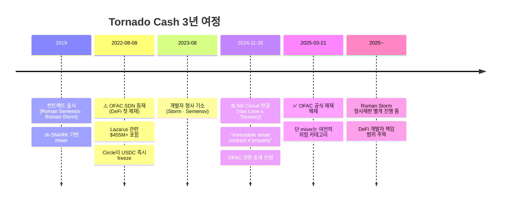
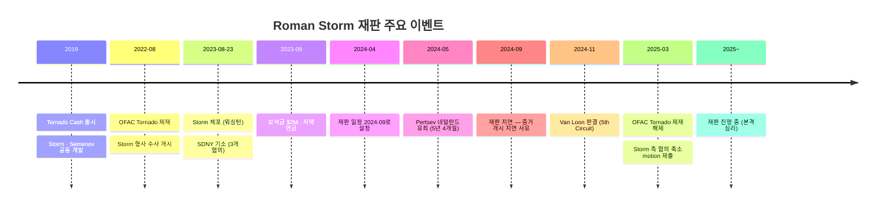

# Tornado Cash — DeFi 첫 OFAC 제재와 그 결말

> **코드를 제재할 수 있는가?** DeFi AML의 분기점이 된 사건. 이 글을 읽고 나면 Tornado Cash 타임라인(2022 제재 → 2024 판결 → 2025 해제 → Storm 재판)이 하나의 서사로 연결되고, 왜 이 사건이 "코드 제재"의 법적 한계를 확인한 판례가 됐는지 설명할 수 있게 됩니다. 마지막 업데이트: 2026-04-17.

## TL;DR
- **2022-08-08**: OFAC가 Tornado Cash 스마트컨트랙트 자체를 SDN List에 등재 (DeFi 첫 제재)
- 7B+ 달러 자금세탁 중 **Lazarus의 $455M+ 포함**
- **2024-11-26**: 5th Circuit 연방항소법원 — "OFAC 권한 초과, 컨트랙트는 'property' 아니다"
- **2025-03-21**: OFAC 공식 제재 해제
- 그러나 **개발자 Roman Storm 형사재판 별도 진행 중** (2024 기소)
- 의미: 코드 자체 제재의 법적 한계 + DeFi·스마트컨트랙트 컴플라이언스 미해결 과제

---

## 타임라인 — 한눈에



## 제재 해제 후 업계 대응 (2025-03-21 이후)

### 해제가 의미하는 것 / 의미하지 않는 것

**의미하는 것**:
- OFAC SDN 목록에서 Tornado Cash 7개 smart contract 주소 제거
- 미국 legal 관점에서 "Tornado 상호작용 자체"는 더 이상 제재 위반 아님
- 소프트웨어 개발·배포는 "1st Amendment로 보호받는 speech"라는 Van Loon 판결(2024-11) 추종

**의미하지 않는 것**:
- Tornado가 "안전한" 도구가 됐다는 것
- VASP가 Tornado 접촉 주소를 차단 해제해야 한다는 것
- Lazarus 등 제재 대상이 Tornado 경유 시 면책된다는 것 (OFAC 50% Rule 여전 적용)

### 주요 VASP 반응 조사 (2025-Q2~Q3)

| VASP | 대응 |
|---|---|
| Coinbase | "관찰" 라벨 하향, 2-hop 접촉 주소 EDD |
| Binance | 지역별 차등 — EU/US는 rejected list 유지 |
| 한국 4대 | DAXA 공동 가이드 2025-04: High-Risk 유지 |
| Kraken | "OFAC ≠ 내부 정책" 원칙 공식 선언 |
| Chainalysis | Tornado 라벨 "Mixing — Uncensored" 유지 |
| TRM Labs | "Privacy Enhancing Technology" 재분류 |

### Storm 재판 (2024~ 진행 중)

Alexey Pertsev (Tornado 공동 개발자) 네덜란드 2024 유죄 판결 이후, Roman Storm (미국 공동 개발자) 재판이 2025년 중 진행 중. 이 판결이 DeFi 개발자 책임의 국제 표준을 형성할 것으로 예상.

## 0-B. Roman Storm 재판 심화 — DeFi 개발자 형사 책임의 분기점

> Tornado Cash 사건이 "코드를 제재할 수 있는가"라면, Storm 재판은 "**코드를 만든 사람을 처벌할 수 있는가**"를 묻습니다. 2025년 내내 진행 중인 이 재판은 DeFi 개발자의 형사 책임 범위를 결정하는 역사적 판례가 될 것으로 업계 전문가들이 평가합니다.

### 핵심 사실 (스펙)

- **피고**: **Roman Storm** (미국 시민, Tornado Cash 공동 개발자)
- **공동 피고**: **Roman Semenov** (러시아 시민, 부재 중 — 러시아 거주 추정, 미국이 인도 청구)
- **혐의 3개**:
  1. **Conspiracy to commit money laundering** (자금세탁 공모) — 최대 **20년**
  2. **Conspiracy to operate an unlicensed money transmitting business** (무허가 송금업 공모) — 최대 **5년**
  3. **Conspiracy to violate IEEPA** (제재 위반 공모) — 최대 **20년**
- **최대 형량 합계**: ~**45년**
- **체포일**: **2023-08-23** (워싱턴 주 자택에서 FBI 체포)
- **기소**: **2023-08-23** 남부 뉴욕 연방법원 (SDNY), 사건번호 *U.S. v. Storm*
- **재판 일정**: 2024-09 시작 예정 → 절차 지연 후 **2025년 내 재판 진행 중**
- **DOJ 주장**: Tornado Cash를 통해 **$1B+ 자금세탁** — Lazarus·Ronin·Harmony 해킹 자금 포함

### 기소장의 핵심 주장 (DOJ Narrative)

DOJ는 단순히 "개발자가 코드를 배포했다"를 넘어 **Storm·Semenov가 능동적으로 Tornado Cash를 운영했다**고 주장합니다. 기소장 핵심 주장:

1. **운영 통제 존재**: Tornado smart contract는 immutable이지만 **frontend·relayer·UI·governance** 는 Storm·Semenov가 통제
2. **수익 수취**: TORN 토큰 배포 및 governance 통해 실제 **재정적 이익** 수령
3. **범죄 인지**: Lazarus·Ronin 자금이 유입될 때 **인지하면서도** KYC·제재 필터 추가 거부
4. **공지 거부**: OFAC 제재 대상 지적 이후에도 서비스 계속 운영
5. **세탁 규모 $1B+**: 7B 전체 중 $1B+가 명확히 범죄 수익

### 법적 쟁점 3개 — Storm 측 방어 vs DOJ 주장

#### 쟁점 1. 소프트웨어 개발 = "운영(operating) money transmitter"인가?

| 입장 | 주장 |
|---|---|
| Storm 측 | 코드는 **1st Amendment "speech"** — Bernstein v. DOJ (1999) 판례에 따라 암호학 코드 배포는 보호되는 표현 |
| DOJ | 단순 코드 배포가 아니라 **운영·유지보수·UI 제공·수익 수취**까지 — FinCEN 가이드라인상 "operator" 해당 |
| 업계 관찰 | DeFi 프로토콜 대부분이 유사 구조(코드 배포 + frontend 운영) — 판결이 **전체 DeFi 생태계에 파급** |

#### 쟁점 2. Open source contributor도 책임지는가?

- Storm은 **Tornado Cash의 주요 contributor 중 한 명** — 코드베이스의 대부분을 작성
- 그러나 다른 contributor도 다수 (GitHub 커밋 기록 공개)
- **문제**: 일반 오픈소스 기여자도 책임지면 **open source 전체에 chilling effect**
- Coin Center·EFF·Electronic Frontier Foundation 등이 **"minor contributor까지 책임지는 것은 위헌적"** 의견서(amicus brief) 제출

#### 쟁점 3. 실제 운영 통제(control)가 있는가?

- **smart contract 레벨**: Tornado는 **immutable** — Storm 본인도 수정 불가
- **그러나** frontend UI, relayer network, TORN governance, 공식 홍보 = Storm·Semenov 통제
- **DOJ 논리**: "contract immutability가 개발자 면책을 의미하지 않는다 — 주변부 운영이 여전히 존재"
- **Storm 논리**: "내가 한 일은 code publishing — 사용자 책임은 사용자의 것"

### Pertsev 선례 (네덜란드) — 미국 재판에 미치는 영향

#### Alexey Pertsev 사건 요약

- **Alexey Pertsev**: Tornado Cash 공동 개발자, 러시아 국적, 네덜란드 거주 중 체포
- **2022-08-10** 네덜란드 체포 — Tornado OFAC 제재 2일 후
- **2024-05-14 1심 유죄**: **5년 4개월 징역** — **DeFi 개발자 첫 형사 유죄 판결**
- 재판부 판시: "Tornado Cash는 compliance 기능을 갖출 수 있었음에도 고의로 갖추지 않았다" → **자금세탁 방조**
- **2024-06 항소 중**: 네덜란드 대법원 최종 판단 대기

#### 미국 Storm 재판에 미치는 영향

- Pertsev가 **유사 혐의로 이미 유죄** → 미국 배심원에 "DeFi 개발자도 유죄 가능" 심리적 선례 효과
- 다만 법역이 다름(네덜란드 vs 미국) → 직접 구속력 없음
- **Coin Center·EFF 측**: "네덜란드 판결은 미국 1st Amendment 보호 없이 나온 것" — 미국에선 다른 결론 가능
- **업계 평가**: Pertsev 유죄가 Storm 재판 장기 지연의 한 원인 — 양측 모두 판례 분석 시간 필요

### Van Loon 판결 (2024-11) — Storm 재판에 미친 영향

#### 판결 요약

- **Van Loon v. Department of the Treasury** (5th Circuit, 2024-11-26)
- 판시: **OFAC이 Tornado Cash smart contract을 "property"로 규정해 제재한 것은 IEEPA 권한 초과**
- 근거: immutable smart contract은 소유·통제 주체가 없어 "property" 개념 불성립 (IEEPA는 "property" 제재에 한정)
- 결과: **OFAC 2025-03-21 Tornado Cash 공식 제재 해제**

#### Storm 재판 3개 혐의별 영향

| 혐의 | Van Loon 영향 |
|---|---|
| 자금세탁 공모 (money laundering) | **영향 없음** — Van Loon은 제재 권한만 다룸, 자금세탁 혐의는 별개 (18 USC 1956) |
| 무허가 송금업 (unlicensed money transmitter) | **영향 없음** — 주법·연방법 기반, OFAC과 무관 |
| **IEEPA 제재 위반** | **중대한 약화** — smart contract 자체가 제재 대상이 아니라면, 그 제재 "위반"도 성립 어려움 |

#### 실질 결과

- DOJ는 Storm의 **IEEPA 혐의를 유지**하고 있으나, Van Loon 이후 **증명 부담이 크게 증가**
- 자금세탁·무허가 송금 혐의는 **여전히 강력** — 이 둘이 최종 유무죄를 가를 것
- 업계 관찰: "Van Loon은 Storm에게 '한 발'이지만 '완전한 승리'는 아님"

### 업계 영향 — DeFi 개발자 표준 형성 중

#### 형성 중인 새로운 표준

- **"개발자 형사 책임"** 개념이 DeFi 컴플라이언스 논의의 중심에 진입
- DeFi 프로토콜 개발 시 **"범죄 사용 예견 가능성" + "회피 가능한 통제 부재"** 가 형사 리스크의 기준
- **Open source 기여자 보호 운동**: Coin Center, Electronic Frontier Foundation(EFF), Blockchain Association 변호 지원
- GitHub·보안 커뮤니티에서 **"기여자 익명성"** 강화 움직임 (PGP 서명, pseudonym 커밋 등)

#### Amicus Brief 제출 현황 (2024~2025)

| 단체 | 입장 | 주요 주장 |
|---|---|---|
| Coin Center | Storm 지지 | 코드 = speech, open source chilling effect |
| Electronic Frontier Foundation | Storm 지지 | 1st Amendment 암호학 코드 보호 선례 |
| Blockchain Association | Storm 지지 | DeFi 혁신 저해 우려 |
| Paradigm | Storm 지지 | 기술 개발자 책임 범위 명확화 요구 |
| DOJ | 원고 | 운영 통제 존재 — 단순 code publishing 아님 |

### 한국 영향 — 한국 개발자의 법적 노출

한국 개발자가 글로벌 DeFi 프로젝트에 참여할 때 Storm 재판 결과는 직접 영향:

- **미국 시장 노출 시**: 미국 사용자 대상 frontend 운영·홍보 → **미국 법 관할** 가능성. Storm 유죄 시 한국 개발자도 유사 risk
- **GitHub 공개 기여**: 공개 기여 자체는 여전히 speech로 보호 가능성 높음. 그러나 **운영·수익 수취 가세 시** 책임 가능
- **법률 자문 필수**: 2025년 이후 한국 DeFi 프로젝트의 **사전 법률 자문** 관행 확립 — 미국·EU 법제 스크리닝
- **DAXA 공동 가이드 (2025-04)**: 한국 거래소가 DeFi 프로토콜 지원 시 "개발자 형사 리스크" 평가 권고
- **한국 내 DeFi 프로젝트**: 특금법 / 가상자산이용자보호법 준수 외에도 미국 OFAC·BSA 선제 검토 관행

### 재판 시나리오별 산업 파급 (2025~)

| 시나리오 | 업계 파급 |
|---|---|
| Storm **전부 유죄** (45년 최대) | DeFi 개발 **심각한 chilling effect**, 개발자 미국 이탈, 전통 금융화 가속 |
| Storm **부분 유죄** (자금세탁만) | "코드는 speech, 운영은 책임" 절충 — 현재 가장 가능성 높은 시나리오 |
| Storm **무죄** | DeFi 개발자 **제한적 해방**, 그러나 frontend·수익 수취자 책임은 별도로 규명 지속 |
| **배심원 무효재판** (hung jury) | 재재판 → 장기 불확실성 지속, 2026~2027 판결 지연 |

### 실무 포인트 — 한국 DeFi/VASP 담당자 체크리스트

Storm 재판 결과 대기 중이라도 지금 할 수 있는 준비:

1. **회사 운영 DeFi 프로토콜 점검**: frontend·relayer·governance 중 어디까지 회사가 통제하는가 명확히
2. **compliance 기능 내장 가능성**: Pertsev 재판부가 "compliance 가능했는데 안 함"을 유죄 근거로 제시 — 선제적 KYC·제재 필터 추가 검토
3. **한국 개발자 고용 계약**: 회사와 개인 개발자 책임 범위 계약상 명시 (indemnification 조항)
4. **오픈소스 기여 정책**: 직원의 외부 DeFi 프로토콜 기여에 관한 사전 신고·법무 검토 절차
5. **제재 스크리닝**: 미국 OFAC SDN은 자사 DeFi 사용자에게도 적용 가능성 — 선제 구현

### Storm 재판 타임라인 상세



### 증거 쟁점 — "Storm이 무엇을 알았는가"

DOJ의 자금세탁 공모 혐의 성립 핵심은 **Storm이 범죄 자금을 "알면서도" 처리 허용**했는지:

- **Ronin 해킹 (2022-03-23)**: 이틀 뒤 Lazarus 자금이 Tornado에 유입 — 공개 보도로 널리 알려짐
- **Harmony 해킹 (2022-06-24)**: 동일 패턴 반복
- **DOJ 주장**: Storm이 이를 알고 있었고, 여러 compliance 기능을 추가할 수 있었음에도 거부
- **증거**: Storm의 Twitter·Discord·이메일 로그 — DOJ가 디지털 증거로 제출
- **Storm 측 반박**: "smart contract은 immutable — 내가 막을 방법 없었다" (기술적 limitation 주장)

**핵심 쟁점**: Storm이 **frontend에 OFAC SDN 스크리닝을 추가**할 수 있었는지. DOJ는 "할 수 있었는데 안 했다"를, Storm 측은 "frontend 차단은 VPN으로 우회 가능, 실효 없다"를 주장.

### 변호 전략 — Storm 측 주요 논점

Storm 변호인단(Brian Klein, Waymaker LLP 등)은 다음 논점으로 방어:

1. **1st Amendment "코드 = speech" 보호**
   - Bernstein v. DOJ (1999) 선례: 암호학 코드 배포는 보호되는 표현
   - Junger v. Daley (2000) 선례: 소프트웨어 소스 코드도 speech 범주
   - 적용: Tornado Cash 코드 배포 = Storm의 표현 활동

2. **"Money Transmitter" 정의 부적합**
   - FinCEN 2013 가이드라인: "money transmitter"는 **자금 보관·이전 통제** 전제
   - Tornado: 사용자가 직접 smart contract과 상호작용, Storm은 자금을 보유·통제하지 않음
   - Storm의 역할은 **프로토콜 설계**에 불과

3. **IEEPA 제재 위반 — Van Loon 판결 원용**
   - Van Loon 판결: smart contract = property 아님 → 제재 불가
   - 논리적 귀결: 제재 불가한 대상에 대한 "제재 위반"도 성립 불가
   - 최소한 **IEEPA 혐의 기각 motion** 제출

4. **Mens rea (범죄 의도) 부재**
   - 자금세탁 공모는 **"알면서(knowingly)"** 를 요건으로 함
   - Storm은 프라이버시 도구로 개발한 것 — 자금세탁 의도 부재
   - Lazarus 자금 유입은 **예견하기 어려웠음**

### DOJ 대응 전략

DOJ(남부 뉴욕 연방 검찰 Damian Williams 팀)는 다음 반박 구조:

1. **"Speech vs Conduct"**: 코드 배포는 speech, 그러나 **지속적 운영·수익 수취는 conduct** — 후자는 보호 대상 아님
2. **FinCEN 2019 가이드라인**: "anonymous enhanced coin (AEC)" 서비스는 money transmitter 범주 포함
3. **Van Loon 우회**: 자금세탁·송금업 혐의는 IEEPA와 독립 — Van Loon이 해당 혐의에 영향 없음
4. **증거로 의도 입증**: Storm의 내부 대화·Twitter 게시물에서 **범죄 자금 인지**를 보여주는 스모킹건 제시

### 배심원 선정 — 기술적 난해성 관리

Storm 재판의 숨은 도전은 **배심원 기술 이해**:

- Tornado의 zk-SNARK·immutable smart contract·DeFi 개념 이해 필요
- 일반 시민 배심원이 이해 어려움 → 양측 모두 **전문가 증인** 대거 기용 예정
- 검찰 측 예상 증인: FBI 블록체인 분석관, Chainalysis 전문가, FinCEN 전직 관료
- 변호 측 예상 증인: MIT 암호학 교수, 오픈소스 법학자, DeFi 프로토콜 개발자 (Paradigm 등)

### 업계의 Chilling Effect — 이미 나타나는 영향

Storm 재판 **결과 전에도** DeFi 업계에 영향:

- **개발자 위치 이동**: 미국 시민·거주 DeFi 개발자 일부가 **싱가포르·두바이·포르투갈**로 이주
- **익명 개발 증가**: GitHub pseudonym 커밋, 개발자 ID 공개 기피 현상 증가
- **compliance-by-design**: 새 DeFi 프로토콜이 **사전에 KYC·제재 필터 내장** — Tornado 사건 "교훈"
- **투자 위축**: 벤처 캐피털이 개인 개발자 creator 중심 프로젝트 투자 신중 — 법인 중심 프로젝트 선호
- **보험 상품 출현**: 개발자 형사 변호 보험 — Nexus Mutual·Coincover 등이 신상품 출시

### 재판 시나리오별 DeFi 업계 파급

| 시나리오 | 확률 추정 | 업계 파급 |
|---|---|---|
| Storm **전부 유죄** (45년 최대) | ~15% | DeFi 개발 **심각한 chilling effect**, 개발자 미국 이탈, 전통 금융화 가속 |
| Storm **부분 유죄** (자금세탁·송금업) | ~45% | "코드는 speech, 운영은 책임" 절충 — 현재 가장 가능성 높은 시나리오, 5~10년 형량 |
| Storm **일부 혐의만 유죄** (송금업만) | ~20% | 경미한 처벌, compliance 구현 의무 표준화 계기 |
| Storm **무죄** | ~10% | DeFi 개발자 **제한적 해방**, frontend·수익 수취자 책임은 별도 지속 |
| **배심원 무효재판** (hung jury) | ~10% | 재재판 → 장기 불확실성 지속, 2026~2027 판결 지연 |

### 실무 포인트 — 한국 DeFi/VASP 담당자 체크리스트

Storm 재판 결과 대기 중이라도 지금 할 수 있는 준비:

1. **회사 운영 DeFi 프로토콜 점검**: frontend·relayer·governance 중 어디까지 회사가 통제하는가 명확히
2. **compliance 기능 내장 가능성**: Pertsev 재판부가 "compliance 가능했는데 안 함"을 유죄 근거로 제시 — 선제적 KYC·제재 필터 추가 검토
3. **한국 개발자 고용 계약**: 회사와 개인 개발자 책임 범위 계약상 명시 (indemnification 조항)
4. **오픈소스 기여 정책**: 직원의 외부 DeFi 프로토콜 기여에 관한 사전 신고·법무 검토 절차
5. **제재 스크리닝**: 미국 OFAC SDN은 자사 DeFi 사용자에게도 적용 가능성 — 선제 구현
6. **frontend 지역 차단**: 미국 IP·한국 IP에서 일부 DeFi 서비스 접속 차단 구현 검토
7. **개발자 법률 자문**: 프로토콜 배포 전 미국 변호사 자문 — 특히 미국 사용자 대상 홍보 시

### 1차 자료

- [DOJ 기소장 2023-08-23 (SDNY) — Tornado Cash 공동창업자 기소](https://www.justice.gov/usao-sdny/pr/tornado-cash-co-founders-charged-money-laundering-and-sanctions-violations)
- [Coin Center Storm 재판 분석·Amicus Brief](https://www.coincenter.org/)
- [EFF Tornado Cash 변호 입장](https://www.eff.org/)
- [Van Loon v. Treasury 판결문 (5th Circuit)](https://www.ca5.uscourts.gov/opinions/pub/23/23-50669-CV0.pdf)
- [Netherlands Pertsev 판결 — 2024-05 (영문 요약)](https://www.coincenter.org/pertsev-verdict-analysis/)
- [FinCEN 2019 가이드라인 — CVC 관련 Money Transmission](https://www.fincen.gov/sites/default/files/2019-05/FinCEN%20Guidance%20CVC%20FINAL%20508.pdf)
- [Bernstein v. DOJ (1999) — 암호학 코드 speech 판례](https://h2o.law.harvard.edu/cases/3611)
- [Paradigm — Storm 재판 Amicus 의견서 (2024)](https://www.paradigm.xyz/policy/)

---

## 1. Tornado Cash란 — 기술부터 이해하기

### 정체성

Tornado Cash는 **이더리움 기반 mixer 스마트컨트랙트**로 2019년 Roman Semenov·Roman Storm이 개발했습니다. **zk-SNARK** 기반 영지식 증명을 사용해, 사용자가 풀에 입금한 이력을 드러내지 않고 출금할 수 있도록 설계됐습니다.

용어:
- **Mixer** — 여러 사용자 자금을 섞어 입출금 매핑을 끊는 서비스.
- **zk-SNARK** (Zero-Knowledge Succinct Non-interactive Argument of Knowledge) — "내가 어떤 사실을 안다는 것"만 증명하고, 그 사실 자체는 숨기는 암호 기법.
- **Immutable Smart Contract** — 한 번 배포되면 수정·삭제가 불가능한 스마트컨트랙트.

### 작동 방식

```
1. 사용자 A가 1 ETH를 Tornado pool에 입금
2. 입금 시 commitment 생성 (해시) — A만 알고 있음
3. 시간 지난 후 다른 wallet B로 인출 요청 + zk-SNARK 증명
4. 컨트랙트가 증명 검증 → B에게 1 ETH 출금
5. 온체인상 A→B 연결고리가 없음 (zk-SNARK가 익명성 보장)
```

### 사용 분포 — 합법 vs 불법의 논쟁

Tornado Cash의 사용은 합법(프라이버시 추구)과 불법(해킹 자금 세탁) 양쪽에 걸쳤고, 비율에 대한 논쟁이 제재 논의의 핵심이 됐습니다. OFAC 측은 **Lazarus만으로 $455M+ 사용**했음을 강조했고, 반대 측은 **합법 사용자도 다수**임을 지적. 이 양면성이 이후 법적 도전의 쟁점이 됐습니다.

### 실무 포인트

Tornado Cash 이해의 핵심은 **"개발자가 컨트랙트를 배포한 후에는 통제할 수 없다"** 는 속성. 일반 회사 서비스는 운영자가 중단·수정할 수 있지만, immutable smart contract는 배포 후 개발자가 죽어도 계속 작동. 이 기술적 속성이 법적 논쟁의 출발점입니다.

---

## 2. 2022-08-08 OFAC 제재

### 결정

미국 재무부 OFAC가 **Tornado Cash 스마트컨트랙트 주소를 SDN List에 등재**. 누적 $7B+ 자금세탁, 그중 **Lazarus 관련 $455M+** 포함(Ronin·Harmony 등). 미국인의 Tornado Cash 사용 금지.

### 즉각 영향

- **Circle (USDC 발행자) 즉시 Tornado 주소 USDC freeze** — 스테이블코인 발행자의 검열 권한이 현실화된 상징적 순간
- **Github가 Tornado Cash 저장소 일시 삭제** (이후 커뮤니티 반발로 재공개)
- DeFi 사용자들이 **자기 주소 freeze** 우려 — Vitalik Buterin이 Tornado로 기부받은 이력이 있다는 게 회자됨
- **개발자 Roman Storm + Roman Semenov 미국 형사 기소** (2023-08)
- 개발자 Alexey Pertsev 네덜란드 체포 (2022) → 2024 유죄 (이후 항소 중)

### 정당성 논쟁

**옹호 측**:
- Lazarus가 실제 사용했음, 효과적 제재
- 수억 달러 규모 자금세탁이 중단될 수 있음

**비판 측**:
- 코드·스마트컨트랙트는 "person"도 "property"도 아님
- 합법 사용자 무차별 처벌
- **표현의 자유 침해** (코드 = speech라는 전통적 논리)
- DeFi·오픈소스 미래에 위협

### 실무 포인트

이 논쟁의 실질적 쟁점은 "**제재 대상이 되는 것은 무엇인가**"입니다. 특정 인물(Semenov·Storm)이 아니라 특정 스마트컨트랙트 자체가 SDN에 올랐다는 것이 전례 없는 조치였고, 이게 법적 도전의 핵심 근거가 됐습니다.

---

## 3. 법적 도전과 판결

### Coin Center 등의 소송

Coin Center(암호화폐 정책 싱크탱크)와 Tornado 사용자들이 OFAC을 제소.
- 1심: OFAC 손
- 항소심으로 이어짐

### 5th Circuit 항소법원 (2024-11-26) — Van Loon v. Treasury

판결문 핵심: **"OFAC overstepped its congressionally defined authority"** (OFAC이 의회가 부여한 권한을 초과했다).

핵심 논리:
- **IEEPA (International Emergency Economic Powers Act)** 는 "property"에 적용되는 법
- **Immutable smart contract는 property로 볼 수 없음** — 소유권 개념이 성립 안 함
- 누구도 통제하지 않는 코드는 제재 대상으로 부적합

→ **OFAC 패소**.

### OFAC 제재 해제 (2025-03-21)

5th Circuit 판결 후 OFAC가 SDN에서 Tornado Cash 제거. 다만 성명에서는:
- "여전히 mixer는 위험하다"는 입장 유지
- **개별 거래·사용자 제재는 여전히 가능**

즉 "코드 자체는 제재 못 하지만, 그 코드를 쓰는 사람은 별개"라는 입장.

### Roman Storm 형사재판 (별도 진행)

**코드 제재가 무효화된 뒤에도 개발자 형사 책임은 별개**입니다. 죄목:
- 자금세탁 공모
- 무면허 송금업
- 제재 위반

2024~2025 재판 진행 중. 이 재판의 결과는 **DeFi 개발자 책임 범위**를 결정하는 역사적 판례가 될 것으로 예상.

### 실무 포인트

"코드는 제재 못 한다"가 결론처럼 보이지만, **"개발자·frontend 운영자·거버넌스 토큰 홀더는 책임 가능"** 이 함께 확인된 사건입니다. DeFi 프로토콜 개발 관점에서 **"내가 빌드하는 것이 범죄에 쓰이리라는 예견 가능성이 있는가"** 가 형사 리스크의 기준점이 됐습니다.

---

## 4. 컴플라이언스 임팩트

### 회사 차원

- 2022~2025 동안 Tornado 노출 wallet은 **자동 차단** 표준화
- 2025-03 제재 해제 후에도 **mixer는 위험 카테고리 유지**
- 회사 정책: "Tornado 노출 = 위험점수 +50" 같은 룰 그대로 존속

### 산업 차원

- **mixer 일반 = 고위험**이라는 인식 자리잡음
- 각 mixer마다 라벨링 + 자동 KYT 차단 표준
- 합법 사용자 보호 vs 자금세탁 차단의 딜레마는 여전 미해결

### DeFi 차원

- "코드 자체는 제재 못 한다"는 일부 안정감
- 그러나 **개발자 · frontend · governance token holder 책임 가능성** 확인
- DeFi 회사는 KYC·제재 체크를 추가하는 곳이 늘어남

### 실무 포인트

규제 해제가 **컴플라이언스 완화**를 의미하지 않는다는 게 중요합니다. 거래소·VASP는 Tornado Cash 노출을 여전히 위험 시그널로 취급하며, 이유는 **"법적으로 허용되어도 실제 자금은 대부분 해킹·불법 자금"** 이기 때문. 규제보다 현실적 판단이 리스크 관리의 본질.

---

## 5. 다른 Mixer의 운명

### 이 표를 어떻게 읽어야 하나

Tornado Cash 사건 전후로 전 세계 mixer들이 어떻게 정리됐는지. **운영자 식별이 가능한 mixer는 거의 다 폐쇄**됐고, 분산형(P2P·CoinJoin)만 살아남은 구조가 명확합니다.

| Mixer | 운명 |
|---|---|
| **Tornado Cash** | 2022 제재 → 2025 해제, 개발자 재판 중 |
| **Blender.io** | 2022-05 OFAC 제재 → 운영 중단 |
| **Sinbad.io** | 2023-11 OFAC 제재 (Blender 후신) |
| **Wasabi Wallet** | 운영 중, CoinJoin (분산형) |
| **Samourai Wallet** | 2024-04 운영자 체포, 서비스 중단 |
| **JoinMarket** | P2P CoinJoin, 운영 중 |
| **Cryptomixer** | 운영 중 |

### 실무 포인트

이 표가 보여주는 패턴: **중앙화 운영자가 있는 mixer = 정리 대상 / 순수 P2P CoinJoin = 법적 타깃팅 어려움**. 미래의 규제 방향은 P2P CoinJoin에 대해서도 "Samourai처럼 개발자를 표적"으로 가는 쪽일 가능성이 큽니다.

---

## 6. 한국 시점 — 우리는 어떻게

- 한국 거래소는 Tornado 노출 wallet **차단** 표준
- 가상자산이용자보호법 + 특금법으로 **mixer 사용 자체가 의심거래 → STR**
- 한국 사용자는 Tornado 사용 자체가 사실상 위험
- 2025-03 제재 해제 후에도 한국 정책 변화 없음

### 실무 포인트

한국 VASP는 OFAC이 제재를 해제했다고 해도 **자체적으로 mixer 차단을 유지**합니다. 이는 한국 감독당국이 "OFAC보다 보수적인 자체 기준"을 운영해도 된다는 시그널이기도 합니다. 글로벌 규제 변화에 맞춰 **자사 정책을 즉시 완화하는 것은 오히려 위험**한 접근.

---

## 7. 학습 포인트

```
- 코드를 제재할 수 있는가? 법적으로는 어렵다는 결론 (적어도 미국 IEEPA 한계)
- 그러나 개발자·frontend·governance는 별개 — 책임질 수 있다
- 회사 정책은 OFAC 제재와 별도로 mixer = 고위험 유지
- DeFi의 미래는 "탈중앙화 = AML 면책"이 아님이 분명해짐
- ZKP 기반 프라이버시 도구의 정당한 사용과 자금세탁 도구의 분리가 미해결 과제
```

## 💼 실무 현장 (Industry Reality)

### 사건 이후 VASP들이 Tornado 주소를 어떻게 처리하는가

**OFAC 제재 기간 (2022-08 ~ 2025-03)**:
- 전 세계 주요 거래소 **자동 차단** 100% 표준
- Chainalysis KYT: `SANCTIONS_TORNADO` 태그 자동 배포
- Circle USDC **즉시 freeze** — 스테이블코인 검열 권한 첫 사례
- Github 저장소 일시 삭제 → 커뮤니티 반발로 재공개

**제재 해제 후 (2025-03~)**:

| VASP | 정책 변화 |
|---|---|
| Coinbase | 기존 차단 정책 유지 — "위험 카테고리" 분류 |
| Kraken | 기존 차단 정책 유지 |
| Binance | 노출 시 **수동 심사** (완화 but 미허용) |
| Upbit·Bithumb·Coinone·Korbit | 모두 **차단 정책 유지** — DAXA 공동 |
| Circle USDC | 개별 freeze 해제했으나 **선제적 모니터링 지속** |

### Tornado 노출 탐지 실제 룰 (2026-Q1 한국 VASP)

```python
def tornado_exposure(wallet):
    exp = chainalysis.exposure(wallet, hops=5)
    # 제재 해제되었어도 위험 카테고리 유지
    tornado_direct = exp.get("TORNADO_CASH_DIRECT", 0)
    tornado_1hop = exp.get("TORNADO_CASH_1HOP", 0)
    tornado_2hop = exp.get("TORNADO_CASH_2HOP", 0)
    
    if tornado_direct > 0:
        return "CRITICAL", "자동 차단 + STR 검토"
    if tornado_1hop > 0.1 * wallet.balance:
        return "HIGH", "EDD + 자금원천 요청"
    if tornado_2hop > 0:
        return "MEDIUM", "분석가 리뷰"
    return None
```

### 2025-03 해제에 대한 업계 반응 조사

**컴플라이언스 책임자 다수 입장**:
- "법적 제재는 풀렸지만 **실제 자금의 대부분이 해킹·불법 자금**이라는 본질이 바뀌지 않음"
- "우리 고객이 합법 프라이버시 이유로 Tornado를 써야 한다면 **증빙 요구** 가능"
- "규제가 완화됐다고 회사 정책을 자동 완화하면 **FN 리스크가 회사 책임**으로 돌아옴"

### DeFi 개발자 형사 책임 — Roman Storm 재판 주목

- **2023-08 기소**: 자금세탁 공모·무면허 송금업·제재 위반
- **2024~2025 재판**: 배심원 평결, 최대 45년 가능
- **함의**: DeFi 프로토콜 개발자가 "예견 가능한 범죄 사용"을 방치하면 형사 책임 가능
- **Alexey Pertsev**: 네덜란드에서 이미 5년 4개월 유죄(2024-05, 항소 중)

**한국 개발자들의 학습**: 오픈소스 기여·DeFi 프론트엔드 운영 시 KYC·제재 스크리닝 구현 필요성 부상. 일부 한국 DeFi 프로젝트는 2025년 이후 frontend에 **IP 기반 지역 차단** 추가.

### 한국 VASP의 실제 Tornado 케이스 처리 경험

- **직접 노출**: 거의 드묾 (즉시 차단)
- **2-3 hop 노출**: 월 수십 건, 대부분 합법적 DeFi 사용에서 연결
- **신규 가입자 프로필 리스크**: Tornado 사용 이력 있는 지갑으로 가입 시도 시 **자동 거부** 정책 (4대 거래소 공통)

### 자주 나오는 오해

- **"제재 해제됐으니 Tornado 써도 됨"** — 한국 VASP는 **자체 정책으로 차단 유지**. 고객이 써도 자사가 거부.
- **"Mixer 사용은 프라이버시 권리"** — 합법 사용자도 있지만 실제 자금의 대부분은 해킹·랜섬웨어. KYT는 통계 기반 판단.
- **"코드 제재는 끝났음"** — Tornado 해제됐지만 **Blender·Sinbad는 여전 SDN**. 개별 mixer별 판단 필요.
- **"개발자만 조심하면 됨"** — Frontend 운영자·거버넌스 토큰 대량 보유자도 책임 가능. DAO 참여 신중.

### 한국 특수 현실

- **DAXA 공동 정책**: 4대 거래소 모두 Tornado 차단 유지. 한 곳만 완화 불가.
- **특금법 의심거래**: 한국에서 Tornado 사용 자체가 **STR 후보 사유**로 해석. 이는 OFAC과 별개.
- **국내 DeFi 프로젝트**: 한국 내 DeFi 프로젝트가 Tornado 유사 서비스 빌드 시 **사전 법률 자문 필수**. Roman Storm 재판 결과가 가이드.
- **Vitalik 기부 일화**: Tornado에서 기부받은 우크라이나 관련 자금이 Vitalik 주소로 간 사례 — 한국 커뮤니티도 "무차별 차단 vs 선별"의 딜레마 인식 확산.

---

## 더 읽을거리
- [`lazarus-dprk.md`](lazarus-dprk.md) — Tornado의 주요 사용자
- [`major-enforcement.md`](major-enforcement.md) — 관련 enforcement
- [`../3-crypto-aml/defi-nft-risks.md`](../3-crypto-aml/defi-nft-risks.md) — DeFi AML 회색지대
- [`../5-compliance/sanctions-screening.md`](../5-compliance/sanctions-screening.md) — OFAC 일반
- [Treasury — Tornado Cash 제재 보도자료 (2022)](https://home.treasury.gov/news/press-releases/jy0916)
- [Venable — Treasury Lifts Sanctions on Tornado (2025)](https://www.venable.com/insights/publications/2025/04/a-legal-whirlwind-settles-treasury-lifts-sanctions)
- [Sanction Scanner — Tornado Cash 분석](https://www.sanctionscanner.com/blog/tornado-cash-a-crypto-mixing-service-now-blacklisted-by-the-us-treasury-675)
- [BTC Policy Institute — Tornado 분석](https://www.btcpolicy.org/articles/tornado-cash-where-code-privacy-and-sanctions-collide)
- [Steptoe — Tornado Cash & DeFi AML 의의](https://www.steptoe.com/en/news-publications/critical-tornado-cash-developments-have-significant-implications-for-defi-aml-and-sanctions-compliance.html)
