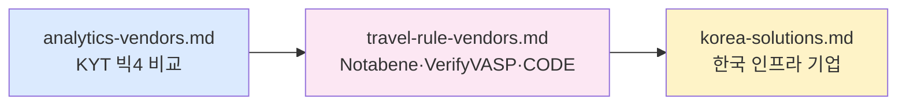

# 7️⃣ Vendors — 시장 지도

> **벤더 선정은 AML 프로그램의 80%**. 이 폴더는 KYT·Travel Rule·한국 인프라 벤더의 시장 구조를 지도로 그립니다. 마지막 업데이트: 2026-04-20.

## 누가 먼저 읽어야 하나

- 🛒 **벤더 선정**을 주도하는 PM·AMLO·컴플라이언스 책임자 (PoC 체크리스트 필요)
- 🏗️ 신규 VASP 라이선스·ISMS 인증 준비 중인 창업팀 (처음부터 뭘 사야 하나)
- 📈 투자자·애널리스트 — Chainalysis·Elliptic·Notabene·VerifyVASP 시장 포지션 이해

## 읽는 순서

## 파일 인덱스

| # | 파일 | 다루는 시장 | 핵심 판단 |
|---|---|---|---|
| 1 | [`analytics-vendors.md`](analytics-vendors.md) | Chainalysis · Elliptic · TRM · Crystal · Merkle Science | 글로벌 4사 중 하나는 사실상 필수. PoC 비교 기준 |
| 2 | [`travel-rule-vendors.md`](travel-rule-vendors.md) | 컨소시엄(VerifyVASP·CODE·Sygna) vs SaaS(Notabene) vs 분산형(TRISA·TRP) | 한국은 VerifyVASP·CODE·Notabene 3개가 사실상 전부 |
| 3 | [`korea-solutions.md`](korea-solutions.md) | 한국 특수 인프라 — 본인확인기관·ARGOS·코인플러그·람다256·DAXA | 신규 한국 VASP가 처음부터 연동해야 하는 업체 지도 |
| 4 | [`vendor-benchmark.md`](vendor-benchmark.md) | KYT·TR·KYC 12개 벤더의 FP rate·Latency·비용·한국 지원 정량 비교 + PoC 12주 체크리스트 | 벤더 선정·계약·예산 |

## 핵심 출구

- KYT 빅4 비교: Chainalysis(라벨) vs Elliptic(유럽) vs TRM(신흥) vs Crystal(러시아·LATAM)
- Travel Rule 3모델의 본질적 차이 (컨소시엄·SaaS·분산형)
- "VerifyVASP 가입? CODE 가입? 둘 다? Notabene 먼저?" — 신규 VASP 단계 전략
- PoC 체크리스트 10항목(카운터파티 호환·IVMS101 정확도·p99 응답·Sunrise 정책 등)

## 가격 감각

- KYT 소규모: $30K~$80K / 중형: $150K~$400K / 대형 거래소: $500K~$1M+
- Travel Rule 소규모: $20K~$50K + 트랜잭션당 $0.10 / 대규모: $500K+
- 컨소시엄 가입비는 회원사 협의 — 자료 공개 X

## 다음 단계

- 기술 원리(왜 Attribution이 고비용인가) → [`../4-technology/blockchain-analytics.md`](../4-technology/blockchain-analytics.md)
- 메시징 프로토콜 기술 비교 → [`../4-technology/travel-rule-protocols.md`](../4-technology/travel-rule-protocols.md)
- 한국 규제 맥락 → [`../2-regulations/korea-fiu-act.md`](../2-regulations/korea-fiu-act.md)
- 상위 인덱스 → [`../README.md`](../README.md)
