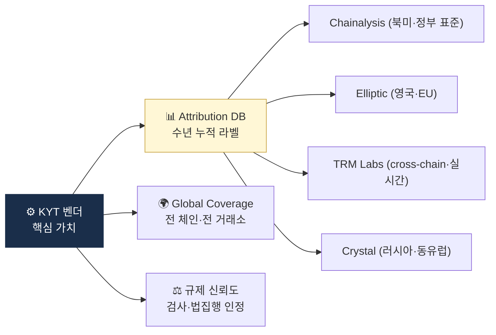

# Blockchain Analytics 벤더 — 시장 지도

> Chainalysis · Elliptic · TRM Labs · Crystal · Merkle Science 비교. 이 글을 읽고 나면 "왜 한국 회사도 글로벌 4사 중 하나는 거의 필수로 써야 하는가", 그리고 PoC에서 무엇을 비교해야 하는지를 판단할 수 있게 됩니다. 마지막 업데이트: 2026-04-17.

## TL;DR
- 글로벌 4대: **Chainalysis (시장 표준)** / **Elliptic (컴플라이언스 강세)** / **TRM Labs (cross-chain·실시간 강세)** / **Crystal Intelligence (러시아·동유럽 강세)**
- 신흥: **Merkle Science (예측·행동 분석), Nominis (VASP 특화), AnChain.AI**
- 한국 진입: 4사 모두 한국 거래소·수탁업자에 활발히 영업
- 자체 구축은 거의 불가능 → **벤더 라이선스 + 자체 한국 특화 분석 보완**이 현실
- 가격은 비공개, 보통 **수십~수백 K USD/년** (규모·체인수에 따라)

---

## 1. 왜 벤더가 필요한가




### 자체 구축의 3대 벽

이 시장은 **"라벨 DB라는 moat"** 가 지배합니다. 알고리즘은 오픈소스·논문으로 공개돼 있어 따라 만들 수 있지만, 수년간 쌓아 온 attribution 데이터(거래소·믹서·다크넷·SDN 라벨)는 따라잡을 수 없는 자산입니다. 자체 구축 시 부딪히는 3대 벽:

1. **라벨 DB 누적 시간** — 수년간의 다크웹 OSINT + 거래소 협업 + 법집행 공유가 쌓여야 의미 있는 수준
2. **글로벌 커버리지** — 한국 자체 구축은 국내 거래소 중심이 될 수밖에 없음
3. **검사·법집행 신뢰도** — 감독당국·수사기관이 "인정하는 도구" 기준에서 신생 자체 도구는 불리

### 실무 포인트

자체 구축을 고려하는 회사는 거의 대부분 결국 **"글로벌 벤더 + 자체 한국 특화"** 하이브리드로 돌아옵니다. 이게 한국 대형 거래소·수탁업자들의 공통 패턴. 처음부터 하이브리드를 전제로 **글로벌 벤더에게 API**만 받고 자체 레이어를 얹는 구조를 설계하는 게 합리적.

---

## 2. 4대 벤더 비교 — 각자의 강점

### A. Chainalysis — 시장 표준

- **본사**: 뉴욕, 2014 설립
- **포지션**: **시장 표준** — 미 연방정부(FBI·IRS·국세청) 표준 도구
- **주력 제품**:
  - **Reactor** — 조사·시각화 (분석가용 도구)
  - **KYT** — 실시간 모니터링
  - **Sanctions API** — 제재 스크리닝
  - **Crypto Investigations** — 법집행 협력
- **데이터**: 누적 추적 거래량 **$24T+**, 매핑 주소 **10억+**
- **임팩트**: $34B+ 가치 동결·회수 기여
- **한국**: VerifyVASP 합작, 4대 거래소 다수 사용
- **강점**: 라벨 DB 깊이, 정부·LE 신뢰, 매년 Crypto Crime Report
- **약점**: 가격 비싸다는 평, UI 복잡

**왜 표준인가**: 미국 정부가 **주 도구로 사용**한다는 사실이 전 세계 감독당국·수사기관의 표준이 되는 효과. "Chainalysis가 이 주소를 Lazarus로 라벨링했다"는 증거가 법정에서 가장 수용되기 쉬운 포지션.

### B. Elliptic — 컴플라이언스·위험 스코어링 강세

- **본사**: 런던, 2013 설립
- **포지션**: **컴플라이언스 + 위험 스코어링 강세**
- **주력 제품**:
  - **Lens** — 지갑 스크리닝 (거래 전 빠른 체크)
  - **Navigator** — 조사
  - **Discovery** — 위험 탐지
- **데이터**: 20억+ 라벨 주소, 100+ 자산 지원
- **처리량**: 200만+ 스크리닝/월
- **강점**: sub-second 스크리닝, 영국·EU 강세
- **약점**: cross-chain 후발

### C. TRM Labs — 실시간·cross-chain 강세

- **본사**: 샌프란시스코, 2018 설립
- **포지션**: **실시간 + cross-chain 강세, 차세대**
- **주력 제품**:
  - **Forensics** — 조사
  - **Transaction Monitoring** — 실시간 KYT
  - **Travel Rule** — 모듈 제공
  - **Multichain Tracing** — cross-chain 특화
- **데이터**: **30+ 네트워크** 지원 (4사 중 가장 많음)
- **강점**: cross-chain 추적, 빠른 신규 체인 통합, 모던 UX
- **약점**: 라벨 DB가 Chainalysis보다 얕음 (단 빠르게 따라잡는 중)

### D. Crystal Intelligence — 러시아·동유럽 attribution 강세

- **본사**: 암스테르담, 2018 설립 (Bitfury 출신)
- **포지션**: **러시아·동유럽 attribution 강세**
- **주력 제품**:
  - **Crystal Expert** — 조사
  - **Crystal Compliance** — 스크리닝
- **강점**: 러시아어권 거래소·다크넷 attribution, BTC 깊이
- **약점**: 글로벌 대형사 도입률 낮음

### 실무 포인트

4사 선택은 **"어느 지역 attribution이 가장 중요한가"** 로 나눠집니다. 한국·미국 중심이면 Chainalysis, 유럽 중심이면 Elliptic, cross-chain·DeFi 중심이면 TRM, 러시아 제재 회피 추적이 중요하면 Crystal. 글로벌 영업이 많은 대형 거래소는 **2개 이상 병행 사용**이 표준이 되어가고 있습니다.

---

## 3. 신흥·특화 벤더

### Merkle Science

- 싱가포르, **예측 행동 분석**
- 머신러닝 기반 위험 탐지
- 한국·동남아 활발

### Nominis

- VASP 특화 SaaS, **간편한 통합**
- Chainalysis·TRM 대안 포지션

### AnChain.AI

- AI·ML 강조, smart contract 분석

### Coinfirm (지금은 Lukka에 인수)

- 폴란드 출신
- AML·KYT

### Solidus Labs

- 시장 모니터링 + AML 결합
- 거래소 시세조종 탐지

### Inca Digital

- 시장 분석 + 위험 탐지

---

## 4. 도메인별 추천 — 목적에 맞춰 고르기

### 거래소 KYT

- 1순위: **Chainalysis KYT, TRM Labs**
- 2순위: Elliptic Lens
- 한국 특화: + 자체 한국 거래소 attribution

### 수탁업자 KYT

**출금 주소 스크리닝**이 핵심. 고객이 외부로 보내는 주소가 위험한지 **빠르고 정확하게** 판단해야 수탁업의 책임을 다할 수 있습니다.

- Chainalysis Address Screening
- TRM Address Screening
- Elliptic Lens
- 빠른 응답 속도 (real-time API)가 필수 기준

### 조사·포렌식 (LE 협조용)

- **Chainalysis Reactor** (시각화 강력)
- TRM Forensics
- Crystal Expert (러시아 자금)

### Cross-chain 추적

- TRM Multichain (1순위)
- Chainalysis Crosschain (2023+)
- Elliptic는 후발

### 시장 모니터링 (시세조종)

- Solidus Labs
- Nasdaq Trade Surveillance (전통 → 가상자산 확장)

### Travel Rule + KYT 통합

- Notabene (Travel Rule) + Chainalysis (KYT) 조합 흔함

### 실무 포인트

"한 벤더가 모든 걸 다 하게 하지 말라"는 게 대형사 공통의 교훈. KYT는 Chainalysis, 조사는 TRM, 수탁 스크리닝은 Elliptic 식으로 **도메인별 최적 벤더**를 쓰는 편이 단일 벤더에 종속되지 않고 탐지율도 높습니다.

---

## 5. 벤더 선정 기준

### 이 표를 어떻게 읽어야 하나

벤더 PoC나 RFP(Request for Proposal) 작성 시 평가 기준. **한국 운영 환경**을 전제로 한 기준을 상단에 배치하는 게 실무적입니다 — 특히 "한국 시간대 지원"과 "현지 attribution 정확도".

| 기준 | 설명 |
|---|---|
| **체인 커버리지** | 몇 개 네트워크 지원? L2 포함? |
| **라벨 DB 깊이** | 거래소·믹서·SDN 라벨 정확도 |
| **API 성능** | 응답 속도, 가용성 SLA |
| **가격 모델** | 정액 vs 사용량 vs 라이선스 |
| **UI/UX** | 분석가 효율 |
| **법집행 신뢰도** | 검사·소송 시 증거 인정 |
| **현지 attribution** | 한국 거래소 매핑 정확도 |
| **통합 용이성** | SDK, Webhook, 문서 품질 |
| **Compliance 보고** | 내장 보고서 양식 |
| **고객 지원** | 한국 시간대 대응 |

---

## 6. 가격 (참고치, 비공개)

- 소규모 VASP: **$30K~$80K/년**
- 중규모: **$100K~$300K/년**
- 대규모 거래소: **$500K~$수M/년**
- Address screening API: **건당 ~$0.05~$0.50** (볼륨 따라)
- Reactor 등 조사 도구: **사용자당 $20K~$50K/년**

협상 가능. 멀티 모듈 번들 할인.

### 실무 포인트

가격 협상에서 **연간 볼륨 커밋**을 걸면 단가가 크게 떨어집니다. 2년 이상 장기 계약은 30~50% 할인 여지. 다만 **벤더 락인(lock-in)**이 생기므로, 계약서에 **데이터 export·이관 조항**을 확실히 넣는 게 필수. 벤더를 바꿀 때 이전 분석 이력이 사라지면 STR 연속성이 끊어집니다.

---

## 7. POC (Proof of Concept) 체크리스트

벤더 선정 전 시범 사용:

```
□ 우리 거래소 입금 주소 attribution 정확도 테스트
□ 알려진 한국 mixer·스캠 wallet 탐지 여부
□ Lazarus 관련 주소 + 그 cluster 인식 여부
□ Cross-chain (BTC ↔ ETH ↔ Tron) 추적 정확도
□ API 응답 속도 (p99) 측정
□ False positive 비율 측정
□ Sanctions feed 갱신 주기
□ 한국 시간대 지원 인력
□ 데이터 export 형식 (STR 작성용)
□ 법집행 자료 인정 사례
```

### 실무 포인트

PoC에서 가장 중요한 건 **같은 100개 주소를 여러 벤더에 넣어 결과 비교**하는 것. 벤더의 공식 광고 수치가 아니라 **우리 회사 실제 고객·거래** 환경에서의 탐지율이 진짜 기준. 이 비교가 없으면 PPT에 속아 선택하게 됩니다.

---

## 8. 자체 구축 vs 벤더

### 자체 구축의 한계

- 라벨 DB가 핵심 자산 — 글로벌 attribution은 자체로 불가능
- 글로벌 거래소·믹서·다크넷 모니터링 인력 비용
- 검사·법집행 신뢰도 (벤더 도구가 더 인정받음)

### 자체 구축의 장점

- 한국 특화 attribution (현지 거래소, 사기 wallet)
- 사내 KYC + KYT 결합 분석
- 비용 절감 (대형사 한정)

### 현실적 답

**하이브리드** — 글로벌 벤더 + 자체 한국 특화. 한국 거래소들도 대부분 이 형태.

---

## 9. 미래 트렌드

- **AI·ML 기반 행동 분석** 강화
- **실시간 cross-chain** 표준화
- **공유 attribution** (산업 컨소시엄 가능성)
- **ZKP 시대 대응** — 프라이버시 + 컴플라이언스 양립

### 실무 포인트

2026~2028년 키워드는 **cross-chain attribution**과 **AI 기반 이상 탐지**. 지금 벤더 선정 시 이 두 영역에 투자하고 있는지를 **로드맵 인터뷰**로 확인하면 3~5년 후의 도구 품질 차이를 예측할 수 있습니다.

## 💼 실무 현장 (Industry Reality)

### PoC 실제 비교 기준 — 한국 VASP 경험

PoC 기간 보통 **4~8주**. 한국 대형 거래소 RFP에서 실제 쓰이는 비교 항목:

**데이터 정확도 테스트**:
- **Lazarus 연관 주소 200개** 입력 → 각 벤더의 라벨·Risk Score 비교
- **한국 4대 거래소 출금 주소 1,000개** → Attribution 정확도 (%)
- **Pig Butchering 피해 주소 100개** → 탐지 여부
- **알려진 믹서 입출금 주소 500개** → Category 라벨 정확도

**API 성능 테스트**:
- p50 latency: 목표 200ms 이하
- p95 latency: 목표 500ms 이하
- p99 latency: 목표 1,000ms 이하
- 동시성: 거래소 피크 TPS의 2배 부하 테스트
- 가용성 SLA: 99.9% 이상

**업무 통합성 테스트**:
- Webhook 즉시성 (OFAC SDN 추가 시)
- STR 작성용 PDF 자동 export
- Case Management 도구와 양방향 연동
- 한국어 지원 (UI·문서·지원)

### 가격 협상 실제 팁

**소형 VASP (~$50~100K/년 타겟)**:
- 초기 6개월 무료 pilot 요청
- 거래량 Tier 단위 (예: 월 10만 트랜잭션 이하 Tier 1)
- 경쟁 2사 견적 크로스 확인 → 가격 20~30% 하락 가능

**대형 거래소 ($500K~$수M/년)**:
- 멀티모듈 번들 할인 (KYT + Reactor + Sanctions)
- 2~3년 장기 계약 → 20~40% 할인
- **데이터 export·이관 조항** 필수 — 해지 시 이전 분석 이력 확보
- **SLA 미달 시 위약금** 조항 추가

**협상 주의사항**:
- 벤더 영업은 연말·분기말에 적극적 — 타이밍 활용
- "경쟁사 이미 계약 진행 중" 언급은 공식적으로는 지양하나 비공식 효과 있음
- **락인 리스크**: 2년차 가격 인상 제한 조항 명시

### 4대 벤더 2026 ARR 추정 (비공개, 업계 추정)

| 벤더 | 2026 ARR 추정 | 성장률 | 주요 고객 |
|---|---|---|---|
| Chainalysis | ~$400~500M | 20~30% | 미 정부·글로벌 거래소 |
| Elliptic | ~$100~150M | 15~25% | EU·UK 금융기관 |
| TRM Labs | ~$80~120M | 50~80% | DeFi·cross-chain 핵심 |
| Crystal | ~$40~60M | 20~30% | 러시아·동유럽 기관 |

### 한국 시장 점유율 (2026-Q1 추정)

- **Chainalysis**: 4대 거래소 전부 + 주요 수탁업자. 한국 de facto 표준
- **TRM**: 중소 거래소·DeFi 프로젝트 확대. Chainalysis 보완재로 병행 증가
- **Elliptic**: 글로벌 진출 준비 중인 한국 기업에서 검토
- **Crystal**: 특수 리서치용 일부
- **Merkle Science**: 신규 진입자에게 가격 매력

### 자주 나오는 오해

- **"Chainalysis 하나만 있으면 충분"** — 대형 거래소는 **2사 병행**이 표준. 커버리지 사각지대·가격 협상력 모두 이유.
- **"자체 구축이 장기적으로 저렴"** — 시도한 한국 거래소 대부분이 **Chainalysis로 회귀**. 라벨 DB 유지 비용 과소평가.
- **"API만 있으면 운영 가능"** — Reactor 같은 **분석가 UI**가 없으면 STR 품질 떨어짐. 벤더 도구의 UI 경쟁력 중요.
- **"신규 벤더가 가격 싸니 좋다"** — 라벨 DB 깊이·법정 증거 인정이 낮을 수 있음. 위험 케이스에서 차이 발생.

### 한국 특수 현실

- **한국 거래소 Attribution 정확도**: 4대 벤더 모두 양호하지만 중소 거래소·다크넷 매핑은 벤더별 편차 큼
- **한국어 지원**: Chainalysis·TRM은 한국 오피스 있음. 기술 지원 한국 시간대 가능
- **교육 프로그램**: Chainalysis Academy (무료) → CCI 자격증이 한국 분석가 이력서 표준
- **FIU·수사기관 신뢰도**: Chainalysis Reactor가 한국 검찰·경찰·국정원에서도 사용 — STR 작성 시 인용하면 우호적

---

## 더 읽을거리
- [`travel-rule-vendors.md`](travel-rule-vendors.md) — Travel Rule 솔루션 비교
- [`korea-solutions.md`](korea-solutions.md) — 한국 시장 솔루션
- [`../4-technology/blockchain-analytics.md`](../4-technology/blockchain-analytics.md) — 기술적 기반
- [Chainalysis 공식](https://www.chainalysis.com/)
- [Elliptic 공식](https://www.elliptic.co/)
- [TRM Labs 공식](https://www.trmlabs.com/)
- [Crystal Intelligence 공식](https://crystalintelligence.com/)
- [Merkle Science 공식](https://www.merklescience.com/)
- [Crypto Trace Labs — 4사 비교](https://cryptotracelabs.com/blog/chainalysis-vs-elliptic-vs-trm-labs-vs-crystal-intelligence-platform-comparison-for-investigators/)
