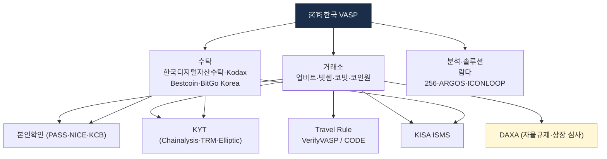
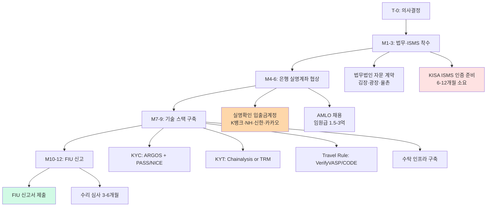

# 한국 시장 솔루션 지도

> 한국 가상자산 AML **인프라를 만드는 회사들**. 이 글을 읽고 나면 신규 한국 VASP가 "처음부터 무엇을 구매하고 연동해야 하는가"의 지도가 머릿속에 생기고, 한국 특수 인프라(본인확인기관·DAXA·ISMS)를 국내 규제 문맥에서 이해할 수 있게 됩니다. 마지막 업데이트: 2026-04-17.

## TL;DR
- **KYC**: ARGOS Identity, ICONLOOP MyID, NICE·KCB(본인확인기관), Sumsub(글로벌)
- **본인확인**: PASS, 카카오인증, NICE, KCB, KISA 본인확인기관
- **KYT**: Chainalysis, TRM Labs, Elliptic (글로벌 4사 모두 한국 진입)
- **Travel Rule**: VerifyVASP (Upbit계) + CODE (빗썸·코빗·코인원 합작) + Notabene (글로벌)
- **수탁·MPC**: 한국디지털자산수탁 계열(신한은행 파트너), Kodax(KB+해시드+해치랩스), Bestcoin Custody, BitGo Korea(검토 진행)
- **거래 모니터링·Case Management**: 자체 구축 + Solidus Labs·NICE Actimize 일부

---

## 1. 한국 가상자산 산업 지도




### 한눈에 보기

```
[ 거래소 ]                   [ 수탁·Custody ]              [ 분석·솔루션 ]
업비트 (두나무)             신한은행 계열 수탁사             람다256, 블록체인 R&D 다수
빗썸                        Kodax (KB+해시드+해치랩스)       Chainalysis Korea
코빗 (NXC)                  BitGo Korea (검토)              TRM Labs Korea
코인원                      Bestcoin Custody                Elliptic
GOPAX                       (은행 자체 수탁 검토)           ARGOS Identity
한빗코                                                      ICONLOOP
프로비트                                                    오지스 등

[ 본인확인 ]                 [ 위험 데이터 ]                  [ 인프라 ]
PASS (이통3사)              World-Check                     KISA
NICE                        Dow Jones Risk Center           한국인터넷진흥원
KCB                         ComplyAdvantage                 (ISMS 인증)
카카오인증                   외교부 제재명단
```

### 실무 포인트

한국 VASP를 새로 설립할 때 **이 지도의 4개 축(거래소·수탁·분석·본인확인)을 모두 고려**해야 합니다. 하나라도 빠지면 FIU 신고가 안 되거나, 신고 후 검사에서 지적받습니다.

---

## 2. KYC · 본인확인

### 한국 특수: 본인확인기관

한국 「정보통신망법」의 "본인확인기관" 지정 받은 곳:

- **PASS** — SKT·KT·LG U+ 합작 (이통사 본인확인)
- **NICE 평가정보**
- **KCB (Korea Credit Bureau)**
- **금융결제원**
- **카카오인증**

가상자산 거래소가 KYC 시 거의 필수로 사용 (실명 + 휴대폰 + 신분증).

### 왜 본인확인기관이 필수인가

글로벌 KYC 벤더(Sumsub 등)가 아무리 좋아도, **한국 주민등록증의 실명·실주소·실제 본인 여부**를 확인하려면 결국 한국 법에서 지정한 본인확인기관을 거쳐야 합니다. 글로벌 벤더는 신분증 OCR·얼굴 매칭은 해도 **주민번호 실명 조회 권한**이 없기 때문. 실무 구성은 "글로벌 벤더(OCR·Liveness) + 한국 본인확인기관(실명 조회)" 하이브리드.

### KYC SDK·플랫폼

| 회사 | 강점 |
|---|---|
| **ARGOS Identity** | 한국 토종, 가상자산 거래소 다수 사용, 글로벌 KYC 지원 |
| **ICONLOOP (MyID)** | DID 기반, 신한은행 등 |
| **Sumsub** | 글로벌 1위 KYC, 한국 진입 활발 |
| **Onfido** | 글로벌, 일부 한국 사용 |
| **Veriff** | 글로벌 |
| **Jumio** | 글로벌, 신분증 검증 강세 |

### 실무 포인트

한국 거래소들은 대부분 **ARGOS Identity를 메인**으로 쓰고, 글로벌 고객 대응이 필요한 경우에만 Sumsub을 보조로 씁니다. ARGOS가 한국 주민등록증·운전면허증·외국인등록증 처리를 가장 안정적으로 하고, 한국 시간대 지원도 강점.

---

## 3. KYT · Blockchain Analytics (한국 진입)

### 글로벌 4사 모두 진입

- **Chainalysis** — 한국 사무소, 람다256과 합작 (VerifyVASP)
- **TRM Labs** — 한국 영업 활발
- **Elliptic** — 한국 진입
- **Crystal Intelligence** — 한국 진입
- **Merkle Science** — 한국 일부

### 한국 자체

글로벌 attribution을 따라가기 어려워 **토종 KYT 회사는 적음**. 일부 블록체인 R&D 회사가 자체 분석 모듈 보유.

### 실무 포인트

한국 고유 특성상 **한국 중소 거래소·불법 사이트 attribution** 은 글로벌 벤더가 약한 영역. 대형 거래소들은 Chainalysis·TRM에 **한국 특화 라벨 DB를 자체 구축**해서 결합 사용합니다. 이 자체 DB를 만들어가는 것도 몇 년씩 걸리는 작업.

---

## 4. Travel Rule — 양강 구도

### 시장 구조

| 솔루션 | 회원사 | 운영자 |
|---|---|---|
| **VerifyVASP** | Upbit + 글로벌 다수 | 람다256 (두나무) + Chainalysis |
| **CODE** | 빗썸, 코빗, 코인원 | 코드 (3사 합작법인) |

### 두 솔루션 연동

2022-03-25 시행 직후 **분리 상태** → 이용자 민원 폭주 → 1개월 후 연동 완료. 현재 4대 거래소 간 자유 송금 가능.

### 글로벌 호환

- Notabene Gateway 사용 시 글로벌 1,500+ VASP 호환
- VerifyVASP 자체도 글로벌 회원사 다수

### 실무 포인트

신규 VASP에게 가장 흔한 선택 문제는 **VerifyVASP vs CODE vs Notabene**. 한국 고객 중심이면 VerifyVASP·CODE 중 하나, 글로벌 고객 있으면 Notabene 추가. "셋 다 가입"은 운영 부담이 크므로 실제로는 드뭅니다.

---

## 5. 수탁 (Custody)

| 회사 | 모델 | 비고 |
|---|---|---|
| **신한은행 계열 수탁사** | 거래소·블록체인사·R&D 합작 모델, 시중은행 파트너 | 상장사·재단·일반법인 등 고객 세그먼트별 라인업 |
| **Kodax** | KB국민은행 + 해시드 + 해치랩스 | KB금융 산하 |
| **Bestcoin Custody** | 우리은행 등 | |
| **BitGo Korea** | 글로벌 BitGo 한국 | 검토 단계 |
| (자체 운영) | 거래소 자체 수탁 | Upbit, 빗썸 등 |

### 수탁 기술 스택

- **MPC (Multi-Party Computation)**: Fireblocks, Copper, Coinbase Cloud, BitGo
- **HSM (Hardware Security Module)**: Thales, Ledger Enterprise
- **Cold Storage**: 물리적 격리
- **Multi-sig**: BTC 2-of-3, ETH Gnosis Safe

### 실무 포인트

2024-07 가상자산이용자보호법 시행 이후 한국 수탁업 시장이 **은행계열 + 블록체인 R&D 합작** 형태로 빠르게 재편됐습니다. 순수 테크 스타트업으로는 규제 대응 비용이 커서, **시중은행이 돈을 대고 블록체인 R&D가 기술을 대는** 조합이 주류가 됐습니다.

---

## 6. 거래 모니터링·Case Management

### 한국 시장 현실

- 대형 거래소는 **자체 구축** 위주
- 소규모는 글로벌 솔루션 + 한국 컨설팅 결합

### 글로벌 솔루션 (한국 도입)

| 회사 | 강점 |
|---|---|
| **NICE Actimize** | 전통 금융 강세, 가상자산 확장 |
| **Solidus Labs** | 시세조종 + AML 결합 |
| **Hummingbird** | Modern UX, US 인기 |
| **Unit21** | API-first, fintech 인기 |
| **Featurespace** | ML 기반 |

### 실무 포인트

Case Management 도구는 **분석가 생산성을 3배까지 바꾸는** 영역. 한국 거래소들은 자체 구축을 택하는 경우가 많은데, 이는 **자사 데이터 포맷·KYC 필드와 긴밀한 통합**이 필요하기 때문. 다만 소규모 VASP는 글로벌 Unit21·Hummingbird를 쓰면 출발 속도가 훨씬 빠릅니다.

---

## 7. 컨설팅·자문

### 법무법인 (가상자산 강세)

- **김·장 법률사무소** — 가상자산 전문 그룹
- **법무법인 광장** — Tech 강세
- **율촌**
- **세종**
- **태평양**
- **화우**

### 컨설팅

- **Big 4** (PwC, EY, Deloitte, KPMG) 한국 — 가상자산 컴플라이언스 자문
- **법무법인 + IT 보안 + 컴플라이언스 컨설팅** 결합 형태

### 실무 포인트

한국 가상자산 규제는 법령·시행령·감독규정·가이드라인이 4층 구조로 복잡해서 **법무법인 자문이 필수**입니다. 특히 FIU 신고 준비·Travel Rule 개인정보 보호·2단계 입법 대응은 내부 법무만으로 감당하기 어렵고, 외부 대형 법무법인과의 정기 자문 계약이 표준.

---

## 8. 정보보안·ISMS

VASP 신고 시 필수:

- **KISA (한국인터넷진흥원)** — ISMS 인증 발급
- **ISMS-P (개인정보 포함)** — 강화된 인증
- 외부 컨설팅: 안랩, 시큐아이, 이스트시큐리티 등

### 실무 포인트

ISMS 인증 준비는 평균 **6개월~1년** 걸리는 대형 프로젝트입니다. VASP 신고를 계획한다면 **ISMS 인증 취득을 가장 먼저 시작**해야 하고, 이 기간이 사실상 신고 시점을 결정합니다.

---

## 9. 협회·자율규제

| 단체 | 역할 |
|---|---|
| **한국블록체인협회** | 가상자산 산업 협회 |
| **DAXA (디지털자산거래소공동협의체)** | 4대 거래소(업비트·빗썸·코빗·코인원) 자율규제 |
| **한국디지털자산사업자연합회** | 일부 사업자 |

DAXA는 자율적으로 **상장 심사 가이드라인**, **공동 모니터링** 등 운영.

### 실무 포인트

DAXA 기준은 법적 강제력은 없지만 **사실상 산업 표준**입니다. 신규 프로젝트가 한국 상장을 준비할 때 DAXA 기준을 맞추는 게 1차 관문이고, 이 기준 미달이면 4대 거래소 어디에도 상장이 어렵습니다.

---

## 10. 인접 분야 — Stablecoin

### 한국 stablecoin 발행 시도

- 2026년 시점 한국 stablecoin 정식 발행은 제한적
- 2단계 입법에서 stablecoin 규율 다룰 예정
- **글로벌 USDT·USDC**가 한국 거래소에서 활발 거래
- **Tether·Circle**의 OFAC 협조 시 freeze 영향

### 실무 포인트

한국 원화 기반 stablecoin은 규제 공백 상태로 2026년 현재까지 정식 출시가 안 됐습니다. 2단계 입법이 통과되면 **은행·보험사 주도의 stablecoin 발행**이 가능해질 것으로 예상되며, 이는 가상자산 업계의 판도를 크게 바꿀 수 있는 변수.

---

## 11. 한국 시장 진입 시 고려사항

```
□ FIU 신고 (특금법) — 3년 갱신
□ ISMS 인증 (KISA)
□ 실명확인 입출금계정 (거래소만, 은행 제휴)
□ Travel Rule 솔루션 가입 (VerifyVASP 또는 CODE)
□ KYT 벤더 선정 (글로벌 4사 + 한국 특화)
□ 본인확인기관 연동 (PASS 등)
□ AML 인력 + AMLO 임명
□ 가상자산이용자보호법 (자산 분리 보관)
□ 거래기록 15년 보존 시스템
□ 외부지갑 등록제 운영
□ 한국어 + 한국 시간대 24/7 컴플라이언스 인력
```

---

## 12. DAXA — 디지털자산거래소 공동협의체

### 12.1 법적 정체성

**DAXA (Digital Asset eXchange Association)**: 한국 **원화 거래소 5개사(Upbit·Bithumb·Coinone·Korbit·GOPAX)** 자율협의기구. 2022-06 설립.

- **법적 지위**: **민간 자율규제기구** — 법정 기구 아님
- **강제력**: **직접적 법적 강제력 없음** — 회원사 간 **자율 합의** 기반
- **감독 관계**: 금융위·FIU의 **비공식 파트너** — 정책 제안·의견 수렴 채널

### 12.2 주요 역할

1. **공동 상장 심사 표준** — 신규 코인 상장 전 회원사 공동 평가
2. **공동 제재 주소 리스트** — 이상 지갑·mixer·해킹 피해 주소 공유
3. **위기 공동 대응** — 대형 해킹·사건 발생 시 공동 성명·대응
4. **규제 대응 창구** — 금융위·FIU 제안서 공동 제출

### 12.3 DAXA 준칙 위반의 실제 영향

법적 강제력은 없으나 **실질적 영향**은 큼:

| 시나리오 | 결과 |
|---|---|
| 위험 코인 단독 상장 | **DAXA 다른 4사 상장 거부** → 유동성 급락 |
| 공동 블랙리스트 주소 거래 허용 | **공동 성명으로 공개 경고** → 평판·규제 리스크 |
| 위기 공동 대응 불참 | **업계 내부 평판 저하** |
| 회원사 탈퇴 | **한국 4대 (대형) 거래소 정체성 박탈** |

DAXA에서 회원사 탈퇴한 사례는 거의 없으며(GOPAX는 가입 시점이 뒤늦음), 실질적으로 **탈퇴 = 한국 VASP 생존 불가**.

### 12.4 DAXA 가입 조건

공식 조건은 아래 모두 충족:
- 한국 FIU 신고 VASP
- **원화 거래(KRW pair) 지원**
- ISMS·실명계좌 등 기본 요건
- 일정 규모 이상 (거래량·수수료 수익 등, 비공개)

### 12.5 주요 공동 가이드 (2025~2026)

- **2024-06 NFT 가이드**: NFT 수집품의 가상자산 적용 여부 기준
- **2025-03 Tornado Cash 대응**: OFAC 해제 후에도 High-Risk 유지
- **2025-09 Staking 미출시 합의**: FIU 가이드라인 대기 (legal 불확실)
- **2026-02 Travel Rule 확장**: 카운터파티 범위 확장

### 12.6 실무 포인트

신규 한국 VASP가 **DAXA 가입 조건 충족 못 하면** 다음 제약 발생:
- 유의미한 원화 파트너 은행 계약 어려움 (대형 은행은 DAXA 4대만)
- 글로벌 VASP와의 연계·Travel Rule 호환성 낮음
- FIU 정책 모니터링 채널 제한

이 때문에 **DAXA 가입이 사실상 "준(準) 라이선스"** 역할.

## 💼 실무 현장 (Industry Reality)

### 신규 VASP가 처음 도입해야 할 순서 — 12개월 로드맵



### 단계별 투자 규모 (2026 기준 추정)

| 단계 | 주요 비용 | 연간 비용 |
|---|---|---|
| 초기 셋업 | ISMS 인증·법무·컨설팅 | ₩5~10억 |
| 인력 | AMLO(임원) + 분석가 5명 + KYT 엔지니어 2명 | ₩10~15억 |
| 벤더 계약 | Chainalysis + VerifyVASP/CODE + ARGOS | ₩5~8억 |
| 인프라 | AWS + 보안 + 모니터링 | ₩3~5억 |
| **합계 (연간)** | | **₩25~40억** |

### 한국 VASP가 넘어야 할 3대 관문

1. **ISMS 인증** (6~12개월):
   - KISA 발급, 연 1회 사후심사
   - 실패율 높음, 외부 컨설팅(안랩·시큐아이) 필수
   - 비용: 인증 수수료 + 컨설팅 약 ₩1~3억

2. **은행 실명계좌 제휴**:
   - 1 VASP-1 은행 원칙 → 은행이 사실상 거부권
   - K뱅크(Upbit), NH(Bithumb), 카카오뱅크(Coinone), 신한(Korbit) 제외 신규 어려움
   - 제휴 성공률 매우 낮음 — 대부분 신규는 **원화마켓 포기·코인마켓만 운영**

3. **FIU 신고 수리 심사** (3~6개월):
   - 2026-01 개정으로 대주주까지 자격심사
   - 실제 수리율 추정 ~30%
   - 거절 시 재신청 부담

### 신규 VASP가 가장 자주 하는 실수

- **ISMS를 나중에 준비**: 최소 6개월이라 마지막에 하면 전체 일정 지연
- **AMLO를 팀장급으로 임명**: 특금법은 임원급 요구. 즉시 지적.
- **KYT 벤더를 1개만 도입**: 글로벌 진출 시 커버리지 부족
- **Travel Rule 솔루션 하나만 가입**: 4대 거래소 연동 실패 가능
- **외부지갑 등록제 미운영**: DAXA 자율규제지만 FIU 검사에서 지적

### 한국 AML 인재 시장 (2026)

| 포지션 | 연봉 범위 | 채용 난이도 |
|---|---|---|
| 주니어 Analyst (1~3년) | 4,500~6,500만원 | 중 |
| 시니어 Analyst (5년+) | 7,000~9,500만원 | 상 |
| AML 팀장 | 1.0~1.5억 | 상 |
| KYT 엔지니어 | 6,000만원~1.2억 | 상 |
| AMLO (임원) | 1.5~3억 + 옵션 | **상상** |
| 금감원·FIU 출신 | 2~4억 (경력 후 이직) | 희소 |

**희소성 순위**: FIU 출신 AMLO > 은행 AML 팀장 출신 > KYT 엔지니어 > Analyst

### 2단계 입법 대응 준비

업계가 미리 준비하는 방향:

- **발행·유통 분리**: 자기 토큰 상장 자율 제한
- **스테이블코인 규율**: 원화 KRW 페그 stablecoin 발행 은행·보험사 협의 활발
- **외국 VASP 역외 적용**: 한국 고객 유치 시 사전 신고 의무화 예상
- **DeFi·DAO**: 프론트엔드 운영자 규제 타겟화

### 자주 나오는 오해

- **"한국은 글로벌 표준 따라가니 한국 벤더 없어도 됨"** — 본인확인기관·실명계좌·DAXA는 **한국 고유**. 글로벌 벤더만으로 불가.
- **"ARGOS보다 Sumsub이 좋다"** — Sumsub은 글로벌 우수하지만 **한국 주민등록증 정확도·한국어 지원**은 ARGOS가 우위. 상황 따라 선택.
- **"수탁은 큰 시장이라 신규 진입 쉽다"** — 은행 지주사 계열(KODA·KDAC)이 이미 자리 잡음. 독립 수탁 진입 매우 어려움.
- **"2단계 입법 나오면 하자"** — 2단계 방향은 이미 예측 가능. **선제 대응한 기업이 유리**.

### 한국 특수 현실 — 정책·기관 네트워크

- **금융위·FIU 출신 네트워크**: 대형 거래소 AMLO·CCO의 상당수가 금감원·FIU 출신. 업계와 규제의 **회전문 현상** 명확
- **DAXA 내부 소통**: 4대 거래소 AMLO 월 1회 비공식 모임. 공동 블랙리스트·공동 대응
- **국정원·KISA 연결**: 북한·랜섬웨어·Lazarus 대응은 민간 단독 불가. 공공기관과 상시 채널
- **언론·규제의 연결**: 언론 보도가 감독기관 검사 우선순위에 큰 영향. 평판 관리 중요

### 실제 신규 VASP 케이스 스터디 (2024~2025)

**성공 사례**: GOPAX, Coinbit 등 — ISMS + FIU 신고 모두 통과. 다만 **원화마켓 제휴 실패**로 코인마켓만 운영 → 수익성 제한

**실패 사례**: 다수 중소 거래소 — ISMS 취득 실패·AMLO 확보 실패·대주주 변동으로 신고 거절. 2024년 이후 폐업 다수

### 한국 VASP 설립 시 초기 6개월 우선순위

1. **법무법인 자문 계약** + **AMLO 영입**(임원급)
2. **ISMS 인증 착수** (외부 컨설팅 포함)
3. **은행 실명계좌 협상** (원화마켓 시)
4. **KYT 벤더 PoC** (Chainalysis·TRM 양사)
5. **KYC 벤더 선정** (ARGOS + 본인확인기관)
6. **Travel Rule 솔루션 검토** (VerifyVASP/CODE/Notabene)

---

## 더 읽을거리
- [`analytics-vendors.md`](analytics-vendors.md) — KYT 글로벌 벤더
- [`travel-rule-vendors.md`](travel-rule-vendors.md) — Travel Rule 벤더
- [`../2-regulations/korea-fiu-act.md`](../2-regulations/korea-fiu-act.md) — 특금법
- [`../2-regulations/korea-user-protection.md`](../2-regulations/korea-user-protection.md) — 가상자산이용자보호법
- [DAXA 공식](https://www.daxa.or.kr/)
- [한국블록체인협회](https://www.kblockchain.org/)
- [KISA — ISMS 인증](https://isms.kisa.or.kr/)
