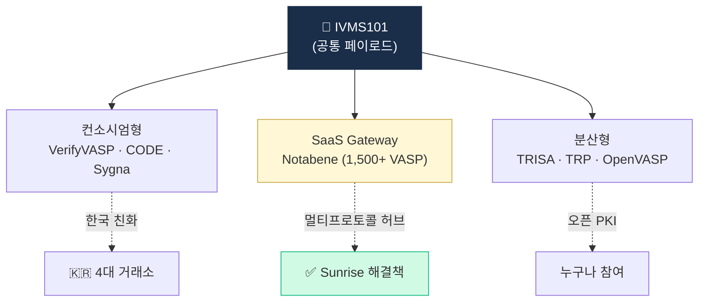
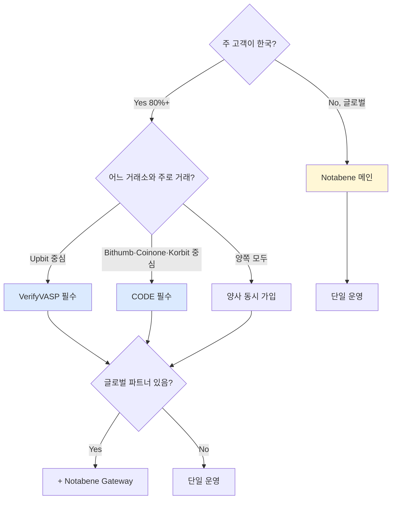

# Travel Rule 벤더 — 시장 지도

> 메시징 프로토콜 + Travel Rule SaaS 시장. 이 글을 읽고 나면 "한국에서는 왜 VerifyVASP·CODE·Notabene 이 3개가 사실상 전부인지"를 시장 구조적으로 설명할 수 있게 됩니다. 마지막 업데이트: 2026-04-17.

## TL;DR
- 시장 양상: **컨소시엄형 (VerifyVASP, CODE, Sygna)** vs **SaaS Gateway (Notabene)** vs **분산형 (TRISA, TRP)**
- 한국 양강: **VerifyVASP** (Upbit + 글로벌) + **CODE** (빗썸·코빗·코인원)
- 글로벌 1위: **Notabene** (1,500+ VASP, 멀티프로토콜 게이트웨이)
- 핵심 선택 기준: **카운터파티 호환성** + **Sunrise 대응** + **IVMS101 충실도**

---

## 1. 시장 구조 — 3가지 모델




```
[ 메시지 표준: IVMS101 (모두 공통 사용) ]
                  │
   ┌──────────────┼──────────────┬──────────────────┐
   ▼              ▼              ▼                  ▼
컨소시엄형        SaaS           분산형            특화형
─────────       ─────          ─────             ─────
VerifyVASP     Notabene       TRISA            Sumsub TR
CODE           Sumsub TR      TRP              Sygna
Global TR      Global TR      OpenVASP         (KYC 통합)

사전 검증     멀티프로토콜    오픈 PKI          KYC 결합
회원사만      Gateway         누구나 참여
```

### 세 모델의 본질적 차이

- **컨소시엄형** — "서로 신뢰할 수 있는 회원사끼리만 주고받자". 진입 장벽 높음, 신뢰 자동화.
- **SaaS Gateway** — "우리가 다양한 프로토콜을 중개해준다". 다수 프로토콜 연결의 허브.
- **분산형** — "누구나 인증서로 참여할 수 있다". 오픈이지만 식별 인프라 별도 필요.

---

## 2. 주요 벤더 상세

### A. Notabene — 글로벌 1위 게이트웨이

- **본사**: 미국 뉴욕, 2020 설립
- **포지션**: **글로벌 1위 + 멀티프로토콜 Gateway**
- **사용자**: 1,500+ VASP
- **특징**:
  - **Notabene Gateway** — TRISA·TRP·VerifyVASP·CODE 등 다중 프로토콜 동시 연결
  - **Sunrise Issue 해결책**으로 부상
  - VASP Discovery 통합
- **장점**: 한 번 연결로 글로벌 호환
- **약점**: 기업 가입비, 운영자 의존

**왜 대세가 됐나**: Sunrise Issue — 전 세계 VASP가 서로 다른 프로토콜을 쓰는 현실에서 모든 프로토콜을 직접 구현하는 건 공수·비용이 너무 큼. Notabene이 "우리가 다 연결해주겠다"는 SaaS 모델로 빈자리를 정확히 채웠습니다.

### B. VerifyVASP — 한국·아시아 컨소시엄

- **운영**: 람다256 (두나무 자회사) + Chainalysis
- **포지션**: **한국 + 아시아 컨소시엄**
- **사용**: Upbit, Bithumb Singapore, OKX 등 글로벌
- **특징**:
  - 사전 검증 컨소시엄 (closed)
  - **Chainalysis attribution 통합** — Travel Rule 메시지 + KYT 동시 커버
  - 한국 4대 거래소 중 Upbit 채택
- **장점**: 회원사 신뢰성, 한국 친화
- **약점**: 비회원사와 직접 호환 X (CODE·Notabene와 연동 필요)

### C. CODE (CodeVASP) — 한국 3사 합작

- **운영**: 코드 (빗썸 + 코빗 + 코인원 합작법인)
- **포지션**: **한국 컨소시엄**
- **사용**: 빗썸, 코빗, 코인원 + 일부 외부
- **특징**:
  - 폐쇄형 컨소시엄
  - 2022 시행 시점부터 운영
  - VerifyVASP와 연동
- **장점**: 한국 시장 깊이, 합작 거래소 자체 운영
- **약점**: 글로벌 호환성 한정

### D. Sumsub Travel Rule — KYC 통합

- **본사**: 영국 (Sumsub은 KYC 1위 중 하나)
- **포지션**: **KYC + Travel Rule 통합**
- **특징**: KYC SDK 사용 중인 VASP에게 자연스러운 추가
- **장점**: KYC와 동일 인프라
- **약점**: KYC 미사용 시 매력 적음

### E. Sygna — 아시아 강세

- **운영**: CoolBitX (대만)
- **포지션**: **아시아권 강세**
- **사용**: 일본, 동남아 거래소 다수
- **특징**: 자체 hub 구조

### F. Global Travel Rule (GTR)

- **운영**: BitGo 등 컨소시엄
- **사용**: 일부 미국·중남미

### G. TRISA — 분산형 오픈소스

- **운영**: 비영리 (CipherTrace 시작 → Mastercard 인수)
- **포지션**: **분산형 오픈소스**
- **특징**: PKI 기반, gRPC, 오픈
- **사용**: 일부 LATAM, 신흥시장

### H. TRP (Travel Rule Protocol)

- **운영**: 21 Analytics + ING 등
- **특징**: REST API 기반, 가벼움

### 실무 포인트

한국 시장에서 4번째 이후 벤더(Sumsub, Sygna 등)는 **특정 상황에서만 의미**가 있습니다. 주력은 VerifyVASP·CODE·Notabene 3개 중 선택. 신규 VASP라면 먼저 Notabene으로 빠르게 진입하고, 시장 안정화 후 한국 컨소시엄 가입을 검토하는 단계적 전략이 가장 흔합니다.

---

## 3. 벤더 선택 매트릭스

### 이 표를 어떻게 읽어야 하나

회사 유형별 추천. "한 번에 모두 해결"하는 솔루션은 거의 없고, **메인 프로토콜 + 글로벌 호환 확장**의 조합이 표준. 한국 대형 거래소가 "VerifyVASP + Notabene" 처럼 양쪽을 쓰는 이유.

| 회사 유형 | 추천 |
|---|---|
| **한국 거래소 (대형)** | VerifyVASP 또는 CODE + Notabene Gateway (글로벌) |
| **한국 수탁업자** | (Travel Rule 적용 범위 검토 후) Notabene 또는 컨소시엄 |
| **글로벌 거래소** | Notabene Gateway (멀티프로토콜) |
| **소규모 VASP** | Notabene SaaS 또는 Sumsub (KYC 결합) |
| **EU CASP** | Notabene + TRP (TFR 임계 없음 대응) |
| **신흥시장 VASP** | TRISA (오픈소스, 무료 가능) |

---

## 4. 통합 vs 분리

### Travel Rule + KYT 통합 운영

```
KYC (Sumsub·ARGOS)
  └─ Travel Rule (Sumsub 또는 Notabene)
       └─ KYT (Chainalysis·TRM)
            └─ Risk Engine (자체)
```

### 통합형 단일 벤더

- Sumsub: KYC + Travel Rule
- TRM Labs: KYT + Travel Rule (TRM Travel Rule)
- Chainalysis: KYT (Travel Rule 자체 모듈은 미약, VerifyVASP 합작 통해 제공)

### 실무 포인트

"단일 벤더가 다 해준다"는 편리함은 있지만 **벤더 종속 리스크**가 큼. 시스템 장애 시 영향 범위가 넓고, 벤더 교체가 어려워집니다. 각 영역별 최적 벤더를 선택하고 내부 Risk Engine에서 통합하는 구조가 규모 있는 회사의 선택.

---

## 5. 한국 시장 운영 패턴 (2026 기준)

```
Upbit (VerifyVASP 회원)
  ├─ 빗썸·코빗·코인원 (CODE) → VerifyVASP ↔ CODE 연동으로 송수신
  ├─ 글로벌 VASP → VerifyVASP 직접 또는 Notabene Gateway
  └─ 미연결 VASP → 송금 거절 또는 수동 검토

빗썸·코빗·코인원 (CODE 회원)
  ├─ Upbit → CODE ↔ VerifyVASP 연동
  ├─ 글로벌 VASP → CODE 또는 Notabene Gateway
  └─ 미연결 → 동일

Custody · 신규 VASP
  └─ Travel Rule 적용 범위 점검 (직접 이전 행위 발생 시)
     ├─ 컨소시엄 가입 (VerifyVASP 또는 CODE) — 비용 + 검증
     └─ Notabene Gateway — 빠른 진입
```

### 실무 포인트

신규 VASP에게 가장 흔한 질문: "VerifyVASP에 가입할까 CODE에 가입할까?" 답은 **양쪽 다 가입**(운영 가능하면)이 이상적이지만, 현실적으로는 **Notabene 먼저 + 이후 컨소시엄 단계적 가입**이 현실적. 컨소시엄 가입은 사전 검증 과정이 수개월 걸릴 수 있습니다.

---

## 6. POC 체크리스트

```
□ 우리가 받는 카운터파티 VASP 호환 여부
□ IVMS101 메시지 정확도 (필드 누락·오류)
□ 응답 속도 (p99) — 사용자 UX 영향
□ Sunrise 폴백 정책 지원
□ 한국 100만원 임계 자동 계산
□ 미연결 카운터파티 처리 흐름
□ 메시지 보관 (15년) 지원
□ PII 암호화 + 한국 PIPA 호환
□ 한국어 + 한국 시간대 지원
□ 가격 모델 (트랜잭션당 vs 정액)
```

---

## 7. 가격 (참고치)

- 소규모: $20K~$50K/년 + 트랜잭션당 ~$0.10
- 중규모: $80K~$200K/년
- 대규모 거래소: $500K~$1M+/년
- 컨소시엄 가입비: 별도 (VerifyVASP·CODE는 회원사 협의)

### 실무 포인트

Travel Rule 비용은 **트랜잭션 규모에 연동**되는 경우가 많아서, 거래량이 급증할 때 비용이 예상을 넘을 수 있습니다. 계약 시 **볼륨 상한과 추가 요금 구조**를 명확히 해두는 게 중요.

---

## 8. 미래 트렌드

### 표준화·단일화

- IVMS101 v2 등 표준 발전
- DTI (ISO 24165) 토큰 식별자 + LEI 결합
- AI 기반 자동 매칭

### 호환성 강화

- 멀티프로토콜 Gateway 표준화
- VASP Directory 글로벌화

### Privacy 강화

- ZKP 기반 PII 보호
- Selective disclosure

### FATF R.16 개정 반영

- 2026 후반 가이던스 → 모든 벤더 업데이트
- 2030 발효 대비 시스템 차세대화

## 💼 실무 현장 (Industry Reality)

### Notabene Gateway vs 한국 컨소시엄 선택 기준 (실제 결정 트리)



### 실제 한국 VASP의 Travel Rule 스택 (2026-Q1)

| 거래소 | 메인 | 글로벌 확장 | 비고 |
|---|---|---|---|
| Upbit | VerifyVASP | Notabene Gateway | Chainalysis 통합 |
| Bithumb | CODE | Notabene Gateway | |
| Coinone | CODE | 글로벌 확장 검토 중 | |
| Korbit | CODE | 제한적 | 보수적 운영 |

### 컨소시엄 가입 프로세스 실제 경험

**VerifyVASP 가입 (평균 2~4개월)**:
1. 서류 제출: 사업자등록, 특금법 신고 수리증, AMLO 정보, ISMS 인증
2. 기술 연동 테스트: API key 발급, sandbox 테스트, IVMS101 메시지 검증
3. 실운영 검증: 수 회 실제 메시지 송수신 후 승인
4. 월 회원비 + 거래당 수수료 지급

**CODE 가입 (평균 2~3개월)**:
1. 서류: 동일
2. 3사(빗썸·코빗·코인원) 합의 필요
3. 기술 연동 + 실운영 검증
4. 비용 구조는 VerifyVASP와 유사

### Notabene Gateway 실제 통합 경험

- **연동 공수**: 2~4주 (API 기반, SDK 제공)
- **비용**: 초기 연동비 + 월 구독 + 거래당 수수료 (글로벌 VASP 라우팅)
- **커버리지**: 1,500+ VASP, 대부분 글로벌 대형 거래소 포함
- **한국 연동**: VerifyVASP·CODE와 **간접 라우팅** — 직접 회원사 아니라 중개

### Sunrise Issue 실제 대응 — 한국 거래소 월간 패턴

대형 한국 거래소 월간 Travel Rule 실패 분석 (추정):

- **전체 시도**: ~30,000~50,000건 (100만원 이상 출금 기준)
- **카운터파티 식별 실패** (무명 VASP): ~5% → 수동 검토
- **미연결 VASP**: ~3% → 거절 or 수동
- **API timeout**: ~2% → 재시도
- **Schema mismatch**: ~1% → 폴백
- **성공**: ~89%

### 자주 나오는 오해

- **"VerifyVASP ↔ CODE 연동으로 한국 안에서는 완벽"** — 실무는 월 1~2회 API 장애·타임아웃. on-call 엔지니어 필수.
- **"Notabene만 있으면 글로벌 OK"** — 한국 거래소 연동은 **VerifyVASP/CODE 경유 간접**. 직접 회원사 필요 시 별도 가입.
- **"Travel Rule은 100만원 이상만"** — 한국 특금법 기준. **EU TFR은 1 EUR부터**. 글로벌 영업 시 가장 엄격 기준 필요.
- **"개인지갑 출금에도 Travel Rule"** — 개인지갑(unhosted)은 Travel Rule 대상 아님. 대신 **외부지갑 등록제** + Satoshi Test.

### 주니어 Travel Rule 엔지니어 하루

- **오전**: 전날 실패 로그 분석 (5~20건), 분류: timeout·schema·unknown
- **점심 전**: 신규 글로벌 VASP 연결 요청 처리 (Notabene Directory)
- **오후**: IVMS101 validator 업데이트 (EU TFR 필드 변경 등)
- **금요일**: 주간 Travel Rule 성공률 리포트 AMLO 제출

### 한국 특수 현실

- **VerifyVASP ↔ CODE 연동 3개월 공백 (2022-03~05)**: Upbit ↔ 빗썸 간 송금 불가 → 이후 **양사 동시 가입** 표준
- **외부지갑 등록 24h 홀드**: DAXA 공동 자율규제. Travel Rule과 별도 레이어
- **개인정보 국외이전**: PIPA 국외이전 동의 필요. 이용약관 포괄 동의로 처리하지만 PIPC 가이드 엄격화
- **FIU 정기 보고**: Travel Rule 실패율·거절율·수동 처리 건수를 분기별 FIU 보고 (비공식 모니터링)
- **Notabene 한국 미진출**: Notabene은 한국 공식 오피스 없음. 대형 거래소는 본사 계약, 중소는 거의 미사용

### 가격 협상 실제 팁

- **컨소시엄**: 회원사 합의 가격 (개별 협상 여지 적음)
- **Notabene**: 거래량 기반, 초기 6개월 할인 요청 가능
- **2~3년 장기 계약**: 15~25% 할인
- **락인 리스크**: 메시지 아카이브 export 조항 필수 (벤더 교체 시 이전 메시지 보존)

---

## 더 읽을거리
- [`analytics-vendors.md`](analytics-vendors.md) — KYT 벤더 비교
- [`korea-solutions.md`](korea-solutions.md) — 한국 시장 솔루션
- [`../3-crypto-aml/travel-rule.md`](../3-crypto-aml/travel-rule.md) — Travel Rule 운영
- [`../4-technology/travel-rule-protocols.md`](../4-technology/travel-rule-protocols.md) — 프로토콜 기술
- [Notabene 공식](https://notabene.id/)
- [VerifyVASP 공식](https://www.verifyvasp.com/)
- [CodeVASP 공식](https://www.codevasp.com/ko)
- [TRISA 공식](https://trisa.io/)
- [21 Analytics (TRP)](https://www.21analytics.co/)
- [Sumsub Travel Rule](https://sumsub.com/travel-rule/)
