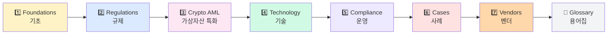

# 📖 Notes — 토픽별 학습 노트

> 가상자산 AML을 7개 카테고리 + 용어집으로 정리. 어디서부터 봐야 할지 모를 때 → 1번부터 순서대로.

---

## 🗂️ 카테고리 한눈에

---

## 📂 폴더 인덱스

### 1️⃣ [`1-foundations/`](1-foundations/) — 기초 (3 파일)
가장 먼저 읽기. AML 개념 + 가상자산이 왜 다른지 + 핵심 용어.

- [`what-is-aml.md`](1-foundations/what-is-aml.md) — AML이 뭔가? 자금세탁 3단계
- [`why-crypto-different.md`](1-foundations/why-crypto-different.md) — 왜 가상자산 AML은 다른가?
- [`key-concepts.md`](1-foundations/key-concepts.md) — KYC/KYT/CDD/EDD/STR/CTR/PEP/BO

### 2️⃣ [`2-regulations/`](2-regulations/) — 규제 (5 파일 + README)
누가 무슨 룰을 만드는가. 한국 → 글로벌 순.

- [`README.md`](2-regulations/README.md) — 규제 맵 + 핵심 일정
- [`korea-fiu-act.md`](2-regulations/korea-fiu-act.md) — 🇰🇷 특금법 (VASP 신고제)
- [`korea-user-protection.md`](2-regulations/korea-user-protection.md) — 🇰🇷 가상자산이용자보호법
- [`fatf.md`](2-regulations/fatf.md) — 🌐 FATF 권고안 (R.15, R.16)
- [`us-bsa-fincen.md`](2-regulations/us-bsa-fincen.md) — 🇺🇸 BSA / FinCEN / OFAC / GENIUS Act
- [`eu-mica-amlr.md`](2-regulations/eu-mica-amlr.md) — 🇪🇺 MiCA / AMLR / TFR

### 3️⃣ [`3-crypto-aml/`](3-crypto-aml/) — 가상자산 특화 (4 파일)
VASP가 떠안는 의무 + Travel Rule + 자금세탁 패턴.

- [`vasp-obligations.md`](3-crypto-aml/vasp-obligations.md) — VASP 9대 의무
- [`travel-rule.md`](3-crypto-aml/travel-rule.md) — Travel Rule (FATF R.16)
- [`onchain-typology.md`](3-crypto-aml/onchain-typology.md) — 온체인 자금세탁 7유형
- [`defi-nft-risks.md`](3-crypto-aml/defi-nft-risks.md) — DeFi / NFT / Privacy coin 리스크

### 4️⃣ [`4-technology/`](4-technology/) — 기술 (3 파일)
KYC/KYT 시스템 + 블록체인 분석 + Travel Rule 메시징.

- [`kyc-kyt.md`](4-technology/kyc-kyt.md) — KYC vs KYT
- [`blockchain-analytics.md`](4-technology/blockchain-analytics.md) — 클러스터링 + Attribution + Exposure
- [`travel-rule-protocols.md`](4-technology/travel-rule-protocols.md) — IVMS101 + TRP/TRISA/VerifyVASP/CODE/Notabene

### 5️⃣ [`5-compliance/`](5-compliance/) — 컴플라이언스 운영 (4 파일)
실제 운영. CDD/EDD 절차, STR 작성, 제재 스크리닝, 내부통제.

- [`cdd-edd.md`](5-compliance/cdd-edd.md) — 고객실사 + 강화실사
- [`str-ctr.md`](5-compliance/str-ctr.md) — 의심거래/현금거래 보고
- [`sanctions-screening.md`](5-compliance/sanctions-screening.md) — OFAC/UN/EU 제재 매칭
- [`internal-controls.md`](5-compliance/internal-controls.md) — 5 pillars + 3LoD + AMLO

### 6️⃣ [`6-cases/`](6-cases/) — 사례 (3 파일)
실제 사건에서 배우기.

- [`lazarus-dprk.md`](6-cases/lazarus-dprk.md) — DPRK Lazarus + Bybit $1.5B
- [`tornado-cash.md`](6-cases/tornado-cash.md) — DeFi 첫 OFAC 제재 → 해제
- [`major-enforcement.md`](6-cases/major-enforcement.md) — Binance $4.3B + OKX $500M+ 등

### 7️⃣ [`7-vendors/`](7-vendors/) — 벤더 (3 파일)
시장에 있는 솔루션 지도.

- [`analytics-vendors.md`](7-vendors/analytics-vendors.md) — Chainalysis / Elliptic / TRM / Crystal
- [`travel-rule-vendors.md`](7-vendors/travel-rule-vendors.md) — Notabene / VerifyVASP / CODE / TRISA
- [`korea-solutions.md`](7-vendors/korea-solutions.md) — 한국 시장 솔루션 지도

### 📖 [`glossary.md`](glossary.md) — 용어 사전
ABC 순 약어 + 한국어→영어 매핑.

---

## ⚡ 빠른 진입 — 상황별

| 상황 | 추천 |
|---|---|
| 🆕 AML 처음 들어봄 | [`1-foundations/what-is-aml.md`](1-foundations/what-is-aml.md) |
| 🇰🇷 한국 규제만 알고 싶음 | [`2-regulations/korea-fiu-act.md`](2-regulations/korea-fiu-act.md) |
| 🌐 Travel Rule 헷갈림 | [`3-crypto-aml/travel-rule.md`](3-crypto-aml/travel-rule.md) |
| 🔬 온체인 분석 원리 | [`4-technology/blockchain-analytics.md`](4-technology/blockchain-analytics.md) |
| 📋 STR 어떻게 작성? | [`5-compliance/str-ctr.md`](5-compliance/str-ctr.md) |
| 💥 Bybit hack 자세히 | [`6-cases/lazarus-dprk.md`](6-cases/lazarus-dprk.md) |
| 🛒 KYT 벤더 비교 | [`7-vendors/analytics-vendors.md`](7-vendors/analytics-vendors.md) |
| 🔤 약어 모름 | [`glossary.md`](glossary.md) |

---

## 🔗 관련

- 📅 60일 데일리 챌린지 → [`../curriculum/`](../curriculum/)
- 🛠️ 자동화 미니 프로젝트 → [`../projects/`](../projects/)
- 🎓 깊이 학습 → [`../deep/`](../deep/)
- 🏠 메인 → [`../README.md`](../README.md)
